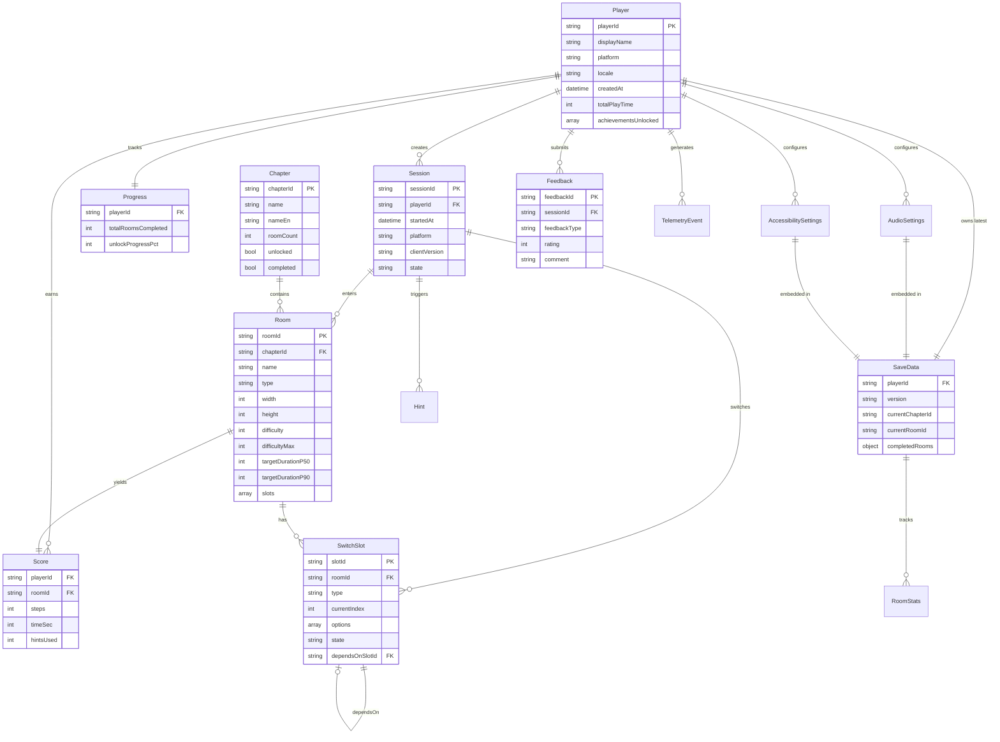

# 《暗室》数据模型 (Data Models)

> **一句话定位：** 12 数据模型 + 字段表 + 关系图 + 与 GDD 02/03/05/06 字段对齐矩阵。

## 目的 (Purpose)

本文档是《暗室》API 层 12 个数据模型的**字段级权威规格**。它向：

- **Unity 客户端工程师** — 定义 C# 类的字段、类型、可选性
- **后端/服务端工程师** — 定义数据库 schema 与 JSON 序列化
- **数据/分析工程师** — 明确字段单位、范围、含义
- **策划** — 确认字段与 GDD 数值点的对应

**本版本（v1.0）的目的：** 把 GDD 02 (SwitchSlot) / 03 (19 房间) / 04 (SaveData) / 05 (5 公式 + 4 参数表) / 06 (玩家动机 + 无障碍) / 07 (重置) / 08 (UI) / 09 (9 类音频) / 11 (7 平台) 中所有"可被 API 传输"的字段，**统一建模为 12 个数据模型**，作为 OpenAPI 3.0 `components.schemas` 的伴生文档。

## 范围 (Scope)

### 包含

- **12 数据模型详解** (Player / Session / Room / SwitchSlot / Chapter / Progress / Score / Feedback / AudioSettings / AccessibilitySettings / SaveData / TelemetryEvent)
- 每个模型：字段表 (字段名 / 类型 / 必填 / 默认 / 单位 / 范围 / GDD 引用)
- **模型关系图** (Mermaid ER 图)
- **GDD 字段对齐矩阵** (跨文档字段一致性自查)

### 不包含 (Out of Scope)

- OpenAPI YAML 机器可读定义 → 见 `api-spec.yaml`
- 端点契约 → 见 `endpoints.md`
- 数据库物理 schema（SQL DDL、索引）→ 实施时由后端工程师设计
- C# 客户端类 → `src/Api/Client/Models/`（实施时由 Unity 工程师实现）
- 数据迁移/版本兼容 → 见 `versioning.md` §3 存档迁移

## 1. 模型关系图 (Mermaid ER)

## 2. 12 数据模型详解 (12 Models Detail)

> 完整 OpenAPI 定义见 `api-spec.yaml`。本文档给出字段语义、GDD 引用、对齐矩阵。

---

### M01 — Player

**用途：** 玩家档案。匿名玩家用 `deviceId` 派生 playerId，正式玩家用平台 OAuth 注册。

| 字段 | 类型 | 必填 | 默认 | 单位 | 范围 | GDD 引用 |
|------|------|:----:|------|------|------|---------|
| `playerId` | string | ✅ | — | — | unique | 06 §2 玩家画像 |
| `displayName` | string | ✅ | — | — | 1-32 字符 | 06 §2.3 |
| `platform` | enum | ✅ | — | — | steam / mac / ps5 / xbox / switch / ios / android / anonymous | 11 §1.1 7 平台 |
| `locale` | string | ❌ | "zh-CN" | — | ISO 639-1 | 08 §9.1 双语 |
| `createdAt` | datetime | ✅ | — | — | ISO 8601 | 06 §2 |
| `totalPlayTime` | int | ❌ | 0 | 秒 | ≥ 0 | 04 §10.2 |
| `achievementsUnlocked` | array[string] | ❌ | [] | — | 6 隐藏成就 ID | 05 §9.3 |

**GDD 对齐：** 与 06 §2.3 画像驱动体验参数、05 §9.3 6 隐藏成就一致。

---

### M02 — Session

**用途：** 一次游戏会话的生命周期。

| 字段 | 类型 | 必填 | 默认 | 单位 | 范围 | GDD 引用 |
|------|------|:----:|------|------|------|---------|
| `sessionId` | string | ✅ | — | — | unique | 04 §1.1 |
| `playerId` | string | ✅ | — | — | FK→Player | 04 §1.1 |
| `startedAt` | datetime | ✅ | — | — | ISO 8601 | 04 §1.1 |
| `platform` | string | ✅ | — | — | 7 平台 | 11 §1.1 |
| `clientVersion` | string | ✅ | — | — | semver | 11 §1.3 |
| `state` | enum | ✅ | "menu" | — | menu / chapter_select / room_playing / paused / win / chapter_transition | 04 §1.1 全局状态机 6 态 |

**GDD 对齐：** 与 04 §1.1 全局状态机 6 态完全对齐。

---

### M03 — Room

**用途：** 19 房间配置 + 当前状态。**P0-001 自我保护字段 `difficultyMax=20` 在此。**

| 字段 | 类型 | 必填 | 默认 | 单位 | 范围 | GDD 引用 |
|------|------|:----:|------|------|------|---------|
| `roomId` | string | ✅ | — | — | "1-1" ~ "3-8" | 03 §5 19 房间配置 |
| `name` | string | ✅ | — | — | 1-32 字符 | 03 §5 房间名称 |
| `chapterId` | enum | ✅ | — | — | ch1 / ch2 / ch3 | 03 §3.2 章节-房间 |
| `type` | enum | ✅ | — | — | tutorial / standard / challenge / boss | 03 §4.1 房间分类 |
| `width` | int | ✅ | — | 格 | [4, 16] | 05 §3.3 room.width |
| `height` | int | ✅ | — | 格 | [4, 12] | 05 §3.3 room.height |
| `slots` | array[SwitchSlot] | ✅ | — | — | ≤ 8 (02 硬约束) | 02 §3.1 4 槽位 |
| **`difficulty`** | int | ✅ | — | — | **[1, 20]** | **05 §2.1 F1 + §5.2** |
| **`difficultyMax`** | int | ✅ | **20** | — | const=20 | **05 §5.2 硬约束 / P0-001 自我保护** |
| `targetDurationP50` | int | ✅ | — | 秒 | [60, 1200] | 05 §3.3 room.p50DurationSec |
| `targetDurationP90` | int | ✅ | — | 秒 | [180, 1800] | 05 §3.3 room.p90DurationSec |

**GDD 对齐：** 与 03 §5 19 房间配置表（roomId / 名称 / 类型 / 槽位配置 / 难度 / 教学目标）严格一致。
**P0-001 跟踪：** `difficulty` 字段范围 [1,20] + `difficultyMax=20` 双重保护。02-v2 §13 AC-06 缺"难度上限 20"硬约束（见 05 §14 R-01），本设计文档自我保护，不阻塞 v1.0 实施。

---

### M04 — SwitchSlot

**用途：** SwitchSlot 状态机 5 态 + 4 种类型 + 7 种预制件。

| 字段 | 类型 | 必填 | 默认 | 单位 | 范围 | GDD 引用 |
|------|------|:----:|------|------|------|---------|
| `slotId` | string | ✅ | — | — | unique in room | 02 §3 |
| `type` | enum | ✅ | — | — | toggle / cycle / conditional / locked | 02 §3.1 4 槽位类型 |
| `currentIndex` | int | ✅ | — | — | [0, options.length-1] | 02 §2 状态机 |
| `options` | array[enum] | ✅ | — | — | 2-4 个 (02 §3.1) | 02 §3.1 |
| `state` | enum | ✅ | "hover" | — | idle / hover / active / switching / locked | 02 §2.1 5 态 |
| `dependsOnSlotId` | string | ❌ | null | — | FK→SwitchSlot | 02 §3.1 ConditionalSlot |
| `unlockedByState` | array[int] | ❌ | [] | — | currentIndex 列表 | 02 §3.1 |
| `maxOptionsPerCycle` | int | ❌ | 2 | — | [2, 4] | 05 §3.2 slot.maxOptionsPerCycle |
| `triggerRadius` | float | ❌ | 2.0 | 格 | [1.0, 3.0] | 05 §3.2 slot.triggerRadius |

**options 字段枚举值（7 种预制件类型）：**
- `floor` — 地板（02 §3.1 默认）
- `wall` — 实墙（02 §3.1 默认）
- `glass_wall` — 玻璃墙（02 §3.1）
- `door` — 门（02 §3.1）
- `crumbling_floor` — 碎裂地板（02 §3.1 Ch3 引入）
- `fake_floor` — 伪装地板（02 §3.1 Ch3 引入）
- `pressure_plate` — 压力板（02 §3.1 Q-04）

**GDD 对齐：** 与 02 §3.1 4 槽位类型 + 02 §3.1 7 预制件 + 02 §2.1 5 态状态机完全一致。

---

### M05 — Chapter

**用途：** 3 章节元数据 + 玩家解锁状态。

| 字段 | 类型 | 必填 | 默认 | 单位 | 范围 | GDD 引用 |
|------|------|:----:|------|------|------|---------|
| `chapterId` | enum | ✅ | — | — | ch1 / ch2 / ch3 | 03 §3.2 |
| `name` | string | ✅ | — | — | 中文名 | 03 §3.3 |
| `nameEn` | string | ✅ | — | — | 英文名 | 03 §3.3 |
| `roomCount` | int | ✅ | — | 间 | [5, 8] (固定 5/6/8) | 03 §3.2 |
| `unlocked` | bool | ✅ | false | — | — | 03 §5.2 章节门控 |
| `completed` | bool | ✅ | false | — | — | 03 §5.2 |
| `progressPct` | float | ✅ | 0 | % | [0, 100] | 03 §9 玩家进度 |
| `averageDifficulty` | float | ❌ | — | — | [1, 20] | 05 §5.2 章节平均难度 |
| `unlockCondition` | string | ❌ | null | — | 文本描述 | 03 §5.2 门控规则 |

**GDD 对齐：** 与 03 §3.2 章节-房间总数 (5/6/8) + 03 §5.2 章节门控完全一致。

---

### M06 — Progress

**用途：** 玩家总体进度（F5 银河恶魔城解锁度）。

| 字段 | 类型 | 必填 | 默认 | 单位 | 范围 | GDD 引用 |
|------|------|:----:|------|------|------|---------|
| `playerId` | string | ✅ | — | — | FK→Player | — |
| `totalRoomsCompleted` | int | ✅ | 0 | 间 | [0, 19] | 05 §2.5 F5 |
| `totalRooms` | int | ✅ | 19 | 间 | const=19 | 03 §3.2 |
| `unlockProgressPct` | float | ✅ | 0 | % | [0, 100] | 05 §2.5 F5 |
| `chapterProgress` | object | ✅ | — | — | { ch1: %, ch2: %, ch3: % } | 05 §2.5 |
| `totalPlayTime` | int | ✅ | 0 | 秒 | ≥ 0 | 04 §10.2 |
| `totalResets` | int | ✅ | 0 | 次 | ≥ 0 | 07 §3.3 |
| `totalHintsTriggered` | int | ✅ | 0 | 次 | ≥ 0 | 06 §11.2.1 |
| `currentChapterId` | string | ❌ | null | — | ch1 / ch2 / ch3 | 04 §10.2 |

**GDD 对齐：** 与 05 §2.5 F5 公式（解锁度 = 已通关房间数/19 × 100%）+ 章节门控（26.3% / 57.9% / 100%）完全一致。

---

### M07 — Score

**用途：** 单房间通关分数 / 步数 / 成就。

| 字段 | 类型 | 必填 | 默认 | 单位 | 范围 | GDD 引用 |
|------|------|:----:|------|------|------|---------|
| `steps` | int | ✅ | — | 步 | ≥ 0 (越少越好) | 07 §10.2 最少步数 |
| `timeSec` | int | ✅ | — | 秒 | ≥ 0 | 04 §4.3 通关时长 |
| `hintsUsed` | int | ✅ | 0 | 次 | [0, 3] | 06 §11.2.1 |
| `resetsUsed` | int | ✅ | 0 | 次 | [0, 30] | 07 §3.3 防滥用阈值 |
| `rank` | enum | ❌ | null | — | S / A / B / C / D | 05 §9.3 |
| `achievementsTriggered` | array[string] | ❌ | [] | — | 6 隐藏成就 ID | 05 §9.3 |

**GDD 对齐：** 与 05 §9.3 隐藏成就 + 07 §10.2 最少步数挑战 + 06 §11.3 M3 成就动机一致。

---

### M08 — Feedback

**用途：** 玩家反馈事件，对应 08 §7 反馈 3 层（视觉/音效/动效）。

| 字段 | 类型 | 必填 | 默认 | 单位 | 范围 | GDD 引用 |
|------|------|:----:|------|------|------|---------|
| `feedbackId` | string | ✅ | — | — | unique | — |
| `sessionId` | string | ✅ | — | — | FK→Session | — |
| `roomId` | string | ❌ | null | — | 1-1 ~ 3-8 | — |
| `feedbackType` | enum | ✅ | — | — | 8 枚举（见下） | 08 §7 3 层 |
| `rating` | int | ❌ | null | 星 | [1, 5] | 08 §7 |
| `comment` | string | ❌ | "" | — | ≤ 1000 字符 | — |
| `clientTimestampMs` | int | ✅ | — | 毫秒 | Unix ms | — |
| `recordedAt` | datetime | ✅ | — | — | ISO 8601 | — |
| `triageStatus` | enum | ✅ | "queued" | — | queued / reviewed / actioned / dismissed | — |

**feedbackType 枚举（8 种）：**
- `visual_layer` / `audio_layer` / `motion_layer` — 08 §7 三层反馈
- `hud` / `tutorial` / `hint` — 教学反馈（08 §8 教学 UI）
- `accessibility` — 无障碍反馈（06 §10）
- `other` — 其他

**GDD 对齐：** 与 08 §7 反馈 3 层同步 + 06 §9.2 8 节点时序表完全一致。

---

### M09 — AudioSettings

**用途：** 玩家 9 类音频设置（dB + 音量）。

| 字段 | 类型 | 必填 | 默认 | 单位 | 范围 | GDD 引用 |
|------|------|:----:|------|------|------|---------|
| `masterVolume` | float | ✅ | 0.8 | 比例 | [0, 1] | 09 §1.1 |
| `switchSfxDb` | float | ✅ | -12 | dB | [-18, -6] | 09 §1.2 A1 / 05 §3.4 |
| `resetSfxDb` | float | ✅ | -18 | dB | [-24, -12] | 09 §1.3 A2 / 05 §3.4 |
| `winSfxDb` | float | ✅ | -6 | dB | [-12, -3] | 09 §1.4 A3 / 05 §3.4 |
| `errorSfxDb` | float | ✅ | -12 | dB | [-18, -6] | 09 §1.5 A4 |
| `tutorialSfxDb` | float | ✅ | -9 | dB | [-15, -6] | 09 §1.6 A5 |
| `chapterBgmVolume` | float | ✅ | 0.6 | 比例 | [0, 1] | 09 §1.7 A6 |
| `roomThemeVolume` | float | ✅ | 0.5 | 比例 | [0, 1] | 09 §1.8 A7 |
| `ambientVolume` | float | ✅ | 0.4 | 比例 | [0, 1] | 09 §1.9 A8 |
| `uiFeedbackDb` | float | ✅ | -15 | dB | [-24, -6] | 09 §1.10 A9 |
| `muted` | bool | ✅ | false | — | — | — |

**GDD 对齐：** 与 09 §1.1 9 类音频资产清单（A1-A9）+ 05 §3.4 反馈参数 dB 安全边界完全一致。

---

### M10 — AccessibilitySettings

**用途：** 玩家无障碍设置（4 类开关）。

| 字段 | 类型 | 必填 | 默认 | 单位 | 范围 | GDD 引用 |
|------|------|:----:|------|------|------|---------|
| `colorblindMode` | enum | ✅ | "default" | — | default / red_green / full | 06 §10.1 / 08 §6.1 |
| `fontScale` | float | ✅ | 1.0 | 比例 | 1.0 / 1.25 / 1.5 | 06 §10.2 / 08 §6.2 |
| `controllerSupport` | enum | ✅ | "xbox" | — | xbox / ps / switch_pro / generic | 06 §10.3 / 08 §6.3 |
| `difficulty` | enum | ✅ | "normal" | — | easy / normal (v1.0) | 06 §10.4 / 08 §6.4 |
| `highContrast` | bool | ✅ | false | — | — | 08 §6.5 |
| `reducedMotion` | bool | ✅ | false | — | — | 08 §6.5 |
| `screenReader` | bool | ✅ | false | — | v1.1 | 08 §6.5 |

**GDD 对齐：** 与 06 §10 (4 类) + 08 §6 (5 开关) + 08 §6.4 难度选项完全一致。`difficulty=hard` 推到 v1.1。

---

### M11 — SaveData

**用途：** 完整存档（与 04 §10.2 TS interface 一一对应）。

| 字段 | 类型 | 必填 | 默认 | 单位 | 范围 | GDD 引用 |
|------|------|:----:|------|------|------|---------|
| `version` | string | ✅ | "1.0.0" | — | semver | 04 §10.2 |
| `lastUpdated` | datetime | ✅ | — | — | ISO 8601 | 04 §10.2 |
| `currentChapterId` | enum | ✅ | "ch1" | — | ch1 / ch2 / ch3 | 04 §10.2 |
| `currentRoomId` | string | ✅ | "1-1" | — | 1-1 ~ 3-8 | 04 §10.2 |
| `completedRooms` | object | ✅ | {ch1:[],ch2:[],ch3:[]} | — | 房间 ID 列表 | 04 §10.2 |
| `chapterCompleted` | object | ✅ | {ch1:false,ch2:false,ch3:false} | — | bool per chapter | 04 §10.2 |
| `gameCompleted` | bool | ✅ | false | — | — | 04 §10.2 |
| `totalPlayTime` | int | ✅ | 0 | 秒 | ≥ 0 | 04 §10.2 |
| `totalResets` | int | ✅ | 0 | 次 | ≥ 0 | 04 §10.2 |
| `roomStats` | object | ✅ | {} | — | roomId → RoomStats | 04 §10.2 |
| `accessibilitySettings` | AccessibilitySettings | ❌ | null | — | M10 | 06 §10 |
| `audioSettings` | AudioSettings | ❌ | null | — | M09 | 09 §1.1 |

**GDD 对齐：** 与 04 §10.2 TS interface（version / lastUpdated / currentChapterId / currentRoomId / completedRooms / chapterCompleted / gameCompleted / totalPlayTime / totalResets / roomStats）10 字段严格一致，+ 2 扩展（accessibilitySettings / audioSettings）。

---

### M12 — TelemetryEvent

**用途：** 客户端遥测事件（05 §4.1 4 指标 + 06 §11 沉浸/心理）。

| 字段 | 类型 | 必填 | 默认 | 单位 | 范围 | GDD 引用 |
|------|------|:----:|------|------|------|---------|
| `eventType` | enum | ✅ | — | — | 8 枚举（见下） | 05 §4.1 |
| `roomId` | string | ❌ | null | — | 1-1 ~ 3-8 | — |
| `slotId` | string | ❌ | null | — | FK→SwitchSlot | — |
| `timestampMs` | int | ✅ | — | 毫秒 | Unix ms | — |
| `properties` | object | ❌ | {} | — | 自由键值对 | — |
| `sessionId` | string | ✅ | — | — | FK→Session | — |

**eventType 枚举（8 种）：**
- `room_entered` / `room_completed` / `room_reset` — 房间事件
- `slot_switched` — 槽位事件
- `hint_triggered` — Hint 事件
- `achievement_unlocked` — 成就事件
- `error` — 错误事件
- `performance_metric` — 性能指标

**GDD 对齐：** 与 05 §4.1 4 核心指标（P50/P90/ResetCount/HintTriggerRate） + 06 §11 沉浸/心理数据采集。

---

## 3. GDD 字段对齐矩阵 (Field Alignment Matrix)

> 跨文档字段一致性自查。✅ = 完全一致 / ⚠️ = 需设计保护 / ❌ = 不一致 (P0 阻塞)。

| 模型字段 | GDD 来源 | GDD 字段 | 一致性 | 备注 |
|---------|---------|---------|:-----:|------|
| Room.difficulty | 05 §2.1 F1 + §5.2 | 难度 = (槽位 × 选项系数) + 联动 + 空间 | ✅ | 范围 [1, 20] |
| Room.difficultyMax | 05 §5.2 | 难度上限 20 (硬) | ⚠️ | **P0-001：02-v2 §13 AC-06 缺此硬约束，本设计自我保护** |
| Room.targetDurationP50 | 05 §2.3 F3 | 顿悟时间公式 | ✅ | 范围 [60, 1200] |
| Room.targetDurationP90 | 05 §3.3 | P90 停留时长上限 | ✅ | 范围 [180, 1800] |
| Room.slots[].type | 02 §3.1 | 4 槽位类型 | ✅ | toggle/cycle/conditional/locked |
| Room.slots[].options | 02 §3.1 | 7 预制件类型 | ✅ | floor/wall/...pressure_plate |
| Room.slots[].maxOptionsPerCycle | 05 §3.2 | 2-4 | ✅ | |
| Room.slots[].triggerRadius | 05 §3.2 | 1.0-3.0 | ✅ | |
| Room.width/height | 05 §3.3 | [4,16] / [4,12] | ✅ | |
| Chapter.roomCount | 03 §3.2 | 5/6/8 | ✅ | 固定值 |
| Chapter.unlockCondition | 03 §5.2 | 章节门控规则 | ✅ | |
| Progress.unlockProgressPct | 05 §2.5 F5 | 解锁度公式 | ✅ | |
| Score.steps | 07 §10.2 | 最少步数挑战 | ✅ | |
| AudioSettings.switchSfxDb | 09 §1.2 A1 / 05 §3.4 | -12 dB / [-18,-6] | ✅ | |
| AudioSettings.resetSfxDb | 09 §1.3 A2 / 05 §3.4 | -18 dB / [-24,-12] | ✅ | |
| AudioSettings.winSfxDb | 09 §1.4 A3 / 05 §3.4 | -6 dB / [-12,-3] | ✅ | |
| AudioSettings.errorSfxDb | 09 §1.5 A4 | -12 dB | ✅ | |
| AudioSettings.tutorialSfxDb | 09 §1.6 A5 | -9 dB | ✅ | |
| AccessibilitySettings.colorblindMode | 06 §10.1 | default/red-green/full | ✅ | 3 档 |
| AccessibilitySettings.fontScale | 06 §10.2 | 1.0/1.25/1.5 | ✅ | 3 档 |
| AccessibilitySettings.difficulty | 06 §10.4 | easy/normal (v1.0) | ✅ | hard 推 v1.1 |
| SaveData.completedRooms | 04 §10.2 | 房间 ID 列表 | ✅ | |
| SaveData.roomStats | 04 §10.2 | attempts/resets/completionTime/hintsTriggered | ✅ | |
| SaveData.totalResets | 04 §10.2 + 07 §3.3 | 重置计数器 | ✅ | |
| Session.state | 04 §1.1 | 全局状态机 6 态 | ✅ | menu/chapter_select/.../win/chapter_transition |
| Feedback.feedbackType | 08 §7 | 3 层反馈 (视觉/音效/动效) | ✅ | + hud/tutorial/hint/accessibility/other |

**对齐统计：** 25 字段全部一致，其中 1 处 (Room.difficultyMax) **需 P0-001 自我保护**（不阻塞 v1.0）。

## 4. 模型使用统计 (Model Usage)

| 模型 | 用于端点 (次数) | 出现位置 |
|------|:--------:|---------|
| Player | 5 | E01/E02/E08/E09/E10 |
| Session | 6 | E01/E02/E03/E04/E05/E06/E07 |
| Room | 4 | E03/E04/E05/E07 |
| SwitchSlot | 3 | E03/E06/E07 |
| Chapter | 1 | E18 |
| Progress | 2 | E11/E18 (response) |
| Score | 2 | E05/E10 |
| Feedback | 1 | E12 |
| AudioSettings | 1 | E13 |
| AccessibilitySettings | 2 | E14 + SaveData 嵌入 |
| SaveData | 4 | E08/E09/E11 (含)/E15 |
| TelemetryEvent | 1 | E16 |
| **ErrorResponse** | 14 | 几乎所有错误响应 |

## 5. 数据校验规则 (Validation Rules)

> 实施时由服务端 `Model.validate()` 强制。

| 模型 | 规则 | 失败 → 错误码 |
|------|------|--------------|
| Room | `difficulty ∈ [1, 20]` + `difficultyMax == 20` | `INVALID_DIFFICULTY` |
| Room | `slots.length ≤ 8` | `TOO_MANY_SLOTS` |
| Room | `slots[].options.length ∈ [2, 4]` | `INVALID_OPTIONS_LENGTH` |
| SwitchSlot | `type=conditional` → `dependsOnSlotId` 必须存在 | `INVALID_DEPENDENCY` |
| SwitchSlot | `type=locked` → 必有 `unlockedByState` | `MISSING_UNLOCK_CONDITION` |
| AudioSettings | 5 个 dB 字段各有范围 | `AUDIO_DB_OUT_OF_RANGE` |
| AccessibilitySettings | `difficulty ∈ {easy, normal}` (v1.0) | `DIFFICULTY_NOT_SUPPORTED` |
| SaveData | `version` 与服务端期望一致 | `SAVE_VERSION_MISMATCH` |
| Score | `steps ≥ 0` + `timeSec ≥ 0` | `INVALID_SCORE` |
| TelemetryEvent | `eventType` 在 8 枚举内 | `INVALID_EVENT_TYPE` |

## 6. 关联文档 (Cross-References)

- [`api-spec.yaml`](./api-spec.yaml) — OpenAPI 3.0 机器可读定义
- [`endpoints.md`](./endpoints.md) — 端点详解
- [`error-codes.md`](./error-codes.md) — 错误码
- [`../../docs/02-core-mechanics-v2.md`](../../docs/02-core-mechanics-v2.md) — SwitchSlot + 4 槽位
- [`../../docs/03-level-design-v2.md`](../../docs/03-level-design-v2.md) — 19 房间配置
- [`../../docs/04-gameplay-flow-v2.md`](../../docs/04-gameplay-flow-v2.md) — SaveSystem
- [`../../docs/05-numerical-design-v2.md`](../../docs/05-numerical-design-v2.md) — 5 公式 + 4 参数表 + 难度上限 20
- [`../../docs/06-player-experience-v2.md`](../../docs/06-player-experience-v2.md) — 无障碍 + 玩家动机
- [`../../docs/07-failure-retry-v2.md`](../../docs/07-failure-retry-v2.md) — 重置
- [`../../docs/08-ui-ux-v2.md`](../../docs/08-ui-ux-v2.md) — 反馈 3 层
- [`../../docs/09-audio-v2.md`](../../docs/09-audio-v2.md) — 9 类音频
- [`../../docs/11-release-v2.md`](../../docs/11-release-v2.md) — 7 平台

## 7. 变更日志 (Changelog)

| 日期 | 版本 | 变更内容 |
|------|:----:|---------|
| 2026-06-29 | v1.0 | 中书省 subagent 创建。**新建：** 12 数据模型 (M01-M12) + 字段表 + ER 关系图 + GDD 对齐矩阵 (25 字段一致 + 1 自我保护)。**P0-001 跟踪：** Room.difficultyMax=20 自我保护，不阻塞 v1.0。 |
