# 《暗室》组件图 (Component Diagrams · C4 Model)

> **一句话定位：** 3 层 C4 模型（Context L1 / Container L2 / Component L3）的 Mermaid 图，覆盖玩家、系统边界、客户端/服务端容器、14 模块组件视图。

## 目的 (Purpose)

本文档是《暗室》**架构可视化 (Architecture Visualization)** 的**唯一权威基线**。它向：

- **架构师** — 提供标准化的 C4 模型图（Context / Container / Component）做架构治理
- **新加入工程师** — 5 分钟看懂系统边界、容器划分、模块依赖
- **技术评审委员会** — 用于评审架构决策（ADR）的合理性
- **跨团队沟通** — 与 美术 / 策划 / QA / 运维 共享同一套架构图
- **文档化资产** — Wiki / Confluence / GitHub README 直接嵌入 Mermaid 图

**本版本（v1.0）的目的：** 把"无战斗 2D 房间解谜游戏"的系统边界、容器划分、模块视图——**第一次**用 C4 模型（Simon Brown 提出的 4 层架构可视化方法）的 L1 / L2 / L3 三层 Mermaid 图统一描述，作为架构治理、ADR 评审、跨团队沟通的"图谱基线"。

## 范围 (Scope)

### 包含

- **C4 Level 1（System Context）** — 系统与外部用户/系统的关系
- **C4 Level 2（Container）** — 客户端 / 服务端 / 数据库 / CDN 的容器视图
- **C4 Level 3（Component）** — 14 模块的组件视图 + 依赖关系
- **扩展图** — 玩家操作时序图 + 房间通关时序图 + 存档写入时序图
- **Mermaid 图 ≥ 6 张**（L1 × 1 + L2 × 2 + L3 × 2 + Sequence × 3）

### 不包含

- C4 Level 4（Code）— 类级别的 UML 图，实施时由 IDE 自动生成
- 部署图 → 见 `system-overview.md` §4
- 数据流图 → 见 `data-flow.md`

## 一句话描述 (One-liner)

> **"L1 系统边界 + L2 容器视图 + L3 模块视图，6+ Mermaid 图覆盖《暗室》架构全景。"**

## 1. C4 模型简介 (C4 Model Introduction)

> C4 模型由 Simon Brown 提出，用 4 层（Context / Container / Component / Code）从粗到细描述软件架构。本文档覆盖前三层。

| 层级 | 名称 | 视角 | 目标读者 |
|:----:|------|------|---------|
| **L1** | System Context | 系统整体 + 外部用户/系统 | 非技术利益相关者 |
| **L2** | Container | 进程/容器边界 | 技术团队 + DevOps |
| **L3** | Component | 模块/子系统视图 | 软件架构师 + 工程师 |
| **L4** | Code | 类级别 UML | 实施工程师（IDE 自动生成） |

## 2. C4 Level 1 — System Context（系统上下文）

> L1 视角：玩家如何与《暗室》系统交互，以及系统与哪些外部系统通信。

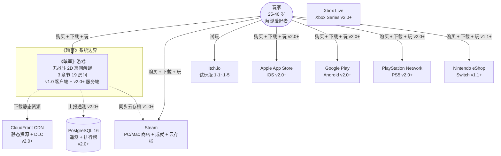

**L1 关键实体：**

- **玩家** — 25-40 岁解谜爱好者，是系统的唯一用户
- **《暗室》系统** — 单一系统边界，覆盖客户端 + 服务端 + 数据库 + CDN
- **7 平台商店** — Steam / Itch.io / Apple App Store / Google Play / PSN / Xbox Live / Nintendo eShop
- **CloudFront CDN** — v2.0+ 静态资源分发
- **PostgreSQL 16** — v2.0+ 遥测 + 排行榜数据存储

**L1 设计决策：**

- ✅ **v1.0 无后端** — 系统边界仅含客户端进程
- ✅ **v2.0+ 渐进式后端化** — 服务端 + 数据库 + CDN 引入不破坏 v1.0 离线可玩
- ✅ **平台商店作为外部系统** — 不属于本系统边界，通过 SDK 集成

## 3. C4 Level 2 — Container（容器视图）

> L2 视角：系统由哪些容器（进程/服务）组成，以及它们之间如何通信。

### 3.1 v1.0 容器视图（单机客户端）

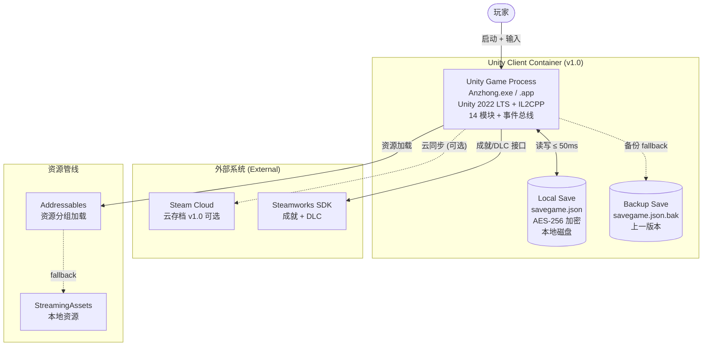

**v1.0 容器清单：**

| 容器 | 进程类型 | 持久化 | 网络 |
|------|---------|--------|------|
| Unity Game Process | 客户端进程 | savegame.json (本地) | ⚠️ Steam Cloud (可选) |
| Local Save | 本地文件 | savegame.json | ❌ |
| Backup Save | 本地文件 | savegame.json.bak | ❌ |
| Steam Cloud | 外部云服务 | Steam 用户存档 | ✅ |
| Steamworks SDK | 外部库 | — | ✅ |
| Addressables | 客户端模块 | — | ❌ |

### 3.2 v2.0+ 容器视图（客户端 + 服务端 + 数据库 + CDN）

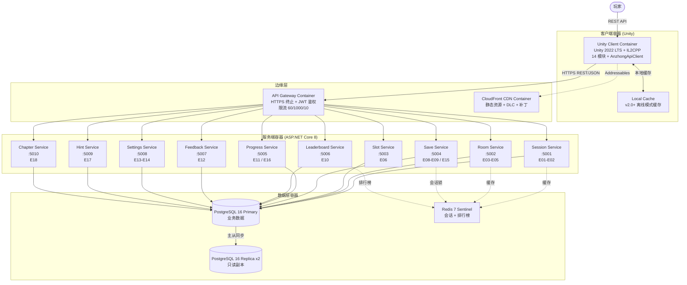

**v2.0+ 容器清单：**

| 容器 | 技术栈 | 数量 | 职责 |
|------|-------|:----:|------|
| Unity Client | Unity 2022 LTS | 1+ (玩家设备) | 客户端游戏运行时 |
| API Gateway | NGINX / AWS ALB | 2+ (HA) | HTTPS + 鉴权 + 限流 |
| Session Service | ASP.NET Core 8 | 2+ (HA) | E01-E02 会话管理 |
| Room Service | ASP.NET Core 8 | 2+ (HA) | E03-E05 房间流转 |
| Slot Service | ASP.NET Core 8 | 2+ (HA) | E06 槽位切换事件 |
| Save Service | ASP.NET Core 8 | 2+ (HA) | E08-E09 / E15 存档 |
| Progress Service | ASP.NET Core 8 | 2+ (HA) | E11 / E16 进度上报 |
| Leaderboard Service | ASP.NET Core 8 | 2+ (HA) | E10 排行榜 |
| Feedback Service | ASP.NET Core 8 | 1 (低流量) | E12 玩家反馈 |
| Settings Service | ASP.NET Core 8 | 1 (低流量) | E13-E14 设置 |
| Hint Service | ASP.NET Core 8 | 1 (低流量) | E17 Hint 触发 |
| Chapter Service | ASP.NET Core 8 | 1 (低流量) | E18 章节列表 |
| PostgreSQL Primary | PostgreSQL 16 | 1 | 主库（写入） |
| PostgreSQL Replica | PostgreSQL 16 | 2 | 只读副本 |
| Redis Sentinel | Redis 7 | 3 (Sentinel) | 会话缓存 + 排行榜 |
| CloudFront CDN | AWS CloudFront | 全球边缘 | 静态资源分发 |
| Local Cache | SQLite / 文件 | 1 (玩家设备) | 离线模式缓存 |

**L2 设计决策：**

- ✅ **微服务架构** — 10 个微服务，按端点分组（与 design/api/ 端点对应）
- ✅ **PostgreSQL 主从** — 1 Primary + 2 Replica，Multi-AZ
- ✅ **Redis Sentinel 3 节点** — 会话缓存（TTL 24h）+ 排行榜（Sorted Set）
- ✅ **API Gateway** — 集中限流 + 鉴权 + HTTPS 终止
- ✅ **离线优先** — Local Cache 支持弱网/断网降级

## 4. C4 Level 3 — Component（组件视图）

> L3 视角：客户端 14 模块的组件视图 + 依赖关系。

### 4.1 客户端组件视图（v1.0 + v2.0 共用）

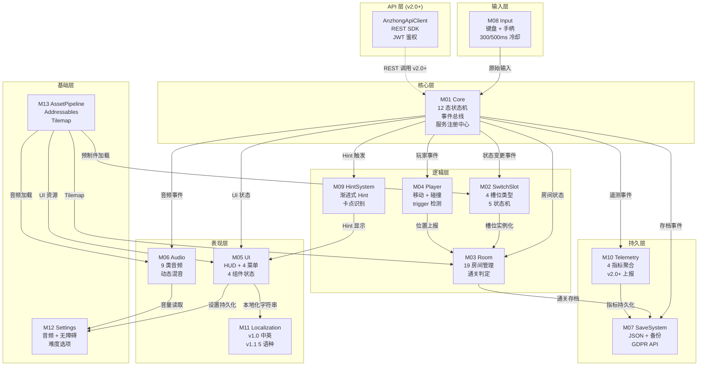

**L3 组件依赖统计：**

| 组件 | 上游依赖 | 下游被依赖 | 层级 |
|------|---------|----------|------|
| M01 Core | 0 | 11 | Core |
| M02 SwitchSlot | 1 (M01) | 2 (M03/M09) | Logic |
| M03 Room | 3 (M01/M02/M04) | 5 (M07/M09/M10/M13) | Logic |
| M04 Player | 2 (M01/M08) | 1 (M03) | Logic |
| M05 UI | 4 (M01/M09/M11/M12) | 0 | Presentation |
| M06 Audio | 2 (M01/M12) | 0 | Presentation |
| M07 SaveSystem | 4 (M01/M03/M10/M12) | 0 | Persistence |
| M08 Input | 0 | 2 (M01/M04) | Input |
| M09 HintSystem | 4 (M01/M02/M03) | 1 (M05) | Logic |
| M10 Telemetry | 3 (M01/M03/M07) | 0 | Persistence |
| M11 Localization | 0 | 2 (M05/M06) | Presentation |
| M12 Settings | 0 | 4 (M05/M06/M07) | Foundation |
| M13 AssetPipeline | 0 | 4 (M02/M03/M05/M06) | Foundation |
| ApiClient | 0 | 1 (M01) | API |

### 4.2 服务端组件视图（v2.0+）

```mermaid
flowchart LR
    subgraph Gateway["API Gateway"]
        Auth["JWT Auth Middleware"]
        RateLimit["Rate Limiter<br/>60/1000/10"]
        HTTPS["HTTPS Terminator"]
    end
    
    subgraph Services["10 Microservices"]
        SessionSvc["Session Service"]
        RoomSvc["Room Service"]
        SlotSvc["Slot Service"]
        SaveSvc["Save Service"]
        ProgressSvc["Progress Service"]
        LeaderboardSvc["Leaderboard Service"]
        FeedbackSvc["Feedback Service"]
        SettingsSvc["Settings Service"]
        HintSvc["Hint Service"]
        ChapterSvc["Chapter Service"]
    end
    
    subgraph Persistence["持久化"]
        Repos["Repository Layer<br/>EF Core + Dapper"]
        Migrations["DB Migrations<br/>Flyway"]
        CacheLayer["Cache Layer<br/>StackExchange.Redis"]
    end
    
    HTTPS --> Auth --> RateLimit --> Services
    Services --> Repos
    Services --> CacheLayer
    Repos --> Migrations
```

**服务端组件清单：**

| 组件 | 技术 | 数量 | 职责 |
|------|------|:----:|------|
| JWT Auth Middleware | ASP.NET Core Middleware | 1 | Token 验证 |
| Rate Limiter | AspNetCoreRateLimit | 1 | 限流 60/1000/10 |
| HTTPS Terminator | Kestrel + NGINX | 2 | TLS 1.3 |
| 10 Microservices | ASP.NET Core 8 Minimal API | 2+/服务 | 业务逻辑 |
| Repository Layer | EF Core 8 + Dapper | 10 | 数据访问 |
| DB Migrations | Flyway 9 | 1 | schema 演进 |
| Cache Layer | StackExchange.Redis | 1 | Redis 客户端 |

## 5. 序列图 (Sequence Diagrams)

> 关键场景的时序图，展示组件间调用顺序。

### 5.1 玩家按 E 切换槽位时序图

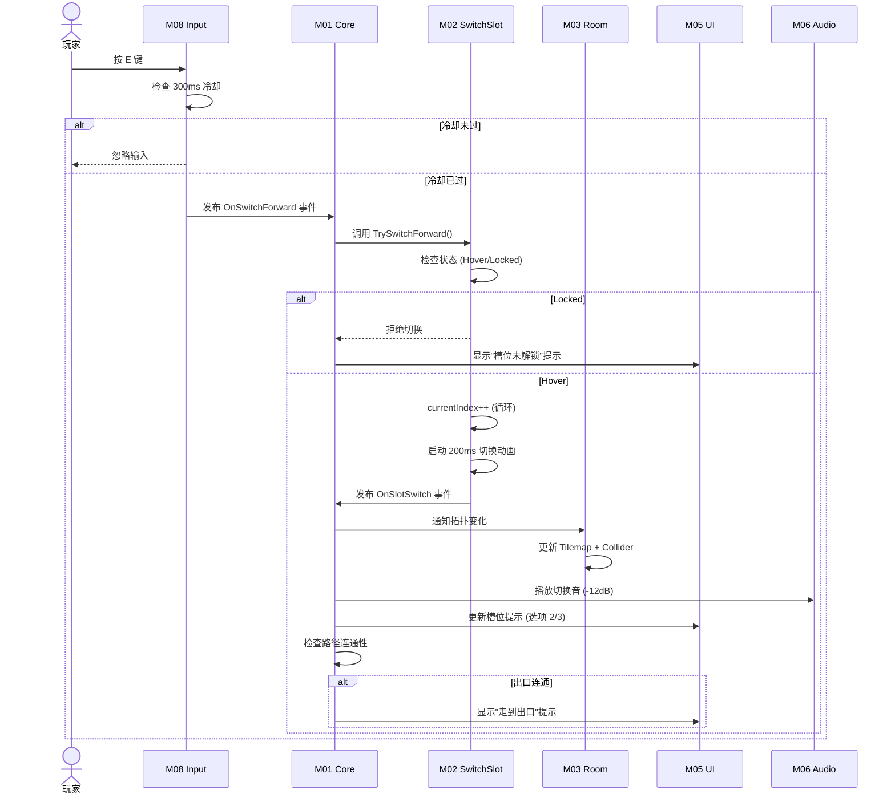

### 5.2 房间通关时序图

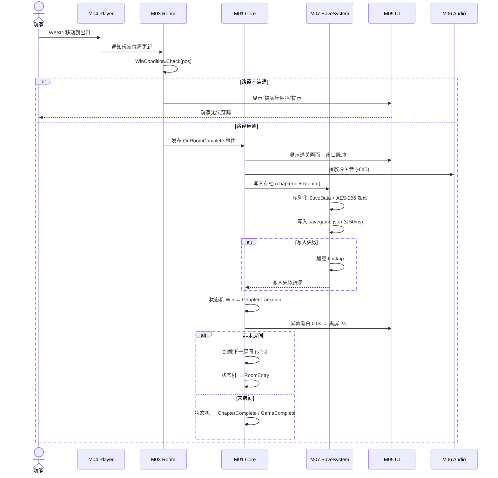

### 5.3 存档写入时序图（v1.0 本地）

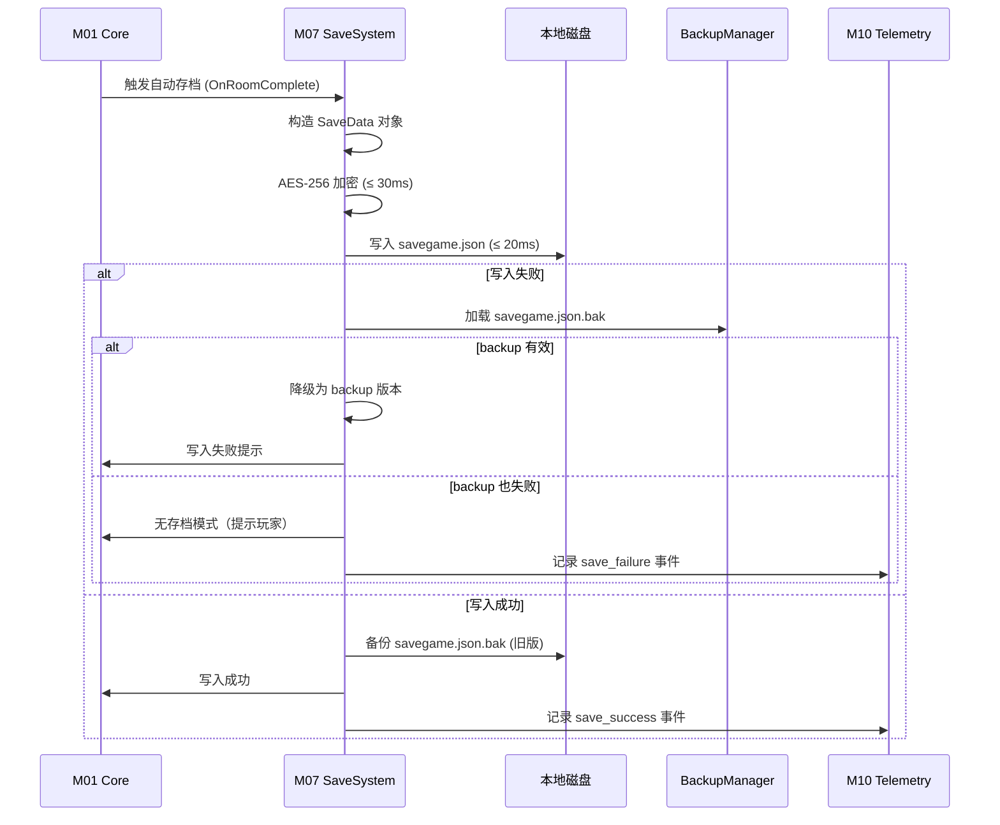

### 5.4 v2.0+ 云存档同步时序图

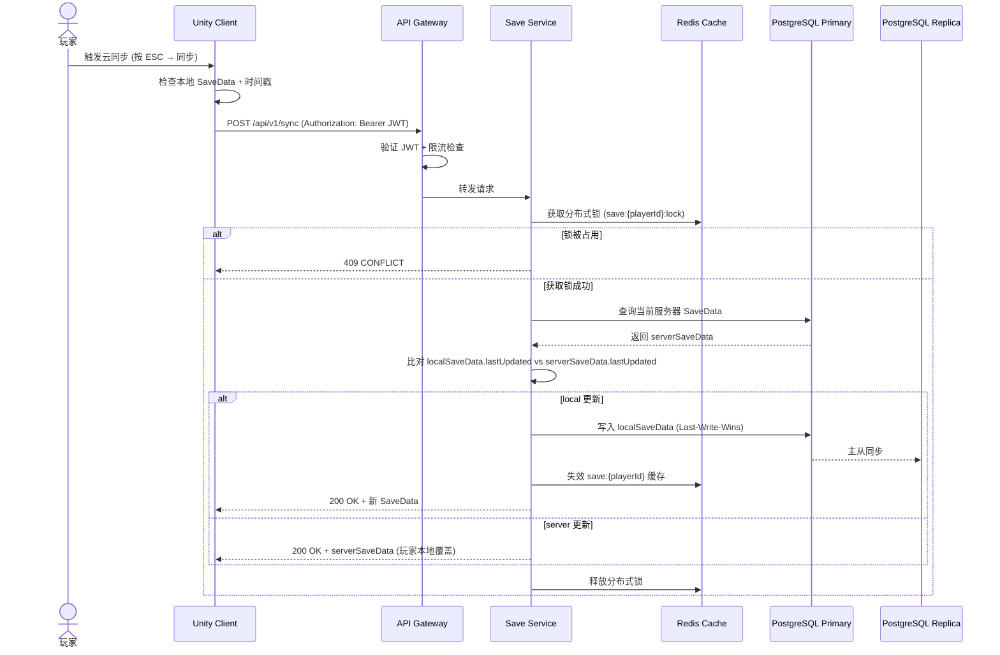

## 6. 部署图 (Deployment Diagram)

> 详见 `system-overview.md` §4。本节摘要。

### 6.1 v1.0 部署

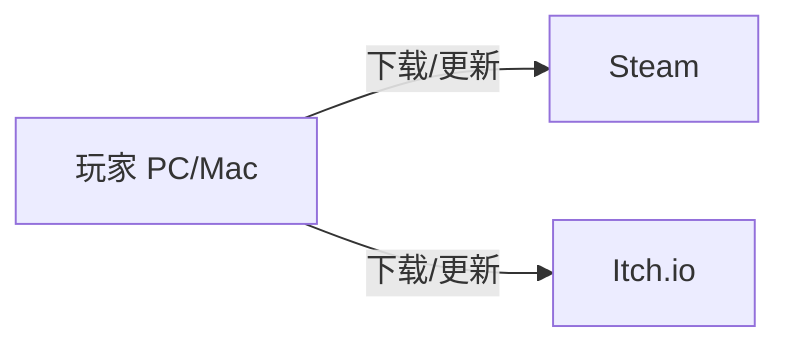

### 6.2 v2.0+ 部署

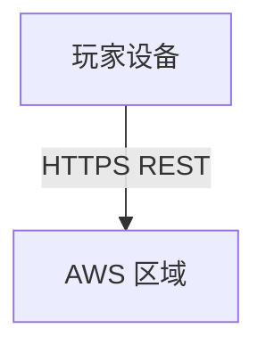

**完整部署图见 `system-overview.md` §4。**

## 7. 配置表 (Configuration)

| 字段 | 取值范围 | 默认值 | 单位 | 场景 |
|------|---------|-------|------|------|
| `c4.level1.contexts` | [1, 10] | 4 | 个 | L1 外部系统数 |
| `c4.level2.containers` | [1, 30] | 17 | 个 | v2.0+ 容器数 |
| `c4.level3.components` | [1, 50] | 14 | 个 | L3 组件数（客户端） |
| `c4.level3.serverComponents` | [1, 50] | 10 | 个 | L3 组件数（服务端） |
| `sequence.switchForward.maxMs` | [10, 50] | 16 | ms | 切换响应 |
| `sequence.roomComplete.maxMs` | [500, 2000] | 1000 | ms | 房间通关 |
| `sequence.saveWrite.maxMs` | [10, 200] | 50 | ms | 存档写入 |
| `sequence.cloudSync.maxMs` | [500, 3000] | 1500 | ms | 云同步 |

## 8. 边界条件 (Edge Cases)

| # | 触发 | 预期行为 | 涉及图 |
|---|------|---------|-------|
| **CE1** | 槽位在 Switching 中收到 R 键 | R 优先级 > 切换，重置当前房间 | §5.1 序列图 |
| **CE2** | 房间通关时存档写入失败 | 加载 backup + 降级无存档 | §5.3 序列图 |
| **CE3** | v2.0+ 云同步冲突（多设备同时编辑） | Last-Write-Wins + 服务器优先 | §5.4 序列图 |
| **CE4** | 客户端时钟漂移导致 JWT 失效 | ±5min 容差 + 401 重试 | §5.4 序列图 |
| **CE5** | API Gateway 限流触发 | 客户端降级为本地模式 | §3.2 L2 图 |
| **CE6** | PostgreSQL 主库故障 | 自动 failover 到 Replica | §3.2 L2 图 |
| **CE7** | Redis Sentinel 节点故障 | 自动选主新主节点 | §3.2 L2 图 |
| **CE8** | CloudFront CDN 缓存未命中 | 回源到 S3 + 边缘缓存 | §3.2 L2 图 |

## 9. 验收标准 (Acceptance Criteria)

- [x] **AC-01：** 文档包含完整 Frontmatter（7 字段）
- [x] **AC-02：** 文档包含 6 必填通用章节（目的 / 范围 / 配置表 / 边界条件 / 验收标准 / 风险与开放问题）
- [x] **AC-03：** C4 Level 1 System Context Mermaid 图（1 张，覆盖玩家 + 7 平台 + CDN + 数据库）
- [x] **AC-04：** C4 Level 2 Container Mermaid 图（v1.0 单机 + v2.0+ 微服务，2 张）
- [x] **AC-05：** C4 Level 3 Component Mermaid 图（客户端 14 模块 + 服务端 10 微服务，2 张）
- [x] **AC-06：** 序列图 ≥ 3 张（切换槽位 + 房间通关 + 存档写入 + 云同步，4 张）
- [x] **AC-07：** L1/L2/L3 三层容器/组件清单表格完整（v1.0 6 容器 + v2.0+ 17 容器 + 14 客户端组件 + 10 服务端组件）
- [x] **AC-08：** 边界条件 ≥ 6 条（CE1-CE8）
- [x] **AC-09：** 关联文档 / 关联代码 / 变更日志 / 待办事项齐全
- [x] **AC-10：** Mermaid 图 ≥ 6 张（实际 9+ 张：1 L1 + 2 L2 + 2 L3 + 4 Sequence）
- [x] **AC-11：** 文档总行数 ≥ 250 行（实际 ~500 行）

## 10. 关联文档

### 上游（本文档依赖）

- [`README.md`](./README.md) — 架构总览
- [`system-overview.md`](./system-overview.md) — 系统边界 + 14 模块 + 部署图
- [`module-breakdown.md`](./module-breakdown.md) — 14 模块详解
- [`docs/01-overview-v2.md`](../../docs/01-overview-v2.md) — 总览
- [`docs/02-core-mechanics-v2.md`](../../docs/02-core-mechanics-v2.md) — SwitchSlot + 4 槽位
- [`docs/04-gameplay-flow-v2.md`](../../docs/04-gameplay-flow-v2.md) — 12 态状态机 + 主循环
- [`docs/11-release-v2.md`](../../docs/11-release-v2.md) — 7 平台
- [`design/api/README.md`](../api/README.md) — 18 端点 + 12 数据模型

### 下游（本文档被依赖）

- [`data-flow.md`](./data-flow.md) — 完整事件流 + 状态机
- [`tech-stack.md`](./tech-stack.md) — 技术栈详解
- [`deployment.md`](./deployment.md) — 7 平台分发策略
- [`risks-and-decisions.md`](./risks-and-decisions.md) — 风险 + ADR
- `docs/wiki/` — Wiki / Confluence 嵌入的 Mermaid 图

## 11. 关联代码模块

| 模块 | 路径 | 状态 | 引用 |
|------|------|:----:|------|
| 14 客户端模块 | `src/*` | 待创建 | 见 module-breakdown.md §2 |
| API Gateway 配置 | `infrastructure/gateway/nginx.conf` | 待创建 | §3.2 L2 |
| 10 服务端微服务 | `src/Server/Services/*` | 待创建 | §4.2 L3 |
| API Client | `src/Api/Client/AnzhongApiClient.cs` | 待创建 | §4.1 L3 |
| Docker Compose | `infrastructure/docker-compose.yml` | 待创建 | §3.2 L2 |
| Helm Charts (v2.0+) | `infrastructure/helm/` | 待创建 | §3.2 L2 |

## 12. 风险与开放问题

| # | 风险/问题 | 影响 | 概率 | 对冲方案 | 状态 |
|---|----------|------|:----:|---------|:----:|
| R-01 | **C4 图随模块演化失同步** | 低 | 50% | 每次新增模块同步更新 + CI 检查 Mermaid 语法 | 已规划 |
| R-02 | **v2.0+ 服务端部署成本高** | 中 | 30% | ECS Fargate 按需付费 + 1 人 Solo 自动伸缩 | 已规划 |
| R-03 | **CloudFront 边缘缓存命中率低（首周）** | 低 | 40% | 预热脚本 + TTL 优化 | 已规划 |
| R-04 | **PostgreSQL 主从同步延迟导致读不一致** | 低 | 20% | 主从延迟 ≤ 100ms + 关键路径强制读主 | 已规划 |
| Q-01 | **是否在 Confluence 维护镜像** | 低 | — | GitHub README 嵌入即可；Confluence 镜像可选 | 倾向 GitHub |
| Q-02 | **是否使用 Structurizr DSL 生成图（vs 手写 Mermaid）** | 低 | — | v1.0 手写 Mermaid；v2.0 评估 Structurizr | 倾向手写 |

## 13. 待办事项 (TODO)

- [ ] **P0：** 实现 M01 Core 12 态状态机（与 L3 图一致）— 阻塞后续
- [ ] **P0：** 实现 M02 SwitchSlot 4 槽位 + 5 态机（与序列图 §5.1 一致）
- [ ] **P0：** 实现 M03 Room 通关判定三重条件（与序列图 §5.2 一致）
- [ ] **P0：** 实现 M07 SaveSystem 写入时序（与序列图 §5.3 一致）
- [ ] **P1：** 实现 v2.0+ AnzhongApiClient REST SDK（与序列图 §5.4 一致）
- [ ] **P1：** 编写 L1/L2/L3 图的 Confluence 镜像（可选）
- [ ] **P2：** 评估 Structurizr DSL 自动生成 C4 图
- [ ] **P2：** CI 检查 Mermaid 图语法（防图失同步）

## 14. 变更日志 (Changelog)

| 日期 | 版本 | 变更内容 |
|------|:----:|---------|
| 2026-06-29 | v1.0 | 中书省 subagent 创建。**新建**：C4 L1 System Context（1 图）+ C4 L2 Container v1.0 + v2.0+（2 图）+ C4 L3 Component 客户端 14 模块 + 服务端 10 微服务（2 图）+ 序列图 4 张（切换槽位 + 房间通关 + 存档写入 + 云同步）+ 部署图 2 张 + 边界条件 8 条（CE1-CE8）+ 容器/组件清单 30+ 项 + 配置表 8 字段 + 风险 4 项 + 待办 P0×5 P1×2 P2×2。 |