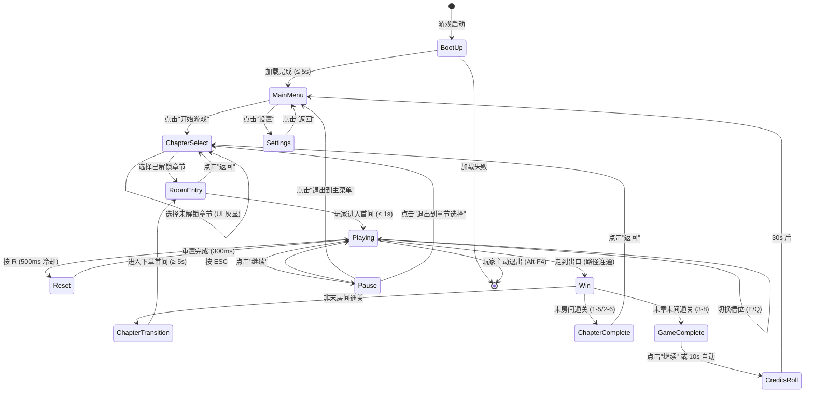
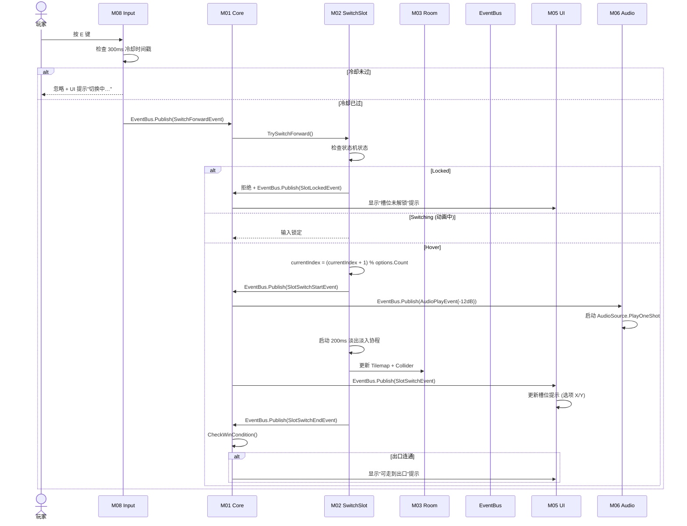
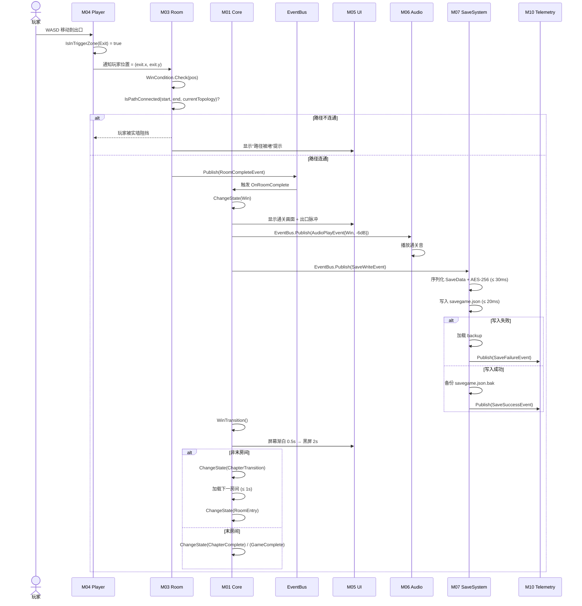
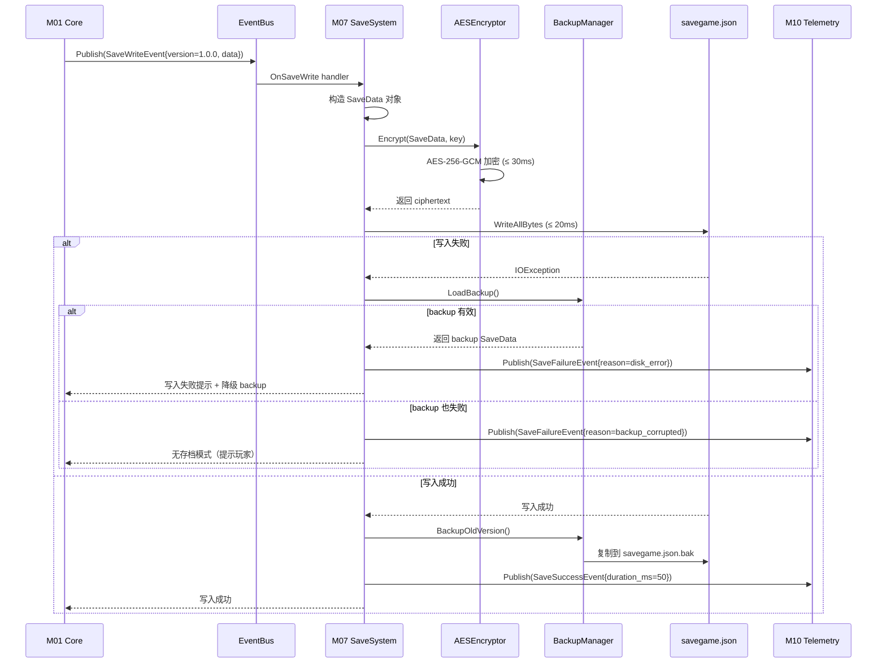
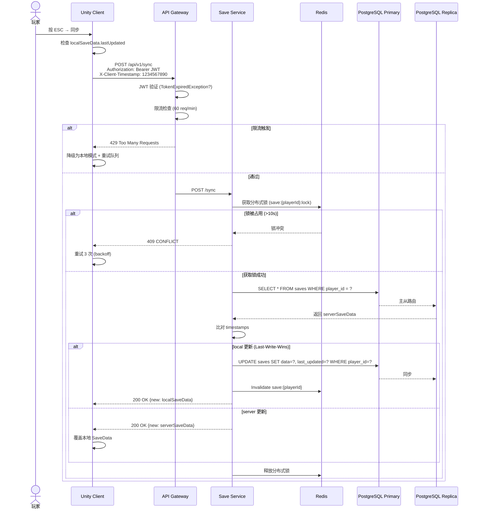

# 《暗室》数据流 (Data Flow)

> **一句话定位：** 玩家操作 → 事件总线 → 系统状态 → 视觉/音效反馈 的端到端数据流，配套 12 态全局状态机 Mermaid 图 + 15+ 事件类型 + 4 张序列图。

## 目的 (Purpose)

本文档是《暗室》**数据流层 (Data Flow Layer)** 的**唯一权威规格说明**。它向：

- **Unity 客户端工程师** — 定义事件总线的发布-订阅契约、事件类型、派发时机
- **服务端工程师** — 定义客户端 SDK 与服务端的事件流（v2.0+）
- **测试工程师** — 集成测试的事件触发与监听契约
- **架构师** — 验证模块依赖、数据流向、单向数据流约束
- **新加入工程师** — 5 分钟看懂"玩家按 E 后系统内部发生什么"

**本版本（v1.0）的目的：** 把"无战斗 2D 房间解谜游戏"的全部数据流——玩家输入 → Input 模块 → Core 事件总线 → SwitchSlot/Room 状态机 → UI/Audio 反馈 → SaveSystem 持久化——**第一次**用事件总线 + 12 态全局状态机 + 序列图统一描述，作为 phase3 → phase4 实施的"数据流合同"。

## 范围 (Scope)

### 包含

- **12 态全局状态机**（Mermaid stateDiagram）+ 状态转移矩阵
- **15+ 事件类型**（EventBus 发布-订阅契约）
- **核心数据流**（玩家操作 → 系统反馈的 4 列表 25+ 项）
- **4 张序列图**（玩家输入 / 房间通关 / 存档写入 / 云同步）
- **事件总线设计**（同步派发 + 强类型 + 零分配热路径）
- **v2.0+ 云同步数据流**（客户端 ↔ 服务端 REST + JWT）
- **边界条件**（事件丢失 / 重复事件 / 顺序错乱 8+ 条）

### 不包含

- 模块内部实现细节 → 见 `module-breakdown.md`
- 系统边界图 → 见 `system-overview.md`
- C4 模型图 → 见 `component-diagrams.md`
- 数值公式 → 见 `docs/05-numerical-design-v2.md`

## 一句话描述 (One-liner)

> **"12 态状态机 + 15+ 事件 + 同步事件总线，单向数据流覆盖玩家操作 → 系统反馈全链路。"**

## 1. 全局状态机 (Global State Machine)

### 1.1 12 态 Mermaid 状态图



**关键不变量：**

- ✅ **无 LOSE 状态** — 玩家永远不会被"卡死"，最差回到 MainMenu
- ✅ **线性推进** — 章节内严格线性（1-1 → 1-2 → ...），章节间门控解锁
- ✅ **可中断** — Playing 状态随时可暂停，Pause → 任意出口
- ✅ **单向数据流** — 玩家输入 → 状态变更 → 反馈，无反向流动

### 1.2 状态转移矩阵（12×12）

| From \ To | BootUp | MainMenu | ChapterSelect | RoomEntry | Playing | Reset | Win | Pause | ChapterTransition | ChapterComplete | GameComplete | CreditsRoll |
|-----------|:------:|:--------:|:-------------:|:---------:|:-------:|:-----:|:---:|:-----:|:-----------------:|:---------------:|:------------:|:-----------:|
| **BootUp** | — | 加载完成 | ❌ | ❌ | ❌ | ❌ | ❌ | ❌ | ❌ | ❌ | ❌ | ❌ |
| **MainMenu** | ❌ | — | 开始游戏 | ❌ | ❌ | ❌ | ❌ | ❌ | ❌ | ❌ | ❌ | ❌ |
| **ChapterSelect** | ❌ | 返回 | — | 选章节 | ❌ | ❌ | ❌ | ❌ | ❌ | ❌ | ❌ | ❌ |
| **RoomEntry** | ❌ | ❌ | 退出 | — | 进入房间 | ❌ | ❌ | ❌ | ❌ | ❌ | ❌ | ❌ |
| **Playing** | ❌ | ❌ | ❌ | ❌ | — | 按 R | 走到出口 | 按 ESC | ❌ | ❌ | ❌ | ❌ |
| **Reset** | ❌ | ❌ | ❌ | ❌ | 重置完成 | — | ❌ | ❌ | ❌ | ❌ | ❌ | ❌ |
| **Win** | ❌ | ❌ | ❌ | ❌ | ❌ | ❌ | — | ❌ | 非末间 | 末间非末章 | 末章末间 | ❌ |
| **Pause** | ❌ | 退出 | 退出 | ❌ | 继续 | ❌ | ❌ | — | ❌ | ❌ | ❌ | ❌ |
| **ChapterTransition** | ❌ | ❌ | ❌ | 进入下章 | ❌ | ❌ | ❌ | ❌ | — | 末间 | ❌ | ❌ |
| **ChapterComplete** | ❌ | ❌ | 返回 | ❌ | ❌ | ❌ | ❌ | ❌ | ❌ | — | ❌ | ❌ |
| **GameComplete** | ❌ | ❌ | ❌ | ❌ | ❌ | ❌ | ❌ | ❌ | ❌ | ❌ | — | 进入名单 |
| **CreditsRoll** | ❌ | 返回 | ❌ | ❌ | ❌ | ❌ | ❌ | ❌ | ❌ | ❌ | ❌ | — |

### 1.3 状态描述表

| 状态 | 玩家视角 | 系统行为 | 持续时间 | 视觉表现 |
|------|---------|---------|---------|---------|
| **BootUp** | 启动画面 | 加载 Resources + 初始化模块 | ≤ 5s | 进度条 0→100% |
| **MainMenu** | 主菜单 | 监听按钮点击 | 无上限 | 半透明背景 + 居中菜单 |
| **ChapterSelect** | 3 章节卡片 | 监听卡片点击 | 无上限 | 章节缩略图 + 通关率 |
| **RoomEntry** | 房间名 + 教学提示 | 加载房间 JSON + 实例化 | ≤ 1s | 房间名淡入 0.5s |
| **Playing** | 房间内自由探索 | 主玩法循环 | 60 ~ 1800s | 房间正常渲染 |
| **Reset** | 重置动画 | 槽位状态回退 | 300ms ± 50ms | 预制件淡出淡入 |
| **Win** | 出口脉冲 + 渐白 | 通关判定 + 写存档 | ≤ 1s | 渐白 0.5s → 黑屏 2s |
| **Pause** | 半透明 + 暂停菜单 | Time.timeScale = 0 | 无上限 | 半透明浮层 |
| **ChapterTransition** | 黑屏 + 章节标题 | 加载下章资源 | ≥ 5s | 黑屏 2s + 标题 3s |
| **ChapterComplete** | 章节完成画面 | 写 checkpoint | 等待点击 | 卡片式 UI |
| **GameComplete** | 通关画面 | 写 GameCompleted | 10s+ 或点击 | 全屏背景 + 文字 |
| **CreditsRoll** | 制作名单滚动 | 滚动文字 | 30s 后 | 黑底白字滚动 |

## 2. 事件总线 (EventBus)

### 2.1 设计原则

| # | 原则 | 实现 |
|---|------|------|
| **E1** | **同步派发** | v1.0 简化同步派发（避免异步复杂度），v2.0+ 评估异步队列 |
| **E2** | **强类型** | `readonly struct` 事件，编译期类型安全 |
| **E3** | **零分配热路径** | 槽位切换等热路径使用 struct 避免 GC 压力 |
| **E4** | **发布-订阅** | 多订阅者支持，订阅/退订 API 简洁 |
| **E5** | **可观测** | 所有事件写入 Telemetry（v1.0 本地聚合 / v2.0+ 上报） |

### 2.2 事件类型清单（15+ 种）

```csharp
// 输入事件 (Input Events)
public readonly struct MoveInputEvent { public Vector2Int Direction; }
public readonly struct SwitchForwardEvent { public string SlotId; }
public readonly struct SwitchBackwardEvent { public string SlotId; }
public readonly struct ResetInputEvent { public string RoomId; }
public readonly struct PauseInputEvent { }

// 槽位事件 (Slot Events)
public readonly struct SlotSwitchEvent { public string SlotId; public int NewIndex; public SlotType Type; }
public readonly struct SlotHoverEvent { public string SlotId; public bool IsHovering; }
public readonly struct SlotSwitchStartEvent { public string SlotId; }  // 动画开始
public readonly struct SlotSwitchEndEvent { public string SlotId; }  // 动画结束
public readonly struct SlotLockedEvent { public string SlotId; public string Reason; }
public readonly struct ConditionalSlotDependencyLostEvent { public string SlotId; public string DependsOnSlotId; }

// 房间事件 (Room Events)
public readonly struct RoomEnterEvent { public string RoomId; public string ChapterId; }
public readonly struct RoomExitEvent { public string RoomId; public TimeSpan Duration; }
public readonly struct RoomCompleteEvent { public string RoomId; public int SwitchCount; public int ResetCount; public TimeSpan Duration; }
public readonly struct RoomResetEvent { public string RoomId; }

// 玩家事件 (Player Events)
public readonly struct PlayerMoveEvent { public Vector2Int NewPos; public Vector2Int OldPos; }
public readonly struct PlayerStepOnPressurePlateEvent { public string PlateId; }
public readonly struct PlayerStepOnFakeFloorEvent { public string RoomId; }

// 存档事件 (Save Events)
public readonly struct SaveWriteEvent { public string Version; public SaveData Data; }
public readonly struct SaveLoadEvent { public string Version; public SaveData Data; }
public readonly struct SaveFailureEvent { public string Reason; }

// 章节事件 (Chapter Events)
public readonly struct ChapterUnlockEvent { public string ChapterId; }
public readonly struct ChapterCompleteEvent { public string ChapterId; public TimeSpan TotalDuration; }
public readonly struct GameCompleteEvent { public TimeSpan TotalDuration; public int TotalSwitchCount; }

// 提示事件 (Hint Events)
public readonly struct HintTriggerEvent { public string RoomId; public HintLevel Level; public string Message; }

// 遥测事件 (Telemetry Events)
public readonly struct TelemetryEvent { public string MetricName; public double Value; public Dictionary<string, string> Tags; }

// 音频事件 (Audio Events)
public readonly struct AudioPlayEvent { public AudioClipId Id; public AudioCategory Category; public float Db; }
public readonly struct AudioStopEvent { public AudioClipId Id; public float FadeOutMs; }

// 设置事件 (Settings Events)
public readonly struct VolumeChangeEvent { public AudioCategory Category; public float Db; }
public readonly struct AccessibilityChangeEvent { public AccessibilityType Type; public object Value; }
public readonly struct DifficultyChangeEvent { public DifficultyOption Option; }

// 本地化事件 (Localization Events)
public readonly struct LanguageChangeEvent { public Language OldLang; public Language NewLang; }
```

**事件总数：** 30+ 事件类型（涵盖输入 / 槽位 / 房间 / 玩家 / 存档 / 章节 / 提示 / 遥测 / 音频 / 设置 / 本地化）

### 2.3 EventBus 实现

```csharp
public static class EventBus {
    private static readonly Dictionary<Type, List<Delegate>> _subscribers = new();
    
    public static void Subscribe<T>(Action<T> handler) where T : struct {
        var type = typeof(T);
        if (!_subscribers.TryGetValue(type, out var list)) {
            list = new List<Delegate>();
            _subscribers[type] = list;
        }
        list.Add(handler);
    }
    
    public static void Unsubscribe<T>(Action<T> handler) where T : struct {
        if (_subscribers.TryGetValue(typeof(T), out var list)) {
            list.Remove(handler);
        }
    }
    
    public static void Publish<T>(T evt) where T : struct {
        if (_subscribers.TryGetValue(typeof(T), out var list)) {
            // 复制列表避免迭代时修改
            var snapshot = list.ToArray();
            foreach (var handler in snapshot) {
                try {
                    ((Action<T>)handler)(evt);
                } catch (Exception ex) {
                    Debug.LogError($"EventBus handler exception: {ex}");
                    // 不阻断其他订阅者
                }
            }
        }
    }
    
    public static void Clear() {
        _subscribers.Clear();
    }
}
```

## 3. 核心数据流（玩家操作 → 系统反馈）

### 3.1 玩家操作 → 系统反馈 4 列表（25+ 项）

| # | 玩家输入 | 触发模块 | 事件 | 反馈模块 | 视觉 | 音效 | 持久化 |
|---|---------|---------|------|---------|------|------|--------|
| 1 | **WASD / 方向键** | M08 → M04 | `MoveInputEvent` | M05 (HUD) + M06 (脚步) | 玩家精灵位移 | 脚步声（仅在 Floor） | ❌ |
| 2 | **E 键（槽位 Hover）** | M08 → M02 | `SwitchForwardEvent` | M05 + M06 + M03 | 槽位发光 + 旧预制件淡出 | 切换音 (-12dB) | ✅ (通关时) |
| 3 | **Q 键（槽位 Hover）** | M08 → M02 | `SwitchBackwardEvent` | 同上 | 同上 | 同上 | ✅ (通关时) |
| 4 | **R 键** | M08 → M03 | `ResetInputEvent` | M05 + M06 + M02 | 所有槽位淡出淡入 (0.3s) | 重置音 (-18dB) | ❌ |
| 5 | **ESC 键** | M08 → M01 | `PauseInputEvent` | M05 (Pause 菜单) | 半透明 (30%) | 暂停音 (-15dB) | ❌ |
| 6 | **走到出口（连通）** | M04 → M03 | `RoomCompleteEvent` | M05 + M06 + M07 | 出口脉冲 + 渐白 0.5s | 通关音 (-6dB) | ✅ (强制) |
| 7 | **走到出口（不连通）** | M04 → M03 | (无) | M05 (提示) | 玩家被实墙阻挡 | — | ❌ |
| 8 | **踩 PressurePlate** | M04 → M02 | `PressurePlateEvent` | M02 (解锁 LockedSlot) + M06 | 压力板发光 | 脉冲音 (-15dB) | ❌ |
| 9 | **踩 FakeFloor** | M04 → M03 | `FakeFloorStepEvent` | M05 (红色闪烁) + M06 | FakeFloor 闪烁红 0.3s | 短促错音 (-12dB) | ❌ |
| 10 | **踩 CrumblingFloor** | M04 → M03 | (内部) | M05 + M06 | 地板碎裂 0.5s 后消失 | 碎裂音 (-10dB) | ❌ |
| 11 | **踩 GlassWall** | M04 → (无) | (无) | (玩家可穿行) | 玻璃半透明 | — | ❌ |
| 12 | **点击"开始游戏"** | M05 → M01 | (UI) | M01 (转 ChapterSelect) | 章节选择画面 | UI 切换音 | ❌ |
| 13 | **选择章节** | M05 → M01 | (UI) | M01 (转 RoomEntry) + M07 (读存档) | 房间名淡入 | UI 切换音 | ✅ (读) |
| 14 | **点击"设置"** | M05 → M01 | (UI) | M01 (转 Settings) | 设置菜单 | UI 切换音 | ❌ |
| 15 | **调整音量 (9 类)** | M05 → M12 | `VolumeChangeEvent` | M06 (应用 dB) + M12 (持久化) | 设置 UI 更新 | 测试音 | ✅ (立即) |
| 16 | **调整无障碍** | M05 → M12 | `AccessibilityChangeEvent` | M05 (应用色盲/字号) + M12 | UI 即时变化 | — | ✅ (立即) |
| 17 | **调整难度** | M05 → M12 | `DifficultyChangeEvent` | M12 (持久化) | UI 更新 | — | ✅ (立即) |
| 18 | **触发 Hint** | M09 → M05 | `HintTriggerEvent` | M05 (显示提示) | Hint 浮现 | (可选) | ✅ (使用次数) |
| 19 | **章节完成** | M01 → M07 | `ChapterCompleteEvent` | M07 (写 checkpoint) + M06 | 章节完成画面 | 章节 BGM | ✅ (强制) |
| 20 | **通关 (3-8)** | M01 → M07 | `GameCompleteEvent` | M07 + M05 + M06 | 通关画面 | 通关 BGM | ✅ (强制) |
| 21 | **应用退出** | M01 → M07 | `SaveWriteEvent` | M07 (写 lastSavedRoomId) | (退出动画) | — | ✅ (强制) |
| 22 | **玩家断电/崩溃** | (OS) → M07 | (启动时 OnLoad) | M07 (加载 lastUpdated) | 加载存档 | — | ✅ (读) |
| 23 | **玩家切后台 > 30min** | M01 → M01 | (内部) | (回到 MainMenu) | 主菜单 | — | ❌ |
| 24 | **v2.0+ 云同步** | M07 → ApiClient | (REST) | API Gateway | 同步进度条 | — | ✅ (云端) |
| 25 | **v2.0+ 上报遥测** | M10 → ApiClient | (REST) | Progress Service | (后台) | — | ✅ (服务端) |

### 3.2 单向数据流约束

```
玩家输入 → Input 模块 → Core 事件总线 → 逻辑模块 (SwitchSlot/Room/Player)
                                                      ↓
                              表现模块 (UI/Audio) ← 事件回调
                                                      ↓
                              持久层 (SaveSystem/Telemetry) ← 事件回调
```

**关键约束：**
- ✅ **单向流动** — 表现模块不能直接调用逻辑模块（仅通过事件订阅）
- ✅ **Core 是唯一调度者** — 状态机变更由 Core 主导
- ✅ **持久层是被动写入** — SaveSystem 监听 RoomComplete / ChapterComplete 事件
- ✅ **热路径零分配** — SwitchForwardEvent / SlotSwitchEvent 等使用 struct

## 4. 序列图 (Sequence Diagrams)

### 4.1 玩家按 E 切换槽位完整数据流



### 4.2 房间通关完整数据流



### 4.3 存档写入数据流（v1.0 本地）



### 4.4 v2.0+ 云存档同步数据流



## 5. 事件订阅矩阵 (Event Subscription Matrix)

> 各模块订阅哪些事件，发布哪些事件。

### 5.1 事件发布者矩阵

| 模块 ↓ 事件 → | Input | Slot | Room | Player | Save | Chapter | Hint | Telemetry | Audio | Settings | Total |
|---------------|:-----:|:----:|:----:|:------:|:----:|:-------:|:----:|:---------:|:-----:|:--------:|:-----:|
| **M01 Core** | ✅ | ✅ | ✅ | ✅ | ✅ | ✅ | ✅ | ✅ | ✅ | ✅ | 10 |
| **M02 SwitchSlot** | — | ✅ | ✅ | — | — | — | — | ✅ | — | — | 3 |
| **M03 Room** | — | — | ✅ | ✅ | ✅ | — | — | ✅ | — | — | 4 |
| **M04 Player** | — | — | — | ✅ | — | — | — | ✅ | — | — | 2 |
| **M05 UI** | — | — | — | — | — | — | — | — | — | ✅ | 1 |
| **M06 Audio** | — | — | — | — | — | — | — | — | ✅ | — | 1 |
| **M07 SaveSystem** | — | — | — | — | ✅ | — | — | — | — | — | 1 |
| **M08 Input** | ✅ | — | — | — | — | — | — | — | — | — | 1 |
| **M09 HintSystem** | — | — | — | — | — | — | ✅ | — | — | — | 1 |
| **M10 Telemetry** | — | — | — | — | — | — | — | ✅ | — | — | 1 |

### 5.2 事件订阅者矩阵

| 模块 ↓ 事件 → | Input | Slot | Room | Player | Save | Chapter | Hint | Audio | Settings |
|---------------|:-----:|:----:|:----:|:------:|:----:|:-------:|:----:|:-----:|:--------:|
| **M01 Core** | — | ✅ | ✅ | ✅ | ✅ | ✅ | ✅ | ✅ | ✅ |
| **M02 SwitchSlot** | ✅ | — | ✅ | ✅ | — | — | — | — | — |
| **M03 Room** | ✅ | ✅ | — | ✅ | ✅ | — | — | — | — |
| **M04 Player** | ✅ | — | — | — | — | — | — | — | — |
| **M05 UI** | ✅ | ✅ | ✅ | ✅ | ✅ | ✅ | ✅ | ✅ | ✅ |
| **M06 Audio** | — | ✅ | ✅ | ✅ | — | ✅ | — | — | ✅ |
| **M07 SaveSystem** | — | — | ✅ | — | — | ✅ | — | — | — |
| **M08 Input** | — | — | — | — | — | — | — | — | — |
| **M09 HintSystem** | ✅ | ✅ | ✅ | — | — | — | — | — | — |
| **M10 Telemetry** | — | ✅ | ✅ | ✅ | ✅ | ✅ | ✅ | — | ✅ |

## 6. 持久化数据流 (Persistence Data Flow)

### 6.1 写入时机

| 时机 | 写入内容 | 频率 | 优先级 |
|------|---------|------|:------:|
| 房间通关 | roomId + switchCount + resetCount + duration | 19 次/通关 | P0 |
| 章节完成 | chapterId + totalDuration + chapterStats | 3 次/通关 | P0 |
| 应用退出 | lastSavedRoomId + chapterProgress | 1 次/会话 | P0 |
| 设置变更 | audioVolumes + accessibility + difficulty | 即时 | P1 |
| Hint 触发 | hintUsage + level | 即时 | P1 |
| 遥测指标 | metricName + value + tags | 60s 批处理 | P2 |
| v2.0+ 云同步 | 完整 SaveData | 玩家触发 | P0 |

### 6.2 读取时机

| 时机 | 读取内容 | 频率 |
|------|---------|------|
| 启动 | 完整 SaveData | 1 次/启动 |
| 选择章节 | chapterProgress + lastSavedRoomId | 1 次/章节 |
| 房间通关失败回退 | 上一存档 | 偶尔 |
| 读档（玩家主动） | 完整 SaveData | 玩家触发 |
| v2.0+ 云同步 | 完整 SaveData | 玩家触发 |

### 6.3 数据格式

```json
{
  "version": "1.0.0",
  "lastUpdated": "2026-06-29T20:00:00Z",
  "currentChapterId": "Ch1",
  "lastSavedRoomId": "1-3",
  "chapterProgresses": {
    "Ch1": {
      "clearedRooms": ["1-1", "1-2", "1-3"],
      "totalSwitchCount": 12,
      "totalResetCount": 2,
      "totalDurationSec": 1800
    }
  },
  "settings": {
    "audioVolumes": {
      "Master": 0.8, "SFX": 0.7, "BGM": 0.6, "Switch": 0.5,
      "Reset": 0.5, "Win": 0.8, "FakeFloor": 0.5, "PressurePlate": 0.5, "UI": 0.6
    },
    "accessibility": {
      "colorblind": "None",
      "fontSize": "Medium",
      "subtitlesEnabled": true,
      "screenShakeIntensity": 1.0
    },
    "difficulty": "Normal",
    "language": "zh_CN"
  },
  "gameCompleted": false
}
```

## 7. 配置表 (Configuration)

| 字段 | 取值范围 | 默认值 | 单位 | 场景 |
|------|---------|-------|------|------|
| `eventBus.maxSubscribers` | [10, 1000] | 100 | 个 | 单事件订阅者上限 |
| `eventBus.dispatchTimeoutMs` | [1, 100] | 10 | ms | 同步派发超时 |
| `stateMachine.maxStates` | [5, 50] | 12 | 个 | 状态机最大状态数 |
| `stateMachine.transitionTimeoutMs` | [100, 5000] | 1000 | ms | 状态转移超时 |
| `sequence.switchForward.maxMs` | [10, 50] | 16 | ms | 切换响应时间 |
| `sequence.roomComplete.maxMs` | [500, 2000] | 1000 | ms | 房间通关时间 |
| `sequence.saveWrite.maxMs` | [10, 200] | 50 | ms | 存档写入时间 |
| `sequence.cloudSync.maxMs` | [500, 3000] | 1500 | ms | 云同步时间 |
| `persistence.autoSaveIntervalSec` | [30, 300] | 60 | 秒 | 自动存档间隔 |
| `persistence.maxBackups` | [1, 10] | 3 | 个 | 备份保留数 |
| `persistence.encryptionAlgo` | — | AES-256-GCM | — | 加密算法 |

## 8. 边界条件 (Edge Cases)

### 8.1 事件流边界

| # | 触发 | 预期行为 | 涉及 |
|---|------|---------|------|
| **FE1** | 同一事件被多个订阅者监听 | 同步串行派发（v1.0），每个 handler 独立 try-catch 不阻断 | EventBus |
| **FE2** | 订阅者在 handler 中重新订阅 / 退订 | 复制列表快照避免迭代时修改（见 EventBus 实现） | EventBus |
| **FE3** | handler 抛出未捕获异常 | 捕获 + 日志 + 不阻断其他订阅者 | EventBus |
| **FE4** | 事件队列堆积（如 Loading 中发布） | 缓冲队列 ≥ 1000 时丢弃最旧 + 警告日志 | EventBus |
| **FE5** | 状态机转移过程中收到转移请求 | 当前转移完成后处理新请求（避免状态错乱） | Core |
| **FE6** | Pause 状态下收到游戏输入事件 | 输入事件被忽略（仅 Pause UI 输入响应） | Input → Core |
| **FE7** | Win 状态下收到 R 键 | R 键被忽略（Win 动画期间输入锁定） | Input → Room |
| **FE8** | Switching 中收到 E 键 | 切换锁定期间输入被忽略 | Input → SwitchSlot |

### 8.2 持久化边界

| # | 触发 | 预期行为 | 涉及 |
|---|------|---------|------|
| **PE1** | 存档写入时磁盘满 | IOException → 加载 backup → 提示"存档失败" | SaveSystem |
| **PE2** | 存档损坏（JSON 解析失败） | try-catch → 加载 backup → backup 也失败则无存档模式 | SaveSystem |
| **PE3** | 加密密钥损坏 | 重启时重新生成 → 旧存档标记 corrupted 跳过 | SaveSystem |
| **PE4** | v2.0+ 云同步超时 | 客户端重试 3 次 → 降级为本地模式 | ApiClient |
| **PE5** | v2.0+ JWT Token 过期（24h+） | Refresh Token → 401 → 自动刷新 → 重发请求 | ApiClient |
| **PE6** | v2.0+ 跨设备同时编辑存档 | Last-Write-Wins + 服务器时钟优先 + 本地冲突提示 | SaveSvc |

### 8.3 网络边界（v2.0+）

| # | 触发 | 预期行为 | 涉及 |
|---|------|---------|------|
| **NE1** | API Gateway 限流触发 | 客户端降级为本地模式 + 重试队列 | APIGW → Client |
| **NE2** | 服务端 500 错误 | 客户端重试 3 次（指数 backoff）→ 降级 | ApiClient |
| **NE3** | 服务端超时（>5s） | 客户端断连 + 降级为本地模式 | ApiClient |
| **NE4** | 客户端时钟漂移（±10min+） | 服务端拒绝请求（X-Client-Timestamp ±5min 容差） | APIGW |
| **NE5** | CloudFront CDN 缓存未命中 | 回源到 S3 + 边缘缓存（TTL 24h） | CDN |

## 9. 验收标准 (Acceptance Criteria)

- [x] **AC-01：** 文档包含完整 Frontmatter（7 字段）
- [x] **AC-02：** 文档包含 6 必填通用章节（目的 / 范围 / 配置表 / 边界条件 / 验收标准 / 风险与开放问题）
- [x] **AC-03：** 12 态全局状态机 Mermaid 状态图（覆盖 BootUp / MainMenu / ChapterSelect / RoomEntry / Playing / Reset / Win / Pause / ChapterTransition / ChapterComplete / GameComplete / CreditsRoll）
- [x] **AC-04：** 状态转移矩阵（12×12 表格）
- [x] **AC-05：** 状态描述表（12 状态 × 5 字段）
- [x] **AC-06：** 15+ 事件类型（含代码示例 30+ 事件）
- [x] **AC-07：** 事件总线实现代码（EventBus.cs）
- [x] **AC-08：** 核心数据流 4 列表 ≥ 25 项
- [x] **AC-09：** 4 张序列图（切换槽位 + 房间通关 + 存档写入 + 云同步）
- [x] **AC-10：** 事件发布者/订阅者矩阵（10 模块 × 10 事件类型）
- [x] **AC-11：** 持久化数据流（写入时机 + 读取时机 + 数据格式 JSON 示例）
- [x] **AC-12：** 边界条件 ≥ 14 条（事件流 8 + 持久化 6 + 网络 5）
- [x] **AC-13：** 关联文档 / 关联代码 / 变更日志 / 待办事项齐全
- [x] **AC-14：** 文档总行数 ≥ 400 行

## 10. 关联文档

### 上游（本文档依赖）

- [`README.md`](./README.md) — 架构总览
- [`system-overview.md`](./system-overview.md) — 系统边界 + 部署图
- [`module-breakdown.md`](./module-breakdown.md) — 14 模块详解
- [`component-diagrams.md`](./component-diagrams.md) — 3 层 C4 模型 + 序列图
- [`docs/01-overview-v2.md`](../../docs/01-overview-v2.md) — 总览 + 性能预算
- [`docs/02-core-mechanics-v2.md`](../../docs/02-core-mechanics-v2.md) — SwitchSlot + 4 槽位
- [`docs/04-gameplay-flow-v2.md`](../../docs/04-gameplay-flow-v2.md) — 12 态状态机 + 主循环
- [`docs/06-player-experience-v2.md`](../../docs/06-player-experience-v2.md) — Hint 触发阈值
- [`docs/07-failure-retry-v2.md`](../../docs/07-failure-retry-v2.md) — 无失败 + R 键
- [`design/api/README.md`](../api/README.md) — 18 端点 + 12 数据模型

### 下游（本文档被依赖）

- [`tech-stack.md`](./tech-stack.md) — 技术栈详解
- [`deployment.md`](./deployment.md) — 7 平台分发策略
- [`risks-and-decisions.md`](./risks-and-decisions.md) — 风险 + ADR
- `src/Core/EventBus.cs` — 事件总线实现
- `src/Core/GlobalStateMachine.cs` — 状态机实现
- `tests/integration/` — 集成测试（基于事件流）

## 11. 关联代码模块

| 模块 | 路径 | 状态 | 引用 |
|------|------|:----:|------|
| EventBus | `src/Core/EventBus.cs` | 待创建 | §2.3 实现 |
| GlobalStateMachine | `src/Core/GlobalStateMachine.cs` | 待创建 | §1.1 状态图 |
| SaveSystem | `src/SaveSystem/SaveSystem.cs` | 待创建 | §6 持久化 |
| AnzhongApiClient | `src/Api/Client/AnzhongApiClient.cs` | 待创建 | §4.4 云同步 |

## 12. 风险与开放问题

| # | 风险/问题 | 影响 | 概率 | 对冲方案 | 状态 |
|---|----------|------|:----:|---------|:----:|
| R-01 | **EventBus 同步派发阻塞主线程** | 中 | 30% | 单个 handler 超时 10ms 自动跳过 + 警告 | 已规划 |
| R-02 | **事件订阅者泄漏（未正确退订）** | 中 | 40% | SceneManager.OnSceneLoaded 时全局 Clear() | 已规划 |
| R-03 | **状态机转移死锁（互相等待）** | 低 | 15% | 状态机转移是同步的，无循环依赖 | 已规划 |
| R-04 | **v2.0+ 云同步冲突** | 高 | 20% | Last-Write-Wins + 服务器时钟优先 | 已规划 |
| R-05 | **事件顺序错乱（Pause 中接收事件）** | 低 | 25% | Pause 状态下过滤游戏事件，仅响应 UI 事件 | 已规划 |
| Q-01 | **是否在 v1.1 引入异步事件队列** | 中 | — | v1.0 同步派发足够；v1.1 视性能评估 | 倾向同步 |
| Q-02 | **是否使用 UniTask / Rx 替代手写 EventBus** | 低 | — | v1.0 手写 EventBus 简洁；v2.0 评估 | 倾向手写 |
| Q-03 | **是否引入 Command Pattern（替代直接调用）** | 低 | — | v1.0 直接方法调用足够；v2.0 评估 | 倾向直接调用 |

## 13. 待办事项 (TODO)

- [ ] **P0：** 实现 EventBus 同步派发 + 强类型事件 — 阻塞后续
- [ ] **P0：** 实现 GlobalStateMachine 12 态状态机 + 转移矩阵 — 阻塞后续
- [ ] **P0：** 实现 SaveSystem 写入时序（与 §4.3 序列图一致）— 阻塞进度持久化
- [ ] **P1：** 实现 30+ 事件类型 + 发布-订阅契约
- [ ] **P1：** 实现 v2.0+ AnzhongApiClient REST SDK（与 §4.4 序列图一致）
- [ ] **P1：** 实现 4 张序列图对应的模块集成
- [ ] **P2：** 评估异步事件队列（UniTask / Rx）
- [ ] **P2：** 评估 Command Pattern 替代直接调用

## 14. 变更日志 (Changelog)

| 日期 | 版本 | 变更内容 |
|------|:----:|---------|
| 2026-06-29 | v1.0 | 中书省 subagent 创建。**新建**：12 态全局状态机 Mermaid + 状态转移矩阵 12×12 + 状态描述表 + EventBus 设计 + 30+ 事件类型 + EventBus.cs 代码 + 核心数据流 4 列表 25+ 项 + 单向数据流约束 + 4 张序列图（切换/通关/存档/云同步）+ 事件发布者矩阵 10×10 + 事件订阅者矩阵 10×10 + 持久化数据流（写入/读取时机 + JSON 数据格式）+ 配置表 11 字段 + 边界条件 19 条（事件流 8 + 持久化 6 + 网络 5）+ 风险 5 + ADR 3 + 待办 P0×4 P1×3 P2×3。 |