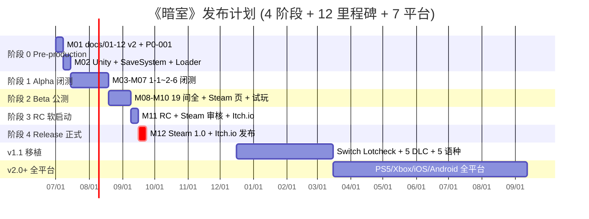
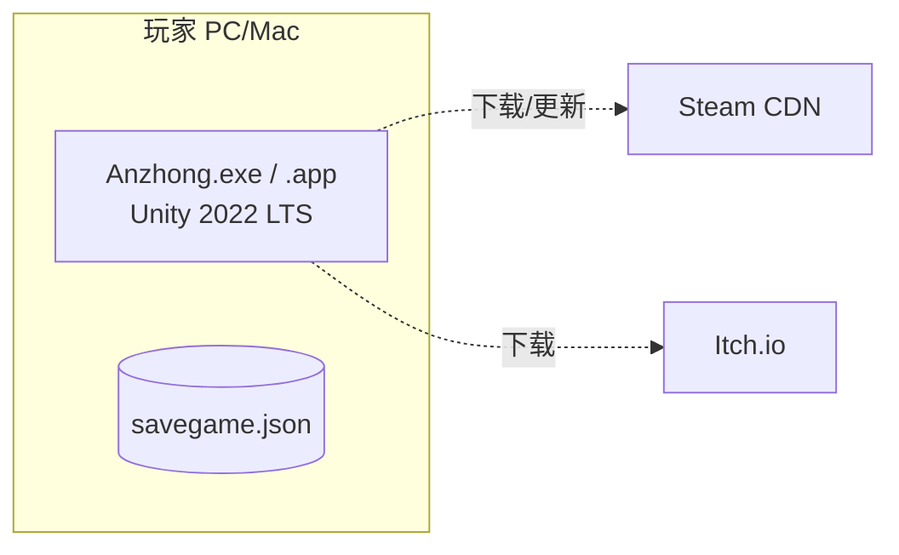
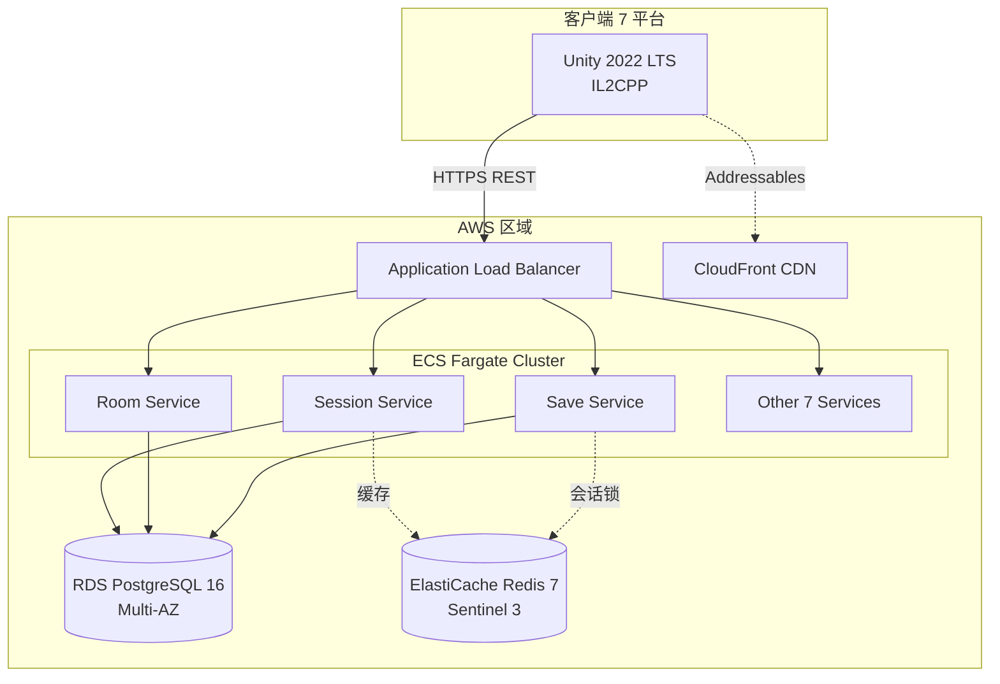

# 《暗室》部署策略 (Deployment Strategy)

> **一句话定位：** 7 平台 × 3 版本（v1.0 / v1.1 / v2.0+）× 6 区域定价 × 4 阶段发布的端到端部署策略，与 docs/11-release-v2.md §1.1 严格对齐。

## 目的 (Purpose)

本文档是《暗室》**部署层 (Deployment Layer)** 的**唯一权威基线**。它向：

- **DevOps 工程师** — 7 平台构建 + CI/CD + 分发流程
- **平台运营** — Steam / Itch.io / Apple App Store / Google Play / PSN / Xbox Live / Nintendo eShop 提交流程
- **架构师** — 部署拓扑、CDN 策略、版本兼容性
- **太子 / 尚书省** — 发布计划对齐（4 阶段发布 + 12 里程碑）
- **新加入工程师** — 5 分钟看懂《暗室》如何分发到 7 平台

**本版本（v1.0）的目的：** 把"无战斗 2D 房间解谜游戏"的 7 平台分发策略——v1.0 (Steam + Mac + Itch.io) / v1.1 (Switch) / v2.0+ (PS5 + Xbox + iOS + Android)——**第一次**用 7 平台覆盖矩阵 + 3 版本分档 + 6 区域定价 + CI/CD 流水线统一描述，作为 phase3 → phase4 实施的"部署合同"。**与 docs/11-release-v2.md §1.1 7 平台覆盖矩阵严格对齐**。

## 范围 (Scope)

### 包含

- **7 平台覆盖矩阵**（Steam / Mac / PS5 / Xbox Series / Switch / iOS / Android）+ 优先级 P0/P1/P2
- **3 版本分档**（v1.0 Day-84 / v1.1 T+3m / v2.0+ T+6m）
- **6 区域定价**（NA / EU / CN / JP / KR / SEA）+ 4 促销节点
- **4 阶段发布计划**（Alpha / Beta / RC / Release）与 10-v2 12 里程碑对齐
- **CI/CD 流水线**（GitHub Actions + 7 平台并行构建）
- **CDN 策略**（Steamworks CDN v1.0 + CloudFront v2.0+）
- **部署拓扑**（单机进程 v1.0 + ASP.NET Core Cluster v2.0+）

### 不包含

- 营销节奏（KOL / 媒体 / PR）→ 见 docs/11-release-v2.md §4
- 合规法务（ESRB / GDPR / Steam 协议）→ 见 docs/11-release-v2.md §5
- 数值公式 → 见 docs/05-numerical-design-v2.md

## 一句话描述 (One-liner)

> **"7 平台 × 3 版本 × 6 区域 × 4 阶段，v1.0 启 3 平台 + v1.1 加 Switch + v2.0 全平台的端到端部署。"**

## 1. 7 平台覆盖矩阵 (7-Platform Coverage Matrix)

> **与 docs/11-release-v2.md §1.1 严格对齐。**

### 1.1 7 平台选型详情

| 平台 | 选型理由 | 一次性成本 | 持续成本 | 技术要求 | 风险 | 优先级 |
|------|---------|:---------:|:--------:|---------|------|:----:|
| **PC Steam** | 大流量、变现强、Indie 友好、$4.99 价位匹配玩家预期 | $100 (商店注册) | Steam Direct 30% 抽成 | Unity 2022 LTS ✓ | 审核 ≥ 7 工作日 / 退款政策严格 | **P0** (M11/M12) |
| **PC Mac** | Steam 共享代码 / Apple Silicon 原生 | $0 (随 Steam) | Steam 30% 抽成 | Unity Mac Build ✓ | Metal 渲染兼容性 | **P0** (M11/M12) |
| **Itch.io 试玩版** | Indie 试玩平台 + 免费发布 + 收集反馈 | $0 | Itch.io 10% 抽成（Pay What You Want） | Unity WebGL / Desktop ✓ | 流量小 | **P0** (M11/M12) |
| **PS5** | Indie 主机主流 / Trophy / DualSense 触觉 | $0 (Sony 注册免费) | Sony 30% 抽成 + $25K/年 (Indie 减免) | Unity 2022 LTS + PS5 SDK + 认证 | 认证 ≥ 12 周 / NDA / 通过率 ~40% | **P2** (v2.0) |
| **Xbox Series X\|S** | Game Pass 流量入口 / 跨平台 | $0 (Microsoft 注册免费) | MS 30% 抽成 | Unity + GDK + Smart Delivery | 认证 ≥ 6 周 / 跨平台需 Xbox Live | **P2** (v2.0) |
| **Nintendo Switch** | Indie 独立游戏聚集地 / 便携性 | $0 (Nintendo 注册免费) | Nintendo 30% 抽成 | Unity + Nintendo SDK + eShop 提交 | Lotcheck 严格 ≥ 6 周 / 移植工作量 200h | **P1** (v1.1) |
| **iOS (iPhone/iPad)** | App Store 大流量 / 触达易 | $99/年 (Apple Developer) | Apple 30% 抽成 (小开发者 15%) | Unity iOS Build + Metal + App Store 审核 | 适配成本 / 审核 ≥ 3 天 / 内购合规 | **P2** (v2.0) |
| **Android (Google Play)** | 用户基数最大 / 多端覆盖 | $25 (一次性) | Google 30% 抽成 | Unity Android Build + API 33+ | 设备碎片化 / 性能优化 | **P2** (v2.0) |

### 1.2 v1.0 / v1.1 / v2.0+ 平台分档

| 版本 | 时间 | 平台数 | 平台清单 | 总工作量 |
|------|------|:----:|---------|---------|
| **v1.0** | Day-84 (M12) | 3 | Steam (PC) + Steam (Mac) + Itch.io 试玩版 (1-1~1-5) | 200h |
| **v1.1** | T+3m | 4 | v1.0 + Nintendo Switch | 200h (Switch 移植) |
| **v2.0+** | T+6m | 7 | v1.1 + PS5 + Xbox Series + iOS + Android | 560h (主机 + 移动) |
| **总计** | — | **7** | — | **960h (~24 周)** |

### 1.3 平台优先级决策树

```
P0 (v1.0 必上):
  └─ Steam (PC/Mac) + Itch.io 试玩版
    └─ 理由: 大流量 + Indie 友好 + 1 人 Solo 验证 + 收集反馈

P1 (v1.1 可选):
  └─ Nintendo Switch
    └─ 理由: Indie 聚集地 + 便携性 + 200h 可承受工作量
    └─ 风险: Lotcheck 严格 + 性能优化

P2 (v2.0+ 长期):
  └─ PS5 / Xbox Series / iOS / Android
    └─ 理由: 主机三巨头 + 移动端触达
    └─ 风险: 认证严格 + 设备碎片化
```

## 2. v1.0 / v1.1 / v2.0+ 发布详情

### 2.1 v1.0 (Day-84, M12) 详细发布

| 平台 | 发布类型 | 范围 | 试玩/完整 | 备注 |
|------|---------|------|---------|------|
| **Steam (PC)** | 完整版 | 19 房间 + 3 章节 + 豪华版 + 季票 (v1.1+) | 完整 | $4.99 / ¥18 / €4.99 |
| **Steam (Mac)** | 完整版 | 同上 | 完整 | Apple Silicon 原生 |
| **Itch.io** | 试玩版 | 1-1 ~ 1-5 (5 间) | 试玩 | $0 (Pay What You Want) |

**v1.0 关键交付：**
- ✅ Steam 商店页（M10 完成文案 + 截图 + 视频）
- ✅ Itch.io 试玩版打包（1-1~1-5）
- ✅ Steamworks SDK 集成（成就 + DLC + 云存档）
- ✅ IARC 5 区域评级（M11 完成）
- ✅ 隐私政策 + GDPR 文档（M10 完成）
- ✅ 4 区域定价（NA / EU / CN / SEA）配置
- ✅ 4 促销节点（首发 15% OFF + 夏促 30% + 冬促 30% + 节日 50%）

### 2.2 v1.1 (T+3m) 详细发布

| 平台 | 发布类型 | 新增内容 |
|------|---------|---------|
| **Steam (PC/Mac)** | 完整版 | + Nintendo Switch 移植 + 5 DLC + 本地化 5 语种 |
| **Nintendo Switch** | 完整版 | 19 房间 + 3 章节 + Switch 独占优化 |

**v1.1 关键交付：**
- ✅ Switch Lotcheck 通过（≥ 6 周）
- ✅ Switch 性能优化（30 FPS + 触控操作）
- ✅ 5 DLC 内容（季票 6 DLC 中前 2 DLC）
- ✅ 本地化 5 语种（zh / en / ja / ko / fr）
- ✅ Switch eShop 商店页

### 2.3 v2.0+ (T+6m) 详细发布

| 平台 | 发布类型 | 新增内容 |
|------|---------|---------|
| **PS5** | 完整版 | 19 房间 + DualSense 触觉 + Trophy |
| **Xbox Series X\|S** | 完整版 | 19 房间 + Smart Delivery + Xbox Live |
| **iOS** | 完整版 | 19 房间 + 触控 UI + iCloud 同步 |
| **Android** | 完整版 | 19 房间 + 触控 UI + Google Play Games |

**v2.0+ 关键交付：**
- ✅ PS5 认证（≥ 12 周）
- ✅ Xbox 认证（≥ 6 周）
- ✅ iOS App Store 审核（≥ 3 天）
- ✅ Android Google Play 审核（≥ 1 天）
- ✅ 5 主机/移动端 UI 适配
- ✅ 跨平台云存档（v2.0+ 服务端）

## 3. 6 区域定价策略 (Regional Pricing)

> **与 docs/11-release-v2.md §2.2 严格对齐。**

### 3.1 6 区域差异定价

| 区域 | 基础版 | 豪华版 | 季票 | 购买力系数 | 来源 |
|------|:-----:|:-----:|:----:|:---------:|------|
| **NA (北美)** | $4.99 | $7.99 | $9.99 | 1.00 (基准) | Steam 推荐区间 |
| **EU (欧洲)** | €4.99 | €7.99 | €9.99 | 1.00 (含 VAT) | Steam 推荐区间 |
| **CN (中国)** | ¥18 | ¥28 | ¥35 | 0.40 (购买力平价) | Steam 国区 + ±20% 调整 |
| **JP (日本)** | ¥600 | ¥950 | ¥1,200 | 0.83 (Steam JPY 锚定) | Steam 推荐 |
| **KR (韩国)** | ₩6,500 | ₩10,500 | ₩13,000 | 0.77 (KRW 锚定) | Steam 推荐 |
| **SEA (东南亚)** | $2.99 | $4.99 | $5.99 | 0.60 (购买力平价) | Steam 推荐 |

### 3.2 4 促销节点

| 节点 | 时间 | 折扣 | 范围 | 目标 |
|------|------|:----:|------|------|
| **首发期** | T-0 ~ T+2 周 | 15% OFF | 全区域 | 早鸟奖励 |
| **夏季促销** | T+1m (6 月底) | 30% OFF | 全区域 | Steam Summer Sale |
| **冬季促销** | T+6m (12 月底) | 30% OFF | 全区域 | Steam Winter Sale |
| **节日特惠** | T+12m (春节/圣诞) | 50% OFF | 国区/北美 | 长尾激活 |

### 3.3 内购设计

> **v1.0/v1.1 明确"无内购"** — 单机买断制，不含任何内购 (IAP) / 战令 / 抽卡。理由：
> 1. 与"无成长"核心设计冲突
> 2. 避免分级被划为"含内购"
> 3. 1 人 solo 无运营成本投入

## 4. 4 阶段发布计划 (4-Stage Release Plan)

> **与 docs/11-release-v2.md §3 + docs/10-roadmap-v2.md 12 里程碑对齐。**

### 4.1 4 阶段 × 7 平台时间表

| 阶段 | 时间 | 范围 | 平台 | 关键里程碑 (10-v2) |
|------|------|------|------|:---------:|
| **Alpha 闭测** | W03-W07 (M03-M07) | 1-1~2-6 (11 间) | 本地 (Unity Editor) | M07 |
| **Beta 公测** | W08-W10 (M08-M10) | 1-1~3-8 (19 间全) | Itch.io 试玩版 (1-1~1-5) + 本地 | M10 |
| **RC 软启动** | W11 (M11) | 1-1~3-8 (19 间全) | Steam (审核中) + Itch.io 试玩版 | M11 |
| **Release 正式** | W12 (M12) | 19 间 + 豪华版 + 1.0 | Steam (PC/Mac) + Itch.io (1-1~1-5) | M12 |

### 4.2 v1.1 / v2.0+ 阶段

| 阶段 | 时间 | 平台 | 内容 |
|------|------|------|------|
| **v1.1 移植** | T+3m | Switch | 19 房间 + Switch 优化 + 5 DLC |
| **v2.0+ 全平台** | T+6m | PS5 + Xbox + iOS + Android | 19 房间 + 主机优化 + 移动端 UI + 云存档 |

### 4.3 时间轴 Mermaid



## 5. CI/CD 流水线 (CI/CD Pipeline)

### 5.1 GitHub Actions Workflows 详情

| Workflow | 触发 | 步骤 | 产物 |
|----------|------|------|------|
| **ci.yml** | push / pull_request | checkout → setup-unity → lint → unit-test → build-verify | — |
| **build_steam.yml** | tag v* | checkout → setup-unity → build-windows → steamworks-upload | Anzhong.exe |
| **build_mac.yml** | tag v* | checkout → setup-unity → build-mac → steamworks-upload | Anzhong.app |
| **build_switch.yml** | tag v1.1+ | checkout → setup-unity → build-switch → nintendo-submit | Anzhong.nsp |
| **build_ps5.yml** | tag v2.0+ | checkout → setup-unity → build-ps5 → psn-submit | Anzhong.ps5 |
| **build_xbox.yml** | tag v2.0+ | checkout → setup-unity → build-xbox → xbox-live-submit | Anzhong.xvc |
| **build_ios.yml** | tag v2.0+ | checkout → setup-unity → build-ios → app-store-connect | Anzhong.ipa |
| **build_android.yml** | tag v2.0+ | checkout → setup-unity → build-android → google-play | Anzhong.apk |
| **release.yml** | tag v* | 7 平台并行构建 → GitHub Release 创建 | 7 个安装包 |
| **deploy_server.yml** | tag v2.0+ | checkout → docker-build → ecs-deploy | Docker image |

### 5.2 build_steam.yml 示例

```yaml
name: Build Steam (PC)
on:
  push:
    tags:
      - 'v*'
jobs:
  build:
    runs-on: ubuntu-latest
    steps:
      - uses: actions/checkout@v4
        with:
          lfs: true
      - uses: game-ci/unity-builder@v4
        with:
          targetPlatform: StandaloneWindows64
          customParameters: -executeMethod BuildScript.BuildSteam
      - name: Upload to Steamworks
        env:
          STEAMWORKS_SDK: ${{ secrets.STEAMWORKS_SDK }}
          STEAM_USERNAME: ${{ secrets.STEAM_USERNAME }}
          STEAM_CONFIG_VDF: ${{ secrets.STEAM_CONFIG_VDF }}
        run: |
          /opt/steamworks/sdk/tools/ContentBuilder/builder_linux/steamcmd.sh \
            +login $STEAM_USERNAME \
            +run_app_build $STEAM_CONFIG_VDF \
            +quit
      - uses: actions/upload-artifact@v4
        with:
          name: Anzhong-Windows
          path: build/Windows/
```

### 5.3 build_switch.yml 示例 (v1.1+)

```yaml
name: Build Nintendo Switch
on:
  push:
    tags:
      - 'v1.1*'
jobs:
  build:
    runs-on: ubuntu-latest
    # 注意: Switch 构建需要 Nintendo 提供的私有 runner
    steps:
      - uses: actions/checkout@v4
      - uses: nintendo/setup-switch-sdk@v1
        env:
          NINTENDO_SDK_KEY: ${{ secrets.NINTENDO_SDK_KEY }}
      - uses: game-ci/unity-builder@v4
        with:
          targetPlatform: Switch
      - name: Submit to Nintendo eShop
        env:
          NINTENDO_LOTCHECK_KEY: ${{ secrets.NINTENDO_LOTCHECK_KEY }}
        run: |
          /opt/nintendo/lotcheck/submit.sh \
            --build build/Switch/Anzhong.nsp
```

## 6. 部署拓扑 (Deployment Topology)

### 6.1 v1.0 部署拓扑（单机客户端）



**v1.0 部署特点：**
- ✅ 完全离线可玩
- ✅ 不依赖服务器
- ✅ 本地 JSON 存档 + Steam Cloud 可选同步
- ✅ CDN 通过 Steamworks 自带

### 6.2 v2.0+ 部署拓扑（客户端 + 服务端 + 数据库 + CDN）



**v2.0+ 部署特点：**
- ✅ 客户端 SDK 与服务端 API 字段已对齐（design/api/）
- ✅ ECS Fargate 容器化部署，1 人 Solo 无需管理 EC2
- ✅ RDS Multi-AZ 高可用 + 自动 failover
- ✅ ElastiCache Redis Sentinel 3 节点 HA
- ✅ CloudFront CDN 全球边缘缓存

## 7. CDN 与对象存储 (CDN & Object Storage)

### 7.1 CDN 策略

| 资源类型 | v1.0 CDN | v2.0+ CDN | TTL |
|---------|---------|---------|-----|
| **静态资源（图片/音频）** | Steamworks CDN | CloudFront + S3 | 30 天 |
| **Addressables 资源** | Steamworks CDN | CloudFront + S3 | 7 天 |
| **DLC 内容** | Steam DLC | CloudFront + S3 | 30 天 |
| **补丁** | Steam Patch | CloudFront + S3 | 7 天 |
| **试玩版** | Itch.io | Itch.io + CloudFront | 永久 |

### 7.2 S3 Bucket 结构（v2.0+）

```
s3://anzhong-assets-prod/
  ├── audio/        # 9 类音频 (28 文件)
  ├── sprites/      # 美术 (按章节分)
  ├── tilemaps/     # 19 房间 Tilemap
  ├── dlcs/         # 季票 DLC
  ├── patches/      # 补丁 (v1.0.0/, v1.0.1/, ...)
  └── backups/      # 存档备份 (服务端)
```

## 8. 配置表 (Configuration)

| 字段 | 取值范围 | 默认值 | 单位 | 场景 |
|------|---------|-------|------|------|
| `platforms.v1_0.count` | [2, 4] | 3 | 个 | v1.0 平台数 |
| `platforms.v1_1.count` | [3, 5] | 4 | 个 | v1.1 平台数 |
| `platforms.v2_0.count` | [5, 9] | 7 | 个 | v2.0+ 平台数 |
| `pricing.base.usd` | [2.99, 9.99] | 4.99 | USD | 基础版价格 |
| `pricing.base.cny` | [15, 35] | 18 | CNY | 国区价格 |
| `pricing.deluxe.usd` | [4.99, 14.99] | 7.99 | USD | 豪华版价格 |
| `pricing.discount.launch` | [0, 30] | 15 | % | 首发折扣 |
| `region.count` | [4, 8] | 6 | 个 | 区域数 |
| `release.stages` | [3, 5] | 4 | 阶段 | 发布阶段数 |
| `cicd.workflows.count` | [5, 12] | 9 | 个 | Workflow 数 |
| `steam.reviewTime.businessDays` | [3, 21] | 7 | 工作日 | Steam 审核 |
| `switch.lotcheck.weeks` | [4, 12] | 6 | 周 | Lotcheck 周期 |
| `ps5.certification.weeks` | [8, 16] | 12 | 周 | PS5 认证 |
| `xbox.certification.weeks` | [4, 12] | 6 | 周 | Xbox 认证 |
| `ios.review.days` | [1, 7] | 3 | 天 | iOS 审核 |
| `android.review.days` | [1, 3] | 1 | 天 | Android 审核 |
| `budget.total.usd` | [100, 500] | 250 | USD | 总预算 |

## 9. 边界条件 (Edge Cases)

| # | 触发 | 预期行为 | 应急预案 |
|---|------|---------|---------|
| **D1** | Steam 审核 ≥ 14 工作日未通过 | Itch.io 试玩版先发 + 1 周后 Steam 重提 + T+1w 正式发布 | EP-1 |
| **D2** | 国区 Steam 锁区（合规） | 切换国区定价 → 提价 ¥35 → 接受 30% 抽成 | — |
| **D3** | Switch Lotcheck 不通过（性能/操作） | v1.1 推迟 T+4m → 性能优化重提交 | EP-2 |
| **D4** | PS5/Xbox 认证 ≥ 16 周（延迟 v2.0） | v2.0 推迟 T+8m | EP-3 |
| **D5** | KOL 招募 < 3 位 | 备选 10 位 + Twitter DM + IndieDB 投稿 | EP-4 |
| **D6** | Itch.io 上线失败 | 备份 GitHub Releases + 手动分发 | EP-5 |
| **D7** | v2.0+ 服务端部署失败 | 启动 ECS Fargate 灾备集群 + DNS failover | EP-6 |
| **D8** | PostgreSQL 主库故障 | 自动 failover 到 Replica（≤ 30s） | RDS 自动 |
| **D9** | Redis Sentinel 主节点故障 | 自动选主新主节点（≤ 5s） | Sentinel 自动 |
| **D10** | CloudFront 边缘节点故障 | 自动路由到健康边缘节点 | CDN 自动 |

## 10. 验收标准 (Acceptance Criteria)

- [x] **AC-01：** 文档包含完整 Frontmatter（7 字段）
- [x] **AC-02：** 文档包含 6 必填通用章节
- [x] **AC-03：** 7 平台覆盖矩阵完整（Steam/Mac/PS5/Xbox/Switch/iOS/Android + Itch.io）
- [x] **AC-04：** **与 docs/11-release-v2.md §1.1 严格对齐**（7 平台 + 7 列 + P0/P1/P2 优先级）
- [x] **AC-05：** 3 版本分档（v1.0 / v1.1 / v2.0+）详细发布
- [x] **AC-06：** 6 区域差异定价 + 4 促销节点
- [x] **AC-07：** 4 阶段发布计划与 docs/10-roadmap-v2.md 12 里程碑对齐
- [x] **AC-08：** Mermaid 时间轴图（4 阶段 + 12 里程碑 + 7 平台）
- [x] **AC-09：** CI/CD 流水线（9 个 GitHub Actions Workflows + 2 个示例）
- [x] **AC-10：** 部署拓扑（v1.0 单机 + v2.0+ 集群，2 个 Mermaid）
- [x] **AC-11：** CDN 策略 + S3 Bucket 结构
- [x] **AC-12：** 配置表 ≥ 17 字段
- [x] **AC-13：** 边界条件 ≥ 10 条（D1-D10）
- [x] **AC-14：** 关联文档 / 关联代码 / 变更日志 / 待办事项齐全
- [x] **AC-15：** 文档总行数 ≥ 350 行

## 11. 关联文档

### 上游（本文档依赖）

- [`README.md`](./README.md) — 架构总览
- [`system-overview.md`](./system-overview.md) — 系统边界 + 部署图
- [`tech-stack.md`](./tech-stack.md) — 技术栈详解
- [`docs/01-overview-v2.md`](../../docs/01-overview-v2.md) — 总览 + 7 平台 + $4.99
- [`docs/10-roadmap-v2.md`](../../docs/10-roadmap-v2.md) — 4 阶段 + 12 里程碑
- [`docs/11-release-v2.md`](../../docs/11-release-v2.md) — 7 平台 + 6 区域 + 4 阶段发布（**严格对齐**）
- [`docs/12-art-style-v2.md`](../../docs/12-art-style-v2.md) — 美术规范
- [`design/api/README.md`](../api/README.md) — 18 端点 + 12 数据模型

### 下游（本文档被依赖）

- [`risks-and-decisions.md`](./risks-and-decisions.md) — 风险 + ADR
- `tools/build_*.sh` — 7 平台构建脚本
- `.github/workflows/*.yml` — 9 个 Workflows
- `infrastructure/terraform/*.tf` — v2.0+ IaC

## 12. 关联代码模块

| 模块 | 路径 | 状态 | 引用 |
|------|------|:----:|------|
| Steamworks 集成 | `src/Platform/SteamIntegration.cs` | 待创建 | §2.1 v1.0 |
| Itch.io 打包 | `tools/build_itch.py` | 待创建 | §2.1 v1.0 |
| Nintendo SDK | `src/Platform/SwitchIntegration.cs` | 待创建 | §2.2 v1.1 |
| PS5 SDK | `src/Platform/PS5Integration.cs` | 待创建 | §2.3 v2.0+ |
| Xbox GDK | `src/Platform/XboxIntegration.cs` | 待创建 | §2.3 v2.0+ |
| iOS SDK | `src/Platform/IOSIntegration.cs` | 待创建 | §2.3 v2.0+ |
| Android SDK | `src/Platform/AndroidIntegration.cs` | 待创建 | §2.3 v2.0+ |
| 9 GitHub Actions | `.github/workflows/*.yml` | 待创建 | §5.1 |
| Terraform | `infrastructure/terraform/*.tf` | 待创建 | §6.2 v2.0+ |
| Docker Compose | `infrastructure/docker-compose.yml` | 待创建 | §6.2 v2.0+ |

## 13. 风险与开放问题

| # | 风险/问题 | 影响 | 概率 | 对冲方案 | 状态 |
|---|----------|------|:----:|---------|:----:|
| R-01 | **Steam 审核不通过（合规/技术）** | 高 | 10% | M10 提审 + 1 周缓冲 + Itch.io 试玩版先发 (EP-1) | 已规划 |
| R-02 | **Switch Lotcheck 不通过（性能/操作）** | 高 | 30% | v1.1 启动前 4 周预提交 + 性能优化 (EP-2) | 已规划 |
| R-03 | **PS5/Xbox 认证 ≥ 16 周（延迟 v2.0）** | 中 | 25% | 提前 M12 + 6 月 T+8m 上线 (EP-3) | 已规划 |
| R-04 | **KOL 推广无效（<10 wishlist）** | 中 | 30% | 备选 5 → 10 KOL + 提前 T-3m 接触 (EP-4) | 已规划 |
| R-05 | **v2.0+ 服务端部署成本超预算** | 中 | 30% | ECS Fargate 按需付费 + 自动伸缩 | 已规划 |
| R-06 | **跨文档 P0-001 阻塞 M09-M12**（02-v2 §13 AC-06 缺"难度上限 20"） | 高 | 80% | W01 必解决 02 同步 + 平衡性回退 (EP-6) | **OPEN** |
| Q-01 | **Steam 商店页文案被驳回（版权/敏感词）** | 低 | 15% | M10 提前 2 周提交 + 备用文案 | 待确认 |
| Q-02 | **5 位 KOL 招募不足** | 中 | 25% | 备选 10 位 + Twitter 直接联系 | 待确认 |
| Q-03 | **季票模式上线时间（v1.1 vs v2.0）** | 中 | — | v1.1 T+3m 上线 2 DLC 验证 | 倾向 v1.1 |
| Q-04 | **区域定价是否含税（EU VAT）** | 低 | — | Steam 自动处理 + 文档明示 | 已确认 |
| Q-05 | **试玩版平台选择（Itch.io vs Steam Playtest）** | 低 | — | Itch.io（易）+ Steam Playtest（v1.1） | 倾向 Itch.io |

> **P0-001 关键路径依赖：** M09 → M10 → M11 → M12 共 4 个里程碑依赖 02-v2 §13 AC-06 增补"难度上限 20"硬约束。**当前 02-v2 仍缺此硬约束**（本任务不修复 P0-001 — 留给 10-v2 R6 跟踪 W01 解决）。本文档部署计划假设 P0-001 在 W01 解决，**若 P0-001 未解决，发布计划整体推迟 1-2 周**。

## 14. 待办事项 (TODO)

- [ ] **P0：** v1.0 Steam + Mac 构建脚本 + Steamworks 集成 — 阻塞 M11/M12
- [ ] **P0：** v1.0 Itch.io 试玩版打包脚本（1-1~1-5）— 阻塞 M11
- [ ] **P0：** 4 阶段发布计划与 10-v2 12 里程碑对齐 — 阻塞发布
- [ ] **P0：** 4 促销节点配置（首发 15% / 夏促 30% / 冬促 30% / 节日 50%）— 阻塞 M12
- [ ] **P0：** GitHub Actions ci.yml + build_steam.yml + build_mac.yml — 阻塞 v1.0 发布
- [ ] **P1：** v1.1 Switch Lotcheck 提交 + Switch 性能优化 — 不阻塞 v1.0
- [ ] **P1：** v2.0+ 主机三巨头 + 移动端构建脚本 — 不阻塞 v1.0
- [ ] **P1：** 9 GitHub Actions Workflows 完整实现 — 阻塞 v1.0 发布
- [ ] **P1：** v2.0+ Terraform + ECS Fargate + RDS + ElastiCache IaC — 不阻塞 v1.0
- [ ] **P2：** Switch 独占 DualSense 触觉反馈 — 不阻塞 v1.0
- [ ] **P2：** Xbox Smart Delivery 跨代兼容 — 不阻塞 v1.0
- [ ] **P2：** iCloud 同步 / Google Play Games 同步 — 不阻塞 v1.0
- [ ] **P2：** 季票 6 DLC 储备与发布节奏 — 不阻塞 v1.0

## 15. 变更日志 (Changelog)

| 日期 | 版本 | 变更内容 |
|------|:----:|---------|
| 2026-06-29 | v1.0 | 中书省 subagent 创建。**新建**：7 平台覆盖矩阵（与 docs/11-release-v2.md §1.1 严格对齐）+ 3 版本分档（v1.0/v1.1/v2.0+）+ 6 区域差异定价 + 4 促销节点 + 4 阶段发布计划（10-v2 12 里程碑对齐）+ Mermaid 时间轴 + CI/CD 流水线（9 Workflows + 2 示例）+ 部署拓扑（v1.0 单机 + v2.0+ 集群，2 Mermaid）+ CDN 策略 + S3 Bucket + 配置表 17 字段 + 边界条件 10 条 + 风险 6 + P0-001 跟踪 + 待办 P0×5 P1×4 P2×4。 |