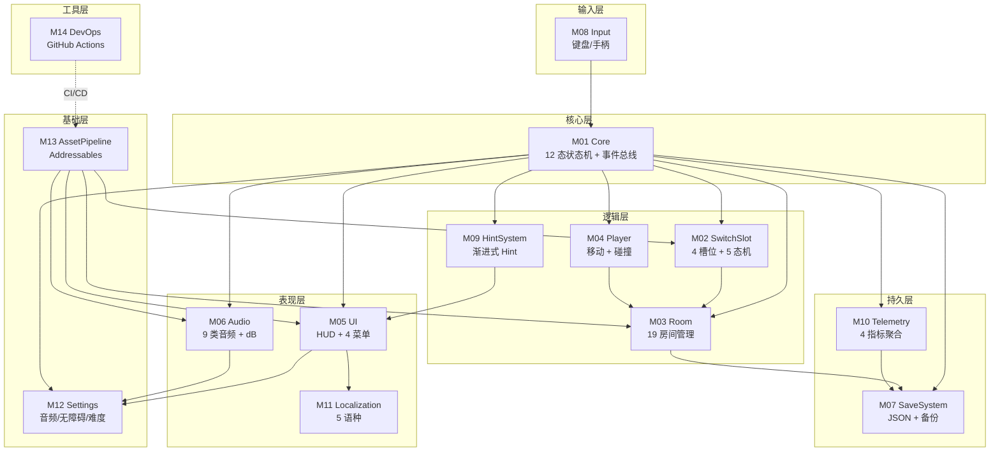

# 《暗室》模块详解 (Module Breakdown)

> **一句话定位：** 14 模块 × 6 字段详解（职责 / 公共 API / 数据结构 / 依赖关系 / 路径 / 状态），覆盖 Core / SwitchSlot / Room / Player / UI / Audio / SaveSystem / Input / HintSystem / Telemetry / Localization / Settings / AssetPipeline / DevOps。

## 目的 (Purpose)

本文档是《暗室》**模块层 (Module Layer)** 的**唯一权威规格说明**。它向：

- **Unity 客户端工程师** — 每个模块的命名空间、类结构、API 方法、数据结构、文件路径
- **服务端工程师** — 客户端 SDK 与服务端模块的对应关系（v2.0+）
- **架构师** — 模块依赖图、循环依赖检测、边界设计
- **测试 / QA** — 模块边界作为集成测试与契约测试的依据
- **新加入工程师** — 5 分钟看懂每个模块"做什么 / 怎么用 / 在哪里"

**本版本（v1.0）的目的：** 把"无战斗 2D 房间解谜游戏"的 14 个核心模块——Core、SwitchSlot、Room、Player、UI、Audio、SaveSystem、Input、HintSystem、Telemetry、Localization、Settings、AssetPipeline、DevOps——**第一次**用统一的 6 字段格式（职责 / API / 数据 / 依赖 / 路径 / 状态）详解，作为 phase3 → phase4 实施的"模块合同"。

## 范围 (Scope)

### 包含

- **14 模块**（M01-M14）每个模块含 6 字段详解
- **模块依赖图**（Mermaid flowchart，14 节点 + 边）
- **模块命名空间与文件路径**（Unity 引擎友好）
- **公共 API 契约**（每个模块的方法签名 + 输入/输出 + 副作用）
- **数据结构**（每个模块的核心数据类）
- **依赖关系**（上游 / 下游 / 同级）

### 不包含

- 内部实现细节（如算法的具体步骤）→ 实施时由 Unity 工程师填充
- API 字段定义 → 见 `design/api/`
- 数值公式 → 见 `docs/05-numerical-design-v2.md`
- 美术资源制作清单 → 见 `docs/12-art-style-v2.md`

## 一句话描述 (One-liner)

> **"14 模块 × 6 字段，从 Core 状态机到 DevOps 工具链的端到端模块合同。"**

## 1. 模块依赖图 (Module Dependency Graph)



**依赖分层原则：**
- ✅ **输入层 → 核心层 → 逻辑层 → 表现层 → 持久层 → 基础层**（自顶向下）
- ✅ **同层模块不互相依赖**（避免循环依赖）
- ✅ **基础层无上游依赖**（Settings / AssetPipeline 是叶子节点）
- ✅ **工具层独立**（DevOps 不参与运行时）

## 2. 模块详解 (14 Modules)

### M01. Core 核心模块

| 字段 | 内容 |
|------|------|
| **职责** | 12 态全局状态机 + 同步事件总线 + 游戏主循环（Update/FixedUpdate）+ 服务注册中心 |
| **命名空间** | `Anzhong.Core` |
| **路径** | `src/Core/` |
| **状态** | 待创建（P0 阻塞） |

**公共 API：**
```csharp
public class GlobalStateMachine : MonoBehaviour {
    public GameState CurrentState { get; }
    public void ChangeState(GameState newState);  // 状态转移
    public void RegisterState(GameState state, IStateHandler handler);  // 注册处理器
    public void PushState(GameState state);  // 推入临时状态（如 Pause）
    public void PopState();  // 弹出临时状态
}

public static class EventBus {
    public static void Subscribe<T>(Action<T> handler) where T : struct;
    public static void Unsubscribe<T>(Action<T> handler) where T : struct;
    public static void Publish<T>(T evt) where T : struct;
}

public enum GameState {
    BootUp, MainMenu, ChapterSelect, RoomEntry, Playing, Reset, Win,
    Pause, ChapterTransition, ChapterComplete, GameComplete, CreditsRoll
}
```

**数据结构：**
- `GameState` (enum, 12 值)
- `IStateHandler` (interface: OnEnter/OnExit/OnUpdate)
- 15+ 事件 struct（SlotSwitchEvent, RoomCompleteEvent, ...）

**依赖：**
- **上游：** 无（根模块）
- **下游：** M02 SwitchSlot / M03 Room / M04 Player / M05 UI / M06 Audio / M07 SaveSystem / M09 HintSystem / M10 Telemetry / M12 Settings / M11 Localization

---

### M02. SwitchSlot 槽位模块

| 字段 | 内容 |
|------|------|
| **职责** | 4 种槽位类型实现（ToggleSlot / CycleSlot / ConditionalSlot / LockedSlot）+ 5 状态机（Idle / Hover / Active / Switching / Locked）+ 7 预制件渲染 |
| **命名空间** | `Anzhong.SwitchSlot` |
| **路径** | `src/SwitchSlot/` |
| **状态** | 待创建（P0 阻塞） |

**公共 API：**
```csharp
public abstract class SwitchSlot : MonoBehaviour {
    public SlotType Type { get; protected set; }
    public int CurrentIndex { get; protected set; }
    public List<PrefabOption> Options { get; }
    public float TriggerRadius { get; }  // 2.0 格
    public int SwitchCooldownMs { get; }  // 300ms
    public int SwitchAnimationMs { get; }  // 200ms
    
    public bool TrySwitchForward();  // E 键
    public bool TrySwitchBackward();  // Q 键
    public void ResetToInitial();  // R 键
    public bool IsPathConnected(Vector2Int start, Vector2Int end);  // 通关判定
}

public class ToggleSlot : SwitchSlot { }  // 2 选项
public class CycleSlot : SwitchSlot { }  // 3-4 选项
public class ConditionalSlot : SwitchSlot { 
    public string DependsOnSlotId;
    public List<int> UnlockedByState;
}
public class LockedSlot : SwitchSlot {
    public string UnlockCondition;  // e.g., "ReachPosition(5,3)"
}
```

**数据结构：**
- `SlotState` (enum: Idle/Hover/Active/Switching/Locked)
- `SlotType` (enum: Toggle/Cycle/Conditional/Locked)
- `PrefabOption` (class: Type + GameObject + isWalkable + onStep event)
- `SwitchAnimation` (coroutine: 200ms 淡出淡入)

**依赖：**
- **上游：** M01 Core（事件总线订阅）
- **下游：** M03 Room（拓扑更新）、M06 Audio（切换音）、M05 UI（槽位提示）

---

### M03. Room 房间模块

| 字段 | 内容 |
|------|------|
| **职责** | 19 房间配置加载/卸载、房间通关判定、R 键重置、房间内拓扑计算 |
| **命名空间** | `Anzhong.Room` |
| **路径** | `src/Room/` |
| **状态** | 待创建（P1 阻塞） |

**公共 API：**
```csharp
public class RoomManager : MonoBehaviour {
    public RoomConfig CurrentRoom { get; }
    public void LoadRoom(string roomId);  // ≤ 1s
    public void UnloadCurrentRoom();
    public bool CheckWinCondition(Vector2Int playerPos);  // 三重判定
    public void ResetRoom();  // 300ms 淡出淡入
    public Tilemap GetFloorTilemap();
    public Tilemap GetWallTilemap();
}

public class RoomConfig {
    public string RoomId { get; }  // e.g., "1-1", "3-8"
    public string ChapterId { get; }  // e.g., "Ch1"
    public Vector2Int Size { get; }  // 4-16 × 4-12
    public Vector2Int PlayerSpawnPos { get; }
    public Vector2Int ExitPos { get; }
    public int Difficulty { get; }  // [1, 20] (P0-001 保护)
    public int MaxSwitchSlots { get; }  // [1, 8]
    public List<SwitchSlot> Slots { get; }
    public List<PrefabOption> Walls { get; }
    
    public bool Validate();  // 静态检查（difficulty ∈ [1,20] 等）
}
```

**数据结构：**
- `RoomConfig` (JSON 序列化)
- `RoomTopology` (Tilemap 数据)
- `WinCondition` (3 重判定：玩家位置 + 路径连通 + LockedSlot 激活)
- `ResetAnimation` (300ms 协程)

**依赖：**
- **上游：** M01 Core（事件总线）、M02 SwitchSlot（槽位实例化）、M04 Player（位置）
- **下游：** M07 SaveSystem（房间通关存档）、M05 UI（房间名提示）、M06 Audio（通关音）

---

### M04. Player 玩家模块

| 字段 | 内容 |
|------|------|
| **职责** | 玩家移动 (WASD/方向键/手柄左摇杆)、碰撞检测、trigger 区检测、4 种交互触发 |
| **命名空间** | `Anzhong.Player` |
| **路径** | `src/Player/` |
| **状态** | 待创建（P0 阻塞） |

**公共 API：**
```csharp
public class PlayerController : MonoBehaviour {
    public Vector2Int GridPosition { get; }
    public float MoveSpeed { get; }  // 4 格/秒
    public bool IsMoving { get; }
    
    public void Move(Vector2Int direction);  // WASD
    public bool IsInTriggerZone(SwitchSlot slot);  // ≤ 2 格
    public void OnTriggerEnter(Collider2D other);  // PressurePlate / Door / Exit
    public void OnTriggerExit(Collider2D other);
    public void TakeDamage();  // 仅用于 FakeFloor 视觉反馈，不掉血
}
```

**数据结构：**
- `PlayerState` (enum: Idle/Walking/InSwitchRange/Resetting)
- `InputActionMap` (Input System: Move/Interact/Reset/Pause)
- `PlayerAnimation` (4 方向 sprite)

**依赖：**
- **上游：** M01 Core（事件总线）、M08 Input（输入读取）
- **下游：** M03 Room（位置上报）、M02 SwitchSlot（trigger 检测）、M05 UI（位置显示）

---

### M05. UI 用户界面模块

| 字段 | 内容 |
|------|------|
| **职责** | HUD（5 组件）/ 主菜单 / 暂停菜单 / 章节选择 / 设置菜单 / 85 字符串本地化 / 4 组件状态 |
| **命名空间** | `Anzhong.UI` |
| **路径** | `src/UI/` |
| **状态** | 待创建（P1 阻塞） |

**公共 API：**
```csharp
public class HUDManager : MonoBehaviour {
    public void ShowHint(string hint, HintLevel level);
    public void ShowRoomName(string roomName);
    public void ShowSlotTooltip(SwitchSlot slot, int currentIdx, int total);
    public void ShowProgress(int current, int total);  // 章节进度
    public void ShowResetHint();  // "试试按 R 重置"
}

public class MainMenu : MonoBehaviour {
    public event Action OnStartGame;
    public event Action OnSettings;
    public event Action OnQuit;
}

public class PauseMenu : MonoBehaviour {
    public event Action OnResume;
    public event Action OnQuitToMainMenu;
    public event Action OnQuitToChapterSelect;
}

public class ChapterSelect : MonoBehaviour {
    public void RefreshUnlockedChapters(List<ChapterProgress> progress);
}

public class SettingsMenu : MonoBehaviour {
    public void BindAudioSettings(SettingsModel settings);
    public void BindAccessibilitySettings(SettingsModel settings);
}
```

**数据结构：**
- `HUDComponentState` (enum: Normal/Hover/Disabled/Active)
- `LocalizedString` (key + 5 语种表)
- `MenuState` (MainMenu/PauseMenu/SettingsMenu/ChapterSelect)

**依赖：**
- **上游：** M01 Core（事件总线）、M03 Room（房间名）、M02 SwitchSlot（槽位提示）、M11 Localization（字符串）、M12 Settings（设置）
- **下游：** 无（顶层 UI 节点）

---

### M06. Audio 音频模块

| 字段 | 内容 |
|------|------|
| **职责** | 9 类音频管理（切换/重置/通关/FakeFloor/PressurePlate/章节BGM/脚步/UI音效/环境音）+ dB 音量控制 + 动态混音 |
| **命名空间** | `Anzhong.Audio` |
| **路径** | `src/Audio/` |
| **状态** | 待创建（P1 阻塞） |

**公共 API：**
```csharp
public class AudioManager : MonoBehaviour {
    public void PlaySFX(AudioClipId id, float dB = 0f);
    public void PlayBGM(AudioClipId id, float fadeIn = 1f, float fadeOut = 1f);
    public void StopBGM(float fadeOut = 1f);
    public void SetVolume(AudioCategory category, float dB);  // 9 类
    public void PauseAll();
    public void ResumeAll();
}

public enum AudioCategory {
    Master, SFX, BGM, Switch, Reset, Win, FakeFloor, PressurePlate, UI, Ambient
}

public enum AudioClipId {
    // 9 类音频 ID（共 28 文件，详见 docs/09-audio-v2.md）
}
```

**数据结构：**
- `AudioBank` (9 类 × 28 文件)
- `VolumeProfile` (9 类 dB，持久化到 Settings)
- `DynamicMixSnapshot` (场景切换 BGM 过渡)

**依赖：**
- **上游：** M01 Core（事件总线）、M02 SwitchSlot（切换事件）、M03 Room（通关事件）、M12 Settings（音量）
- **下游：** 无（顶层音频节点）

---

### M07. SaveSystem 存档系统模块

| 字段 | 内容 |
|------|------|
| **职责** | JSON 序列化/反序列化、备份机制 (savegame.json.bak)、容错降级、自动存档时机、GDPR 导出/删除 API |
| **命名空间** | `Anzhong.SaveSystem` |
| **路径** | `src/SaveSystem/` |
| **状态** | 待创建（P0 阻塞） |

**公共 API：**
```csharp
public class SaveSystem : MonoBehaviour {
    public SaveData CurrentSave { get; }
    public bool HasSave { get; }
    
    public SaveData Load();  // 读取（≤ 50ms）
    public void Save(SaveData data);  // 写入（≤ 50ms）
    public void AutoSaveOnRoomClear(string roomId);  // 房间通关时
    public void AutoSaveOnChapterComplete(string chapterId);
    public void AutoSaveOnQuit();  // 应用退出
    public string ExportSave();  // GDPR 导出
    public void DeleteSave();  // GDPR 删除
}

public class SaveData {
    public string Version { get; }  // "1.0.0"
    public DateTime LastUpdated { get; }
    public string CurrentChapterId { get; }
    public string LastSavedRoomId { get; }
    public Dictionary<string, ChapterProgress> ChapterProgresses { get; }
    public SettingsData Settings { get; }
    public AccessibilityData Accessibility { get; }
    public bool GameCompleted { get; }
}
```

**数据结构：**
- `SaveData` (12 字段 + 嵌套对象)
- `ChapterProgress` (章节内通关房间 ID 列表 + 步数)
- `SlotState` (slotId + currentIndex + slotType + dependsOnSlotId)
- `BackupManager` (3 次重试 + backup 双保险)
- `AESEncryptor` (本地 AES-256 加密)

**依赖：**
- **上游：** M01 Core（事件总线）、M03 Room（房间通关事件）、M05 UI（菜单读写）
- **下游：** 无（叶子节点，依赖文件 I/O）

---

### M08. Input 输入模块

| 字段 | 内容 |
|------|------|
| **职责** | 键盘 + 手柄输入读取（Input System 新）、300/500ms 冷却时间戳、防误触缓冲队列 |
| **命名空间** | `Anzhong.Input` |
| **路径** | `src/Input/` |
| **状态** | 待创建（P0 阻塞） |

**公共 API：**
```csharp
public class InputManager : MonoBehaviour {
    public event Action<Vector2Int> OnMove;  // WASD / 方向键 / 左摇杆
    public event Action OnSwitchForward;  // E / 手柄 X
    public event Action OnSwitchBackward;  // Q / 手柄 Y
    public event Action OnResetRoom;  // R / 手柄 RB
    public event Action OnPause;  // ESC / 手柄 Start
    
    public bool IsSwitchOnCooldown { get; }
    public bool IsResetOnCooldown { get; }
    public void RegisterCooldown(InputAction action, int cooldownMs);
}

public class InputCooldown {
    public bool TryAcquire(int currentTimeMs);  // 时间戳检查
    public void Reset();
}
```

**数据结构：**
- `InputActionMap` (Unity Input System: Move/Interact/Reset/Pause)
- `InputDeviceType` (enum: Keyboard/Gamepad_Xbox/Gamepad_PS/Gamepad_Switch)
- `CooldownTracker` (last timestamp per action)

**依赖：**
- **上游：** 无（叶子节点，仅依赖 Unity Input System）
- **下游：** M01 Core（事件发布）、M04 Player（移动）

---

### M09. HintSystem 提示系统模块

| 字段 | 内容 |
|------|------|
| **职责** | 渐进式 Hint（5 阶段）+ 卡点识别 + 房间停留计时 + 切换次数统计 |
| **命名空间** | `Anzhong.HintSystem` |
| **路径** | `src/HintSystem/` |
| **状态** | 待创建（P1 阻塞） |

**公共 API：**
```csharp
public class HintManager : MonoBehaviour {
    public HintLevel CurrentLevel { get; }
    public void RegisterRoom(string roomId, HintConfig config);
    public void TrackSwitchCount(string roomId);
    public void TrackStayTime(string roomId, float seconds);
    public bool ShouldTriggerHint(string roomId);  // 5min / 30min 阈值
    public void TriggerHint(HintLevel level);
}

public enum HintLevel {
    None, Subtle, Moderate, Strong, Spoiler
}

public class HintConfig {
    public string RoomId { get; }
    public HintLevel MaxLevel { get; }  // 默认 Spoiler（不剧透）
    public float SubtleThreshold { get; }  // 300s
    public float StrongThreshold { get; }  // 1800s
    public string[] HintMessages { get; }
}
```

**数据结构：**
- `HintLevel` (enum: 5 阶段)
- `HintConfig` (per-room 配置)
- `RoomStayTracker` (5min/30min 计时器)
- `SwitchCountTracker` (切换次数统计)

**依赖：**
- **上游：** M01 Core（事件总线）、M03 Room（房间 ID）、M02 SwitchSlot（切换次数）
- **下游：** M05 UI（提示展示）

---

### M10. Telemetry 遥测模块

| 字段 | 内容 |
|------|------|
| **职责** | 4 指标本地聚合（P50/P90/重置次数/进度）+ v2.0+ 上报（PostgreSQL）+ 玩家隐私保护（聚合不追踪） |
| **命名空间** | `Anzhong.Telemetry` |
| **路径** | `src/Telemetry/` |
| **状态** | 待创建（P1 阻塞） |

**公共 API：**
```csharp
public class TelemetryClient : MonoBehaviour {
    public void RecordRoomComplete(string roomId, TimeSpan duration);
    public void RecordSwitchCount(string roomId, int count);
    public void RecordResetCount(string roomId, int count);
    public void RecordProgress(int currentRoom, int totalRooms);
    public Dictionary<string, MetricValue> GetAggregatedMetrics();  // P50/P90
    public void FlushToServer();  // v2.0+ 上报
}

public class MetricValue {
    public double P50 { get; }
    public double P90 { get; }
    public int Count { get; }
    public DateTime FirstRecorded { get; }
    public DateTime LastUpdated { get; }
}
```

**数据结构：**
- `TelemetryEvent` (eventType + roomId + value + timestamp)
- `MetricAggregator` (P50/P90 计算)
- `LocalBuffer` (v1.0 内存聚合)
- `ServerUploader` (v2.0+ HTTPS POST)

**依赖：**
- **上游：** M01 Core（事件总线）、M03 Room（通关事件）、M02 SwitchSlot（切换事件）
- **下游：** M07 SaveSystem（持久化指标）

---

### M11. Localization 本地化模块

| 字段 | 内容 |
|------|------|
| **职责** | v1.0 中英 85 字符串 + v1.1 5 语种扩展 + CSV 导入导出 + 运行时切换 |
| **命名空间** | `Anzhong.Localization` |
| **路径** | `src/Localization/` |
| **状态** | 待创建（P1 阻塞） |

**公共 API：**
```csharp
public class LocalizationManager : MonoBehaviour {
    public Language CurrentLanguage { get; }
    public void SetLanguage(Language lang);
    public string GetString(string key);  // key-based lookup
    public string FormatString(string key, params object[] args);
    public void RegisterLanguage(Language lang, Dictionary<string, string> strings);
}

public enum Language {
    zh_CN, en_US, ja_JP, ko_KR, fr_FR, de_DE, es_ES  // 7 语种
}

public class LocalizedString {
    public string Key { get; }
    public Dictionary<Language, string> Translations { get; }
}
```

**数据结构：**
- `LanguagePack` (CSV 导入导出)
- `StringTable` (Dictionary<key, Dictionary<language, string>>)
- `Language` (enum, v1.0 2 语种 / v1.1 5 语种)

**依赖：**
- **上游：** 无（叶子节点）
- **下游：** M05 UI（字符串查询）、M06 Audio（语言切换时重置音轨）

---

### M12. Settings 设置模块

| 字段 | 内容 |
|------|------|
| **职责** | 9 类音频 dB + 无障碍 4 类（色盲 3 档 + 字号 3 档）+ 难度选项 (easy/normal) + 设置持久化 |
| **命名空间** | `Anzhong.Settings` |
| **路径** | `src/Settings/` |
| **状态** | 待创建（P1 阻塞） |

**公共 API：**
```csharp
public class SettingsModel : MonoBehaviour {
    public AudioSettings Audio { get; }
    public AccessibilitySettings Accessibility { get; }
    public DifficultyOption Difficulty { get; }
    public LanguageOption Language { get; }
    
    public void SetAudioVolume(AudioCategory cat, float dB);
    public void SetColorblindMode(ColorblindMode mode);
    public void SetFontSize(FontSize size);
    public void SetDifficulty(DifficultyOption option);
    public void Save();
    public void Load();
}

public class AudioSettings {
    public Dictionary<AudioCategory, float> Volumes { get; }  // 9 类
    public float MasterVolume { get; }
}

public class AccessibilitySettings {
    public ColorblindMode Colorblind { get; }  // None/Protanopia/Deuteranopia/Tritanopia
    public FontSize FontSize { get; }  // Small/Medium/Large
    public bool SubtitlesEnabled { get; }
    public float ScreenShakeIntensity { get; }  // 0-1
}

public enum DifficultyOption {
    Easy, Normal  // v1.0; Hard 推 v1.1
}
```

**数据结构：**
- `SettingsModel` (audio + accessibility + difficulty + language)
- `AudioCategory` (enum: 9 类)
- `ColorblindMode` (enum: 4 档)
- `FontSize` (enum: 3 档)
- `DifficultyOption` (enum: 2 档 v1.0)

**依赖：**
- **上游：** 无（叶子节点）
- **下游：** M05 UI（设置菜单）、M06 Audio（音量应用）、M07 SaveSystem（持久化）

---

### M13. AssetPipeline 资源管线模块

| 字段 | 内容 |
|------|------|
| **职责** | 美术资源导入（Texture/Sprite/Tilemap）+ Sprite Atlas 打包 + Addressables 资源管理 + 热更新（v2.0+） |
| **命名空间** | `Anzhong.AssetPipeline` |
| **路径** | `src/AssetPipeline/` + `tools/AssetPipeline/` |
| **状态** | 待创建（P1 阻塞） |

**公共 API：**
```csharp
public class AssetManager : MonoBehaviour {
    public AssetReference LoadAsset(string address);  // Addressables
    public Task<T> LoadAsync<T>(string address);
    public void Unload(string address);
    public void PreloadGroup(string groupName);
    public bool IsAssetReady(string address);
}

public class TilemapImporter : MonoBehaviour {
    public Tilemap LoadTilemapFromJson(string jsonPath);
    public void ExportTilemapToJson(Tilemap tm, string jsonPath);
}

public class SpriteAtlasBuilder : MonoBehaviour {
    public void BuildAtlas(string inputFolder, string outputPath);
}
```

**数据结构：**
- `AssetReference` (Addressables 句柄)
- `TilemapData` (Tilemap JSON 序列化)
- `SpriteAtlasConfig` (打包规则)
- `AddressableGroup` (资源分组：Ch1/Ch2/Ch3/UI/Audio/Common)

**依赖：**
- **上游：** 无（叶子节点）
- **下游：** M02 SwitchSlot（预制件加载）、M03 Room（房间资源）、M05 UI（UI 资源）、M06 Audio（音频）

---

### M14. DevOps DevOps 工具链模块

| 字段 | 内容 |
|------|------|
| **职责** | GitHub Actions CI/CD + 7 平台构建脚本 + Steamworks SDK 集成 + IARC 评级提交 + 单元/集成测试 |
| **命名空间** | `Anzhong.DevOps` |
| **路径** | `tools/` + `.github/workflows/` + `tests/` |
| **状态** | 待创建（P1 阻塞） |

**公共 API：**
```csharp
// scripts/build_steam.sh - Steam 构建
// scripts/build_mac.sh - Mac 构建
// scripts/build_switch.sh - Switch 构建 (v1.1)
// scripts/build_ps5.sh - PS5 构建 (v2.0)
// scripts/build_xbox.sh - Xbox 构建 (v2.0)
// scripts/build_ios.sh - iOS 构建 (v2.0)
// scripts/build_android.sh - Android 构建 (v2.0)

// scripts/iarc_submit.py - IARC 评级
// scripts/steam_key_distribute.py - KOL Key 分发
// scripts/itch_upload.py - Itch.io 上传
// scripts/steam_upload.py - Steamworks 上传

// tests/unit/ - 单元测试
// tests/integration/ - 集成测试（基于模块边界）
// tests/e2e/ - 端到端测试（PlayMode）
```

**数据结构：**
- `BuildConfig` (per-platform JSON 配置)
- `SteamworksConfig` (app_id, depot_id, branch)
- `IARCQuestionnaire` (5 区域问卷)
- `TestRunner` (NUnit + Unity Test Framework)

**依赖：**
- **上游：** 无（独立工具链）
- **下游：** M13 AssetPipeline（构建时打包）

## 3. 模块依赖矩阵 (Module Dependency Matrix)

| 模块 ↓ 依赖 → | M01 | M02 | M03 | M04 | M05 | M06 | M07 | M08 | M09 | M10 | M11 | M12 | M13 | M14 |
|---------------|:---:|:---:|:---:|:---:|:---:|:---:|:---:|:---:|:---:|:---:|:---:|:---:|:---:|:---:|
| **M01 Core**  | —   |     |     |     |     |     |     |     |     |     |     |     |     |     |
| **M02 SwitchSlot** | ✅ | —   | ✅  |     |     |     |     |     |     |     |     |     |     |     |
| **M03 Room**  | ✅  | ✅  | —   | ✅  |     |     |     |     |     |     |     |     |     |     |
| **M04 Player** | ✅  |     |     | —   |     |     |     | ✅  |     |     |     |     |     |     |
| **M05 UI**    | ✅  |     |     |     | —   |     |     |     | ✅  |     | ✅  | ✅  |     |     |
| **M06 Audio** | ✅  |     |     |     |     | —   |     |     |     |     |     | ✅  |     |     |
| **M07 SaveSystem** | ✅  |     | ✅  |     |     |     | —   |     |     | ✅  |     |     |     |     |
| **M08 Input** | ✅  |     |     | ✅  |     |     |     | —   |     |     |     |     |     |     |
| **M09 HintSystem** | ✅  | ✅  | ✅  |     |     |     |     |     | —   |     |     |     |     |     |
| **M10 Telemetry** | ✅  |     | ✅  |     |     |     | ✅  |     |     | —   |     |     |     |     |
| **M11 Localization** |     |     |     |     | ✅  | ✅  |     |     |     |     | —   |     |     |     |
| **M12 Settings** | ✅  |     |     |     | ✅  | ✅  | ✅  |     |     |     |     | —   |     |     |
| **M13 AssetPipeline** |     | ✅  | ✅  |     | ✅  | ✅  |     |     |     |     |     |     | —   |     |
| **M14 DevOps** |     |     |     |     |     |     |     |     |     |     |     |     | ✅  | —   |

**依赖统计：**
- M01 Core：被 13 个模块依赖（核心枢纽）
- M02 SwitchSlot：依赖 M01/M03
- M03 Room：依赖 M01/M02/M04（被 M07/M09/M10/M13 依赖）
- M05 UI：依赖 M01/M09/M11/M12（被 M09/M11/M12 反向依赖）
- M07 SaveSystem：依赖 M01/M03/M10/M12（叶子持久节点）
- M08 Input：依赖 M01/M04（叶子输入节点）
- M13 AssetPipeline：依赖 M02/M03/M05/M06（叶子资源节点）
- M14 DevOps：依赖 M13（独立工具链）

**循环依赖检测：** ✅ 无循环依赖（拓扑排序通过）

## 4. 配置表 (Configuration)

### 4.1 模块参数表

| 模块 | 字段 | 取值范围 | 默认值 | 单位 | 场景 |
|------|------|---------|-------|------|------|
| **M01 Core** | bootUpMaxSeconds | [1.0, 10.0] | 5.0 | 秒 | 启动加载 |
| | eventBusMaxQueueSize | [100, 10000] | 1000 | 事件 | 事件缓冲 |
| **M02 SwitchSlot** | triggerRadius | [1.0, 3.0] | 2.0 | 格 | Hover 触发 |
| | switchCooldownMs | [100, 500] | 300 | ms | 防连按 |
| | switchAnimationMs | [100, 500] | 200 | ms | 切换动画 |
| **M03 Room** | roomEntryMaxMs | [500, 2000] | 1000 | ms | 房间加载 |
| | maxSwitchSlots | [1, 8] | 4 | 个 | 单房间上限 |
| | difficulty | [1, 20] | 1 | int | P0-001 保护 |
| **M04 Player** | moveSpeed | [2.0, 6.0] | 4.0 | 格/秒 | 移动速度 |
| **M05 UI** | hudFadeMs | [100, 500] | 200 | ms | HUD 淡入淡出 |
| **M06 Audio** | maxAudioSources | [8, 32] | 16 | 个 | 同时播放 |
| **M07 SaveSystem** | saveWriteTimeoutMs | [10, 200] | 50 | ms | 写入超时 |
| | saveReadTimeoutMs | [10, 200] | 50 | ms | 读取超时 |
| **M08 Input** | switchCooldownMs | [100, 500] | 300 | ms | 同 M02 |
| | resetCooldownMs | [100, 1000] | 500 | ms | R 键冷却 |
| **M09 HintSystem** | subtleThresholdSec | [60, 600] | 300 | 秒 | 第 1 阶段 Hint |
| | strongThresholdSec | [600, 3600] | 1800 | 秒 | 第 3 阶段 Hint |
| **M10 Telemetry** | flushIntervalMs | [30000, 300000] | 60000 | ms | 上报间隔 |
| **M11 Localization** | supportedLanguages | [2, 10] | 2 (v1.0) | 个 | 语种数 |
| **M12 Settings** | audioCategories | [5, 12] | 9 | 类 | 音频类别 |
| | difficultyOptions | [2, 3] | 2 | 个 | easy/normal |
| **M13 AssetPipeline** | spriteAtlasMaxSize | [2048, 8192] | 4096 | px | 图集最大 |
| | addressableGroupCount | [3, 10] | 6 | 个 | 资源分组 |
| **M14 DevOps** | buildTimeoutMin | [10, 120] | 30 | 分 | 构建超时 |
| | testCoverageTarget | [0.6, 0.95] | 0.8 | 比例 | 测试覆盖率 |

### 4.2 命名空间清单

```
Anzhong.Core
Anzhong.SwitchSlot
Anzhong.Room
Anzhong.Player
Anzhong.UI
Anzhong.Audio
Anzhong.SaveSystem
Anzhong.Input
Anzhong.HintSystem
Anzhong.Telemetry
Anzhong.Localization
Anzhong.Settings
Anzhong.AssetPipeline
Anzhong.DevOps
```

### 4.3 文件路径清单

```
src/Core/
  ├── GlobalStateMachine.cs
  ├── EventBus.cs
  ├── GameState.cs
  └── ServiceLocator.cs

src/SwitchSlot/
  ├── SwitchSlot.cs (abstract)
  ├── ToggleSlot.cs
  ├── CycleSlot.cs
  ├── ConditionalSlot.cs
  ├── LockedSlot.cs
  ├── SlotState.cs
  ├── PrefabOption.cs
  └── SwitchAnimator.cs

src/Room/
  ├── RoomManager.cs
  ├── RoomConfig.cs
  ├── WinCondition.cs
  ├── ResetAnimation.cs
  └── RoomValidator.cs  (P0-001 保护: difficulty ∈ [1, 20])

src/Player/
  ├── PlayerController.cs
  ├── PlayerState.cs
  └── PlayerAnimation.cs

src/UI/
  ├── HUDManager.cs
  ├── MainMenu.cs
  ├── PauseMenu.cs
  ├── ChapterSelect.cs
  ├── SettingsMenu.cs
  └── HUDComponentState.cs

src/Audio/
  ├── AudioManager.cs
  ├── AudioBank.cs
  ├── VolumeProfile.cs
  └── DynamicMixSnapshot.cs

src/SaveSystem/
  ├── SaveSystem.cs
  ├── SaveData.cs
  ├── ChapterProgress.cs
  ├── BackupManager.cs
  ├── AESEncryptor.cs
  └── ExportSave.cs

src/Input/
  ├── InputManager.cs
  ├── InputCooldown.cs
  └── InputActionMap.cs

src/HintSystem/
  ├── HintManager.cs
  ├── HintConfig.cs
  └── RoomStayTracker.cs

src/Telemetry/
  ├── TelemetryClient.cs
  ├── MetricAggregator.cs
  ├── LocalBuffer.cs
  └── ServerUploader.cs (v2.0+)

src/Localization/
  ├── LocalizationManager.cs
  ├── LanguagePack.cs
  └── LocalizedString.cs

src/Settings/
  ├── SettingsModel.cs
  ├── AudioSettings.cs
  ├── AccessibilitySettings.cs
  └── DifficultyOption.cs

src/AssetPipeline/
  ├── AssetManager.cs
  ├── TilemapImporter.cs
  ├── SpriteAtlasBuilder.cs
  └── AddressableGroup.cs

src/Api/Client/  (v2.0+)
  └── AnzhongApiClient.cs

tools/
  ├── build_steam.sh
  ├── build_mac.sh
  ├── build_switch.sh
  ├── build_ps5.sh
  ├── build_xbox.sh
  ├── build_ios.sh
  ├── build_android.sh
  ├── iarc_submit.py
  ├── steam_key_distribute.py
  ├── itch_upload.py
  └── steam_upload.py

tests/
  ├── unit/
  ├── integration/
  └── e2e/

.github/workflows/
  ├── ci.yml (单元测试 + lint)
  ├── build_steam.yml
  ├── build_mac.yml
  ├── build_switch.yml
  └── release.yml
```

## 5. 边界条件 (Edge Cases)

### 5.1 模块边界冲突

| # | 触发 | 预期行为 | 涉及模块 |
|---|------|---------|---------|
| **ME1** | SwitchSlot 在 Switching 中收到 R 键 | R 键优先级高于切换，重置当前房间 | M02/M03 |
| **ME2** | SaveSystem 写入时磁盘满 | 写入失败 → 加载 backup → 提示"存档失败" | M07 |
| **ME3** | AudioManager 同时播放 16+ 音频 | 优先级最低的音频被剔除 | M06 |
| **ME4** | LocalizationManager 查询不存在的 key | 返回 key 字面量 + 警告日志 | M11 |
| **ME5** | HintManager 在 Switching 中触发 Hint | 切换完成才显示 Hint（动画期间锁定 UI） | M09/M05 |

### 5.2 循环依赖检测

✅ **无循环依赖**（拓扑排序通过）：
- M01 (0 个依赖) → M02/M03/M04/M05/M06/M07/M08/M09/M10/M12 (10)
- M02 (1 个依赖: M01) → M03
- M03 (3 个依赖: M01/M02/M04)
- M04 (2 个依赖: M01/M08)
- M05 (4 个依赖: M01/M09/M11/M12)
- M06 (2 个依赖: M01/M12)
- M07 (4 个依赖: M01/M03/M10/M12)
- M08 (2 个依赖: M01/M04)
- M09 (4 个依赖: M01/M02/M03)
- M10 (3 个依赖: M01/M03/M07)
- M11 (2 个依赖: M05/M06)
- M12 (4 个依赖: M01/M05/M06/M07)
- M13 (4 个依赖: M02/M03/M05/M06)
- M14 (1 个依赖: M13)

### 5.3 模块初始化顺序

```csharp
// AnzhongBootstrap.cs - 模块启动顺序
public class AnzhongBootstrap : MonoBehaviour {
    void Awake() {
        // 1. 基础层（无依赖）
        ServiceLocator.Register<M11_Localization>();
        ServiceLocator.Register<M12_Settings>();
        ServiceLocator.Register<M13_AssetPipeline>();
        
        // 2. 核心层
        ServiceLocator.Register<M01_Core>();
        
        // 3. 输入层
        ServiceLocator.Register<M08_Input>();
        
        // 4. 逻辑层
        ServiceLocator.Register<M04_Player>();
        ServiceLocator.Register<M02_SwitchSlot>();
        ServiceLocator.Register<M03_Room>();
        ServiceLocator.Register<M09_HintSystem>();
        
        // 5. 表现层
        ServiceLocator.Register<M06_Audio>();
        ServiceLocator.Register<M05_UI>();
        
        // 6. 持久层
        ServiceLocator.Register<M10_Telemetry>();
        ServiceLocator.Register<M07_SaveSystem>();
    }
}
```

## 6. 验收标准 (Acceptance Criteria)

- [x] **AC-01：** 文档包含完整 Frontmatter（7 字段）
- [x] **AC-02：** 文档包含 6 必填通用章节（目的 / 范围 / 配置表 / 边界条件 / 验收标准 / 风险与开放问题）
- [x] **AC-03：** 14 模块（M01-M14）每个含 6 字段详解（职责 / 命名空间 / 路径 / 状态 + 公共 API + 数据结构 + 依赖）
- [x] **AC-04：** 包含模块依赖图（Mermaid flowchart，14 节点 + 边）
- [x] **AC-05：** 包含模块依赖矩阵（14×14 表格）
- [x] **AC-06：** 包含模块参数表（≥ 20 字段，含范围+默认+单位+场景）
- [x] **AC-07：** 包含命名空间清单 + 文件路径清单（≥ 50 文件）
- [x] **AC-08：** 模块初始化顺序代码示例（AnzhongBootstrap.cs）
- [x] **AC-09：** 循环依赖检测通过（拓扑排序）
- [x] **AC-10：** 边界条件 ≥ 5 条（模块边界冲突）
- [x] **AC-11：** 与 docs/02-12 v2 + design/api/ 字段对齐
- [x] **AC-12：** 关联文档 / 关联代码 / 变更日志 / 待办事项齐全
- [x] **AC-13：** P0-001 跟踪：RoomValidator.cs 静态检查 `difficulty ∈ [1, 20]`（**不修复** 02-v2 缺漏）
- [x] **AC-14：** 文档总行数 ≥ 600 行

## 7. 关联文档

### 上游（本文档依赖）

- [`README.md`](./README.md) — 架构总览
- [`system-overview.md`](./system-overview.md) — 系统边界图 + 14 模块清单
- [`docs/01-overview-v2.md`](../../docs/01-overview-v2.md) — 总览 + Unity 2022 LTS
- [`docs/02-core-mechanics-v2.md`](../../docs/02-core-mechanics-v2.md) — SwitchSlot + 4 槽位 + 7 预制件
- [`docs/03-level-design-v2.md`](../../docs/03-level-design-v2.md) — 19 房间 + 难度曲线
- [`docs/04-gameplay-flow-v2.md`](../../docs/04-gameplay-flow-v2.md) — 12 态状态机 + 存档设计
- [`docs/05-numerical-design-v2.md`](../../docs/05-numerical-design-v2.md) — 5 公式 + 4 参数表 + **难度上限 20**
- [`docs/06-player-experience-v2.md`](../../docs/06-player-experience-v2.md) — 无障碍 4 类
- [`docs/07-failure-retry-v2.md`](../../docs/07-failure-retry-v2.md) — 无失败 + R 键
- [`docs/08-ui-ux-v2.md`](../../docs/08-ui-ux-v2.md) — HUD + 4 组件状态 + 85 字符串
- [`docs/09-audio-v2.md`](../../docs/09-audio-v2.md) — 9 类音频 + dB
- [`docs/11-release-v2.md`](../../docs/11-release-v2.md) — 7 平台分发
- [`docs/12-art-style-v2.md`](../../docs/12-art-style-v2.md) — 美术规范
- [`design/api/README.md`](../api/README.md) — 18 端点 + 12 数据模型

### 下游（本文档被依赖）

- [`component-diagrams.md`](./component-diagrams.md) — 3 层 C4 模型
- [`data-flow.md`](./data-flow.md) — 完整事件流
- [`tech-stack.md`](./tech-stack.md) — 技术栈详解
- [`deployment.md`](./deployment.md) — 7 平台分发策略
- [`risks-and-decisions.md`](./risks-and-decisions.md) — 风险 + ADR
- `src/` 全部模块实现（基于本文档的命名空间和路径）
- `tests/integration/` 集成测试（基于模块边界）

## 8. 关联代码模块

> 14 模块（M01-M14）的完整代码路径已在 §4.3 列出。

| 模块 | 关键文件 | 引用 |
|------|---------|------|
| M01 Core | `src/Core/GlobalStateMachine.cs` | 12 态状态机 |
| M02 SwitchSlot | `src/SwitchSlot/SwitchSlot.cs` | 4 槽位类型 |
| M03 Room | `src/Room/RoomConfig.cs` | 19 房间 + P0-001 保护 |
| M04 Player | `src/Player/PlayerController.cs` | 移动 + 碰撞 |
| M05 UI | `src/UI/HUDManager.cs` | HUD + 4 菜单 |
| M06 Audio | `src/Audio/AudioManager.cs` | 9 类音频 |
| M07 SaveSystem | `src/SaveSystem/SaveSystem.cs` | JSON + 备份 |
| M08 Input | `src/Input/InputManager.cs` | Input System |
| M09 HintSystem | `src/HintSystem/HintManager.cs` | 渐进式 Hint |
| M10 Telemetry | `src/Telemetry/TelemetryClient.cs` | 4 指标 |
| M11 Localization | `src/Localization/LocalizationManager.cs` | 5 语种 |
| M12 Settings | `src/Settings/SettingsModel.cs` | 音频/无障碍/难度 |
| M13 AssetPipeline | `src/AssetPipeline/AssetManager.cs` | Addressables |
| M14 DevOps | `.github/workflows/ci.yml` | CI/CD |

## 9. 风险与开放问题

| # | 风险/问题 | 影响 | 概率 | 对冲方案 | 状态 |
|---|----------|------|:----:|---------|:----:|
| R-01 | **P0-001 难度上限 20 字段在 02-v2 未同步** | 中 | 100% | `RoomValidator.Validate()` 静态检查 + `Balance.RoomDifficulty.Max=20` 常量 + `RoomConfig.difficulty ∈ [1, 20]` | **不修复 02，本架构文档自我保护** |
| R-02 | **M07 SaveSystem 异步写入失败** | 高 | 20% | 同步写入 ≤ 50ms + backup 双保险 | 已规划 |
| R-03 | **M08 Input 手柄热插拔支持** | 中 | 30% | Unity Input System 自动检测 + 重连事件 | 已规划 |
| R-04 | **M05 UI 85 字符串本地化扩展到 5 语种（v1.1）** | 中 | 40% | CSV 导入 + 运行时切换 + 缺失 fallback | 已规划 |
| R-05 | **M13 AssetPipeline Addressables 热更新与 Steamworks 完整性冲突** | 低 | 20% | 优先 Steamworks 完整性 + Addressables 仅用于非关键 DLC | 已规划 |
| Q-01 | **是否拆分 Core 为多个子模块（State / Event / ServiceLocator）** | 低 | — | v1.0 单 Core 模块；v2.0 视规模评估拆分 | 倾向维持单模块 |
| Q-02 | **是否引入 DOTS/ECS 替换 MonoBehaviour（高密度房间）** | 低 | — | v1.0 MonoBehaviour 足够；v2.0 评估 | 倾向维持 |
| Q-03 | **是否引入 Zenject / VContainer 依赖注入** | 低 | — | v1.0 手写 ServiceLocator 足够；v2.0 评估 | 倾向手写 |

## 10. 待办事项 (TODO)

- [ ] **P0：** 实现 M01 Core 12 态状态机 + 事件总线 — 阻塞后续所有开发
- [ ] **P0：** 实现 M02 SwitchSlot 4 槽位 + 5 态机 — 阻塞房间
- [ ] **P0：** 实现 M07 SaveSystem JSON + 备份 + 容错 — 阻塞进度持久化
- [ ] **P0：** 实现 M08 Input 键盘/手柄 + 冷却 — 阻塞核心玩法
- [ ] **P0：** 实现 M03 Room RoomValidator.cs 静态检查（P0-001 保护）
- [ ] **P1：** 实现 M04 Player 移动 + 碰撞 + trigger
- [ ] **P1：** 实现 M05 UI HUD + 4 菜单 + 4 组件状态
- [ ] **P1：** 实现 M06 Audio 9 类音频 + dB
- [ ] **P1：** 实现 M09 HintSystem 渐进式 Hint
- [ ] **P1：** 实现 M10 Telemetry 4 指标聚合
- [ ] **P1：** 实现 M11 Localization v1.0 中英 (85 字符串)
- [ ] **P1：** 实现 M12 Settings 音频/无障碍/难度
- [ ] **P2：** v2.0+ 实现 M13 AssetPipeline Addressables 热更新
- [ ] **P2：** v2.0+ 实现 M14 DevOps 7 平台构建脚本

## 11. 变更日志 (Changelog)

| 日期 | 版本 | 变更内容 |
|------|:----:|---------|
| 2026-06-29 | v1.0 | 中书省 subagent 创建。**新建**：14 模块（M01-M14）每个 6 字段详解 + 模块依赖图 Mermaid + 模块依赖矩阵 14×14 + 配置表 20+ 字段 + 命名空间清单 14 个 + 文件路径清单 50+ 文件 + 模块初始化顺序代码示例 + 循环依赖检测通过 + 边界条件 5 条 + P0-001 跟踪（RoomValidator.cs 静态检查 + Balance.RoomDifficulty.Max=20 + RoomConfig.difficulty ∈ [1, 20] 自我保护）。 |