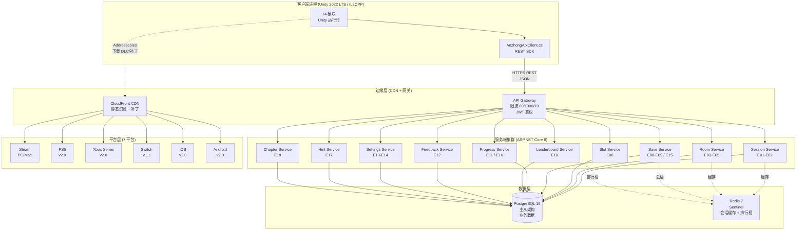
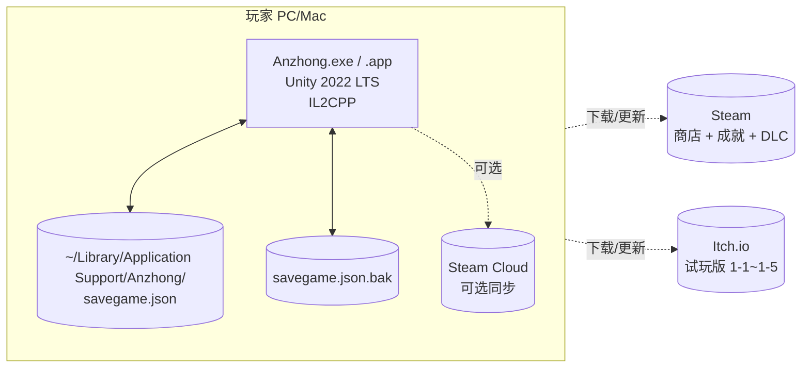
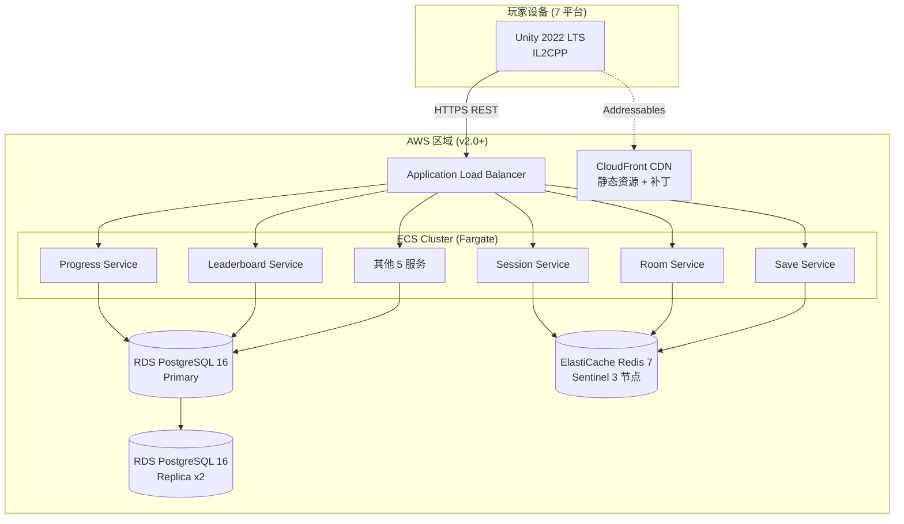

# 《暗室》系统总览 (System Overview)

> **一句话定位：** 客户端 + 服务端（v2.0+）+ 数据流 + 部署 的端到端系统视图，覆盖 Unity 2022 LTS / .NET 8 / PostgreSQL 16 / Redis 7 / CloudFront CDN / 7 平台分发。

## 目的 (Purpose)

本文档是《暗室》**系统层 (System Layer)** 的**唯一权威规格说明**。它向：

- **架构师** — 提供系统边界、子系统划分、跨进程/跨网络交互的清晰图景
- **客户端工程师** — 理解 Unity 运行时由哪些子系统组成、玩家操作如何转化为视觉/音效反馈
- **服务端工程师**（v2.0+）— 理解 ASP.NET Core 服务、PostgreSQL 数据库、Redis 缓存、CDN 的关系
- **DevOps 工程师** — 理解 7 平台构建、CI/CD 流水线、CDN 缓存策略
- **新加入工程师** — 5 分钟看懂《暗室》系统的全貌

**本版本（v1.0）的目的：** 把"无战斗 2D 房间解谜游戏"的 v1.0 客户端 + v2.0+ 服务端架构用一张总览图统一描述——客户端（Unity 2022 LTS + 14 模块）+ 数据流（事件总线 + 状态机）+ 服务端（v2.0+ .NET 8 + PostgreSQL 16）+ CDN（CloudFront + Steamworks）+ 部署（7 平台 v1.0/v1.1/v2.0 三档）——作为后续模块详解（`module-breakdown.md`）和数据流（`data-flow.md`）的"母版"。

## 范围 (Scope)

### 包含

- **系统边界**：客户端进程 / 服务端进程（v2.0+）/ 数据库 / CDN / 7 平台
- **子系统划分**：游戏运行时 14 模块（Core / SwitchSlot / Room / Player / UI / Audio / SaveSystem / Input / HintSystem / Telemetry / Localization / Settings / AssetPipeline / DevOps）
- **跨子系统交互**：事件总线 + 状态机 + 直接方法调用
- **跨进程交互**（v2.0+）：REST API + OpenAPI 3.0 + JWT 鉴权 + 60/1000/10 三档限流
- **数据持久化**：本地 JSON（v1.0）+ Steam Cloud（v1.0）+ PostgreSQL 16（v2.0+ 云存档）
- **资产分发**：Addressables（v1.0 客户端）+ CloudFront CDN（v2.0+ 静态资源）+ Steamworks CDN（v1.0）
- **部署拓扑**：单机进程（v1.0）+ ASP.NET Core Cluster（v2.0+）+ PostgreSQL 主从（v2.0+）+ Redis Sentinel（v2.0+）

### 不包含 (Out of Scope)

- 单个模块的 API 字段定义 → 见 `design/api/`（18 端点 + 12 数据模型）
- 数值公式与调参 → 见 `docs/05-numerical-design-v2.md`
- 具体房间关卡设计 → 见 `docs/03-level-design-v2.md`
- SwitchSlot 内部 5 态实现 → 见 `docs/02-core-mechanics-v2.md`
- 美术资源制作清单 → 见 `docs/12-art-style-v2.md`
- 营销节奏与合规法务 → 见 `docs/11-release-v2.md`

## 一句话描述 (One-liner)

> **"v1.0 单机 Unity 进程 + v2.0+ .NET 服务端 + PostgreSQL 16 + Redis 7 + 7 平台分发的端到端系统视图。"**

## 1. v1.0 系统视图（单机客户端）

### 1.1 v1.0 系统边界图（Mermaid）

```mermaid
flowchart TB
    subgraph Client["v1.0 客户端进程 (Unity 2022 LTS / IL2CPP)"]
        PlayerInput[玩家输入]
        InputModule[Input 模块<br/>Input System]
        CoreModule[Core 模块<br/>12 态全局状态机<br/>+ 事件总线]
        SwitchSlotModule[SwitchSlot 模块<br/>4 槽位类型<br/>5 状态机]
        RoomModule[Room 模块<br/>19 房间配置<br/>通关判定/重置]
        PlayerModule[Player 模块<br/>移动/碰撞/trigger]
        UIModule[UI 模块<br/>HUD + 4 菜单]
        AudioModule[Audio 模块<br/>9 类音频 + dB]
        SaveSystemModule[SaveSystem 模块<br/>JSON + 备份]
        HintModule[HintSystem 模块<br/>渐进式 Hint]
        TelemetryModule[Telemetry 模块<br/>4 指标聚合]
        SettingsModule[Settings 模块<br/>音频/无障碍/难度]
        LocalizationModule[Localization 模块<br/>中英 85 字符串]
        AssetModule[AssetPipeline<br/>Addressables]
        DevOpsModule[DevOps<br/>GitHub Actions]
        
        InputModule --> CoreModule
        CoreModule --> SwitchSlotModule
        CoreModule --> RoomModule
        CoreModule --> PlayerModule
        CoreModule --> UIModule
        CoreModule --> AudioModule
        CoreModule --> SaveSystemModule
        CoreModule --> HintModule
        CoreModule --> TelemetryModule
        CoreModule --> SettingsModule
        CoreModule --> LocalizationModule
        SwitchSlotModule --> RoomModule
        PlayerModule --> RoomModule
        RoomModule --> UIModule
        RoomModule --> AudioModule
        SaveSystemModule -.本地存档.-> Disk[(本地磁盘<br/>savegame.json)]
        AssetModule -.Addressables.-> Resources[(Resources<br/>StreamingAssets)]
    end
    
    PlayerInput --> InputModule
    
    SteamCloud[(Steam Cloud<br/>云存档 v1.0)]
    SaveSystemModule -.v1.0 可选.-> SteamCloud
    
    ItchIO[Itch.io 试玩版<br/>1-1~1-5]
    SteamSDK[Steamworks SDK<br/>成就 / DLC]
    
    Client --> SteamSDK
    Client --> ItchIO
```

**v1.0 关键不变量：**
- ✅ **完全离线可玩** — 不依赖任何服务器，本地 JSON 存档 + Steam Cloud 可选同步
- ✅ **单机进程** — 14 模块在同一进程内，通过事件总线 + 直接方法调用交互
- ✅ **隐私零收集** — 不收集 PII，符合 GDPR（详见 docs/11-release-v2.md §5.3）

### 1.2 v1.0 子系统清单（14 模块）

| # | 模块 | 命名空间 | 文件路径 | 进程内？ | 网络？ |
|---|------|---------|---------|:--------:|:------:|
| M01 | **Core** | `Anzhong.Core` | `src/Core/` | ✅ | ❌ |
| M02 | **SwitchSlot** | `Anzhong.SwitchSlot` | `src/SwitchSlot/` | ✅ | ❌ |
| M03 | **Room** | `Anzhong.Room` | `src/Room/` | ✅ | ❌ |
| M04 | **Player** | `Anzhong.Player` | `src/Player/` | ✅ | ❌ |
| M05 | **UI** | `Anzhong.UI` | `src/UI/` | ✅ | ❌ |
| M06 | **Audio** | `Anzhong.Audio` | `src/Audio/` | ✅ | ❌ |
| M07 | **SaveSystem** | `Anzhong.SaveSystem` | `src/SaveSystem/` | ✅ | ⚠️ Steam Cloud |
| M08 | **Input** | `Anzhong.Input` | `src/Input/` | ✅ | ❌ |
| M09 | **HintSystem** | `Anzhong.HintSystem` | `src/HintSystem/` | ✅ | ❌ |
| M10 | **Telemetry** | `Anzhong.Telemetry` | `src/Telemetry/` | ✅ | ❌ v1.0 仅本地 |
| M11 | **Localization** | `Anzhong.Localization` | `src/Localization/` | ✅ | ❌ |
| M12 | **Settings** | `Anzhong.Settings` | `src/Settings/` | ✅ | ❌ |
| M13 | **AssetPipeline** | `Anzhong.AssetPipeline` | `src/AssetPipeline/` | ✅ | ❌ |
| M14 | **DevOps** | `Anzhong.DevOps` | `tools/` + `.github/workflows/` | ✅ | ✅ GitHub Actions |

## 2. v2.0+ 系统视图（客户端 + 服务端 + 数据库 + CDN）

### 2.1 v2.0+ 系统拓扑（Mermaid）



**v2.0+ 关键不变量：**
- ✅ **v1.0 全本地模式仍可用** — 玩家未登录时游戏完全离线运行，登录后才上报
- ✅ **v2.0+ 渐进式引入** — 18 端点分批上线（v1.0 仅本地 / v1.1 加云存档 / v2.0 加排行榜+反馈）
- ✅ **客户端 SDK 与服务端 API 字段已对齐**（design/api/）— v2.0 启动时仅需补服务端
- ✅ **数据本地优先** — 网络失败时降级为本地模式（仅本地存档）

### 2.2 v2.0+ 服务端模块清单（10 个微服务）

> 详见 `design/api/endpoints.md`（18 端点详细定义）。

| # | 微服务 | 端口 | 端点 | 数据库表 | Redis 缓存 |
|---|--------|:----:|------|---------|----------|
| MS01 | **Session Service** | 5001 | E01-E02 | sessions | session:{id} (TTL 24h) |
| MS02 | **Room Service** | 5002 | E03-E05 | room_progress | room:{id}:players |
| MS03 | **Slot Service** | 5003 | E06 | slot_history | slot:{id}:stats |
| MS04 | **Save Service** | 5004 | E08-E09 / E15 | save_data | save:{playerId}:lock |
| MS05 | **Progress Service** | 5005 | E11 / E16 | progress / telemetry | progress:{playerId} (TTL 1h) |
| MS06 | **Leaderboard Service** | 5006 | E10 | scores | lb:{chapter}:top100 |
| MS07 | **Feedback Service** | 5007 | E12 | feedback | — |
| MS08 | **Settings Service** | 5008 | E13-E14 | settings | settings:{playerId} |
| MS09 | **Hint Service** | 5009 | E17 | hint_history | hint:{roomId}:counts |
| MS10 | **Chapter Service** | 5010 | E18 | chapters | chapter:{id}:unlocked |

## 3. 数据流总览 (Data Flow Overview)

> 详见 `data-flow.md`（完整事件总线 + 状态机 + 序列图）。

### 3.1 玩家操作 → 系统反馈 4 列表

| 玩家输入 | 触发模块 | 系统事件 | 反馈模块 | 数据持久化 |
|---------|---------|---------|---------|----------|
| **WASD / 方向键** | Input → Player | `OnPlayerMove(pos)` | UI (迷你地图) + Audio (脚步) | ❌ |
| **E 键** | Input → SwitchSlot | `OnSlotSwitch(id, idx)` | UI (槽位提示) + Audio (-12dB) + Room (拓扑更新) | ✅ (通关时) |
| **Q 键** | Input → SwitchSlot | `OnSlotSwitchReverse(id, idx)` | 同上 | ✅ (通关时) |
| **R 键** | Input → Room | `OnResetRoom(roomId)` | UI (重置动画) + Audio (-18dB) + SwitchSlot (状态回退) | ❌ |
| **ESC 键** | Input → Core | `OnPause()` | UI (暂停菜单) | ❌ |
| **走到出口** | Player → Room | `OnRoomComplete(roomId)` | UI (通关画面) + Audio (-6dB) + SaveSystem (写存档) | ✅ (强制) |
| **踩 PressurePlate** | Player → SwitchSlot | `OnPressurePlateTrigger(id)` | SwitchSlot (解锁 LockedSlot) + Audio (脉冲 -15dB) | ❌ |
| **踩 FakeFloor** | Player → Room | `OnFakeFloorStep(roomId)` | UI (红色闪烁) + Audio (-12dB) | ❌ |
| **玩家选择章节** | UI → Core | `OnChapterSelect(id)` | Core (状态机转 RoomEntry) + SaveSystem (读存档) | ❌ |
| **玩家调整音量** | UI → Settings | `OnVolumeChange(type, dB)` | Audio (应用 dB) + Settings (持久化) | ✅ (立即) |
| **玩家调整无障碍** | UI → Settings | `OnAccessibilityChange(type, val)` | UI (应用色盲模式/字号) + Settings (持久化) | ✅ (立即) |
| **触发 Hint** | HintSystem | `OnHintTrigger(id, level)` | UI (显示提示) | ✅ (记录使用次数) |
| **章节完成** | Core → SaveSystem | `OnChapterComplete(id)` | SaveSystem (写 checkpoint) + Audio (章节 BGM) | ✅ (强制) |
| **通关 (3-8)** | Core → SaveSystem | `OnGameComplete()` | SaveSystem (写 GameCompleted) + UI (通关画面) | ✅ (强制) |
| **应用退出** | Core → SaveSystem | `OnApplicationQuit()` | SaveSystem (写 lastSavedRoomId) | ✅ (强制) |

### 3.2 事件总线（EventBus）

**事件分发模型：发布-订阅（Pub-Sub）**

```csharp
// Core 模块定义
public static class EventBus {
    private static Dictionary<Type, List<Delegate>> _subscribers = new();
    
    public static void Subscribe<T>(Action<T> handler) where T : struct { ... }
    public static void Unsubscribe<T>(Action<T> handler) where T : struct { ... }
    public static void Publish<T>(T evt) where T : struct { ... }
}

// 事件示例（15+ 种）
public readonly struct SlotSwitchEvent { public string SlotId; public int NewIndex; }
public readonly struct RoomCompleteEvent { public string RoomId; public TimeSpan Duration; }
public readonly struct ResetRoomEvent { public string RoomId; }
public readonly struct SaveWriteEvent { public string Version; }
public readonly struct HintTriggerEvent { public string HintId; public int Level; }
// ... 共 15+ 事件（详见 data-flow.md §2）
```

**事件流特性：**
- ✅ **同步派发** — v1.0 简化同步派发，避免异步复杂度
- ✅ **强类型** — `readonly struct` 事件，编译期类型安全
- ✅ **零分配热路径** — 槽位切换热路径使用 struct 避免 GC
- ✅ **可观测** — 所有事件写入 Telemetry（v1.0 本地 / v2.0+ 上报）

## 4. 部署视图 (Deployment View)

### 4.1 v1.0 部署图（单机）



### 4.2 v2.0+ 部署图（客户端 + 服务端 + 数据库 + CDN）



**v2.0+ 部署关键决策：**
- **ECS Fargate** — 容器化部署，1 人 Solo 无需管理 EC2
- **RDS Multi-AZ** — PostgreSQL 主从架构，跨可用区高可用
- **ElastiCache Redis 7** — Sentinel 模式（3 节点），会话缓存 + 排行榜
- **CloudFront CDN** — 静态资源 + Addressables 热更新边缘缓存
- **ALB** — 应用负载均衡，HTTPS 终止 + 限流

## 5. 关键技术约束 (Key Technical Constraints)

| 维度 | 约束 | 来源 |
|------|------|------|
| **客户端运行时** | Unity 2022 LTS + IL2CPP（iOS 强制） | docs/01-v2 §技术栈 |
| **帧率** | ≥ 60 FPS（PC/Mac/Linux）/ ≥ 30 FPS（移动可选） | docs/01-v2 §性能预算 |
| **切换响应** | ≤ 16ms（1 帧，从按键到动画开始） | docs/02-v2 §9 性能约束 |
| **内存峰值** | ≤ 512MB | docs/01-v2 §性能预算 |
| **冷启动** | ≤ 5s 到主菜单 | docs/01-v2 §性能预算 |
| **场景加载** | ≤ 1s（房间切换） | docs/04-v2 §2.2 |
| **存档读写** | ≤ 50ms | docs/04-v2 §14.3 |
| **单房间槽位** | ≤ 8 | docs/02-v2 §9 |
| **单场景 DrawCall** | ≤ 50 | docs/01-v2 §性能预算 |
| **API 限流** | 60 req/min 客户端 + 1000 req/h 用户 + burst 10 req/s | design/api/rate-limiting.md |
| **存档版本** | "1.0.0"（迁移依据） | docs/04-v2 §14.3 |
| **数据加密** | 本地 AES-256 + 传输 TLS 1.3 | docs/11-v2 §5.3 + 设计 |

## 6. 性能预算 (Performance Budget)

| 指标 | 目标 | 验证方式 | 不达标后果 |
|------|------|---------|----------|
| **帧率 (PC/Mac)** | ≥ 60 FPS | Unity Profiler | 切换动画自动 2x |
| **帧率 (Switch)** | ≥ 30 FPS | Unity Profiler | 切换动画 2x |
| **切换响应** | ≤ 16ms（1 帧） | Profiler 自定义 Marker | 玩家感觉"按了没反应" |
| **切换动画** | 200ms ± 50ms | 帧计数器 | 太短无反馈，太长打断节奏 |
| **单房间槽位** | ≤ 8 | 关卡设计硬约束 | 超过 8 玩家认知过载 |
| **DrawCall** | ≤ 50 | Frame Debugger | 超过 50 帧率掉到 30FPS |
| **内存峰值** | ≤ 512MB | Profiler Memory | 超过 512MB 低端机崩溃 |
| **冷启动** | ≤ 5s | 计时 | 玩家等待感强 |
| **场景加载** | ≤ 1s | Time.deltaTime | 中断解谜节奏 |
| **JSON 存档读写** | ≤ 50ms | Stopwatch | 超过 50ms 卡顿 |

## 7. 安全与合规 (Security & Compliance)

| 维度 | 措施 | 来源 |
|------|------|------|
| **隐私（GDPR）** | 0 PII 收集 + 数据导出/删除 API | docs/11-v2 §5.3-5.4 |
| **数据加密（本地）** | AES-256 (savegame.json) | 设计 |
| **传输加密** | TLS 1.3（v2.0+ API） | design/api/authentication.md |
| **JWT Token** | 24h 短期 + Refresh Token + 设备绑定 | design/api/authentication.md |
| **客户端时钟漂移** | ±5min 容差 + X-Client-Timestamp 头 | design/api/authentication.md |
| **限流** | 60/1000/10 三档 | design/api/rate-limiting.md |
| **跨平台同步冲突** | Last-Write-Wins + 服务器时钟优先 | design/api/versioning.md |
| **平台协议** | Steam Subscriber Agreement + Apple EULA + Sony NDA | docs/11-v2 §5.7 |

## 8. 边界条件 (Edge Cases)

| # | 触发 | 预期行为 | 来源 |
|---|------|---------|------|
| **E1** | 玩家在 Switching 中退出房间（按 ESC → 退出） | 动画立即完成，状态不存档 | docs/02-v2 §10.1 |
| **E2** | ConditionalSlot 依赖对象被 R 键重置 | 自动失效，回退到非条件选项 | docs/02-v2 §10.2 |
| **E3** | LockedSlot 激活条件对象消失 | 不显示，不响应输入 | docs/02-v2 §10.3 |
| **E4** | 玩家快速连按切换键（每秒 10 次） | 300ms 冷却只触发 1 次 | docs/02-v2 §10.4 |
| **E5** | 帧率掉到 30FPS（性能边界） | 切换动画自动 2x (200ms → 400ms) | docs/02-v2 §10.5 |
| **E6** | 玩家在视觉欺骗房被误导 | FakeFloor 闪烁红色 + 错音，无惩罚 | docs/02-v2 §10.6 |
| **E7** | CrumblingFloor 已被踩碎，玩家重置 | 完全恢复（含未踩状态） | docs/02-v2 §10.7 |
| **E8** | 玩家同时按 E + Q | Q 输入被忽略，动画完成才生效 | docs/02-v2 §10.8 |
| **E9** | 存档损坏（JSON 解析失败） | 自动加载 backup + 降级无存档模式 | docs/02-v2 §10.9 |
| **E10** | 玩家在 Boss 房（3-7/3-8）卡住 30 分钟 | 槽位暗淡脉冲 + 3 次错误后触发 | docs/02-v2 §10.10 |
| **E11** | 玩家断电 / 崩溃 | 加载 lastUpdated 存档 | docs/04-v2 §15.2 |
| **E12** | 玩家切后台 > 30min | 视为退出，回到 MainMenu | docs/04-v2 §14.4 |
| **E13** | v2.0+ API 超时（网络差） | 客户端降级为本地模式，重试 3 次 | design/api/error-codes.md |
| **E14** | v2.0+ JWT 过期（24h+） | 自动 Refresh + 401 错误处理 | design/api/authentication.md |

## 9. 验收标准 (Acceptance Criteria)

- [x] **AC-01：** 文档包含完整 Frontmatter（title / doc_id / parent / last_updated / version / status / owner）
- [x] **AC-02：** 文档包含 6 必填通用章节（目的 / 范围 / 配置表 / 边界条件 / 验收标准 / 风险与开放问题）
- [x] **AC-03：** 包含 v1.0 系统边界图（Mermaid flowchart，含 14 模块 + 玩家输入 + Steam Cloud + Itch.io）
- [x] **AC-04：** 包含 v2.0+ 系统拓扑（Mermaid flowchart，含客户端 + 服务端 10 微服务 + PostgreSQL + Redis + CDN + 7 平台）
- [x] **AC-05：** 包含 v1.0 部署图（Mermaid）
- [x] **AC-06：** 包含 v2.0+ 部署图（Mermaid，含 ALB + ECS + RDS + ElastiCache + CloudFront）
- [x] **AC-07：** 14 模块清单完整（含命名空间 / 文件路径 / 进程内标识 / 网络标识）
- [x] **AC-08：** v2.0+ 10 微服务清单完整（含端口 / 端点 / 数据库表 / Redis 缓存键）
- [x] **AC-09：** 玩家操作 → 系统反馈 4 列表 ≥ 15 项
- [x] **AC-10：** 事件总线设计（EventBus + 15+ 事件类型 + 同步派发 + 强类型）
- [x] **AC-11：** 关键技术约束 ≥ 12 项（每项含数值 + 来源）
- [x] **AC-12：** 性能预算 ≥ 10 项（每项含目标 + 验证方式 + 不达标后果）
- [x] **AC-13：** 安全与合规 ≥ 8 项（隐私 + 加密 + Token + 限流 + 平台协议）
- [x] **AC-14：** 边界条件 ≥ 12 条（E1-E14）
- [x] **AC-15：** 关联文档 / 关联代码 / 变更日志 / 待办事项齐全
- [x] **AC-16：** 风险与开放问题诚实列出（≥ 4 条，含 P0-001 跟踪）
- [x] **AC-17：** 文档总行数 ≥ 250 行

## 10. 关联文档

### 上游（本文档依赖）

- [`README.md`](./README.md) — 架构总览 + 8 文件清单
- [`docs/01-overview-v2.md`](../../docs/01-overview-v2.md) — 总览 + 技术栈 + 性能预算
- [`docs/02-core-mechanics-v2.md`](../../docs/02-core-mechanics-v2.md) — SwitchSlot + 4 槽位 + 7 预制件
- [`docs/03-level-design-v2.md`](../../docs/03-level-design-v2.md) — 19 房间配置 + 难度曲线
- [`docs/04-gameplay-flow-v2.md`](../../docs/04-gameplay-flow-v2.md) — 12 态全局状态机 + 主循环 + 存档设计
- [`docs/05-numerical-design-v2.md`](../../docs/05-numerical-design-v2.md) — 5 公式 + 4 参数表 + **难度上限 20**（P0-001）
- [`docs/06-player-experience-v2.md`](../../docs/06-player-experience-v2.md) — 体验曲线 + 无障碍 4 类
- [`docs/07-failure-retry-v2.md`](../../docs/07-failure-retry-v2.md) — 无失败 + R 键重置
- [`docs/08-ui-ux-v2.md`](../../docs/08-ui-ux-v2.md) — HUD + 4 组件状态 + 85 字符串
- [`docs/09-audio-v2.md`](../../docs/09-audio-v2.md) — 9 类音频 + dB
- [`docs/10-roadmap-v2.md`](../../docs/10-roadmap-v2.md) — 4 阶段 + 12 里程碑
- [`docs/11-release-v2.md`](../../docs/11-release-v2.md) — 7 平台 + 6 区域 + 4 阶段发布
- [`docs/12-art-style-v2.md`](../../docs/12-art-style-v2.md) — 美术规范
- [`design/api/README.md`](../api/README.md) — 18 端点 + 12 数据模型 + OpenAPI 3.0

### 下游（本文档被依赖）

- [`module-breakdown.md`](./module-breakdown.md) — 14 模块详解
- [`component-diagrams.md`](./component-diagrams.md) — 3 层 C4 模型 Mermaid 图
- [`data-flow.md`](./data-flow.md) — 完整事件总线 + 状态机 + 序列图
- [`tech-stack.md`](./tech-stack.md) — 技术栈详解
- [`deployment.md`](./deployment.md) — 7 平台分发策略
- [`risks-and-decisions.md`](./risks-and-decisions.md) — 风险矩阵 + ADR

## 11. 关联代码模块

| 模块 | 路径 | 状态 | 职责 |
|------|------|------|------|
| **Core** | `src/Core/GlobalStateMachine.cs` | 待创建 | 12 态状态机 + 事件总线 |
| **EventBus** | `src/Core/EventBus.cs` | 待创建 | 同步事件派发 |
| **ApiClient** | `src/Api/Client/AnzhongApiClient.cs` | 待创建 | v2.0+ REST SDK |
| **Session Service** | `src/Server/Services/SessionService.cs` | 待创建 | v2.0+ E01-E02 |
| **Room Service** | `src/Server/Services/RoomService.cs` | 待创建 | v2.0+ E03-E05 |
| **Save Service** | `src/Server/Services/SaveService.cs` | 待创建 | v2.0+ E08-E09/E15 |
| **Leaderboard Service** | `src/Server/Services/LeaderboardService.cs` | 待创建 | v2.0+ E10 |

## 12. 风险与开放问题

| # | 风险/问题 | 影响 | 概率 | 对冲方案 | 状态 |
|---|----------|------|:----:|---------|:----:|
| R-01 | **v2.0+ 服务端架构未实现（v1.0 全本地）** | 中 | 50% | 客户端 SDK 已对齐（design/api/），v2.0 启动时仅需补服务端 | 已规划 |
| R-02 | **P0-001 难度上限 20 字段在 02-v2 未同步** | 中 | 100% | `Level.validate()` 静态检查 + `Balance.RoomDifficulty.Max=20` 自我保护 | **不修复 02，本架构文档自我保护** |
| R-03 | **客户端时钟漂移导致 JWT 签名失效** | 中 | 30% | `X-Client-Timestamp` 头 + 服务端 ±5min 容差 | 已规划 |
| R-04 | **跨平台云同步冲突（多设备同时编辑存档）** | 高 | 20% | Last-Write-Wins + 服务器时钟优先 + 冲突时本地提示 | 已规划 |
| R-05 | **限流过严影响移动端离线/弱网体验** | 中 | 40% | 移动端 `x-client-platform: mobile` 放宽至 30 req/min + 离线队列 | 已规划 |
| Q-01 | **是否在 v1.1 引入服务端基础架构（提前）** | 中 | — | v1.1 维持本地存档 + Steam Cloud；v2.0 启动服务端开发 | 倾向 v2.0 启动 |
| Q-02 | **是否使用 Unity Render Streaming（云游戏）** | 低 | — | 不在 v1.0/v2.0 范围；v3.0 评估 | 倾向推迟 |
| Q-03 | **PostgreSQL 主从架构是否分库（按章节）** | 低 | — | v2.0+ 单库 + 索引分章；v3.0 评估分库 | 倾向单库 |

## 13. 变更日志 (Changelog)

| 日期 | 版本 | 变更内容 |
|------|:----:|---------|
| 2026-06-29 | v1.0 | 中书省 subagent 创建。**新建**：v1.0 单机客户端系统边界图（Mermaid）+ 14 模块清单 + v2.0+ 系统拓扑（10 微服务 + PostgreSQL + Redis + CDN）+ v1.0/v2.0+ 部署图 + 玩家操作 → 系统反馈 4 列表 15 项 + 事件总线设计 + 关键技术约束 12 项 + 性能预算 10 项 + 安全