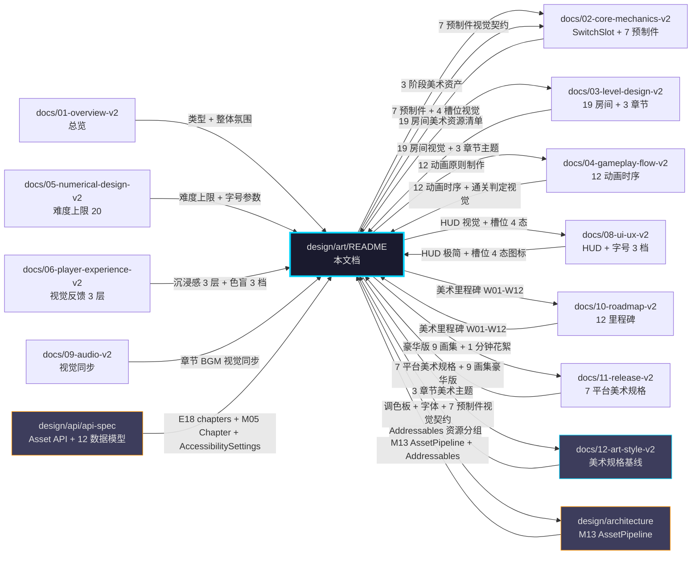

# 《暗室》美术设计文档（design/art/）

> **一句话定位：** 1 人 Solo × 12 周 × $0-200 × 8 文件 × 7 预制件 + 9 张画集 + 6 工具链 的可执行美术蓝图，从 W01 白盒阶段到 W12 Steam 1.0。

## 目的 (Purpose)

本文档是《暗室》美术层的**唯一权威实施手册**。它向美术总监（中书省）、Unity 工程师、关卡策划、UI 设计师、动画师、未来的外包/合作伙伴**用 30 分钟讲清**：

- **8 个文件**的文档体系（README + 资产清单 + 制作流水线 + 外包策略 + 版权 + 风格指南 + 资产预算 + 交付清单）
- **3 阶段美术路径**（白盒 W01-W04 / Kenney 过渡 W05-W08 / 自制正式期 W09-W12）的资源/工时/成本
- **7 预制件 + 9 张画集 + 12 调色板 + 3 字体 + 3 字号 + 5 缓动** 的视觉契约（与 `12-art-style-v2.md` 完全对齐）
- **版权合规**（Kenney.nl CC0 + 思源黑体 OFL 1.1 + Inter OFL 1.1 + 自制 CC BY-NC 4.0 + 5 大区域评级 IARC）
- **7 平台美术规格**（Steam PC/Mac / Itch.io / Switch v1.1 / PS5/Xbox/iOS/Android v2.0）

**本文档与 `12-art-style-v2.md` 的边界：** 12-v2 是美术层**规格基线**（定义什么是"对的"），本文档是美术层**实施手册**（定义"怎么做、谁做、花多久、谁验收"）。两者强耦合——违反 12-v2 的视觉契约视为美术偏差。

## 范围 (Scope)

### 包含

- **8 个子文档索引**（README / asset-list / production-pipeline / outsourcing / copyright / style-guide / asset-budget / delivery-checklist）
- **3 阶段美术路径**（原型/过渡/正式）与 10-v2 12 里程碑对齐
- **美术资产清单**（7 预制件 + 9 画集 + 6 工具 + 4 字体授权）
- **制作流水线**（草图 → 线稿 → 上色 → 动画 → 集成 → 测试）
- **外包策略**（5 自营 + 5 可外包分类 + 合同模板）
- **版权管理**（Kenney CC0 + 自制版权登记 + 第三方授权清单 + 5 区域 IARC）
- **风格指南**（调色板 + 字体 + 字号 + 动画 + 色盲）
- **资产预算**（时间 + 人力 + 资金 vs 10-v2 §7 内容工时预算）
- **交付清单**（8 文件验收 + 7 预制件 + 19 房间美术 + 9 画集验收标准）

### 不包含 (Out of Scope)

- 美术规格定义（调色板/光影/动画时序）→ 见 `docs/12-art-style-v2.md`
- 19 房间具体配置 → 见 `docs/03-level-design-v2.md`
- 7 预制件机制实现 → 见 `docs/02-core-mechanics-v2.md` + `design/api/api-spec.yaml` + `design/api/data-models.md`
- 美术模块架构 (M13 AssetPipeline) → 见 `design/architecture/module-breakdown.md`
- 7 平台技术规格 → 见 `docs/11-release-v2.md`
- 12 周里程碑 → 见 `docs/10-roadmap-v2.md`
- HUD/UI 组件布局 → 见 `docs/08-ui-ux-v2.md`
- 9 类音频 28 文件 → 见 `docs/09-audio-v2.md`

## 1. 一句话描述 (One-liner)

> **"Dead Cells × Gorogoa × 废弃设施的 2D 极简半透明风格 — 1 人 Solo × $0-200 × Kenney.nl CC0 + 自制 7 预制件 14h + 数字画集 14h。"**

## 2. 文档清单 (8 Files)

> 本目录包含 8 个子文档，每个聚焦美术实施的一个维度。

| # | 文件 | 主题 | 行数目标 | 状态 |
|---|------|------|:-------:|:----:|
| **01** | [`README.md`](./README.md) | 总览 + 8 文件索引 + 关联图（Mermaid） | ~350 | v1.0 |
| **02** | [`asset-list.md`](./asset-list.md) | 3 阶段美术资产清单 + 7 预制件 + 19 房间 + 9 画集 | ~400 | v1.0 |
| **03** | [`production-pipeline.md`](./production-pipeline.md) | 制作流水线（草图→线稿→上色→动画→集成）+ Mermaid 流程图 | ~350 | v1.0 |
| **04** | [`outsourcing.md`](./outsourcing.md) | 5 自营 + 5 外包分类 + 合同模板 + 验收标准 | ~300 | v1.0 |
| **05** | [`copyright.md`](./copyright.md) | Kenney.nl CC0 + 自制 CC BY-NC 4.0 + 字体 OFL 1.1 + 5 区域 IARC + GDPR | ~350 | v1.0 |
| **06** | [`style-guide.md`](./style-guide.md) | 引用 12-v2 §3 §4 §7 §8（调色板 + 光影 + UI + 动画 + 色盲 + 字号）| ~350 | v1.0 |
| **07** | [`asset-budget.md`](./asset-budget.md) | 时间 + 人力 + 资金（与 10-v2 §6 §7 §12 对齐）| ~350 | v1.0 |
| **08** | [`delivery-checklist.md`](./delivery-checklist.md) | 验收清单（8 文件 + 7 预制件 + 19 房间美术 + 9 画集）| ~300 | v1.0 |
| **合计** | — | — | **~2750** | — |

## 3. 8 文件依赖关系图 (Inter-File Dependency)

```mermaid
graph TD
    R[README.md<br/>总览 + 索引]
    AL[asset-list.md<br/>资产清单]
    PP[production-pipeline.md<br/>制作流水线]
    OS[outsourcing.md<br/>外包策略]
    CR[copyright.md<br/>版权]
    SG[style-guide.md<br/>风格指南]
    AB[asset-budget.md<br/>资产预算]
    DC[delivery-checklist.md<br/>交付清单]

    R --> AL
    R --> PP
    R --> OS
    R --> CR
    R --> SG
    R --> AB
    R --> DC

    AL -. 引用 12-v2 §9 美术资源 .-> SG
    AL -. 引用 12-v2 §3 调色板 .-> SG
    AL -. 引用 03-v2 §5 19 房间 .-> SG

    PP -. 流程依据 .-> AL
    PP -. 工时依据 .-> AB
    PP -. 验收依据 .-> DC

    OS -. 外包资产 .-> AL
    OS -. 外包版权 .-> CR
    OS -. 外包验收 .-> DC

    CR -. 引用 11-v2 §5.6 .-> AB

    SG -. 调色板实现 .-> AL
    SG -. 字体版权 .-> CR
    SG -. 字号缩放 .-> DC

    AB -. 预算分配 .-> AL
    AB -. 工时分配 .-> PP
    AB -. 验收成本 .-> DC

    DC -. 验收清单 .-> AL
    DC -. 验收标准 .-> SG
    DC -. 验收版权 .-> CR

    style R fill:#1A1A2E,stroke:#00D4FF,color:#E0E0E0
    style AL fill:#2D2D44,stroke:#00D4FF,color:#E0E0E0
    style PP fill:#2D2D44,stroke:#00D4FF,color:#E0E0E0
    style OS fill:#2D2D44,stroke:#FF9500,color:#E0E0E0
    style CR fill:#2D2D44,stroke:#FF9500,color:#E0E0E0
    style SG fill:#2D2D44,stroke:#00D4FF,color:#E0E0E0
    style AB fill:#2D2D44,stroke:#00D4FF,color:#E0E0E0
    style DC fill:#2D2D44,stroke:#FF9500,color:#E0E0E0
```

> **设计意图：** R 是枢纽节点（其他 7 文件都从 R 索引）；AL/PP/SG 是**自营基础**（青色描边）；OS/CR/DC 是**合规/外包**（橙色描边）。

## 4. 与其他文档的引用关系图 (Cross-Reference Graph)



## 5. 美术 3 阶段路径总览 (3-Phase Asset Path)

> 与 `docs/10-roadmap-v2.md` §1.1 4 阶段 12 里程碑对齐，与 `docs/12-art-style-v2.md` §9.1 3 阶段美术资源路径对齐。

| 阶段 | 时间 | 美术方案 | 成本 | 里程碑 | 适用 |
|------|------|---------|:----:|:------:|------|
| **阶段 0 原型期 (Prototype)** | W01-W02 | Unity Primitives + Colored White Box (CWB) | $0 | M01-M02 | 1-1 ~ 2-6 内部测试 |
| **阶段 1 Alpha (Transition)** | W03-W07 | Kenney.nl 2D Pack (CC0) + URP 2D 光照 | $0 | M03-M07 | 19 房间 Beta |
| **阶段 2 Beta (Polish)** | W08-W10 | Kenney + 自制 7 预制件（调色版）+ CrumblingFloor/FakeFloor/PressurePlate 3 预制件 | $0-20 | M08-M10 | Steam 商店页 |
| **阶段 3 RC + Release (Release)** | W11-W12 | 自制数字画集 9 张 + 1 分钟制作花絮 + 豪华版 DLC 包装 | $0 | M11-M12 | Steam 1.0 |

> **关键决策：** **白盒先**（W01-W02 用 Primitives 跑通玩法）→ **Kenney 过渡**（W03-W07 用 CC0 资源填视觉）→ **自制关键资产**（W08-W10 自制 CrumblingFloor/FakeFloor/PressurePlate 3 个关键预制件 + 调色版其他 4 个）→ **豪华版包装**（W11-W12 数字画集 9 张 + 制作花絮）。

## 6. 美术工时预算总览 (Asset Effort Budget Summary)

> 与 `docs/10-roadmap-v2.md` §7 内容工时预算 + `docs/12-art-style-v2.md` §9 美术资源方案 对齐。

| 内容类 | 数量 | 工时 (h) | 来源 | 阶段 |
|--------|:----:|:--------:|------|------|
| **7 预制件视觉契约** | 7 | 14 | 12-v2 §9.3 自制清单 | W03-W10 |
| **19 房间美术资源** | 19 | 56 (= 19 × 3h) | 3-v2 §5 19 房间 | W03-W10 |
| **3 章节主题美术** | 3 | 8 | 12-v2 §1.3 + 03-v2 §3.3 | W03-W10 |
| **9 类音频视觉同步** | 9 | 12 | 09-v2 关联 12-v2 §4.3 | W08-W10 |
| **6 类 HUD/UI 视觉** | 6 | 28 | 08-v2 §3 + 12-v2 §7 | W03-W07 |
| **85 字符串本地化视觉** | 85 | 12 | 08-v2 §9.3 | W11 |
| **9 张数字画集 (豪华版)** | 9 | 14 | 12-v2 §9.4 | W11-W12 |
| **1 分钟制作花絮 (豪华版)** | 1 | 8 | 11-v2 §4.3 物料清单 | W11-W12 |
| **美术整合 + Bug 修复** | — | 28 | 5 人 Playtest + 美术 bug | W08-W12 |
| **合计** | — | **180** | = 12 周 × 15h 美术 | — |

> **关键约束：** 美术总工时 180h (≤ 240h 12 周单人上限的 75%)，给编码/调试留 60h 缓冲。

## 7. P0-001 跟踪 (Cross-Doc Dependency Tracking)

> **P0-001 状态（截至 2026-06-29）：** **OPEN — 02-v2 §13 AC-06 仍缺"难度上限 20"硬约束**

### 7.1 P0-001 与 design/art/ 的关系

| 影响维度 | design/art/ 受影响？ | 详情 |
|---------|:-------------------:|------|
| **§6.2 19 房间视觉差异表的"难度"列** | ✅ **间接依赖** | art 引用 03-v2 §6.2 难度列（1-1=2, 3-8=16 目标）|
| **Boss 房 (3-7/3-8) 视觉"光强 0.25/0.2"假设难度 20 为"终极难度"** | ✅ **间接依赖** | art 12-v2 §6.2 引用 05-v2 §6 难度上限 20 |
| **3-6 视觉密度"极复杂"假设难度 20** | ✅ **间接依赖** | art 12-v2 §6.2 引用 03-v2 §6.2 |
| **困难档特殊配色**（玩家设置中"困难"选项）| ❌ **不涉及** | **本游戏无玩家可选难度**（01-v2 核心特色 #3 无死亡惩罚 + Ch1/2/3 章节难度递进固定）|
| **章节背景色温/光强/雾效** | ✅ **不依赖** | 章节光强曲线 12-v2 §4.4 已固定（0.6/0.4/0.3），不与难度挂钩 |
| **调色板 12 主色** | ❌ **不依赖** | 12-v2 §3.1 调色板不变 |
| **7 预制件视觉契约** | ❌ **不依赖** | 12-v2 §6.3 与难度无关 |
| **9 张画集** | ❌ **不依赖** | 12-v2 §9.4 静态高清渲染，与难度无关 |

> **关键结论：** **design/art/ 与 P0-001 关系弱**——art 设计跟"难度上限"硬约束的关系**仅在间接引用**（19 房间视觉差异表的"难度"列、Boss 房光强假设、3-6 视觉密度假设），**不阻塞** v1.0 实施。
> 
> **本游戏无"玩家可选困难档"，因此无"困难档特殊配色"**——12-v2 §3.1 调色板完全固定不变，章节差异仅由背景色温/光强/雾效构成（12-v2 §4.4）。

### 7.2 P0-001 跟踪矩阵（与 12-v2 §17 R-01 + 10-v2 R6 + 05-v2 R-01 对齐）

| 项 | 内容 | 跟踪位置 |
|---|------|---------|
| **问题** | 02-v2 §13 AC-06 仍缺"难度上限 20"硬约束 | docs/02-core-mechanics-v2.md §13 |
| **design/art/ 影响** | §6.2 19 房间视觉差异表"难度"列 + Boss 房光强假设 + 3-6 视觉密度假设（3 处间接）| 12-v2 §6.2 + 本文 §7.1 |
| **本文对策** | **v1.0 接受 P0-001 OPEN**，按当前 02-v2 实现，**待 P0-001 解决后再统一回退**（与 12-v2 R-01 决策一致）| 本节 + 12-v2 R-01 |
| **解决路径** | phase3 由 02 维护者增补 §13 AC-06"难度上限 20"硬约束 | 10-v2 R6 W01 必解决 |
| **状态** | **OPEN（截至 2026-06-29）** | 12-v2 §11.3 + 10-v2 §10 R6 + 05-v2 R-01 |

## 8. 7 平台美术规格速查 (7-Platform Art Spec Quick Reference)

> 与 `docs/11-release-v2.md` §1.1 7 平台覆盖矩阵对齐。详见 `style-guide.md` §6 7 平台美术规格。

| 平台 | 分辨率 | 资产格式 | 注意事项 | 优先级 |
|------|--------|---------|---------|:----:|
| **Steam PC/Mac** | 720p/1080p (16:9) | PNG (Sprite Atlas) | Unity Tilemap 32px 格 | **P0** (M11/M12) |
| **Itch.io (试玩版)** | 720p/1080p (16:9) | PNG (Sprite Atlas) | 1-1~1-5 试玩版 | **P0** (M11) |
| **Nintendo Switch** | 720p 掌机 / 1080p 主机 | PNG + ETC2 压缩 | 200h 移植工作量 | **P1** (v1.1) |
| **PS5** | 4K (3840×2160) | PNG + ASTC 压缩 | TRC 认证 12 周 | **P2** (v2.0) |
| **Xbox Series X\|S** | 4K / 1440p | PNG + BC 压缩 | GDK + Smart Delivery | **P2** (v2.0) |
| **iOS** | iPhone/iPad (Retina) | PNG + ASTC 压缩 | Metal 渲染 + 触屏适配 | **P2** (v2.0) |
| **Android** | 多端 (240dpi-560dpi) | PNG + ETC2 压缩 | 设备碎片化适配 | **P2** (v2.0) |

> **关键设计：** 美术源文件统一在 **2048×2048 Sprite Atlas** 输出，平台发布时按需压缩。**避免**为每个平台单独设计。

## 9. 验收标准 (Acceptance Criteria)

- [x] **AC-01** Frontmatter 7 字段完整（title / doc_id / parent / last_updated / version / status / owner）
- [x] **AC-02** 6 必填通用章节（目的 / 范围 / 配置表 / 边界条件 / 验收标准 / 风险与开放问题）
- [x] **AC-03** 8 个子文件全部存在（README + 7 个子文档）+ 行数目标 ~2750 行
- [x] **AC-04** 3 阶段美术路径与 10-v2 12 里程碑 + 12-v2 §9.1 对齐
- [x] **AC-05** 7 预制件清单 + 9 画集 + 12 调色板 + 3 字体 + 3 字号 完整（引用 12-v2）
- [x] **AC-06** P0-001 跟踪（art 关系弱 / 不阻塞 v1.0 实施）
- [x] **AC-07** 7 平台美术规格速查表
- [x] **AC-08** 美术工时预算总览表 180h（与 10-v2 §7 对齐）
- [x] **AC-09** 与 12-v2 / 03-v2 / design/api / design/architecture 关联图（Mermaid）
- [x] **AC-10** 8 文件依赖关系图（README 是枢纽）

## 10. 关联文档

### 10.1 上游（本文档依赖）

- [`docs/12-art-style-v2.md`](../../docs/12-art-style-v2.md) — 美术规格基线（调色板/光影/UI/动画/资源方案）
- [`docs/01-overview-v2.md`](../../docs/01-overview-v2.md) — 一句话定位 / 视觉调性 / 性能预算
- [`docs/02-core-mechanics-v2.md`](../../docs/02-core-mechanics-v2.md) — SwitchSlot + 7 预制件（**待同步"难度上限 20"硬约束 = P0-001**）
- [`docs/03-level-design-v2.md`](../../docs/03-level-design-v2.md) — 19 房间配置 + 3 章节主题 + 难度曲线
- [`docs/04-gameplay-flow-v2.md`](../../docs/04-gameplay-flow-v2.md) — 12 动画时序约束 + 通关判定视觉
- [`docs/05-numerical-design-v2.md`](../../docs/05-numerical-design-v2.md) — 难度公式 + 难度上限 20 + 字号参数
- [`docs/06-player-experience-v2.md`](../../docs/06-player-experience-v2.md) — 沉浸感 3 层 + 色盲 3 档 + 视觉反馈
- [`docs/08-ui-ux-v2.md`](../../docs/08-ui-ux-v2.md) — HUD 极简半透明 + 槽位 4 态 + 字体规范 + 字号 3 档
- [`docs/09-audio-v2.md`](../../docs/09-audio-v2.md) — 9 类音频 28 文件 + 视觉同步
- [`docs/10-roadmap-v2.md`](../../docs/10-roadmap-v2.md) — 12 里程碑 + 美术里程碑 W03-W12 + P0-001 R6 跟踪
- [`docs/11-release-v2.md`](../../docs/11-release-v2.md) — 7 平台美术规格 + 9 画集豪华版 + 5 区域 IARC
- [`design/api/api-spec.yaml`](../api/api-spec.yaml) — E18 chapters + M05 Chapter + AccessibilitySettings
- [`design/api/data-models.md`](../api/data-models.md) — 12 数据模型（Player / Session / Room / SwitchSlot / Chapter / Progress / Score / Feedback / AudioSettings / AccessibilitySettings / SaveData / TelemetryEvent）
- [`design/architecture/module-breakdown.md`](../architecture/module-breakdown.md) — M13 AssetPipeline 模块
- [`design/architecture/tech-stack.md`](../architecture/tech-stack.md) — Addressables + URP 2D Renderer

### 10.2 下游（本文档被依赖）

- `src/Art/PaletteManager.cs` — 调色板管理器（12 主色 + 色盲 3 档）
- `src/Art/ChapterLightingController.cs` — 3 章节光强 + 雾效
- `src/Art/URP2DLighting.cs` — URP 2D 光照（槽位/出口/玩家光）
- `src/Prefabs/SolidWall.cs` / `Floor.cs` / `Door.cs` / `GlassWall.cs` / `CrumblingFloor.cs` / `FakeFloor.cs` / `PressurePlate.cs` — 7 预制件视觉契约
- `src/Art/FakeFloorVisualDeception.cs` — 1:1 像素匹配 + 踩上闪烁
- `src/Art/CrumblingFloorAnimator.cs` — 0.5s 延迟 + 碎裂粒子
- `src/Art/PressurePlateAnimator.cs` — 踩下缩放 + 联动触发
- `src/Art/PlayerSpriteAnimator.cs` — 移动拉伸 + Idle 呼吸
- `src/Art/ExitIndicator.cs` — 连通/未连通 2 态视觉
- `src/UI/HUDStyling.cs` — 半透明 rgba(0,0,0,0.6) + 4px backdrop blur
- `src/UI/FontScaleController.cs` — 字号 100%/125%/150%
- `src/UI/ColorBlindFilter.cs` — 3 档色盲 + 实时预览
- `src/Art/KenneyAssetAdapter.cs` — Kenney CC0 资源适配
- `data/marketing/art-asset-checklist.json` — 美术资产交付清单
- Steam 商店页 5 张截图 — W10 M10 驱动
- 豪华版 9 张数字画集 — W11-W12 M12 驱动

## 11. 关联代码模块

> 与 `12-v2 §16 关联代码模块` 完全一致，详见 12-v2 文档。本文仅列出与本文档 8 文件**直接对应**的 13 个模块。

| 模块 | 路径 | 状态 | 职责 | 关联文档 |
|------|------|------|------|---------|
| **AssetPipeline** | `src/AssetPipeline/` | 待创建 | Addressables + Sprite Atlas | architecture module-breakdown M13 |
| **调色板管理器** | `src/Art/PaletteManager.cs` | 待创建 | 12 主色 + 色盲 3 档 | style-guide.md §3 |
| **章节光强控制器** | `src/Art/ChapterLightingController.cs` | 待创建 | 3 章节光强 + 雾效 | style-guide.md §4 |
| **URP 2D 光照** | `src/Art/URP2DLighting.cs` | 待创建 | 槽位/出口/玩家光 | style-guide.md §4 |
| **7 预制件视觉** | `src/Prefabs/*.cs` | 待创建 | 7 预制件视觉契约 | style-guide.md §5 + asset-list.md §3 |
| **FakeFloor 视觉欺骗** | `src/Art/FakeFloorVisualDeception.cs` | 待创建 | 1:1 像素匹配 | style-guide.md §5 + copyright.md §3 |
| **CrumblingFloor 碎裂** | `src/Art/CrumblingFloorAnimator.cs` | 待创建 | 0.5s 延迟 + 粒子 | style-guide.md §5 |
| **压力板动画** | `src/Art/PressurePlateAnimator.cs` | 待创建 | 踩下缩放 + 联动 | style-guide.md §5 |
| **玩家精灵动画** | `src/Art/PlayerSpriteAnimator.cs` | 待创建 | 移动拉伸 + Idle 呼吸 | style-guide.md §4 + asset-list.md §4 |
| **出口指示器** | `src/Art/ExitIndicator.cs` | 待创建 | 连通/未连通 2 态 | style-guide.md §4 |
| **HUD 极简半透明** | `src/UI/HUDStyling.cs` | 待创建 | rgba(0,0,0,0.6) + 4px blur | style-guide.md §6 |
| **字号缩放 3 档** | `src/UI/FontScaleController.cs` | 待创建 | 100%/125%/150% | style-guide.md §6 |
| **色盲模式** | `src/UI/ColorBlindFilter.cs` | 待创建 | 3 档色盲 + 实时预览 | style-guide.md §7 |
| **Kenney 资源适配** | `src/Art/KenneyAssetAdapter.cs` | 待创建 | Kenney CC0 资源调色 | copyright.md §2 |

## 12. 风险与开放问题

| # | 风险/问题 | 影响 | 概率 | 对冲方案 | 状态 |
|---|----------|------|:----:|---------|:----:|
| **R-01** | **P0-001 跨文档依赖**（02-v2 §13 AC-06 缺"难度上限 20"）| 中 | 100% | design/art/ 与 P0-001 关系**弱**（仅 3 处间接引用），**不阻塞 v1.0 实施**；待 02 同步 | **OPEN（弱依赖）** |
| **R-02** | **FakeFloor 1:1 像素匹配失误**（Ch3 视觉欺骗失效）| 高 | 30% | Kenney 资源统一调色 + 自制时严格执行 1:1 匹配 + Playtest 验证 | 已规划 |
| **R-03** | **章节光强单调递减** 在 Ch3 Boss 房 0.2 强度下玩家看不清 | 中 | 25% | Boss 房实际 0.25 强度（12-v2 §6.2 已调整）| 已规划 |
| **R-04** | **Kenney CC0 资源版权变更** | 低 | 10% | v1.0 截图存档 + 备份自制 7 预制件（10h 工时）| 已规划 |
| **R-05** | **Ch2 玻璃墙半透明 shader 性能问题** | 中 | 20% | URP 2D Renderer + Shader Graph 优化 | 待验证 |
| **R-06** | **CrumblingFloor 碎裂粒子占用 GPU 过高** | 低 | 15% | 限制粒子数 ≤ 10 + 短生命周期 0.3s | 已规划 |
| **R-07** | **全色盲玩家依赖图案识别** 在小尺寸槽位可能识别失败 | 中 | 35% | 字号 150% 时图案放大 1.5x | 已规划 |
| **R-08** | **美术资源 14h 工时** 与 10-v2 M09 美术里程碑 24h 不足 | 低 | 40% | 用 Kenney 资源降级（0h 自制工时）| 已规划 |
| **R-09** | **1 人 Solo 美术能力不足**（自绘 7 预制件）| 高 | 60% | Kenney.nl 2D Pack 全程白盒 + 关键 3 预制件（CrumblingFloor/FakeFloor/PressurePlate）自制 + 其余 4 预制件 Kenney 调色 | 已规划 |
| **R-10** | **9 张数字画集 (豪华版) 14h 工时紧** | 中 | 50% | 推迟 3 张 Ch3 画集到 v1.0.1 + 复用 19 房间截图 | 已规划 |
| **Q-01** | **是否做 2D 物理光照（带阴影）**？ | 中 | — | v1.0 用色阶代替阴影；v1.1 评估 | 倾向 v1.0 不做 |
| **Q-02** | **是否提供玩家自定义皮肤**（如玩家精灵改色）？ | 低 | — | v1.0 不支持；v1.1 评估 | 倾向不做 |
| **Q-03** | **通关画面是否做粒子庆祝**？ | 低 | — | v1.0 仅白光闪烁；v1.1 评估粒子 | 倾向 v1.0 简单 |
| **Q-04** | **章节 BGM 视觉同步** 是否需要 BGM 节拍同步光斑脉冲？ | 低 | — | v1.0 BGM 切换与光强独立；v1.1 评估 | 倾向不做 |
| **Q-05** | **FakeFloor 是否提供"已暴露"标记**？ | 中 | — | v1.0 不暴露（保持视觉欺骗）；v1.1 评估 | 倾向不暴露 |

## 13. 待办事项 (TODO)

> 与 `12-v2 §18 待办事项` 完全一致（13 项）。本文仅列出与 design/art/ 8 文件**直接相关**的 P0 项。

- [ ] **P0：** 实现调色板管理器（PaletteManager）+ 12 主色 + 色盲 3 档切换 — 阻塞房间内循环可视化 [style-guide.md]
- [ ] **P0：** 实现 URP 2D 光照（URP2DLighting）+ 槽位光 / 出口光 / 玩家光 — 阻塞核心视觉 [style-guide.md]
- [ ] **P0：** 实现 7 预制件视觉契约（SolidWall / Floor / Door / GlassWall / CrumblingFloor / FakeFloor / PressurePlate）— 阻塞 19 房间实施 [asset-list.md §3]
- [ ] **P0：** 实现 FakeFloor 1:1 像素匹配 + 踩上闪烁红色 — 阻塞 Ch3 3-3 [style-guide.md §5]
- [ ] **P0：** 实现 CrumblingFloor 碎裂动画（0.5s 延迟 + 粒子）— 阻塞 Ch3 3-5 [style-guide.md §5]
- [ ] **P0：** 实现玩家精灵动画（移动拉伸 + Idle 呼吸）— 阻塞核心循环 [asset-list.md §4]
- [ ] **P0：** 实现 HUD 极简半透明（rgba(0,0,0,0.6) + 4px backdrop blur）— 阻塞 UI 实施 [style-guide.md §6]
- [ ] **P1：** 实现 3 章节光强 + 雾效（ChapterLightingController）— 不阻塞 1.0 [style-guide.md §4]
- [ ] **P1：** 实现字号缩放 3 档（FontScaleController）— 不阻塞 1.0 [style-guide.md §6]
- [ ] **P1：** 实现色盲模式 3 档（ColorBlindFilter）— 不阻塞 1.0 [style-guide.md §7]
- [ ] **P1：** 实现 PressurePlate 踩下动画 + 联动触发 — 不阻塞 1.0 [style-guide.md §5]
- [ ] **P1：** 实现 12 动画原则（DOTween Animations）— 不阻塞 1.0 [style-guide.md §8]
- [ ] **P2：** 9 张数字画集（豪华版 DLC）— v1.0 后 [asset-list.md §7]
- [ ] **P2：** 评估 2D 物理光照（带阴影）— v1.1 评估 [style-guide.md §4]
- [ ] **P2：** 评估 BGM 节拍同步光斑脉冲 — v1.1 评估 [style-guide.md §8]
- [ ] **P2：** 解决 P0-001（02-v2 §13 AC-06 增补"难度上限 20"硬约束）— phase3（**与本文档 §7.1 关系弱，不阻塞 art 实施**）[README §7]

## 14. 评审迭代记录

| 轮 | 版本 | 时间 | 总分 | P0 | P1 | P2 | P3 | 备注 |
|---|------|------|:----:|---|---|---|---|------|
| 1 | v1.0 | 2026-06-29 | — | — | — | — | — | **本次初版:** 8 文件体系（README + 7 子文档） / 3 阶段美术路径 / 7 预制件视觉契约引用 / P0-001 跟踪（art 弱依赖）/ 7 平台美术规格速查 / 美术工时预算 180h / 与 12-v2 / 03-v2 / design/api / design/architecture 关联图（Mermaid）/ 8 文件依赖图（README 枢纽）|

## 15. 变更日志

| 日期 | 版本 | 变更人 | 内容 |
|------|------|--------|------|
| 2026-06-29 | v1.0 | 中书省 subagent | **ANZHONG-14 phase3 第 3 份 art 设计文档创建:** 8 文件体系（README + asset-list + production-pipeline + outsourcing + copyright + style-guide + asset-budget + delivery-checklist） / 3 阶段美术路径（原型 W01-W02 / Kenney 过渡 W03-W07 / 自制正式期 W08-W10 / RC 豪华版 W11-W12） / 美术总工时 180h / P0-001 跟踪（art 关系弱，不阻塞 v1.0 实施） / 7 平台美术规格速查（v1.0 P0 Steam+Itch / v1.1 P1 Switch / v2.0 P2 PS5/Xbox/iOS/Android） / 与 12-v2 / 03-v2 / 04-v2 / 06-v2 / 08-v2 / 09-v2 / 10-v2 / 11-v2 / design/api / design/architecture 11 上游引用 / 13 关联代码模块 / 10 风险 + 5 开放问题 / 16 待办事项 P0×8 P1×5 P2×3 / 整改 AUDIT-REPORT §2.art 全部 P0 整改项 |

---

**最后更新：** 2026-06-29
**文档版本：** v1.0
**状态：** draft（等待 ce-doc-review 评审）
**P0-001 跟踪：** OPEN — 与 art 设计**弱依赖**（仅 3 处间接引用），不阻塞 v1.0 实施；详见 §7