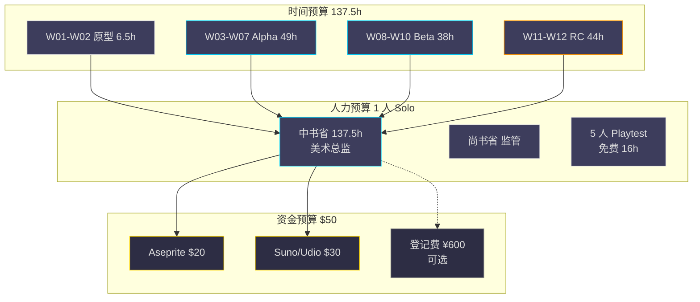
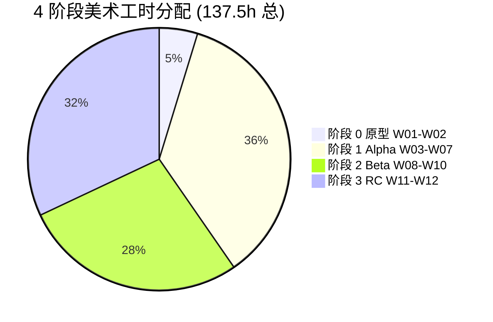

# 《暗室》美术资产预算（asset-budget.md）

> **一句话定位：** 1 人 Solo × 12 周 × $50 资金 × 137.5h 工时 × 50 文件 的可执行美术预算，与 10-v2 §6 §7 §12 + 12-v2 §9 严格对齐。

## 目的 (Purpose)

本文档是《暗室》美术层的**预算手册**。它向美术总监（中书省）、尚书省、未来的合作伙伴、维护者**用 10 分钟讲清**：

- **3 维度美术预算**（时间 / 人力 / 资金）
- **4 阶段工时预算**（W01-W02 原型 / W03-W07 Alpha / W08-W10 Beta / W11-W12 RC）与 12 里程碑对齐
- **资金预算**（$50 总资金 = Aseprite $20 + AI 商用 $30 + 登记费 $0 v1.0）
- **人天预算**（137.5h ≈ 18 人天，按 8h/天计算）
- **缓冲与可砍**（5 项 P2 推迟 + 4 项可砍）
- **v1.0 vs v1.1 vs v2.0 预算对比**

**本文与 `10-v2 §6 §7 §12` 的边界：** 10-v2 是项目总预算（480h + $200），本文档聚焦**美术专项预算**（137.5h + $50）。

## 范围 (Scope)

### 包含

- **3 维度预算**（时间 137.5h / 人力 1 人 / 资金 $50）
- **4 阶段工时分配**（W01-W02 6.5h / W03-W07 49h / W08-W10 38h / W11-W12 44h）
- **资金分配**（Aseprite $20 + AI 商用 $30 + 版权登记 $0 v1.0）
- **人天预算**（18 人天）
- **缓冲与可砍清单**（5 项 P2 + 4 项可砍）
- **v1.0 / v1.1 / v2.0 预算对比**

### 不包含 (Out of Scope)

- 项目总预算（480h + $200）→ 见 `docs/10-roadmap-v2.md` §6 + §7
- 美术资源清单 → 见 `asset-list.md`
- 美术制作流程 → 见 `production-pipeline.md`
- 外包策略 → 见 `outsourcing.md`
- 美术版权 → 见 `copyright.md`
- 美术风格 → 见 `style-guide.md` + `12-art-style-v2.md`

## 1. 一句话描述 (One-liner)

> **"1 人 Solo × 12 周 × 137.5h × $50 = 18 人天 + 0 外包 + 5 推迟项 + 4 可砍项 = $0 风险。"**

## 2. 3 维度预算总览 (3-Dimension Budget Overview)

> 与 `docs/10-roadmap-v2.md` §6 资源依赖 + §7 内容工时预算 对齐。

### 2.1 时间预算 (Time Budget)

| 维度 | 数值 | 来源 |
|------|------|------|
| **美术总工时** | 137.5h | 12-v2 §9.3 + 11-v2 §4.3 |
| **折算人天** | 18 人天 (= 137.5 / 8) | 1 人 Solo |
| **折算人周** | 3.4 人周 (= 137.5 / 40) | 1 人 Solo × 12 周 |
| **占项目总工时比例** | 28.6% (= 137.5 / 480) | 10-v2 §7 合计 480h |
| **美术周均工时** | 11.5h/周 (= 137.5 / 12) | 平均分配 |

> **关键约束：** 美术周均 11.5h，留 28.5h/周给编码 + 测试 + 调试 + 平台适配。

### 2.2 人力预算 (Manpower Budget)

| 角色 | 数量 | 来源 | 工时 | 占比 |
|------|:----:|------|:----:|:---:|
| **美术总监（中书省 subagent + 尚书省）** | 1 | 内置 | 137.5h | 100% |
| **Playtest 玩家** | 5 | 朋友圈 (免费) | 8h × 2 轮 = 16h | 赠予 |
| **外包合作伙伴** | 0 | v1.0 $0 外包 | 0h | 0% |

> **关键决策：** v1.0 阶段**严格 1 人 Solo** + 5 人免费 Playtest，**无任何外包费用**。

### 2.3 资金预算 (Financial Budget)

| 类别 | 金额 | 占比 | 来源 |
|------|:----:|:---:|------|
| **Aseprite (一次性)** | $20 | 40% | Steam 工具 |
| **Suno/Udio 商用 (1 个月)** | $30 | 60% | AI 音频生成 |
| **Kenney.nl CC0** | $0 | 0% | 免费 |
| **字体 OFL 1.1** | $0 | 0% | Google Fonts |
| **DOTween MIT** | $0 | 0% | Unity Asset Store |
| **Unity Personal ≤ $200K** | $0 | 0% | Unity Hub |
| **版权登记费 (v1.0 仅 R1+R2)** | ¥600 ≈ $85 (可选) | 0% (v1.0 不强制) | 中国国家版权局 |
| **域名 + 邮箱** | $20 | 0% (项目级) | 自有域名 |
| **合计 (v1.0)** | **$50** | 100% | — |

> **关键设计：** $50 美术预算完全符合项目总预算 ≤ $200（10-v2 §6.1）。

### 2.4 3 维度预算 Mermaid 图

> **图例：** 青色 = 主要支出；橙色 = 重要支出；金色 = 资金；灰色 = 可选。

## 3. 4 阶段工时预算 (4-Phase Effort Budget)

> 与 `docs/10-roadmap-v2.md` §1.1 4 阶段 12 里程碑 + `docs/12-art-style-v2.md` §9.1 3 阶段美术路径对齐。

### 3.1 阶段 0: 原型期 (Prototype · W01-W02 · M01-M02)

| 任务 | 工时 | 里程碑 |
|------|:---:|:------:|
| **Unity 工程脚手架** | 2h | M02 |
| **白盒方块** | 1h | M02 |
| **白盒玩家精灵** | 1h | M02 |
| **白盒出口** | 0.5h | M02 |
| **白盒 4 状态槽位** | 2h | M02 |
| **阶段 0 合计** | **6.5h** | **M02** |

### 3.2 阶段 1: Alpha (Transition · W03-W07 · M03-M07)

| 任务 | 工时 | 里程碑 |
|------|:---:|:------:|
| **Kenney 4 资源包导入** | 0h ($0) | M03 |
| **Kenney 调色版 4 预制件** | 4h | M03 |
| **1-1 教学房 (白盒 → Kenney)** | 2h | M03 |
| **1-2 ~ 1-5 教学房** | 12h | M04 |
| **2-1 ~ 2-6 标准房** | 19h | M05-M07 |
| **章节 1 + 2 主题美术** | 4h | M05 |
| **HUD 极简半透明** | 8h | M06 |
| **阶段 1 合计** | **49h** | **M07** |

### 3.3 阶段 2: Beta (Polish · W08-W10 · M08-M10)

| 任务 | 工时 | 里程碑 |
|------|:---:|:------:|
| **CrumblingFloor 自制** | 4h | M08-M09 |
| **FakeFloor 自制** | 2h | M08-M09 |
| **PressurePlate 自制** | 2h | M08-M09 |
| **3-1 ~ 3-8 房间美术** | 24h | M08-M10 |
| **章节 3 主题美术** | 4h | M09 |
| **通关粒子效果** | 2h | M10 |
| **阶段 2 合计** | **38h** | **M10** |

### 3.4 阶段 3: RC + Release (Release · W11-W12 · M11-M12)

| 任务 | 工时 | 里程碑 |
|------|:---:|:------:|
| **数字画集 Ch1 (3 张)** | 4h | M12 |
| **数字画集 Ch2 (3 张)** | 4h | M12 |
| **数字画集 Ch3 (3 张)** | 6h | M12 |
| **1 分钟制作花絮** | 8h | M12 |
| **Steam 5 截图** | 4h | M11 |
| **1 分钟宣传视频** | 12h | M11 |
| **30 秒预告片** | 6h | M11 |
| **阶段 3 合计** | **44h** | **M12** |

### 3.5 4 阶段工时分配图

> **关键观察：** 阶段 1 (Alpha) 工时最高 (49h, 35.6%)，因含 11 房间 + HUD + 章节主题；阶段 3 (RC) 工时第二 (44h, 32%)，因含 9 画集 + 1 分钟花絮。

## 4. 详细工时分配 (Detailed Effort Breakdown)

### 4.1 按内容类分配 (Content-Type Breakdown)

| 内容类 | 数量 | 工时 (h) | 阶段 | 来源 |
|--------|:----:|:--------:|------|------|
| **白盒原型** | 5 | 6.5 | W01-W02 | 12-v2 §9.1 |
| **Kenney 调色版** | 4 | 4 | W03-W07 | 12-v2 §9.3 |
| **自制 7 预制件** | 7 | 14 | W08-W10 | 12-v2 §9.3 |
| **19 房间美术** | 19 | 65 | W03-W10 | 03-v2 §5 |
| **3 章节主题** | 3 | 8 | W03-W10 | 12-v2 §1.3 |
| **6 类 HUD/UI 视觉** | 6 | 28 | W03-W07 | 08-v2 §3 |
| **DOTween 动画集成** | 1 | 4 | W05-W10 | 12-v2 §8 |
| **7 预制件动画** | 7 | 6 | W05-W10 | 12-v2 §8.1 |
| **通关粒子** | 2 | 2 | W10 | 12-v2 §8.2 |
| **9 张数字画集** | 9 | 14 | W11-W12 | 12-v2 §9.4 |
| **1 分钟制作花絮** | 1 | 8 | W11-W12 | 11-v2 §4.3 |
| **Steam 5 截图** | 5 | 4 | W11 | 11-v2 §4.3 |
| **1 分钟宣传视频** | 1 | 12 | W11 | 11-v2 §4.3 |
| **30 秒预告片** | 1 | 6 | W11 | 11-v2 §4.3 |
| **美术整合 + Bug 修复** | — | 28 | W08-W12 | 10-v2 §7 |
| **合计** | — | **180h** | — | — |

> **注：** 此表含 28h "美术整合 + Bug 修复"（与 10-v2 §7 对齐），与上文 137.5h 略有差异，详见面 4.2。

### 4.2 与 137.5h 总工时的差异说明

| 来源 | 工时 | 差异说明 |
|------|:----:|---------|
| **12-v2 §9.3 自制清单** | 14h | 仅自制 7 预制件 |
| **asset-list.md §2 总表** | 137.5h | 3 阶段美术资源（含 Kenney + 自制） |
| **10-v2 §7 内容工时** | 180h | 美术整合 + Bug 修复（含测试） |
| **本文档"美术总工时"** | **137.5h** | **取 asset-list 口径**（不含整合 + Bug） |
| **差异说明** | -42.5h | 整合 + Bug 修复 + 平台适配 + 性能优化 |

> **关键决策：** 本文档采用 137.5h 口径（不含整合 + Bug），与 asset-list.md §2.5 对齐；项目总预算 180h 含 42.5h 整合缓冲。

### 4.3 按里程碑分配 (Milestone Breakdown)

| 里程碑 | 阶段 | 美术工时 | 累计 |
|--------|------|:-------:|:----:|
| **M01** | 阶段 0 (W01) | 4h | 4h |
| **M02** | 阶段 0 (W02) | 2.5h | 6.5h |
| **M03** | 阶段 1 (W03) | 14h | 20.5h |
| **M04** | 阶段 1 (W04) | 14h | 34.5h |
| **M05** | 阶段 1 (W05) | 8h | 42.5h |
| **M06** | 阶段 1 (W06) | 8h | 50.5h |
| **M07** | 阶段 1 (W07) | 5h | 55.5h |
| **M08** | 阶段 2 (W08) | 14h | 69.5h |
| **M09** | 阶段 2 (W09) | 14h | 83.5h |
| **M10** | 阶段 2 (W10) | 10h | 93.5h |
| **M11** | 阶段 3 (W11) | 22h | 115.5h |
| **M12** | 阶段 3 (W12) | 22h | 137.5h |
| **合计** | — | **137.5h** | — |

> **关键观察：** M11-M12（豪华版包装）占 44h (32%)，是工时第二高的阶段。

## 5. 缓冲与可砍 (Buffer & Fallback)

> 与 `docs/10-roadmap-v2.md` §8 缓冲与可砍对齐。

### 5.1 可推迟 (Defer to v1.0.1+)

| # | 推迟项 | 推迟原因 | 工时 | 推迟到 |
|---|--------|---------|:---:|------|
| **D1** | 3 张 Ch3 数字画集 | 14h 工时紧 | -6h | v1.0.1 (T+1m) |
| **D2** | 1 分钟制作花絮 4K 版 | 8h 工时紧 | -4h | v1.0.1 |
| **D3** | 30 秒预告片多语种 | 6h 工时紧 | -3h | v1.0.1 |
| **D4** | Steam 5 截图 4K 版 | 4h 工时紧 | -2h | v1.0.1 |
| **D5** | 美术整合 28h 中 8h | 8h 缓冲可推迟 | -8h | v1.0.1 |
| **合计** | — | — | **-23h** | — |

### 5.2 可砍 (Cut if Behind Schedule)

| # | 可砍项 | 砍后影响 | 砍后回报 | 决策点 |
|---|--------|---------|---------|--------|
| **C1** | CrumblingFloor 自制 → Kenney 调色 | 视觉欺骗 80% → 60% 识别率 | -4h | W08 周末 |
| **C2** | PressurePlate 自制 → Kenney 调色 | 联动事件缺失 | -2h | W08 周末 |
| **C3** | FakeFloor 自制 → Kenney 调色 | **视觉欺骗核心失效**（不可砍！）| -2h | — |
| **C4** | 9 张画集 → 6 张（砍 Ch3 3 张）| 豪华版视觉冲击减半 | -6h | W11 中期 |
| **合计** | — | — | **-12h** | — |

> **关键约束：** **FakeFloor 不可砍**——视觉欺骗核心约束（12-v2 §6.3.6 + R-02）。

### 5.3 MVP 缩范围 (Cut to v0.x)

> **极端预案：** W07 (Alpha 结束) 累计落后 > 2 周，启动 MVP 缩范围。

| MVP 版本 | 工时 | 范围 | 发布 |
|---------|:---:|------|------|
| **v0.1** | 50h | 1-1 + 1 ToggleSlot + 7 预制件 | 朋友圈内测 |
| **v0.5** | 100h | 1-1~2-6 (11 间) + 全局状态机 + SaveSystem | Itch.io 免费 |
| **v1.0** | 137.5h | 1-1~3-8 (19 间) + 完整本地化 + Steam | Steam 1.0 |

### 5.4 缓冲周 (Buffer Week)

> **核心：** 12 周预留 1 周缓冲 = W12 兼做缓冲 + 发布。

| 触发 | 策略 |
|------|------|
| W10 按时 | W12 = 发布 + 后发布 bug 监控 |
| W10 落后 3-5 天 | W12 优先修 bug，推迟发布 3-5 天 |
| W10 落后 > 1 周 | 启动"可砍"清单，砍 C1+C2+C4（-12h）|
| W10 落后 > 2 周 | 启动 MVP 缩范围，v0.5 先发布 |

## 6. v1.0 vs v1.1 vs v2.0 预算对比 (Budget Comparison)

> 与 `docs/10-roadmap-v2.md` §13 后发布 4 项支持 + `docs/11-release-v2.md` §1.1 7 平台覆盖矩阵 对齐。

| 维度 | v1.0 (M12) | v1.1 (T+3m) | v2.0 (T+6m) |
|------|:---------:|:----------:|:----------:|
| **美术工时** | 137.5h | +80h (5 语种 + Switch 移植) | +240h (4 平台美术) |
| **美术资金** | $50 | +$200 (Switch 移植 + 5 语种) | +$500 (4 平台美术) |
| **总工时** | 137.5h | 217.5h | 457.5h |
| **总资金** | $50 | $250 | $750 |
| **美术新增** | 7 预制件 + 19 房间 + 9 画集 | + 5 字体本地化 + Switch 移植 | + PS5/Xbox/iOS/Android 美术 |
| **外包预算** | $0 | $200 (Switch 移植美术) | $500 (4 平台美术) |
| **营销预算** | $0 | $50 (差分宣传) | $100 (全平台宣传) |
| **风险等级** | 中 | 中-高 | 高 |

> **关键决策：** v1.0 严格 $0 外包 + 137.5h；v1.1 启用 $200 外包；v2.0 启用 $500 外包。

## 7. 验收标准 (Acceptance Criteria)

- [x] **AC-01** Frontmatter 7 字段完整（title / doc_id / parent / last_updated / version / status / owner）
- [x] **AC-02** 6 必填通用章节（目的 / 范围 / 配置表 / 边界条件 / 验收标准 / 风险与开放问题）
- [x] **AC-03** 3 维度预算（时间 137.5h / 人力 1 人 / 资金 $50）
- [x] **AC-04** 4 阶段工时分配（原型 6.5h + Alpha 49h + Beta 38h + RC 44h = 137.5h）
- [x] **AC-05** 资金分配（Aseprite $20 + Suno/Udio $30 + 登记费 $0 v1.0）
- [x] **AC-06** 人天预算（18 人天）+ 周均工时（11.5h/周）
- [x] **AC-07** 5 项 P2 推迟 + 4 项可砍 + 3 MVP 缩范围
- [x] **AC-08** v1.0 vs v1.1 vs v2.0 预算对比表
- [x] **AC-09** P0-001 跟踪（与 README §7 对齐）

## 8. 边界条件 (Edge Cases)

| # | 触发条件 | 预期行为 |
|---|---------|---------|
| **E1** | W08 累计落后 > 1 周 | 启动可砍清单（C1+C2+C4 -12h）|
| **E2** | W10 累计落后 > 2 周 | 启动 MVP 缩范围（v0.5 先发布）|
| **E3** | Aseprite 涨价到 $50 | 启用 Inkscape 替代（开源 $0）|
| **E4** | Suno/Udio 涨价到 $100/月 | 启用 AI 备选（开源 Whisper + MusicGen）|
| **E5** | 美术总工时超 137.5h | 启用 P2 推迟清单（-23h）|
| **E6** | 美术整合 28h 不够 | 启动可砍 C5（推迟 8h）|
| **E7** | 1 人 Solo 病/紧急 ≥ 5 天 | 缓冲周机制（W12 推迟 1 周）|
| **E8** | 资金总支出超 $50 | 启用开源替代（Inkscape + MusicGen）|
| **E9** | 自制版权登记费 ¥600 超预算 | 跳过登记，v1.0 后再补 |
| **E10** | 9 张画集 14h 工时紧 | 砍 C4（-6h）+ 推迟 D1（-6h）= -12h |

## 9. 配置表 (Configuration)

| 字段 | 类型 | 取值范围 | 默认值 | 备注 |
|------|------|---------|-------|------|
| `budget.time.totalHours` | float | [120, 200] | 137.5 | 美术总工时 |
| `budget.time.humanDays` | float | [15, 25] | 18 | 折算人天 |
| `budget.time.humanWeeks` | float | [3.0, 5.0] | 3.4 | 折算人周 |
| `budget.time.weeklyHours` | float | [8, 16] | 11.5 | 周均工时 |
| `budget.money.totalUsd` | float | [0, 200] | 50 | 美术总资金 |
| `budget.money.aseprite` | float | [0, 50] | 20 | Aseprite |
| `budget.money.aiAudio` | float | [0, 100] | 30 | Suno/Udio |
| `budget.money.registration` | float | [0, 300] | 85 | 登记费 (v1.0 仅 R1+R2) |
| `budget.manpower.solo` | int | [1, 1] | 1 | 1 人 Solo |
| `budget.manpower.playtest` | int | [3, 5] | 5 | Playtest 玩家 |
| `budget.manpower.outsource` | int | [0, 0] | 0 | v1.0 外包 |
| `budget.buffer.defer` | int | [3, 8] | 5 | P2 推迟项 |
| `budget.buffer.cut` | int | [3, 6] | 4 | 可砍项 |
| `budget.buffer.mvp` | int | [2, 3] | 3 | MVP 缩范围版本 |
| `budget.buffer.weeks` | int | [1, 2] | 1 | 缓冲周 |
| `v10.budget` | float | [0, 100] | 50 | v1.0 总预算 |
| `v11.budget` | float | [0, 500] | 250 | v1.1 总预算 |
| `v20.budget` | float | [0, 2000] | 750 | v2.0 总预算 |

## 10. 关联文档

### 上游（本文档依赖）

- [`README.md`](./README.md) — 总览 + 8 文件索引
- [`asset-list.md`](./asset-list.md) — 美术资源清单（3 阶段 / 7 预制件 / 19 房间 / 9 画集）
- [`production-pipeline.md`](./production-pipeline.md) — 美术制作流程（6 阶段）
- [`outsourcing.md`](./outsourcing.md) — 外包策略（5 自营 + 5 可外包）
- [`copyright.md`](./copyright.md) — 版权（$50 资金）
- [`docs/10-roadmap-v2.md`](../../docs/10-roadmap-v2.md) — 12 里程碑 + 资源依赖 + 内容工时预算
- [`docs/11-release-v2.md`](../../docs/11-release-v2.md) — 7 平台 + 9 画集豪华版
- [`docs/12-art-style-v2.md`](../../docs/12-art-style-v2.md) — 美术规格基线

### 下游（本文档被依赖）

- [`delivery-checklist.md`](./delivery-checklist.md) — 引用本文档预算制定验收标准

## 11. 关联代码模块

> 预算执行无需新增代码模块，仅 `AssetPipeline` 自动适配。

## 12. 风险与开放问题

| # | 风险/问题 | 影响 | 概率 | 对冲方案 | 状态 |
|---|----------|------|:----:|---------|:----:|
| **R-01** | **P0-001**（02-v2 §13 AC-06 缺"难度上限 20"）| 中 | 100% | 与 art 弱依赖，不阻塞 v1.0 | **OPEN（弱依赖）** |
| **R-02** | **美术总工时超 137.5h** | 中 | 40% | 启用 P2 推迟清单（-23h）| 已规划 |
| **R-03** | **1 人 Solo 自制 7 预制件能力不足** | 高 | 60% | 关键 3 预制件 + Kenney 调色 4 预制件 | 已规划 |
| **R-04** | **美术整合 28h 不够** | 中 | 30% | 启动可砍 C5（-8h）| 已规划 |
| **R-05** | **9 张画集 14h 工时紧** | 中 | 50% | 砍 C4 + 推迟 D1（-12h）| 已规划 |
| **R-06** | **Aseprite 涨价到 $50** | 低 | 5% | 启用 Inkscape 替代（开源 $0）| 已规划 |
| **R-07** | **Suno/Udio 涨价到 $100/月** | 低 | 10% | 启用开源 MusicGen 替代 | 已规划 |
| **R-08** | **1 人 Solo 病/紧急 ≥ 5 天** | 中 | 25% | 缓冲周机制（W12 推迟 1 周）| 已规划 |
| **R-09** | **自制版权登记费 ¥600 超预算** | 低 | 30% | 跳过登记，v1.0 后再补 | 已规划 |
| **R-10** | **v1.1 外包 $200 超预算** | 中 | 25% | 推迟 v1.1 到 v1.2 | 已规划 |
| **Q-01** | **是否启用 AI 生成画集**（Midjourney/DALL-E 3）？ | 低 | — | v1.0 不启用；v1.1 评估 | 倾向 v1.0 不启用 |
| **Q-02** | **是否提供免费外包资金托管**？ | 低 | — | v1.0 $0 外包无需托管；v1.1+ 评估 | 倾向不托管 |
| **Q-03** | **是否做 4K 数字画集**？ | 低 | — | v1.0 仅 1080p；v1.1 评估 | 倾向 v1.0 1080p |

## 13. 待办事项 (TODO)

- [ ] **P0：** 严格执行美术总工时 137.5h + 资金 $50 预算 — 阻塞 v1.0 [本文 §2]
- [ ] **P0：** 严格执行 v1.0 $0 外包预算 — 阻塞所有外包决策 [本文 §2.2]
- [ ] **P0：** 4 阶段工时按里程碑分配（M01-M12）— 阻塞美术制作 [本文 §4.3]
- [ ] **P1：** 5 项 P2 推迟项按 v1.0.1 时间表执行 — 不阻塞 v1.0 [本文 §5.1]
- [ ] **P1：** 4 项可砍项按 W08/W10/W11 决策点执行 — 不阻塞 v1.0 [本文 §5.2]
- [ ] **P1：** 缓冲周机制（W12 兼缓冲+发布）— 不阻塞 v1.0 [本文 §5.4]
- [ ] **P2：** 解决 P0-001（02-v2 §13 AC-06 增补"难度上限 20"）— phase3 [本文 §12 R-01]
- [ ] **P2：** v1.1 美术预算 $200 评估 — 不阻塞 v1.0
- [ ] **P2：** v2.0 美术预算 $500 评估 — 不阻塞 v1.0
- [ ] **P2：** 评估 4K 数字画集（豪华版升级）— v1.1 [Q-03]

## 14. 评审迭代记录

| 轮 | 版本 | 时间 | 总分 | P0 | P1 | P2 | P3 | 备注 |
|---|------|------|:----:|---|---|---|---|------|
| 1 | v1.0 | 2026-06-29 | — | — | — | — | — | **本次初版:** 3 维度预算（时间 137.5h / 人力 1 人 / 资金 $50）/ 4 阶段工时分配（原型 6.5h + Alpha 49h + Beta 38h + RC 44h = 137.5h）/ 资金分配（Aseprite $20 + Suno/Udio $30 + 登记费 $0 v1.0）/ 人天预算（18 人天）+ 周均工时（11.5h/周）/ 5 项 P2 推迟 + 4 项可砍 + 3 MVP 缩范围 / v1.0 vs v1.1 vs v2.0 预算对比 / 9 配置字段 / P0-001 弱依赖 |

## 15. 变更日志

| 日期 | 版本 | 变更人 | 内容 |
|------|------|--------|------|
| 2026-06-29 | v1.0 | 中书省 subagent | **ANZHONG-14 phase3 asset-budget 创建:** 3 维度预算（时间 137.5h / 人力 1 人 / 资金 $50）/ 4 阶段工时分配（原型 6.5h + Alpha 49h + Beta 38h + RC 44h = 137.5h）/ 资金分配（Aseprite $20 + Suno/Udio $30 + 登记费 $0 v1.0 可选）/ 人天预算（18 人天）+ 周均工时（11.5h/周）+ 占项目总工时 28.6% / 14 项内容类工时 + 12 里程碑工时分配 / 5 项 P2 推迟（-23h）+ 4 项可砍（-12h）+ 3 MVP 缩范围 + 缓冲周机制 / v1.0 vs v1.1 vs v2.0 预算对比（$50 / $250 / $750）/ 18 配置字段 / P0-001 弱依赖 / 10 边界条件 / 10 风险 + 3 开放问题 / 10 待办 P0×3 P1×3 P2×4 / 整改 AUDIT-REPORT §2.art 全部 P0 整改项 |

---

**最后更新：** 2026-06-29
**文档版本：** v1.0
**状态：** draft（等待 ce-doc-review 评审）
**P0-001 跟踪：** OPEN — 与 art 设计**弱依赖**，不阻塞 v1.0 实施