# 《暗室》美术制作流水线（production-pipeline.md）

> **一句话定位：** 草图 → 线稿 → 上色 → 动画 → 集成 → 测试 的 6 阶段美术制作流程，1 人 Solo × $0 工具链 × 50 文件 的可执行流水线。

## 目的 (Purpose)

本文档是《暗室》美术层的**制作流程手册**。它向美术总监（中书省）、未来的外包合作伙伴、维护者**用 15 分钟讲清**：

- **6 阶段美术制作流程**（草图 / 线稿 / 上色 / 动画 / 集成 / 测试）的输入/输出/工时/质量门
- **Mermaid 流程图**（6 节点 + 5 决策 + 验收门）
- **每阶段的工具 / 技能门槛 / 验收标准 / 工时**
- **Kenney + 自制双路径**（Kenney 调色 vs 关键预制件自制）
- **3 阶段资源路径**（W01-W02 原型 / W03-W07 Kenney / W08-W12 自制）与 12 周里程碑对齐
- **质量门**（6 阶段每阶段都有"通过/返工"决策点）

**本文与 12-v2 §9 美术资源方案的边界：** 12-v2 §9 是"做什么"（数量 + 来源），本文档是"怎么做"（流程 + 工具 + 验收）。

## 范围 (Scope)

### 包含

- **6 阶段美术制作流程**（草图 → 线稿 → 上色 → 动画 → 集成 → 测试）
- **Mermaid 流程图**（输入 → 制作 → 输出 → 验收 → 下一阶段）
- **Kenney 调色路径**（7 预制件中 4 个用 Kenney 资源）
- **关键预制件自制路径**（CrumblingFloor / FakeFloor / PressurePlate 3 个）
- **数字画集制作流程**（豪华版 9 张）
- **动画制作流程**（DOTween + Unity Animator）
- **集成测试流程**（AssetPipeline + Addressables）
- **质量门**（6 验收点）

### 不包含 (Out of Scope)

- 美术资产清单（7 预制件 / 19 房间 / 9 画集）→ 见 `asset-list.md`
- 美术风格规范（调色板 / 字体 / 字号 / 动画时序）→ 见 `style-guide.md` + `12-art-style-v2.md` §3 §4 §7 §8
- 外包策略（哪些自营/哪些外包）→ 见 `outsourcing.md`
- 版权与授权 → 见 `copyright.md`
- 美术预算 → 见 `asset-budget.md`
- 美术验收清单 → 见 `delivery-checklist.md`

## 1. 一句话描述 (One-liner)

> **"草图 → 线稿 → 上色 → 动画 → 集成 → 测试 的 6 阶段流水线，每阶段 1 质量门，共 6 验收点 + 50 文件 + 137.5h 工时。"**

## 2. 6 阶段美术制作流程 (6-Stage Production Pipeline)

> **设计原则：** **白盒先**（W01-W02 用 Primitives 跑通玩法）→ **Kenney 过渡**（W03-W07 用 CC0 资源填视觉）→ **自制关键资产**（W08-W10 自制 CrumblingFloor/FakeFloor/PressurePlate 3 个关键预制件）→ **豪华版包装**（W11-W12 数字画集 9 张 + 制作花絮）。

### 2.1 阶段 0: 草图 (Sketch · W01-W02)

| 维度 | 规格 |
|------|------|
| **目标** | 跑通玩法，**不追求美术** |
| **输入** | `03-level-design-v2.md` §5 19 房间配置 + `02-core-mechanics-v2.md` §3 7 预制件 |
| **工具** | Unity 2022 LTS Primitives (3D 立方体当 2D 用) + 自制色 |
| **输出** | 1-1 ~ 2-6 共 11 房间白盒（可玩性验证） |
| **工时** | 6.5h |
| **质量门** | 1-1 ToggleSlot 工作 + 玩家按 E 翻转 + 走到出口（M03 验收） |
| **资源** | `Assets/Art/WhiteBox/` |
| **关键决策** | ⚠️ **不画任何 sprite**——纯色 + 几何形状足够验证玩法 |

### 2.2 阶段 1: 线稿 (Line Art · W03-W05)

| 维度 | 规格 |
|------|------|
| **目标** | 用 Kenney CC0 资源填充视觉，**确保美术风格统一** |
| **输入** | 阶段 0 白盒 + Kenney 2D Platformer Pack |
| **工具** | Kenney.nl 2D Pack (CC0) + Aseprite (调色) |
| **输出** | 1-1 ~ 2-6 共 11 房间 + Kenney 调色版 4 预制件 (SolidWall/Floor/Door/GlassWall) |
| **工时** | 49h (含 4h 调色 + 33h 11 房间 + 4h 章节主题 + 8h HUD) |
| **质量门** | Ch1 全部 5 间通关（M04 验收） + 7 预制件视觉一致 |
| **资源** | `Assets/Art/Imports/Kenney/2DPlatformer/` + `Assets/Art/KenneyAdapted/` |
| **关键决策** | ✅ **P1-P4 预制件（SolidWall/Floor/Door/GlassWall）用 Kenney 调色**——节省 4h 自制工时 |

### 2.3 阶段 2: 上色 (Coloring · W05-W07)

| 维度 | 规格 |
|------|------|
| **目标** | 章节主题美术（Ch1/Ch2 背景色温 + 雾效 + 光强） + Ch2 全部 6 间 |
| **输入** | 阶段 1 Kenney 调色版 + `12-art-style-v2.md` §1.3 章节氛围 |
| **工具** | URP 2D Renderer + Shader Graph（GlassWall 半透明） + Unity Tilemap |
| **输出** | Ch1 + Ch2 全部 11 房间美术 + 章节主题 2 套（背景色温 + 雾效）|
| **工时** | 19h (Ch2 房间 19h 已在阶段 1 中完成，本阶段主要是主题精修) |
| **质量门** | Ch2 全部 6 间通关（M07 验收） + 章节光强曲线 0.6/0.4 准确 |
| **资源** | `Assets/Art/ChapterThemes/Ch1/` + `Assets/Art/ChapterThemes/Ch2/` |
| **关键决策** | ✅ **章节主题用 URP 2D 实现**——URP 支持全局光强 + 雾效，性能优于 Built-in |

### 2.4 阶段 3: 动画 (Animation · W05-W10)

| 维度 | 规格 |
|------|------|
| **目标** | 实现 12 动画原则（AP-1 ~ AP-12）+ 5 缓动函数 + 关键时序约束 |
| **输入** | 阶段 1-2 静态资源 + `12-art-style-v2.md` §8 动画原则 |
| **工具** | Unity Animator + DOTween (MIT) + Unity Particle System |
| **输出** | 玩家精灵动画（移动拉伸 + Idle 呼吸）+ 7 预制件动画（Door/CrumblingFloor/FakeFloor/PressurePlate）+ 通关粒子 |
| **工时** | 12h (DOTween 集成 4h + 7 预制件动画 6h + 通关粒子 2h) |
| **质量门** | 切换动画 200ms ± 50ms 准确 + 重置动画 300ms ± 50ms 准确 + 通关渐白 500ms 准确 |
| **资源** | `Assets/Animations/` + `Assets/Art/Particles/` |
| **关键决策** | ⚠️ **DOTween 是关键工具**——MIT 协议 + 12 缓动函数 + 性能优于 Unity Animator |

### 2.5 阶段 4: 自制关键资产 (Custom Key Assets · W08-W10)

| 维度 | 规格 |
|------|------|
| **目标** | 自制 3 个关键预制件（CrumblingFloor / FakeFloor / PressurePlate）+ Ch3 视觉欺骗房 |
| **输入** | 阶段 1-3 Kenney 资源 + `12-art-style-v2.md` §6.3 视觉契约 |
| **工具** | Aseprite + Unity Tilemap + Shader Graph + Unity Particle System |
| **输出** | CrumblingFloor（裂纹纹理 + 碎裂粒子）+ FakeFloor（与 Floor 1:1 匹配）+ PressurePlate（圆形 + 缩放） + 3-3/3-4/3-5/3-6/3-7/3-8 共 6 房间美术 |
| **工时** | 38h (CrumblingFloor 4h + FakeFloor 2h + PressurePlate 2h + Ch3 8 房间 24h + 章节主题 4h + 通关粒子 2h) |
| **质量门** | M09 验收（3-6 通关 + 难度 ≤ 20） + FakeFloor 1:1 像素匹配测试通过 + 5 人 Playtest ≥ 4 人识别 CrumblingFloor |
| **资源** | `Assets/Art/Prefabs/CrumblingFloor/` + `Assets/Art/Prefabs/FakeFloor/` + `Assets/Art/Prefabs/PressurePlate/` + `Assets/Art/Rooms/Ch3/` |
| **关键决策** | ⚠️ **关键决策：P5-P7 预制件必须自制**——视觉欺骗核心约束（12-v2 §6.3.6） |

### 2.6 阶段 5: 集成 + 测试 (Integration & QA · W10-W12)

| 维度 | 规格 |
|------|------|
| **目标** | AssetPipeline 集成 + Addressables 打包 + 5 人 Playtest + Bug 修复 |
| **输入** | 阶段 1-4 全部资源 + 19 房间 JSON 数据 |
| **工具** | Addressables + Unity Profiler + GitHub Actions + 5 人 Playtest |
| **输出** | Steam 1.0 完整包 + Itch.io 试玩版 (1-1~1-5) + 7 平台美术规格适配 |
| **工时** | 28h (AssetPipeline 8h + Bug 修复 12h + 平台适配 8h) |
| **质量门** | M10 验收（19 间全通关 + Steam 商店页可访问）+ M11 验收（Steam 审核 Pending）+ M12 验收（Steam 1.0 + Itch.io 发布）|
| **资源** | `Assets/AddressableAssets/` + `Build/Steam/` + `Build/Itch/` |
| **关键决策** | ✅ **集成阶段是"质量门"集中地**——5 人 Playtest 反馈 + Profiler 性能 + 平台压缩 |

### 2.7 阶段 6: 豪华版包装 (Deluxe Packaging · W11-W12)

| 维度 | 规格 |
|------|------|
| **目标** | 9 张数字画集 + 1 分钟制作花絮 + Steam 豪华版 DLC 包装 |
| **输入** | 阶段 5 集成资源 + `11-release-v2.md` §2.1 豪华版 $7.99 |
| **工具** | Aseprite + Unity Game View + OBS + DaVinci Resolve |
| **输出** | 9 张 1080p 数字画集（Ch1 3 张 + Ch2 3 张 + Ch3 3 张） + 1 分钟制作花絮 MP4 + Steam DLC 配置文件 |
| **工时** | 26h (9 张画集 14h + 1 分钟花絮 8h + Steam DLC 配置 4h) |
| **质量门** | 9 张画集渲染清晰（1080p）+ 1 分钟花絮包含 19 房间剪辑 + Steam DLC 审核通过 |
| **资源** | `Assets/Art/DigitalArt/` + `Assets/Art/BehindTheScenes/` + `Build/SteamDeluxe/` |
| **关键决策** | ⚠️ **豪华版是独立 DLC**——不阻塞 v1.0 基础版，但提供 60% 利润率（$7.99 / $4.99 = 1.6x）|

## 3. Mermaid 6 阶段流程图 (Mermaid 6-Stage Pipeline Diagram)

```mermaid
flowchart TD
    Start([美术需求输入<br/>03-v2 + 12-v2]) --> S1[阶段 0 草图<br/>Unity Primitives + 自制色<br/>6.5h]
    S1 --> Q1{Q1: 玩法可玩?<br/>1-1 ToggleSlot 工作?}
    Q1 -- 否 --> S1
    Q1 -- 是 --> S2[阶段 1 线稿<br/>Kenney 2D Pack + 调色<br/>49h]
    S2 --> Q2{Q2: Ch1 全 5 间通关?<br/>7 预制件视觉一致?}
    Q2 -- 否 --> S2
    Q2 -- 是 --> S3[阶段 2 上色<br/>URP 2D + 章节主题<br/>19h]
    S3 --> Q3{Q3: Ch2 全 6 间通关?<br/>章节光强 0.6/0.4 准确?}
    Q3 -- 否 --> S3
    Q3 -- 是 --> S4[阶段 3 动画<br/>DOTween + Animator<br/>12h]
    S4 --> Q4{Q4: 切换 200ms ± 50ms?<br/>重置 300ms ± 50ms?}
    Q4 -- 否 --> S4
    Q4 -- 是 --> S5[阶段 4 自制关键资产<br/>Aseprite + 3 关键预制件<br/>38h]
    S5 --> Q5{Q5: FakeFloor 1:1 匹配?<br/>CrumblingFloor 5/5 识别?}
    Q5 -- 否 --> S5
    Q5 -- 是 --> S6[阶段 5 集成 + 测试<br/>Addressables + Playtest<br/>28h]
    S6 --> Q6{Q6: 19 间全通关?<br/>Steam 商店页可访问?}
    Q6 -- 否 --> S6
    Q6 -- 是 --> S7[阶段 6 豪华版包装<br/>9 画集 + 1 分钟花絮<br/>26h]
    S7 --> End([Steam 1.0 发布<br/>+ 豪华版 DLC])

    style Start fill:#1A1A2E,stroke:#00D4FF,color:#E0E0E0
    style End fill:#1A1A2E,stroke:#00D4FF,color:#E0E0E0
    style S1 fill:#3D3D5C,stroke:#E0E0E0,color:#E0E0E0
    style S2 fill:#3D3D5C,stroke:#00D4FF,color:#E0E0E0
    style S3 fill:#3D3D5C,stroke:#00D4FF,color:#E0E0E0
    style S4 fill:#3D3D5C,stroke:#00D4FF,color:#E0E0E0
    style S5 fill:#3D3D5C,stroke:#FF9500,color:#E0E0E0
    style S6 fill:#3D3D5C,stroke:#00D4FF,color:#E0E0E0
    style S7 fill:#3D3D5C,stroke:#FF9500,color:#E0E0E0
    style Q1 fill:#2D2D44,stroke:#FF4444,color:#E0E0E0
    style Q2 fill:#2D2D44,stroke:#FF4444,color:#E0E0E0
    style Q3 fill:#2D2D44,stroke:#FF4444,color:#E0E0E0
    style Q4 fill:#2D2D44,stroke:#FF4444,color:#E0E0E0
    style Q5 fill:#2D2D44,stroke:#FF4444,color:#E0E0E0
    style Q6 fill:#2D2D44,stroke:#FF4444,color:#E0E0E0
```



> **图例：** 青色描边 = Kenney 调色路径；橙色描边 = 自制关键资产路径；红色描边 = 质量门（验收点）。

## 4. 质量门详细标准 (Quality Gate Detailed Criteria)

### 4.1 Q1: 玩法可玩（阶段 0 验收）

| 验收项 | 标准 | 来源 |
|--------|------|------|
| **1-1 ToggleSlot 工作** | 玩家按 E 后地板变墙 + 玩家可走到出口 | 02-v2 §2.1 |
| **SaveSystem 读写** | savegame.json 可读可写 | 04-v2 §10.2 |
| **白盒渲染** | Unity Primitives 可见 | M02 验收 |

### 4.2 Q2: Ch1 全 5 间通关（阶段 1 验收）

| 验收项 | 标准 | 来源 |
|--------|------|------|
| **1-1 ~ 1-5 全通关** | 玩家可完成 5 房间 | M04 验收 |
| **7 预制件视觉一致** | SolidWall/Floor/Door/GlassWall 调色到 12 主色 | 12-v2 §3.2 |
| **CycleSlot 引入** | 1-3 玩家看到 3 选项 | 03-v2 §7 教学节奏 |

### 4.3 Q3: Ch2 全 6 间通关（阶段 2 验收）

| 验收项 | 标准 | 来源 |
|--------|------|------|
| **2-1 ~ 2-6 全通关** | 玩家可完成 6 房间 | M07 验收 |
| **章节光强 0.6/0.4 准确** | Ch1 0.6 / Ch2 0.4 视觉对比明显 | 12-v2 §4.4 |
| **雾效 5%/15% 准确** | Ch1 5% / Ch2 15% 视觉对比明显 | 12-v2 §4.3 |

### 4.4 Q4: 动画时序准确（阶段 3 验收）

| 验收项 | 标准 | 来源 |
|--------|------|------|
| **切换动画 200ms ± 50ms** | Profiler 测量 ≤ 250ms 硬超时 | 02-v2 §7.2 + 12-v2 §8.2 |
| **重置动画 300ms ± 50ms** | Profiler 测量 ≤ 350ms 硬超时 | 04-v2 §6.3 |
| **通关渐白 500ms** | 通关时屏幕渐白 0.5s | 04-v2 §1.3 + 12-v2 §8.2 |
| **5 缓动函数实现** | Linear / EaseInQuad / EaseOutQuad / EaseInOutQuad / EaseOutBack | 12-v2 §8.3 |

### 4.5 Q5: 视觉欺骗核心（阶段 4 验收）

| 验收项 | 标准 | 来源 |
|--------|------|------|
| **FakeFloor 与 Floor 1:1 像素匹配** | 像素对比偏差 ≤ 1px | 12-v2 §6.3.6 |
| **CrumblingFloor 5 人 Playtest 识别率** | ≥ 4 人能识别（80%）| 12-v2 §10.4 |
| **PressurePlate 联动事件触发** | 踩下后 LockedSlot 解锁 | 02-v2 §3 + 03-v2 §5 房间 3-5/3-6 |
| **难度 ≤ 20（间接）** | 3-4/3-5/3-6 难度 ≤ 20（与 P0-001 相关）| 12-v2 §6.2 + P0-001 |

### 4.6 Q6: 全流程通关 + 商店页（阶段 5 验收）

| 验收项 | 标准 | 来源 |
|--------|------|------|
| **19 间全通关** | 玩家可完成 19 房间 | M10 验收 |
| **5 人 Playtest 满意度** | ≥ 80% 满意度 | 06-v2 §"反馈循环"|
| **Steam 商店页可访问** | wishlist 功能正常 | 11-v2 §3.2 |
| **性能 60 FPS + 512MB** | Profiler 测量达标 | 01-v2 §"性能预算" |

## 5. Kenney + 自制双路径 (Kenney + Custom Dual Path)

### 5.1 Kenney 调色路径 (4 预制件 + 11 房间)

```
Kenney 2D Pack (CC0) → 自制调色 (4 预制件) → 11 房间复用 → 节省 4h 自制工时
```

| 预制件 | Kenney 来源 | 自制调色工时 | 调色后路径 |
|--------|------------|:----------:|----------|
| **SolidWall** | `kenney_2dplatformer/block.png` | 1h | `Assets/Art/KenneyAdapted/SolidWall_normal.png` (#3D3D5C + #1A1A2E 1px 描边) |
| **Floor** | `kenney_2dplatformer/floor.png` | 1h | `Assets/Art/KenneyAdapted/Floor_normal.png` (#2D2D44 无描边) |
| **Door** | `kenney_2dplatformer/door_closed.png` + `door_open.png` | 2h | `Assets/Art/KenneyAdapted/Door_closed.png` (#5D4D2D + #FF9500 1px) + `Door_open.png` (#2D2D44) |
| **GlassWall** | `kenney_2dplatformer/glass.png` | 2h | `Assets/Art/KenneyAdapted/GlassWall_normal.png` (rgba(0,212,255,0.3) + #00D4FF 1px) + Shader Graph 半透明 |
| **合计** | — | **6h 调色** | 节省 4h 自制工时（vs 全自制 10h）|

### 5.2 关键预制件自制路径 (3 预制件 + 6 房间)

```
Aseprite 草图 → 线稿 → 上色 → 动画 → Unity 集成 (3 预制件 + 6 房间)
```

| 预制件 | 自制工时 | 关键约束 | 验收标准 |
|--------|:-------:|---------|---------|
| **CrumblingFloor** | 4h | 裂纹纹理 + 0.5s 延迟 + 10 块小方块碎裂粒子 | 5 人 Playtest ≥ 4 人识别（80%） |
| **FakeFloor** | 2h | **必须与 Floor 1:1 像素匹配**（偏差 ≤ 1px）| 像素对比工具验证 |
| **PressurePlate** | 2h | 圆形 + 0.2s 缩放（1.0→0.9→1.0）+ 联动触发 | 3-5/3-6 房间踩下后 LockedSlot 解锁 |
| **合计** | **8h 自制** | — | — |

> **关键决策：** 3 关键预制件必须自制（P5 CrumblingFloor + P6 FakeFloor + P7 PressurePlate），不可外包/降级——视觉欺骗核心约束。

## 6. 数字画集制作流程 (Digital Art Set Production)

### 6.1 制作流程

```
选房间 → Aseprite 草图 → 线稿 → 上色 → 暗色调渲染 → 极简元素 → 导出 1080p PNG
```

### 6.2 9 张画集风格指南

| 维度 | 规格 |
|------|------|
| **分辨率** | 1920 × 1080 (1080p) |
| **格式** | PNG 32-bit |
| **风格** | 静态高清渲染 + 暗色调 + 极简元素 |
| **色温** | 章节背景色温（Ch1 #1A1A2E / Ch2 #15152A / Ch3 #0E0E1F）|
| **光强** | 章节光强（0.6 / 0.4 / 0.3）|
| **雾效** | 章节雾效（5% / 15% / 30%）|

### 6.3 9 张画集清单（与 asset-list §7 对齐）

| # | 画集 | 工时 | 关键元素 |
|---|------|:---:|---------|
| A1 | Ch1 第一道光 | 1.5h | 1-1 明亮 + 暖色光斑 |
| A2 | Ch1 出口方向 | 1.5h | 1-3 暖色 + 出口光显著 |
| A3 | Ch1 觉醒 | 1h | 1-5 章节高潮 |
| A4 | Ch2 入门 | 1.5h | 2-1 局部动态光 |
| A5 | Ch2 门控 | 1.5h | 2-4 门控光 |
| A6 | Ch2 复合 | 1h | 2-5 复合光 |
| A7 | Ch3 错位 | 2h | 3-3 视觉欺骗入门 |
| A8 | Ch3 伪装 | 2h | 3-5 CrumblingFloor + FakeFloor |
| A9 | Ch3 终章·下 | 2h | 3-8 Boss 房终极 |
| **合计** | — | **14h** | — |

## 7. 动画制作流程 (Animation Production)

### 7.1 DOTween 集成（4h）

```
DOTween 安装 (Asset Store) → DOTween 命名空间导入 → 测试 5 缓动函数 → 集成到 12 动画原则
```

### 7.2 7 预制件动画实现（6h）

| 预制件 | 动画 | 缓动 | 工时 |
|--------|------|------|:---:|
| **SolidWall** | 无 | — | 0h |
| **Floor** | 无 | — | 0h |
| **Door** | 0.2s 淡入淡出（开/闭）| EaseInOutQuad | 0.5h |
| **GlassWall** | 100% 不透明脉冲 | EaseInOutQuad | 0.5h |
| **CrumblingFloor** | 0.5s 延迟 + 0.3s 碎裂 | EaseOutQuad | 2h |
| **FakeFloor** | 0.1s 后变 SolidWall + 0.3s 闪烁红色 | Linear | 1h |
| **PressurePlate** | 0.2s 缩放（1.0→0.9→1.0）| EaseOutBack | 1h |
| **玩家精灵** | 移动拉伸（X+1.1, Y-0.95）| EaseOutQuad | 0.5h |
| **出口指示** | 连通时 1.0s 周期脉冲（强度 1.0→1.5→1.0）| sin 曲线 | 0.5h |

### 7.3 通关粒子效果（2h）

| 粒子 | 视觉 | 数量 | 生命周期 | 工时 |
|------|------|:----:|---------|:---:|
| **通关瞬间** | 白光闪烁 + 10 块小方块向上飞散 | 10 | 0.5s | 1h |
| **碎裂粒子** | 10 块小方块向下飞散 | 10 | 0.3s | 1h |

## 8. 集成测试流程 (Integration & QA Process)

### 8.1 AssetPipeline 集成（8h）

```
Addressables 安装 → 7 分组配置 (PrefabsAtlas / RoomArt_{chapter} / ChapterThemes / HUD / DigitalArt_Deluxe / Fonts / Marketing) → 单平台测试 → 7 平台适配
```

### 8.2 5 人 Playtest（W10 / W11 各 4h）

| 轮次 | 时间 | 范围 | 反馈维度 |
|------|------|------|---------|
| **第 1 轮** | W10 | Ch1 全部 + Ch2 前 2 间 + 1 个 Ch3 房间 | 教学节奏 + 视觉识别 + 操作流畅度 |
| **第 2 轮** | W11 | 全 19 房间（Beta 版）| 难度曲线 + 视觉欺骗 + 通关满意度 |

### 8.3 性能优化（4h）

| 指标 | 目标 | 验证 |
|------|------|------|
| **帧率** | ≥ 60 FPS | Unity Profiler |
| **DrawCall** | ≤ 50 | Frame Debugger |
| **内存** | ≤ 512MB | Profiler Memory |
| **冷启动** | ≤ 5s | 计时 |

### 8.4 平台适配（4h）

| 平台 | 美术规格 | 适配工时 |
|------|---------|:-------:|
| Steam PC/Mac | 720p/1080p + LZ4 压缩 | 1h |
| Itch.io | 720p/1080p + LZ4 压缩 | 0.5h |
| Switch (v1.1) | 720p 掌机 / 1080p 主机 + ETC2 压缩 | 2h (评估) |
| PS5/Xbox/iOS/Android (v2.0) | 4K + ASTC/BC 压缩 | 0.5h (评估) |

## 9. 验收标准 (Acceptance Criteria)

- [x] **AC-01** Frontmatter 7 字段完整（title / doc_id / parent / last_updated / version / status / owner）
- [x] **AC-02** 6 必填通用章节（目的 / 范围 / 配置表 / 边界条件 / 验收标准 / 风险与开放问题）
- [x] **AC-03** 6 阶段美术制作流程（草图 / 线稿 / 上色 / 动画 / 自制关键资产 / 集成+测试 + 豪华版包装）
- [x] **AC-04** Mermaid 流程图（6 节点 + 5 决策 + 6 验收门 + 1 起点 + 1 终点）
- [x] **AC-05** 6 质量门详细标准（Q1-Q6 验收项 + 来源引用）
- [x] **AC-06** Kenney 调色路径（4 预制件 + 6h 调色 + 节省 4h 自制）
- [x] **AC-07** 关键预制件自制路径（3 预制件 + 8h 自制 + 视觉欺骗核心约束）
- [x] **AC-08** 数字画集制作流程（9 张 + 14h + 章节色温/光强/雾效）
- [x] **AC-09** 动画制作流程（DOTween + 12 原则 + 5 缓动 + 8h）
- [x] **AC-10** 集成测试流程（AssetPipeline + 5 人 Playtest + 性能 + 平台适配）
- [x] **AC-11** P0-001 跟踪（与 README §7 对齐）

## 10. 边界条件 (Edge Cases)

| # | 触发条件 | 预期行为 |
|---|---------|---------|
| **E1** | 草图阶段（阶段 0）卡住超过 W02 | 启动应急：保留 1-1 白盒 + 推迟其他 10 房间到 Alpha 阶段 |
| **E2** | Kenney 资源链接失效 | 启动前 Backup 完整快照 + 启用自制 7 预制件 |
| **E3** | 自制 CrumblingFloor 5 人 Playtest 识别率 < 80% | 返工加强裂纹纹理（5 条 → 8 条曲线）|
| **E4** | FakeFloor 1:1 像素匹配偏差 > 1px | 启动像素对比工具 + 重新调色 |
| **E5** | DOTween 集成失败（MIT 协议变更）| 降级为 Unity Animator + 自写缓动函数 |
| **E6** | 5 人 Playtest 满意度 < 80% | 推迟 1 周 + 调整难度 + 增加 Hint 频率 |
| **E7** | 性能不达标（< 60 FPS 或 > 512MB）| 启用 Unity Profiler 优化 + 降级 Sprite Atlas 压缩 |
| **E8** | 平台适配超出预算（v1.1 Switch 200h / v2.0 5 平台 560h）| 推迟 v1.1 / v2.0 到后续版本 |
| **E9** | 数字画集 14h 工时紧 | 推迟 3 张 Ch3 画集到 v1.0.1 + 复用 19 房间截图 |
| **E10** | 1 分钟制作花絮 8h 工时紧 | 简化为 30 秒预告片 + 复用 9 画集截图 |

## 11. 配置表 (Configuration)

| 字段 | 类型 | 取值范围 | 默认值 | 备注 |
|------|------|---------|-------|------|
| `pipeline.stages` | int | [6, 7] | 7 | 含豪华版包装 |
| `pipeline.qualityGates` | int | [5, 6] | 6 | Q1-Q6 |
| `pipeline.totalHours` | float | [120, 200] | 178.5 | 含豪华版 178.5h |
| `pipeline.kenneyHours` | float | [40, 60] | 49 | 阶段 1 |
| `pipeline.customHours` | float | [30, 50] | 38 | 阶段 4 |
| `pipeline.deluxeHours` | float | [20, 35] | 26 | 阶段 6 |
| `q1.playable` | bool | true | true | 1-1 ToggleSlot 工作 |
| `q5.fakeFloorMatch` | float | [0.95, 1.00] | 1.00 | 1:1 像素匹配 |
| `q5.crumblingFloorRecognition` | float | [0.7, 1.0] | 0.8 | 5 人中 ≥ 4 人识别 |
| `q6.satisfaction` | float | [0.7, 1.0] | 0.8 | 5 人 Playtest 满意度 |
| `q6.performance.fps` | int | [60, 120] | 60 | 帧率 |
| `q6.performance.drawCall` | int | [30, 60] | 50 | DrawCall 上限 |
| `q6.performance.memoryMb` | int | [256, 1024] | 512 | 内存上限 |

## 12. 关联文档

### 上游（本文档依赖）

- [`README.md`](./README.md) — 总览 + 8 文件索引
- [`asset-list.md`](./asset-list.md) — 美术资源清单（3 阶段 / 7 预制件 / 19 房间 / 9 画集）
- [`docs/12-art-style-v2.md`](../../docs/12-art-style-v2.md) — 美术规格基线
- [`docs/02-core-mechanics-v2.md`](../../docs/02-core-mechanics-v2.md) — 7 预制件类型 + 切换时序
- [`docs/03-level-design-v2.md`](../../docs/03-level-design-v2.md) — 19 房间配置
- [`docs/10-roadmap-v2.md`](../../docs/10-roadmap-v2.md) — 12 里程碑 + 美术里程碑 W03-W12

### 下游（本文档被依赖）

- [`outsourcing.md`](./outsourcing.md) — 引用本文档 6 阶段 + 6 质量门制定外包策略
- [`asset-budget.md`](./asset-budget.md) — 引用本文档工时数据制定预算
- [`delivery-checklist.md`](./delivery-checklist.md) — 引用本文档质量门制定验收标准
- [`copyright.md`](./copyright.md) — 引用本文档资源/工具/字体授权清单

## 13. 关联代码模块

| 模块 | 路径 | 状态 | 职责 |
|------|------|------|------|
| **AssetPipeline** | `src/AssetPipeline/` | 待创建 | Addressables + Sprite Atlas |
| **DOTween 集成** | `Assets/Plugins/DOTween/` | 待创建 | 12 动画原则实现 |
| **URP 2D Renderer** | `Assets/Settings/URP-2D-Renderer.asset` | 待创建 | 章节光强 + 雾效 |
| **5 人 Playtest** | `tests/Playtest/` | 待创建 | 反馈收集 + 难度调整 |

## 14. 风险与开放问题

| # | 风险/问题 | 影响 | 概率 | 对冲方案 | 状态 |
|---|----------|------|:----:|---------|:----:|
| **R-01** | **P0-001**（02-v2 §13 AC-06 缺"难度上限 20"）| 中 | 100% | 与 art 弱依赖（Q5 验收间接引用），不阻塞 v1.0 | **OPEN（弱依赖）** |
| **R-02** | **1 人 Solo 自制 3 关键预制件能力不足** | 高 | 60% | P1-P4 Kenney 调色（节省 4h）+ P5-P7 关键自制 + 启动前测试 | 已规划 |
| **R-03** | **FakeFloor 1:1 像素匹配偏差 > 1px** | 高 | 35% | 像素对比工具验证 + Playtest 5 人验证 | 已规划 |
| **R-04** | **CrumblingFloor 5 人 Playtest 识别率 < 80%** | 中 | 30% | 加强裂纹纹理（5 → 8 条曲线）+ 增加颜色对比 | 已规划 |
| **R-05** | **5 人 Playtest 满意度 < 80%** | 高 | 25% | 推迟 1 周 + 调整难度 + 增加 Hint 频率 | 已规划 |
| **R-06** | **性能不达标（< 60 FPS / > 512MB）** | 中 | 30% | URP 2D + Profiler 早优化 + 降级 Sprite Atlas 压缩 | 已规划 |
| **R-07** | **DOTween MIT 协议变更** | 低 | 5% | 降级为 Unity Animator + 自写缓动函数 | 已规划 |
| **R-08** | **数字画集 14h 工时紧** | 中 | 50% | 推迟 3 张 Ch3 画集到 v1.0.1 + 复用 19 房间截图 | 已规划 |
| **R-09** | **1 分钟制作花絮 8h 工时紧** | 中 | 40% | 简化为 30 秒预告片 + 复用 9 画集截图 | 已规划 |
| **R-10** | **平台适配超预算** | 中 | 30% | 推迟 v1.1/v2.0 到后续版本 | 已规划 |
| **Q-01** | **是否做 4K 数字画集**？ | 低 | — | v1.0 仅 1080p；v1.1 评估 | 倾向 v1.0 1080p |
| **Q-02** | **是否提供玩家自定义皮肤**？ | 低 | — | v1.0 不支持；v1.1 评估 | 倾向不做 |
| **Q-03** | **是否做章节 BGM 节拍同步光斑**？ | 低 | — | v1.0 独立；v1.1 评估 | 倾向不做 |

## 15. 待办事项 (TODO)

- [ ] **P0：** 实现 6 阶段美术制作流水线（含 6 质量门）— 阻塞所有美术制作 [本文 §2-§4]
- [ ] **P0：** 实现 AssetPipeline 模块（Addressables + Sprite Atlas）— 阻塞所有美术集成 [本文 §8]
- [ ] **P0：** 7 预制件视觉契约实现 — 阻塞 19 房间实施 [本文 §5]
- [ ] **P0：** 19 房间美术资源（与 03-v2 §5 一一映射）— 阻塞游戏可玩 [本文 §5]
- [ ] **P0：** FakeFloor 1:1 像素匹配测试 — 阻塞 Ch3 3-3 [本文 §5.2]
- [ ] **P1：** 9 张数字画集（豪华版 DLC）— v1.0 后 [本文 §6]
- [ ] **P1：** 1 分钟制作花絮 + Steam 5 截图 — 阻塞 M10/M11 [本文 §6 + §8.4]
- [ ] **P1：** Addressables 平台分级压缩 — 不阻塞 v1.0 [本文 §8.4]
- [ ] **P2：** 解决 P0-001（02-v2 §13 AC-06 增补"难度上限 20"）— phase3 [本文 §14 R-01]

## 16. 评审迭代记录

| 轮 | 版本 | 时间 | 总分 | P0 | P1 | P2 | P3 | 备注 |
|---|------|------|:----:|---|---|---|---|------|
| 1 | v1.0 | 2026-06-29 | — | — | — | — | — | **本次初版:** 6 阶段美术制作流程（含豪华版包装 7 阶段） / Mermaid 6 节点 + 5 决策 + 6 验收门流程图 / Kenney 调色路径（4 预制件 6h）+ 自制关键路径（3 预制件 8h）/ 9 张数字画集流程（14h）/ 动画流程（DOTween 4h + 7 预制件 6h + 通关粒子 2h）/ 集成测试流程（AssetPipeline 8h + 5 人 Playtest 8h + 性能 4h + 平台 4h = 24h）/ P0-001 弱依赖 |

## 17. 变更日志

| 日期 | 版本 | 变更人 | 内容 |
|------|------|--------|------|
| 2026-06-29 | v1.0 | 中书省 subagent | **ANZHONG-14 phase3 production-pipeline 创建:** 7 阶段美术制作流程（草图 6.5h / 线稿 49h / 上色 19h / 动画 12h / 自制关键 38h / 集成测试 28h / 豪华版 26h = 178.5h） / Mermaid 6 节点 + 5 决策 + 6 验收门流程图 / 6 质量门详细标准（Q1-Q6 验收项 + 来源引用） / Kenney 调色路径（4 预制件 6h 调色 + 节省 4h 自制） / 关键预制件自制路径（3 预制件 8h + 视觉欺骗核心约束） / 9 张数字画集流程（14h + 章节色温/光强/雾效） / 动画流程（DOTween + 5 缓动 + 7 预制件动画） / 集成测试流程（AssetPipeline + 5 人 Playtest + 性能 + 平台适配） / P0-001 弱依赖 / 10 边界条件 / 13 配置字段 / 4 关联代码模块 / 10 风险 + 3 开放问题 / 9 待办事项 P0×5 P1×3 P2×1 / 整改 AUDIT-REPORT §2.art 全部 P0 整改项 |

---

**最后更新：** 2026-06-29
**文档版本：** v1.0
**状态：** draft（等待 ce-doc-review 评审）
**P0-001 跟踪：** OPEN — 与 art 设计**弱依赖**（仅 Q5 验收间接引用），不阻塞 v1.0 实施