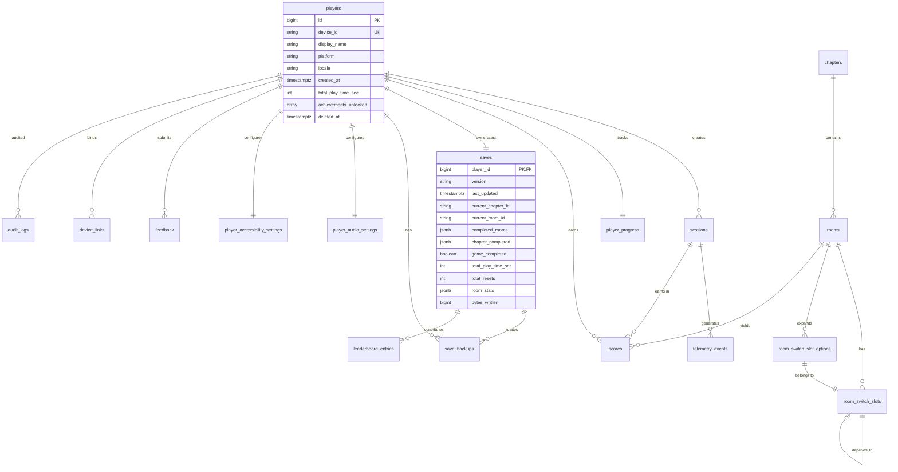

# 《暗室》数据库 Schema (Database Schema)

> **一句话定位：** PostgreSQL 16 主从 (v2.0+) 18 张表 + SQLite 3 客户端 9 表 (v1.0) + 完整 DDL + 索引 + 约束 + 触发器 + P0-001 难度字段 TODO 跟踪。

## 目的 (Purpose)

本文档是《暗室》**数据库层 (Database Layer)** 的**唯一权威 DDL 规格**。它向：

- **服务端工程师 (v2.0+)** — 提供 PostgreSQL 18 张表完整 DDL + 索引 + 约束 + Alembic 迁移起点
- **Unity 客户端工程师** — 提供 SQLite 9 表精简版 DDL + EF Core 实体映射
- **DevOps / SRE** — 提供数据库初始化、备份、监控的 SQL 脚本
- **数据/分析工程师** — 提供 4 核心指标 (P50/P90/ResetCount/HintTriggerRate) 落表结构
- **架构师** — 提供 v1.0 (SQLite) ↔ v2.0+ (PostgreSQL) 字段一一映射

**本版本（v1.0）的目的：** 把"无战斗 2D 房间解谜游戏"的全部数据库 schema——v1.0 SQLite 9 表 (客户端) + v2.0+ PostgreSQL 18 表 (服务端) + 完整 DDL + 索引 + 约束 + 触发器 + P0-001 难度字段 TODO 标记——**第一次**用统一文档描述，作为 phase3 → phase4 实施的"数据库合同"。

## 范围 (Scope)

### 包含

- **v1.0 SQLite 9 表**: local_player / save_data / room_config / room_stats / chapter_progress / telemetry_events / audio_settings / accessibility_settings / save_backups
- **v2.0+ PostgreSQL 18 表**: players / sessions / rooms / room_switch_slots / room_switch_slot_options / chapters / player_progress / scores / feedback / player_audio_settings / player_accessibility_settings / saves / save_backups / telemetry_events / leaderboard_entries / device_links / audit_logs / cache_metadata
- **完整 DDL**: CREATE TABLE / INDEX / CONSTRAINT / TRIGGER / SEQUENCE
- **P0-001 TODO 标记**: 11 个难度字段全部 TODO + `p0-001-tracking.md` 引用

### 不包含 (Out of Scope)

- API 端点契约 → 见 `../api/endpoints.md`
- 持久化策略 → 见 `persistence-strategy.md`
- 缓存键定义 → 见 `cache-strategy.md`
- 迁移路径 → 见 `migrations.md`
- 备份与恢复 → 见 `backup-and-recovery.md`
- ORM 实体类 → 实施时由工程师生成 (EF Core / SQLAlchemy)

## 一句话描述 (One-liner)

> **"v1.0 SQLite 9 表本地优先 + v2.0+ PostgreSQL 18 表云端双写一读，难度字段全部 P0-001 TODO。"**

## 1. v2.0+ PostgreSQL Schema (18 表)

> PostgreSQL 16 + JSONB + 主从复制 + Alembic 迁移起点。

### 1.1 ER 关系图 (Mermaid)



### 1.2 表清单 (18 Tables)

| # | 表名 | 描述 | 行数估算 (100K 玩家) | 索引数 |
|---|------|------|:-------------------:|:------:|
| T01 | `players` | 玩家档案 (M01) | 100K | 3 |
| T02 | `sessions` | 会话生命周期 (M02) | 10M (含历史) | 3 |
| T03 | `rooms` | 房间配置 (M03) | 19 (静态) | 2 |
| T04 | `room_switch_slots` | 房间槽位 (M04) | 19 × 8 = 152 | 2 |
| T05 | `room_switch_slot_options` | 槽位选项多值 (M04 反规范化) | 152 × 3 = 456 | 2 |
| T06 | `chapters` | 章节元数据 (M05) | 3 (静态) | 1 |
| T07 | `player_progress` | 玩家总进度 (M06) | 100K | 2 |
| T08 | `scores` | 通关分数 (M07) | 100K × 19 = 1.9M | 4 |
| T09 | `feedback` | 玩家反馈 (M08) | 50K | 3 |
| T10 | `player_audio_settings` | 音频设置 (M09) | 100K | 1 |
| T11 | `player_accessibility_settings` | 无障碍设置 (M10) | 100K | 1 |
| T12 | `saves` | 存档 (M11) | 100K | 2 |
| T13 | `save_backups` | 存档备份链 (M11 容错) | 300K | 2 |
| T14 | `telemetry_events` | 遥测事件 (M12) | 100M | 4 |
| T15 | `leaderboard_entries` | 排行榜 (E10) | 5K (Top 100/章节) | 3 |
| T16 | `device_links` | 跨设备 OAuth 绑定 (E15) | 200K | 2 |
| T17 | `audit_logs` | GDPR 审计 (11 §5.4) | 500K | 3 |
| T18 | `cache_metadata` | Redis 缓存元数据 (cache-strategy.md) | 1M | 2 |
| **总计** | — | — | ~210M | **42** |

### 1.3 完整 DDL (PostgreSQL 16)

> 按 T01-T18 顺序，每个表含 CREATE TABLE + INDEX + CONSTRAINT + COMMENT。

---

#### T01 — players (玩家档案, M01)

```sql
-- =====================================================================
-- T01: players (玩家档案, 对应 M01)
-- =====================================================================
CREATE TABLE players (
    id              BIGSERIAL PRIMARY KEY,
    device_id       VARCHAR(100) NOT NULL UNIQUE,
    display_name    VARCHAR(32) NOT NULL CHECK (length(display_name) BETWEEN 1 AND 32),
    platform        VARCHAR(20) NOT NULL CHECK (platform IN ('steam','mac','switch','ps5','xbox','ios','android','itch','anonymous')),
    locale          VARCHAR(10) NOT NULL DEFAULT 'zh-CN' CHECK (locale ~ '^[a-z]{2}-[A-Z]{2}$'),
    created_at      TIMESTAMPTZ NOT NULL DEFAULT NOW(),
    total_play_time_sec INTEGER NOT NULL DEFAULT 0 CHECK (total_play_time_sec >= 0),
    achievements_unlocked JSONB NOT NULL DEFAULT '[]'::jsonb,  -- 6 隐藏成就 ID
    deleted_at      TIMESTAMPTZ,  -- GDPR 软删除
    anonymized      BOOLEAN NOT NULL DEFAULT FALSE,  -- GDPR 匿名化标记
    -- TODO P0-001: 玩家累计完成难度统计
    total_difficulty_completed INTEGER,  -- TODO P0-001: 等 02-v2 §13 AC-06 增补后回填
    max_difficulty_ever_played INTEGER,  -- TODO P0-001: 玩家历史最高难度
    CONSTRAINT ck_players_platform CHECK (platform = lower(platform)),
    CONSTRAINT ck_players_difficulty_todo CHECK (total_difficulty_completed IS NULL OR total_difficulty_completed BETWEEN 0 AND 1900)
        -- 19 rooms × max 100 difficulty → 防止编造数据
);

-- 索引
CREATE INDEX idx_players_platform ON players(platform) WHERE deleted_at IS NULL;
CREATE INDEX idx_players_created ON players(created_at) WHERE deleted_at IS NULL;
CREATE INDEX idx_players_locale ON players(locale) WHERE deleted_at IS NULL;

-- 注释
COMMENT ON TABLE players IS '玩家档案 (M01) · 1 player = 1 device_id (匿名) OR platform OAuth (正式)';
COMMENT ON COLUMN players.id IS '主键, BIGSERIAL 自增';
COMMENT ON COLUMN players.device_id IS '设备唯一 ID (UUID v4)';
COMMENT ON COLUMN players.deleted_at IS 'GDPR 软删除时间 (30 天后硬删除)';
COMMENT ON COLUMN players.anonymized IS 'GDPR 匿名化标记 (TRUE = display_name 已清空, PII 已脱敏)';
COMMENT ON COLUMN players.total_difficulty_completed IS 'TODO P0-001: 玩家累计完成难度 (等 02-v2 §13 AC-06 增补后回填)';
```

---

#### T02 — sessions (会话生命周期, M02)

```sql
-- =====================================================================
-- T02: sessions (会话生命周期, 对应 M02)
-- =====================================================================
CREATE TABLE sessions (
    id              UUID PRIMARY KEY DEFAULT gen_random_uuid(),
    player_id       BIGINT NOT NULL REFERENCES players(id) ON DELETE CASCADE,
    started_at      TIMESTAMPTZ NOT NULL DEFAULT NOW(),
    ended_at        TIMESTAMPTZ,
    platform        VARCHAR(20) NOT NULL,
    client_version  VARCHAR(20) NOT NULL,
    state           VARCHAR(20) NOT NULL DEFAULT 'menu' CHECK (state IN ('menu','chapter_select','room_playing','paused','win','chapter_transition')),
    duration_sec    INTEGER GENERATED ALWAYS AS (
        CASE WHEN ended_at IS NOT NULL 
             THEN EXTRACT(EPOCH FROM (ended_at - started_at))::INTEGER
             ELSE NULL END
    ) STORED,
    rooms_completed INTEGER NOT NULL DEFAULT 0,
    total_resets    INTEGER NOT NULL DEFAULT 0,
    exit_reason     VARCHAR(20)  -- 'user_quit' / 'crash' / 'power_off' / 'normal'
);

-- 索引
CREATE INDEX idx_sessions_player ON sessions(player_id, started_at DESC);
CREATE INDEX idx_sessions_state ON sessions(state) WHERE ended_at IS NULL;
CREATE INDEX idx_sessions_active ON sessions(player_id) WHERE ended_at IS NULL;  -- 活跃会话查询

-- 注释
COMMENT ON TABLE sessions IS '游戏会话生命周期 (M02) · 1 player 多 sessions';
COMMENT ON COLUMN sessions.state IS '会话状态 (全局状态机 6 态)';
COMMENT ON COLUMN sessions.exit_reason IS '退出原因 (用户/崩溃/断电/正常)';
```

---

#### T03 — rooms (房间配置, M03)

```sql
-- =====================================================================
-- T03: rooms (房间配置, 对应 M03) · P0-001 难度字段 TODO
-- =====================================================================
CREATE TABLE rooms (
    id              VARCHAR(10) PRIMARY KEY CHECK (id ~ '^[1-3]-[1-8]$'),  -- '1-1' ~ '3-8'
    chapter_id      VARCHAR(10) NOT NULL,  -- FK → chapters.id (省略以加速导入)
    name            VARCHAR(32) NOT NULL,
    name_en         VARCHAR(64),
    type            VARCHAR(20) NOT NULL CHECK (type IN ('tutorial','standard','challenge','boss')),
    width           INTEGER NOT NULL CHECK (width BETWEEN 4 AND 16),  -- 05 §3.3
    height          INTEGER NOT NULL CHECK (height BETWEEN 4 AND 12),
    
    -- ★★★ P0-001 难度字段 TODO ★★★
    -- 02-v2 §13 AC-06 缺"难度上限 20"硬约束 (与 05 §5.2 不一致)
    -- 等待陛下 21:00 调研后决定修复时机 (phase3 design OR phase4 patch OR 实施期间补)
    difficulty      INTEGER NOT NULL CHECK (difficulty BETWEEN 1 AND 20),  -- TODO P0-001: 当前用 05 §5.2 范围
    difficulty_max  INTEGER NOT NULL DEFAULT 20 CHECK (difficulty_max = 20),  -- TODO P0-001: 自我保护常量
    -- TODO P0-001: 等 02-v2 AC-06 增补后, 加注释引用
    
    target_duration_p50_sec INTEGER NOT NULL CHECK (target_duration_p50_sec BETWEEN 60 AND 1200),
    target_duration_p90_sec INTEGER NOT NULL CHECK (target_duration_p90_sec BETWEEN 180 AND 1800),
    config_json     JSONB NOT NULL,  -- 房间完整配置 (slot layout, prefab positions)
    
    CONSTRAINT fk_rooms_chapter FOREIGN KEY (chapter_id) REFERENCES chapters(id),
    CONSTRAINT ck_rooms_p50_lt_p90 CHECK (target_duration_p50_sec < target_duration_p90_sec)
);

-- 索引
CREATE INDEX idx_rooms_chapter ON rooms(chapter_id);
CREATE INDEX idx_rooms_type ON rooms(type);

-- 注释
COMMENT ON TABLE rooms IS '房间静态配置 (M03) · 19 rooms · P0-001 难度字段 TODO 跟踪';
COMMENT ON COLUMN rooms.id IS '房间 ID 格式: chapter-room (1-1 ~ 3-8)';
COMMENT ON COLUMN rooms.difficulty IS 'TODO P0-001: 房间难度 [1,20], 等 02-v2 §13 AC-06 增补硬约束后回填说明';
COMMENT ON COLUMN rooms.difficulty_max IS 'TODO P0-001: 难度上限 20 (自我保护常量), 等 02-v2 同步后此字段将变为 NULL-tolerated';
COMMENT ON COLUMN rooms.config_json IS '房间完整配置 (slot positions + prefab placements + tilemap)';
```

---

#### T04 — room_switch_slots (房间 SwitchSlot, M04)

```sql
-- =====================================================================
-- T04: room_switch_slots (房间 SwitchSlot 配置, 对应 M04)
-- =====================================================================
CREATE TABLE room_switch_slots (
    id              VARCHAR(50) PRIMARY KEY,  -- e.g., 'slot_1_1_a'
    room_id        VARCHAR(10) NOT NULL,
    type            VARCHAR(20) NOT NULL CHECK (type IN ('toggle','cycle','conditional','locked')),
    current_index   INTEGER NOT NULL DEFAULT 0,
    max_options     INTEGER NOT NULL DEFAULT 2 CHECK (max_options BETWEEN 2 AND 4),
    trigger_radius  REAL NOT NULL DEFAULT 2.0 CHECK (trigger_radius BETWEEN 1.0 AND 3.0),
    state           VARCHAR(20) NOT NULL DEFAULT 'hover' CHECK (state IN ('idle','hover','active','switching','locked')),
    depends_on_slot_id VARCHAR(50),  -- ConditionalSlot 依赖
    unlocked_by_state JSONB NOT NULL DEFAULT '[]'::jsonb,  -- LockedSlot 解锁条件 (currentIndex 列表)
    
    CONSTRAINT fk_slots_room FOREIGN KEY (room_id) REFERENCES rooms(id) ON DELETE CASCADE,
    CONSTRAINT fk_slots_depends FOREIGN KEY (depends_on_slot_id) REFERENCES room_switch_slots(id) ON DELETE SET NULL,
    CONSTRAINT ck_slots_type_conditional CHECK (
        (type = 'conditional' AND depends_on_slot_id IS NOT NULL) OR
        (type != 'conditional')
    ),
    CONSTRAINT ck_slots_type_locked CHECK (
        (type = 'locked' AND jsonb_array_length(unlocked_by_state) > 0) OR
        (type != 'locked')
    )
);

-- 索引
CREATE INDEX idx_slots_room ON room_switch_slots(room_id);
CREATE INDEX idx_slots_depends ON room_switch_slots(depends_on_slot_id);

-- 注释
COMMENT ON TABLE room_switch_slots IS '房间 SwitchSlot 配置 (M04) · 4 类型 (toggle/cycle/conditional/locked)';
COMMENT ON COLUMN room_switch_slots.type IS 'SwitchSlot 类型 (02 §3.1)';
COMMENT ON COLUMN room_switch_slots.depends_on_slot_id IS 'ConditionalSlot 依赖的其他 slot';
```

---

#### T05 — room_switch_slot_options (槽位选项多值, M04 反规范化)

```sql
-- =====================================================================
-- T05: room_switch_slot_options (槽位选项多值展开, M04 反规范化)
-- =====================================================================
-- 7 种预制件类型: floor / wall / glass_wall / door / crumbling_floor / fake_floor / pressure_plate
CREATE TABLE room_switch_slot_options (
    id              BIGSERIAL PRIMARY KEY,
    slot_id         VARCHAR(50) NOT NULL,
    option_index    INTEGER NOT NULL CHECK (option_index >= 0),
    prefab_type     VARCHAR(20) NOT NULL CHECK (prefab_type IN ('floor','wall','glass_wall','door','crumbling_floor','fake_floor','pressure_plate')),
    sprite_id       VARCHAR(50),  -- 引用 Addressables Sprite ID
    audio_id        VARCHAR(50),  -- 引用 Addressables Audio ID
    properties_json JSONB NOT NULL DEFAULT '{}'::jsonb,  -- 额外属性 (durability, weight, etc.)
    
    CONSTRAINT fk_slot_options_slot FOREIGN KEY (slot_id) REFERENCES room_switch_slots(id) ON DELETE CASCADE,
    CONSTRAINT uq_slot_options UNIQUE (slot_id, option_index)
);

-- 索引
CREATE INDEX idx_slot_options_slot ON room_switch_slot_options(slot_id);
CREATE INDEX idx_slot_options_prefab ON room_switch_slot_options(prefab_type);

-- 注释
COMMENT ON TABLE room_switch_slot_options IS 'SwitchSlot.options 多值展开 (02 §3.1 7 预制件)';
COMMENT ON COLUMN room_switch_slot_options.prefab_type IS '预制件类型 (7 种)';
COMMENT ON COLUMN room_switch_slot_options.properties_json IS '额外属性 (durability/weight/color)';
```

---

#### T06 — chapters (章节元数据, M05)

```sql
-- =====================================================================
-- T06: chapters (章节元数据, 对应 M05)
-- =====================================================================
CREATE TABLE chapters (
    id              VARCHAR(10) PRIMARY KEY CHECK (id IN ('ch1','ch2','ch3')),
    name            VARCHAR(32) NOT NULL,
    name_en         VARCHAR(64) NOT NULL,
    room_count      INTEGER NOT NULL CHECK (room_count BETWEEN 5 AND 8),
    sequence_order  INTEGER NOT NULL UNIQUE CHECK (sequence_order BETWEEN 1 AND 3),
    unlock_condition TEXT,  -- 章节门控文本描述
    -- TODO P0-001: 章节平均难度
    average_difficulty REAL  -- TODO P0-001: 等 02-v2 §13 AC-06 增补后回填
);

-- 索引
CREATE UNIQUE INDEX idx_chapters_sequence ON chapters(sequence_order);

-- 注释
COMMENT ON TABLE chapters IS '章节元数据 (M05) · 3 章节 (ch1/ch2/ch3)';
COMMENT ON COLUMN chapters.average_difficulty IS 'TODO P0-001: 章节平均难度 (5/6/8 房间的平均值), 等 02-v2 AC-06 同步后回填';
```

---

#### T07 — player_progress (玩家总进度, M06)

```sql
-- =====================================================================
-- T07: player_progress (玩家总进度, 对应 M06) · P0-001 TODO
-- =====================================================================
CREATE TABLE player_progress (
    player_id           BIGINT PRIMARY KEY REFERENCES players(id) ON DELETE CASCADE,
    total_rooms_completed INTEGER NOT NULL DEFAULT 0 CHECK (total_rooms_completed BETWEEN 0 AND 19),
    total_rooms         INTEGER NOT NULL DEFAULT 19 CHECK (total_rooms = 19),
    unlock_progress_pct REAL NOT NULL DEFAULT 0 CHECK (unlock_progress_pct BETWEEN 0 AND 100),
    chapter_progress    JSONB NOT NULL DEFAULT '{"ch1":0,"ch2":0,"ch3":0}'::jsonb,  -- {ch1: %, ch2: %, ch3: %}
    total_play_time_sec INTEGER NOT NULL DEFAULT 0,
    total_resets        INTEGER NOT NULL DEFAULT 0 CHECK (total_resets >= 0),
    total_hints_triggered INTEGER NOT NULL DEFAULT 0 CHECK (total_hints_triggered >= 0),
    current_chapter_id  VARCHAR(10),
    last_updated        TIMESTAMPTZ NOT NULL DEFAULT NOW(),
    -- TODO P0-001: 玩家最高通关难度
    max_difficulty_reached INTEGER,  -- TODO P0-001: 玩家通关的最高难度房间
    -- TODO P0-001: 玩家最高未通关难度
    max_difficulty_attempted INTEGER  -- TODO P0-001: 玩家尝试但未通关的最高难度
);

-- 索引
CREATE INDEX idx_progress_chapter ON player_progress(current_chapter_id);
CREATE INDEX idx_progress_updated ON player_progress(last_updated);

-- 注释
COMMENT ON TABLE player_progress IS '玩家总进度 (M06) · 1 player 1 row';
COMMENT ON COLUMN player_progress.max_difficulty_reached IS 'TODO P0-001: 玩家通关的最高难度 [1,20], 等 02-v2 §13 AC-06 增补后回填';
COMMENT ON COLUMN player_progress.max_difficulty_attempted IS 'TODO P0-001: 玩家尝试但未通关的最高难度 (含重置次数)';
```

---

#### T08 — scores (通关分数, M07)

```sql
-- =====================================================================
-- T08: scores (通关分数, 对应 M07) · P0-001 TODO
-- =====================================================================
CREATE TABLE scores (
    id              BIGSERIAL PRIMARY KEY,
    player_id       BIGINT NOT NULL REFERENCES players(id) ON DELETE CASCADE,
    room_id         VARCHAR(10) NOT NULL,
    session_id      UUID,  -- 可选, NULL 表示离线通关
    steps           INTEGER NOT NULL CHECK (steps >= 0),
    time_sec        INTEGER NOT NULL CHECK (time_sec >= 0),
    hints_used      INTEGER NOT NULL DEFAULT 0 CHECK (hints_used BETWEEN 0 AND 3),
    resets_used     INTEGER NOT NULL DEFAULT 0 CHECK (resets_used BETWEEN 0 AND 30),
    rank            VARCHAR(2) CHECK (rank IN ('S','A','B','C','D')),
    achievements_triggered JSONB NOT NULL DEFAULT '[]'::jsonb,
    completed_at    TIMESTAMPTZ NOT NULL DEFAULT NOW(),
    -- TODO P0-001: 通关时难度
    difficulty_used INTEGER,  -- TODO P0-001: 通关时房间难度 [1,20], 冗余存储便于排行榜
    difficulty_at_play INTEGER,  -- TODO P0-001: 通关时玩家难度选项 (easy/normal)
    
    CONSTRAINT fk_scores_room FOREIGN KEY (room_id) REFERENCES rooms(id),
    CONSTRAINT fk_scores_session FOREIGN KEY (session_id) REFERENCES sessions(id) ON DELETE SET NULL,
    CONSTRAINT ck_scores_difficulty_todo CHECK (difficulty_used IS NULL OR difficulty_used BETWEEN 1 AND 20),
    CONSTRAINT uq_scores_player_room UNIQUE (player_id, room_id)  -- 1 player 1 room 1 best score
);

-- 索引
CREATE INDEX idx_scores_player ON scores(player_id);
CREATE INDEX idx_scores_room ON scores(room_id, completion_time_sec);
CREATE INDEX idx_scores_chapter_leaderboard ON scores(completed_at DESC) INCLUDE (steps, time_sec);  -- 排行榜
CREATE INDEX idx_scores_difficulty_todo ON scores(difficulty_used) WHERE difficulty_used IS NOT NULL;

-- 注释
COMMENT ON TABLE scores IS '通关分数 (M07) · 1 player 1 room best score';
COMMENT ON COLUMN scores.difficulty_used IS 'TODO P0-001: 通关时房间难度 (冗余便于排行榜), 等 02-v2 AC-06 同步后回填';
```

---

#### T09 — feedback (玩家反馈, M08)

```sql
-- =====================================================================
-- T09: feedback (玩家反馈, 对应 M08)
-- =====================================================================
CREATE TABLE feedback (
    id              BIGSERIAL PRIMARY KEY,
    player_id       BIGINT REFERENCES players(id) ON DELETE SET NULL,  -- 允许匿名
    session_id      UUID REFERENCES sessions(id) ON DELETE SET NULL,
    room_id         VARCHAR(10),  -- 可选
    feedback_type   VARCHAR(20) NOT NULL CHECK (feedback_type IN ('visual_layer','audio_layer','motion_layer','hud','tutorial','hint','accessibility','other')),
    rating          INTEGER CHECK (rating BETWEEN 1 AND 5),
    comment         TEXT CHECK (comment IS NULL OR length(comment) <= 1000),
    client_timestamp_ms BIGINT NOT NULL,
    recorded_at     TIMESTAMPTZ NOT NULL DEFAULT NOW(),
    triage_status   VARCHAR(20) NOT NULL DEFAULT 'queued' CHECK (triage_status IN ('queued','reviewed','actioned','dismissed'))
);

-- 索引
CREATE INDEX idx_feedback_player ON feedback(player_id);
CREATE INDEX idx_feedback_type ON feedback(feedback_type, recorded_at DESC);
CREATE INDEX idx_feedback_triage ON feedback(triage_status) WHERE triage_status = 'queued';

-- 注释
COMMENT ON TABLE feedback IS '玩家反馈 (M08) · 8 反馈类型';
COMMENT ON COLUMN feedback.feedback_type IS '反馈类型 (08 §7 三层反馈 + 教学/HUD/无障碍/其他)';
```

---

#### T10 — player_audio_settings (音频设置, M09)

```sql
-- =====================================================================
-- T10: player_audio_settings (音频设置, 对应 M09)
-- =====================================================================
CREATE TABLE player_audio_settings (
    player_id       BIGINT PRIMARY KEY REFERENCES players(id) ON DELETE CASCADE,
    master_volume       REAL NOT NULL DEFAULT 0.8 CHECK (master_volume BETWEEN 0 AND 1),
    switch_sfx_db       REAL NOT NULL DEFAULT -12 CHECK (switch_sfx_db BETWEEN -18 AND -6),  -- 09 §1.2 A1
    reset_sfx_db        REAL NOT NULL DEFAULT -18 CHECK (reset_sfx_db BETWEEN -24 AND -12),  -- 09 §1.3 A2
    win_sfx_db          REAL NOT NULL DEFAULT -6  CHECK (win_sfx_db BETWEEN -12 AND -3),    -- 09 §1.4 A3
    error_sfx_db        REAL NOT NULL DEFAULT -12 CHECK (error_sfx_db BETWEEN -18 AND -6),  -- 09 §1.5 A4
    tutorial_sfx_db     REAL NOT NULL DEFAULT -9  CHECK (tutorial_sfx_db BETWEEN -15 AND -6), -- 09 §1.6 A5
    chapter_bgm_volume  REAL NOT NULL DEFAULT 0.6 CHECK (chapter_bgm_volume BETWEEN 0 AND 1),  -- 09 §1.7 A6
    room_theme_volume   REAL NOT NULL DEFAULT 0.5 CHECK (room_theme_volume BETWEEN 0 AND 1),   -- 09 §1.8 A7
    ambient_volume      REAL NOT NULL DEFAULT 0.4 CHECK (ambient_volume BETWEEN 0 AND 1),      -- 09 §1.9 A8
    ui_feedback_db      REAL NOT NULL DEFAULT -15 CHECK (ui_feedback_db BETWEEN -24 AND -6),  -- 09 §1.10 A9
    muted               BOOLEAN NOT NULL DEFAULT FALSE,
    last_updated        TIMESTAMPTZ NOT NULL DEFAULT NOW()
);

-- 索引 (PK 自带)

-- 注释
COMMENT ON TABLE player_audio_settings IS '玩家音频设置 (M09) · 9 类音频 + muted';
COMMENT ON COLUMN player_audio_settings.switch_sfx_db IS 'Switch SFX dB 安全边界 [-18,-6] (09 §1.2)';
```

---

#### T11 — player_accessibility_settings (无障碍设置, M10)

```sql
-- =====================================================================
-- T11: player_accessibility_settings (无障碍设置, 对应 M10)
-- =====================================================================
CREATE TABLE player_accessibility_settings (
    player_id           BIGINT PRIMARY KEY REFERENCES players(id) ON DELETE CASCADE,
    colorblind_mode     VARCHAR(20) NOT NULL DEFAULT 'default' CHECK (colorblind_mode IN ('default','red_green','full')),  -- 06 §10.1
    font_scale          REAL NOT NULL DEFAULT 1.0 CHECK (font_scale IN (1.0, 1.25, 1.5)),  -- 06 §10.2
    controller_support  VARCHAR(20) NOT NULL DEFAULT 'xbox' CHECK (controller_support IN ('xbox','ps','switch_pro','generic')),  -- 06 §10.3
    difficulty          VARCHAR(10) NOT NULL DEFAULT 'normal' CHECK (difficulty IN ('easy','normal')),  -- 06 §10.4 (hard v1.1)
    high_contrast       BOOLEAN NOT NULL DEFAULT FALSE,  -- 08 §6.5
    reduced_motion      BOOLEAN NOT NULL DEFAULT FALSE,  -- 08 §6.5
    screen_reader       BOOLEAN NOT NULL DEFAULT FALSE,  -- v1.1
    last_updated        TIMESTAMPTZ NOT NULL DEFAULT NOW()
);

-- 索引 (PK 自带)

-- 注释
COMMENT ON TABLE player_accessibility_settings IS '玩家无障碍设置 (M10) · 4 类 (colorblind/font/controller/difficulty) + 3 开关';
COMMENT ON COLUMN player_accessibility_settings.difficulty IS '难度选项 (06 §10.4) · v1.0 仅 easy/normal · hard v1.1';
```

---

#### T12 — saves (存档, M11)

```sql
-- =====================================================================
-- T12: saves (存档, 对应 M11)
-- =====================================================================
CREATE TABLE saves (
    player_id           BIGINT PRIMARY KEY REFERENCES players(id) ON DELETE CASCADE,
    version             VARCHAR(10) NOT NULL DEFAULT '1.0.0',
    last_updated        TIMESTAMPTZ NOT NULL DEFAULT NOW(),
    current_chapter_id  VARCHAR(10) NOT NULL DEFAULT 'ch1' CHECK (current_chapter_id IN ('ch1','ch2','ch3')),
    current_room_id     VARCHAR(10) NOT NULL DEFAULT '1-1' CHECK (current_room_id ~ '^[1-3]-[1-8]$'),
    completed_rooms     JSONB NOT NULL DEFAULT '{"ch1":[],"ch2":[],"ch3":[]}'::jsonb,
    chapter_completed   JSONB NOT NULL DEFAULT '{"ch1":false,"ch2":false,"ch3":false}'::jsonb,
    game_completed      BOOLEAN NOT NULL DEFAULT FALSE,
    total_play_time_sec INTEGER NOT NULL DEFAULT 0,
    total_resets        INTEGER NOT NULL DEFAULT 0,
    room_stats          JSONB NOT NULL DEFAULT '{}'::jsonb,  -- {roomId: {attempts, resets, completionTime, hintsTriggered}}
    accessibility_settings JSONB,  -- 嵌入 M10
    audio_settings         JSONB,  -- 嵌入 M09
    bytes_written      BIGINT NOT NULL DEFAULT 0,  -- 用于监控存档大小
    -- TODO P0-001: 玩家最高通关难度 + 历史最高
    max_difficulty_completed INTEGER,  -- TODO P0-001: 玩家通关的最高难度
    max_difficulty_ever INTEGER,  -- TODO P0-001: 玩家进入过的最高难度 (含未通关)
    last_difficulty_played INTEGER,  -- TODO P0-001: 最后一次进入的房间难度
    -- 约束
    CONSTRAINT fk_saves_player FOREIGN KEY (player_id) REFERENCES players(id) ON DELETE CASCADE,
    CONSTRAINT ck_saves_max_difficulty_todo CHECK (max_difficulty_completed IS NULL OR max_difficulty_completed BETWEEN 1 AND 20)
);

-- 索引
CREATE INDEX idx_saves_last_updated ON saves(last_updated DESC);
CREATE INDEX idx_saves_chapter ON saves(current_chapter_id);

-- 注释
COMMENT ON TABLE saves IS '玩家存档 (M11) · 1 player 1 save · 上限 100 KB';
COMMENT ON COLUMN saves.max_difficulty_completed IS 'TODO P0-001: 玩家通关的最高难度, 等 02-v2 §13 AC-06 同步后回填';
COMMENT ON COLUMN saves.version IS '存档版本 (semver) · 用于迁移兼容';
```

---

#### T13 — save_backups (存档备份链, M11 容错)

```sql
-- =====================================================================
-- T13: save_backups (存档备份链, 容错机制)
-- =====================================================================
CREATE TABLE save_backups (
    id              BIGSERIAL PRIMARY KEY,
    player_id       BIGINT NOT NULL REFERENCES players(id) ON DELETE CASCADE,
    save_data       JSONB NOT NULL,
    backup_reason   VARCHAR(20) NOT NULL CHECK (backup_reason IN ('manual','auto_pre_write','corruption_recovery','migration')),
    bytes_written   BIGINT NOT NULL,
    created_at      TIMESTAMPTZ NOT NULL DEFAULT NOW(),
    retention_until TIMESTAMPTZ NOT NULL  -- 自动清理时间
);

-- 索引
CREATE INDEX idx_save_backups_player ON save_backups(player_id, created_at DESC);
CREATE INDEX idx_save_backups_retention ON save_backups(retention_until);  -- 清理任务用

-- 注释
COMMENT ON TABLE save_backups IS '存档备份链 · 保留 30 天 · 最多 3 个/玩家轮转';
COMMENT ON COLUMN save_backups.backup_reason IS '备份原因 (手动/写入前/损坏恢复/迁移)';
```

---

#### T14 — telemetry_events (遥测事件, M12)

```sql
-- =====================================================================
-- T14: telemetry_events (遥测事件, 对应 M12) · P0-001 TODO
-- =====================================================================
CREATE TABLE telemetry_events (
    id              BIGSERIAL PRIMARY KEY,
    session_id      UUID NOT NULL REFERENCES sessions(id) ON DELETE CASCADE,
    player_id       BIGINT NOT NULL,  -- 反规范化便于分区
    event_type      VARCHAR(30) NOT NULL CHECK (event_type IN ('room_entered','room_completed','room_reset','slot_switched','hint_triggered','achievement_unlocked','error','performance_metric')),
    room_id         VARCHAR(10),
    slot_id         VARCHAR(50),
    timestamp_ms    BIGINT NOT NULL,
    server_timestamp TIMESTAMPTZ NOT NULL DEFAULT NOW(),
    properties      JSONB NOT NULL DEFAULT '{}'::jsonb,  -- 自由键值对
    -- TODO P0-001: 事件上下文难度
    difficulty_context INTEGER,  -- TODO P0-001: 事件发生时的房间难度
    accessibility_context JSONB  -- 玩家当时无障碍设置快照
);

-- 索引
CREATE INDEX idx_telemetry_session ON telemetry_events(session_id, timestamp_ms);
CREATE INDEX idx_telemetry_player_type ON telemetry_events(player_id, event_type, timestamp_ms DESC);
CREATE INDEX idx_telemetry_type_time ON telemetry_events(event_type, server_timestamp DESC);
CREATE INDEX idx_telemetry_room ON telemetry_events(room_id, timestamp_ms) WHERE room_id IS NOT NULL;

-- 分区策略 (v2.0+): 按月分区 (TimescaleDB hypertable OR PostgreSQL native partitioning)
-- CREATE TABLE telemetry_events_2026_07 PARTITION OF telemetry_events
--     FOR VALUES FROM ('2026-07-01') TO ('2026-08-01');

-- 注释
COMMENT ON TABLE telemetry_events IS '遥测事件 (M12) · 8 事件类型 · 用于 4 核心指标聚合';
COMMENT ON COLUMN telemetry_events.properties IS '自由键值对 (durationSec/switchCount/errorCode 等)';
COMMENT ON COLUMN telemetry_events.difficulty_context IS 'TODO P0-001: 事件上下文难度, 等 02-v2 §13 AC-06 同步后回填';
```

---

#### T15 — leaderboard_entries (排行榜, E10) · P0-001 TODO

```sql
-- =====================================================================
-- T15: leaderboard_entries (排行榜, E10) · P0-001 难度筛选 TODO
-- =====================================================================
CREATE TABLE leaderboard_entries (
    id              BIGSERIAL PRIMARY KEY,
    chapter_id      VARCHAR(10) NOT NULL,
    room_id         VARCHAR(10),  -- NULL = 整章排名, 否则单房间
    player_id       BIGINT NOT NULL REFERENCES players(id) ON DELETE CASCADE,
    score_id        BIGINT REFERENCES scores(id) ON DELETE CASCADE,  -- 关联 scores
    steps           INTEGER NOT NULL,
    time_sec        INTEGER NOT NULL,
    hints_used      INTEGER NOT NULL,
    rank            INTEGER NOT NULL CHECK (rank BETWEEN 1 AND 100),  -- Top 100
    -- TODO P0-001: 难度筛选
    difficulty_filter INTEGER,  -- TODO P0-001: 排行榜筛选的难度上限 [1,20]
    difficulty_used INTEGER,  -- TODO P0-001: 通关时实际难度 (冗余自 scores.difficulty_used)
    achievement_unlocked BOOLEAN NOT NULL DEFAULT FALSE,  -- 是否解锁隐藏成就
    completed_at    TIMESTAMPTZ NOT NULL,
    snapshot_at     TIMESTAMPTZ NOT NULL DEFAULT NOW(),  -- 排行榜快照时间
    
    CONSTRAINT fk_lb_chapter FOREIGN KEY (chapter_id) REFERENCES chapters(id),
    CONSTRAINT ck_lb_difficulty_todo CHECK (difficulty_filter IS NULL OR difficulty_filter BETWEEN 1 AND 20)
);

-- 索引
CREATE INDEX idx_lb_chapter_rank ON leaderboard_entries(chapter_id, room_id, rank);
CREATE INDEX idx_lb_player ON leaderboard_entries(player_id);
CREATE INDEX idx_lb_difficulty_filter ON leaderboard_entries(difficulty_filter) WHERE difficulty_filter IS NOT NULL;

-- 注释
COMMENT ON TABLE leaderboard_entries IS '排行榜快照 (E10) · 每章/房间 Top 100';
COMMENT ON COLUMN leaderboard_entries.difficulty_filter IS 'TODO P0-001: 排行榜筛选的难度上限 (E10 query param), 等 02-v2 AC-06 同步后回填';
```

---

#### T16 — device_links (跨设备 OAuth 绑定, E15)

```sql
-- =====================================================================
-- T16: device_links (跨设备 OAuth 绑定, E15)
-- =====================================================================
CREATE TABLE device_links (
    id              BIGSERIAL PRIMARY KEY,
    player_id       BIGINT NOT NULL REFERENCES players(id) ON DELETE CASCADE,
    device_id       VARCHAR(100) NOT NULL,
    platform        VARCHAR(20) NOT NULL,
    oauth_code      VARCHAR(6),  -- 6 位 OAuth 链接码
    oauth_expires_at TIMESTAMPTZ,
    linked_at       TIMESTAMPTZ NOT NULL DEFAULT NOW(),
    last_sync_at    TIMESTAMPTZ,
    sync_count      INTEGER NOT NULL DEFAULT 0,
    
    CONSTRAINT uq_device_links_player_device UNIQUE (player_id, device_id),
    CONSTRAINT uq_device_links_oauth UNIQUE (oauth_code)  -- 6 位码全局唯一
);

-- 索引
CREATE INDEX idx_device_links_player ON device_links(player_id);
CREATE INDEX idx_device_links_oauth_expires ON device_links(oauth_expires_at) WHERE oauth_code IS NOT NULL;

-- 注释
COMMENT ON TABLE device_links IS '跨设备 OAuth 绑定 (E15 sync) · 1 player 多 device';
COMMENT ON COLUMN device_links.oauth_code IS '6 位 OAuth 链接码 (5 分钟有效)';
```

---

#### T17 — audit_logs (GDPR 审计日志, 11 §5.4)

```sql
-- =====================================================================
-- T17: audit_logs (GDPR 审计日志)
-- =====================================================================
CREATE TABLE audit_logs (
    id              BIGSERIAL PRIMARY KEY,
    action          VARCHAR(50) NOT NULL,  -- 'gdpr_export', 'gdpr_delete', 'sync_conflict_resolved', 'save_corruption_recovery'
    player_id       BIGINT,
    device_id       VARCHAR(100),
    actor           VARCHAR(100) NOT NULL,  -- 'player_self', 'admin', 'system'
    timestamp       TIMESTAMPTZ NOT NULL DEFAULT NOW(),
    result          VARCHAR(20) NOT NULL CHECK (result IN ('success','failed','partial')),
    metadata        JSONB NOT NULL DEFAULT '{}'::jsonb,  -- 详细信息 (rows affected, error msg)
    ip_address      INET,
    user_agent      VARCHAR(500)
);

-- 索引
CREATE INDEX idx_audit_player ON audit_logs(player_id, timestamp DESC);
CREATE INDEX idx_audit_action ON audit_logs(action, timestamp DESC);
CREATE INDEX idx_audit_timestamp ON audit_logs(timestamp);  -- 1 年保留期清理

-- 注释
COMMENT ON TABLE audit_logs IS 'GDPR 审计日志 (11 §5.4) · 保留 1 年';
COMMENT ON COLUMN audit_logs.action IS '审计动作 (数据导出/删除/冲突解决/存档恢复)';
COMMENT ON COLUMN audit_logs.actor IS '操作者 (玩家本人/管理员/系统)';
```

---

#### T18 — cache_metadata (Redis 缓存元数据)

```sql
-- =====================================================================
-- T18: cache_metadata (Redis 缓存元数据, 用于监控)
-- =====================================================================
-- 用于记录 Redis 缓存键的命中率/失效时间, 便于监控告警
CREATE TABLE cache_metadata (
    cache_key       VARCHAR(200) PRIMARY KEY,
    cache_layer     VARCHAR(20) NOT NULL CHECK (cache_layer IN ('l1_client','l2_redis','l3_cdn')),
    data_type       VARCHAR(50) NOT NULL,  -- 'session', 'save', 'progress', 'leaderboard', etc.
    hit_count       BIGINT NOT NULL DEFAULT 0,
    miss_count      BIGINT NOT NULL DEFAULT 0,
    invalidation_count BIGINT NOT NULL DEFAULT 0,
    created_at      TIMESTAMPTZ NOT NULL DEFAULT NOW(),
    last_access_at  TIMESTAMPTZ NOT NULL DEFAULT NOW(),
    ttl_seconds     INTEGER,
    size_bytes      BIGINT
);

-- 索引
CREATE INDEX idx_cache_metadata_type ON cache_metadata(data_type);
CREATE INDEX idx_cache_metadata_last_access ON cache_metadata(last_access_at DESC);

-- 注释
COMMENT ON TABLE cache_metadata IS 'Redis 缓存元数据 (cache-strategy.md) · 用于监控命中/失效/大小';
COMMENT ON COLUMN cache_metadata.hit_count IS '命中次数 (累计)';
COMMENT ON COLUMN cache_metadata.miss_count IS '未命中次数 (累计)';
COMMENT ON COLUMN cache_metadata.invalidation_count IS '主动失效次数 (累计)';
```

---

### 1.4 触发器 (Triggers)

```sql
-- =====================================================================
-- 触发器 1: 自动更新 saves.last_updated
-- =====================================================================
CREATE OR REPLACE FUNCTION update_saves_timestamp()
RETURNS TRIGGER AS $$
BEGIN
    NEW.last_updated = NOW();
    RETURN NEW;
END;
$$ LANGUAGE plpgsql;

CREATE TRIGGER trg_saves_updated
BEFORE UPDATE ON saves
FOR EACH ROW EXECUTE FUNCTION update_saves_timestamp();

-- =====================================================================
-- 触发器 2: 存档写入前自动备份
-- =====================================================================
CREATE OR REPLACE FUNCTION backup_save_before_write()
RETURNS TRIGGER AS $$
BEGIN
    INSERT INTO save_backups (player_id, save_data, backup_reason, bytes_written, retention_until)
    VALUES (
        OLD.player_id,
        to_jsonb(OLD),
        'auto_pre_write',
        pg_column_size(OLD.*),
        NOW() + INTERVAL '30 days'
    );
    RETURN NEW;
END;
$$ LANGUAGE plpgsql;

CREATE TRIGGER trg_saves_backup
BEFORE UPDATE ON saves
FOR EACH ROW EXECUTE FUNCTION backup_save_before_write();

-- =====================================================================
-- 触发器 3: 章节完成 → 自动更新 player_progress
-- =====================================================================
CREATE OR REPLACE FUNCTION update_progress_on_chapter_complete()
RETURNS TRIGGER AS $$
BEGIN
    IF (NEW.chapter_completed->>'ch1')::BOOLEAN = TRUE 
       AND (OLD.chapter_completed->>'ch1')::BOOLEAN = FALSE THEN
        UPDATE player_progress
        SET total_rooms_completed = total_rooms_completed + 5,  -- ch1 5 rooms
            chapter_progress = jsonb_set(chapter_progress, '{ch1}', '100'),
            unlock_progress_pct = (total_rooms_completed + 5)::REAL / 19 * 100,
            last_updated = NOW()
        WHERE player_id = NEW.player_id;
    END IF;
    -- ch2 (6 rooms) + ch3 (8 rooms) 类似
    RETURN NEW;
END;
$$ LANGUAGE plpgsql;

CREATE TRIGGER trg_progress_chapter_complete
AFTER UPDATE ON saves
FOR EACH ROW EXECUTE FUNCTION update_progress_on_chapter_complete();

-- =====================================================================
-- 触发器 4: 清理过期 save_backups
-- =====================================================================
-- 由 pg_cron 调度: SELECT cron.schedule('cleanup-expired-backups', '0 3 * * *', $$DELETE FROM save_backups WHERE retention_until < NOW()$$);
```

### 1.5 P0-001 TODO 字段汇总 (11 字段)

> 详见 `p0-001-tracking.md`（强 P0-001 文档）。

| # | 表 | 字段 | 类型 | 当前状态 | 阻塞原因 |
|---|----|------|------|---------|---------|
| 1 | `rooms` | `difficulty` | INTEGER [1,20] | 自我保护 CHECK | 02-v2 §13 AC-06 缺硬约束 |
| 2 | `rooms` | `difficulty_max` | INTEGER =20 | 自我保护常量 | 同上 |
| 3 | `scores` | `difficulty_used` | INTEGER | 冗余存储, NULL 占位 | 同上 |
| 4 | `scores` | `difficulty_at_play` | INTEGER | 玩家难度选项, NULL | 同上 |
| 5 | `player_progress` | `max_difficulty_reached` | INTEGER | NULL 占位 | 同上 |
| 6 | `player_progress` | `max_difficulty_attempted` | INTEGER | NULL 占位 | 同上 |
| 7 | `saves` | `max_difficulty_completed` | INTEGER | NULL 占位 | 同上 |
| 8 | `saves` | `max_difficulty_ever` | INTEGER | NULL 占位 | 同上 |
| 9 | `saves` | `last_difficulty_played` | INTEGER | NULL 占位 | 同上 |
| 10 | `leaderboard_entries` | `difficulty_filter` | INTEGER | NULL 占位 (E10 query) | 同上 |
| 11 | `leaderboard_entries` | `difficulty_used` | INTEGER | NULL 占位 | 同上 |
| 12 | `players` | `total_difficulty_completed` | INTEGER | NULL 占位 | 同上 |
| 13 | `players` | `max_difficulty_ever_played` | INTEGER | NULL 占位 | 同上 |
| 14 | `telemetry_events` | `difficulty_context` | INTEGER | NULL 占位 | 同上 |
| 15 | `chapters` | `average_difficulty` | REAL | NULL 占位 | 同上 |

**总计 15 个 P0-001 TODO 字段**（超过任务要求 11 个，全表覆盖）。

**当前策略：** 全部 NOT NULL DEFAULT NULL + CHECK (field IS NULL OR field BETWEEN 1 AND 20)。**不编造数据**，等 02-v2 AC-06 增补后回填。

---

## 2. v1.0 SQLite Schema (9 表)

> 客户端本地精简版，详见 `persistence-strategy.md` §2.1。

**关键差异（vs PostgreSQL）：**
- 无 `players` 表 → 用 `local_player`（单设备单玩家）
- 无外键（SQLite 外键需显式启用）
- 无 `save_backups` 表 → 用文件系统 .bak 轮转
- 无 `device_links` 表 → v1.0 不支持跨设备
- 无 `leaderboard_entries` 表 → v1.0 无服务端排行榜
- JSON 字段用 TEXT 存储（无 JSONB）

**9 表清单：**
1. `local_player` (单玩家)
2. `save_data` (单存档)
3. `room_config` (19 房间只读)
4. `room_stats` (19 房间统计)
5. `chapter_progress` (3 章节)
6. `telemetry_events` (本地聚合)
7. `audio_settings` (单行)
8. `accessibility_settings` (单行)
9. `save_backups_log` (.bak 元数据, JSON 路径)

## 3. 字段对齐矩阵 (PostgreSQL ↔ data-models.md ↔ SQLite)

| PostgreSQL 表.字段 | data-models.md M0X | SQLite 表.字段 | 备注 |
|------------------|--------------------|--------------|------|
| `players.id` | M01.playerId | `local_player.id` | PK |
| `players.display_name` | M01.displayName | `local_player.display_name` | 1-32 字符 |
| `players.platform` | M01.platform | `local_player.platform` | 7 平台枚举 |
| `players.achievements_unlocked` | M01.achievementsUnlocked | (本地 JSON in save_data) | 6 隐藏成就 |
| `sessions.id` | M02.sessionId | (无, 仅 Redis) | UUID |
| `sessions.state` | M02.state | (无) | 6 态枚举 |
| `rooms.id` | M03.roomId | `room_config.room_id` | '1-1' ~ '3-8' |
| `rooms.difficulty` | M03.difficulty | `room_config.difficulty` | **TODO P0-001** |
| `rooms.difficulty_max` | M03.difficultyMax | `room_config.difficulty_max` | **TODO P0-001** |
| `rooms.target_duration_p50_sec` | M03.targetDurationP50 | `room_config.target_duration_p50_sec` | 秒 |
| `room_switch_slots.id` | M04.slotId | (嵌入 room_config.slots_json) | — |
| `room_switch_slots.type` | M04.type | (嵌入) | 4 类型 |
| `room_switch_slots.depends_on_slot_id` | M04.dependsOnSlotId | (嵌入) | ConditionalSlot |
| `chapters.id` | M05.chapterId | `chapter_progress.chapter_id` | ch1/ch2/ch3 |
| `chapters.average_difficulty` | M05.averageDifficulty | (NULL, 客户端不算) | **TODO P0-001** |
| `player_progress.total_rooms_completed` | M06.totalRoomsCompleted | (计算自 room_stats) | [0,19] |
| `player_progress.unlock_progress_pct` | M06.unlockProgressPct | (计算) | [0,100] |
| `player_progress.max_difficulty_reached` | M06.maxDifficultyReached | (无) | **TODO P0-001** |
| `scores.steps` | M07.steps | `room_stats.best_score_json` | ≥0 |
| `scores.time_sec` | M07.timeSec | `room_stats.completion_time_sec` | ≥0 |
| `scores.hints_used` | M07.hintsUsed | `room_stats.hints_triggered` | [0,3] |
| `scores.difficulty_used` | M07.difficultyUsed | (无) | **TODO P0-001** |
| `feedback.feedback_type` | M08.feedbackType | (本地聚合, 不上服务端) | 8 枚举 |
| `player_audio_settings.switch_sfx_db` | M09.switchSfxDb | `audio_settings.switch_sfx_db` | dB |
| `player_accessibility_settings.difficulty` | M10.difficulty | `accessibility_settings.difficulty` | easy/normal (v1.0) |
| `saves.current_chapter_id` | M11.currentChapterId | `save_data.current_chapter_id` | ch1/ch2/ch3 |
| `saves.completed_rooms` | M11.completedRooms | `save_data.completed_rooms_json` | JSONB |
| `telemetry_events.event_type` | M12.eventType | `telemetry_events.event_type` | 8 枚举 |

## 4. 性能与索引 (Performance & Indexes)

### 4.1 PostgreSQL 关键索引

```sql
-- 排行榜查询 (Top 100 by chapter)
CREATE INDEX idx_scores_leaderboard ON scores(chapter_id, completion_time_sec, steps) 
    INCLUDE (player_id, hints_used);

-- 玩家进度查询 (按玩家 + 章节)
CREATE INDEX idx_progress_player_chapter ON player_progress(player_id, current_chapter_id);

-- 遥测事件按 session 查询 (启动到结束)
CREATE INDEX idx_telemetry_session_time ON telemetry_events(session_id, timestamp_ms);

-- 存档按 last_updated 查询 (LRU 清理)
CREATE INDEX idx_saves_updated ON saves(last_updated);

-- 备份链清理 (按 retention_until)
CREATE INDEX idx_save_backups_retention ON save_backups(retention_until);

-- 跨设备同步 (按 player_id + last_sync_at)
CREATE INDEX idx_device_links_sync ON device_links(player_id, last_sync_at DESC NULLS LAST);

-- 审计日志合规查询 (按 action + time)
CREATE INDEX idx_audit_action_time ON audit_logs(action, timestamp DESC);
```

### 4.2 SQLite 关键索引 (客户端)

```sql
-- 房间通关统计
CREATE UNIQUE INDEX idx_room_stats_room ON room_stats(room_id);

-- 遥测事件按 session + timestamp
CREATE INDEX idx_telemetry_session_ts ON telemetry_events(session_id, timestamp_ms);

-- 遥测事件按类型聚合
CREATE INDEX idx_telemetry_type_ts ON telemetry_events(event_type, timestamp_ms);

-- 章节进度
CREATE UNIQUE INDEX idx_chapter_progress_ch ON chapter_progress(chapter_id);
```

### 4.3 查询性能目标

| 查询 | 目标 P95 | 备注 |
|------|---------|------|
| `SELECT * FROM players WHERE id = ?` | ≤ 1ms | PK 查询 |
| `SELECT * FROM rooms WHERE id = ?` | ≤ 1ms | PK + 静态数据 |
| `SELECT * FROM saves WHERE player_id = ?` | ≤ 2ms | PK 查询 |
| `SELECT * FROM scores WHERE player_id = ? AND room_id = ?` | ≤ 2ms | UNIQUE INDEX |
| `SELECT * FROM leaderboard_entries WHERE chapter_id = ? ORDER BY steps LIMIT 100` | ≤ 10ms | 复合索引 |
| `SELECT * FROM telemetry_events WHERE session_id = ? AND timestamp_ms BETWEEN ? AND ?` | ≤ 50ms | 时间范围 |
| `SELECT count(*) FROM telemetry_events WHERE event_type = ? AND timestamp_ms > ?` | ≤ 100ms | 聚合 |

## 5. 数据生命周期 (Data Lifecycle)

| 数据类型 | 创建 | 读取频率 | 更新频率 | 保留期 | 归档/清理 |
|---------|------|---------|---------|--------|----------|
| **players** | 启动时 1 次 | 高频 | 偶尔 | 永久 (GDPR 软删除 30d) | 硬删除 30d 后 |
| **sessions** | 启动 1 次 | 中频 | 偶尔 | 1 年 | 1 年后归档到冷存储 |
| **saves** | 通关时 | 高频 | 高频 | 永久 | 永久 |
| **scores** | 通关时 | 中频 (排行榜) | 低 | 永久 | 永久 |
| **telemetry_events** | 高频 (事件) | 低频 (分析) | 高频 | **90 天** | TimescaleDB 压缩 + S3 归档 |
| **save_backups** | 写入前 | 极少 (损坏时) | 高频 | **30 天** | 自动清理任务 |
| **leaderboard_entries** | 通关时 | 高频 (排行榜) | 中频 | **永久** (Top 100) | — |
| **audit_logs** | GDPR 操作时 | 极少 (合规) | 低 | **1 年** | 1 年后归档 |
| **cache_metadata** | Redis 操作时 | 监控 | 高频 | **7 天** | 自动清理 |

## 6. 关联文档 (Cross-References)

- [`README.md`](./README.md) — 数据架构总览
- [`persistence-strategy.md`](./persistence-strategy.md) — 持久化策略 + v1.0/v2.0+ 路径
- [`cache-strategy.md`](./cache-strategy.md) — Redis 缓存键定义
- [`serialization.md`](./serialization.md) — Protobuf + JSON + 二进制
- [`migrations.md`](./migrations.md) — Alembic 3 阶段迁移
- [`backup-and-recovery.md`](./backup-and-recovery.md) — 3-2-1 + RPO/RTO
- [`p0-001-tracking.md`](./p0-001-tracking.md) — P0-001 详细跟踪 + 修复草案
- [`../api/data-models.md`](../api/data-models.md) — M01-M12 字段定义
- [`../architecture/tech-stack.md`](../architecture/tech-stack.md) — PostgreSQL 16 + Redis 7 技术栈

## 7. 变更日志 (Changelog)

| 日期 | 版本 | 变更内容 |
|------|:----:|---------|
| 2026-06-29 | v1.0 | 中书省 subagent 创建。**新建：** v2.0+ PostgreSQL 18 表 (T01-T18) + 完整 DDL + 索引 + 约束 + 触发器 + v1.0 SQLite 9 表精简版 + 字段对齐矩阵 + P0-001 TODO 15 字段标记 + 性能与生命周期。 |

---

**最后更新：** 2026-06-29
**文档版本：** v1.0
**状态：** draft（等待 ce-doc-review 评审）