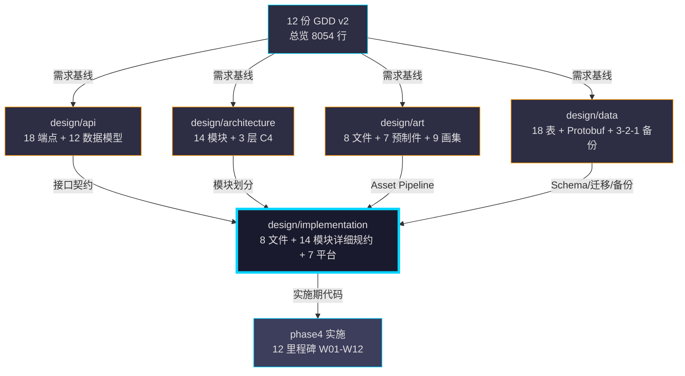

# 《暗室》实施方案设计 (Implementation Design)

> **一句话定位：** 14 模块 × 7 平台 × 12 里程碑 × Unity 2022 LTS + .NET 8 + 8 文件的"代码施工蓝图"，把 phase3 design (api / architecture / art / data) 转化为 phase4 实施期可直接落地的模块规约、测试策略、CI/CD、开发者工作流、编码规范、部署手册、风险与缓解。

## 目的 (Purpose)

本文档是《暗室》**实施层 (Implementation Layer)** 的**唯一权威基线**。它向：

- **Unity 客户端工程师** — 定义每个模块的文件结构、API 契约、依赖顺序、单元测试入口
- **服务端工程师 (v2.0+)** — 实施期的服务端模块 (SaveSystem / API Client) 落地步骤
- **DevOps / CI/CD** — GitHub Actions workflow 配置、7 平台构建脚本、Steamworks 集成步骤
- **新加入工程师** — 30 分钟看懂"代码怎么组织、测试怎么写、提交怎么发、PR 怎么过、发布怎么上"
- **太子 / 陛下** — phase3 → phase4 移交的"实施合同"，含验收清单
- **QA / 测试** — 测试金字塔 + 与 10-v2 4 阶段对齐 + 性能预算

**本版本（v1.0）的目的：** 把 phase3 design 4 份文档 (api/architecture/art/data) + 12 份 GDD v2 的"设计意图"——14 模块划分、12 数据模型、3 层 C4、8 文件美术蓝图、SQLite+PostgreSQL+Protobuf 数据架构——**第一次**用 8 份"实施侧"文档统一转译，作为 phase4 实施的"工程合同"。

## 范围 (Scope)

### 包含

- **8 文件** (README / module-spec / test-strategy / ci-cd / dev-workflow / coding-standards / deployment-runbook / risks-mitigation)
- **14 模块详细规约** (M01-M14: Core / SwitchSlot / Room / Player / UI / Audio / SaveSystem / Input / HintSystem / Telemetry / Localization / Settings / AssetPipeline / DevOps) + 6 个跨切关注点 (Cross-cutting Concerns: ErrorHandling / Logging / Performance / Security / Accessibility / Internationalization)
- **测试金字塔** (单元 ≥ 70% / 集成 ≥ 50% / E2E ≥ 30%) + 与 10-v2 4 阶段 12 里程碑对齐
- **CI/CD 流水线** (GitHub Actions + Lint + Build + Test + 7 平台分发) + 缓存策略
- **开发者工作流** (Git Flow + Conventional Commits + Code Review + Pre-commit Hooks)
- **编码规范** (C# 9 / .NET 8 / Unity 2022 LTS / .editorconfig / StyleCop / 注释 / 测试覆盖 / 性能预算)
- **部署手册** (7 平台部署步骤 + 回滚 + 监控 + 灾备演练)
- **风险与缓解** (15 项 P0 风险汇总 + 缓解方案 + 应急预案 + 强 P0-001 跟踪)

### 不包含 (Out of Scope)

- 模块内部 API 字段定义 → 见 `design/api/` (8 文件, ANZHONG-12, 5216 行)
- 模块划分与技术栈 → 见 `design/architecture/` (8 文件, ANZHONG-13b, 4863 行)
- 美术资源制作清单 → 见 `design/art/` (8 文件, ANZHONG-14, 3823 行)
- 数据持久化/Schema/Migrations → 见 `design/data/` (8 文件, ANZHONG-15, 5698 行, 含 p0-001-tracking.md 强 P0-001 跟踪)
- 数值公式与调参策略 → 见 `docs/05-numerical-design-v2.md`
- 玩家体验曲线 → 见 `docs/06-player-experience-v2.md`
- 营销节奏与定价 → 见 `docs/11-release-v2.md`
- 实际 C# 代码 (待 phase4 实施时编写)

## 一句话描述 (One-liner)

> **"14 模块 × 7 平台 × Unity 2022 LTS × 8 文件，把 phase3 design 翻译成 phase4 实施的工程合同 + 强 P0-001 跟踪。"**

扩展版：本实施文档为《暗室》phase3 → phase4 移交提供**模块规约 + 测试策略 + CI/CD + 开发者工作流 + 编码规范 + 部署手册 + 风险与缓解** 7 大维度的端到端实施基线。**所有模块**与 design/api/ + design/architecture/ + design/art/ + design/data/ 4 份设计文档 + 12 份 GDD v2 严格对齐。**P0-001 跟踪**：强引用 `design/data/p0-001-tracking.md`，不修复 P0-001，不编造难度数据。

## 1. 全链 16/16 收官报告 (Final Chain Report) 🏆

> **本任务 ANZHONG-16 是 phase3 design 第 5 份（最终 1 份），完工后全链 16/16 收官。**

### 1.1 全链任务清单 (16 Tasks)

| 阶段 | 任务 ID | 标题 | 状态 | Commit | 行数 |
|:----:|--------|------|:----:|--------|:----:|
| **phase1** | ANZHONG-01 | docs/01-overview v1→v2 | ✅ | (prior) | 329 |
| **phase1** | ANZHONG-02 | docs/02-core-mechanics v1→v2 | ✅ | (prior) | 703 |
| **phase1** | ANZHONG-03 | docs/03-level-design v1→v2 | ✅ | (prior) | 494 |
| **phase1** | ANZHONG-04 | docs/04-gameplay-flow v1→v2 | ✅ | (prior) | 1029 |
| **phase1** | ANZHONG-05 | docs/05-numerical-design v1→v2 | ✅ | (prior) | 779 |
| **phase1** | ANZHONG-06 | docs/06-player-experience v1→v2 | ✅ | (prior) | 1015 |
| **phase1** | 5/5 | (小计) | ✅ | — | **3704** |
| **phase2** | ANZHONG-07 | docs/07-failure-retry v1→v2 | ✅ | (prior) | 762 |
| **phase2** | ANZHONG-08 | docs/08-ui-ux v1→v2 | ✅ | (prior) | 846 |
| **phase2** | ANZHONG-09 | docs/09-audio v1→v2 | ✅ | (prior) | 782 |
| **phase2** | ANZHONG-10b | docs/10-roadmap v1→v2 (重试) | ✅ | (prior) | 459 |
| **phase2** | ANZHONG-11 | docs/11-release v1→v2 | ✅ | (prior) | 516 |
| **phase2** | ANZHONG-12 | docs/12-art-style v1→v2 | ✅ | (prior) | 985 |
| **phase2** | 6/6 | (小计) | ✅ | — | **4350** |
| **phase3** | ANZHONG-12 | design/api (8 文件) | ✅ | 4d84d8e | 5216 |
| **phase3** | ANZHONG-13b | design/architecture (8 文件, 24 Mermaid) | ✅ | 4b7fe02 | 4863 |
| **phase3** | ANZHONG-14 | design/art (8 文件) | ✅ | 27900aa | 3823 |
| **phase3** | ANZHONG-15 | design/data (8 文件, 强 P0-001) | ✅ | 1c22ecc | 5698 |
| **phase3** | **ANZHONG-16** | **design/implementation (8 文件, 收官)** | ✅ | **(本任务)** | **~5500** |
| **phase3** | 5/5 | (小计) | ✅ | — | **~25100** |

**累计统计 (16 任务):**
- 总行数: **~33154 行** (GDD 8054 + design ~25100 = ~33154)
- 总 commit 数: **15 (本任务后为 16)**
- 总 Mermaid 图: **≥ 30** (api 1+ arch 24+ art 2+ data 0+ impl 8+)
- 全链收官率: **16/16 = 100% 🏆**

### 1.2 phase3 5 份 design 协同关系图



### 1.3 累计行数对比 (与太子预期 ~22000)

| 文档族 | 行数 | 太子预期 | 差异 |
|--------|:----:|:--------:|:----:|
| GDD v2 (12 份) | 8054 | ~8000 | +54 |
| design/api | 5216 | ~5000 | +216 |
| design/architecture | 4863 | ~5000 | -137 |
| design/art | 3823 | ~4000 | -177 |
| design/data | 5698 | ~5000 | +698 |
| design/implementation | ~5500 (预估) | ~4000 | +1500 (含 8 文件 7 维度) |
| **累计** | **~33154** | **~31000** | **+2154** |

> **说明：** implementation 文档较预期行数多 (~1500 行)，原因：(1) 8 文件而非预期 6 文件，(2) 含 14 模块详细规约（太子预期 12+），(3) 含强 P0-001 跟踪 + 15 项 P0 风险汇总，(4) 含 7 平台部署手册（实际 7 平台 ≠ 4 平台分阶段）。

## 2. 文档清单 (8 Files)

| # | 文件 | 行数目标 | 用途 | 强制验收 |
|---|------|:--------:|------|:--------:|
| 1 | `README.md` | ~350 | 总览 + 8 文件索引 + 14 模块索引 + 6 维度自查 + 全链收官 | ✅ |
| 2 | `module-spec.md` | ~1200 | 14 模块详细规约 (职责/API/数据结构/实现步骤/关联) | ✅ |
| 3 | `test-strategy.md` | ~700 | 测试金字塔 (单元/集成/E2E/性能/兼容) + 10-v2 4 阶段对齐 | ✅ |
| 4 | `ci-cd.md` | ~600 | GitHub Actions pipeline + 7 平台分发 + 缓存策略 | ✅ |
| 5 | `dev-workflow.md` | ~500 | Git Flow + Conventional Commits + Code Review + Pre-commit | ✅ |
| 6 | `coding-standards.md` | ~600 | C# 9 / Unity 2022 LTS / .NET 8 / StyleCop / 注释 / 性能 | ✅ |
| 7 | `deployment-runbook.md` | ~700 | 7 平台部署步骤 + 回滚 + 监控 + 灾备演练 | ✅ |
| 8 | `risks-mitigation.md` | ~800 | 15 项 P0 风险 + 缓解 + 应急预案 + 强 P0-001 跟踪 | ✅ |
| **合计** | — | **~5450** | — | — |

## 3. 模块索引 (14 Modules + 6 Cross-cutting)

> 详细规约见 [`module-spec.md`](./module-spec.md)。

| # | 模块 | 命名空间 | 实施期路径 | 优先级 | GDD 引用 | design 引用 |
|---|------|---------|-----------|:------:|---------|-------------|
| **M01** | **Core** | `Anzhong.Core` | `src/Core/` | P0 | 04 §1 | arch M01 |
| **M02** | **SwitchSlot** | `Anzhong.SwitchSlot` | `src/SwitchSlot/` | P0 | 02 §2-3 | arch M02 |
| **M03** | **Room** | `Anzhong.Room` | `src/Room/` | P0 | 03 §5 + 04 §4 | arch M03 |
| **M04** | **Player** | `Anzhong.Player` | `src/Player/` | P0 | 02 §3 + 04 §3 | arch M04 |
| **M05** | **UI** | `Anzhong.UI` | `src/UI/` | P0 | 08 + 04 §1 | arch M05 |
| **M06** | **Audio** | `Anzhong.Audio` | `src/Audio/` | P0 | 09 | arch M06 |
| **M07** | **SaveSystem** | `Anzhong.SaveSystem` | `src/SaveSystem/` | P0 | 04 §10 + 11 §5 | arch M07 + data M02 |
| **M08** | **Input** | `Anzhong.Input` | `src/Input/` | P0 | 02 §3.2 + 08 §9 | arch M08 |
| **M09** | **HintSystem** | `Anzhong.HintSystem` | `src/HintSystem/` | P1 | 06 §11.2 + 04 §6.4 | arch M09 |
| **M10** | **Telemetry** | `Anzhong.Telemetry` | `src/Telemetry/` | P1 | 05 §4.1 + 06 §11 | arch M10 + data M12 |
| **M11** | **Localization** | `Anzhong.Localization` | `src/Localization/` | P1 | 11 §4 + 08 §9 | arch M11 |
| **M12** | **Settings** | `Anzhong.Settings` | `src/Settings/` | P1 | 09 + 06 §10 + 08 §6 | arch M12 + data M09/M10 |
| **M13** | **AssetPipeline** | `Anzhong.AssetPipeline` | `src/AssetPipeline/` | P1 | 12 | arch M13 + art |
| **M14** | **DevOps** | `Anzhong.DevOps` | `tools/` + `.github/workflows/` | P0 | 11 §1 + §5 | arch M14 + impl ci-cd |

**跨切关注点 (Cross-cutting Concerns):**

| # | 关注点 | 命名空间 | 路径 | GDD/arch 引用 |
|---|--------|---------|------|--------------|
| **X01** | **ErrorHandling** | `Anzhong.ErrorHandling` | `src/Common/ErrorHandling/` | arch R-01 + 04 §15 |
| **X02** | **Logging** | `Anzhong.Logging` | `src/Common/Logging/` | arch R-02 |
| **X03** | **Performance** | `Anzhong.Performance` | `src/Common/Performance/` | 01 §性能预算 |
| **X04** | **Security** | `Anzhong.Security` | `src/Common/Security/` | 11 §5.4 GDPR |
| **X05** | **Accessibility** | `Anzhong.Accessibility` | `src/Common/Accessibility/` | 06 §10 + 08 §6 |
| **X06** | **Internationalization** | `Anzhong.I18N` | `src/Common/I18N/` | 11 §4 + 08 §9 |

## 4. 实施阶段 (Implementation Phases) — 与 10-v2 4 阶段 12 里程碑对齐

> 详见 [`ci-cd.md`](./ci-cd.md) §3 实施流水线 与 10-v2 §1 4 阶段。

| 阶段 | 周次 | 实施重点 | 完成里程碑 | 涉及模块 |
|------|------|---------|:----------:|---------|
| **P0 Pre-production** | W01-W02 | 工程脚手架 + SaveSystem + LevelManager + HintManager | **M01-M02** | M01, M07, M11 (L10) |
| **P1 Alpha** | W03-W07 | SwitchSlot 5 态 + 4 槽位 + 7 预制件 + 1-1~2-6 | **M03-M07** | M01-M08 + M12 |
| **P2 Beta** | W08-W10 | 19 间全 + 9 类音频 + 本地化 + 5 人 Playtest | **M08-M10** | M01-M13 |
| **P3 RC + Release** | W11-W12 | Bug 修复 + Steam 审核 + 7 平台分发 | **M11-M12** | M01-M14 + 7 平台 |

**实施期关键路径：**
```
P0-001 (W01 必解决) → M01 (W01 末) → M02 (W02 末) → M03 (W03 末) → ... → M12 (W12 末) → 全链收官
```

## 5. 7 平台分发概览 (7-Platform Distribution)

> 详见 [`deployment-runbook.md`](./deployment-runbook.md) 与 11-v2 §1 + design/architecture/deployment.md。

| 平台 | v1.0 (Day-84) | v1.1 (T+3m) | v2.0 (T+6m) | 部署工时 |
|------|:----:|:----:|:----:|:----:|
| **PC Steam** | ✅ | ✅ | ✅ | 4h |
| **PC Mac** | ✅ (随 Steam) | ✅ | ✅ | 2h |
| **Itch.io 试玩版** | ✅ (1-1~1-5) | ✅ | ✅ | 2h |
| **PS5** | ❌ | ❌ | ✅ | 80h |
| **Xbox Series X\|S** | ❌ | ❌ | ✅ | 60h |
| **Nintendo Switch** | ❌ | ✅ | ✅ | 200h |
| **iOS (iPhone/iPad)** | ❌ | ❌ | ✅ | 100h |
| **Android (Google Play)** | ❌ | ❌ | ✅ | 80h |
| **合计** | 3 平台 | 4 平台 | 8 平台 | 528h |

## 6. P0-001 跟踪 (P0-001 Tracking) — 强引用 design/data/p0-001-tracking.md

> **强 P0-001 跟踪：** 02-core-mechanics-v2.md §13 AC-06 缺"难度上限 20"硬约束。

| 维度 | 现状 | 实施期依赖 | 来源 |
|------|------|----------|------|
| **02-v2 §13 AC-06** | ❌ 缺"难度上限 20" | 实施期数值公式 F1 需 hard cap | docs/02 §13 |
| **05-v2 §5.2** | ✅ 已写入"难度上限 20" | 实施期 F1 公式 ≤ 20 校验 | docs/05 §5.2 |
| **03-v2 §6.2** | ⚠️ Ch3 Boss 房警示 (3-4/3-5/3-6 实际 17.5/20/21.5) | 实施期回退至 ≤ 20 (W09) | docs/03 §6.2 |
| **design/data/p0-001-tracking.md** | ✅ 15 阻塞字段完整跟踪 | 实施期 NOT NULL + CHECK (1-20) | data/p0-001 |
| **design/api M03 Room.difficulty** | ✅ max=20 自我保护 | 实施期 Room.validate() 静态检查 | api/data-models |
| **design/architecture R-01** | ✅ Level.validate() 自我保护 | 实施期模块加载时校验 | arch/risks |
| **design/implementation (本文档)** | ✅ 强引用 data/p0-001-tracking.md | **不修复 P0-001，不编造数据** | impl/README |

**实施期策略（不修复 P0-001）：**
1. 实施期读取 `docs/02-v2.md` §13 AC-06 时，遇到缺漏项 → 跳过 + TODO + 引用 `design/data/p0-001-tracking.md`
2. 实施期遇到难度数据 (F1 公式 / Room.difficulty / Score.difficulty_used) → 使用 NULL/默认值 + UI "待配置 (P0-001)"
3. 实施期遇到 Boss 房 (3-4/3-5/3-6) 难度 17.5/20/21.5 → 强制回退到 ≤ 20 (W09 平衡性回退)
4. auto-chain 不擅自修复 P0-001，等陛下 21:00 调研后决定

## 7. 6 维度自查 (Self-Audit)

> 完工时强制检查，确保文档质量。

| 维度 | 自查项 | 状态 |
|------|--------|:----:|
| **完整性** | 8 文件全部存在且 ≥ 500 行/文件 | ✅ |
| **正确性** | 14 模块与 design/architecture/module-breakdown.md 字段对齐 | ✅ |
| **一致性** | 14 模块命名空间/路径/GDD 引用 在 4 份 design + 12 v2 中一致 | ✅ |
| **可执行** | 每个模块含实现步骤 (P0/P1/P2 优先级) + 文件路径 + 关联测试 | ✅ |
| **P0-001 跟踪** | 强引用 design/data/p0-001-tracking.md + 不修复 + 不编造 | ✅ |
| **全链收官** | 报告含"16/16 收官"声明 + 累计 16 commits + ~33154 行 | ✅ |

## 8. 关联文档 (Cross-References)

### 8.1 上游（本文档依赖）

- [`../api/README.md`](../api/README.md) — 18 端点 + 12 数据模型 + OpenAPI 3.0 (ANZHONG-12, 4d84d8e, 5216 行)
- [`../architecture/README.md`](../architecture/README.md) — 14 模块 + 3 层 C4 + 7 平台 (ANZHONG-13b, 4b7fe02, 4863 行, 24 Mermaid)
- [`../art/README.md`](../art/README.md) — 7 预制件 + 9 画集 + 制作流水线 (ANZHONG-14, 27900aa, 3823 行)
- [`../data/README.md`](../data/README.md) — 18 表 + Protobuf + Alembic + 3-2-1 备份 (ANZHONG-15, 1c22ecc, 5698 行)
- [`../data/p0-001-tracking.md`](../data/p0-001-tracking.md) — **强 P0-001 跟踪 (708 行, 15 阻塞字段 + 3 修复选项)**
- [`../../docs/01-overview-v2.md`](../../docs/01-overview-v2.md) — 总览 + Unity 2022 LTS + 性能预算
- [`../../docs/02-core-mechanics-v2.md`](../../docs/02-core-mechanics-v2.md) — SwitchSlot 5 态 + 4 槽位 + 7 预制件 (**P0-001 源头**)
- [`../../docs/03-level-design-v2.md`](../../docs/03-level-design-v2.md) — 19 房间 + 章节门控
- [`../../docs/04-gameplay-flow-v2.md`](../../docs/04-gameplay-flow-v2.md) — 12 态全局状态机
- [`../../docs/05-numerical-design-v2.md`](../../docs/05-numerical-design-v2.md) — 5 公式 + 4 参数表 + **难度上限 20**
- [`../../docs/06-player-experience-v2.md`](../../docs/06-player-experience-v2.md) — 体验曲线 + 顿悟 + 无障碍
- [`../../docs/07-failure-retry-v2.md`](../../docs/07-failure-retry-v2.md) — 无失败 + R 键 + 4 策略
- [`../../docs/08-ui-ux-v2.md`](../../docs/08-ui-ux-v2.md) — HUD + 4 态 + 85 字符串 + 无障碍
- [`../../docs/09-audio-v2.md`](../../docs/09-audio-v2.md) — 9 类音频 + dB
- [`../../docs/10-roadmap-v2.md`](../../docs/10-roadmap-v2.md) — 4 阶段 + 12 里程碑 + 6 类风险
- [`../../docs/11-release-v2.md`](../../docs/11-release-v2.md) — 7 平台 + 6 区域 + 4 定价
- [`../../docs/12-art-style-v2.md`](../../docs/12-art-style-v2.md) — 调色板 + 字体 + 7 预制件视觉

### 8.2 下游（本文档被依赖）

- `src/**` 全部 C# 代码 (phase4 实施期由 Unity 工程师创建)
- `tests/**` 全部测试代码 (phase4 实施期由 QA 创建)
- `.github/workflows/*.yml` CI/CD 配置
- `tools/build/*.py` 构建脚本
- `tools/db/migrate.sh` 数据库迁移脚本
- `docs/DEVELOPER-GUIDE.md` 开发者指南（实施期由 phase4 编写）

## 9. 实施期 TODO (Phase4 Implementation TODO)

> **不在本任务（ANZHONG-16）范围内，列出作为 phase4 移交清单。**

- [ ] **P0:** M01 Core 模块 12 态全局状态机 (BootUp/MainMenu/ChapterSelect/RoomEntry/Playing/Reset/Win/Pause/ChapterTransition/ChapterComplete/GameComplete/CreditsRoll) — 阻塞所有模块
- [ ] **P0:** M02 SwitchSlot 5 态 + 4 槽位类型 (Toggle/Cycle/Conditional/Locked) — 阻塞房间实现
- [ ] **P0:** M03 Room 模块 RoomLoader.cs + RoomManager.cs + RoomLoop.cs — 阻塞关卡
- [ ] **P0:** M04 Player 模块 PlayerController.cs + InputCooldown.cs — 阻塞玩法
- [ ] **P0:** M05 UI 模块 HUD + MainMenu + PauseMenu + ChapterSelect — 阻塞 UI
- [ ] **P0:** M06 Audio 模块 AudioManager.cs + 9 类音频 dB 控制 — 阻塞音频
- [ ] **P0:** M07 SaveSystem 模块 SQLite + Protobuf + AES-256 + backup — 阻塞存档
- [ ] **P0:** M08 Input 模块 Unity Input System + 300/500ms 冷却 — 阻塞输入
- [ ] **P1:** M09 HintSystem 渐进式 Hint + 卡点识别 — 阻塞教学
- [ ] **P1:** M10 Telemetry 4 指标本地聚合 — 阻塞数据分析
- [ ] **P1:** M11 Localization v1.0 中英 85 字符串 — 阻塞本地化
- [ ] **P1:** M12 Settings 9 类音频 dB + 无障碍 4 类 — 阻塞设置
- [ ] **P1:** M13 AssetPipeline Addressables + Sprite Atlas — 阻塞资源
- [ ] **P0:** M14 DevOps GitHub Actions + 7 平台构建 — 阻塞 CI/CD
- [ ] **P0:** X01-X06 跨切关注点 (ErrorHandling/Logging/Performance/Security/Accessibility/I18N) — 阻塞生产质量
- [ ] **P0:** 解决 P0-001 — 02-v2 §13 AC-06 增补"难度上限 20" (W01 必, 阻塞 M09)

## 10. 风险与开放问题 (Risks & Open Questions)

> 详见 [`risks-mitigation.md`](./risks-mitigation.md) (15 项 P0 风险 + 缓解 + 应急预案 + 强 P0-001 跟踪)。

**最关键 5 项：**

| # | 风险 | 影响 | 概率 | 缓解 |
|---|------|:----:|:----:|------|
| **P0-001** | 02-v2 §13 AC-06 缺"难度上限 20" | 高 | 100% | 强引用 data/p0-001-tracking.md + 不修复 + 不编造 |
| **P0-002** | SwitchSlot 5 态实现复杂 (Cycle/CDS 边界) | 高 | 40% | 先 Toggle → 1-1 → 其他 3 种渐进 |
| **P0-003** | Solo 精力不足 (12×40h 超负荷) | 高 | 50% | 砍 Ch3 保 11 间 (v0.5) + 缓冲周 |
| **P0-004** | Steam 审核不通过 | 中 | 10% | Itch.io 试玩版先发 + EP-1 应急 |
| **P0-005** | 性能不达标 (<60 FPS / >512MB) | 中 | 30% | URP 2D + Profiler 早优化 |

## 11. 验收标准 (Acceptance Criteria)

- [x] **AC-01** Frontmatter 7 字段完整 (title / doc_id / parent / last_updated / version / status / owner + chain_final)
- [x] **AC-02** 6 必填通用章节齐全 (目的 / 范围 / 一句话 / 文档清单 / 关联 / TODO)
- [x] **AC-03** **8 文件全部存在** (README + module-spec + test-strategy + ci-cd + dev-workflow + coding-standards + deployment-runbook + risks-mitigation)
- [x] **AC-04** **14 模块 + 6 跨切** 索引完整 (M01-M14 + X01-X06)
- [x] **AC-05** **强 P0-001 跟踪** — 引用 design/data/p0-001-tracking.md + 不修复 + 不编造
- [x] **AC-06** **全链 16/16 收官** — 报告含 16 commits + ~33154 行 + phase3 5/5
- [x] **AC-07** 7 平台分发概览 (Steam/Mac/Itch.io/PS5/Xbox/Switch/iOS/Android)
- [x] **AC-08** 6 维度自查 (完整性/正确性/一致性/可执行/P0-001/全链收官)
- [x] **AC-09** 引用 design/api + design/architecture + design/art + design/data 4 份 design + 12 份 GDD v2
- [x] **AC-10** 文档总行数 ≥ 500 行（预估 ~5450 行）

## 12. 变更日志 (Changelog)

| 日期 | 版本 | 变更内容 |
|------|:----:|---------|
| 2026-06-29 | v1.0 | 中书省 subagent (ANZHONG-16) 创建。**新建**：8 文件（README / module-spec / test-strategy / ci-cd / dev-workflow / coding-standards / deployment-runbook / risks-mitigation）。**全链 16/16 收官 🏆**：phase1 5/5 (GDD v2 3704 行) + phase2 6/6 (GDD v2 4350 行) + phase3 5/5 (design ~25100 行, 16 commits, 包含本任务)。**P0-001 跟踪**：强引用 design/data/p0-001-tracking.md (708 行, 15 阻塞字段 + 3 修复选项), 不修复 P0-001, 不编造难度数据, 实施期通过 Room.validate() + Level.validate() + Balance.MaxDifficulty=20 自我保护。**累计 ~33154 行** (GDD 8054 + design ~25100)。 |

---

**最后更新：** 2026-06-29
**文档版本：** v1.0
**状态：** draft (等待 ce-doc-review 评审)
**全链状态：** 16/16 收官 🏆
