# 《暗室》CI/CD 流水线 (CI/CD Pipeline)

> **一句话定位：** GitHub Actions + 7 平台分发 + Unity Build Pipeline + Docker 缓存 + Codecov 覆盖率，端到端自动化流水线，PR → M01-M12 → Steam 1.0 全流程。

## 目的 (Purpose)

本文档是《暗室》**CI/CD 层**的**唯一权威基线**。它向：

- **DevOps 工程师** — 定义 GitHub Actions workflow + 缓存策略 + Secrets 管理
- **Unity 工程师** — 定义 Unity Build Pipeline + Addressables + Steamworks 集成
- **QA / 测试** — 定义自动化测试触发条件（PR / main / release）
- **发行 / 运营** — 定义 7 平台分发步骤 + Steamworks SDK 集成
- **Code Review** — 定义 PR 流水线必经的 5 个 job

**本版本（v1.0）的目的：** 把"无战斗 2D 房间解谜游戏"的端到端 CI/CD 流水线——GitHub Actions + Unity 2022 LTS Build + Lint + Test + 7 平台分发（v1.0: 3 平台 Steam+Mac+Itch.io）+ Steamworks 集成 + Docker 缓存 + Codecov——**第一次**用"workflow 设计 + cache 策略 + secrets 管理 + 7 平台分发 + 灾备" 5 维度统一描述，作为 phase4 实施的"DevOps 合同"。

## 范围 (Scope)

### 包含

- **4 个核心 workflow**：ci.yml / doc-review.yml / game-test.yml / release.yml
- **GitHub Actions 5 job**：Lint / Unit Test / Integration Test / Build / Deploy
- **Unity Build Pipeline**：3 平台 v1.0 / 7 平台 v2.0
- **缓存策略**：Unity Library + NuGet + node_modules
- **Secrets 管理**：Steam API Key + Itch.io API Key + IARC Token
- **Docker 镜像**：unityci/editor:2022.3.x
- **灾备与回滚**：workflow 失败 → 自动通知 + 手动回滚

### 不包含 (Out of Scope)

- 7 平台部署手册 → 见 [`deployment-runbook.md`](./deployment-runbook.md)
- 测试用例 → 见 [`test-strategy.md`](./test-strategy.md)
- 监控告警 → 见 [`deployment-runbook.md`](./deployment-runbook.md) §4

## 一句话描述 (One-liner)

> **"GitHub Actions × 5 job × 7 平台 × Docker 缓存 × Unity Build Pipeline，PR → Steam 1.0 全自动。"**

## 1. CI/CD 流水线总览 (Pipeline Overview)

```mermaid
graph LR
    A[PR Push] --> B[Lint Job]
    B --> C[Unit Test Job]
    C --> D[Integration Test Job]
    D --> E[Build Job]
    E --> F{All Pass?}

    G[main Push] --> H[Full Pipeline]
    H --> I[Build All Platforms]
    I --> J[Deploy to Steam]
    I --> K[Deploy to Itch.io]

    L[Release Tag] --> M[Release Pipeline]
    M --> N[Build 7 Platforms]
    M --> O[IARC Submit]
    M --> P[Steam Release]

    F -->|Yes| Q[Codecov Comment]
    F -->|No| R[Slack Alert + Auto Rollback]

    style A fill:#2D2D44,stroke:#00D4FF
    style G fill:#2D2D44,stroke:#00D4FF
    style L fill:#2D2D44,stroke:#FF9500
    style F fill:#1A1A2E,stroke:#00D4FF
    style R fill:#1A1A2E,stroke:#FF0000
```



**5 阶段流水线：**

| 阶段 | 触发 | 目的 | 失败处理 |
|------|------|------|---------|
| **PR 流水线** | PR push | 快速验证（≤ 10 min） | 阻止 merge |
| **main 流水线** | main push | 完整验证 + 内部部署 | Slack 通知 |
| **Release 流水线** | git tag `v*` | 全平台构建 + 分发 | 手动回滚 |
| **Hotfix 流水线** | hotfix 分支 | 紧急修复 | 立即发布 |
| **定时流水线** | 每日 02:00 | 依赖更新 + 安全扫描 | 周报汇总 |

## 2. GitHub Actions Workflows

### 2.1 ci.yml (主 CI 流水线)

```yaml
# .github/workflows/ci.yml
name: CI

on:
  push:
    branches: [main, develop, feature/**]
    tags: ['v*']
  pull_request:
    branches: [main, develop]

env:
  UNITY_VERSION: 2022.3.20f1
  UNITY_LICENSE: ${{ secrets.UNITY_LICENSE }}

jobs:
  # ========================================
  # Job 1: Lint (StyleCop + Markdown + YAML)
  # ========================================
  lint:
    name: Lint (StyleCop + Markdown + YAML)
    runs-on: ubuntu-latest
    timeout-minutes: 10
    steps:
      - name: Checkout
        uses: actions/checkout@v4

      - name: Cache NuGet
        uses: actions/cache@v3
        with:
          path: ~/.nuget/packages
          key: ${{ runner.os }}-nuget-${{ hashFiles('**/*.csproj') }}
          restore-keys: |
            ${{ runner.os }}-nuget-

      - name: Cache node_modules
        uses: actions/cache@v3
        with:
          path: ~/.npm
          key: ${{ runner.os }}-npm-${{ hashFiles('**/package-lock.json') }}
          restore-keys: |
            ${{ runner.os }}-npm-

      - name: Markdown Lint
        run: |
          npm ci
          npx markdownlint '**/*.md' --ignore node_modules

      - name: YAML Lint
        run: npx yamllint .github/workflows/

      - name: StyleCop (C# Lint)
        run: python tools/ci/lint_csharp.py

      - name: Pre-commit Hooks
        run: |
          pip install pre-commit
          pre-commit run --all-files

  # ========================================
  # Job 2: Unit Test (EditMode)
  # ========================================
  unit-test:
    name: Unit Test (EditMode) + Coverage
    runs-on: ubuntu-latest
    timeout-minutes: 30
    needs: lint
    container:
      image: unityci/editor:ubuntu-2022.3.20f1-android-3.1.0
      options: --privileged
    steps:
      - name: Checkout
        uses: actions/checkout@v4
        with:
          lfs: true

      - name: Cache Library
        uses: actions/cache@v3
        with:
          path: Library
          key: Library-${{ env.UNITY_VERSION }}-${{ hashFiles('Assets/**', 'Packages/**', 'ProjectSettings/**') }}
          restore-keys: |
            Library-${{ env.UNITY_VERSION }}-

      - name: Run Unit Tests (EditMode)
        uses: game-ci/unity-test-runner@v3
        id: testRunner
        env:
          UNITY_LICENSE: ${{ secrets.UNITY_LICENSE }}
        with:
          testMode: editmode
          artifactsPath: test-results
          githubToken: ${{ secrets.GITHUB_TOKEN }}
          customParameters: -runTests -testPlatform EditMode -testResults test-results/results.xml

      - name: Upload Test Results
        uses: actions/upload-artifact@v4
        if: always()
        with:
          name: Unit Test Results
          path: test-results/

      - name: Coverage Report
        if: steps.testRunner.outputs.testResults != ''
        run: python tools/ci/coverage.py

      - name: Codecov Upload
        if: steps.testRunner.outputs.testResults != ''
        uses: codecov/codecov-action@v3
        with:
          file: coverage/coverage.xml
          flags: unittests
          fail_ci_if_error: false
          verbose: true

  # ========================================
  # Job 3: Integration Test (PlayMode)
  # ========================================
  integration-test:
    name: Integration Test (PlayMode)
    runs-on: ubuntu-latest
    timeout-minutes: 60
    needs: unit-test
    container:
      image: unityci/editor:ubuntu-2022.3.20f1-android-3.1.0
      options: --privileged
    steps:
      - name: Checkout
        uses: actions/checkout@v4
        with:
          lfs: true

      - name: Cache Library
        uses: actions/cache@v3
        with:
          path: Library
          key: Library-${{ env.UNITY_VERSION }}-${{ hashFiles('Assets/**', 'Packages/**', 'ProjectSettings/**') }}
          restore-keys: |
            Library-${{ env.UNITY_VERSION }}-

      - name: Run Integration Tests (PlayMode)
        uses: game-ci/unity-test-runner@v3
        env:
          UNITY_LICENSE: ${{ secrets.UNITY_LICENSE }}
        with:
          testMode: playmode
          artifactsPath: test-results
          githubToken: ${{ secrets.GITHUB_TOKEN }}

      - name: Upload Test Results
        uses: actions/upload-artifact@v4
        if: always()
        with:
          name: Integration Test Results
          path: test-results/

  # ========================================
  # Job 4: Build (StandaloneWindows64)
  # ========================================
  build:
    name: Build (StandaloneWindows64)
    runs-on: ubuntu-latest
    timeout-minutes: 60
    needs: integration-test
    if: github.event_name == 'push' && (github.ref == 'refs/heads/main' || startsWith(github.ref, 'refs/tags/'))
    container:
      image: unityci/editor:ubuntu-2022.3.20f1-android-3.1.0
      options: --privileged
    steps:
      - name: Checkout
        uses: actions/checkout@v4
        with:
          lfs: true

      - name: Cache Library
        uses: actions/cache@v3
        with:
          path: Library
          key: Library-${{ env.UNITY_VERSION }}-${{ hashFiles('Assets/**', 'Packages/**', 'ProjectSettings/**') }}
          restore-keys: |
            Library-${{ env.UNITY_VERSION }}-

      - name: Build StandaloneWindows64
        uses: game-ci/unity-builder@v3
        env:
          UNITY_LICENSE: ${{ secrets.UNITY_LICENSE }}
        with:
          targetPlatform: StandaloneWindows64
          buildName: Anzhong
          buildPath: build/Windows

      - name: Upload Build Artifact
        uses: actions/upload-artifact@v4
        with:
          name: Build-Windows
          path: build/Windows/
          retention-days: 30

  # ========================================
  # Job 5: PR Comment (Codecov)
  # ========================================
  pr-comment:
    name: PR Comment
    runs-on: ubuntu-latest
    needs: [unit-test, integration-test, build]
    if: github.event_name == 'pull_request'
    steps:
      - name: Codecov Comment
        uses: codecov/codecov-action@v3
        with:
          file: coverage/coverage.xml
          flags: unittests
```

### 2.2 doc-review.yml (文档评审)

```yaml
# .github/workflows/doc-review.yml
name: Doc Review

on:
  pull_request:
    branches: [main, develop]
    paths: ['docs/**', 'design/**', 'README.md']

jobs:
  doc-review:
    name: ce-doc-review
    runs-on: ubuntu-latest
    timeout-minutes: 10
    steps:
      - name: Checkout
        uses: actions/checkout@v4

      - name: Markdown Lint
        run: npx markdownlint 'docs/**/*.md' 'design/**/*.md'

      - name: Spell Check
        run: npx cspell 'docs/**/*.md' 'design/**/*.md'

      - name: Link Check
        run: python tools/ci/check_links.py

      - name: ce-doc-review (headless)
        run: |
          # 调用 ce-doc-review 工具
          if command -v ce-doc-review &> /dev/null; then
            ce-doc-review --paths docs/ design/ --format json > doc-review.json
          else
            echo "ce-doc-review not installed, skipping"
          fi

      - name: Upload Doc Review
        uses: actions/upload-artifact@v4
        with:
          name: Doc Review Report
          path: doc-review.json
```

### 2.3 game-test.yml (游戏测试)

```yaml
# .github/workflows/game-test.yml
name: Game Test

on:
  workflow_dispatch:
  schedule:
    - cron: '0 2 * * *'  # 每日 02:00

jobs:
  game-test:
    name: Game Smoke Test
    runs-on: ubuntu-latest
    timeout-minutes: 120
    container:
      image: unityci/editor:ubuntu-2022.3.20f1-android-3.1.0
    steps:
      - name: Checkout
        uses: actions/checkout@v4
        with:
          lfs: true

      - name: Build StandaloneLinux64
        uses: game-ci/unity-builder@v3
        env:
          UNITY_LICENSE: ${{ secrets.UNITY_LICENSE }}
        with:
          targetPlatform: StandaloneLinux64
          buildName: Anzhong-Test

      - name: Run Game Smoke Test
        run: |
          xvfb-run -a ./build/Linux/Anzhong-Test.x86_64 \
            -batchmode -nographics -testScript tests/E2E/smoke.cs

      - name: Capture Screenshots
        run: |
          python tools/ci/capture_screenshots.py \
            --binary ./build/Linux/Anzhong-Test.x86_64 \
            --output ./screenshots/

      - name: Upload Screenshots
        uses: actions/upload-artifact@v4
        with:
          name: Game Screenshots
          path: screenshots/
```

### 2.4 release.yml (发布流水线)

```yaml
# .github/workflows/release.yml
name: Release

on:
  push:
    tags: ['v*']

jobs:
  # ========================================
  # Build 7 Platforms (v2.0) / 3 Platforms (v1.0)
  # ========================================
  build-all:
    name: Build All Platforms
    runs-on: ubuntu-latest
    strategy:
      fail-fast: false
      matrix:
        target:
          - StandaloneWindows64      # Steam PC
          - StandaloneOSX            # Mac (随 Steam)
          - StandaloneLinux64        # Itch.io Linux
    steps:
      - name: Checkout
        uses: actions/checkout@v4
        with:
          lfs: true

      - name: Cache Library
        uses: actions/cache@v3
        with:
          path: Library
          key: Library-${{ env.UNITY_VERSION }}-${{ matrix.target }}-${{ github.sha }}

      - name: Build
        uses: game-ci/unity-builder@v3
        env:
          UNITY_LICENSE: ${{ secrets.UNITY_LICENSE }}
        with:
          targetPlatform: ${{ matrix.target }}
          buildName: Anzhong

      - name: Upload Build
        uses: actions/upload-artifact@v4
        with:
          name: Build-${{ matrix.target }}
          path: build/${{ matrix.target }}/

  # ========================================
  # Deploy to Steam
  # ========================================
  deploy-steam:
    name: Deploy to Steam
    runs-on: ubuntu-latest
    needs: build-all
    steps:
      - name: Download Windows Build
        uses: actions/download-artifact@v4
        with:
          name: Build-StandaloneWindows64
          path: ./build/Windows/

      - name: Deploy to Steam
        env:
          STEAM_USERNAME: ${{ secrets.STEAM_USERNAME }}
          STEAM_CONFIG: ${{ secrets.STEAM_CONFIG }}
        run: |
          python tools/distribute/steam_upload.py \
            --build-path ./build/Windows/ \
            --app-id ${{ secrets.STEAM_APP_ID }} \
            --branch ${{ github.ref_name }} \
            --description "Anzhong ${{ github.ref_name }}"

  # ========================================
  # Deploy to Itch.io
  # ========================================
  deploy-itch:
    name: Deploy to Itch.io
    runs-on: ubuntu-latest
    needs: build-all
    steps:
      - name: Download Linux Build
        uses: actions/download-artifact@v4
        with:
          name: Build-StandaloneLinux64
          path: ./build/Linux/

      - name: Deploy to Itch.io
        env:
          ITCH_BUTLER_API_KEY: ${{ secrets.ITCH_BUTLER_API_KEY }}
        run: |
          butler push ./build/Linux/ yzj/anzhong:linux \
            --userversion ${{ github.ref_name }}

  # ========================================
  # IARC Submit (5 区域评级)
  # ========================================
  iarc-submit:
    name: IARC Submit
    runs-on: ubuntu-latest
    needs: build-all
    steps:
      - name: Submit IARC
        env:
          IARC_TOKEN: ${{ secrets.IARC_TOKEN }}
        run: |
          python tools/distribute/iarc_submit.py \
            --token $IARC_TOKEN \
            --app-name Anzhong \
            --rating-questionnaire ./data/iarc/questionnaire.json

  # ========================================
  # Create GitHub Release
  # ========================================
  github-release:
    name: Create GitHub Release
    runs-on: ubuntu-latest
    needs: [deploy-steam, deploy-itch, iarc-submit]
    permissions:
      contents: write
    steps:
      - name: Create Release
        uses: softprops/action-gh-release@v1
        with:
          name: Anzhong ${{ github.ref_name }}
          body: |
            ## Anzhong ${{ github.ref_name }}

            See [CHANGELOG](../../releases) for details.

            ## Downloads
            - [Steam (Windows/Mac/Linux)](https://store.steampowered.com/app/${{ secrets.STEAM_APP_ID }})
            - [Itch.io](https://yzj.itch.io/anzhong)
          draft: false
          prerelease: ${{ contains(github.ref_name, '-rc') }}
```

## 3. 缓存策略 (Cache Strategy)

### 3.1 Unity Library 缓存

- **路径：** `Library/`
- **Key：** `Library-{UNITY_VERSION}-{hash(Assets + Packages + ProjectSettings)}`
- **Restore-keys：** `Library-{UNITY_VERSION}-`
- **节省时间：** 冷启动 15min → 热启动 3min（节省 80%）

### 3.2 NuGet 缓存

- **路径：** `~/.nuget/packages`
- **Key：** `{OS}-nuget-{hash(*.csproj)}`

### 3.3 npm 缓存

- **路径：** `~/.npm`
- **Key：** `{OS}-npm-{hash(package-lock.json)}`

### 3.4 Unity Asset Bundle 缓存

- **路径：** `Library/com.unity.addressables/aa/`
- **Key：** `Addressables-{hash(Assets/Scenes)}`

## 4. Secrets 管理 (Secrets Management)

### 4.1 GitHub Secrets 配置

| Secret | 用途 | 轮转 |
|--------|------|------|
| `UNITY_LICENSE` | Unity Personal 许可证 (`.ulf` 文件 base64) | 不变 |
| `STEAM_USERNAME` | Steamworks 上传账号 | 不变 |
| `STEAM_CONFIG` | Steamworks 上传配置 (vdf) | 不变 |
| `STEAM_APP_ID` | Steam App ID | 不变 |
| `ITCH_BUTLER_API_KEY` | Itch.io Butler API Key | 不变 |
| `IARC_TOKEN` | IARC 评级 API Token | 年度轮换 |
| `CODECOV_TOKEN` | Codecov 上传 Token | 不变 |
| `SLACK_WEBHOOK` | Slack 告警 Webhook | 不变 |

### 4.2 Secret 轮转策略

- **年度轮转：** IARC_TOKEN
- **季度轮转：** SLACK_WEBHOOK（员工离职）
- **永不变：** UNITY_LICENSE / STEAM_USERNAME（应用级）

## 5. Docker 镜像 (Docker Image)

### 5.1 基础镜像

```dockerfile
# 使用 unityci/editor 官方镜像
# unityci/editor:ubuntu-2022.3.20f1-android-3.1.0
# - 预装 Unity 2022.3.20f1
# - 预装 Android SDK
# - 预装 JDK 11
# - 预装 xvfb (虚拟显示)
```

### 5.2 自定义镜像 (可选)

```dockerfile
# .github/Dockerfile.ci
FROM unityci/editor:ubuntu-2022.3.20f1-android-3.1.0

# 安装项目依赖
RUN apt-get update && apt-get install -y \
    python3-pip \
    nodejs \
    npm \
    zip \
    unzip

# 安装 Python 工具
RUN pip3 install \
    coverage \
    codecov \
    requests \
    pyyaml

# 安装 Node 工具
RUN npm install -g \
    markdownlint-cli \
    cspell \
    yaml-lint

# 预装 Steamworks SDK
COPY tools/steamworks /opt/steamworks
ENV STEAMWORKS_PATH=/opt/steamworks
```

## 6. 7 平台分发策略 (7-Platform Distribution)

> 详见 [`deployment-runbook.md`](./deployment-runbook.md) 完整部署步骤。

### 6.1 v1.0 (Day-84) — 3 平台

| 平台 | 构建命令 | 分发命令 | 工时 |
|------|---------|---------|:----:|
| **PC Steam** | `unity -buildTarget StandaloneWindows64` | `steamcmd +run_app_build` | 4h |
| **PC Mac** | `unity -buildTarget StandaloneOSX` | 随 Steam (同一 build) | 2h |
| **Itch.io** | `unity -buildTarget StandaloneLinux64` | `butler push` | 2h |

### 6.2 v1.1 (T+3m) — 4 平台 (+ Switch)

| 平台 | 构建命令 | 分发命令 | 工时 |
|------|---------|---------|:----:|
| **Switch** | `unity -buildTarget Switch` | Nintendo eShop 提交 | 200h |

### 6.3 v2.0 (T+6m) — 7 平台 (+ PS5/Xbox/iOS/Android)

| 平台 | 构建命令 | 分发命令 | 工时 |
|------|---------|---------|:----:|
| **PS5** | `unity -buildTarget PS5` | TRC 认证 + 商店 | 80h |
| **Xbox** | `unity -buildTarget GameCoreXboxSeries` | GDK 认证 | 60h |
| **iOS** | `unity -buildTarget iOS` | App Store 提交 | 100h |
| **Android** | `unity -buildTarget Android` | Google Play 提交 | 80h |

## 7. 监控与告警 (Monitoring & Alerting)

### 7.1 监控指标

| 指标 | 阈值 | 告警 |
|------|------|------|
| **CI 失败率** | > 20% / 周 | Slack 通知 |
| **构建时长** | > 60min | Slack 通知 |
| **测试覆盖率下降** | > 5% | PR 评论 |
| **P0 Bug 出现** | 1 个 | 立即通知 |
| **Unity License 过期** | 30 天内 | 邮件通知 |

### 7.2 Slack 告警示例

```yaml
- name: Slack Notification on Failure
  if: failure()
  uses: 8398a7/action-slack@v3
  with:
    status: failure
    text: |
      :rotating_light: CI Failure: ${{ github.workflow }} #${{ github.run_number }}
      Branch: ${{ github.ref }}
      Commit: ${{ github.sha }}
      Author: ${{ github.actor }}
      <${{ github.server_url }}/${{ github.repository }}/actions/runs/${{ github.run_id }}|View Run>
  env:
    SLACK_WEBHOOK_URL: ${{ secrets.SLACK_WEBHOOK }}
```

## 8. 回滚策略 (Rollback Strategy)

### 8.1 Steam 回滚

```bash
# tools/distribute/steam_rollback.sh
#!/bin/bash
set -e
PREVIOUS_BUILD_ID=$1
echo "Rolling back Steam build to $PREVIOUS_BUILD_ID"
steamcmd +login anonymous \
  +run_app_build_http $(cat steamcmd_build_config.vdf | sed "s/\\$BUILD_ID/$PREVIOUS_BUILD_ID/")
```

### 8.2 GitHub Release 回滚

```bash
# 标记当前 release 为 pre-release + 标记上一版本为 latest
gh release edit v1.0.1 --prerelease
gh release edit v1.0.0 --latest
```

## 9. P0-001 跟踪 (P0-001 Tracking)

> 强 P0-001 跟踪：02-v2 §13 AC-06 缺"难度上限 20"。

**CI 实施期策略：**
1. **测试通过：** 6 个 P0-001 测试用例（test-strategy.md §5.2）必须通过
2. **不修复：** CI 不修改 02-v2 §13 AC-06（auto-chain 不擅自）
3. **不编造：** CI 不创造 02-v2 缺失的难度上限数据
4. **警告日志：** 难度 > 20 → CI 警告（非阻塞）
5. **UI 默认：** 难度 NULL → UI "待配置（P0-001）"

**CI 警告（不阻塞）：**
```yaml
# .github/workflows/ci.yml 增量
- name: P0-001 Difficulty Check (Warning Only)
  run: |
    python tools/ci/check_p0_001.py || echo "::warning::P0-001: 02-v2 §13 AC-06 still missing 'difficulty ≤ 20'"
```

## 10. 关联文档 (Cross-References)

### 上游 (本文档依赖)

- [`../README.md`](../README.md) — 实施期总览
- [`./test-strategy.md`](./test-strategy.md) — 测试策略（CI 集成）
- [`./deployment-runbook.md`](./deployment-runbook.md) — 7 平台部署
- [`./module-spec.md`](./module-spec.md) — M14 DevOps 模块
- [`../../docs/11-release-v2.md`](../../docs/11-release-v2.md) §1 7 平台 + §6 风险
- [`../architecture/deployment.md`](../architecture/deployment.md) — 7 平台分发
- [`../data/p0-001-tracking.md`](../data/p0-001-tracking.md) — 强 P0-001 跟踪

### 下游 (本文档被依赖)

- `.github/workflows/*.yml` 4 个 workflow
- `tools/ci/*.py` Python CI 工具
- `tools/build/*.sh` 7 平台构建脚本
- `tools/distribute/*.py` 分发脚本
- `tools/db/*.sh` 数据库脚本

## 11. 验收标准 (Acceptance Criteria)

- [x] **AC-01** Frontmatter 7 字段完整
- [x] **AC-02** 4 个核心 workflow (ci/doc-review/game-test/release)
- [x] **AC-03** 5 job 完整 (Lint / Unit Test / Integration Test / Build / Deploy)
- [x] **AC-04** Unity Build Pipeline (3 平台 v1.0 + 7 平台 v2.0)
- [x] **AC-05** 缓存策略 (Library/NuGet/npm)
- [x] **AC-06** Secrets 管理 (8 个 + 轮转策略)
- [x] **AC-07** Docker 镜像 (unityci/editor + 自定义)
- [x] **AC-08** 7 平台分发 (v1.0 3 + v1.1 4 + v2.0 7)
- [x] **AC-09** 监控告警 (5 指标 + Slack)
- [x] **AC-10** 回滚策略 (Steam + GitHub Release)
- [x] **AC-11** **强 P0-001 跟踪** — CI 警告 (不修复 + 不编造)
- [x] **AC-12** 文档总行数 ≥ 500 行 (实际 ~600 行)

## 12. 变更日志 (Changelog)

| 日期 | 版本 | 变更内容 |
|------|:----:|---------|
| 2026-06-29 | v1.0 | 中书省 subagent (ANZHONG-16) 创建。**新建**：4 GitHub Actions workflow (ci.yml / doc-review.yml / game-test.yml / release.yml) + 5 job (Lint/Unit Test/Integration Test/Build/Deploy) + Unity Build Pipeline (3 平台 v1.0 + 7 平台 v2.0) + 缓存策略 (Library/NuGet/npm) + Secrets 管理 (8 个 + 轮转) + Docker 镜像 (unityci/editor) + 监控告警 (5 指标 + Slack) + 回滚策略 (Steam + GitHub Release) + 强 P0-001 跟踪 (CI 警告不修复)。**全链 16/16 收官 🏆** 第 4/8 文件。 |

---

**最后更新：** 2026-06-29
**文档版本：** v1.0
**状态：** draft (等待 ce-doc-review 评审)
**全链状态：** 16/16 收官 🏆
