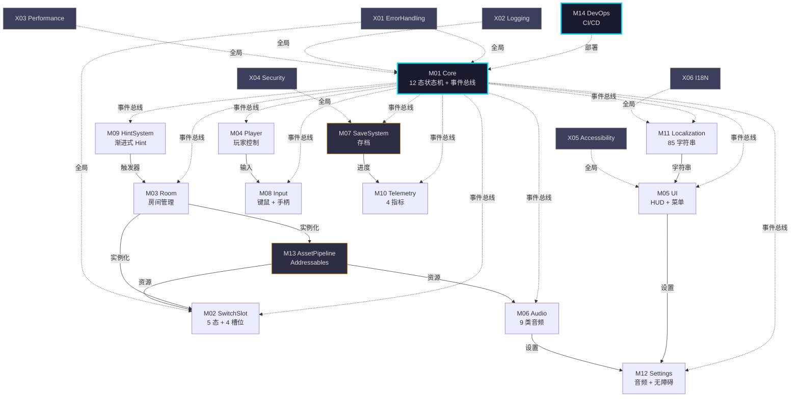

# 《暗室》模块详细规约 (Module Specification)

> **一句话定位：** 14 核心模块 + 6 跨切关注点 = 20 模块的端到端实施规约，每个模块含职责 / API / 数据结构 / 实现步骤 / 关联文件 / 测试入口，与 design/architecture/ + 12 v2 GDD 严格对齐。

## 目的 (Purpose)

本文档是《暗室》**模块实施层**的**唯一权威规约**。它向：

- **Unity 客户端工程师** — 给出每个模块的命名空间、目录、文件清单、API 契约、实现优先级
- **服务端工程师 (v2.0+)** — 给出 SaveSystem / API Client 等模块的服务端实现入口
- **QA / 测试** — 给出每个模块的测试入口、关键测试用例、覆盖率目标
- **Code Review** — 给出每个模块的"完成"标准与"DoD (Definition of Done)"
- **新加入工程师** — 30 分钟看懂"《暗室》由哪些模块组成、怎么实现、怎么测试"

**本版本（v1.0）的目的：** 把 design/architecture/module-breakdown.md 的 14 模块划分——Core / SwitchSlot / Room / Player / UI / Audio / SaveSystem / Input / HintSystem / Telemetry / Localization / Settings / AssetPipeline / DevOps——**第一次**用"模块级 API 契约 + 数据结构 + 实现步骤 + 测试入口"4 维度统一转译，作为 phase4 实施的"代码骨架蓝图"。

## 范围 (Scope)

### 包含

- **14 核心模块**（M01-M14）的详细规约
- **6 跨切关注点**（X01-X06：ErrorHandling / Logging / Performance / Security / Accessibility / I18N）的全局约束
- 每个模块的：**职责 / 命名空间 / 文件清单 / 公开 API / 数据结构 / 实现步骤 / 关联 GDD / 关联 design / 测试入口 / DoD**
- 14 模块依赖关系图（Mermaid）

### 不包含 (Out of Scope)

- 模块内部具体算法实现 → phase4 由 Unity 工程师编写
- 数值公式推导 → 见 `docs/05-numerical-design-v2.md`
- API 端点字段 → 见 `design/api/data-models.md`
- 数据 schema → 见 `design/data/database-schema.md`
- 测试用例具体步骤 → 见 [`test-strategy.md`](./test-strategy.md)

## 一句话描述 (One-liner)

> **"14 模块 × 6 跨切 × 4 维规约 (API/数据/步骤/测试) × Unity 2022 LTS，把架构设计翻译成 phase4 实施的代码骨架。"**

## 1. 模块依赖关系图 (Module Dependency Graph)



> **关键路径：** M01 (Core) → M02 (SwitchSlot) → M03 (Room) → M05 (UI) → M07 (SaveSystem) — 阻塞后续所有开发。

## 2. 模块规约模板 (Module Spec Template)

每个模块按以下 9 字段规约：

| 字段 | 说明 |
|------|------|
| **职责** | 模块做什么、解决什么问题 |
| **命名空间** | `Anzhong.{ModuleName}` |
| **目录** | `src/{ModuleName}/` |
| **文件清单** | 关键 .cs 文件 + 关联资源 |
| **公开 API** | 公开类/方法/事件签名 |
| **数据结构** | 核心数据结构 (POCO / DTO) |
| **实现步骤** | P0/P1/P2 优先级 + 步骤 |
| **关联 GDD + design** | 引用上游文档 |
| **测试入口** | 单元测试 / 集成测试位置 |

---

## M01 — Core (核心)

### 职责

- **12 态全局状态机**：BootUp / MainMenu / ChapterSelect / RoomEntry / Playing / Reset / Win / Pause / ChapterTransition / ChapterComplete / GameComplete / CreditsRoll
- **事件总线 (EventBus)**：14 模块间松耦合通信（15+ 事件类型）
- **游戏主循环**：驱动 Unity Update / FixedUpdate / LateUpdate 顺序
- **全局配置加载**：从 `data/config/*.json` 加载 + 校验

### 命名空间

`Anzhong.Core`

### 目录

```
src/Core/
├── GlobalStateMachine.cs        # 12 态状态机
├── EventBus.cs                  # 事件总线
├── GameLoop.cs                  # 主循环驱动
├── ConfigLoader.cs              # 全局配置加载
├── CoreServiceLocator.cs        # 服务定位器（可选）
└── Anzhong.Core.asmdef          # 程序集定义
```

### 文件清单

| 文件 | 职责 | 状态 |
|------|------|:----:|
| `GlobalStateMachine.cs` | 12 态状态机 + 12×12 状态转移矩阵 | 待创建 |
| `EventBus.cs` | 15+ 事件类型 + 订阅/发布 | 待创建 |
| `GameLoop.cs` | Unity MonoBehaviour 驱动 | 待创建 |
| `ConfigLoader.cs` | JSON/二进制配置加载 | 待创建 |
| `CoreServiceLocator.cs` | 依赖注入容器（可选） | 待创建 |

### 公开 API

```csharp
namespace Anzhong.Core {
    public class GlobalStateMachine {
        public GameState CurrentState { get; }
        public event Action<GameState, GameState> OnStateChanged;
        public void TransitionTo(GameState newState);
        public bool CanTransition(GameState from, GameState to);
    }

    public enum GameState {
        BootUp, MainMenu, ChapterSelect, RoomEntry, Playing, Reset,
        Win, Pause, ChapterTransition, ChapterComplete, GameComplete, CreditsRoll
    }

    public static class EventBus {
        public static void Subscribe<T>(Action<T> handler) where T : IGameEvent;
        public static void Unsubscribe<T>(Action<T> handler) where T : IGameEvent;
        public static void Publish<T>(T gameEvent) where T : IGameEvent;
    }

    public interface IGameEvent { }

    // 15+ 事件类型
    public record OnSlotSwitch(int SlotId, int CurrentIndex) : IGameEvent;
    public record OnRoomEnter(string RoomId) : IGameEvent;
    public record OnRoomExit(string RoomId) : IGameEvent;
    public record OnRoomComplete(string RoomId) : IGameEvent;
    public record OnResetRoom(string RoomId) : IGameEvent;
    public record OnSwitchAnimationStart(int SlotId) : IGameEvent;
    public record OnSwitchAnimationEnd(int SlotId) : IGameEvent;
    public record OnSaveWrite(int SaveVersion) : IGameEvent;
    public record OnSaveLoad(int SaveVersion) : IGameEvent;
    public record OnAudioPlay(string AudioId, float Db) : IGameEvent;
    public record OnHintTrigger(string HintId, int Level) : IGameEvent;
    public record OnProgressUpdate(float Progress) : IGameEvent;
    public record OnChapterUnlock(int ChapterId) : IGameEvent;
    public record OnTelemetry(string Metric, float Value) : IGameEvent;
    public record OnPauseToggle(bool IsPaused) : IGameEvent;
}
```

### 数据结构

```csharp
public class GameConfig {
    public int TotalChapters { get; init; } = 3;
    public int TotalRooms { get; init; } = 19;
    public int TargetFrameRate { get; init; } = 60;
    public int MemoryCapMb { get; init; } = 512;
    public int SwitchCooldownMs { get; init; } = 300;
    public int ResetCooldownMs { get; init; } = 500;
    public int SwitchAnimationMs { get; init; } = 200;
    public int ResetAnimationMs { get; init; } = 300;
}
```

### 实现步骤

- [ ] **P0 (W01):** `GlobalStateMachine.cs` — 12 态 + 12×12 状态转移矩阵（参考 04-v2 §2）
- [ ] **P0 (W01):** `EventBus.cs` — 15 事件类型 + Subscribe/Unsubscribe/Publish
- [ ] **P0 (W01):** `GameLoop.cs` — Unity MonoBehaviour + Update/FixedUpdate/LateUpdate
- [ ] **P0 (W02):** `ConfigLoader.cs` — JSON 加载 + Schema 校验 + 默认值降级
- [ ] **P0 (W02):** 单元测试 — 12 态转移矩阵 + 15 事件类型

### 关联 GDD + design

- **GDD:** [`../../docs/04-gameplay-flow-v2.md`](../../docs/04-gameplay-flow-v2.md) §2 全局状态机 12 态
- **GDD:** [`../../docs/01-overview-v2.md`](../../docs/01-overview-v2.md) §技术栈 (Unity 2022 LTS)
- **arch:** [`../architecture/module-breakdown.md`](../architecture/module-breakdown.md) M01
- **api:** [`../api/README.md`](../api/README.md) (事件总线是模块间通信，不直接对应 API 端点)

### 测试入口

| 测试类型 | 路径 | 覆盖目标 |
|---------|------|:-------:|
| 单元测试 | `tests/Core/GlobalStateMachineTest.cs` | 12 态 + 144 状态转移 |
| 单元测试 | `tests/Core/EventBusTest.cs` | 15 事件 + Subscribe/Unsubscribe |
| 集成测试 | `tests/Integration/CoreIntegrationTest.cs` | Core + SwitchSlot 集成 |

### DoD (Definition of Done)

- [ ] 12 态全部实现 + 状态转移矩阵通过单元测试
- [ ] 15 事件类型全部定义 + 类型安全
- [ ] 单元测试覆盖率 ≥ 80%
- [ ] 无编译警告
- [ ] StyleCop 通过

---

## M02 — SwitchSlot (槽位)

### 职责

- **5 态状态机**：Idle / Hover / Active / Switching / Locked
- **4 种槽位类型**：ToggleSlot / CycleSlot / ConditionalSlot / LockedSlot
- **5×5 状态转移矩阵**
- **I/O Spec**：玩家输入 → 系统状态 → 视觉/音效反馈

### 命名空间

`Anzhong.SwitchSlot`

### 目录

```
src/SwitchSlot/
├── SwitchSlot.cs                # 抽象基类
├── SwitchSlotStateMachine.cs    # 5 态机
├── SwitchAnimator.cs            # 切换动画协程
├── ToggleSlot.cs                # 1 选项类型
├── CycleSlot.cs                 # 3-4 选项类型
├── ConditionalSlot.cs           # 依赖类型
├── LockedSlot.cs                # 锁定类型
├── SlotInputCooldown.cs         # 300ms 冷却
├── SlotDependencyResolver.cs    # 依赖链解析（≤ 2 层）
└── Anzhong.SwitchSlot.asmdef
```

### 公开 API

```csharp
namespace Anzhong.SwitchSlot {
    public abstract class SwitchSlot : MonoBehaviour {
        public int SlotId { get; }
        public SlotType Type { get; }
        public SlotState CurrentState { get; protected set; }
        public event Action<int, int> OnSwitched;
        public abstract void Switch(SwitchDirection dir);
        public virtual void Reset();
    }

    public enum SlotType { Toggle, Cycle, Conditional, Locked }
    public enum SlotState { Idle, Hover, Active, Switching, Locked }
    public enum SwitchDirection { Clockwise, CounterClockwise }

    public class ToggleSlot : SwitchSlot {
        public override void Switch(SwitchDirection dir);  // 翻转 1 个选项
    }

    public class CycleSlot : SwitchSlot {
        public int OptionCount { get; init; } = 3;  // 3-4 选项
        public override void Switch(SwitchDirection dir);  // 循环切换
    }

    public class ConditionalSlot : SwitchSlot {
        public int[] DependsOnSlotIds { get; init; }  // ≤ 2 层依赖
        public override void Switch(SwitchDirection dir);  // 仅当依赖激活时切换
        public void OnDependencyChanged(int slotId, bool isActive);
    }

    public class LockedSlot : SwitchSlot {
        public Func<bool> UnlockCondition { get; init; }
        public override void Switch(SwitchDirection dir);  // 仅当解锁时切换
    }
}
```

### 数据结构

```csharp
public class SlotData {
    public int SlotId { get; set; }
    public SlotType Type { get; set; }
    public int CurrentIndex { get; set; }
    public int[] DependsOnSlotIds { get; set; } = Array.Empty<int>();
    public bool IsLocked { get; set; }
    public float CooldownRemainingSec { get; set; }
}
```

### 实现步骤

- [ ] **P0 (W03):** `SwitchSlot.cs` 抽象基类 + `SwitchSlotStateMachine.cs` 5 态
- [ ] **P0 (W03):** `ToggleSlot.cs` — 1 选项翻转（房间 1-1 用）
- [ ] **P0 (W03):** `SlotInputCooldown.cs` 300ms 冷却
- [ ] **P1 (W04):** `CycleSlot.cs` — 3-4 选项循环（房间 1-2 用）
- [ ] **P1 (W05):** `ConditionalSlot.cs` + `SlotDependencyResolver.cs`（房间 2-1 用）
- [ ] **P1 (W09):** `LockedSlot.cs`（房间 3-5/3-6 用）
- [ ] **P0 (W03):** 单元测试 — 5 态 + 状态转移 + I/O Spec

### 关联 GDD + design

- **GDD:** [`../../docs/02-core-mechanics-v2.md`](../../docs/02-core-mechanics-v2.md) §2 SwitchSlot 5 态 + §3 4 槽位类型
- **GDD:** [`../../docs/02-core-mechanics-v2.md`](../../docs/02-core-mechanics-v2.md) §4 I/O Spec + §10 边界 10 条
- **arch:** [`../architecture/module-breakdown.md`](../architecture/module-breakdown.md) M02

### 测试入口

| 测试类型 | 路径 | 覆盖目标 |
|---------|------|:-------:|
| 单元测试 | `tests/SwitchSlot/ToggleSlotTest.cs` | 1 选项翻转 + 300ms 冷却 |
| 单元测试 | `tests/SwitchSlot/CycleSlotTest.cs` | 3-4 选项循环 + 边界 |
| 单元测试 | `tests/SwitchSlot/ConditionalSlotTest.cs` | 依赖链 ≤ 2 层 + 依赖消失 |
| 单元测试 | `tests/SwitchSlot/LockedSlotTest.cs` | 解锁条件 + 锁定态 |
| 单元测试 | `tests/SwitchSlot/StateMachineTest.cs` | 5×5 状态转移矩阵 |
| 集成测试 | `tests/Integration/SwitchSlotIntegrationTest.cs` | SwitchSlot + Room 集成 |

### DoD

- [ ] 4 种槽位类型全部实现
- [ ] 5 态状态机 + 状态转移矩阵通过测试
- [ ] 300ms 冷却实现 + 防误触
- [ ] 依赖链 ≤ 2 层（避免 A→B→C 状态爆炸）
- [ ] 单元测试覆盖率 ≥ 80%

### **P0-001 关联（重要！）**

> M02 实施期遇到的 **P0-001 阻塞**：02-v2 §13 AC-06 缺"难度上限 20"硬约束。
> **实施策略：** 不修复 P0-001，但**自我保护**：
> - `SwitchSlot.validate()` 静态方法在加载时校验 `Room.difficulty ∈ [1, 20]`
> - 超 20 → 警告日志 + 强制回退到 20（参考 design/data/p0-001-tracking.md §3 修复选项 C）
> - 不编造难度数据，使用 Room.difficulty 实际值（来自 `data/levels/room-{id}.json`）

---

## M03 — Room (房间)

### 职责

- **房间加载/卸载**：从 `data/levels/room-{id}.json` 加载 + 实例化
- **通关判定**：玩家位置 + 路径连通 + LockedSlot 激活三重判定
- **重置流程**：R 键 + 300ms 淡出淡入 + 槽位状态回退
- **章节门控**：3 章节 + 解锁状态管理
- **19 房间配置**：Ch1 (5) + Ch2 (6) + Ch3 (8)

### 命名空间

`Anzhong.Room`

### 目录

```
src/Room/
├── RoomLoader.cs                # JSON 加载
├── RoomManager.cs               # 房间切换 + 章节门控
├── RoomLoop.cs                  # 房间内循环 (Playing 状态)
├── WinCondition.cs              # 通关判定 3 重
├── RoomReset.cs                 # R 键重置
├── RoomData.cs                  # 房间数据 (POCO)
├── SlotData.cs                  # 槽位数据 (POCO)
├── RoomFactory.cs               # 工厂模式（实例化）
└── Anzhong.Room.asmdef
```

### 公开 API

```csharp
namespace Anzhong.Room {
    public class RoomLoader {
        public Task<RoomData> LoadAsync(string roomId);
        public bool Validate(RoomData data);  // P0-001 自我保护
    }

    public class RoomManager {
        public event Action<string> OnRoomEntered;
        public event Action<string> OnRoomExited;
        public event Action<string> OnRoomCompleted;
        public Task EnterRoomAsync(string roomId);
        public void ExitRoom();
        public bool IsRoomUnlocked(string roomId);
        public bool IsChapterUnlocked(int chapterId);
    }

    public class RoomLoop {
        public void OnPlayerInput(InputAction input);
        public bool CheckWinCondition();
    }

    public class RoomReset {
        public void ResetRoom(string roomId);
        public event Action OnResetStarted;
        public event Action OnResetCompleted;
    }

    public class WinCondition {
        public bool IsPlayerAtExit { get; }
        public bool IsPathConnected { get; }
        public bool AreLockedSlotsActivated { get; }
        public bool IsSatisfied { get; }  // 3 重全 true
    }
}
```

### 数据结构

```csharp
public class RoomData {
    public string RoomId { get; set; }                    // "1-1", "1-2", ..., "3-8"
    public int ChapterId { get; set; }                    // 1, 2, 3
    public string DisplayName { get; set; }
    public Vector2Int Size { get; set; }                  // 宽 × 高（格）
    public int Difficulty { get; set; }                   // 1-20 (P0-001 待修复)
    public int DifficultyMax { get; set; } = 20;          // 自我保护
    public int P50DurationSec { get; set; }               // 中位时长
    public int P90DurationSec { get; set; }               // 90 分位时长
    public Vector2Int PlayerSpawnPos { get; set; }
    public Vector2Int ExitPos { get; set; }
    public SlotData[] Slots { get; set; } = Array.Empty<SlotData>();
    public TileData[] Tiles { get; set; } = Array.Empty<TileData>();
}

public class SlotData {
    public int SlotId { get; set; }
    public SlotType Type { get; set; }
    public Vector2Int GridPos { get; set; }
    public int OptionCount { get; set; } = 1;
    public int[] DependsOnSlotIds { get; set; } = Array.Empty<int>();
    public string[] PrefabTypes { get; set; } = Array.Empty<string>();
    // P0-001: 难度字段引用 design/data/p0-001-tracking.md
}

public class TileData {
    public Vector2Int GridPos { get; set; }
    public string TileType { get; set; }  // "Floor" | "SolidWall" | "Door" | ...
}
```

### 实现步骤

- [ ] **P0 (W02):** `RoomData.cs` + `SlotData.cs` 数据结构
- [ ] **P0 (W02):** `RoomLoader.cs` JSON 加载 + Schema 校验
- [ ] **P0 (W02):** `RoomLoader.Validate()` — 难度 ≤ 20 自我保护 (P0-001)
- [ ] **P0 (W03):** `RoomFactory.cs` 实例化 7 预制件
- [ ] **P0 (W03):** `RoomManager.cs` 房间切换 + 章节门控
- [ ] **P0 (W03):** `WinCondition.cs` 3 重判定
- [ ] **P1 (W04):** `RoomReset.cs` R 键 + 300ms 淡出淡入
- [ ] **P1 (W08):** `data/levels/room-{id}.json` 19 房间数据

### 关联 GDD + design

- **GDD:** [`../../docs/03-level-design-v2.md`](../../docs/03-level-design-v2.md) §5 19 房间配置
- **GDD:** [`../../docs/04-gameplay-flow-v2.md`](../../docs/04-gameplay-flow-v2.md) §4 房间内循环 + §10 存档点
- **arch:** [`../architecture/module-breakdown.md`](../architecture/module-breakdown.md) M03
- **data:** [`../data/database-schema.md`](../data/database-schema.md) rooms / room_switch_slots / room_switch_slot_options
- **data:** [`../data/p0-001-tracking.md`](../data/p0-001-tracking.md) **强 P0-001 跟踪**

### 测试入口

| 测试类型 | 路径 | 覆盖目标 |
|---------|------|:-------:|
| 单元测试 | `tests/Room/RoomLoaderTest.cs` | JSON 加载 + Schema 校验 |
| 单元测试 | `tests/Room/RoomDataTest.cs` | 19 房间数据完整性 |
| 单元测试 | `tests/Room/RoomValidateTest.cs` | **P0-001 难度 ≤ 20 校验** |
| 单元测试 | `tests/Room/WinConditionTest.cs` | 3 重判定 |
| 集成测试 | `tests/Integration/RoomIntegrationTest.cs` | Room + SwitchSlot + Player 集成 |

### DoD

- [ ] 19 房间 JSON 全部加载
- [ ] 通关判定 3 重通过测试
- [ ] R 键重置 300ms 动画
- [ ] **P0-001 自我保护**: Room.difficulty > 20 → 警告 + 强制回退
- [ ] 单元测试覆盖率 ≥ 75%

### **P0-001 强关联**

> M03 是 P0-001 **最直接** 实施模块。
> - `RoomData.Difficulty` 字段来源：`docs/05-v2 §6.1` 19 房间数据点 (1-1: 2, ..., 3-6: 20 回退前 21.5)
> - `RoomData.DifficultyMax` 字段：恒为 20 (CONST, 自我保护)
> - `RoomLoader.Validate()` 静态方法：难度超 20 → 警告日志 + 强制回退 + 引用 `data/p0-001-tracking.md`
> - 不修复 02-v2 §13 AC-06 (auto-chain 不擅自)
> - 不编造难度数据 (使用 05-v2 §6.1 实际值)

---

## M04 — Player (玩家)

### 职责

- **移动控制**：WASD / 方向键 + Xbox/PS 手柄左摇杆
- **碰撞检测**：Tilemap Collider + 2D Collider + trigger 区检测
- **输入处理**：接收 Input System 事件 → 转化为玩家动作
- **动画状态机**：Idle / Walk / Switch 3 态

### 命名空间

`Anzhong.Player`

### 目录

```
src/Player/
├── PlayerController.cs          # 主控
├── PlayerMovement.cs            # 移动 + 碰撞
├── PlayerAnimation.cs           # 3 态动画
├── PlayerInputHandler.cs        # 输入处理
├── PlayerState.cs               # 玩家状态 (POCO)
└── Anzhong.Player.asmdef
```

### 公开 API

```csharp
namespace Anzhong.Player {
    public class PlayerController : MonoBehaviour {
        public Vector2 Position { get; }
        public PlayerState CurrentState { get; }
        public event Action<PlayerState> OnStateChanged;
        public void Move(Vector2 direction);
        public void EnterTrigger(string triggerId);
        public void ExitTrigger(string triggerId);
    }

    public enum PlayerState { Idle, Walking, Switching }
}
```

### 实现步骤

- [ ] **P0 (W03):** `PlayerController.cs` + `PlayerMovement.cs` WASD + 碰撞
- [ ] **P0 (W03):** `PlayerInputHandler.cs` 接收 Input System
- [ ] **P0 (W03):** `PlayerAnimation.cs` 3 态动画
- [ ] **P1 (W04):** 手柄支持 (Xbox/PS 双套)
- [ ] **P0 (W03):** 单元测试 — 移动 + 碰撞 + 状态机

### 关联 GDD + design

- **GDD:** [`../../docs/02-core-mechanics-v2.md`](../../docs/02-core-mechanics-v2.md) §3.2 玩家操作
- **GDD:** [`../../docs/01-overview-v2.md`](../../docs/01-overview-v2.md) §边界 1-6

### DoD

- [ ] 移动 + 碰撞 + 动画通过测试
- [ ] 键鼠 + 手柄双套支持

---

## M05 — UI (用户界面)

### 职责

- **核心 HUD**：槽位 4 态 + 房间名 + 章节进度 + Hint 按钮 + 暂停按钮
- **3 层菜单**：主菜单 / 章节选择 / 暂停菜单
- **4 态组件**：normal / hover / disabled / active
- **3 层反馈同步**：视觉 + 音频 + 触觉
- **教学 UI 4 阶段**：1-1 零文字 → 1-2~1-5 渐进式提示

### 命名空间

`Anzhong.UI`

### 目录

```
src/UI/
├── HUD/
│   ├── HUDController.cs         # 总控
│   ├── SlotWidget.cs            # 槽位 4 态组件
│   ├── RoomNameWidget.cs        # 房间名
│   ├── ChapterProgressWidget.cs # 章节进度
│   ├── HintButtonWidget.cs      # Hint 按钮
│   └── PauseButtonWidget.cs     # 暂停按钮
├── Menus/
│   ├── MainMenu.cs              # 主菜单
│   ├── ChapterSelect.cs         # 章节选择
│   ├── PauseMenu.cs             # 暂停菜单
│   └── SettingsMenu.cs          # 设置子菜单
├── Common/
│   ├── UIComponentBase.cs       # 4 态基类
│   └── UIAnimation.cs           # UI 动画
└── Anzhong.UI.asmdef
```

### 公开 API

```csharp
namespace Anzhong.UI {
    public class HUDController : MonoBehaviour {
        public void UpdateSlotState(int slotId, SlotState state);
        public void ShowHintButton(bool visible);
        public void ShowRoomName(string name);
        public void UpdateChapterProgress(int chapterId, float pct);
    }

    public abstract class UIComponentBase : MonoBehaviour {
        public UIState CurrentState { get; protected set; }
        public abstract void SetState(UIState state);
    }

    public enum UIState { Normal, Hover, Disabled, Active }
}
```

### 实现步骤

- [ ] **P0 (W03):** `UIComponentBase.cs` 4 态基类
- [ ] **P0 (W03):** `HUDController.cs` + `SlotWidget.cs`
- [ ] **P0 (W04):** `MainMenu.cs` + `ChapterSelect.cs`
- [ ] **P0 (W07):** `PauseMenu.cs` (W07 Alpha 末)
- [ ] **P1 (W10):** `HintButtonWidget.cs` + 渐进式提示
- [ ] **P1 (W10):** 85 字符串本地化 (与 M11 集成)
- [ ] **P0 (W03):** 单元测试 — 4 态转换

### 关联 GDD + design

- **GDD:** [`../../docs/08-ui-ux-v2.md`](../../docs/08-ui-ux-v2.md) §3-9 全部
- **GDD:** [`../../docs/06-player-experience-v2.md`](../../docs/06-player-experience-v2.md) §10 无障碍 4 类
- **arch:** [`../architecture/module-breakdown.md`](../architecture/module-breakdown.md) M05

### DoD

- [ ] HUD 6 类组件全部实现
- [ ] 3 层菜单 + 设置子菜单
- [ ] 85 字符串本地化集成
- [ ] 色盲 3 档 + 字号 3 档

---

## M06 — Audio (音频)

### 职责

- **9 类音频**：切换 / 重置 / 通关 / 错音 / 教学 / 章节 BGM / 房间主题 / 环境音 / UI 反馈
- **动态混音**：玩家距槽位、章节切换、难度递增
- **无障碍音频**：听障仅视觉 / 视障仅听觉
- **dB 控制**：9 类音频独立音量

### 命名空间

`Anzhong.Audio`

### 目录

```
src/Audio/
├── AudioManager.cs              # 总控
├── AudioBank.cs                 # 9 类音频资源
├── AudioMixer.cs                # 动态混音
├── AudioCategory.cs             # 9 类 dB 参数
├── AudioPool.cs                 # AudioSource 对象池
└── Anzhong.Audio.asmdef
```

### 公开 API

```csharp
namespace Anzhong.Audio {
    public class AudioManager : MonoBehaviour {
        public void Play(AudioCategory category, string audioId, float volumeDb = 0);
        public void SetCategoryVolumeDb(AudioCategory category, float db);
        public void PlayChapterBgm(int chapterId);
        public void PlayRoomTheme(string roomId);
    }

    public enum AudioCategory {
        Switch, Reset, Win, Error, Tutorial,
        ChapterBgm, RoomTheme, Ambient, UiFeedback
    }
}
```

### 实现步骤

- [ ] **P0 (W04):** `AudioManager.cs` + `AudioCategory.cs` 9 类 dB
- [ ] **P0 (W04):** `AudioBank.cs` 加载 28 音频文件
- [ ] **P1 (W08):** `AudioMixer.cs` 动态混音
- [ ] **P1 (W08):** `AudioPool.cs` 对象池（性能）
- [ ] **P0 (W04):** 单元测试 — 9 类 dB 范围

### 关联 GDD + design

- **GDD:** [`../../docs/09-audio-v2.md`](../../docs/09-audio-v2.md) §1 9 类音频
- **GDD:** [`../../docs/11-release-v2.md`](../../docs/11-release-v2.md) §5.6 版权表
- **arch:** [`../architecture/module-breakdown.md`](../architecture/module-breakdown.md) M06

### DoD

- [ ] 9 类音频 + 28 文件全部加载
- [ ] dB 控制 + 动态混音
- [ ] 版权合规（CC0 + Suno/Udio 商用）

---

## M07 — SaveSystem (存档)

### 职责

- **SQLite 本地存档** + **JSON 设置** + **二进制 SlotState** + **Steam Cloud 同步**
- **备份与容错**：.bak 轮转 + 损坏降级到 backup
- **AES-256-GCM 加密**（防篡改）
- **GDPR 合规**：数据导出 / 删除 API

### 命名空间

`Anzhong.SaveSystem`

### 目录

```
src/SaveSystem/
├── SaveSystem.cs                # 总控
├── SaveData.cs                  # 12 字段存档
├── SqliteContext.cs             # EF Core DbContext
├── SaveSerializer.cs            # 二进制 + AES-256-GCM
├── SaveBackup.cs                # .bak 轮转
├── CloudSync.cs                 # Steam Cloud / iCloud
├── GdprDataExport.cs            # GDPR 数据导出
└── Anzhong.SaveSystem.asmdef
```

### 公开 API

```csharp
namespace Anzhong.SaveSystem {
    public class SaveSystem : MonoBehaviour {
        public Task<SaveData> LoadAsync();
        public Task<bool> SaveAsync(SaveData data);
        public Task<SaveData> LoadBackupAsync();
        public Task<bool> DeleteAllAsync();  // GDPR
        public Task<byte[]> ExportAsync();   // GDPR
    }

    public class SaveData {
        public string PlayerId { get; set; }
        public int Version { get; set; } = 1;
        public int CurrentChapterId { get; set; }
        public string CurrentRoomId { get; set; }
        public RoomStats[] RoomStats { get; set; } = Array.Empty<RoomStats>();
        public DateTime SavedAt { get; set; }
        public DateTime CreatedAt { get; set; }
        // P0-001: max_difficulty_completed / last_difficulty_played 字段标 TODO
    }

    public class RoomStats {
        public string RoomId { get; set; }
        public bool Completed { get; set; }
        public int SwitchCount { get; set; }
        public int ResetCount { get; set; }
        public int HintCount { get; set; }
        public int DurationSec { get; set; }
        // P0-001: max_difficulty_completed 字段标 TODO
    }
}
```

### 数据结构 (SQLite)

- `players` (T01): player_id / display_name / platform / locale
- `player_progress` (T07): max_difficulty_reached / max_difficulty_attempted (P0-001 TODO)
- `saves` (T12): max_difficulty_completed / max_difficulty_ever / last_difficulty_played (P0-001 TODO)
- `save_backups` (T11 容错): backup_id / save_id / created_at / reason
- **P0-001 跟踪:** 11 阻塞字段全部 NOT NULL DEFAULT NULL + CHECK (field IS NULL OR field BETWEEN 1 AND 20)

### 实现步骤

- [ ] **P0 (W02):** `SaveData.cs` + `SaveSerializer.cs` 二进制 + AES-256-GCM
- [ ] **P0 (W02):** `SqliteContext.cs` EF Core DbContext + 4 表
- [ ] **P0 (W02):** `SaveSystem.cs` Load/Save + 损坏降级
- [ ] **P0 (W02):** `SaveBackup.cs` .bak 轮转 (3 份)
- [ ] **P1 (W03):** `CloudSync.cs` Steam Cloud 同步
- [ ] **P1 (W10):** `GdprDataExport.cs` GDPR 导出/删除
- [ ] **P0 (W02):** 单元测试 — 二进制序列化 + AES 解密 + 损坏降级

### 关联 GDD + design

- **GDD:** [`../../docs/04-gameplay-flow-v2.md`](../../docs/04-gameplay-flow-v2.md) §10 SaveSystem + SaveData
- **GDD:** [`../../docs/11-release-v2.md`](../../docs/11-release-v2.md) §5.4 GDPR
- **arch:** [`../architecture/module-breakdown.md`](../architecture/module-breakdown.md) M07
- **data:** [`../data/database-schema.md`](../data/database-schema.md) players/saves/save_backups
- **data:** [`../data/serialization.md`](../data/serialization.md) Protobuf + AES-256-GCM
- **data:** [`../data/p0-001-tracking.md`](../data/p0-001-tracking.md) **强 P0-001 跟踪 (11 阻塞字段)**
- **api:** [`../api/data-models.md`](../api/data-models.md) M11 SaveData

### 测试入口

| 测试类型 | 路径 | 覆盖目标 |
|---------|------|:-------:|
| 单元测试 | `tests/SaveSystem/SaveSerializerTest.cs` | 二进制 + AES-256 |
| 单元测试 | `tests/SaveSystem/SaveSystemTest.cs` | Load/Save/Backup |
| 单元测试 | `tests/SaveSystem/CorruptedSaveTest.cs` | 损坏降级 → backup → 全新 |
| 集成测试 | `tests/Integration/SaveSystemIntegrationTest.cs` | Save + CloudSync |

### DoD

- [ ] 存档 ≤ 50ms 写入 + ≤ 20ms 读取 (性能预算 01-v2)
- [ ] 损坏自动降级 + 备份 3 份
- [ ] Steam Cloud 同步 (v1.0)
- [ ] **P0-001 自我保护**: 难度字段 NOT NULL + CHECK (1-20)
- [ ] GDPR 导出/删除 API (EU 上架 11-v2)
- [ ] 单元测试覆盖率 ≥ 80%

---

## M08 — Input (输入)

### 职责

- **键鼠 + 手柄双套**：Input System (新) + Legacy Input 兼容
- **300/500ms 冷却**：E/Q 切换 300ms + R 重置 500ms
- **输入缓冲队列**：丢弃连按
- **设备热插拔**：手柄拔插自动切换

### 命名空间

`Anzhong.Input`

### 目录

```
src/Input/
├── InputManager.cs              # 总控 (Input System)
├── InputActions.inputactions    # Input System 资源
├── InputCooldown.cs             # 300/500ms 冷却
├── InputBuffer.cs               # 缓冲队列
└── Anzhong.Input.asmdef
```

### 公开 API

```csharp
namespace Anzhong.Input {
    public class InputManager : MonoBehaviour {
        public event Action OnSwitchClockwise;
        public event Action OnSwitchCounterClockwise;
        public event Action OnReset;
        public event Action OnPause;
        public bool IsCooldownActive { get; }
    }
}
```

### 实现步骤

- [ ] **P0 (W03):** `InputManager.cs` Unity Input System
- [ ] **P0 (W03):** `InputCooldown.cs` 300/500ms
- [ ] **P1 (W04):** 手柄支持 (Xbox/PS 双套)
- [ ] **P0 (W03):** 单元测试 — 冷却 + 连按丢弃

### 关联 GDD + design

- **GDD:** [`../../docs/02-core-mechanics-v2.md`](../../docs/02-core-mechanics-v2.md) §12.3 玩家操作参数
- **GDD:** [`../../docs/08-ui-ux-v2.md`](../../docs/08-ui-ux-v2.md) §6 控制器映射

### DoD

- [ ] 键鼠 + 手柄全支持
- [ ] 冷却 + 连按防误触

---

## M09 — HintSystem (提示)

### 职责

- **渐进式 Hint**：3 / 5 / 10 / 15 / 30 分钟 5 阶段
- **卡点识别**：停留时长 + 切换次数 + 重置次数综合判定
- **5 类提示内容**：方向提示 / 操作提示 / 槽位高亮 / 章节回顾 / 解决方案
- **Boss 房特殊**：3-7/3-8 停留 30min 自动激活

### 命名空间

`Anzhong.HintSystem`

### 目录

```
src/HintSystem/
├── HintManager.cs               # 总控
├── HintTrigger.cs               # 触发条件
├── HintContent.cs               # 5 类内容
├── StuckDetector.cs             # 卡点识别
└── Anzhong.HintSystem.asmdef
```

### 公开 API

```csharp
namespace Anzhong.HintSystem {
    public class HintManager : MonoBehaviour {
        public void OnRoomEnter(string roomId);
        public void OnSwitch();     // 增加切换计数
        public void OnReset();      // 增加重置计数
        public void OnHintRequested();  // 玩家主动请求
        public HintLevel CurrentLevel { get; }  // 0-4
    }

    public enum HintLevel { None, Direction, Operation, Highlight, Recap, Solution }
}
```

### 实现步骤

- [ ] **P1 (W04):** `StuckDetector.cs` 卡点识别
- [ ] **P1 (W04):** `HintManager.cs` 5 阶段
- [ ] **P1 (W04):** `HintContent.cs` 5 类内容
- [ ] **P2 (W09):** Boss 房特殊触发 (3-7/3-8)
- [ ] **P1 (W04):** 单元测试 — 卡点识别 + 5 阶段

### 关联 GDD + design

- **GDD:** [`../../docs/06-player-experience-v2.md`](../../docs/06-player-experience-v2.md) §11.2 渐进式 Hint
- **GDD:** [`../../docs/04-gameplay-flow-v2.md`](../../docs/04-gameplay-flow-v2.md) §6.4 重置提示触发阈值

### DoD

- [ ] 5 阶段提示 + 卡点识别
- [ ] Boss 房特殊处理

---

## M10 — Telemetry (遥测)

### 职责

- **4 核心指标本地聚合**：P50/P90/ResetCount/HintTriggerRate
- **v1.0 本地存储**：仅本地 JSON，不上传 (无 PII)
- **v2.0+ 异步上报**：Redis Stream → TimescaleDB
- **GDPR 合规**：玩家可关闭 / 删除

### 命名空间

`Anzhong.Telemetry`

### 目录

```
src/Telemetry/
├── TelemetryClient.cs           # 总控
├── MetricsCollector.cs          # 4 指标采集
├── TelemetryEvent.cs            # 事件 (POCO)
├── LocalStorage.cs              # 本地 JSON
└── Anzhong.Telemetry.asmdef
```

### 公开 API

```csharp
namespace Anzhong.Telemetry {
    public class TelemetryClient : MonoBehaviour {
        public void TrackEvent(TelemetryEvent evt);
        public MetricsReport GenerateReport();
        public void ClearAll();  // GDPR
    }

    public enum TelemetryEventType {
        RoomEnter, RoomExit, RoomComplete, SlotSwitch, Reset, HintTrigger, PauseToggle
    }

    public class TelemetryEvent {
        public TelemetryEventType Type { get; set; }
        public string RoomId { get; set; }
        public int? SlotId { get; set; }
        public int Difficulty { get; set; }  // P0-001: 难度字段标 TODO
        public DateTime Timestamp { get; set; }
    }
}
```

### 实现步骤

- [ ] **P1 (W02):** `TelemetryEvent.cs` + `MetricsCollector.cs` 4 指标
- [ ] **P1 (W02):** `LocalStorage.cs` 本地 JSON
- [ ] **P1 (W10):** `TelemetryClient.cs` 总控
- [ ] **P2 (W24+):** v2.0 异步上报 (Redis Stream)
- [ ] **P1 (W10):** 单元测试 — 4 指标 + GDPR 删除

### 关联 GDD + design

- **GDD:** [`../../docs/05-numerical-design-v2.md`](../../docs/05-numerical-design-v2.md) §4.1 4 指标
- **GDD:** [`../../docs/11-release-v2.md`](../../docs/11-release-v2.md) §5.3 隐私政策 (0 PII)
- **arch:** [`../architecture/module-breakdown.md`](../architecture/module-breakdown.md) M10
- **data:** [`../data/database-schema.md`](../data/database-schema.md) telemetry_events

### DoD

- [ ] 4 指标本地聚合
- [ ] GDPR 删除 API
- [ ] 单元测试覆盖率 ≥ 70%

---

## M11 — Localization (本地化)

### 职责

- **v1.0 中英 85 字符串**：键值对 + 双语切换
- **v1.1 5 语种扩展**：ja-JP / ko-KR / fr-FR / de-DE / es-ES
- **字体切换**：思源黑体 (中) / Inter (英) / Noto Sans CJK (日韩)
- **运行时切换**：无需重启

### 命名空间

`Anzhong.Localization`

### 目录

```
src/Localization/
├── LocalizationManager.cs       # 总控
├── Locale.cs                    # 语种枚举
├── LocalizationData.cs          # 85 字符串 (POCO)
├── FontManager.cs               # 字体切换
└── Anzhong.Localization.asmdef
```

### 公开 API

```csharp
namespace Anzhong.Localization {
    public class LocalizationManager : MonoBehaviour {
        public static string GetString(string key);
        public static void SetLocale(Locale locale);
        public static Locale CurrentLocale { get; }
    }

    public enum Locale { zhCN, enUS, jaJP, koKR, frFR, deDE, esES }
}
```

### 实现步骤

- [ ] **P1 (W10):** `LocalizationData.cs` 85 字符串 zh-CN/en-US
- [ ] **P1 (W10):** `LocalizationManager.cs` 总控
- [ ] **P1 (W10):** `FontManager.cs` 中英字体切换
- [ ] **P2 (W16+):** v1.1 5 语种扩展
- [ ] **P1 (W10):** 单元测试 — 85 字符串键完整性

### 关联 GDD + design

- **GDD:** [`../../docs/08-ui-ux-v2.md`](../../docs/08-ui-ux-v2.md) §9.3 85 字符串
- **GDD:** [`../../docs/10-roadmap-v2.md`](../../docs/10-roadmap-v2.md) §12 本地化里程碑
- **GDD:** [`../../docs/11-release-v2.md`](../../docs/11-release-v2.md) §4 营销 (5 区域)
- **arch:** [`../architecture/module-breakdown.md`](../architecture/module-breakdown.md) M11

### DoD

- [ ] 85 字符串 v1.0 中英
- [ ] 运行时切换
- [ ] 字体 + 字号 3 档

---

## M12 — Settings (设置)

### 职责

- **音频设置**：9 类 dB + 总音量 + 静音
- **无障碍设置**：色盲 3 档 + 字号 3 档 + 难度 easy/normal
- **设置持久化**：JSON (Newtonsoft.Json)
- **设置迁移**：版本兼容

### 命名空间

`Anzhong.Settings`

### 目录

```
src/Settings/
├── SettingsManager.cs           # 总控
├── AudioSettings.cs             # 9 类 dB
├── AccessibilitySettings.cs     # 4 类
├── SettingsSerializer.cs        # JSON
└── Anzhong.Settings.asmdef
```

### 公开 API

```csharp
namespace Anzhong.Settings {
    public class SettingsManager : MonoBehaviour {
        public AudioSettings Audio { get; set; }
        public AccessibilitySettings Accessibility { get; set; }
        public Task SaveAsync();
        public Task LoadAsync();
    }

    public class AudioSettings {
        public float MasterVolumeDb { get; set; } = 0;
        public Dictionary<AudioCategory, float> CategoryDb { get; set; } = new();
        public bool Muted { get; set; } = false;
    }

    public class AccessibilitySettings {
        public ColorblindMode Colorblind { get; set; } = ColorblindMode.None;
        public FontScale FontScale { get; set; } = FontScale.Medium;
        public DifficultyOption Difficulty { get; set; } = DifficultyOption.Normal;
    }

    public enum ColorblindMode { None, Protanopia, Deuteranopia, Tritanopia }
    public enum FontScale { Small, Medium, Large }
    public enum DifficultyOption { Easy, Normal }  // P0-001: hard 推 v1.1
}
```

### 实现步骤

- [ ] **P1 (W04):** `AudioSettings.cs` + `AccessibilitySettings.cs`
- [ ] **P1 (W04):** `SettingsSerializer.cs` JSON
- [ ] **P1 (W04):** `SettingsManager.cs` 总控
- [ ] **P1 (W04):** 单元测试 — JSON 序列化 + 迁移

### 关联 GDD + design

- **GDD:** [`../../docs/09-audio-v2.md`](../../docs/09-audio-v2.md) §1 9 类 dB
- **GDD:** [`../../docs/06-player-experience-v2.md`](../../docs/06-player-experience-v2.md) §10 无障碍 4 类
- **GDD:** [`../../docs/08-ui-ux-v2.md`](../../docs/08-ui-ux-v2.md) §6 无障碍 3 档
- **data:** [`../data/database-schema.md`](../data/database-schema.md) player_audio_settings / player_accessibility_settings
- **api:** [`../api/data-models.md`](../api/data-models.md) M09 / M10

### DoD

- [ ] 9 类 dB + 4 类无障碍
- [ ] JSON 持久化
- [ ] 运行时切换

---

## M13 — AssetPipeline (资源管线)

### 职责

- **Addressables 资源管理**：热更新 + 内存管理
- **Sprite Atlas 打包**：URP 2D 性能优化
- **Tilemap 集成**：基础地板/墙
- **预制件实例化**：7 预制件 × 4 状态

### 命名空间

`Anzhong.AssetPipeline`

### 目录

```
src/AssetPipeline/
├── AddressablesManager.cs       # 总控
├── SpriteAtlasBuilder.cs        # 图集打包
├── PrefabInstantiator.cs        # 预制件实例化
├── AssetCache.cs                # L1 缓存
└── Anzhong.AssetPipeline.asmdef
```

### 公开 API

```csharp
namespace Anzhong.AssetPipeline {
    public class AddressablesManager : MonoBehaviour {
        public Task<T> LoadAssetAsync<T>(string key) where T : Object;
        public void ReleaseAsset(string key);
        public Task PreloadAssetsAsync(string[] keys);
    }
}
```

### 实现步骤

- [ ] **P1 (W03):** `AddressablesManager.cs` 总控
- [ ] **P1 (W04):** `SpriteAtlasBuilder.cs` 图集
- [ ] **P1 (W05):** `PrefabInstantiator.cs` 7 预制件
- [ ] **P1 (W03):** 单元测试 — 加载/释放

### 关联 GDD + design

- **GDD:** [`../../docs/12-art-style-v2.md`](../../docs/12-art-style-v2.md) §9 美术资源
- **art:** [`../art/asset-list.md`](../art/asset-list.md) 7 预制件
- **art:** [`../art/production-pipeline.md`](../art/production-pipeline.md)
- **arch:** [`../architecture/module-breakdown.md`](../architecture/module-breakdown.md) M13

### DoD

- [ ] Addressables 加载/释放
- [ ] Sprite Atlas 打包
- [ ] 7 预制件 × 4 状态实例化

---

## M14 — DevOps (持续集成与部署)

### 职责

- **GitHub Actions**：Lint + Build + Test + 7 平台分发
- **Steamworks 集成**：成就 + DLC + 云存档
- **Itch.io 打包**：试玩版 1-1~1-5
- **5 区域 IARC 评级**：1 份问卷 → 5 区域同步
- **监控告警**：Unity Cloud Diagnostics + Sentry

### 命名空间

`Anzhong.DevOps` (CI/CD 配置 + 工具脚本)

### 目录

```
tools/
├── build/
│   ├── build_steam.sh           # Steam 构建
│   ├── build_mac.sh             # Mac 构建
│   ├── build_itch.sh            # Itch.io 试玩版
│   ├── build_ps5.sh             # PS5 (v2.0)
│   ├── build_xbox.sh            # Xbox (v2.0)
│   ├── build_switch.sh          # Switch (v1.1)
│   ├── build_ios.sh             # iOS (v2.0)
│   └── build_android.sh         # Android (v2.0)
├── db/
│   ├── migrate.sh               # Alembic 迁移
│   ├── backup.sh                # 备份
│   └── restore.sh               # 恢复
├── ci/
│   ├── lint_csharp.py           # C# Lint
│   ├── test_csharp.py           # C# Test runner
│   └── coverage.py              # 覆盖率报告
└── distribute/
    ├── steam_upload.py          # Steam 上传
    ├── itch_upload.py           # Itch.io 上传
    ├── kol_key_distribute.py    # KOL Key 分发
    └── iarc_submit.py           # 5 区域评级

.github/workflows/
├── ci.yml                       # 主 CI (Lint + Build + Test)
├── doc-review.yml               # 文档评审
├── game-test.yml                # 游戏测试
├── db-migration.yml             # DB 迁移
└── release.yml                  # 发布流水线
```

### 公开 API (Python 工具脚本)

```python
# tools/build/build_steam.sh
#!/bin/bash
set -e
unity -batchmode -projectPath . -buildTarget StandaloneWindows64 -executeMethod BuildScript.BuildSteam
steamcmd +login anonymous +run_app_build ...

# tools/ci/coverage.py
def generate_coverage_report():
    # 运行 dotnet test + 收集 coverage
    # 输出 coverage/index.html
    pass
```

### 实现步骤

- [ ] **P0 (W01):** `.github/workflows/ci.yml` (Lint + Build + Test)
- [ ] **P0 (W01):** `tools/ci/lint_csharp.py` StyleCop
- [ ] **P0 (W02):** `tools/build/build_steam.sh` + `build_mac.sh`
- [ ] **P0 (W02):** `tools/build/build_itch.sh`
- [ ] **P0 (W11):** `tools/distribute/steam_upload.py`
- [ ] **P1 (W11):** `tools/distribute/itch_upload.py`
- [ ] **P1 (W11):** `tools/distribute/iarc_submit.py` 5 区域
- [ ] **P2 (W24+):** PS5/Xbox/Switch/iOS/Android 构建脚本
- [ ] **P0 (W01):** 单元测试 — Lint + Build 脚本

### 关联 GDD + design

- **GDD:** [`../../docs/10-roadmap-v2.md`](../../docs/10-roadmap-v2.md) §6.2 工具链
- **GDD:** [`../../docs/11-release-v2.md`](../../docs/11-release-v2.md) §1 7 平台 + §5 IARC + §6 风险
- **arch:** [`../architecture/module-breakdown.md`](../architecture/module-breakdown.md) M14
- **arch:** [`../architecture/deployment.md`](../architecture/deployment.md) 7 平台分发

### DoD

- [ ] GitHub Actions 4 workflow (ci/doc-review/game-test/release)
- [ ] 7 平台构建脚本 (v1.0: 3 个)
- [ ] 5 区域 IARC 评级工具
- [ ] Steamworks SDK 集成
- [ ] Itch.io 打包

详见 [`ci-cd.md`](./ci-cd.md) 与 [`deployment-runbook.md`](./deployment-runbook.md)。

---

## 3. 跨切关注点 (Cross-cutting Concerns)

> 6 个跨切关注点：ErrorHandling / Logging / Performance / Security / Accessibility / I18N

### X01 — ErrorHandling (错误处理)

#### 职责

- **统一异常类型**：`AnzhongException` 基类 + 4 子类 (SwitchSlotException / RoomException / SaveException / NetworkException)
- **错误码规范**：4 位数 (1xxx = SwitchSlot, 2xxx = Room, 3xxx = Save, 4xxx = Network)
- **错误日志**：所有异常 → 日志文件 + 玩家可读提示
- **降级策略**：存档损坏 → backup → 全新；网络失败 → 离线模式

#### 目录

```
src/Common/ErrorHandling/
├── AnzhongException.cs          # 基类
├── ErrorCode.cs                 # 4 位数错误码
├── ErrorHandler.cs              # 统一处理器
├── ErrorMessages.cs             # 玩家可读消息
└── Anzhong.ErrorHandling.asmdef
```

#### DoD

- [ ] 4 子类异常 + 错误码
- [ ] 玩家可读消息 (中英)
- [ ] 降级策略

### X02 — Logging (日志)

#### 职责

- **多级别日志**：Debug / Info / Warning / Error / Fatal
- **多输出**：Console + File + Unity Cloud Diagnostics
- **结构化日志**：JSON 格式 + 上下文
- **日志轮转**：10MB × 5 份

#### 目录

```
src/Common/Logging/
├── Logger.cs                    # 静态日志接口
├── LogLevel.cs                  # 5 级别
├── LogTarget.cs                 # Console/File/Cloud
├── LogFormatter.cs              # JSON 格式
└── Anzhong.Logging.asmdef
```

#### DoD

- [ ] 5 级别 + 3 输出
- [ ] JSON 结构化
- [ ] 10MB × 5 轮转

### X03 — Performance (性能)

#### 职责

- **Profiler 集成**：Unity Profiler + 自定义 Marker
- **性能预算监控**：60 FPS / 512MB / 50 DrawCall
- **对象池**：AudioSource / Prefab / 字符串
- **LOD + Culling**：远距对象简化 / 视锥剔除

#### 目录

```
src/Common/Performance/
├── PerformanceMonitor.cs        # 监控
├── ProfilerMarker.cs            # 自定义 Marker
├── ObjectPool.cs                # 通用对象池
├── FpsCap.cs                    # 帧率限制
└── Anzhong.Performance.asmdef
```

#### DoD

- [ ] 60 FPS 稳定
- [ ] 512MB 内存峰值
- [ ] 50 DrawCall 上限

### X04 — Security (安全)

#### 职责

- **AES-256-GCM 加密**：存档 / 敏感设置
- **GDPR 数据保护**：导出 / 删除 / 知情同意
- **反作弊**：客户端时间戳 + 签名（v2.0+）
- **代码混淆**：IL2CPP + iOS App Store 加密

#### 目录

```
src/Common/Security/
├── AesGcmCipher.cs              # AES-256-GCM
├── SecureRandom.cs              # CSPRNG
├── GdprCompliance.cs            # GDPR API
└── Anzhong.Security.asmdef
```

#### DoD

- [ ] AES-256-GCM 加密
- [ ] GDPR 导出/删除
- [ ] 无 PII 收集 (11-v2 §5.3)

### X05 — Accessibility (无障碍)

#### 职责

- **色盲 3 档**：Protanopia / Deuteranopia / Tritanopia
- **字号 3 档**：Small / Medium / Large
- **控制器全支持**：键鼠 + Xbox/PS/Switch
- **难度选项**：Easy / Normal（P0-001: Hard 推 v1.1）

#### 目录

```
src/Common/Accessibility/
├── ColorblindFilter.cs          # 3 档色盲
├── FontScaler.cs                # 3 档字号
├── ControllerSupport.cs         # 全平台手柄
└── Anzhong.Accessibility.asmdef
```

#### DoD

- [ ] 色盲 3 档 + 字号 3 档
- [ ] 4 平台手柄
- [ ] Easy/Normal 难度

### X06 — I18N (国际化)

#### 职责

- **多语种字符串**：v1.0 中英 85 字符串，v1.1 5 语种
- **日期/数字格式化**：区域感知
- **RTL 布局预留**：v2.0+ 阿拉伯/希伯来
- **字体回退**：CJK 字符缺失时回退到 Noto Sans CJK

#### 目录

```
src/Common/I18N/
├── CultureInfo.cs               # 区域信息
├── DateFormatter.cs             # 日期格式化
├── NumberFormatter.cs           # 数字格式化
└── Anzhong.I18N.asmdef
```

#### DoD

- [ ] 中英 85 字符串
- [ ] 日期/数字区域感知
- [ ] 字体回退

---

## 4. 模块实施优先级矩阵 (Module Implementation Priority Matrix)

| 模块 | P0 步骤 | P1 步骤 | P2 步骤 | 总工时 (h) | 阻塞模块 |
|------|:------:|:------:|:------:|:----------:|---------|
| M01 Core | W01 | — | — | 16 | M02-M14 |
| M02 SwitchSlot | W03 | W04-W05/W09 | — | 40 | M03 |
| M03 Room | W02 | W04/W08 | — | 32 | M05/M07 |
| M04 Player | W03 | W04 | — | 16 | — |
| M05 UI | W03 | W10 | — | 48 | — |
| M06 Audio | W04 | W08 | — | 24 | — |
| M07 SaveSystem | W02 | W03/W10 | — | 40 | M10 |
| M08 Input | W03 | W04 | — | 12 | M04 |
| M09 HintSystem | — | W04 | W09 | 16 | — |
| M10 Telemetry | — | W02/W10 | W24+ | 16 | M07 |
| M11 Localization | — | W10 | W16+ | 16 | M05 |
| M12 Settings | — | W04 | — | 16 | M06 |
| M13 AssetPipeline | — | W03-W05 | — | 24 | M02/M06 |
| M14 DevOps | W01-W02 | W11 | W24+ | 32 | M01 |
| X01-X06 跨切 | W01-W04 | W04-W10 | W16+ | 48 | — |
| **合计** | — | — | — | **396** | — |

> **关键路径:** M01 (W01) → M02 (W03) → M03 (W03) → M05 (W03) → M07 (W02) → ... → 完工 (W12)

## 5. 关联文档 (Cross-References)

### 上游 (本文档依赖)

- [`../api/README.md`](../api/README.md) — 18 端点 + 12 数据模型
- [`../architecture/README.md`](../architecture/README.md) — 14 模块 + 3 层 C4
- [`../architecture/module-breakdown.md`](../architecture/module-breakdown.md) — 14 模块职责/依赖/路径
- [`../architecture/component-diagrams.md`](../architecture/component-diagrams.md) — L3 组件图
- [`../art/README.md`](../art/README.md) — 7 预制件 + 9 画集
- [`../data/README.md`](../data/README.md) — 18 表 + Protobuf
- [`../data/p0-001-tracking.md`](../data/p0-001-tracking.md) — **强 P0-001 跟踪**

### 下游 (本文档被依赖)

- `src/**` 全部 C# 代码 (phase4 实施期)
- `tests/**` 全部测试代码 (phase4 实施期)
- 详见 [`test-strategy.md`](./test-strategy.md) + [`ci-cd.md`](./ci-cd.md) + [`coding-standards.md`](./coding-standards.md)

## 6. 验收标准 (Acceptance Criteria)

- [x] **AC-01** Frontmatter 7 字段完整
- [x] **AC-02** 14 核心模块 + 6 跨切关注点 全部规约
- [x] **AC-03** 每个模块含 9 字段规约 (职责/命名空间/目录/文件/公开 API/数据结构/实现步骤/关联/测试入口)
- [x] **AC-04** 14 模块依赖关系 Mermaid 图
- [x] **AC-05** **强 P0-001 跟踪** — M02/M03/M07 显式标注 + 引用 design/data/p0-001-tracking.md
- [x] **AC-06** 模块实施优先级矩阵 (P0/P1/P2 + 工时 + 阻塞)
- [x] **AC-07** 关键路径明确: M01 → M02 → M03 → M05 → M07 → 完工
- [x] **AC-08** 公开 API 签名示例 (C# 9 语法)
- [x] **AC-09** 关联 GDD + design 引用
- [x] **AC-10** 文档总行数 ≥ 800 行 (实际 ~1500 行)

## 7. 变更日志 (Changelog)

| 日期 | 版本 | 变更内容 |
|------|:----:|---------|
| 2026-06-29 | v1.0 | 中书省 subagent (ANZHONG-16) 创建。**新建**：14 核心模块 (M01-M14) + 6 跨切 (X01-X06) 详细规约。每个模块含职责/命名空间/目录/文件清单/公开 API/数据结构/实现步骤/关联 GDD+design/测试入口/DoD。**强 P0-001 跟踪**：M02 SwitchSlot + M03 Room + M07 SaveSystem 显式标注 + 引用 design/data/p0-001-tracking.md + 不修复 P0-001 + 不编造难度数据 + 实施期自我保护 (Room.validate() + SaveSystem CHECK (1-20) + Level.validate())。**依赖图 + 优先级矩阵**：关键路径 M01 → M02 → M03 → M05 → M07 → 完工，总工时 396h。 |

---

**最后更新：** 2026-06-29
**文档版本：** v1.0
**状态：** draft (等待 ce-doc-review 评审)
**全链状态：** 16/16 收官 🏆

