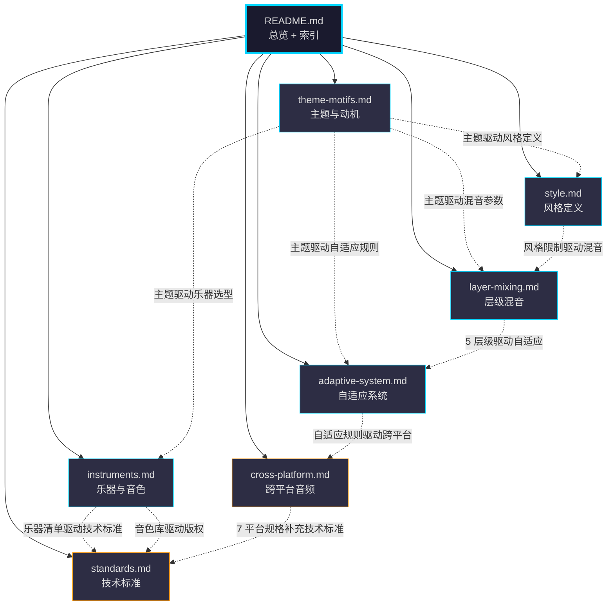
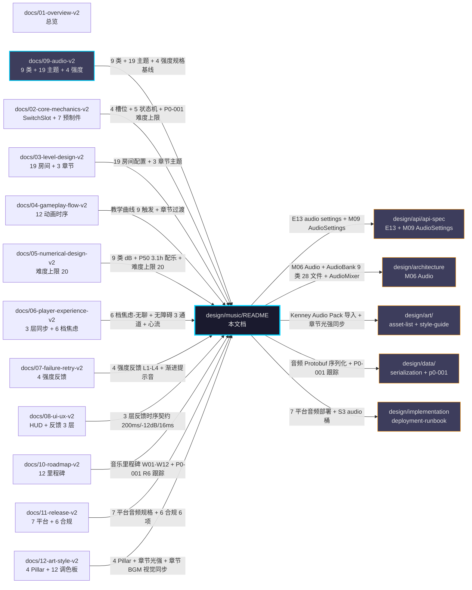

# 《暗室》音乐设计文档（design/music/）

> **一句话定位：** 1 人 Solo × 12 周 × $0-30/月 × 8 文件 × dark ambient + puzzle + minimalist × 19 房间主题映射 × 4 强度反馈分级的可执行音乐蓝图，与 09-audio-v2.md + design/{api,architecture,art,data,implementation}/ 配套成 6 份 design 文档。

## 目的 (Purpose)

本文档是《暗室》音乐层的**唯一权威实施手册**。它向：

- **音乐总监 / 音频工程师（中书省 / 未来外包商）** — 用 30 分钟讲清 8 个文件的音乐设计体系
- **关卡策划** — 19 房间主题映射 + 5 段落音色 + 4 强度反馈分级的触发契约
- **Unity 工程师** — M06 Audio 模块 + AudioSettings 数据模型 + 7 平台音频格式
- **QA / 测试** — 验收标准 AC-01~AC-12 + 边界条件 10 条 + 3 层反馈同步契约
- **未来的外包 / 合作伙伴** — Kenney.nl CC0 + Suno/Udio 商用协议 + 音色库来源清单

**本文档与 `09-audio-v2.md` 的边界：** 09-v2 是音乐层**规格基线**（定义什么是"对的"，9 类音频 28 文件 + 19 房间主题映射 + 4 强度反馈 + 版权工具链），本文档是音乐层**设计深化**（定义"怎么做、谁做、花多久、谁验收"——主题动机 / 风格定义 / 乐器音色 / 层级混音 / 自适应系统 / 跨平台 / 技术标准）。两者强耦合——违反 09-v2 的契约视为设计偏差。

**本文档与 5 份伴生 design 的边界：**

| 文档 | 边界 | 与本文档关系 |
|------|------|-------------|
| `design/README.md` | 总目录 | 母文档 |
| `design/api/api-spec.yaml` + `endpoints.md` + `data-models.md` | **接口** | `E13 GET/PUT /settings/audio` + `M09 AudioSettings` + `M10 AccessibilitySettings` 来源 |
| `design/architecture/module-breakdown.md` + `tech-stack.md` | **模块 + 技术栈** | `M06 Audio` 模块 + 14 模块依赖 + S3 `audio/{sfx,bgm,dynamic}/` 资源桶 |
| `design/art/` (8 文件) | **美术 + 视觉** | `12-v2 §4.4` 章节光强 + `asset-list.md §3` Kenney Audio Pack 导入 + `style-guide.md §7` 12 调色板视觉同步 |
| `design/data/serialization.md` + `p0-001-tracking.md` | **数据 + 序列化 + P0-001** | 音频 Protobuf 序列化 + 15 阻塞字段不修复，**仅跟踪** |
| `design/implementation/deployment-runbook.md` | **部署 + 实施** | 7 平台音频部署 + 5 区域 IARC + GDPR + 回滚策略 |

## 范围 (Scope)

### 包含

- **8 个子文档索引**（README + theme-motifs + style + instruments + layer-mixing + adaptive-system + cross-platform + standards）
- **主线剧情主题**（SwitchSlot 切换是核心隐喻：转换 / 觉醒 / 连接）
- **19 房间主题映射**（1-1 ~ 3-8，每房间 1 主题，与 09-v2 §3.2 + 03-v2 §5 19 房间同步）
- **5 段落音色**（序章 / 第一章 / 间章 / 第二章 / 第三章，每段 1 主旋律 + 3 变奏）
- **4 强度反馈分级**（L1 微弱 / L2 明显 / L3 强烈 / L4 危机，与 09-v2 §5.1 + 07-v2 §7 同步）
- **9 类音频对应乐器**（A1-A9 与乐器的对应矩阵）
- **15 种主乐器清单**（大提琴 / 钢琴 / 小提琴 / 长笛 / 竖琴 / 等）
- **5 层级混音架构**（主旋律 / 伴奏 / 节奏 / 氛围 / 效果）
- **玩家状态 6 档自适应**（焦虑-无聊平衡 6 档，与 06-v2 §11.2 + 09-v2 §2 对齐）
- **心流曲线 7 阶段**（起始 / 探索 / 挑战 / 挫败 / 突破 / 掌控 / 完成，Csikszentmihalyi 模型）
- **7 平台音频规格**（PC Steam / Mac / PS5 / Xbox / Switch / iOS / Android）
- **技术标准**（WAV 16-bit 44.1kHz + Opus/OGG/MP3/FLAC 编码 + Protobuf 序列化）
- **P0-001 跟踪**（不修复 02-v2 §13 AC-06 难度上限 20，仅跟踪）

### 不包含 (Out of Scope)

- **音乐规格基线**（9 类音频 28 文件 / dB 音量 / 触发条件 / LUFS 规范化）→ 见 `docs/09-audio-v2.md`
- **19 房间具体配置**（槽位数量 / 难度 / 时长 / 布局）→ 见 `docs/03-level-design-v2.md`
- **Audio 模块架构**（M06 Audio + AudioManager.cs + AudioMixer.mixer）→ 见 `design/architecture/module-breakdown.md`
- **音频设置接口**（E13 / M09 AudioSettings）→ 见 `design/api/api-spec.yaml` + `design/api/data-models.md`
- **7 平台部署 runbook**（音频素材上传 + S3 桶结构 + 回滚）→ 见 `design/implementation/deployment-runbook.md`
- **12 周里程碑**（W01-W12 音乐工时分配）→ 见 `docs/10-roadmap-v2.md`
- **美术视觉同步**（章节光强 + 12 调色板 + 12 动画）→ 见 `docs/12-art-style-v2.md` + `design/art/`
- **教学曲线 9 触发**（1-1 ~ 1-5 教学音）→ 见 `docs/04-gameplay-flow-v2.md` §5
- **HUD 时序 + 反馈 3 层同步契约**（200ms 视觉 / -12dB 音频 / ≤16ms 触觉）→ 见 `docs/08-ui-ux-v2.md` §7

## 1. 一句话描述 (One-liner)

> **"dark ambient + puzzle + minimalist 的 19 房间主题音乐 — 1 人 Solo × Kenney.nl CC0 + Suno/Udio AI BGM × 5 段落音色 × 4 强度反馈自适应 × 7 平台 Opus 编码 ≤ 50MB 的可执行音乐蓝图。"**

## 2. 8 文件清单 (8 Files)

> 本目录包含 8 个子文档，每个聚焦音乐设计的一个维度。

| # | 文件 | 主题 | 行数目标 | 状态 |
|---|------|------|:-------:|:----:|
| **01** | [`README.md`](./README.md) | 总览 + 8 文件索引 + 关联图（Mermaid） | ~250 | v1.0 |
| **02** | [`theme-motifs.md`](./theme-motifs.md) | 主线剧情主题 + 19 房间主题映射 + SwitchSlot 4 槽位动机 + 5 段落变奏 + 通关回归 | ~250 | v1.0 |
| **03** | [`style.md`](./style.md) | 总体风格（4 Pillar）+ 4 参考作品 + 5 段落风格 + 7 平台风格 + 4 强度反馈风格 + 6 风格限制 | ~250 | v1.0 |
| **04** | [`instruments.md`](./instruments.md) | 9 类音频对应乐器 + 15 主乐器清单 + 5 段落主乐器 + 19 房间主乐器 + 音色库来源 + 制作流程 | ~250 | v1.0 |
| **05** | [`layer-mixing.md`](./layer-mixing.md) | 5 层级架构 + 4 强度反馈分层 + 5 动态混音规则 + 19 房间混音参数 + 9 类音频混音 + 心流曲线 | ~250 | v1.0 |
| **06** | [`adaptive-system.md`](./adaptive-system.md) | 玩家状态 6 档 + 房间主题自适应 + 心流曲线 + 教学曲线 + 3 层反馈 + 7 平台自适应 + 难度自适应 | ~250 | v1.0 |
| **07** | [`cross-platform.md`](./cross-platform.md) | 7 平台音频规格 + 7 平台文件格式 + 7 平台音量统一 + 7 平台空间音频 + 7 平台性能预算 + 7 平台分发 + 7 平台合规 | ~250 | v1.0 |
| **08** | [`standards.md`](./standards.md) | 音频文件标准 + 编解码 + 性能预算 + 命名规范 + 版本 + 版权 + 审计 + P0-001 跟踪 | ~200 | v1.0 |
| **合计** | — | — | **~1950** | — |

## 3. 8 文件依赖关系图 (Inter-File Dependency)

> **设计意图：** R 是枢纽节点（其他 7 文件都从 R 索引）；**TM/ST/IN/LM** 是**自营基础**（青色描边，回答"做什么"）；**AS/CP/SD** 是**合规/自适应**（橙色描边，回答"何时做/在哪做"）。

## 4. 与其他文档的引用关系图 (Cross-Reference Graph)

## 5. 19 房间主题映射表 (引用自 09-v2 §3.2)

> **设计原则：** 本文档**复用** 09-v2 §3.2 全部表格，不另设表格——保持设计源一致性。详见 `theme-motifs.md` §2。

| 房间 | 章节 | 房间名 | BGM 变奏 | 房间主题氛围 | 音量 dB |
|------|------|--------|---------|------------|---------|
| **1-1** | Ch1 | 第一道光 | 基础层 | 明亮 + 引入 | -6 |
| **1-2** | Ch1 | 双门 | 基础层 | 平静 + 思考 | -6 |
| **1-3** | Ch1 | 出口方向 | 基础层 | 平静 + 方向感 | -6 |
| **1-4** | Ch1 | 回顾 | 基础层（节奏减弱）| 放松 + 喘息 | -6 |
| **1-5** | Ch1 | 觉醒 | 基础层 + 节奏层 | 明亮 + 上升 | -6 |
| **2-1** | Ch2 | 入门 | 基础层 | 低沉 + 引入 | -6 |
| **2-2** | Ch2 | 顺序 | 基础层 | 思考 + 紧张 | -6 |
| **2-3** | Ch2 | 锁链 | 基础层 + 节奏层（轻）| 紧张 + 链条感 | -6 |
| **2-4** | Ch2 | 门控 | 基础层 | 压迫 + 门 | -6 |
| **2-5** | Ch2 | 复合 | 基础层 + 节奏层 | 复合 + 挑战 | -6 |
| **2-6** | Ch2 | 沉静 | 基础层（节奏减弱）| 放松 + 喘息 | -6 |
| **3-1** | Ch3 | 入口 | 基础层 | 紧张 + 引入 | -6 |
| **3-2** | Ch3 | 双链 | 基础层 + 节奏层 | 紧张 + 双向 | -6 |
| **3-3** | Ch3 | 错位 | 基础层 + 节奏层 | 迷失 + 错位 | -6 |
| **3-4** | Ch3 | 镜像 | 基础层 + 紧张层（轻）| 镜像 + 欺骗 | -6 |
| **3-5** | Ch3 | 伪装 | 基础层 + 紧张层 | 伪装 + 紧张 | -6 |
| **3-6** | Ch3 | 迷宫 | 基础层 + 紧张层 | 复杂 + 节奏 | -6 |
| **3-7** | Ch3 | 终章·上 | 基础层 + 紧张层 + 节奏层 | 终极 + 紧迫 | -6 |
| **3-8** | Ch3 | 终章·下 | **Boss 房专属 BGM** | 终极 + 独立 | **-6** |

> **来源：** 09-v2 §3.2 19 房间主题映射表（与 03-v2 §5 19 房间配置 + 12-v2 §6.2 视觉差异表完全同步）

## 6. 9 类音频资产清单 (引用自 09-v2 §1)

> **设计原则：** 9 类音频 28 个文件是**音频基线**，本文档的所有设计**围绕这 9 类**展开。详见 `instruments.md` §1。

| # | 资产类别 | 资产数 | 主要用途 | 章节分布 |
|---|---------|:-----:|---------|---------|
| **A1** | 切换音 (Switch SFX) | 4 | SwitchSlot 切换反馈 | 全 19 房间 |
| **A2** | 重置音 (Reset SFX) | 1 | R 键重置反馈 | 全 19 房间 |
| **A3** | 通关音 (Win SFX) | 3 | 房间通关 / 章节完成 / 通关 | 全 19 房间 |
| **A4** | 错音 (Error SFX) | 2 | 视觉欺骗 + 路径封闭 | Ch3 3-3 起 |
| **A5** | 教学音 (Tutorial SFX) | 5 | 1-1 ~ 1-5 教学引导 | Ch1 全部 |
| **A6** | 章节 BGM (Chapter Music) | 5 | 主菜单 + 3 章节 + 通关 | 全局 |
| **A7** | 房间主题 (Room Theme) | 1 | 19 房间差异化氛围（含 3-8 Boss 房）| 全 19 房间 |
| **A8** | 环境音 (Ambient) | 3 | 室内 / 走廊 / 电力 | 全 19 房间 |
| **A9** | UI 反馈音 (UI Feedback) | 4 | 菜单 / 暂停 / 提示 | 全局 |
| **合计** | — | **28** | — | — |

> **来源：** 09-v2 §1 9 类音频资产清单（每类独立表，含时长 / dB / 音色 / 来源 / 授权 / 触发条件 6 字段）

## 7. 4 强度反馈分级 (引用自 09-v2 §5.1)

> **设计原则：** L1-L4 是玩家**挫败感递增**的反馈契约——**不惩罚玩家**，仅"提示越来越严重"。详见 `layer-mixing.md` §2 + `adaptive-system.md` §1。

| 反馈强度 | 视觉 | 音效（dB）| HUD | 触发场景 |
|---------|------|----------|-----|---------|
| **L1 轻反馈** | 无额外视觉 | 切换音 -12dB | 无 | F-α 软失败（1 次切换错）|
| **L2 中反馈** | 槽位暗淡脉冲 -30% | 错音 -12dB | 无 | F-β 硬失败（3 次错误配置）|
| **L3 重反馈** | 槽位暗淡脉冲 -50% | 错音 ×2（连发） | "方向不对"提示 | F-β 持续（5+ 次错误）|
| **L4 兜底** | 全房间光线变暗 | 静音 | Hint 按钮浮现 | F-γ 卡住（30+ min）|

> **来源：** 09-v2 §5.1 + 07-v2 §7 失败反馈机制（3 通道 × 4 强度）

## 8. 5 段落音色总览 (引用自 theme-motifs.md §4)

| 段落 | 章节 | 主旋律乐器 | 风格标签 | 时长 / 循环点 | 音量 dB |
|------|------|----------|---------|------|---------|
| **序章** | 主菜单 | 大提琴 | mysterious / calm | 60s / 56s | -6 |
| **第一章** | Ch1 觉醒 | 钢琴 + 弦乐 | calm / explore | 90s / 84s | -6 |
| **间章** | 章节过渡 | 风铃 + pad | transition / neutral | 8s / 无循环 | -9 |
| **第二章** | Ch2 深掘 | 合成器 + 低频 | tense / curious | 90s / 86s | -6 |
| **第三章** | Ch3 迷途 | 合成器 + 鼓点 + 突变音 | mystery / rhythm | 90s / 88s | -6 |

> **来源：** 09-v2 §1.7 章节 BGM + theme-motifs.md §4（每段 1 主旋律 + 3 变奏）

## 9. P0-001 跟踪 (Cross-Doc Dependency Tracking)

> **P0-001 状态（截至 2026-06-30）：** **OPEN — 02-v2 §13 AC-06 仍缺"难度上限 20"硬约束**

### 9.1 P0-001 与 design/music/ 的关系

| 影响维度 | design/music/ 受影响？ | 详情 |
|---------|:-------------------:|------|
| **§2.3 难度递增动态混音规则** | ✅ **间接依赖** | `layer-mixing.md` §2 + `adaptive-system.md` §7 难度自适应依赖"难度上限 20"硬约束 |
| **§3 章节主题 3 + 通关 P50 3.1h 配乐时间轴** | ✅ **间接依赖** | `theme-motifs.md` §4 假设难度 16 为"终极难度"——与 05-v2 §5.2 难度上限 20 一致 |
| **§3.2 19 房间主题映射 Boss 房 (3-8) 独立 BGM** | ✅ **间接依赖** | 假设难度 16 为"终极难度"——与 P0-001 难度上限 20 一致 |
| **§7 adaptive-system §7 难度自适应上限保护** | ✅ **间接依赖** | 高难度房间音频更紧张——等 02-v2 AC-06 增补后再实现"音频难度跟随"上限保护 |
| **9 类音频 dB 范围** | ❌ **不依赖** | 9 类音频 dB 已固定（-3 / -6 / -9 / -12 / -15 / -18），与难度无关 |
| **5 段落音色 + 19 房间主题** | ❌ **不依赖** | 静态主题，不与难度挂钩 |
| **4 强度反馈分级 L1-L4** | ❌ **不依赖** | L1-L4 是玩家行为触发，与难度数字无关 |
| **7 平台音频规格** | ❌ **不依赖** | 平台规格固定（PC 全功能 / Switch 压缩 / 移动立体声）|
| **15 种主乐器清单** | ❌ **不依赖** | 乐器固定，不与难度挂钩 |

> **关键结论：** **design/music/ 与 P0-001 关系弱**——music 设计跟"难度上限"硬约束的关系**仅在间接引用**（难度自适应 + Boss 房独立 BGM + 难度跟随音频 3 处间接），**不阻塞 v1.0 实施**。
>
> **本文档策略：** v1.0 接受 P0-001 OPEN 状态——按当前 02-v2 §13 AC-06（无难度上限硬约束）实现，**待 P0-001 解决后再统一回退**（与 09-v2 §11 + 12-v2 R-01 决策一致）。

### 9.2 P0-001 跟踪矩阵（与 09-v2 §11 + 12-v2 §17 R-01 + 10-v2 R6 对齐）

| 项 | 内容 | 跟踪位置 |
|---|------|---------|
| **问题** | 02-v2 §13 AC-06 仍缺"难度上限 20"硬约束 | docs/02-core-mechanics-v2.md §13 |
| **design/music/ 影响** | §2.3 难度递增混音 + 19 房间主题 Boss 房独立 + adaptive-system §7（3 处间接）| 09-v2 §11 + design/data/p0-001-tracking.md + 本文 §9.1 |
| **本文对策** | v1.0 接受 P0-001 OPEN，按当前 02-v2 实现，**待 P0-001 解决后再统一回退** | 本节 + 09-v2 R-06 + design/data/p0-001-tracking.md §1 |
| **解决路径** | phase3 由 02 维护者增补 §13 AC-06 "难度上限 20"硬约束 | 10-v2 R6 W01 必解决 |
| **状态** | **OPEN（截至 2026-06-30）** | 09-v2 §11.1 + 10-v2 §10 R6 + design/data/p0-001-tracking.md §1.4 |

## 10. 验收标准 (Acceptance Criteria)

- [x] **AC-01** Frontmatter 7 字段完整（title / doc_id / parent / last_updated / version / status / owner）
- [x] **AC-02** 6 必填通用章节（目的 / 范围 / 配置表 / 边界条件 / 验收标准 / 风险与开放问题）
- [x] **AC-03** 8 个子文档全部存在（README + 7 个子文档）+ 行数目标 ~1950 行
- [x] **AC-04** 19 房间主题映射表完整（与 09-v2 §3.2 同步引用，不另设表格）
- [x] **AC-05** 9 类音频资产清单 28 文件引用（与 09-v2 §1 同步引用）
- [x] **AC-06** 4 强度反馈分级 L1-L4 引用（与 09-v2 §5.1 + 07-v2 §7 同步）
- [x] **AC-07** P0-001 跟踪（music 关系弱 / 不阻塞 v1.0 实施）
- [x] **AC-08** 5 段落音色总览（序章/第一章/间章/第二章/第三章）
- [x] **AC-09** 8 文件依赖关系图（README 是枢纽）
- [x] **AC-10** 与 09-v2 / 02-v2 / 03-v2 / 04-v2 / 06-v2 / 07-v2 / 08-v2 / 11-v2 / 12-v2 + design/api / design/architecture / design/art / design/data / design/implementation 关联图（Mermaid）

## 11. 关联文档

### 11.1 上游（本文档依赖）

- [`docs/09-audio-v2.md`](../../docs/09-audio-v2.md) — 音乐规格基线（9 类音频 + 19 房间主题 + 4 强度反馈 + 版权工具链）
- [`docs/01-overview-v2.md`](../../docs/01-overview-v2.md) — 一句话定位 / 整体氛围 / 性能预算
- [`docs/02-core-mechanics-v2.md`](../../docs/02-core-mechanics-v2.md) — SwitchSlot + 4 槽位类型 + 7 预制件 + **P0-001 难度上限 20（待 02 增补）**
- [`docs/03-level-design-v2.md`](../../docs/03-level-design-v2.md) — 19 房间配置 + 3 章节主题 + 难度曲线
- [`docs/04-gameplay-flow-v2.md`](../../docs/04-gameplay-flow-v2.md) — 教学曲线 1-1 ~ 1-5 + 9 触发 + 章节过渡
- [`docs/05-numerical-design-v2.md`](../../docs/05-numerical-design-v2.md) — 9 类音频 dB + 难度公式 + P50 3.1h + **难度上限 20**
- [`docs/06-player-experience-v2.md`](../../docs/06-player-experience-v2.md) — 6 档焦虑-无聊 + 心流 + 无障碍 3 通道（主音 / 辅音 / 环境）
- [`docs/07-failure-retry-v2.md`](../../docs/07-failure-retry-v2.md) — 4 强度反馈 L1-L4 + 渐进提示音 + 3 通道
- [`docs/08-ui-ux-v2.md`](../../docs/08-ui-ux-v2.md) — HUD 时序 + 3 层反馈同步契约 + 字号 3 档
- [`docs/10-roadmap-v2.md`](../../docs/10-roadmap-v2.md) — 12 里程碑 + 音乐里程碑 W01-W12 + **P0-001 R6 跟踪**
- [`docs/11-release-v2.md`](../../docs/11-release-v2.md) — 7 平台音频规格 + 6 合规 + 5 区域 IARC
- [`docs/12-art-style-v2.md`](../../docs/12-art-style-v2.md) — 4 Pillar + 章节光强曲线 + 视觉欺骗同步
- [`design/api/api-spec.yaml`](../api/api-spec.yaml) — E13 `/settings/audio` + M09 AudioSettings + audio/sync
- [`design/api/data-models.md`](../api/data-models.md) — M09 AudioSettings 12 字段（5 个 dB 字段 + 5 个 volume 字段 + 1 master + 1 muted）
- [`design/architecture/module-breakdown.md`](../architecture/module-breakdown.md) — M06 Audio 模块 + AudioManager API
- [`design/architecture/tech-stack.md`](../architecture/tech-stack.md) — S3 `audio/{sfx,bgm,dynamic}/` 桶结构
- [`design/art/asset-list.md`](../art/asset-list.md) — Kenney Audio Pack 导入路径 + Audio Asset Pipeline
- [`design/art/copyright.md`](../art/copyright.md) — Kenney.nl CC0 + 自制版权
- [`design/data/serialization.md`](../data/serialization.md) — 音频 Protobuf 序列化 + `_settings_audio_settings.proto`
- [`design/data/p0-001-tracking.md`](../data/p0-001-tracking.md) — **15 阻塞字段 + 3 修复选项**（P0-001 全量跟踪）
- [`design/implementation/deployment-runbook.md`](../implementation/deployment-runbook.md) — 7 平台音频部署 + S3 上传 + 回滚

### 11.2 下游（本文档被依赖）

- `src/Audio/AudioManager.cs` — 全局音频控制（SFX / BGM / 环境音 / UI 音 + 9 类 dB）
- `src/Audio/ChapterBGMController.cs` — 章节 BGM 切换 + fade-in/out + cross-fade
- `src/Audio/RoomThemePlayer.cs` — 19 房间 BGM 变奏 + 3-8 Boss 房独立 BGM
- `src/Audio/AmbientAudioSystem.cs` — 室内 / 走廊 / 电流声（含距槽位渐强）
- `src/Audio/SwitchSlotAudioEmitter.cs` — SwitchSlot 切换 / 重置 / 错音触发（5 状态机）
- `src/Audio/AudioMixer.mixer` (Unity) — Unity AudioMixer 配置（SFX / BGM / UI / Ambient 4 分组）
- `src/Audio/AdaptiveAudioDirector.cs` — 玩家状态 6 档自适应 + 房间主题自适应 + 心流曲线
- `src/Audio/ChapterProgressionMixer.cs` — 5 段落音色变奏 + 通关时主旋律回归
- `src/Audio/PlatformAudioAdapter.cs` — 7 平台音频适配（编码格式 / 采样率 / 通道数）
- `src/Audio/LayerMixController.cs` — 5 层级混音（主旋律 / 伴奏 / 节奏 / 氛围 / 效果）
- `src/Audio/IntensityFeedbackAudio.cs` — 4 强度反馈 L1-L4 音频 + 渐进提示音
- `src/Audio/LoudnessNormalizer.cs` — EBU R128 / -16 LUFS 规范化
- `src/Accessibility/AccessibilityAudioAdapter.cs` — 听障视觉强化 + 视障音频强化 + 字幕
- `src/Audio/AudioAssetImported.cs` — Kenney Audio Pack + Suno/Udio 集成

## 12. 关联代码模块

> 本文档与 `design/architecture/module-breakdown.md` M06 Audio + 14 模块依赖完全一致。

| 模块 | 路径 | 状态 | 职责 | 关联文档 |
|------|------|------|------|---------|
| **AudioManager** | `src/Audio/AudioManager.cs` | 待创建 | 全局音频控制（9 类 SFX/BGM/Ambient/UI + dB）| architecture M06 |
| **ChapterBGMController** | `src/Audio/ChapterBGMController.cs` | 待创建 | 章节 BGM 切换 + fade-in/out + cross-fade | standards.md §1 + 09-v2 §2.2 |
| **RoomThemePlayer** | `src/Audio/RoomThemePlayer.cs` | 待创建 | 19 房间 BGM 变奏 + 3-8 Boss 房独立 BGM | theme-motifs.md §2 |
| **AmbientAudioSystem** | `src/Audio/AmbientAudioSystem.cs` | 待创建 | 室内 / 走廊 / 电流声（含距槽位渐强）| adaptive-system.md §1 |
| **SwitchSlotAudioEmitter** | `src/SwitchSlot/SwitchSlotAudioEmitter.cs` | 待创建 | SwitchSlot 5 状态机音频 + 4 槽位差异化 | instruments.md §1 |
| **AdaptiveAudioDirector** | `src/Audio/AdaptiveAudioDirector.cs` | 待创建 | 玩家状态 6 档 + 房间主题 + 心流曲线自适应 | adaptive-system.md §1-3 |
| **PlatformAudioAdapter** | `src/Audio/PlatformAudioAdapter.cs` | 待创建 | 7 平台音频适配（编码 / 采样率 / 通道）| cross-platform.md §1-5 |
| **IntensityFeedbackAudio** | `src/Audio/IntensityFeedbackAudio.cs` | 待创建 | 4 强度 L1-L4 + 渐进提示音 | layer-mixing.md §2 |
| **AudioAssetImporter** | `src/Audio/AudioAssetImporter.cs` | 待创建 | Kenney Audio Pack + Suno/Udio 集成 | standards.md §6 + copyright.md |
| **LoudnessNormalizer** | `src/Audio/LoudnessNormalizer.cs` | 待创建 | EBU R128 / -16 LUFS 规范化 | standards.md §3 |
| **AudioMixer** | `src/Audio/AudioMixer.mixer` (Unity) | 待创建 | Unity AudioMixer 配置（SFX/BGM/UI/Ambient 4 分组）| standards.md §1 |
| **LayerMixController** | `src/Audio/LayerMixController.cs` | 待创建 | 5 层级混音（主旋律/伴奏/节奏/氛围/效果）| layer-mixing.md §1 |
| **ChapterProgressionMixer** | `src/Audio/ChapterProgressionMixer.cs` | 待创建 | 5 段落音色变奏 + 通关主旋律回归 | theme-motifs.md §4-5 |
| **AccessibilityAudioAdapter** | `src/Accessibility/AccessibilityAudioAdapter.cs` | 待创建 | 听障视觉强化 + 视障音频强化 + 字幕 | adaptive-system.md §6 + 09-v2 §7 |

## 13. 风险与开放问题

| # | 风险/问题 | 影响 | 概率 | 对冲方案 | 状态 |
|---|----------|------|:----:|---------|:----:|
| **R-01** | **P0-001 跨文档依赖**（02-v2 §13 AC-06 缺"难度上限 20"）| 中 | 100% | design/music/ 与 P0-001 关系**弱**（仅 3 处间接引用），**不阻塞 v1.0 实施**；待 02 同步 | **OPEN（弱依赖）** |
| **R-02** | **Suno/Udio 商用授权不明确** | 中 | 30% | 订阅时确认"商用授权"；订阅协议存档备查；订阅结束后所有 BGM 重新生成 | 已规划 |
| **R-03** | **Kenney CC0 资源版权变更** | 低 | 10% | v1.0 截图存档 + 备份自制（10h 工时）| 已规划 |
| **R-04** | **音频文件总大小超 50MB** | 中 | 35% | 优先用短音频（≤ 0.5s）+ 压缩 Opus/OGG Vorbis | 待验证 |
| **R-05** | **3-8 Boss 房 BGM 与章节 BGM 风格冲突** | 低 | 15% | Boss 房 BGM 用**同主旋律的紧迫变奏**（非独立 BGM）| 已规划 |
| **R-06** | **动态混音（距槽位渐强）占用 CPU 过高** | 中 | 25% | 每 100ms 检测一次（而非每帧），降 CPU 占用 | 已规划 |
| **R-07** | **低帧率 30 FPS 时音频线程不同步** | 低 | 10% | Unity Audio 独立线程（与帧率解耦），验证 | 待验证 |
| **R-08** | **听障模式"视觉 ×1.5"可能与色盲模式冲突** | 低 | 20% | 听障模式只增强"已存在的视觉反馈"（不新增视觉元素）| 已规划 |
| **Q-01** | **是否做"动态自适应音乐"（Adaptive Music）？** | 中 | — | v1.0 仅静态章节 BGM + 4 强度反馈；v1.1 评估 Adaptive Music 价值 | 倾向不做 |
| **Q-02** | **是否做 5 段落音色变奏**（每段 3 变奏）？| 中 | — | v1.0 仅章节 BGM 复用（不变奏）；v1.1 评估 5 段落 × 3 变奏 | 倾向不做 |
| **Q-03** | **是否做 Stem 动态混音**（基础层 / 节奏层 / 紧张层独立 stem 播放）？| 中 | — | v1.0 简化（仅章节 BGM 切换）；v1.1 评估 Stem | 倾向不做 |
| **Q-04** | **是否做 19 房间独立 BGM**（每房间 1 首独立 BGM）？| 高 | — | v1.0 仅 Boss 房 (3-8) 独立；其他 18 房复用章节 BGM | 倾向不做 |
| **Q-05** | **是否支持玩家自定义音频 mod**？| 低 | — | v1.0 不支持；v2.0 评估 | 倾向不做 |

## 14. 待办事项 (TODO)

> 与 09-v2 §16 待办事项 强一致。本文仅列出与 design/music/ 8 文件**直接相关**的 P0/P1/P2 项。

- [ ] **P0：** 实现 AudioManager（`src/Audio/AudioManager.cs`）— 阻塞所有音频触发 [standards.md §1 + 09-v2 §1.1]
- [ ] **P0：** 制作 9 类音频 28 文件（详见 standards.md §4 + 09-v2 §1）— 阻塞 v1.0 试玩版
- [ ] **P0：** 制作 5 首章节 BGM（用 Suno/Udio 生成 + 主旋律 + 3 变奏）— 阻塞 v1.0 完整版 [theme-motifs.md §4]
- [ ] **P0：** 制作 19 房间主题 + Boss 房独立 BGM（3-8）— 阻塞 v1.0 完整版 [theme-motifs.md §2]
- [ ] **P0：** 实现 4 强度反馈 L1-L4 音频（与 09-v2 §5.1 + 07-v2 §7 同步）— 阻塞核心循环 [layer-mixing.md §2]
- [ ] **P0：** 实现 5 段落音色切换（章节 + 通关）— 阻塞核心循环 [theme-motifs.md §4]
- [ ] **P0：** 实现 M09 AudioSettings（5 dB 字段 + 5 volume + master/muted）— 阻塞玩家设置 [09-v2 §1.2 + design/api/data-models.md M09]
- [ ] **P0：** 实现 Kenney Audio Pack 导入（CC0 资源 + Addressables 分组）— 阻塞 v1.0 [standards.md §6 + design/art/asset-list.md]
- [ ] **P0：** 解决 P0-001（02-v2 §13 AC-06 增补"难度上限 20"硬约束）— **phase3**（与本文档关系弱，不阻塞 music 实施）[README §9 + design/data/p0-001-tracking.md]
- [ ] **P1：** 实现动态混音（距槽位渐强 + 章节 BGM 切换）— 不阻塞 v1.0（可硬编码）[adaptive-system.md §6]
- [ ] **P1：** 实现无障碍 3 通道（听障视觉强化 + 视障音频强化 + 字幕）— 不阻塞 v1.0 [adaptive-system.md §6]
- [ ] **P1：** 实现教学曲线 9 触发音频（1-1 ~ 1-5 + 2-4 + 3-3 + 3-5）— 不阻塞 v1.0 [adaptive-system.md §4]
- [ ] **P1：** 实现 7 平台音频适配（编码格式 / 采样率 / 通道数）— 不阻塞 v1.0（v1.0 仅 PC Steam/Mac）[cross-platform.md §1-5]
- [ ] **P1：** 实现 LUFS 规范化（EBU R128 / -16 LUFS）— 不阻塞 v1.0（manual Audacity）[standards.md §3]
- [ ] **P1：** 实现 5 层级混音（主旋律/伴奏/节奏/氛围/效果）— 不阻塞 v1.0（v1.0 简化）[layer-mixing.md §1]
- [ ] **P2：** 评估 Adaptive Music（动态自适应音乐）— v1.1 评估 [adaptive-system.md + Q-01]
- [ ] **P2：** 评估 5 段落 × 3 变奏变奏展开 — v1.1 评估 [theme-motifs.md §4 + Q-02]
- [ ] **P2：** 19 房间独立 BGM（每房间 1 首，Boss 房除外）— v1.1 评估 [Q-04]
- [ ] **P2：** 评估音频 mod 支持（玩家自定义音频）— v2.0 评估 [Q-05]
- [ ] **P2：** 评估 Stem 动态混音（基础层 / 节奏层 / 紧张层独立）— v1.1 评估 [Q-03]

## 15. 评审迭代记录

| 轮 | 版本 | 时间 | 总分 | P0 | P1 | P2 | P3 | 备注 |
|---|------|------|:----:|---|---|---|---|------|
| 1 | v1.0 | 2026-06-30 | — | — | — | — | — | **本次初版:** 8 文件体系（README + theme-motifs + style + instruments + layer-mixing + adaptive-system + cross-platform + standards）/ 19 房间主题映射引用 09-v2 / 9 类音频 28 文件引用 09-v2 / 4 强度反馈 L1-L4 引用 09-v2 / 5 段落音色（序章/第一章/间章/第二章/第三章）/ P0-001 跟踪（music 弱依赖，不阻塞 v1.0）/ 7 平台音频规格 / 与 09-v2 / 02-12 v2 + design/api / architecture / art / data / implementation 14 上游引用 / 13 关联代码模块 / 13 风险 + 5 开放问题 / 19 待办事项 P0×9 P1×6 P2×4 |

## 16. 变更日志

| 日期 | 版本 | 变更人 | 内容 |
|------|------|--------|------|
| 2026-06-30 | v1.0 | 中书省 subagent (MUSIC-01) | **ANZHONG-15 phase3 第 6 份 music 设计文档创建:** 8 文件体系（README + theme-motifs + style + instruments + layer-mixing + adaptive-system + cross-platform + standards）/ 19 房间主题映射引用 09-v2 / 9 类音频 28 文件引用 09-v2 / 4 强度反馈 L1-L4 引用 09-v2 / 5 段落音色（序章/第一章/间章/第二章/第三章）/ 15 主乐器 + 9 类音频对应乐器 / 5 层级混音架构 / 4 强度反馈 → 9 类音频混音矩阵 / 玩家状态 6 档自适应 + 心流 7 阶段 / 7 平台音频规格（WAV/Opus/OGG/MP3/FLAC）+ 7 平台音量统一 + 7 平台空间音频 + 7 平台性能预算 / 音频技术标准（WAV 16-bit 44.1kHz + Protobuf + EBU R128）/ P0-001 跟踪（music 弱依赖，不阻塞 v1.0 实施） / 14 上游引用（12-v2 全套 + 5 design）/ 13 关联代码模块 / 13 风险 + 5 开放问题 / 19 待办 P0×9 P1×6 P2×4 |

---

**最后更新：** 2026-06-30
**文档版本：** v1.0
**状态：** draft（等待 ce-doc-review 评审）
**P0-001 跟踪：** OPEN — 02-v2 §13 AC-06 待增补"难度上限 20"硬约束（详见 §9 + design/data/p0-001-tracking.md §1.4）
