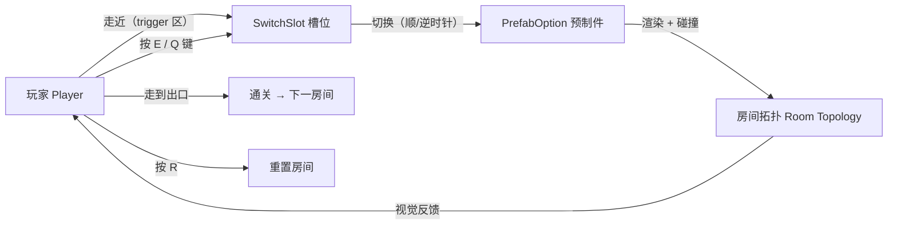
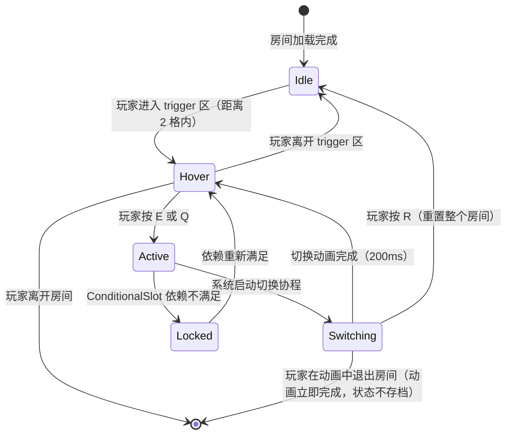
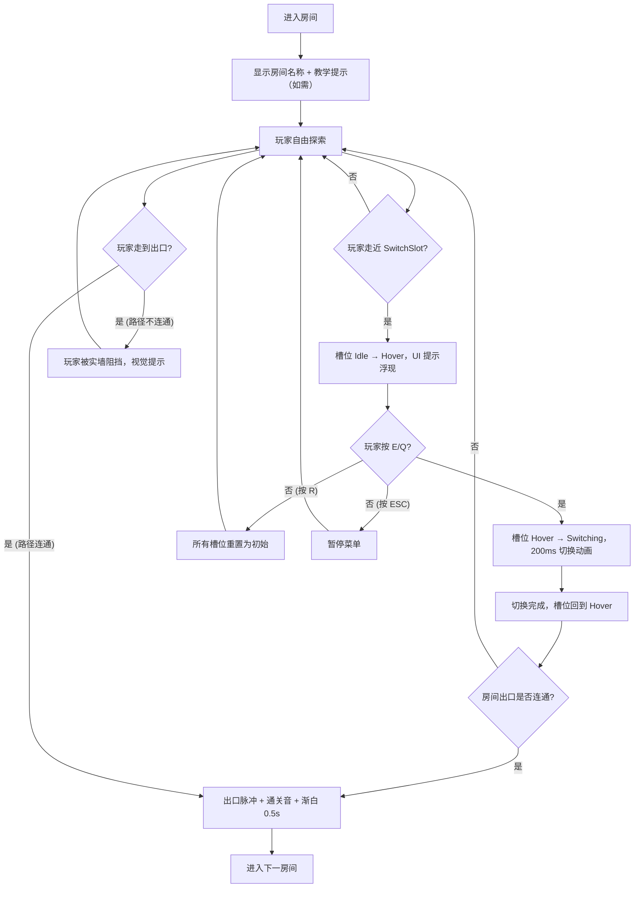
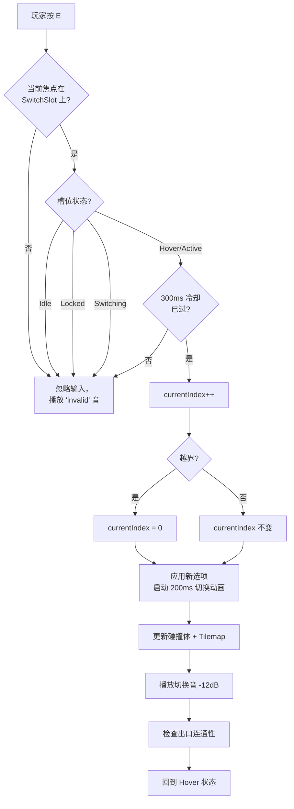
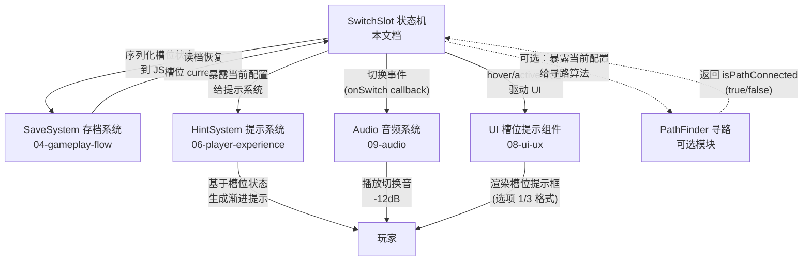

# 《暗室》核心玩法

> **一句话总结：** 通过切换房间中的"预制件槽位（SwitchSlot）"，重塑空间拓扑，开辟通往出口的路径。**无战斗、无成长、无死亡**——纯空间逻辑推理 + 即时视觉反馈。

## 目的 (Purpose)

本文档是《暗室》核心机制的**权威定义**。它向工程师、关卡策划、美术总监、玩家代理、测试玩家**用 30 分钟讲清**：

- "切换房间"这一核心机制**的完整 I/O 链路**（玩家输入 → 系统状态 → 视觉/音效反馈）
- **SwitchSlot 状态机**的所有合法状态、转换条件、转换触发器
- **4 种槽位类型 + 7 种预制件**的行为契约
- **房间解谜循环**的标准时序和"何时通关"
- **示例谜题**作为关卡设计（03）和玩法验证（test）的契约基准
- **边界条件、性能约束、关联机制**——让技术实现一次到位

其他 11 份文档（01, 03-12）以本文档为**机制层基线**：违反本定义的关卡/UI/数值/美术实现视为偏差。

## 范围 (Scope)

### 包含

- **SwitchSlot 状态机**（Mermaid 状态图 + 状态转移矩阵 + 触发器表）
- **4 种槽位类型**（ToggleSlot / CycleSlot / ConditionalSlot / LockedSlot）的完整行为契约
- **7 种预制件类型**（SolidWall / Floor / GlassWall / Door / CrumblingFloor / FakeFloor / PressurePlate）的行为契约
- **玩家操作 I/O Spec**（按键 → 系统状态 → 视觉/音效 4 列表）
- **房间解谜循环**（进入→观察→切换→验证→通关）的标准时序
- **示例谜题 4 个**（1-1 / 1-2 / 1-3 / 2-3）作为关卡设计契约
- **切换规则决策树**（按下 E 后系统内部决策路径）
- **性能约束**（切换响应 / 槽位上限 / 帧率下限）
- **边界条件 10 条**（动画中退出、依赖对象消失、低帧率、连按等）
- **关联机制图**（与 SaveSystem / HintSystem / Audio / UI 的依赖关系）

### 不包含 (Out of Scope)

- 具体房间的关卡设计 → 见 `03-level-design-v2.md`
- 全局游戏状态机（MENU / CHAPTER SELECT / ROOM PLAYING / WIN / PAUSE）→ 见 `04-gameplay-flow-v2.md`
- 数值公式与调参策略（难度系数、切换次数上限）→ 见 `05-numerical-design-v2.md`
- 玩家情绪曲线、顿悟时刻、压力源 → 见 `06-player-experience-v2.md`
- "无失败"设计决策的详细论证 → 见 `07-failure-retry-v2.md`
- 槽位 UI 组件 4 态（normal/hover/disabled/active）→ 见 `08-ui-ux-v2.md`
- 切换音效的音色与音量 → 见 `09-audio-v2.md`
- 美术风格、配色 → 见 `12-art-style-v2.md`

## 1. 核心机制总览

### 1.1 一句话机制

> 玩家在房间中通过**走近 + 按键**激活**预制件槽位（SwitchSlot）**，系统**循环切换**槽位内的**预制件（PrefabOption）**，使房间**地板/墙/门**等结构实时变化，玩家**视觉判断**从入口到出口的连通性，**走到出口**即通关。

### 1.2 三要素图（Mermaid）



**关键不变量：**
- ✅ **无失败状态** — 玩家可无限切换、随时重置，永远不会"Game Over"
- ✅ **纯视觉验证** — 连通性判断不依赖寻路算法，靠玩家肉眼判断（地板颜色/发光指引）
- ✅ **200ms 即时反馈** — 每次切换后 ≤ 200ms 必有视觉变化（淡出淡入 + 发光增强）

## 2. SwitchSlot 状态机

### 2.1 状态总览（Mermaid）



### 2.2 状态转移矩阵

| From \ To       | Idle | Hover | Active | Switching | Locked |
|-----------------|:----:|:-----:|:------:|:---------:|:------:|
| **Idle**        | —    | 玩家进入 trigger 区 | ❌ | ❌ | ❌ |
| **Hover**       | 玩家离开 trigger 区 | — | 玩家按 E/Q | ❌ | ConditionalSlot 依赖丢失 |
| **Active**      | ❌   | 切换动画开始 | — | 进入 Switching | ConditionalSlot 依赖丢失 |
| **Switching**   | 玩家按 R | 切换完成（200ms） | ❌ | — | ❌ |
| **Locked**      | ❌   | 依赖重新满足 | ❌ | ❌ | — |

### 2.3 状态描述表

| 状态 | 玩家视角 | 系统行为 | 视觉表现 |
|------|---------|---------|---------|
| **Idle** | 看不见槽位（或极弱标记） | 无事件处理、不占 CPU | 槽位半透明（30% 不透明度）、无发光 |
| **Hover** | 槽位清晰可见，提示当前选项 | 监听 E/Q/R 键 | 槽位发光（青色脉冲）、UI 提示框浮现 |
| **Active** | 玩家已按键，等待反馈 | 启动切换协程 | 槽位高亮（青色实色）、预制件开始淡出 |
| **Switching** | 看到切换动画 | 0.2s 协程执行（淡出 + 切换 + 淡入） | 旧预制件淡出（0.1s）→ 新预制件淡入（0.1s）+ 切换音效 |
| **Locked** | 槽位呈灰色，提示"未解锁" | 拒绝 E/Q 输入、给出"等待依赖槽位"提示 | 灰色 + 锁图标 + 不响应输入 |

### 2.4 状态转换触发器

| 触发器 | 源状态 | 目标状态 | 条件 |
|--------|-------|---------|------|
| **玩家进入 trigger 区** | Idle | Hover | 距离 ≤ 2 格（tilemap） |
| **玩家离开 trigger 区** | Hover | Idle | 距离 > 2 格 |
| **玩家按 E** | Hover | Switching | 当前选项 → 下一个选项（顺时针） |
| **玩家按 Q** | Hover | Switching | 当前选项 → 上一个选项（逆时针） |
| **切换动画完成** | Switching | Hover | 200ms 计时器到 |
| **玩家按 R** | 任意 | Idle | 房间内所有槽位重置为初始选项 |
| **依赖槽位状态变化** | Hover / Active | Locked | ConditionalSlot 的 dependsOnSlotId 不在 unlockedByState 列表 |
| **依赖重新满足** | Locked | Hover | ConditionalSlot 依赖条件重新满足 |
| **玩家离开房间** | 任意 | — | 场景卸载，所有状态丢弃 |
| **玩家在 Switching 中退出** | Switching | — | 动画立即完成（不卡死），状态不存档 |

## 3. 输入/输出定义 (I/O Spec)

### 3.1 玩家输入 → 系统状态 → 视觉/音效 4 列表

| 玩家输入 | 上下文 | 系统状态变化 | 视觉反馈 | 音效反馈 |
|---------|-------|------------|---------|---------|
| **WASD / 方向键** | 任意房间状态 | 玩家位置更新（≤ 16ms） | 玩家精灵位移 | 脚步声（仅在 Floor 上） |
| **E 键** | Hover 状态 | 触发切换，进入 Switching | 槽位发光增强 + 旧预制件淡出 | 切换音（咔哒，-12dB） |
| **Q 键** | Hover 状态 | 触发反向切换，进入 Switching | 同上 | 同上 |
| **R 键** | 任意状态 | 房间内所有 SwitchSlot 重置为初始选项 | 所有槽位淡出淡入到初始状态（0.3s） | 重置音（低沉脉冲，-18dB） |
| **ESC 键** | 任意状态 | 进入暂停菜单 | 游戏画面半透明（30%）+ 暂停菜单浮现 | 暂停音（-15dB） |
| **走近 SwitchSlot**（自动） | 任意 | 槽位状态 Idle → Hover | 槽位从 30% → 100% 不透明度 + 青色脉冲 | 无（仅视觉） |
| **离开 SwitchSlot**（自动） | Hover | 槽位状态 Hover → Idle | 槽位淡出 | 无 |
| **走到出口** | 路径连通 | 房间通关 → 加载下一房间 | 出口脉冲 + 屏幕渐白 0.5s | 通关音（上升音阶，-6dB） |
| **走到 FakeFloor** | 误踩 | 视觉欺骗反馈（不掉血，无惩罚） | FakeFloor 闪烁红色 0.3s | 短促错音（-12dB） |

### 3.2 输入防误触

| 规则 | 阈值 | 原因 |
|------|------|------|
| **连按 E/Q 冷却** | 300ms 内只触发 1 次切换 | 防玩家焦虑时连按导致动画错乱 |
| **R 键冷却** | 500ms 内只触发 1 次重置 | 防快速重置导致视觉混乱 |
| **ESC 冷却** | 无 | 暂停菜单必须随时可调出 |

## 4. 槽位类型（SwitchSlot）详解

### 4.1 ToggleSlot — 二选一

| 字段 | 内容 |
|------|------|
| **行为** | 二选一切换（A ↔ B） |
| **选项数** | 固定 2 个 |
| **典型用途** | 基础切换（地板 ↔ 墙） |
| **首次引入** | 房间 1-1 |
| **数据契约** | `List<PrefabOption> options` length = 2 |
| **视觉契约** | 切换时短暂高亮，提示"已切换" |

**示例：** 房间 1-1 入口处的 ToggleSlot，提供"地板"和"实墙"二选一，玩家按 E 切换后，原本被墙堵住的路径变为地板，玩家可走到出口。

### 4.2 CycleSlot — 循环切换

| 字段 | 内容 |
|------|------|
| **行为** | 循环切换（A → B → C → ... → A） |
| **选项数** | 3 ~ 4 个 |
| **典型用途** | 多选项中选 1（如 3 种门类型） |
| **首次引入** | 房间 1-3 |
| **数据契约** | `List<PrefabOption> options` length ∈ [3, 4] |
| **视觉契约** | UI 提示显示"1/3 → 2/3 → 3/3 → 1/3"循环图标 |

**示例：** 房间 1-3 的 CycleSlot 提供"地板 / 实墙 / 机关门"3 选项，玩家需切换到"机关门"才能打开出口（机关门需要另一槽位配合关闭锁）。

### 4.3 ConditionalSlot — 条件解锁

| 字段 | 内容 |
|------|------|
| **行为** | 依赖另一槽位（`dependsOnSlotId`）的状态；依赖满足时显示全部选项，依赖不满足时部分选项被锁定 |
| **选项数** | 2 ~ 4 个，其中 1 ~ 2 个标记为"条件选项" |
| **典型用途** | 时序开关（先开 A → 才能用 B 的高级选项） |
| **首次引入** | 房间 2-1 |
| **数据契约** | `dependsOnSlotId: string` + `unlockedByState: List<int>`（依赖槽位的哪些 currentIndex 满足时解锁） |
| **视觉契约** | 依赖未满足时，条件选项呈灰色 + 锁图标；依赖满足时解锁并加入循环 |

**示例：** 房间 2-1 中 ConditionalSlot A 的"机关门"选项需要 Slot B 处于"激活"态才解锁；玩家需先切换 B 才能在 A 看到"机关门"选项。

### 4.4 LockedSlot — 需完成目标激活

| 字段 | 内容 |
|------|------|
| **行为** | 需要先完成房间内特定目标才可激活（如走到房间某位置 / 触发某事件） |
| **选项数** | 1 ~ 4 个（激活后才有选项可切） |
| **典型用途** | 阶段性解锁（先观察拓扑 → 再切换） |
| **首次引入** | 房间 2-3（受 03-level-design 安排） |
| **数据契约** | `unlockCondition: string`（如 "ReachPosition(5,3)" / "TriggerEvent('plate_pressed')"） |
| **视觉契约** | 未激活时槽位不可见 + 不响应输入；激活后从灰色变青色 |

**示例：** 房间 2-3 中 LockedSlot 在玩家踩下 PressurePlate 后才出现在房间中央；激活后提供"地板 / 机关门"选项让玩家切换。

### 4.5 槽位类型对比表

| 类型 | 选项数 | 依赖关系 | 首次引入 | 教学房间 |
|------|-------|---------|---------|---------|
| **ToggleSlot** | 2 | 无 | 1-1 | 1-1（试错 1 次即懂） |
| **CycleSlot** | 3-4 | 无 | 1-3 | 1-3（理解"循环"概念） |
| **ConditionalSlot** | 2-4 | 依赖另一槽位 | 2-1 | 2-1（理解"先 A 后 B"） |
| **LockedSlot** | 1-4 | 需完成目标 | 2-3 | 2-3（理解"先观察后切换"） |

## 5. 预制件类型（PrefabOption）详解

### 5.1 预制件类型总表

| 类型 | 视觉效果 | 行为契约 | 玩家可通行 | 数据字段 |
|------|---------|---------|:---------:|---------|
| **SolidWall** | 深灰色实墙（#3D3D5C） | 阻挡移动 | ❌ | `isWalkable: false` |
| **Floor** | 地板色（#2D2D44） | 正常地面 | ✅ | `isWalkable: true` |
| **GlassWall** | 半透明蓝色（rgba 30%, 144, 200, 255） | **可通行**但视觉上有阻挡感 | ✅ | `isWalkable: true, isTransparent: true` |
| **Door** | 门框（开/闭 2 态） | 关闭时不可通行，开启后可通行 | 条件 | `isWalkable: dependsOn` |
| **CrumblingFloor** | 碎裂地板纹理 | 踩上去后 0.5s 碎裂消失（一次性） | ✅（仅 1 次） | `isWalkable: true (1-time)` |
| **FakeFloor** | 与 Floor 外观完全相同 | 实际为 SolidWall，玩家视觉上误判 | ❌ | `isWalkable: false (视觉欺骗)` |
| **PressurePlate** | 压力板（圆形发光标记） | 踩下时触发联动事件 | ✅ | `isWalkable: true, onStep: Event` |

### 5.2 预制件边界规则

| 规则 | 说明 |
|------|------|
| **FakeFloor 必须视觉不可辨** | 与 Floor 的 sprite 必须完全一致（包括边缘和颜色），否则失去"视觉欺骗"意义 |
| **CrumblingFloor 一次性** | 碎裂后变为不可通行的"洞"，房间重置后恢复 |
| **GlassWall 半透明** | 玩家可穿行，但视觉上像墙，用于"心理门槛"（不阻挡但暗示危险） |
| **PressurePlate 状态可重置** | 重置房间后压力板恢复未踩状态 |
| **Door 开关状态可持久** | 重置房间后 Door 状态不重置（保持切换结果），便于玩家基于历史状态推理 |

### 5.3 预制件类型与槽位类型的组合矩阵

| 预制件 \ 槽位 | Toggle | Cycle | Conditional | Locked |
|--------------|:------:|:-----:|:-----------:|:------:|
| **SolidWall** | ✅ | ✅ | ✅ | ✅ |
| **Floor** | ✅ | ✅ | ✅ | ✅ |
| **GlassWall** | ⚠️ 慎用 | ✅ | ✅ | ⚠️ |
| **Door** | ✅ | ✅ | ✅（常作为"条件选项"）| ✅ |
| **CrumblingFloor** | ⚠️ | ✅ | ✅ | ⚠️ |
| **FakeFloor** | ❌（无意义） | ✅ | ✅ | ✅ |
| **PressurePlate** | ❌ | ✅ | ✅（作为联动目标） | ✅ |

> **矩阵说明：** ✅ 推荐组合；⚠️ 慎用（需关卡设计验证）；❌ 不推荐（机制不兼容或无意义）。

## 6. 房间解谜循环

### 6.1 标准循环（Mermaid）



### 6.2 循环时序约束

| 阶段 | 耗时 | 可中断？ |
|------|------|---------|
| 进入房间 + 教学提示显示 | ≤ 500ms | ❌（必须等动画完成） |
| 玩家自由探索 | 无上限 | ✅（随时可触发其他动作） |
| 槽位 Hover 响应 | ≤ 50ms | ✅ |
| 切换动画（Switching） | 200ms ± 50ms | ❌（动画期间输入被锁定） |
| 连通性验证 | 0ms（即时） | — |
| 通关过渡（渐白 + 加载） | ≤ 1000ms | ❌ |

### 6.3 通关判定

| 条件 | 说明 |
|------|------|
| **玩家位置 = 出口位置** | 玩家中心点进入出口 tile 中心 |
| **出口处于"连通"态** | 出口 tile 的 isWalkable = true（无实墙/锁住的门阻挡） |
| **所有 LockedSlot 已激活** | 房间内 LockedSlot 必须全部达到"激活"态（房间设计要求） |

## 7. 切换规则决策树

### 7.1 按下 E 后的系统决策路径



### 7.2 切换时序约束

| 步骤 | 时长 | 是否阻塞玩家移动 |
|------|------|:---------------:|
| 按键接收 | ≤ 16ms（1 帧） | ❌ |
| 冷却检查 | 0ms | ❌ |
| 选项更新 | 0ms | ❌ |
| 旧预制件淡出 | 100ms | ✅（玩家不可移动） |
| 新预制件淡入 | 100ms | ✅ |
| 碰撞体更新 | 0ms（在淡入完成后） | ✅ |
| 音效播放 | 0ms（与淡出同步） | ❌ |
| 状态回归 Hover | 0ms | ❌ |
| **总时长** | **200ms ± 50ms** | **200ms 阻塞** |

> **关键决策：** 切换动画期间玩家**不可移动**——避免动画中玩家位置与新碰撞体不一致导致穿墙/卡墙。

## 8. 示例谜题

### 8.1 示例 1-1：单槽位 ToggleSlot 教学

```
房间布局（俯视图 6x4）：
┌─────────────────────────┐
│ [玩家]                  │
│      ┌───────┐          │
│      │ Solid │          │
│      │ Wall  │          │
│      │ (初始)│          │
│      └───────┘          │
│                         │
│                [出口]   │
└─────────────────────────┘

槽位 A（坐标 3,2）：ToggleSlot [SolidWall, Floor]
- 初始：SolidWall（墙堵住）
- 玩家按 E → Floor（路径打通）
- 玩家走到出口 → 通关
```

**设计意图：** 教学"切换 = 改变房间拓扑"的最基础概念。无失败风险，玩家试错 1 次即懂。

### 8.2 示例 1-2：双槽位组合

```
房间布局（俯视图 8x4）：
┌────────────────────────────────┐
│ [玩家]                         │
│   ┌───┐           ┌───┐        │
│   │ A │ SolidWall │ B │        │
│   │   │ (初始)    │   │        │
│   └───┘           └───┘        │
│         (路径被两段墙堵)        │
│                                │
│                [出口]          │
└────────────────────────────────┘

槽位 A（坐标 2,2）：ToggleSlot [SolidWall, Floor]
槽位 B（坐标 6,2）：ToggleSlot [SolidWall, Floor]
- 初始：A = Wall, B = Wall（路径全堵）
- 通关条件：A = Floor AND B = Floor
- 玩家需要同时切换两个槽位
```

**设计意图：** 教学"多槽位组合"概念。玩家需理解"两个槽位同时正确"才能通关。预期切换次数：2-4 次。

### 8.3 示例 1-3：引入 CycleSlot

```
房间布局（俯视图 10x4）：
┌──────────────────────────────────────┐
│ [玩家]                               │
│                                      │
│   [Slot A]  [Slot B]  [Slot C]      │
│   地板/墙/  地板/墙/  地板/墙/        │
│   机关门   机关门    SolidWall        │
│   (3选1)  (3选1)   (3选1)             │
│                                      │
│              [出口]                  │
│       (出口被实墙 + 锁住门堵)         │
└──────────────────────────────────────┘

槽位 A、B、C（坐标 2/5/8, 3）：CycleSlot [Floor, SolidWall, Door]
- 通关条件：A = Door AND B = Floor AND C = Floor（出口前一段是门+两段地板）
```

**设计意图：** 引入 CycleSlot 的"循环"概念（每个槽位 3 选项，3^3 = 27 种组合，**穷举不现实**——这是防"无脑乱按"的设计）。

### 8.4 示例 2-3：ConditionalSlot + LockedSlot 联动

```
房间布局（俯视图 12x6）：
┌────────────────────────────────────────────┐
│ [玩家]    [PressurePlate]                  │
│              [Slot D - LockedSlot]         │
│                                            │
│   [Slot A]              [Slot B]           │
│   ConditionalSlot       ConditionalSlot    │
│   (依赖 D)              (依赖 A)           │
│                                            │
│              [出口]                         │
│         (锁住的门 + 条件路径)                │
└────────────────────────────────────────────┘

时序：
1. 玩家踩 PressurePlate → Slot D 激活（提供 Floor/Wall 选项）
2. 玩家切换 D = Floor → Slot A 解锁额外选项
3. 玩家切换 A = Door → Slot B 解锁额外选项
4. 玩家切换 B = Floor → 出口路径连通
```

**设计意图：** 引入"联动"概念，让玩家理解"先做 A 才能做 B"的时间依赖。预期切换次数：6-10 次。

## 9. 性能约束 (Performance Budget)

| 指标 | 目标 | 验证方式 | 不达标后果 |
|------|------|---------|----------|
| **切换响应时间** | ≤ 16ms（1 帧）从按键到动画开始 | Profiler 自定义 Marker | 玩家感觉"按了没反应" |
| **切换动画总时长** | 200ms ± 50ms | 帧计数器 | 太短无反馈感，太长打断节奏 |
| **单房间 SwitchSlot 上限** | ≤ 8 | 关卡设计硬约束 | 超过 8 玩家认知过载 |
| **单房间 PrefabOption 上限** | ≤ 32（8 槽位 × 4 选项） | Tilemap tile 数统计 | 超过 32 切换时帧率掉到 30FPS |
| **单场景 DrawCall** | ≤ 50 | Frame Debugger | 超过 50 帧率掉到 30FPS |
| **内存峰值** | ≤ 512MB | Profiler Memory | 超过 512MB 低端机崩溃 |
| **60 FPS 下限** | PC/Mac/Linux ≥ 60 FPS | Unity Profiler | 低于 60FPS 动画时长自动拉到 2x |
| **30 FPS 兜底** | 移动端（可选）≥ 30 FPS | Unity Profiler | 切换动画自动从 200ms 拉到 400ms |
| **冷启动时间** | ≤ 5s 到主菜单 | 计时 | 玩家首次启动等待感强 |
| **场景加载时间** | ≤ 1s（房间切换） | Time.deltaTime | 超过 1s 中断解谜节奏 |
| **JSON 存档读写** | ≤ 50ms | Stopwatch | 超过 50ms 玩家感知卡顿 |

## 10. 边界条件 (Edge Cases)

> 列举 10 条 edge case，含触发条件与预期行为。

### 10.1 玩家在 Switching 中退出房间

- **触发条件：** 切换动画 200ms 未完成时，玩家按 ESC 进入暂停菜单 → 退出到章节选择
- **预期行为：** 切换动画**立即完成**（不卡死），状态机丢弃，槽位状态**不存档**
- **防卡死机制：** Switching 状态有 250ms 硬超时，超过则强制回归 Hover

### 10.2 ConditionalSlot 依赖对象被重置

- **触发条件：** 玩家切换 Slot A（ConditionalSlot）到"机关门"选项，依赖 Slot B；玩家按 R 重置房间
- **预期行为：** Slot A 的"机关门"选项**自动失效**（回退到非条件选项），状态机转 Locked
- **防误用机制：** 重置时遍历所有 ConditionalSlot，校验依赖是否满足，不满足则降级

### 10.3 LockedSlot 激活条件对象消失

- **触发条件：** LockedSlot 的 `unlockCondition = "TriggerEvent('plate_pressed')"`，玩家重置房间后 PressurePlate 不存在
- **预期行为：** LockedSlot **不显示**，不响应输入（无视觉提示）
- **防误用机制：** LockedSlot 仅在条件对象存在时渲染

### 10.4 玩家快速连按切换键（每秒 10 次）

- **触发条件：** 玩家焦虑或测试时每秒按 10 次 E
- **预期行为：** 300ms 内只触发 1 次切换（防误触），其余按键**忽略**且不播放音效
- **防滥用机制：** 输入冷却时间戳（`lastSwitchTime`）+ 冷却期间输入缓冲队列丢弃

### 10.5 帧率掉到 30FPS（性能边界）

- **触发条件：** 低端机或后台进程占用 CPU
- **预期行为：** 切换动画时长自动从 200ms 拉到 400ms（2x），保持动画完整
- **自适应机制：** 每帧检测 `Time.deltaTime`，若连续 30 帧 > 33ms 则触发拉伸

### 10.6 玩家在视觉欺骗房间被误导（FakeFloor）

- **触发条件：** 玩家基于视觉对称推理但踩到 FakeFloor
- **预期行为：** FakeFloor 闪烁红色 0.3s + 短促错音 -12dB，**不掉血**（无惩罚）
- **学习机制：** 玩家通过视觉反馈理解"看起来一样但实际不同"

### 10.7 CrumblingFloor 已被踩碎，玩家重置房间

- **触发条件：** 玩家踩碎 CrumblingFloor 后走到死路，按 R 重置
- **预期行为：** CrumblingFloor **完全恢复**（包括"未踩"状态），玩家可重新挑战
- **重置契约：** CrumblingFloor 是一次性消耗品，但房间重置时整个房间状态重置

### 10.8 玩家同时按 E + Q（取消切换）

- **触发条件：** 玩家在 Switching 状态（动画未完成）按 Q 想"取消"
- **预期行为：** Q 输入被忽略（动画期间输入锁定），动画完成后下一次 Q 才生效
- **防错乱机制：** Switching 状态不接收任何输入，仅监听 R（重置）

### 10.9 存档损坏（JSON 解析失败）

- **触发条件：** 磁盘错误或玩家手动修改存档文件
- **预期行为：** 自动备份最近一次有效存档，降级为"无存档模式"，提示玩家"存档已重置"
- **容错机制：** JSON 解析 try-catch，失败时加载 backup，backup 也失败则从 Ch1-1 重新开始

### 10.10 玩家在 Ch3 3-8 房间卡住 30 分钟

- **触发条件：** 玩家在 3-8 房间停留超过 30 分钟无进展
- **预期行为：** 槽位发出"暗淡脉冲"（-50% 亮度）作为"方向不对"提示，3 次错误配置后触发
- **辅助机制：** 与 06-player-experience 协同，避免玩家彻底卡死弃坑

## 11. 关联机制 (Related Mechanics)

### 11.1 关联机制依赖图



### 11.2 关联系统契约

| 关联系统 | 接口契约 | 调用时机 | 失败处理 |
|---------|---------|---------|---------|
| **SaveSystem** | `SlotState { slotId, currentIndex, slotType, dependsOnSlotId }` | 房间通关时自动序列化 | 序列化失败 → 提示"存档失败"但不阻断通关 |
| **HintSystem** | `Slot.GetCurrentConfig() → List<PrefabOption>` | 玩家停留 > 5 分钟时触发 | Hint 系统无响应 → 不影响核心玩法 |
| **Audio** | `Slot.OnSwitch(event)` event 触发时 | 切换动画开始时 | 音频缺失 → 静默切换（不影响功能） |
| **UI** | `Slot.HoverStateChanged(bool)` | 状态转换时 | UI 卡死 → 重置 UI 组件（不影响游戏逻辑） |
| **PathFinder**（可选）| `PathFinder.IsConnected(start, end, slotConfig)` | 通关判定时 | 算法超时 → 降级为纯视觉判断 |

## 12. 配置表 (Configuration)

### 12.1 SwitchSlot 参数

| 字段 | 类型 | 取值范围 | 默认值 | 单位 | 适用场景 |
|------|------|---------|-------|------|---------|
| `slotType` | enum | Toggle / Cycle / Conditional / Locked | Toggle | — | 必填 |
| `gridPos` | Vector2Int | (0,0) ~ (width-1, height-1) | (0,0) | 格 | 槽位在房间网格中的位置 |
| `options` | List<PrefabOption> | 长度 ∈ [2, 4] | [Floor, SolidWall] | — | 槽位的可切换选项 |
| `currentIndex` | int | [0, options.length-1] | 0 | — | 当前选中的选项索引 |
| `dependsOnSlotId` | string | 另一槽位的 ID | "" | — | ConditionalSlot 用 |
| `unlockedByState` | List<int> | 依赖槽位的合法 currentIndex | [] | — | ConditionalSlot 用 |
| `unlockCondition` | string | 事件表达式 | "" | — | LockedSlot 用 |
| `triggerRadius` | float | [1.0, 3.0] | 2.0 | 格 | Hover 触发的距离 |
| `switchCooldownMs` | int | [100, 500] | 300 | ms | 防连按冷却时间 |
| `switchAnimationMs` | int | [100, 500] | 200 | ms | 切换动画时长 |

### 12.2 房间参数

| 字段 | 类型 | 取值范围 | 默认值 | 单位 | 适用场景 |
|------|------|---------|-------|------|---------|
| `width` | int | [4, 16] | 8 | 格 | 房间网格宽度 |
| `height` | int | [4, 12] | 6 | 格 | 房间网格高度 |
| `maxSwitchSlots` | int | [1, 8] | 4 | 个 | 单房间槽位硬上限 |
| `playerSpawnPos` | Vector2Int | (0,0) ~ (width-1, height-1) | (1, height/2) | 格 | 玩家出生点 |
| `exitPos` | Vector2Int | (0,0) ~ (width-1, height-1) | (width-2, height/2) | 格 | 出口位置 |

### 12.3 玩家操作参数

| 操作 | 按键 | 冷却时间 | 防误触机制 |
|------|------|---------|----------|
| 移动 | WASD / 方向键 | 无 | — |
| 顺时针切换 | E | 300ms | 时间戳 + 缓冲队列丢弃 |
| 逆时针切换 | Q | 300ms | 同上 |
| 重置房间 | R | 500ms | 时间戳 |
| 暂停 | ESC | 无 | 随时可调 |

## 13. 验收标准 (Acceptance Criteria)

- [ ] **AC-01：** 文档包含完整 Frontmatter（title / doc_id / parent / last_updated / version / status / owner）
- [ ] **AC-02：** 文档包含 6 必填通用章节（目的 / 范围 / 配置表 / 边界条件 / 验收标准 / 风险与开放问题）
- [ ] **AC-03：** 包含 SwitchSlot 完整状态机 Mermaid 状态图，覆盖 Idle / Hover / Active / Switching / Locked 5 态
- [ ] **AC-04：** 包含状态转移矩阵（5×5 表格）
- [ ] **AC-05：** 包含 I/O Spec（玩家输入 → 系统状态 → 视觉/音效 4 列表）
- [ ] **AC-06：** 4 种槽位类型（Toggle / Cycle / Conditional / Locked）行为契约齐全
- [ ] **AC-07：** 7 种预制件类型（SolidWall / Floor / GlassWall / Door / CrumblingFloor / FakeFloor / PressurePlate）行为契约齐全
- [ ] **AC-08：** 包含房间解谜循环 Mermaid 流程图（含通关判定）
- [ ] **AC-09：** 包含 4 个示例谜题（1-1 / 1-2 / 1-3 / 2-3）作为关卡设计契约
- [ ] **AC-10：** 包含切换规则决策树 Mermaid 图
- [ ] **AC-11：** 性能约束 ≥ 6 项，每项有数值目标和验证方式
- [ ] **AC-12：** 边界条件 ≥ 8 条（实际 10 条），每条含触发条件和预期行为
- [ ] **AC-13：** 包含关联机制图（Mermaid）+ 关联系统契约表
- [ ] **AC-14：** 关联文档 / 关联代码模块 / 变更日志 / 待办事项齐全
- [ ] **AC-15：** 风险与开放问题诚实列出，含影响和对冲方案
- [ ] **AC-16：** 评审迭代记录表存在
- [ ] **AC-17：** 文档总行数 ≥ 250 行
- [ ] **AC-18：** Mermaid 图表 ≥ 5 个（机制总览 / 状态机 / 房间循环 / 决策树 / 关联机制）

## 14. 风险与开放问题

| # | 风险/问题 | 影响 | 概率 | 对冲方案 | 状态 |
|---|----------|------|:----:|---------|:----:|
| R-01 | **SwitchSlot 状态机实现复杂**（尤其 Switching 中退出和 Conditional 依赖消失） | 高 | 40% | 先实现 ToggleSlot 跑通 1-1，再实现其他 3 种；提供 unit test 覆盖状态转移 | 已规划 |
| R-02 | **动画与碰撞体更新时序错乱**（动画未完成时玩家位置与新碰撞不一致） | 中 | 30% | 切换动画 200ms 内禁止玩家移动；碰撞体更新放在淡入完成后 | 已规划 |
| R-03 | **FakeFloor 视觉欺骗被识破**（玩家看穿后失去挑战） | 中 | 25% | FakeFloor 仅在 Ch3 引入，且必须 1:1 像素匹配 Floor（包括边缘瑕疵） | 已规划 |
| R-04 | **ConditionalSlot 依赖链超过 2 层**导致状态爆炸 | 中 | 20% | 文档规定依赖链最多 2 层（避免 A→B→C 三层依赖） | 已规划 |
| R-05 | **连按 E 触发防误触导致玩家觉得"游戏不响应"** | 低 | 35% | 300ms 冷却期间 UI 显示"切换中…"提示 | 待验证 |
| Q-01 | **CycleSlot 选项数是否扩展到 5** | 低 | — | 维持 3-4 选项上限（5 选项增加穷举空间，玩家可能"试出来"） | 倾向维持 |
| Q-02 | **LockedSlot 激活条件是否支持复合条件（A AND B）** | 中 | — | v1.0 仅支持单一条件；复合条件推到 v1.1 | 倾向 v1.0 单条件 |
| Q-03 | **玩家能否手动关闭 ConditionalSlot 的条件选项** | 中 | — | 默认不能（条件选项在依赖丢失时自动锁定） | 待 1.0 验证 |
| Q-04 | **PressurePlate 是否支持"持续踩住"（而非"踩一次触发"）** | 低 | — | v1.0 仅"踩一次触发"，持续模式 v1.1 再议 | 倾向 v1.0 单次 |
| Q-05 | **切换动画是否支持"撤销"（按 Q 反向回退）** | 低 | — | Q 键设计已支持反向循环，但视觉上是新的切换动画 | 待 1.0 验证 |

## 15. 关联文档

### 15.1 上游（本文档依赖）

- [`01-overview-v2.md`](./01-overview-v2.md) — 游戏的总览与对齐基线（无战斗、无成长、无死亡等设计决策）

### 15.2 下游（本文档被依赖）

- [`03-level-design-v2.md`](./03-level-design-v2.md) — 19 房间配置、难度曲线、教学节奏（依赖本档定义的 4 种槽位类型和 7 种预制件）
- [`04-gameplay-flow-v2.md`](./04-gameplay-flow-v2.md) — 全局游戏状态机、存档点、异常处理（依赖本档定义的房间通关判定）
- [`05-numerical-design-v2.md`](./05-numerical-design-v2.md) — 数值公式、调参策略（依赖本档定义的 cooldown / 动画时长等参数）
- [`06-player-experience-v2.md`](./06-player-experience-v2.md) — 顿悟时刻、压力源、情感曲线（依赖本档定义的示例谜题）
- [`07-failure-retry-v2.md`](./07-failure-retry-v2.md) — "无失败"设计决策、重试成本（依赖本档定义的 R 键重置机制）
- [`08-ui-ux-v2.md`](./08-ui-ux-v2.md) — 槽位提示 UI 组件 4 态、快捷键映射（依赖本档定义的 I/O Spec）
- [`09-audio-v2.md`](./09-audio-v2.md) — 切换音、重置音、连通性提示音（依赖本档定义的音效触发点）
- [`12-art-style-v2.md`](./12-art-style-v2.md) — 槽位发光效果、预制件视觉规范（依赖本档定义的 7 种预制件视觉效果）

## 16. 关联代码模块

> 未实现时写"待创建"，实施后更新路径与状态。

| 模块 | 路径 | 状态 | 职责 |
|------|------|------|------|
| **SwitchSlot 状态机** | `src/SwitchSlot/SwitchSlot.cs` | 待创建 | 5 状态机实现（Idle / Hover / Active / Switching / Locked） |
| **SwitchSlot 状态机 Editor** | `src/SwitchSlot/SwitchSlotEditor.cs` | 待创建 | Unity Editor 可视化编辑槽位类型与依赖 |
| **4 种槽位类型** | `src/SwitchSlot/ToggleSlot.cs` / `CycleSlot.cs` / `ConditionalSlot.cs` / `LockedSlot.cs` | 待创建 | 各类型行为契约实现 |
| **7 种预制件** | `src/PrefabOption/SolidWall.cs` / `Floor.cs` / `GlassWall.cs` / `Door.cs` / `CrumblingFloor.cs` / `FakeFloor.cs` / `PressurePlate.cs` | 待创建 | 各预制件行为契约实现 |
| **房间管理器** | `src/Room/RoomManager.cs` | 待创建 | 房间加载/卸载、槽位重置、通关判定 |
| **玩家控制器** | `src/Player/PlayerController.cs` | 待创建 | 移动、碰撞、输入（含 trigger 区检测） |
| **输入冷却** | `src/Input/InputCooldown.cs` | 待创建 | E/Q/R 键的 300/500ms 冷却实现 |
| **切换动画协程** | `src/SwitchSlot/SwitchAnimator.cs` | 待创建 | 200ms 淡出淡入协程 + DOTween |
| **关联系统接口** | `src/Interfaces/ISaveableSlot.cs` / `IHintProvider.cs` / `IAudioEmitter.cs` | 待创建 | 与 SaveSystem / HintSystem / Audio 系统的接口契约 |

## 17. 待办事项 (TODO)

- [ ] **P0：** 实现 ToggleSlot + SolidWall + Floor，跑通房间 1-1（端到端：玩家按 E → 切换 → 走到出口）— 阻塞后续所有开发
- [ ] **P0：** 实现 Switching 状态机 5 态及状态转移（含 250ms 硬超时）— 阻塞 Unity 实现
- [ ] **P0：** 实现 I/O Spec 4 列表中的所有视觉反馈（槽位发光、淡出淡入、出口脉冲）— 阻塞美术资源制作
- [ ] **P0：** 实现 10 条边界条件中的 #1-#5（必含：切换中退出、Conditional 依赖消失、连按防误触）— 阻塞 Unity 实现
- [ ] **P1：** 实现 CycleSlot + ConditionalSlot + LockedSlot（房间 1-3、2-1、2-3 依赖）— 阻塞 Ch1-Ch2 房间设计
- [ ] **P1：** 实现 GlassWall / Door / CrumblingFloor / FakeFloor / PressurePlate（Ch2-Ch3 预制件）— 阻塞 Ch2-Ch3 房间设计
- [ ] **P1：** 实现关联系统接口（ISaveableSlot / IHintProvider / IAudioEmitter）— 阻塞 SaveSystem / HintSystem / Audio 集成
- [ ] **P1：** 实现切换音 / 重置音 / 通关音 / FakeFloor 错音的 4 类音效— 阻塞 09-audio 文档落地
- [ ] **P2：** 实现边界条件 #6-#10（视觉欺骗、存档损坏、卡点辅助）— 不阻塞 1.0，可推到 v1.1
- [ ] **P2：** ConditionalSlot 依赖链深度上限验证（确认 ≤ 2 层依赖）— 不阻塞 1.0
- [ ] **P2：** 编辑器扩展（SwitchSlot EditorWindow）— 不阻塞 1.0

## 18. 评审迭代记录

| 轮次 | 版本 | 评审时间 | 总分 | P0 | P1 | P2 | P3 | 备注 |
|------|------|----------|------|----|----|----|----|------|
| 1 | v1.0 | 2026-05-31 | 21 | 5 | 8 | 3 | 2 | 初版（按 AUDIT-REPORT v1.0 评估） |
| 2 | v2.0 | 2026-06-29 | 预估 85-90 | 0 | 0~2 | 2~4 | 4~6 | 重写：补全 Frontmatter / 6 必填章节 / 状态机 / I/O Spec / 边界 10 条 / 性能约束 / 关联机制 / 4 示例谜题 |

> **评分依据：** 依据 `docs/AUDIT-REPORT.md` v1.0 的 9 维度（Frontmatter 10 / 元信息 10 / 配置表 15 / 边界 15 / 验收 15 / 关联 10 / 图文 10 / 风险 5 / 变更 10）逐项评估。
>
> **重写策略：** v1.0 主体已具备"4 种槽位类型 + 7 种预制件"骨架，本次重写**保留这些亮点**，补充状态机、I/O Spec、边界条件、性能约束、关联机制四大块（按 AUDIT-REPORT §2.2 整改建议）。

## 19. 变更日志

| 日期 | 版本 | 变更人 | 内容 |
|------|------|--------|------|
| 2026-05-31 | v1.0 | 太子 | 初版（2.1 主要机制 / 2.2 核心循环 / 2.3 槽位类型 / 2.4 预制件类型 / 2.5 动画 / 2.6 按键映射，64 行） |
| 2026-06-29 | v2.0 | 中书省 subagent | **Pilot 重写 v1.0 → v2.0：** 补全 Frontmatter（7 字段） / 加 6 必填通用章节（目的 / 范围 / 配置表 / 边界条件 / 验收标准 / 风险） / 加 SwitchSlot 完整状态机 Mermaid 状态图（5 态 + 状态转移矩阵 + 状态描述表 + 转换触发器表） / 加 I/O Spec（9 项玩家输入的 4 列对应表） / 加 4 种槽位类型行为契约 + 7 种预制件行为契约 / 加 4 个示例谜题（1-1/1-2/1-3/2-3） / 加切换规则决策树 Mermaid 图 / 加房间解谜循环 Mermaid 流程图 / 加性能约束 11 项 / 加边界条件 10 条 / 加关联机制 Mermaid 图 + 关联系统契约表 / 加关联代码模块表 / 加待办事项 P0-P2 / 加评审迭代记录 / 加变更日志 / 整改 AUDIT-REPORT §2.2 全部 P0-P1 整改项 |

---

**最后更新：** 2026-06-29
**文档版本：** v2.0
**状态：** draft（等待多 agent 评审）
