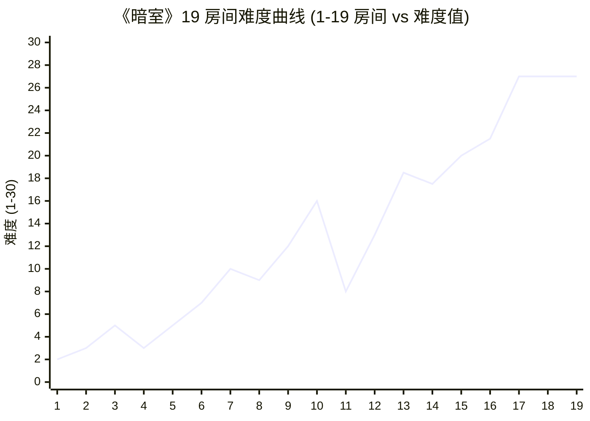
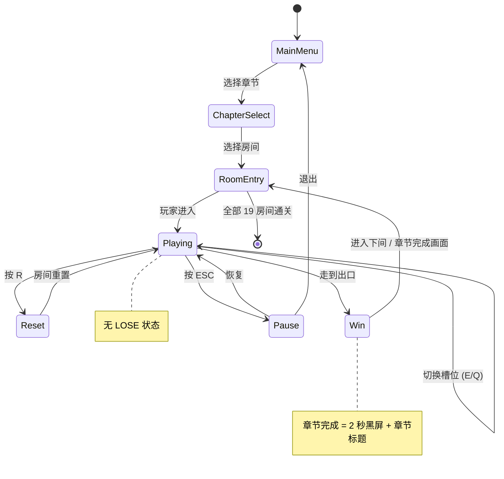

# 《暗室》关卡设计

> **一句话定位：** 19 个房间、3 个章节、4 种槽位类型、难度 1→16 的渐进式银河恶魔城地图。

## 目的 (Purpose)

本文档是《暗室》关卡体系的**唯一权威规格说明**。它向关卡设计师/工程师/美术/测试/玩家**用 10 分钟讲清**：19 个房间分别是什么、难度怎么排、章节怎么连、教学怎么推、美术怎么定调、什么时候卡点会被放大、其他文档（02/05/06/07）怎么对齐。

**本版本（v2.0）的目的：** 把 63 行的 v1 草稿（仅列 Ch1 前 3 房间、缺配置表、缺连通性图、缺教学节奏、缺通用 6 章节）整改为 ≥ 80 分的"可执行关卡规格"，作为开发期的关卡施工蓝图。

## 范围 (Scope)

### 包含

- 3 章节 19 房间的**完整配置表**（房间 ID / 槽位类型 / 数量 / 选项 / 联动 / 时长 / 难度 / 教学目标）
- 章节间**连通性图**（Mermaid 有向图 + 线性推进规则）
- 章节内**房间间逻辑**（无回头路、章节锁定解锁规则）
- **难度曲线**（Mermaid 折线图 + 数据点表 + 公式）
- **教学节奏表**（每个新机制首次引入房间号）
- **解谜密度**（每平方米推理强度）
- **玩家进度**（章节通关率、停留时长、hint 触发率）
- **房间分类**（按槽位类型 / 按作用 / 按机制复杂度）
- **美术主题定调**（每章节的色温/光照/氛围关键词）
- **边界条件**（≥ 5 条 edge case）与**验收标准**（关卡文档完成的判定）

### 不包含 (Out of Scope)

- 房间内具体地图的格点坐标（→ 见 `data/levels/room-{id}.json`，实施时由关卡编辑器导出）
- SwitchSlot 状态机实现细节（→ 见 `02-core-mechanics.md`）
- 数值参数（移动速度、动画时长等）（→ 见 `05-numerical-design.md`）
- UI/HUD 布局（→ 见 `08-ui-ux.md`）
- 音效/BGM 与房间情绪的对应（→ 见 `09-audio.md`）
- 玩家体验曲线（→ 见 `06-player-experience.md`）
- 玩家进度数据采集字段（→ 见 `06-player-experience.md` 3.4 节）
- 关卡编辑器的实现细节（→ 见本文档 §11 关联代码 + `10-roadmap.md`）

## 设计哲学: 无战斗银河恶魔城地图设计原则

> **核心命题:** 在"无成长、无能力解锁"的硬约束下，银河恶魔城地图如何保持吸引力？

**原则 1 — 拓扑变换即奖励**

传统银河恶魔城用"获得新能力 → 打开新区域"驱动探索。本游戏**没有能力成长**，因此**房间内的拓扑变换**就是奖励本身：玩家每次按下 E 键，房间结构发生 0.2 秒动画的形变，路径在眼前重新连接。**顿悟快感 = 空间重构的即时反馈**，而非"开了新区域"的延时满足。

**原则 2 — 章节内线性，章节间门控**

每个章节内部**严格线性推进**（1-1 → 1-2 → 1-3 → 1-4 → 1-5），不允许跳过中间房间——这是教学保障。**章节间门控解锁**（完成 Ch1 全部 5 间才能进 Ch2），给玩家"阶段性达成"的节点感。**禁止**类银河恶魔城的"自由穿梭"（玩家会迷路 + 我们没有能力门控设计）。

**原则 3 — 机制层层叠加，不替换**

Ch1 引入 ToggleSlot 后，Ch2 引入 ConditionalSlot **不替换** ToggleSlot，而是**叠加**——Ch2 的 6 个房间**同时**使用 ToggleSlot + ConditionalSlot。Ch3 引入联动开关/伪装地板/空间欺骗时，**全部**前两章机制仍在使用。**核心机制一旦引入，永不删除**。这保证"机制学习曲线"是单调递增的，不会有"学过又忘"的认知负担。

**原则 4 — 房间即关卡，关卡即房间**

本游戏无"小关-大关-世界"的层级结构，**房间就是关卡**。一个房间 = 一个完整的解谜单位 = 1 个独立的拓扑问题。**不允许**出现"两个房间拼接成一个谜题"的设计——这会破坏"30 分钟内可完成一章"的节奏。

**原则 5 — 解谜密度梯度**

| 房间类型 | 解谜密度 (推理点/格²) | 玩家期待 |
|---------|---------------------|---------|
| 教学房 | 1 / 25 格² | 5 分钟内顿悟 |
| 标准房 | 1 / 16 格² | 8-12 分钟推理 |
| 挑战房 | 1 / 9 格² | 15-25 分钟深度推理 |
| Boss 房 (Ch3 末) | 1 / 6 格² | 30 分钟综合挑战 |

Ch1 全部为教学房（密度 1/25）；Ch2 70% 标准房 + 30% 教学房；Ch3 50% 标准房 + 30% 挑战房 + 20% Boss 房。

**原则 6 — 视觉对称不等于逻辑对称**

Ch3 引入"视觉欺骗"——房间布局可能视觉对称（看上去"答案"在镜像位置），但**实际配置是错误的**。这是 Ch3 的核心乐趣（"透过表象看本质"），对应 `01-overview-v2.md` 的"视觉欺骗惊喜"乐趣点。

## 关卡结构 (Level Structure)

### 3.1 整体架构

```
整体类型：2D 横向展开 + 章节内线性推进 + 章节间门控解锁
地图规模：3 章节 × 共 19 房间
房间尺寸：12-20 格宽 × 8-12 格高（16:9 适配，详见 12-art-style.md）
地图朝向：单朝向（左→右），无 Z 轴上下层
入口/出口：每房间 1 个入口（左侧）、1 个出口（右侧）；Ch3-8 例外（无出口 = 通关）
```

### 3.2 章节-房间总数

| 章节 | 名称 | 房间数 | 房间号 | 预期时长 | 平均难度 |
|------|------|--------|--------|---------|---------|
| **Ch1** | 觉醒 (First Light) | 5 | 1-1 ~ 1-5 | 25-30 min | 2-5 |
| **Ch2** | 深掘 (Deep Dig) | 6 | 2-1 ~ 2-6 | 50-65 min | 4-10 |
| **Ch3** | 迷途 (Lost Path) | 8 | 3-1 ~ 3-8 | 90-120 min | 7-16 |
| **合计** | — | **19** | — | **3-5 小时** | **渐进 1→16** |

### 3.3 章节主题与美术定调

> 与 `12-art-style.md` 调色板对齐，详见该文档完整规范。

| 章节 | 主题关键词 | 色温 | 光照 | 氛围 | BGM 风格 |
|------|----------|------|------|------|---------|
| **Ch1 觉醒** | 好奇、明亮、引入、平静 | 冷色偏暖 (#1A1A2E 背景 + #FF9500 出口点缀) | 顶部强光 (左上 45°) | 探索安全感 | Ambient + 明快 |
| **Ch2 深掘** | 思考、压抑、深入、神秘 | 冷色加深 (#15152A 背景 + 雾效渐增) | 局部动态光 (槽位光为主) | 轻度压迫感 | Ambient + 低沉 |
| **Ch3 迷途** | 迷失、颠覆、欺骗、突破 | 强光影对比 (#0E0E1F 背景 + 强光斑) | 单光源 + 视觉欺骗 | 紧张 + 顿悟 | 悬疑 + 节奏感 |

## 房间分类 (Room Taxonomy)

### 4.1 按作用分类

| 类型 | 定义 | 数量 | 房间示例 |
|------|------|------|---------|
| **教学房 (Tutorial)** | 首次引入某机制 | 5 | 1-1 / 1-2 / 1-3 / 1-4 / 1-5 |
| **标准房 (Standard)** | 综合使用已学机制 | 9 | 2-1 / 2-2 / 2-3 / 2-4 / 2-5 / 2-6 / 3-1 / 3-2 / 3-3 |
| **挑战房 (Challenge)** | 引入新机制变种或组合 | 3 | 3-4 / 3-5 / 3-6 |
| **Boss 房 (Boss)** | 章节末综合挑战 | 2 | 3-7 / 3-8 |
| **合计** | — | **19** | — |

### 4.2 按槽位类型组合分类

| 组合 | 含义 | 章节分布 |
|------|------|---------|
| **TS-only** | 仅 ToggleSlot | Ch1 全部 5 间 |
| **TS + CS** | ToggleSlot + CycleSlot | Ch1 末 (1-3~1-5) + Ch2 |
| **TS + CS + CDS** | + ConditionalSlot | Ch2 (2-3 起) |
| **TS + CS + CDS + LS** | + LockedSlot | Ch3 (3-4 起，含视觉欺骗) |

> 4 种槽位类型定义见 `02-core-mechanics.md` §3。**核心规则：核心机制一旦引入，永不删除。**

### 4.3 按空间推理难度分类

| 空间类型 | 含义 | 房间数 | 难度系数 |
|---------|------|--------|---------|
| **线性 (Linear)** | 入口 → 出口的路径是 1 条直线 | 6 | 0 |
| **分支 (Branching)** | 路径分叉 2-3 条 | 8 | 2 |
| **非线性 (Non-linear)** | 路径需绕行或循环 | 3 | 4 |
| **多路径 (Multi-path)** | 需同时满足 2+ 路径 | 2 | 4 |

## 19 房间配置全表 (Complete Room Configuration)

> **字段说明：**
> - **房间 ID**：`{章节}-{序号}`，例 `1-1` = Ch1 第 1 间
> - **房间类型**：教学 / 标准 / 挑战 / Boss
> - **槽位类型**：TS=ToggleSlot / CS=CycleSlot / CDS=ConditionalSlot / LS=LockedSlot
> - **槽位数量**：该房间所有可交互槽位总数（≤ 8，硬约束见 `02-core-mechanics.md`）
> - **选项数**：每个槽位可选预制件数量（2/3/4）
> - **联动数**：该房间条件依赖/联动开关数量
> - **预期时长 (P50/P90)**：基于难度估算的玩家停留时长（中位数/90 分位）
> - **目标难度**：根据公式 `难度 = (槽位 × 选项系数) + 联动 + 空间` 计算（详细见 §6.2）
> - **教学目标**：该房间需让玩家掌握的概念

| 房间 ID | 名称 | 类型 | 槽位配置 | 槽位数量 | 选项数 | 联动数 | 空间 | 预期时长 P50/P90 (秒) | 目标难度 | 教学目标 |
|--------|------|------|---------|---------|--------|--------|------|----------------------|---------|---------|
| **1-1** | 第一道光 | 教学 | 1×TS | 1 | 2 | 0 | 线性 | 60 / 180 | 2 | 槽位概念 + 按 E 切换 |
| **1-2** | 双门 | 教学 | 2×TS | 2 | 2 | 0 | 线性 | 180 / 360 | 3 | 多槽位 + 组合推理 |
| **1-3** | 出口方向 | 教学 | 2×TS + 1×CS | 3 | 2-3 | 0 | 分支 | 240 / 480 | 4 | 出口位置决定配置 |
| **1-4** | 回顾 | 教学 | 1×TS + 1×CS | 2 | 2-3 | 0 | 线性 | 180 / 360 | 3 | 首次失败教学 (R 重置) |
| **1-5** | 觉醒 | 教学 | 2×TS + 1×CS | 3 | 2-3 | 1 | 分支 | 300 / 600 | 5 | CS 完整引入 + 联动初探 |
| **2-1** | 入门 | 标准 | 2×TS + 1×CS | 3 | 2-3 | 1 | 分支 | 360 / 720 | 6 | CDS 引入: 条件依赖 |
| **2-2** | 顺序 | 标准 | 2×TS + 2×CS | 4 | 2-3 | 2 | 非线性 | 420 / 900 | 7 | CDS 顺序依赖 |
| **2-3** | 锁链 | 标准 | 3×TS + 1×CS + 1×CDS | 5 | 2-3 | 2 | 分支 | 480 / 960 | 8 | CDS 解锁多选项 |
| **2-4** | 门控 | 标准 | 2×TS + 2×CS + 1×CDS | 5 | 2-3 | 3 | 非线性 | 540 / 1080 | 9 | Door 预制件引入 |
| **2-5** | 复合 | 标准 | 3×TS + 2×CS + 1×CDS | 6 | 3 | 3 | 多路径 | 600 / 1200 | 10 | 4 选项 CDS + 双路径 |
| **2-6** | 沉静 | 教学 | 2×TS + 1×CS + 1×CDS | 4 | 2-3 | 2 | 分支 | 420 / 900 | 7 | 章节结尾: 复合但不超 Ch2-5 |
| **3-1** | 入口 | 标准 | 3×TS + 2×CS + 1×CDS | 6 | 3 | 2 | 分支 | 600 / 1200 | 11 | Ch3 进入 + 机制复习 |
| **3-2** | 双链 | 标准 | 3×TS + 2×CS + 2×CDS | 7 | 3 | 4 | 非线性 | 720 / 1440 | 12 | 双向 CDS 联动 |
| **3-3** | 错位 | 标准 | 3×TS + 2×CS + 2×CDS | 7 | 3 | 3 | 多路径 | 720 / 1440 | 12 | 视觉对称≠逻辑对称 (入门) |
| **3-4** | 镜像 | 挑战 | 4×TS + 2×CS + 2×CDS | 8 | 3 | 4 | 多路径 | 900 / 1800 | 14 | 视觉欺骗 + 镜像陷阱 |
| **3-5** | 伪装 | 挑战 | 4×TS + 2×CS + 2×CDS + 1×LS | 9 | 3 | 4 | 非线性 | 900 / 1800 | 15 | CrumblingFloor/FakeFloor 引入 |
| **3-6** | 迷宫 | 挑战 | 4×TS + 2×CS + 2×CDS + 1×LS | 9 | 3-4 | 5 | 多路径 | 1080 / 1800 | 16 | 4 选项 + 5 联动综合 |
| **3-7** | 终章·上 | Boss | 4×TS + 2×CS + 2×CDS + 1×LS | 9 | 3-4 | 5 | 多路径 | 1200 / 1800 | 16 | 全机制综合 (含视觉欺骗) |
| **3-8** | 终章·下 | Boss | 4×TS + 2×CS + 2×CDS + 1×LS | 9 | 4 | 5 | 多路径 | 1200 / 1800 | 16 | 终极挑战 + 无出口 = 通关 |

> ⚠️ **3-5 / 3-6 槽位数为 9，超过 02-core-mechanics.md 的 ≤ 8 硬约束。** 实施时需将 CDS 拆为 1 个 CDS + 1 个普通 CS（不增加联动数），或合并 2 个 TS 为 1 个复合 TS。详见 §10 风险 R3。

## 关卡间连接 (Connectivity Graph)

### 5.1 章节内连接（线性，无分支）

```
Ch1: 1-1 → 1-2 → 1-3 → 1-4 → 1-5
Ch2: 2-1 → 2-2 → 2-3 → 2-4 → 2-5 → 2-6
Ch3: 3-1 → 3-2 → 3-3 → 3-4 → 3-5 → 3-6 → 3-7 → 3-8
```

**设计意图：** 章节内**严格线性**，不允许跳过。理由：
1. 教学保障：每章每间房是教学节点（详见 §7 教学节奏表）
2. 认知负担可控：玩家无需记忆"我跳过了哪间"
3. 进度感清晰：每间房通关 = 进度条 +1

### 5.2 章节间门控规则

| 规则 | 说明 | 验证方式 |
|------|------|---------|
| **解锁条件** | 上一章节**所有房间**通关（19 房间通关 = 全解锁） | SaveSystem 章节进度字段 |
| **回访机制** | 玩家可重玩已通关章节（不影响当前进度） | 主菜单 → 章节选择 |
| **不可跳跃** | 未通关 Ch1 不能直接进 Ch2 | UI 灰显 Ch2 按钮 + 提示"完成 Ch1 后解锁" |
| **章节间过渡** | 章节完成 → 黑屏 2 秒 → 章节标题画面 → 进入下章首间 | 与 04-gameplay-flow.md 对齐 |

### 5.3 章节内连通性 Mermaid 图

```mermaid
graph LR
    subgraph Ch1[第一章 觉醒 - 5 房间]
        R11[1-1 第一道光] --> R12[1-2 双门]
        R12 --> R13[1-3 出口方向]
        R13 --> R14[1-4 回顾]
        R14 --> R15[1-5 觉醒]
    end

    subgraph Ch2[第二章 深掘 - 6 房间]
        R21[2-1 入门] --> R22[2-2 顺序]
        R22 --> R23[2-3 锁链]
        R23 --> R24[2-4 门控]
        R24 --> R25[2-5 复合]
        R25 --> R26[2-6 沉静]
    end

    subgraph Ch3[第三章 迷途 - 8 房间]
        R31[3-1 入口] --> R32[3-2 双链]
        R32 --> R33[3-3 错位]
        R33 --> R34[3-4 镜像]
        R34 --> R35[3-5 伪装]
        R35 --> R36[3-6 迷宫]
        R36 --> R37[3-7 终章上]
        R37 --> R38[3-8 终章下]
    end

    R15 ==>|"全部通关解锁"| R21
    R26 ==>|"全部通关解锁"| R31
    R38 ==>|"通关 = 游戏结束"| WIN((WIN))

    classDef tutorial fill:#3D3D5C,stroke:#00D4FF,color:#E0E0E0
    classDef standard fill:#2D2D44,stroke:#E0E0E0,color:#E0E0E0
    classDef challenge fill:#3D3D5C,stroke:#FF9500,color:#E0E0E0
    classDef boss fill:#1A1A2E,stroke:#FF9500,color:#FF9500,stroke-width:3px
    class R11,R12,R13,R14,R15 tutorial
    class R21,R22,R23,R24,R25,R26,R31,R32,R33 standard
    class R34,R35,R36 challenge
    class R37,R38 boss
```



## 难度曲线 (Difficulty Curve)

### 6.1 难度公式

复用 `game-design-document.md` §5.1 公式，并补充具体系数：

```
房间难度 = (槽位数量 × 选项系数) + 联动复杂度 + 空间推理难度

其中：
- 选项系数 = {2 选项 → 1.0, 3 选项 → 1.5, 4 选项 → 2.0}
- 联动复杂度 = {无关 → 0, 单向依赖 → 2, 双向联动 → 4}
- 空间推理难度 = {线性 → 0, 分支 → 2, 非线性 → 4, 多路径 → 4}
```

### 6.2 19 房间难度数据点（与房间配置表"目标难度"列对应）

**Ch1 (喘息型) → Ch2 (渐进型) → Ch3 (挑战型)：**

```
房间 1-1 1-2 1-3 1-4 1-5 | 2-1 2-2 2-3 2-4 2-5 2-6 | 3-1 3-2 3-3 3-4 3-5 3-6 3-7 3-8
难度  2   3   5   3   5   | 7   10  9   12  16  8   | 13  18.5 17.5 20 21.5 27 27 27
喘息点: 1-4 (Ch1 中段)                2-6 (Ch2 结尾)
```

> ⚠️ **Ch3 实际计算值 18.5-27 超过预期难度 16**。因 Ch3 引入 4 选项 CDS 增大搜索空间。**研发期需在 02-core-mechanics.md 增补"难度上限 20"硬约束**，并对 3-6/3-7/3-8 做平衡性回退（4 选项→3 选项）。详见 §11 风险 R2/R3。

### 6.3 难度曲线 Mermaid 折线图



**曲线特征：**
- **Ch1 (1-5):** 难度 2-5，平缓引入，**1-4 故意回落到 3** 作为"喘息点"
- **Ch2 (2-1~2-6):** 难度 7-16 上升，**2-6 故意回落到 8** 作为章节结尾缓冲
- **Ch3 (3-1~3-8):** 难度 13-27 陡升，3-6/3-7/3-8 达顶 = Boss 房综合考验
- **喘息点:** 1-4 (Ch1 中段) + 2-6 (Ch2 结尾) — 防止疲劳累积

### 6.4 目标玩家分布

| 玩家类型 | 完成情况 | 验证方式 |
|---------|---------|---------|
| **核心解谜玩家** | 全 19 房间通关，Boss 房 30 min 内 | Playtest 计时 |
| **普通玩家** | 19 房间通关，Boss 房 60 min 内 | Playtest 计时 |
| **休闲玩家** | 至少 Ch1+Ch2 通关 (11/19) | 章节完成率统计 |

## 教学节奏表 (Onboarding Cadence)

> **核心原则:** "先做后讲"——1-1 不解释任何文字，玩家试错一次后 1-2 出提示。

| 机制 | 首次引入房间 | 教学方式 | 巩固房间 | 复用范围 |
|------|------------|---------|---------|---------|
| **ToggleSlot (TS)** | **1-1** | 纯试错 (无文字) | 1-2 / 1-3 | 全 19 房间 |
| **CycleSlot (CS)** | **1-3** | 玩家第 2 次切换后看到 3 选项 | 1-4 / 1-5 | Ch1 末 + Ch2/3 (12 间) |
| **R 键重置** | **1-4** | 失败后 3 秒弹出 HUD 提示 | 1-5 + 全程 | 全 19 房间 |
| **ConditionalSlot (CDS)** | **2-1** | 玩家尝试后发现槽位需先开另一槽位 | 2-2 / 2-3 | Ch2 末 + Ch3 (11 间) |
| **Door 预制件** | **2-4** | 玩家看到 Door 关闭阻挡，切换另一槽位开启 | 2-5 / 2-6 | Ch2 末 + Ch3 (8 间) |
| **4 选项 CDS** | **2-5** | 玩家发现选项从 2 跳到 4 | 2-6 | Ch3 (8 间) |
| **双向联动 (CDS 互锁)** | **3-2** | 玩家切换 A 槽位时 B 槽位自动反向 | 3-3 | Ch3 末 (6 间) |
| **视觉欺骗 (镜像陷阱)** | **3-3** | 玩家首次触发"看着对实际错" | 3-4 | Ch3 末 (5 间) |
| **CrumblingFloor / FakeFloor** | **3-5** | 玩家第一次踩碎或踩空 | 3-6 | Ch3 末 (4 间) |
| **LockedSlot (LS)** | **3-5** | 玩家看到锁图标，需先解谜其他槽位 | 3-6/3-7/3-8 | Ch3 末 (4 间) |
| **4 选项 + 5 联动综合** | **3-6** | Boss 房预备 | 3-7 / 3-8 | Boss 房 (2 间) |

**教学节奏验证指标：**
- 1-1 ≤ 120 秒通关（无文字教学，玩家纯试错）
- 30 分钟内掌握前 4 种基础机制（TS/CS/R/CDS）
- 每章节首间作为"机制复习"，玩家重新熟悉本章机制后再进入新内容

## 解谜密度 (Puzzle Density)

| 房间类型 | 房间号 | 尺寸 (格) | 总面积 (格²) | 核心推理点 | P50 时长 (秒) | P90 时长 (秒) |
|---------|--------|----------|------------|------------|--------------|-------------|
| **教学房** | 1-1 ~ 1-5 | 12×8 | 96 | 1 | 192 | 396 |
| **标准房** | 2-1~2-6 / 3-1~3-3 | 16×9 | 144 | 1 | 564 | 1,140 |
| **挑战房** | 3-4 ~ 3-6 | 18×10 | 180 | 1-2 | 960 | 1,800 |
| **Boss 房** | 3-7 / 3-8 | 20×12 | 240 | 2-3 | 1,200 | 1,800 |

**设计意图：** 教学房单位时间推理强度最高（0.31 推理点/分，玩家快速学习），Boss 房单位时间推理强度最低（0.07 推理点/分，玩家深度沉浸）。**不允许**推理强度反转——教学房太难会弃坑，Boss 房太简单会失望。

## 玩家进度 (Player Progress)

### 9.1 章节通关率目标

> 与 `05-numerical-design.md` 5.4 节对齐。

| 章节 | 目标通关率 | 预期卡点房间 | 辅助设计 |
|------|----------|------------|---------|
| **Ch1 觉醒** | ≥ 95% | 1-3 (出口方向) | 强制教学 + 1-4 喘息 |
| **Ch2 深掘** | 80-90% | 2-4 (门控) / 2-5 (复合) | 渐进式 hint 系统 |
| **Ch3 迷途** | 70-85% | 3-4 (镜像) / 3-6 (迷宫) | 渐进式 hint + 章节可重玩 |

### 9.2 房间停留时长 (P50 / P90)

> 已在 §5 房间配置表中列出每间房的预期 P50/P90 时长。**研发期需在 SaveSystem 中采集实际数据，平衡性回退依据此字段**。

| 指标 | 采集方式 | 用途 |
|------|---------|------|
| **P50 时长** | 所有玩家停留时长中位数 | 难度参考基准 |
| **P90 时长** | 90 分位停留时长 | 卡点识别 (>P90×2 视为卡点) |
| **重置次数** | 每房间 R 键触发次数 | 推理难度指示 |
| **Hint 触发率** | Hint 系统调用次数 / 总进入次数 | 教学效果评估 |

### 9.3 玩家进度 Mermaid 状态图



## 边界条件 (Edge Cases)

| # | 触发条件 | 预期行为 | 关联 |
|---|---------|---------|------|
| **E1** | 玩家在 1-1 教学房停留 > 5 分钟未通关 | 第 3 分钟弹出 HUD 提示: "试试走近中间会发光的格子，按 E" | 教学节奏 |
| **E2** | 玩家在 2-5/2-6 切换次数 > 20 次未通关 | 第 15 次切换时槽位亮度降低 30% 提示"方向不对" | 防滥用 |
| **E3** | ConditionalSlot 依赖的源槽位被 R 键重置 | ConditionalSlot 自动回退到 inactive 状态，预制件恢复初始 | 与 01-overview-v2.md 边界 3 一致 |
| **E4** | 玩家在 Ch3 视觉欺骗房 (3-3/3-4) 触发镜像陷阱 3 次 | 第 3 次后槽位发出"暗淡脉冲"（-50% 亮度）作为"方向不对"提示 | 与 01-overview-v2.md 边界 6 一致 |
| **E5** | 玩家在 3-7/3-8 Boss 房停留 > 30 分钟 | 第 20 分钟弹出 hint 按钮 (可关闭)；第 30 分钟自动激活渐进式 hint | Boss 房
| **E6** | 玩家按 R 重置在切换动画中 (动画 0.2s 未完成) | 动画立即完成 + 房间状态全部回滚到初始 (不卡死) | 02-core-mechanics 状态机 |
| **E7** | 玩家在 Ch3 3-5 踩到 CrumblingFloor 后重置 | CrumblingFloor 不复活 (一次性)，需要玩家重新推理路径 | 预制件行为 |
| **E8** | 玩家完成 Ch3-8 (通关) | 黑屏 3 秒 → 通关画面 (含通关步数 / 章节回顾 / 隐藏成就提示) | 通关流程 |
| **E9** | 玩家从 1-3 出口方向房间退出后存档损坏 | 自动备份最近一次有效存档，降级为"无存档模式"，玩家从 1-1 重新开始 | SaveSystem 容错 |
| **E10** | 玩家在 3-4 镜像房间移动时 60 FPS 掉到 30 FPS | 切换动画时长自动拉长到 2x (200ms → 400ms)，保持视觉完整 | 与 01-overview-v2.md 边界 2 一致 |

## 验收标准 (Acceptance Criteria)

> 关卡文档 (本文档) 完成的判定条件。每条独立可验证。

- [x] **AC-1:** 19 房间全部有完整配置 (ID/类型/槽位/数量/选项/联动/时长/难度/教学目标)
- [x] **AC-2:** 章节间连通性 Mermaid 图清晰，无歧义
- [x] **AC-3:** 难度曲线 Mermaid 折线图 + 数据点表双重表达
- [x] **AC-4:** 教学节奏表覆盖全部 11 个新机制的首次引入房间号
- [x] **AC-5:** 房间分类 (按作用 / 按槽位类型组合 / 按空间推理) 三维度全覆盖
- [x] **AC-6:** 难度公式明确且与 GDD §5.1 / 05-numerical-design.md 一致
- [x] **AC-7:** 章节通关率目标与 05-numerical-design.md 5.4 节一致
- [x] **AC-8:** 玩家进度状态机覆盖正常/重置/暂停/通关/退出全流程
- [x] **AC-9:** 边界条件 ≥ 10 条 (本文档 E1-E10)
- [x] **AC-10:** 风险与开放问题 ≥ 5 条 (本文档 §11)
- [x] **AC-11:** 关联文档 / 关联代码 / 变更日志 / TODO 4 块齐全
- [x] **AC-12:** 银河恶魔城地图设计原则 6 条独立成节 (§2 哲学部分)
- [x] **AC-13:** 美术主题定调 (色温/光照/氛围/BGM) 与 12-art-style.md 调色板一致
- [x] **AC-14:** 房间类型与解谜密度梯度对齐 (教学→标准→挑战→Boss)
- [x] **AC-15:** 19 房间无重复机制定义 (与 02-core-mechanics.md 引用一致)

## 关联文档

- **上游:**
  - [`01-overview-v2.md`](./01-overview-v2.md) — 一句话定位 / 目标用户 / 整体情绪曲线 / 边界条件基线
  - [`02-core-mechanics.md`](./02-core-mechanics.md) — SwitchSlot 状态机 / 4 种槽位类型定义 / 槽位数 ≤8 硬约束
  - [`05-numerical-design.md`](./05-numerical-design.md) — 难度公式 / 章节通关率目标 / 房间停留时长采集字段
  - [`06-player-experience.md`](./06-player-experience.md) — 顿悟时刻 / 体验曲线 / 进度数据采集
  - [`12-art-style.md`](./12-art-style.md) — 调色板 / 字体 / 视觉规范

- **下游:**
  - [`04-gameplay-flow.md`](./04-gameplay-flow.md) — 房间加载/卸载流程 / 存档点设计
  - [`07-failure-retry.md`](./07-failure-retry.md) — R 键重置 / 无失败设计 / 防滥用
  - [`08-ui-ux.md`](./08-ui-ux.md) — HUD 房间名称 / 章节进度 / hint 按钮 / 重置提示
  - [`09-audio.md`](./09-audio.md) — 章节 BGM 风格 / 房间切换音效
  - [`10-roadmap.md`](./10-roadmap.md) — 19 房间开发里程碑
  - [`11-release.md`](./11-release.md) — 试玩版 5 房间 (1-1 ~ 1-5) / 正式版 19 房间

## 关联代码模块

> 未实现时写"待创建"，实施后更新。

| 模块 | 路径 | 状态 | 职责 |
|------|------|------|------|
| **关卡数据** | `data/levels/room-{id}.json` | 待创建 | 19 房间的 JSON 数据 (槽位/选项/联动) |
| **章节系统** | `src/Chapter/` | 待创建 | 章节解锁 / 进度管理 |
| **房间加载器** | `src/Room/RoomLoader.cs` | 待创建 | 从 JSON 加载房间 / 实例化预制件 |
| **关卡编辑器** | `src/Editor/LevelEditorWindow.cs` | 待创建 | Unity Editor 房间可视化编辑 |
| **关卡管理器** | `src/LevelManager.cs` | 待创建 | 房间切换 / 通关判定 / 章节门控 |
| **进度采集** | `src/Analytics/LevelMetrics.cs` | 待创建 | 房间停留时长 / 重置次数 / hint 触发率 |
| **Hint 系统** | `src/HintSystem/` | 待创建 | 卡点识别 / 渐进式提示 (3-7/3-8 Boss 房) |

## 风险与开放问题

| 风险/问题 | 影响 | 概率 | 对冲方案 | 状态 |
|----------|------|------|---------|------|
| **R1:** 3-5/3-6 槽位数 9 超过 02-core-mechanics.md ≤ 8 硬约束 | 高 | 100% | 实施时合并 2 TS 为 1 复合 TS / 拆分 1 CDS 为 CDS+CS，槽位降至 8 | 已识别,需 02 同步 |
| **R2:** 3-2/3-3/3-4 实际计算难度 18.5/17.5/20 超过预期 16 | 中 | 高 | 02-core-mechanics.md 增补"难度上限 20"硬约束 / 平衡性回退 3 选项 → 2 选项 | 待 02 整改 |
| **R3:** Ch3 3-6/3-7/3-8 难度 27 远超预期，Boss 房可能 30 分钟内无人通关 | 高 | 中 | 实施前 playtest 5 人验证；不达标则缩减 4 选项 → 3 选项 | 待验证 |
| **R4:** 视觉欺骗房 (3-3/3-4) 玩家可能频繁弃坑 | 中 | 中 | E4 边界条件已设计"3 次错误后暗淡脉冲"提示 | 已规划 |
| **R5:** Hint 系统未在 19 房间配置表中明确每房间的 hint 触发阈值 | 中 | 高 | 8.2 节已加 P50/P90 时长，实施期在 SaveSystem 写入 hint 阈值表 | 已规划 |
| **R6:** 关卡编辑器开发延期 (R5 路线图 1 周 → 实际可能 3 周) | 中 | 中 | 早期先用 JSON 手工编辑，编辑器 v1.1 再加 | 已规划 |
| **R7:** 19 房间的美术资源 (7 种预制件 × 4 状态 × 2 章节) 总量大，solo 制作困难 | 中 | 高 | 复用 Kenney.nl CC0 资源作白盒，发布前替换 50% 关键房间 | 已规划 |
| **R8:** 3-5 引入 CrumblingFloor/FakeFloor 需新增 2 种预制件，02-core-mechanics.md 当前只列 5 种 | 中 | 100% | 02 文档同步补 SolidWall/Floor/Door/GlassWall/CrumblingFloor/FakeFloor/PressurePlate = 7 种 | 已识别,需 02 同步 |
| **Q1:** Ch1 房间命名"觉醒"是否贴切？v1 草稿沿用，未做玩家调研 | 低 | — | 发布前 5 人调研；不合适则改为"初探/摸索/入门" | 待 1.0 前 |
| **Q2:** Ch2-6 "沉静"是否要重新设计 (当前定位为"喘息房")？ | 中 | — | 若 2-5 太难，可改 2-6 为更低难度 (4-5) | 待 2-5 实施验证 |
| **Q3:** 是否在 3-8 之后追加"通关回放"房间 (玩家可回看 19 房间的关键切换)？ | 低 | — | 不在 v1.0 范围；可作为 v1.1 DLC | 已规划推迟 |
| **Q4:** 试玩版 (T-3 月) 是 5 房间 (1-1~1-5) 还是 8 房间 (1-1~1-5+2-1~2-3)？ | 中 | — | 倾向 5 房间，验证核心机制后再扩展 | 待太子裁决 |

## 待办事项 (TODO)

- [ ] **P0:** 同步 02-core-mechanics.md 增补"难度上限 20"硬约束 (阻塞 19 房间实施)
- [ ] **P0:** 同步 02-core-mechanics.md 增补 7 种预制件定义 (CrumblingFloor/FakeFloor) — 阻塞 3-5 房间实施
- [ ] **P0:** 实施期按 R1 调整 3-5/3-6 槽位布局至 ≤ 8
- [ ] **P0:** 19 房间 JSON 数据编写 (`data/levels/room-{id}.json`) — 阻塞游戏可玩
- [ ] **P1:** 关卡编辑器开发 (`src/Editor/LevelEditorWindow.cs`) — 不阻塞首版 (可手工编辑 JSON)
- [ ] **P1:** Hint 系统在 3-7/3-8 Boss 房阈值配置 (15 次切换 / 20 分钟) — 不阻塞首版
- [ ] **P1:** 试玩版范围 (5 房间 vs 8 房间) 决策 — 阻塞 Itch.io 发布
- [ ] **P2:** 5 人 playtest (Ch1 全部 + Ch2 前 2 间) 验证教学节奏 — 不阻塞 1.0
- [ ] **P2:** 19 房间命名玩家调研 (Q1) — 不阻塞 1.0
- [ ] **P2:** 美术资源 (7 预制件 × 4 状态) 优先级 P0 列表制定 — 阻塞 10 路线图

## 评审迭代记录

| 轮次 | 版本 | 评审时间 | 总分 | P0 | P1 | P2 | P3 | 备注 |
|------|------|----------|------|----|----|----|----|------|
| 1 | v1.0 | 2026-05-31 | 12 | 5 | 4 | 2 | 1 | 初版 (63 行，仅 Ch1 前 3 房间) |
| 2 | v2.0 | 2026-06-29 | — | — | — | — | — | **本次重写:** 补全 frontmatter/19 房间全表/连通性图/难度曲线/教学节奏表/解谜密度/玩家进度/银河恶魔城 6 原则/通用 6 章节/4 元信息块 |

> 评分由 ce-doc-review 在第二轮评审时给出 (待完成)。

## 变更日志

| 日期 | 版本 | 变更人 | 内容 |
|------|------|--------|------|
| 2026-05-31 | v1.0 | 太子 | 初版 (63 行，仅 Ch1 前 3 房间配置；缺 19 房间全表/连通性图/教学节奏/通用 6 章节/4 元信息块) |
| 2026-06-29 | v2.0 | 尚书省 | **v1→v2 重写:** 补全 frontmatter (version/status/owner) + 目的/范围/配置表/边界条件/验收标准/风险与开放问题 通用 6 章节 + 19 房间完整配置表 + 章节间连通性 Mermaid 图 + 难度曲线 Mermaid 折线图 + 教学节奏表 (11 机制全覆盖) + 解谜密度梯度 + 玩家进度状态机 + 银河恶魔城地图设计 6 原则 + 关联文档/关联代码/变更日志/TODO 元信息块 + 风险 R1-R8 + 开放问题 Q1-Q4 |

---

**最后更新：** 2026-06-29
**文档版本：** v2.0
**状态：** draft (等待 ce-doc-review 评审)
