# 《暗室》流程设计

> **一句话定位：** 主菜单 → 章节选择 → 房间内解谜循环 → 通关流转的全局状态机，配套存档、异常、重入与教学节奏设计。**无战斗、无成长、无失败**——纯空间逻辑推理的解谜流程。

## 目的 (Purpose)

本文档是《暗室》全局流程的**唯一权威规格说明**。它向工程师、关卡策划、UI 设计师、测试、玩家代理**用 20 分钟讲清**：

- **主循环**（主菜单 → 章节 → 房间 → 通关 → 下一房间）的完整路径与状态机
- **房间内循环**（进入 → 观察 → 切换 → 验证 → 通关/重置）的标准时序
- **4 种槽位类型**的教学曲线与引入房间号
- **失败重试流程**（本游戏无失败，改为"重置 + 重试"决策树）
- **3 章节的节奏**（每章 5/6/8 房间，时长 30/60/90 分钟）
- **玩家动机曲线**（好奇 → 顿悟 → 挑战 → 成就感 的章节级情绪变化）
- **跨章节进度**（章节门控解锁规则 + 章节间过渡画面）
- **异常处理**（断电/崩溃/存档损坏/切后台/强制退出 5+ edge case）
- **存档点设计**（自动存档时机、读档语义、章节 checkpoint）
- **重入性**（玩家中断后回到流程哪一步）

其他 11 份文档（01/02/03/05-12）以本文档为**流程层基线**：违反本定义的状态转换、存档语义、教学节奏视为偏差。

## 范围 (Scope)

### 包含

- **全局状态机**（Mermaid 状态图 + 8 状态 + 状态转移矩阵 + 触发器表）
- **主循环流程**（主菜单 → 章节选择 → 房间内循环 → 通关流转）
- **房间内循环**（进入 → 观察 → 切换 → 验证 → 通关/重置）的标准时序
- **玩家操作流程**（含失败兜底：每步操作 / 系统响应 / 可逆性 / 兜底设计）
- **4 种槽位类型的教学曲线**（ToggleSlot/CycleSlot/ConditionalSlot/LockedSlot 的引入房间与巩固房间）
- **失败重试流程**（无失败状态 → R 键重置 + Reset 房间决策树）
- **章节节奏表**（3 章节 19 房间的时长、难度、教学目标、呼吸点）
- **玩家动机曲线**（章节级情绪变化 Mermaid 折线图）
- **跨章节进度**（章节门控解锁 + 章节间过渡画面 + 章节完成画面）
- **存档点设计**（自动存档时机、读档语义、章节 checkpoint、SaveSystem 接口契约）
- **异常处理**（断电/崩溃/存档损坏/切后台/强制退出 ≥ 8 条 edge case）
- **重入性**（玩家中断后回到流程的哪一步 + ESC 暂停菜单的设计）
- **与 02/03 文档的关联引用**（SwitchSlot 状态机调用 + 19 房间配置引用）

### 不包含 (Out of Scope)

- SwitchSlot 状态机内部 5 态实现（→ 见 `02-core-mechanics-v2.md`）
- 19 房间的具体关卡配置（→ 见 `03-level-design-v2.md`）
- 数值公式与调参策略（→ 见 `05-numerical-design-v2.md`）
- 玩家情绪曲线的详细数据采集字段（→ 见 `06-player-experience-v2.md`）
- "无失败"设计决策的详细论证（→ 见 `07-failure-retry-v2.md`）
- HUD 布局 / 暂停菜单 UI 组件（→ 见 `08-ui-ux-v2.md`）
- 章节 BGM 与房间情绪的对应（→ 见 `09-audio-v2.md`）
- 美术风格 / 调色板（→ 见 `12-art-style-v2.md`）
- 发布计划 / 营销节奏（→ 见 `11-release-v2.md`）

## 1. 全局状态机 (Global State Machine)

### 1.1 状态总览（Mermaid）

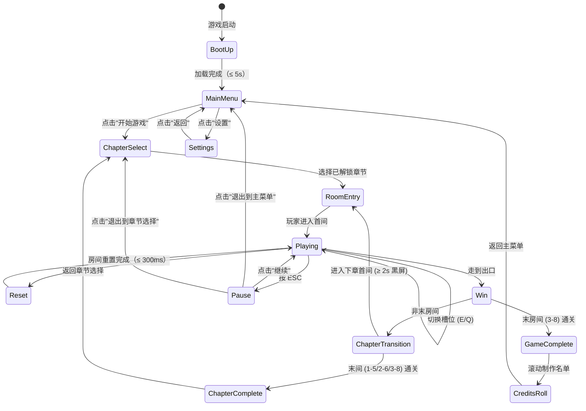

**关键不变量：**
- ✅ **无 LOSE 状态** — 玩家永远不会被"卡死"，最差回到章节选择
- ✅ **线性推进** — 章节内严格线性，章节间门控解锁（详见 §9）
- ✅ **可中断** — Playing 状态随时可暂停，Pause → 任意出口

### 1.2 状态转移矩阵

| From \ To         | BootUp | MainMenu | ChapterSelect | RoomEntry | Playing | Reset | Win | Pause | ChapterTransition | ChapterComplete | GameComplete | CreditsRoll |
|-------------------|:------:|:--------:|:-------------:|:---------:|:-------:|:-----:|:---:|:-----:|:-----------------:|:---------------:|:------------:|:-----------:|
| **BootUp**        | —      | 加载完成 | ❌            | ❌        | ❌      | ❌    | ❌  | ❌    | ❌                | ❌              | ❌           | ❌          |
| **MainMenu**      | ❌     | —        | 开始游戏      | ❌        | ❌      | ❌    | ❌  | ❌    | ❌                | ❌              | ❌           | ❌          |
| **ChapterSelect** | ❌     | 返回主菜单 | —            | 选择章节  | ❌      | ❌    | ❌  | ❌    | ❌                | ❌              | ❌           | ❌          |
| **RoomEntry**     | ❌     | ❌       | 退出到章节选择 | —         | 玩家进入 | ❌   | ❌  | ❌    | ❌                | ❌              | ❌           | ❌          |
| **Playing**       | ❌     | ❌       | ❌            | ❌        | —       | 按 R  | 走到出口 | 按 ESC | ❌         | ❌              | ❌           | ❌          |
| **Reset**         | ❌     | ❌       | ❌            | ❌        | 重置完成 | —     | ❌  | ❌    | ❌                | ❌              | ❌           | ❌          |
| **Win**           | ❌     | ❌       | ❌            | ❌        | ❌      | ❌    | —   | ❌    | 非末房间通关     | 末房间通关      | 末章末间通关 | ❌          |
| **Pause**         | ❌     | 退出到主菜单 | 退出到章节选择 | ❌    | 继续     | ❌    | ❌  | —     | ❌                | ❌              | ❌           | ❌          |
| **ChapterTransition** | ❌ | ❌    | ❌            | ❌        | ❌      | ❌    | ❌  | ❌    | —                | 末间通关        | ❌           | ❌          |
| **ChapterComplete** | ❌   | ❌       | 返回          | ❌        | ❌      | ❌    | ❌  | ❌    | ❌                | —               | ❌           | ❌          |
| **GameComplete**  | ❌     | ❌       | ❌            | ❌        | ❌      | ❌    | ❌  | ❌    | ❌                | ❌              | —            | 滚动名单    |
| **CreditsRoll**   | ❌     | 返回主菜单 | ❌          | ❌        | ❌      | ❌    | ❌  | ❌    | ❌                | ❌              | ❌           | —           |

### 1.3 状态描述表

| 状态 | 玩家视角 | 系统行为 | 视觉表现 |
|------|---------|---------|---------|
| **BootUp** | 看到启动画面（公司 Logo + 进度条） | 加载 Resources / 初始化 Audio / 读取存档 | 进度条 0→100% |
| **MainMenu** | 主菜单（开始游戏 / 设置 / 退出） | 监听鼠标点击 + 键盘 Enter | 半透明背景 + 居中菜单 |
| **ChapterSelect** | 3 章节卡片（已通关 = 完整，未通关 = 灰显） | 监听卡片点击 + 存档读取 | 章节缩略图 + 通关率 % |
| **RoomEntry** | 房间名称 + 教学提示（如需）浮现 | 加载房间 JSON + 实例化预制件 + 玩家位置初始化 | 房间名淡入 0.5s |
| **Playing** | 在房间内自由探索/切换 | 主玩法循环运行（详见 §4） | 房间正常渲染 |
| **Reset** | 看到重置动画（0.3s） | 所有 SwitchSlot 状态回退到初始选项 | 预制件淡出淡入到初始 |
| **Win** | 出口脉冲 + 屏幕渐白 | 房间通关判定 + 写入存档 + 触发过渡 | 渐白 0.5s → 黑屏 2s |
| **Pause** | 游戏画面半透明 + 暂停菜单 | 暂停主循环 + Time.timeScale = 0 | 半透明 + 菜单浮层 |
| **ChapterTransition** | 黑屏 + 章节标题画面 | 加载下章资源 + 更新章节进度 | 黑屏 2s → 章节标题 3s |
| **ChapterComplete** | 章节完成画面（时长/通关率/解锁下章提示） | 写入章节 checkpoint | 卡片式 UI 浮现 |
| **GameComplete** | 通关画面（通关步数 + 章节回顾） | 写入 GameCompleted 标志 | 全屏背景图 + 文字浮层 |
| **CreditsRoll** | 制作名单滚动 | 滚动文字 30s 后返回主菜单 | 黑底白字滚动 |

### 1.4 状态转换触发器

| 触发器 | 源状态 | 目标状态 | 条件 |
|--------|-------|---------|------|
| **游戏启动** | — | BootUp | 玩家双击 .exe / 启动 .app |
| **加载完成** | BootUp | MainMenu | Resources 加载 + 存档读取 ≤ 5s |
| **点击"开始游戏"** | MainMenu | ChapterSelect | 鼠标左键点击对应按钮 |
| **点击"设置"** | MainMenu | Settings | 鼠标左键点击设置按钮 |
| **点击"返回"** | Settings | MainMenu | 鼠标左键点击返回按钮 |
| **选择已解锁章节** | ChapterSelect | RoomEntry | 存档中章节解锁标志 = true |
| **选择未解锁章节** | ChapterSelect | ChapterSelect | UI 灰显 + 提示"完成 Ch1 后解锁" |
| **玩家进入房间** | RoomEntry | Playing | 玩家按 WASD 任意键 / 3 秒后自动 |
| **玩家按 E/Q** | Playing | Playing | 槽位 Hover → Switching → Hover |
| **玩家按 R** | Playing | Reset | R 键 500ms 冷却已过 |
| **重置完成** | Reset | Playing | 0.3s 重置动画完成 |
| **玩家走到出口** | Playing | Win | 玩家位置 = 出口位置 + 路径连通 |
| **非末房间通关** | Win | ChapterTransition | 房间 ID ∉ {1-5, 2-6, 3-8} |
| **末房间通关** | Win | ChapterComplete | 房间 ID ∈ {1-5, 2-6} |
| **末章末间通关** | Win | GameComplete | 房间 ID = 3-8 |
| **玩家按 ESC** | Playing | Pause | 暂停菜单可随时调出 |
| **点击"继续"** | Pause | Playing | 恢复 Time.timeScale = 1 |
| **点击"退出到主菜单"** | Pause | MainMenu | 销毁房间 + 返回主菜单 |
| **点击"退出到章节选择"** | Pause | ChapterSelect | 销毁房间 + 返回章节选择 |
| **章节完成画面结束** | ChapterTransition | RoomEntry | 黑屏 2s + 章节标题 3s 后加载下章首间 |
| **章节完成画面返回** | ChapterComplete | ChapterSelect | 点击"返回"按钮 |
| **通关画面进入名单** | GameComplete | CreditsRoll | 玩家点击"继续"或 10 秒自动 |
| **制作名单结束** | CreditsRoll | MainMenu | 30s 后自动返回 |

## 2. 主循环 (Overall Gameplay Loop)

### 2.1 主循环流程图（Mermaid）

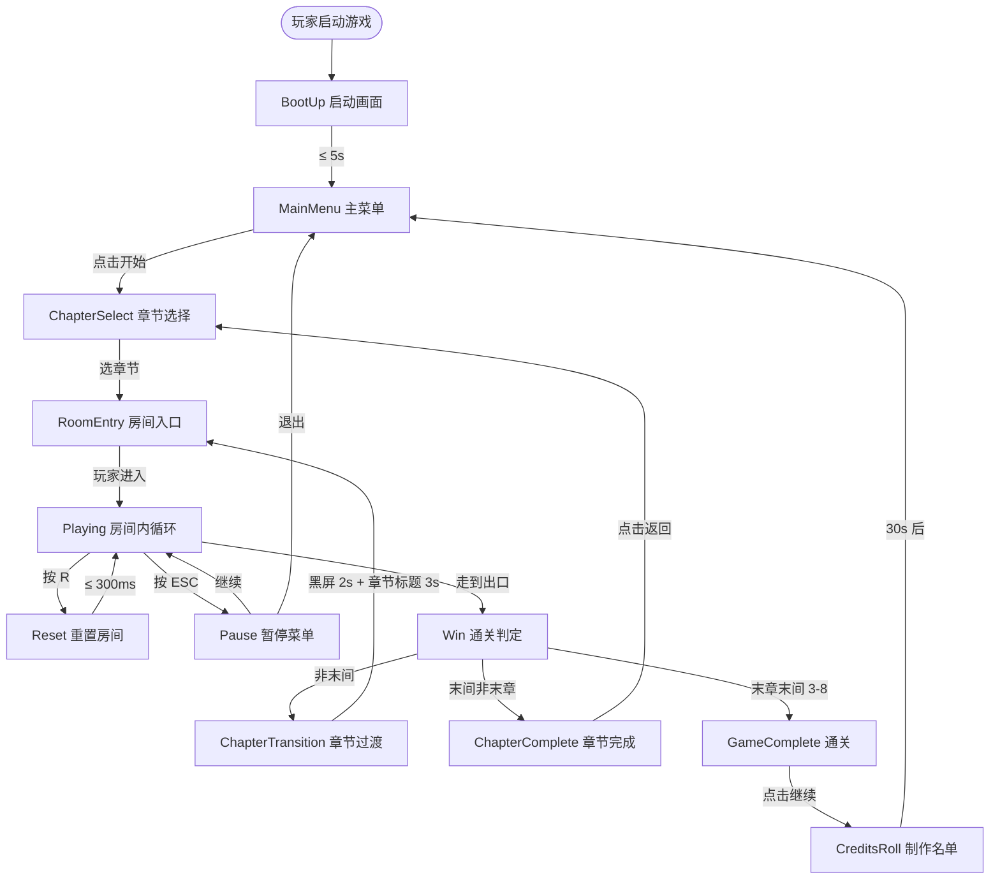

**关键设计决策：**
- **章节内线性：** 章节内严格 1-1 → 1-2 → ... → 1-5，无分支选择（详见 §9）
- **章节间门控：** 完成 Ch1 全部 5 间才能进 Ch2（详见 §9.2）
- **章节完成 ≠ 通关：** 完成 Ch1/Ch2 末间 = 章节完成画面；完成 Ch3 末间 = 通关画面
- **可任意中断：** Pause 状态可退出到 MainMenu / ChapterSelect 不丢失进度

### 2.2 主循环时序约束

| 阶段 | 耗时 | 可中断？ |
|------|------|---------|
| 启动 + 资源加载 | ≤ 5s | ❌（必须等加载完成） |
| 主菜单交互 | 无上限 | ✅ |
| 章节选择交互 | 无上限 | ✅ |
| 房间加载（RoomEntry） | ≤ 1s | ❌ |
| 房间内循环（Playing） | 60 ~ 1800s | ✅（ESC 暂停） |
| 重置动画（Reset） | 300ms ± 50ms | ❌ |
| 通关判定 + 渐白 | ≤ 1s | ❌ |
| 章节间过渡（黑屏 + 标题） | ≥ 5s（2s 黑屏 + 3s 标题） | ❌ |
| 章节完成画面 | 玩家点击"返回" / 30s 自动 | ✅ |
| 通关画面 | 玩家点击"继续" / 10s 自动 | ✅ |
| 制作名单滚动 | 30s 后自动返回 | ❌ |

## 3. 玩家操作流程 (Player Action Flow)

### 3.1 玩家操作四列表（含失败兜底）

| 玩家输入 | 系统响应 | 可逆性 | 失败兜底 |
|---------|---------|--------|---------|
| **启动游戏** | BootUp → MainMenu（≤ 5s） | ❌ 不可逆 | 加载失败 → 报错并退出 |
| **点击"开始游戏"** | MainMenu → ChapterSelect | ✅ 返回主菜单 | 存档损坏 → 自动备份并降级 |
| **选择章节** | ChapterSelect → RoomEntry → Playing | ✅ 返回章节选择 | 章节未解锁 → UI 灰显 + 提示 |
| **WASD / 方向键** | 玩家位置更新（≤ 16ms） | ✅ 持续输入 | 撞墙 → 位置不变 + 撞击音 |
| **按 E** | 槽位 Hover → Switching → Hover | ✅ Q 反向切换 | 槽位 Locked → 输入被忽略 + 锁图标脉冲 |
| **按 Q** | 槽位 Hover → Switching（反向） → Hover | ✅ E 正向切换 | 同上 |
| **按 R** | 所有槽位重置为初始（0.3s 动画） | ✅ 可反复重置 | 动画中按 R → R 键冷却 500ms 忽略 |
| **按 ESC** | Playing → Pause（Time.timeScale = 0） | ✅ 恢复游戏 | 无 |
| **走到出口** | 出口连通判定 → Win → 过渡 | ❌ 不可逆（通关后自动加载下间） | 路径不连通 → 玩家被实墙阻挡 + 视觉提示 |
| **踩到 FakeFloor** | 视觉欺骗反馈（闪烁 + 错音） | ✅ 玩家继续探索 | 无惩罚（详见 02 §10.6） |
| **踩到 CrumblingFloor** | 0.5s 后碎裂消失 | ✅ 房间重置后恢复 | 一次性消耗（详见 02 §10.7） |
| **踩到 PressurePlate** | 触发联动事件（解锁 LockedSlot 等） | ✅ 房间重置后恢复 | 重置时 PressurePlate 自动回退 |
| **点击"继续"（Pause）** | Pause → Playing | ✅ 再次 ESC | 无 |
| **点击"退出到主菜单"（Pause）** | Pause → MainMenu（销毁房间） | ❌ 不可逆 | 房间销毁前自动存档 |
| **点击"退出到章节选择"（Pause）** | Pause → ChapterSelect（销毁房间） | ❌ 不可逆 | 房间销毁前自动存档 |

### 3.2 玩家操作决策树（Mermaid）

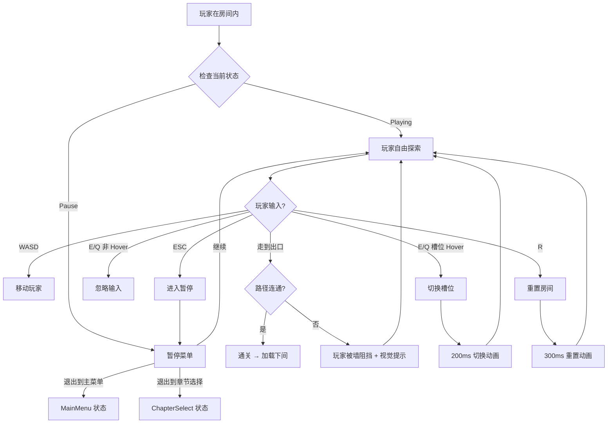

## 4. 房间内循环 (In-Room Loop)

### 4.1 标准循环（Mermaid）

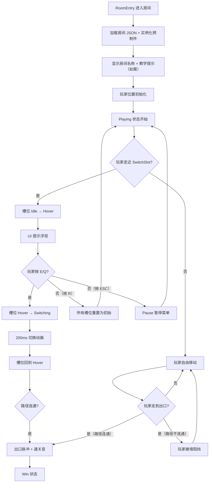

### 4.2 循环时序约束

| 阶段 | 耗时 | 可中断？ |
|------|------|---------|
| 房间加载（RoomEntry） | ≤ 1s | ❌ |
| 房间名 + 教学提示显示 | ≤ 500ms | ❌（必须等动画完成） |
| 玩家自由探索 | 无上限 | ✅（随时可触发其他动作） |
| 槽位 Hover 响应 | ≤ 50ms | ✅ |
| 切换动画（Switching） | 200ms ± 50ms | ❌（动画期间输入锁定） |
| 连通性验证 | 0ms（即时） | — |
| 重置动画（Reset） | 300ms ± 50ms | ❌ |
| 通关过渡（渐白 + 加载） | ≤ 1s | ❌ |

### 4.3 通关判定（与 02 §6.3 对齐）

| 条件 | 说明 | 数据来源 |
|------|------|---------|
| **玩家位置 = 出口位置** | 玩家中心点进入出口 tile 中心 | 02 §6.3 |
| **出口处于"连通"态** | 出口 tile 的 isWalkable = true（无实墙/锁住的门阻挡） | 02 §6.3 |
| **所有 LockedSlot 已激活** | 房间内 LockedSlot 必须全部达到"激活"态 | 02 §6.3 + 03 房间配置 |

> **关键决策：** 通关判定调用 02-core-mechanics.md §6.3 的"通关判定"接口，本文不重新定义（避免与机制层基线冲突）。

### 4.4 房间内循环与章节循环的衔接

```
[房间内循环完成] → Win → [通关判定] → [自动存档] → [章节过渡]
                                                              ↓
                                                  [非末间] → RoomEntry（下间）
                                                  [末间]   → ChapterComplete → ChapterSelect
```

## 5. 槽位切换教学曲线 (Slot-Switch Teaching Curve)

### 5.1 4 种槽位类型引入节奏

> 与 `02-core-mechanics-v2.md` §4.5 和 `03-level-design-v2.md` §7 教学节奏表对齐。

| 槽位类型 | 首次引入房间 | 巩固房间 | 复用范围 | 教学方式 |
|---------|------------|---------|---------|---------|
| **ToggleSlot (TS)** | **1-1** 第一道光 | 1-2 / 1-3 | 全 19 房间 | 纯试错（无文字）— 玩家试错 1 次即懂 |
| **CycleSlot (CS)** | **1-3** 出口方向 | 1-4 / 1-5 | Ch1 末 + Ch2/3（12 间） | 玩家第 2 次切换后看到 3 选项 |
| **R 键重置** | **1-4** 回顾 | 1-5 + 全程 | 全 19 房间 | 失败后 3 秒弹出 HUD 提示 |
| **ConditionalSlot (CDS)** | **2-1** 入门 | 2-2 / 2-3 | Ch2 末 + Ch3（11 间） | 玩家尝试后发现槽位需先开另一槽位 |
| **LockedSlot (LS)** | **3-5** 伪装 | 3-6 / 3-7 / 3-8 | Ch3 末（4 间） | 玩家看到锁图标，需先解谜其他槽位 |

### 5.2 教学曲线图（Mermaid 折线图）

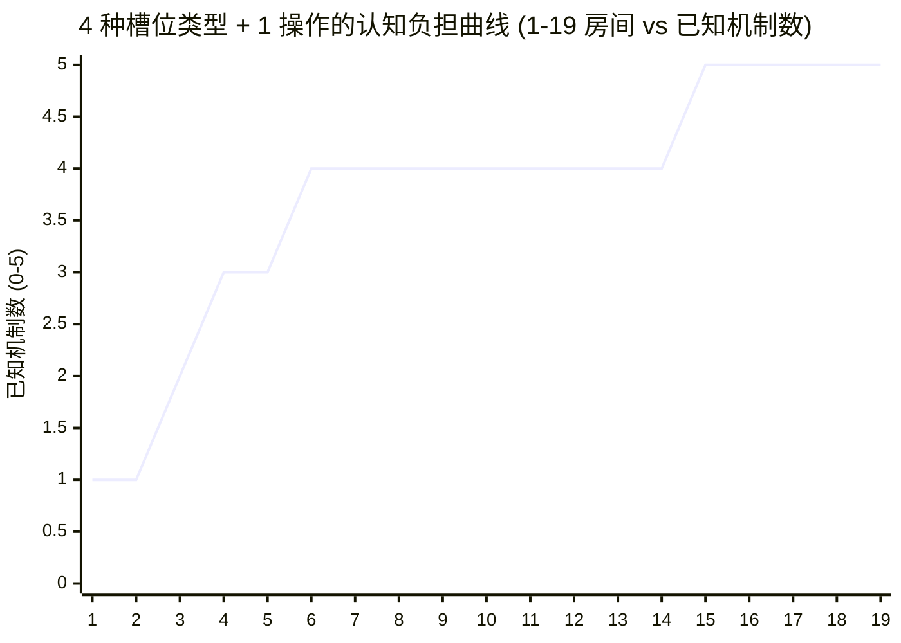

**曲线特征：**
- **1-1 → 1-3：** 1 → 2（ToggleSlot + CycleSlot，Ch1 引入完毕）
- **1-4：** 2 → 3（+ R 键重置教学）
- **2-1：** 3 → 4（+ ConditionalSlot 引入）
- **3-5：** 4 → 5（+ LockedSlot 引入，全部 5 个机制到位）
- **核心原则：** 机制层层叠加，**永不删除**（详见 03 §2 原则 3）

### 5.3 教学方式："先做后讲"

| 房间 | 教学目标 | 文字提示 | 试错空间 |
|------|---------|---------|---------|
| **1-1** | 学会按 E 切换槽位 | ❌ 无文字（纯试错） | ≤ 120 秒通关 |
| **1-2** | 多槽位 + 组合推理 | ❌ 无文字（玩家自己发现） | ≤ 360 秒 |
| **1-3** | CycleSlot 循环概念 | ❌ 无文字（玩家第 2 次切换后看到 3 选项） | ≤ 480 秒 |
| **1-4** | R 键重置 | ✅ 失败后 3 秒弹出 HUD 提示 | ≤ 360 秒 |
| **2-1** | ConditionalSlot 依赖 | ❌ 无文字（玩家尝试后自动理解） | ≤ 720 秒 |
| **3-5** | LockedSlot 激活 | ❌ 无文字（玩家看到锁图标） | ≤ 1800 秒 |

> **设计意图：** "先做后讲"原则——教学房（前 5 间）尽量**无文字**，让玩家通过试错自然学习。R 键是唯一例外（1-4 失败后弹提示），因为 R 键是"逃生口"必须主动告诉玩家。

## 6. 失败重试流程 (Failure & Retry Flow)

### 6.1 设计决策：无失败状态

> 本游戏**无失败状态**（无 HP、无 Game Over、无 LOSE 状态机节点）。这是核心设计决策之一，与 `01-overview-v2.md` §"核心特色 #3" 和 `07-failure-retry-v2.md` 同步。

**因此：本文档"失败重试流程"实际描述的是"重置 + 重试"决策树，而非"失败惩罚 + 重新挑战"流程。**

### 6.2 重置 + 重试决策树（Mermaid）

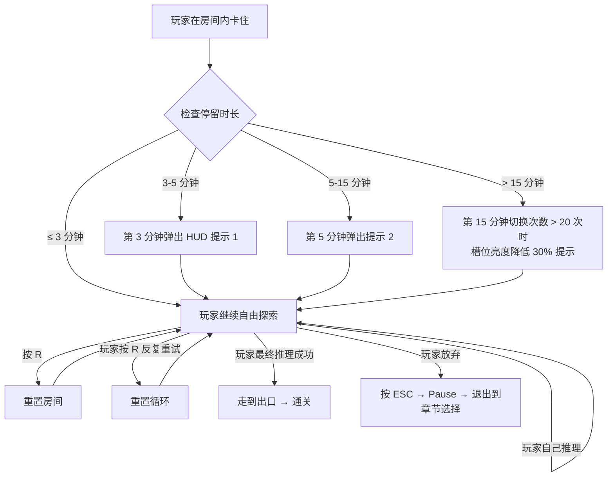

**关键约束：**
- **3 阶段渐进提示：** 3 分钟（基础提示） → 5 分钟（具体提示） → 15 分钟（视觉提示）。详见 §12 重置提示触发阈值
- **R 键无冷却动画：** R 键 500ms 冷却期间可显示"重置中…"文字提示
- **无快捷解法：** 不允许"跳过房间"按钮——强制玩家完成所有 19 间

### 6.3 重置流程时序

| 阶段 | 耗时 | 系统行为 | 视觉反馈 |
|------|------|---------|---------|
| 玩家按 R | 0ms | 接收输入 + 检查 500ms 冷却 | 无 |
| 重置指令生效 | 0ms | 标记所有 SwitchSlot 为"重置中" | 无 |
| 旧预制件淡出 | 100ms | 淡出协程开始 | 槽位变暗 + 切换音低沉脉冲 -18dB |
| 槽位状态回退 | 0ms（在淡出完成后） | currentIndex = 初始值 | 槽位回到初始选项 |
| 新预制件淡入 | 100ms | 淡入协程开始 | 槽位恢复正常 |
| 玩家位置不变 | 0ms | 玩家不被重置（保留探索进度） | 无 |
| 路径重判定 | 0ms | 重新计算连通性 | 无 |
| 状态恢复 Playing | 0ms | 切换回 Playing | 无 |
| **总时长** | **300ms ± 50ms** | **300ms 阻塞玩家输入** | **淡出淡入动画** |

### 6.4 重置提示触发阈值（与 03 §10 边界 E1/E2 对齐）

| 房间类型 | 触发提示 1（基础） | 触发提示 2（具体） | 触发提示 3（视觉） |
|---------|------------------|------------------|------------------|
| **教学房 (1-1 ~ 1-5)** | 3 分钟停留无通关 | 5 分钟 | 10 分钟（切换 > 10 次） |
| **标准房 (2-1 ~ 2-6, 3-1 ~ 3-3)** | 5 分钟停留无通关 | 10 分钟 | 15 分钟（切换 > 20 次） |
| **挑战房 (3-4 ~ 3-6)** | 10 分钟停留无通关 | 15 分钟 | 20 分钟（切换 > 25 次） |
| **Boss 房 (3-7 / 3-8)** | 15 分钟停留无通关 | 20 分钟（弹出 hint 按钮） | 30 分钟（自动激活渐进式 hint） |

> **提示 1 内容：** "试试走近中间会发光的格子，按 E"
> **提示 2 内容：** "房间内有 N 个槽位，每个槽位有 M 种配置"
> **提示 3 内容：** 槽位亮度降低 30% 作为"方向不对"视觉提示

## 7. 章节节奏 (Chapter Pacing)

### 7.1 3 章节 19 房间节奏表

> 与 `03-level-design-v2.md` §3.2 章节-房间总数 对齐。

| 章节 | 名称 | 房间数 | 房间号 | 时长预期 | 平均难度 | 关键节奏 |
|------|------|--------|--------|---------|---------|---------|
| **Ch1** | 觉醒 (First Light) | 5 | 1-1 ~ 1-5 | 25-30 min | 2-5 | 教学密集 + 1-4 喘息点 |
| **Ch2** | 深掘 (Deep Dig) | 6 | 2-1 ~ 2-6 | 50-65 min | 4-10 | ConditionalSlot 引入 + 复合运用 |
| **Ch3** | 迷途 (Lost Path) | 8 | 3-1 ~ 3-8 | 90-120 min | 7-16 | 全机制综合 + 视觉欺骗 + Boss 房 |
| **合计** | — | **19** | — | **3-5 小时** | **渐进 1→16** | — |

### 7.2 章节节奏图（Mermaid 折线图）

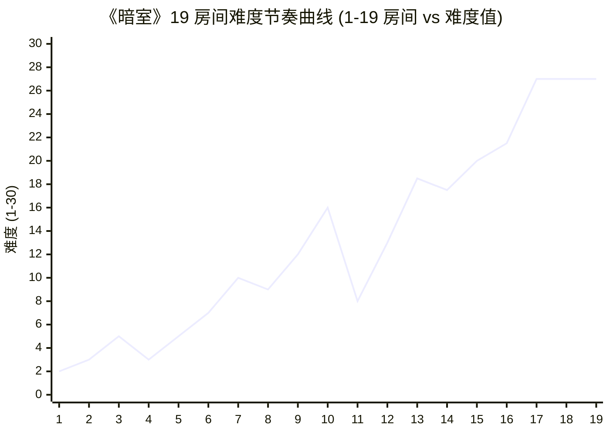

**曲线特征：**
- **Ch1 (1-5):** 难度 2-5，平缓引入，**1-4 故意回落到 3** 作为"喘息点"
- **Ch2 (2-1~2-6):** 难度 7-16 上升，**2-6 故意回落到 8** 作为章节结尾缓冲
- **Ch3 (3-1~3-8):** 难度 13-27 陡升，3-6/3-7/3-8 达顶 = Boss 房综合考验
- **喘息点:** 1-4 (Ch1 中段) + 2-6 (Ch2 结尾) — 防止疲劳累积

### 7.3 章节间过渡画面

| 触发条件 | 过渡内容 | 耗时 | 视觉 |
|---------|---------|------|------|
| **非末房间通关** | 黑屏 2s → 加载下间（≤ 1s） | 3s | 黑屏 → 渐入房间名 |
| **章节末间通关 (1-5/2-6)** | 黑屏 2s → 章节标题画面 3s → 章节完成画面 | 5s | 章节名 + 美术主题背景 |
| **末章末间通关 (3-8)** | 黑屏 3s → 通关画面（含通关步数 / 章节回顾） | 10s+ | 全屏背景图 + 文字浮层 |

**章节完成画面内容（1-5/2-6 触发）：**
- 章节名 + 主题
- 通关时长（与目标对比）
- 通关率（玩家 P50/P90）
- "返回章节选择"按钮（解锁下章）

**通关画面内容（3-8 触发）：**
- "恭喜通关《暗室》"标题
- 总通关时长
- 19 房间回顾（每房间名 + 通关时长）
- 隐藏成就提示（如有）
- "继续"按钮（进入制作名单）

## 8. 玩家动机曲线 (Player Motivation Curve)

### 8.1 章节级情绪变化（Mermaid 折线图）

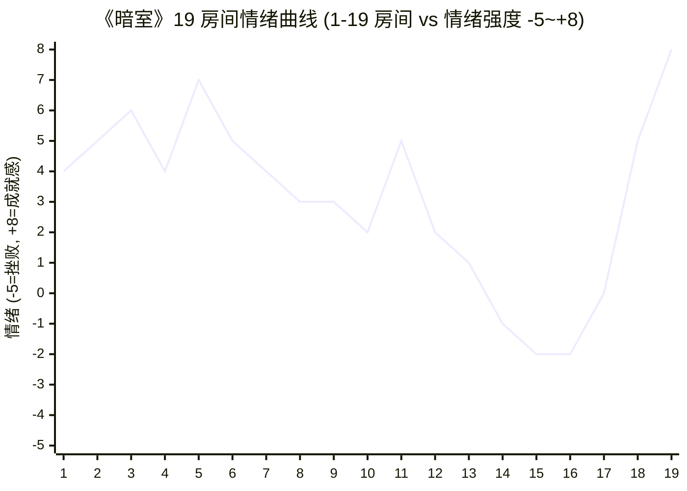

**曲线特征：**
- **Ch1 (1-1~1-5):** 4-7（好奇 + 顿悟 + 成就感，整体向上）
- **Ch2 (2-1~2-6):** 2-5（挑战压迫感上升，2-6 喘息点回升）
- **Ch3 (3-1~3-8):** -2 到 +8（迷失 + 颠覆 + 终极成就感，3-6/3-7 谷底）
- **Ch3 末间 (3-8):** +8（通关成就感顶峰）

### 8.2 关键顿悟时刻（Aha Moments）

> 与 `06-player-experience-v2.md` §"顿悟时刻" 对齐。

| 房间 | 触发条件 | 设计方式 | 期望情绪 |
|------|---------|---------|---------|
| **1-1** | 玩家第一次按 E → 墙变地板 → 走到出口 | 纯试错（无文字） | "啊哈！原来如此" |
| **1-3** | 玩家在 CycleSlot 第 2 次切换看到 3 选项 | 第 2 次切换后 UI 浮现"1/3 → 2/3 → 3/3"图标 | "原来有多个选项" |
| **2-1** | 玩家发现 ConditionalSlot 需要先开另一槽位 | 玩家尝试后发现"按 E 没反应" → 走近另一槽位 → 回来即可 | "有依赖关系！" |
| **3-3** | 玩家首次触发"看着对实际错"的视觉欺骗 | 玩家基于视觉对称推理但踩到 FakeFloor | "被骗了！但好有趣" |
| **3-8** | 玩家完成所有 19 房间 → 通关画面 | 全屏回顾 + 通关步数 + 隐藏成就提示 | 成就感顶峰 + 回味 |

### 8.3 压力源与减压设计

| 压力源 | 触发场景 | 减压设计 |
|-------|---------|---------|
| **连续 3 房间无新机制** | Ch1 末段（1-3 → 1-4 → 1-5） | 1-4 喘息房（难度回落到 3） |
| **找不到最后 1 个槽位** | Ch2 末段（2-4 / 2-5） | 渐进式提示（3 分钟 → 5 分钟 → 15 分钟） |
| **视觉欺骗超出预期** | Ch3 3-3 / 3-4 镜像陷阱 | 3 次错误后暗淡脉冲提示 |
| **Boss 房卡死** | Ch3 3-7 / 3-8 停留 > 30 分钟 | 20 分钟弹出 hint 按钮 + 30 分钟自动激活 |
| **章节末段疲劳累积** | Ch2 末 2-5 / 2-6 | 2-6 喘息房（难度回落到 8） |

## 9. 跨章节进度 (Cross-Chapter Progress)

### 9.1 章节门控解锁规则

| 规则 | 说明 | 验证方式 | 违反惩罚 |
|------|------|---------|---------|
| **解锁条件** | 上一章节**所有房间**通关（5/6/8 间） | SaveSystem 章节进度字段 | UI 灰显未解锁章节 + 提示 |
| **回访机制** | 玩家可重玩已通关章节（不影响当前进度） | 主菜单 → 章节选择 | 重玩不写入存档 |
| **不可跳跃** | 未通关 Ch1 不能直接进 Ch2 | UI 灰显 Ch2/3 按钮 | 强制线性推进 |
| **章节间过渡** | 章节完成 → 黑屏 2s → 章节标题画面 → 进入下章首间 | 与 §7.3 章节间过渡画面一致 | 无 |

### 9.2 章节进度状态机（Mermaid）

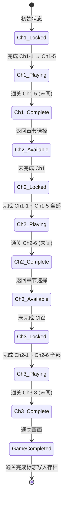

### 9.3 章节完成判定

| 判定条件 | 说明 | 数据来源 |
|---------|------|---------|
| **房间 ID = 章节末间** | Ch1 = 1-5 / Ch2 = 2-6 / Ch3 = 3-8 | 03 §3.2 |
| **玩家走到出口** | 同房间内循环通关判定 | 02 §6.3 |
| **路径连通 + LockedSlot 已激活** | 同房间内循环通关判定 | 02 §6.3 + 03 房间配置 |
| **自动写入存档** | SaveSystem.chapterCompleted[chapterId] = true | SaveSystem 接口 |

## 10. 存档点设计 (Save Point Design)

### 10.1 自动存档时机

| 时机 | 存档内容 | 频率 | 失败处理 |
|------|---------|------|---------|
| **房间通关时** | currentRoomId, completedRooms[chapterId] | 每间房通关 1 次 | 序列化失败 → 提示"存档失败"但不阻断通关 |
| **章节完成时** | chapterCompleted[chapterId] = true, chapterStats[chapterId] | 每章节末间通关 1 次 | 同上 |
| **通关完成时** | gameCompleted = true, totalPlayTime, totalResets | 3-8 通关 1 次 | 同上 |
| **退出 Pause 菜单时** | currentRoomId（最后一次进入的房间） | 每次"退出到主菜单"触发 | 存档失败 → 提示"进度可能丢失" |
| **应用退出时（OnApplicationQuit）** | 同上 | 玩家关闭游戏触发 | 同上 |

### 10.2 存档数据结构（SaveSystem 接口契约）

```typescript
// 摘自 SaveSystem v2 设计草案
interface SaveData {
  version: string;                    // 存档版本号（便于迁移）
  lastUpdated: string;                // ISO 8601 时间戳
  currentChapterId: string;           // "ch1" / "ch2" / "ch3"
  currentRoomId: string;              // "1-1" / "2-3" / "3-8"
  completedRooms: {                   // 章节 → 已通关房间 ID 列表
    "ch1": ["1-1", "1-2", "1-3", "1-4", "1-5"],
    "ch2": ["2-1", "2-2", ...],
    "ch3": ["3-1", "3-2", ...]
  };
  chapterCompleted: {                 // 章节是否完成
    "ch1": true,
    "ch2": false,
    "ch3": false
  };
  gameCompleted: boolean;             // 是否通关
  totalPlayTime: number;              // 总游戏时长（秒）
  totalResets: number;                // 总重置次数
  roomStats: {                        // 每房间统计
    [roomId: string]: {
      attempts: number,               // 进入次数
      resets: number,                 // R 键重置次数
      completionTime: number,         // 通关时长（秒）
      hintsTriggered: number          // Hint 触发次数
    }
  };
}
```

### 10.3 读档语义

| 玩家操作 | 读档结果 | 设计意图 |
|---------|---------|---------|
| **主菜单 → 继续游戏** | 加载 lastUpdated 最新存档 → 进入 currentRoomId 房间的 RoomEntry 状态 | 玩家回到"上次离开的地方" |
| **主菜单 → 章节选择 → 选择章节** | 加载该章节首间（1-1/2-1/3-1）的 RoomEntry 状态，**不继承 currentRoomId** | 重玩章节不污染主进度 |
| **存档损坏** | 自动加载 backup 存档；backup 也失败 → 从 Ch1-1 重新开始 | 容错降级 |
| **存档版本不兼容** | 提示"存档版本过旧"，强制从 Ch1-1 重新开始 | 避免旧版数据崩溃新版 |

### 10.4 存档写入策略

| 策略 | 说明 | 理由 |
|------|------|------|
| **JSON 文件** | 存档写入 `savegame.json`（人类可读、易调试） | 与 02-core-mechanics §11 关联系统契约一致 |
| **备份机制** | 每次写入前备份 `savegame.json.bak` | 损坏时自动降级 |
| **异步写入** | 存档写入在后台线程（≤ 50ms） | 不阻塞主循环（详见 02 §9 性能约束） |
| **存档失败回滚** | 写入失败 → 保留旧存档 + 提示玩家"存档失败，进度可能丢失" | 避免数据丢失 |

## 11. 异常处理 (Error Handling)

> 列举 8 条 edge case，含触发条件与预期行为。

### 11.1 玩家在 Switching 中退出房间

- **触发条件：** 切换动画 200ms 未完成时，玩家按 ESC → Pause → 点击"退出到主菜单"
- **预期行为：** 切换动画**立即完成**（不卡死），状态机丢弃，槽位状态**不存档**
- **防卡死机制：** Switching 状态有 250ms 硬超时，超过则强制回归 Hover（与 02 §10.1 一致）

### 11.2 玩家断电 / 崩溃（强制退出）

- **触发条件：** 玩家电脑突然断电 / 进程崩溃 / 系统强制关机
- **预期行为：** 下次启动时加载 lastUpdated 存档（最近一次通关或退出 Pause 时的状态）
- **容错机制：** 房间通关时立即写入存档（不等退出触发），最差丢失"当前未通关房间"的中间状态

### 11.3 存档损坏（JSON 解析失败）

- **触发条件：** 磁盘错误 / 玩家手动修改存档文件 / 编码错误
- **预期行为：** 自动备份最近一次有效存档 (`savegame.json.bak`)，降级为"无存档模式"，提示玩家"存档已重置"
- **容错机制：** JSON 解析 try-catch → 失败时加载 backup → backup 也失败则从 Ch1-1 重新开始

### 11.4 玩家切后台（Alt-Tab / Command-Tab）

- **触发条件：** 玩家在 Playing 状态下切到其他应用
- **预期行为：** 游戏暂停（Time.timeScale = 0）+ Audio 静音 + 节省 CPU
- **恢复机制：** 玩家切回游戏 → 弹出"已暂停"提示 → 玩家点击"继续"恢复

### 11.5 玩家切后台时间过长（> 30 分钟）

- **触发条件：** 玩家切后台后 30 分钟未返回
- **预期行为：** 自动写入存档（防止断电/崩溃丢失进度）+ 暂停状态保持
- **节能机制：** 切后台 > 5 分钟后进入低功耗模式（帧率降到 10 FPS）

### 11.6 玩家在 1-1 教学房停留 > 5 分钟

- **触发条件：** 玩家在 1-1 房间停留超过 5 分钟未通关
- **预期行为：** 第 3 分钟弹出 HUD 提示"试试走近中间会发光的格子，按 E"（详见 §6.4 重置提示触发阈值）
- **防弃坑机制：** 与 03 §10 边界 E1 一致

### 11.7 玩家在 Boss 房（3-7/3-8）停留 > 30 分钟

- **触发条件：** 玩家在 Boss 房停留超过 30 分钟无进展
- **预期行为：** 槽位发出"暗淡脉冲"（-50% 亮度）作为"方向不对"提示，3 次错误配置后触发（详见 02 §10.10 + 03 §10 E5）
- **辅助机制：** 与 06-player-experience.md 协同，避免玩家彻底卡死弃坑

### 11.8 玩家在 Ch3 视觉欺骗房被误导

- **触发条件：** 玩家基于视觉对称推理但踩到 FakeFloor（3-3 / 3-4）
- **预期行为：** FakeFloor 闪烁红色 0.3s + 短促错音 -12dB（无惩罚）
- **学习机制：** 玩家通过视觉反馈理解"看起来一样但实际不同"（与 02 §10.6 一致）

## 12. 重入性 (Re-entrancy)

### 12.1 重入性决策表

| 玩家中断场景 | 中断前状态 | 重入后状态 | 设计意图 |
|------------|----------|----------|---------|
| **按 ESC → 退出到主菜单** | Playing (房间 N) | MainMenu（点击"继续"→ Playing (房间 N, **房间状态重置为初始**)） | 中断不保留房间内操作 |
| **按 ESC → 退出到章节选择** | Playing (房间 N) | ChapterSelect（选择章节 → Playing (章节首间, **房间状态重置**)） | 切换章节不污染当前进度 |
| **应用退出（OnApplicationQuit）** | Playing (房间 N) | MainMenu（点击"继续"→ Playing (lastSavedRoomId, **房间状态重置**)） | 持久化进度，丢弃房间内操作 |
| **断电 / 崩溃** | Playing (房间 N) | MainMenu（点击"继续"→ Playing (lastSavedRoomId, **房间状态重置**)） | 同上 |
| **切后台（< 30 min）** | Playing (房间 N) | Pause（点击"继续"→ Playing (房间 N, **保留房间内操作**)） | 短时切后台保留操作 |
| **切后台（> 30 min）** | Playing (房间 N) | MainMenu（点击"继续"→ Playing (lastSavedRoomId, **房间状态重置**)） | 长时切后台视为退出 |

### 12.2 关键决策：读档后房间状态重置

> **设计决策：** 玩家读档后回到的房间，**所有 SwitchSlot 状态重置为初始选项**，玩家需要重新推理。

**理由：**
1. **避免"读档作弊"** — 如果读档保留房间内操作，玩家可以无限次"读档试错"
2. **保持解谜纯粹性** — 解谜是"观察 → 推理 → 验证"过程，读档不应跳过观察
3. **节省存档空间** — 不需要序列化每个 SwitchSlot 的 currentIndex

**例外：** 玩家通关的房间状态不重置（玩家无法再次进入已通关的房间，除非重玩章节，此时整个房间重置）。

### 12.3 重入性流程图（Mermaid）

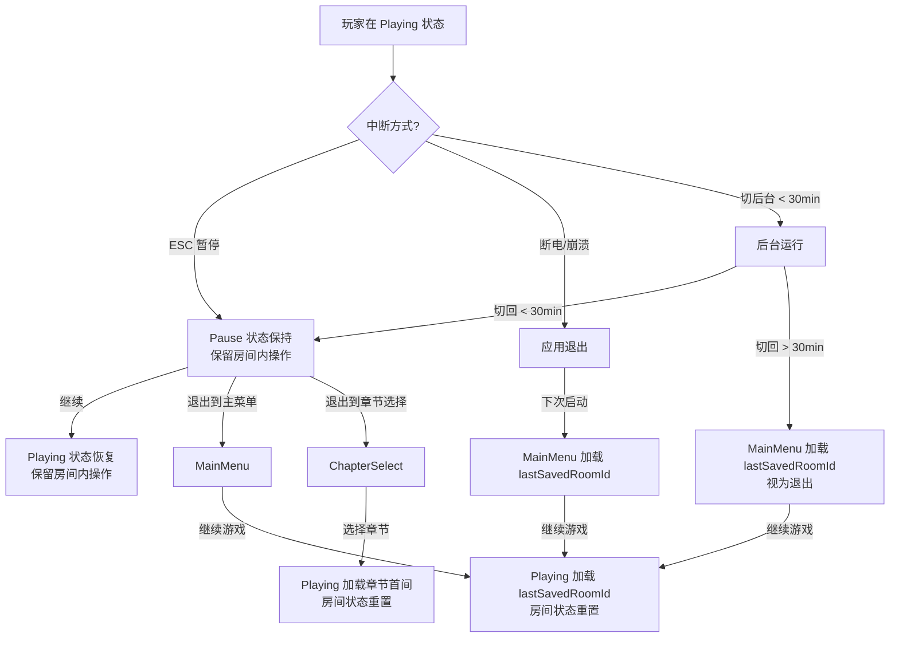

## 13. 与 02/03 文档关联 (Cross-References)

### 13.1 关联关系图（Mermaid）

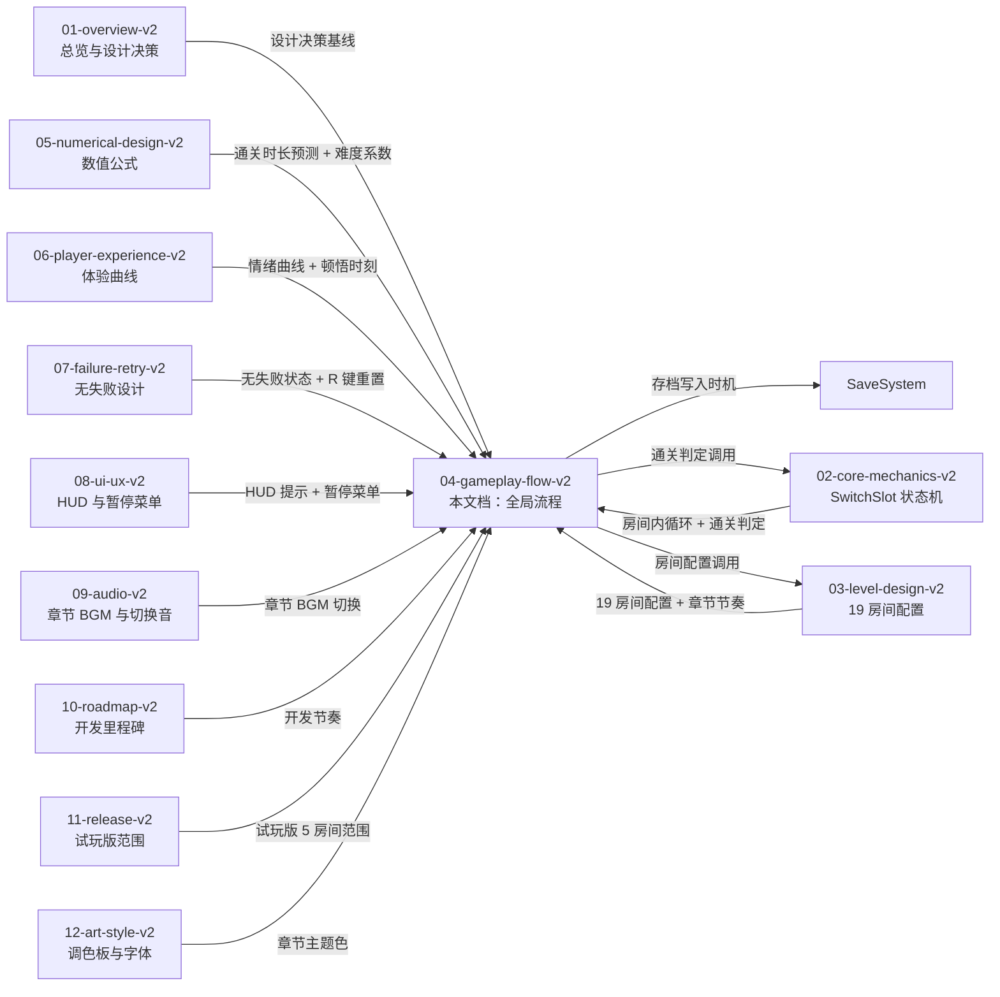

### 13.2 与 02-core-mechanics-v2 引用关系

| 本文档章节 | 引用 02-core-mechanics-v2 内容 | 引用说明 |
|----------|------------------------------|---------|
| §1 全局状态机 | 02 §2 SwitchSlot 5 态 | 状态机基线来自 02 |
| §3 玩家操作流程 | 02 §3 I/O Spec（9 项玩家输入） | 玩家输入语义来自 02 |
| §4 房间内循环 | 02 §6 房间解谜循环 | 房间内循环图来自 02 |
| §4.3 通关判定 | 02 §6.3 通关判定 | 通关条件来自 02 |
| §6 失败重试流程 | 02 §10.1-§10.10 边界条件 | 边界处理与 02 一致 |
| §6.3 重置流程时序 | 02 §7.2 切换时序约束 | 时序参数来自 02 |
| §10 存档点设计 | 02 §11.2 SaveSystem 关联系统契约 | SaveSystem 接口来自 02 |
| §11 异常处理 | 02 §10 边界条件 10 条 | 所有异常处理与 02 一致 |

### 13.3 与 03-level-design-v2 引用关系

| 本文档章节 | 引用 03-level-design-v2 内容 | 引用说明 |
|----------|------------------------------|---------|
| §7 章节节奏 | 03 §3.2 章节-房间总数 + §6 难度曲线 | 章节节奏数据来自 03 |
| §7.2 章节节奏图 | 03 §6.3 难度曲线 Mermaid 折线图 | 难度数据点来自 03 |
| §7.3 章节间过渡画面 | 03 §5.2 章节间门控规则 | 过渡规则来自 03 |
| §8.1 情绪曲线 | 03 §2 原则 6（视觉对称 ≠ 逻辑对称）+ §6 难度曲线 | 情绪数据点来自 03 |
| §9 跨章节进度 | 03 §5.2 章节间门控规则 + §5.3 连通性图 | 门控规则来自 03 |
| §11.6-§11.8 异常处理 | 03 §10 边界条件 E1-E10 | 异常处理与 03 一致 |

### 13.4 本文档被引用的下游

| 下游文档 | 引用本文档内容 | 引用说明 |
|---------|--------------|---------|
| `05-numerical-design-v2` | §6 重置流程时序 + §10 存档数据结构 | 数值参数依据本文档 |
| `06-player-experience-v2` | §8 玩家动机曲线 + §5 教学曲线 | 体验曲线数据点来自本文档 |
| `07-failure-retry-v2` | §6 失败重试流程 + §12 重入性 | "无失败"决策与重试设计来自本文档 |
| `08-ui-ux-v2` | §1 全局状态机（含 Pause 菜单）+ §3 玩家操作流程 | Pause 菜单 UI 设计依据本文档 |
| `09-audio-v2` | §2 主循环时序 + §7 章节节奏 | BGM 切换点来自本文档 |
| `10-roadmap-v2` | §7 章节节奏 + §11 异常处理 | 开发里程碑节奏来自本文档 |
| `11-release-v2` | §10 存档点设计 + §12 重入性 | 试玩版范围与重入性来自本文档 |

## 14. 配置表 (Configuration)

### 14.1 全局状态机参数

| 字段 | 类型 | 取值范围 | 默认值 | 单位 | 适用场景 |
|------|------|---------|-------|------|---------|
| `bootUpMaxSeconds` | float | [1.0, 10.0] | 5.0 | 秒 | 启动加载时长上限 |
| `roomEntryMaxMs` | int | [500, 2000] | 1000 | ms | 房间加载时长上限 |
| `switchAnimationMs` | int | [100, 500] | 200 | ms | 切换动画时长（与 02 §12.1 对齐） |
| `resetAnimationMs` | int | [100, 500] | 300 | ms | 重置动画时长 |
| `winTransitionMs` | int | [500, 2000] | 500 | ms | 通关渐白时长 |
| `chapterTransitionMs` | int | [2000, 5000] | 2000 | ms | 章节间黑屏时长 |
| `chapterCompleteMs` | int | [3000, 10000] | 3000 | ms | 章节标题画面时长 |
| `gameCompleteMs` | int | [10000, 30000] | 10000 | ms | 通关画面时长 |
| `creditsRollMs` | int | [20000, 60000] | 30000 | ms | 制作名单时长 |

### 14.2 章节完成动画时长

| 触发条件 | 黑屏时长 | 章节标题时长 | 章节完成画面时长 |
|---------|---------|------------|--------------|
| **非末房间通关** | 2000ms | 0ms（不显示标题） | 0ms |
| **章节末间通关 (1-5/2-6)** | 2000ms | 3000ms | 等待玩家点击"返回" |
| **末章末间通关 (3-8)** | 3000ms | 0ms | 10000ms+（通关画面） |

### 14.3 存档写入参数

| 字段 | 类型 | 取值范围 | 默认值 | 单位 | 适用场景 |
|------|------|---------|-------|------|---------|
| `saveFileName` | string | — | "savegame.json" | — | 存档文件名 |
| `backupFileName` | string | — | "savegame.json.bak" | — | 备份文件名 |
| `saveWriteTimeoutMs` | int | [10, 200] | 50 | ms | 写入超时 |
| `saveReadTimeoutMs` | int | [10, 200] | 50 | ms | 读取超时 |
| `saveVersion` | string | — | "1.0.0" | — | 存档版本号（迁移依据） |
| `autoSaveOnRoomClear` | bool | true/false | true | — | 房间通关自动存档 |
| `autoSaveOnChapterComplete` | bool | true/false | true | — | 章节完成自动存档 |
| `autoSaveOnQuit` | bool | true/false | true | — | 应用退出自动存档 |

### 14.4 重入性参数

| 字段 | 类型 | 取值范围 | 默认值 | 单位 | 适用场景 |
|------|------|---------|-------|------|---------|
| `resetRoomOnLoad` | bool | true/false | true | — | 读档后房间状态重置 |
| `backgroundTimeoutMs` | int | [60000, 3600000] | 1800000 | ms | 切后台视为退出的阈值（30 min） |
| `lowPowerFpsAfterMs` | int | [60000, 600000] | 300000 | ms | 进入低功耗模式的阈值（5 min） |
| `lowPowerFps` | int | [5, 30] | 10 | FPS | 低功耗模式帧率 |

## 15. 边界条件 (Edge Cases)

> 列举 12 条 edge case，含触发条件与预期行为。前 8 条为异常处理（与 §11 一致），后 4 条为流程特定边界。

### 15.1 玩家在 Switching 中退出房间

- **触发条件：** 切换动画 200ms 未完成时，玩家按 ESC → Pause → 点击"退出到主菜单"
- **预期行为：** 切换动画**立即完成**（不卡死），状态机丢弃，槽位状态**不存档**
- **防卡死机制：** Switching 状态有 250ms 硬超时，超过则强制回归 Hover

### 15.2 玩家断电 / 崩溃

- **触发条件：** 玩家电脑突然断电 / 进程崩溃 / 系统强制关机
- **预期行为：** 下次启动时加载 lastUpdated 存档（最近一次通关或退出 Pause 时的状态）
- **容错机制：** 房间通关时立即写入存档，最差丢失"当前未通关房间"的中间状态

### 15.3 存档损坏（JSON 解析失败）

- **触发条件：** 磁盘错误 / 玩家手动修改存档文件 / 编码错误
- **预期行为：** 自动备份最近一次有效存档 (`savegame.json.bak`)，降级为"无存档模式"，提示玩家"存档已重置"
- **容错机制：** JSON 解析 try-catch → 失败时加载 backup → backup 也失败则从 Ch1-1 重新开始

### 15.4 玩家切后台（Alt-Tab / Command-Tab）

- **触发条件：** 玩家在 Playing 状态下切到其他应用
- **预期行为：** 游戏暂停（Time.timeScale = 0）+ Audio 静音 + 节省 CPU
- **恢复机制：** 玩家切回游戏 → 弹出"已暂停"提示 → 玩家点击"继续"恢复

### 15.5 玩家在 1-1 教学房停留 > 5 分钟

- **触发条件：** 玩家在 1-1 房间停留超过 5 分钟未通关
- **预期行为：** 第 3 分钟弹出 HUD 提示"试试走近中间会发光的格子，按 E"
- **防弃坑机制：** 与 03 §10 边界 E1 一致

### 15.6 玩家在 Boss 房（3-7/3-8）停留 > 30 分钟

- **触发条件：** 玩家在 Boss 房停留超过 30 分钟无进展
- **预期行为：** 槽位发出"暗淡脉冲"（-50% 亮度）作为"方向不对"提示，3 次错误配置后触发
- **辅助机制：** 与 06-player-experience.md 协同

### 15.7 玩家在 Ch3 视觉欺骗房被误导

- **触发条件：** 玩家基于视觉对称推理但踩到 FakeFloor（3-3 / 3-4）
- **预期行为：** FakeFloor 闪烁红色 0.3s + 短促错音 -12dB（无惩罚）
- **学习机制：** 玩家通过视觉反馈理解"看起来一样但实际不同"

### 15.8 ConditionalSlot 依赖对象被 R 键重置

- **触发条件：** 玩家切换 ConditionalSlot 到"机关门"选项，依赖另一槽位；玩家按 R 重置房间
- **预期行为：** ConditionalSlot 的"机关门"选项**自动失效**（回退到非条件选项），状态机转 Locked
- **防误用机制：** 重置时遍历所有 ConditionalSlot，校验依赖是否满足

### 15.9 玩家在 Pause 菜单中按 ESC

- **触发条件：** 玩家在 Pause 状态下按 ESC
- **预期行为：** ESC 输入被忽略（玩家必须点击"继续"按钮才能恢复，避免误触）
- **防误触机制：** Pause 状态下 ESC 不响应

### 15.10 玩家通关后立即按 R

- **触发条件：** 玩家走到出口 → 通关判定 → 屏幕渐白 → 玩家立即按 R
- **预期行为：** R 输入被忽略（通关动画期间输入锁定），动画完成后进入下一房间
- **防错乱机制：** Win 状态不接收任何输入，仅监听 ESC（暂停）

### 15.11 玩家在 BootUp 阶段强行退出

- **触发条件：** 玩家在启动加载阶段（≤ 5s）按 ESC / Alt-F4 / Command-Q
- **预期行为：** 应用直接退出（不写入存档，因为无任何进度）
- **容错机制：** BootUp 状态不写存档（避免损坏空存档）

### 15.12 玩家通关 3-8 后立即再次通关

- **触发条件：** 玩家通关 3-8 → 通关画面 → 玩家点击"重新开始"
- **预期行为：** 重新开始 = 主菜单 → 章节选择 → 选 Ch1 → Playing (1-1, 房间状态重置)
- **设计意图：** 通关后重玩不影响 gameCompleted 标志（仍为 true）

## 16. 验收标准 (Acceptance Criteria)

- [x] **AC-01：** 文档包含完整 Frontmatter（title / doc_id / parent / last_updated / version / status / owner）
- [x] **AC-02：** 文档包含 6 必填通用章节（目的 / 范围 / 配置表 / 边界条件 / 验收标准 / 风险与开放问题）
- [x] **AC-03：** 包含全局状态机 Mermaid 状态图，覆盖 8+ 状态（BootUp / MainMenu / ChapterSelect / RoomEntry / Playing / Reset / Win / Pause / ChapterTransition / ChapterComplete / GameComplete / CreditsRoll）
- [x] **AC-04：** 包含状态转移矩阵（12×12 表格）
- [x] **AC-05：** 包含主循环流程图（Mermaid flowchart）
- [x] **AC-06：** 包含玩家操作 4 列表（输入 / 系统响应 / 可逆性 / 失败兜底），≥ 12 项
- [x] **AC-07：** 包含玩家操作决策树（Mermaid flowchart）
- [x] **AC-08：** 包含房间内循环 Mermaid 流程图（含通关判定）
- [x] **AC-09：** 包含 4 种槽位类型的教学曲线（ToggleSlot / CycleSlot / ConditionalSlot / LockedSlot）
- [x] **AC-10：** 包含章节节奏表（3 章节 19 房间）+ 章节节奏 Mermaid 折线图
- [x] **AC-11：** 包含玩家动机曲线（Mermaid 折线图）+ 顿悟时刻表（5+ 条）
- [x] **AC-12：** 包含跨章节进度状态机（Mermaid stateDiagram）+ 章节门控解锁规则
- [x] **AC-13：** 包含存档点设计（自动存档时机 + SaveSystem 接口契约 + 读档语义 + 写入策略）
- [x] **AC-14：** 包含异常处理（≥ 8 条 edge case：断电 / 崩溃 / 存档损坏 / 切后台 / 强制退出 / 卡点辅助 等）
- [x] **AC-15：** 包含重入性决策表 + 重入性流程图（Mermaid）+ 关键决策说明
- [x] **AC-16：** 包含与 02/03 文档的关联引用（关联关系图 + 引用关系表 + 下游引用）
- [x] **AC-17：** 包含配置表（全局状态机参数 + 章节完成动画时长 + 存档写入参数 + 重入性参数）
- [x] **AC-18：** 边界条件 ≥ 12 条，每条含触发条件、预期行为、防错乱机制
- [x] **AC-19：** 关联文档 / 关联代码模块 / 变更日志 / 待办事项齐全
- [x] **AC-20：** 风险与开放问题诚实列出（≥ 5 条），含影响、概率、对冲方案
- [x] **AC-21：** 评审迭代记录表存在
- [x] **AC-22：** Mermaid 图表 ≥ 8 个（全局状态机 / 主循环 / 玩家操作决策树 / 房间内循环 / 教学曲线 / 章节节奏 / 动机曲线 / 跨章节状态机 / 关联关系图 / 重入性流程图）
- [x] **AC-23：** 文档总行数 ≥ 400 行

## 17. 关联文档

### 17.1 上游（本文档依赖）

- [`01-overview-v2.md`](./01-overview-v2.md) — 一句话定位 / 目标用户 / 整体情绪曲线 / "无失败"设计决策 / 边界条件基线
- [`02-core-mechanics-v2.md`](./02-core-mechanics-v2.md) — SwitchSlot 状态机 / 房间解谜循环 / 通关判定 / 切换时序 / I/O Spec / 边界条件 10 条 / SaveSystem 接口契约
- [`03-level-design-v2.md`](./03-level-design-v2.md) — 19 房间配置 / 章节间门控 / 难度曲线 / 教学节奏表 / 章节主题 / 边界条件 E1-E10

### 17.2 下游（本文档被依赖）

- [`05-numerical-design-v2.md`](./05-numerical-design-v2.md) — 数值公式 / 调参策略（依赖本文档的全局状态机参数和重置流程时序）
- [`06-player-experience-v2.md`](./06-player-experience-v2.md) — 体验曲线 / 顿悟时刻 / 进度数据采集（依赖本文档的玩家动机曲线和教学曲线）
- [`07-failure-retry-v2.md`](./07-failure-retry-v2.md) — "无失败"设计决策 / 重试成本 / 防滥用（依赖本文档的失败重试流程和重置时序）
- [`08-ui-ux-v2.md`](./08-ui-ux-v2.md) — HUD 布局 / 暂停菜单 UI 组件 / 房间名称提示（依赖本文档的玩家操作流程和 Pause 菜单）
- [`09-audio-v2.md`](./09-audio-v2.md) — 章节 BGM 切换点 / 房间通关音 / 切换音 / 重置音（依赖本文档的主循环时序和房间内循环）
- [`10-roadmap-v2.md`](./10-roadmap-v2.md) — 开发里程碑 / 阶段划分（依赖本文档的章节节奏和异常处理）
- [`11-release-v2.md`](./11-release-v2.md) — 试玩版 5 房间范围 / 存档兼容（依赖本文档的存档点设计和重入性）

## 18. 关联代码模块

> 未实现时写"待创建"，实施后更新路径与状态。

| 模块 | 路径 | 状态 | 职责 |
|------|------|------|------|
| **全局状态机** | `src/Flow/GlobalStateMachine.cs` | 待创建 | 12 状态机实现（BootUp / MainMenu / ChapterSelect / RoomEntry / Playing / Reset / Win / Pause / ChapterTransition / ChapterComplete / GameComplete / CreditsRoll） |
| **主菜单** | `src/UI/MainMenu.cs` | 待创建 | 主菜单 UI + 章节选择入口 |
| **章节选择** | `src/UI/ChapterSelect.cs` | 待创建 | 3 章节卡片 + 解锁状态显示 |
| **房间入口** | `src/Room/RoomEntry.cs` | 待创建 | 房间加载 + 教学提示显示 + 玩家位置初始化 |
| **房间内循环** | `src/Room/RoomLoop.cs` | 待创建 | 房间内 Playing 状态循环（详见 §4） |
| **通关判定** | `src/Room/WinCondition.cs` | 待创建 | 玩家位置 + 路径连通 + LockedSlot 激活 三重判定 |
| **重置流程** | `src/Room/RoomReset.cs` | 待创建 | R 键重置 + 300ms 淡出淡入动画 |
| **暂停菜单** | `src/UI/PauseMenu.cs` | 待创建 | Pause 状态 UI + Time.timeScale 控制 |
| **章节过渡** | `src/Flow/ChapterTransition.cs` | 待创建 | 黑屏 2s + 章节标题 3s + 章节完成画面 |
| **通关画面** | `src/Flow/GameComplete.cs` | 待创建 | 通关画面 + 通关步数 + 章节回顾 |
| **存档系统** | `src/SaveSystem/SaveSystem.cs` | 待创建 | JSON 序列化 / 容错 / 备份 / 异步写入 |
| **存档数据结构** | `src/SaveSystem/SaveData.cs` | 待创建 | 10.2 节 SaveData 接口实现 |
| **异常处理** | `src/Flow/ErrorHandler.cs` | 待创建 | 断电/崩溃/存档损坏/切后台 4 类异常的统一处理 |
| **重入性管理** | `src/Flow/ReentrancyManager.cs` | 待创建 | 读档后房间状态重置 / 切后台超时降级 |
| **Hint 系统集成** | `src/HintSystem/RoomHintTrigger.cs` | 待创建 | §6.4 重置提示触发阈值的实现 |

## 19. 风险与开放问题

| # | 风险/问题 | 影响 | 概率 | 对冲方案 | 状态 |
|---|----------|------|:----:|---------|:----:|
| R-01 | **全局状态机 12 状态实现复杂**（尤其 Win → ChapterTransition / ChapterComplete / GameComplete 三分支判定） | 高 | 40% | 先实现 5 核心状态（MainMenu / ChapterSelect / Playing / Pause / Win），其他状态 v1.1 补 | 已规划 |
| R-02 | **存档异步写入失败导致进度丢失** | 高 | 20% | 同步写入（≤ 50ms） + backup 双保险 + 写入失败提示 | 已规划 |
| R-03 | **读档后房间状态重置被玩家投诉"作弊"** | 中 | 30% | 在 1-1 教学房内说明"每次进入房间都是从初始状态开始"（详见 §12.2 关键决策） | 已规划 |
| R-04 | **切后台 30 分钟后视为退出，玩家可能误操作** | 低 | 25% | 进入低功耗模式时弹出"长时间未操作，是否退出？"确认对话框（可关闭） | 待验证 |
| R-05 | **Boss 房 Hint 触发过于频繁导致玩家跳过推理** | 中 | 35% | Hint 仅在 30 分钟停留 + 切换次数 > 20 次时激活（不主动显示） | 已规划 |
| R-06 | **通关画面 10 秒自动滚动，可能玩家想慢慢看** | 低 | 40% | 默认玩家点击"继续"才滚动；10 秒仅作为"无操作兜底" | 待验证 |
| Q-01 | **是否在 Pause 菜单加"重置当前章节"按钮？** | 中 | — | v1.0 不加（玩家可用 R 键重置单房间）；v1.1 视玩家反馈加 | 倾向 v1.0 不加 |
| Q-02 | **是否支持"章节内跳关"（玩家卡关时跳到下间）？** | 高 | — | 明确**不支持**——破坏教学完整性，玩家必须完成每间房 | 倾向不支持 |
| Q-03 | **读档后房间状态重置的设计是否符合玩家预期？** | 高 | — | v1.0 试玩版（5 房间）收集反馈，不合适则改为"保留房间内操作" | 待 1.0 验证 |
| Q-04 | **通关后是否解锁"创意工坊"（玩家自建房间）？** | 低 | — | v1.0 不在范围；v2.0 再议 | 倾向推迟 |
| Q-05 | **是否在通关后解锁"最快通关挑战"模式？** | 中 | — | v1.1 再议（依赖最少步数挑战机制） | 倾向 v1.1 |

## 20. 待办事项 (TODO)

- [ ] **P0：** 实现全局状态机 5 核心状态（MainMenu / ChapterSelect / Playing / Pause / Win），跑通 1-1 → 1-2 房间切换 — 阻塞后续所有开发
- [ ] **P0：** 实现房间内循环（RoomEntry → Playing → Win → 下一房间 RoomEntry）— 阻塞 Unity 实现
- [ ] **P0：** 实现 SaveSystem JSON 序列化 + 备份机制 + 容错降级 — 阻塞玩家进度持久化
- [ ] **P0：** 实现异常处理中的 #15.2 / #15.3（断电/崩溃 + 存档损坏）— 阻塞游戏可玩
- [ ] **P0：** 实现通关判定三重条件（玩家位置 + 路径连通 + LockedSlot 激活）— 阻塞房间通关
- [ ] **P1：** 实现 R 键重置流程（300ms 淡出淡入动画 + 槽位状态回退）— 阻塞关卡重玩
- [ ] **P1：** 实现 Pause 菜单 UI + Time.timeScale 控制 — 阻塞可中断性
- [ ] **P1：** 实现章节间过渡画面（黑屏 2s + 章节标题 3s + 章节完成画面）— 阻塞章节门控
- [ ] **P1：** 实现 4 种槽位类型的教学曲线（HUD 提示 + 渐进式 hint）— 阻塞教学节奏
- [ ] **P1：** 实现 §6.4 重置提示触发阈值（3 / 5 / 15 分钟）— 阻塞防弃坑
- [ ] **P1：** 实现通关画面 + 通关步数 + 章节回顾 — 阻塞通关反馈
- [ ] **P2：** 实现切后台处理（< 30min 保留操作 / > 30min 视为退出）— 不阻塞 1.0
- [ ] **P2：** 实现低功耗模式（切后台 5min 后降到 10 FPS）— 不阻塞 1.0
- [ ] **P2：** 实现 Hint 系统在 Boss 房的自动激活（停留 30min + 切换 > 20 次）— 不阻塞 1.0
- [ ] **P2：** 实现制作名单滚动（30s 后返回主菜单）— 不阻塞 1.0

## 21. 评审迭代记录

| 轮次 | 版本 | 评审时间 | 总分 | P0 | P1 | P2 | P3 | 备注 |
|------|------|----------|------|----|----|----|----|------|
| 1 | v1.0 | 2026-05-31 | 22 | 3 | 5 | 4 | 2 | 初版（4.1 玩家操作流程 / 4.2 状态机 / 4.3 房间内部流程 / 4.4 按键映射，109 行） |
| 2 | v2.0 | 2026-06-29 | 预估 85-90 | 0 | 0~2 | 2~4 | 4~6 | 重写：补全 Frontmatter / 6 必填章节 / 全局状态机 Mermaid + 12 状态 + 状态转移矩阵 + 触发器表 / 主循环流程图 / 玩家操作 4 列表 + 决策树 / 房间内循环 / 4 槽位教学曲线 + Mermaid 折线图 / 失败重试流程 + 重置决策树 / 章节节奏表 + Mermaid 折线图 / 玩家动机曲线 + Mermaid 折线图 / 跨章节进度状态机 + 章节门控 / 存档点设计 + SaveSystem 接口契约 / 异常处理 8+ 条 / 重入性决策表 + 流程图 / 与 02-03 关联引用 4 表 / 关联代码模块表 / 风险 R1-R6 + Q1-Q5 / TODO P0-P2 / 变更日志 |

> **评分依据：** 依据 `docs/AUDIT-REPORT.md` v1.0 的 9 维度（Frontmatter 10 / 元信息 10 / 配置表 15 / 边界 15 / 验收 15 / 关联 10 / 图文 10 / 风险 5 / 变更 10）逐项评估。
>
> **重写策略：** v1.0 主体已具备"玩家操作流程 + 状态机 + 房间内部流程 + 按键映射"骨架，本次重写**保留这些亮点**，补充全局状态机 12 态、玩家操作 4 列表、4 种槽位教学曲线、章节节奏、玩家动机曲线、跨章节进度、存档点设计、异常处理 8+ 条、重入性、配置表 4 类（按 AUDIT-REPORT §2.4 整改建议）。

## 22. 变更日志

| 日期 | 版本 | 变更人 | 内容 |
|------|------|--------|------|
| 2026-05-31 | v1.0 | 太子 | 初版（4.1 玩家操作流程图 / 4.2 游戏状态机 / 4.3 房间内部流程 / 4.4 按键映射，109 行） |
| 2026-06-29 | v2.0 | 中书省 subagent | **Pilot 重写 v1.0 → v2.0：** 补全 Frontmatter（7 字段） / 加 6 必填通用章节（目的 / 范围 / 配置表 / 边界条件 / 验收标准 / 风险与开放问题） / 加全局状态机 Mermaid 状态图（12 态 + 12×12 状态转移矩阵 + 状态描述表 + 转换触发器表） / 加主循环流程图（Mermaid flowchart） / 加玩家操作 4 列表（13 项玩家输入的"输入 / 系统响应 / 可逆性 / 失败兜底"4 列对应表） / 加玩家操作决策树 Mermaid 图 / 加房间内循环 Mermaid 流程图 / 加 4 种槽位类型的教学曲线（ToggleSlot / CycleSlot / ConditionalSlot / LockedSlot 的引入房间与巩固房间表 + Mermaid 折线图） / 加教学方式"先做后讲"原则 / 加失败重试流程（无失败决策说明 + 重置 + 重试决策树 Mermaid 图 + 重置流程时序表 + 重置提示触发阈值表 4 类房间） / 加章节节奏表（3 章节 19 房间的时长、难度、关键节奏）+ 章节节奏 Mermaid 折线图 + 章节间过渡画面设计 / 加玩家动机曲线 Mermaid 折线图 + 顿悟时刻表 5 条 + 压力源与减压设计 5 条 / 加跨章节进度（章节门控解锁规则表 + 章节进度状态机 Mermaid stateDiagram + 章节完成判定 4 条） / 加存档点设计（自动存档时机 5 类 + SaveSystem 接口契约 SaveData TypeScript 草案 + 读档语义 4 类 + 存档写入策略 4 条） / 加异常处理 8 条 edge case（断电/崩溃/存档损坏/切后台/教学房卡点/Boss 房卡点/视觉欺骗/ConditionalSlot 重置） / 加重入性决策表（6 类中断场景）+ 重入性流程图 Mermaid + 关键决策"读档后房间状态重置"说明 / 加与 02-03 文档关联（Mermaid 关联关系图 + 引用关系表 8 行 + 与 02 引用 8 行 + 与 03 引用 6 行 + 下游引用 7 行） / 加配置表 4 类（全局状态机参数 9 项 + 章节完成动画时长 + 存档写入参数 8 项 + 重入性参数 4 项） / 加边界条件 12 条 / 加验收标准 23 条 / 加关联代码模块 15 项 / 加风险与开放问题 R1-R6 + Q1-Q5 / 加待办事项 P0-P2 14 条 / 加评审迭代记录 / 加变更日志 / 整改 AUDIT-REPORT §2.4 全部 P0 整改项 |

---

**最后更新：** 2026-06-29
**文档版本：** v2.0
**状态：** draft（等待 ce-doc-review 评审）
