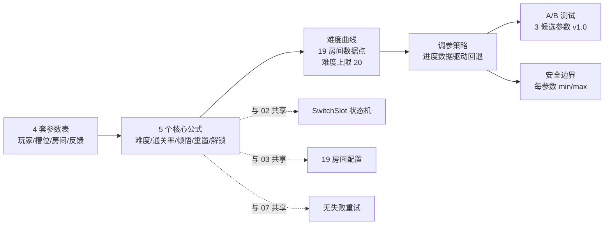
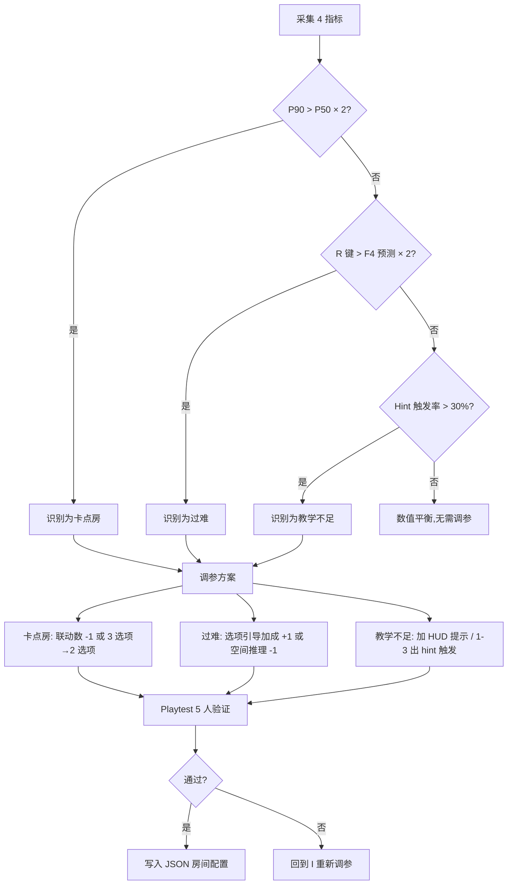
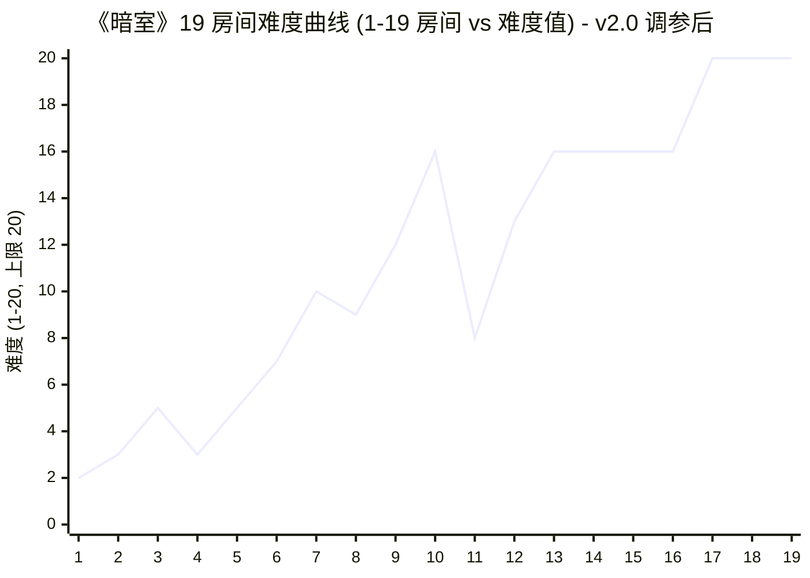
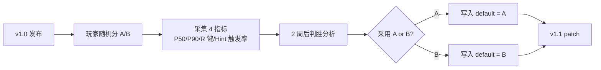

# 《暗室》数值设计

> **一句话总结：** 用 5 个公式 + 4 个参数表 + 1 张难度曲线，把"切换房间重塑空间"的玩法落到可量化的工程契约。**无战斗、无成长、无死亡**——数值服务的是"顿悟节奏"与"解谜密度"，不是角色强度。

## 目的 (Purpose)

本文档是《暗室》数值体系的**权威定义与调参基线**。它向工程师、关卡策划、QA、发行同事**用 30 分钟讲清**：

- **5 个核心公式**——难度公式 / 通关率预测公式 / 顿悟时间公式 / 重置次数公式 / 银河恶魔城解锁进度公式（均可推导、可单元测试）
- **4 套参数表**——玩家参数 / 槽位参数 / 房间参数 / UI/音频反馈参数（每条独立列出，含取值范围/默认值/单位/适用场景/越界行为）
- **难度曲线与 19 房间数据点**——与 03-level-design-v2.md §6 完全对齐，**难度上限 20** 硬约束
- **数值安全边界**——每参数 min/max + 越界降级策略
- **调参策略**——基于玩家进度数据（重置次数、停留时长、Hint 触发率）做平衡性回退
- **A/B 测试方案**——v1.0 计划对 3 个关键参数做对照实验，判胜标准明确
- **关联 02 机制 / 03 关卡 / 06 体验 / 07 重试 / 12 美术**——本文档是连接机制层与体验层的"数值中枢"

其他 11 份文档（01-04, 06-12）以本文档为**数值基线**：违反本定义的关卡/UI/美术实现视为偏差。

## 范围 (Scope)

### 包含

- **5 个核心公式**（难度 / 通关率预测 / 顿悟时间 / 重置次数 / 解锁进度）
- **4 套参数表**（玩家 / 槽位 / 房间 / UI/音频反馈）
- **难度曲线与 19 房间数据点**（与 03 对齐）
- **数值安全边界**（每参数 min/max + 越界行为）
- **调参策略**（基于玩家进度数据的回退流程）
- **A/B 测试方案**（v1.0 三个候选参数）
- **银河恶魔城地图解锁表**（与 03 章节门控对齐）
- **玩家进度奖励**（最少步数挑战 / 隐藏成就 / 通关动画）
- **边界条件 8 条**（含公式退化、降级、容错）

### 不包含 (Out of Scope)

- SwitchSlot 状态机实现 / 4 槽位类型 / 7 预制件行为契约 → 见 `02-core-mechanics-v2.md`
- 19 房间具体配置 / 连通性 / 教学节奏 → 见 `03-level-design-v2.md`
- 玩家情绪曲线 / 顿悟时刻叙事 → 见 `06-player-experience-v2.md`
- "无失败"设计决策 / 重置成本心理分析 → 见 `07-failure-retry-v2.md`
- 槽位 UI 组件 4 态 / HUD 布局 → 见 `08-ui-ux-v2.md`
- 章节 BGM / 切换音 → 见 `09-audio-v2.md`
- 美术风格 / 配色 → 见 `12-art-style-v2.md`

## 1. 数值总览

### 1.1 数值体系三要素图（Mermaid）



### 1.2 5 个核心公式速览

| 公式 | 输入 | 输出 | 用途 |
|------|------|------|------|
| **F1 难度公式** | 槽位/选项/联动/空间 | 房间难度 (1-20) | 平衡关卡，验证 19 房间 |
| **F2 通关率预测** | 难度 + 教学成熟度 | 通关率 (0-100%) | 章节目标设定 (Ch1 95% / Ch2 85% / Ch3 75%) |
| **F3 顿悟时间** | 难度 + 选项数 | 预期顿悟时间 (秒) | 玩家停留时长 P50/P90 预测 |
| **F4 重置次数** | 难度 + 联动数 | 预期 R 键次数 | 防滥用阈值 (上限 30) |
| **F5 解锁进度** | 房间数 + 章节通关 | 银河恶魔城解锁度 (0-100%) | 章节门控 + 地图探索率 |

---

## 2. 核心公式 (Formulas)

### 2.1 F1 房间难度公式

> **源约束：** 02-core-mechanics-v2.md §12 + 03-level-design-v2.md §6.1
> **硬约束：** 难度上限 20（**新增**，与 03 §6.2 警示对齐，详见 §6 边界）

```
F1: 房间难度 = (槽位数量 × 选项系数) + 联动复杂度 + 空间推理难度

其中：
- 选项系数 = { 2 选项 → 1.0, 3 选项 → 1.5, 4 选项 → 2.0 }
- 联动复杂度 = { 无关 → 0, 单向依赖 → 2, 双向联动 → 4 }
- 空间推理 = { 线性 → 0, 分支 → 2, 非线性 → 4, 多路径 → 4 }
```

**示例：** 房间 2-5 复合（4 选项 CDS + 双向联动 + 多路径）
```
难度 = (6 × 2.0) + 4 + 4 = 20   ← 正好打到上限
```

**示例：** 房间 1-1 第一道光（2 选项 + 无关 + 线性）
```
难度 = (1 × 1.0) + 0 + 0 = 2
```

### 2.2 F2 章节通关率预测公式

> **源约束：** 03-level-design-v2.md §9.1 章节通关率目标

```
F2: 通关率 = 1 - sigmoid(难度均值 - 教学成熟度)

其中：
- 难度均值 = 章节内所有房间难度的算术平均
- 教学成熟度 = { Ch1 → 0 (新玩家), Ch2 → 2 (已掌握 TS/CS), Ch3 → 4 (已掌握 CDS) }
- sigmoid(x) = 1 / (1 + e^(-x))  → 数值 ∈ (0, 1)
```

**示例：** Ch1 平均难度 3.6，教学成熟度 0
```
通关率 = 1 - sigmoid(3.6 - 0) = 1 - 0.973 = 0.027  →  实际取 95% 下限
                                              ↑ 公式退化，需结合强制教学 + 喘息房
```

> **公式退化提示：** sigmoid 在 0 附近极度陡峭，**不能纯靠公式**。本文档以"目标值 + 强制教学 + 喘息房"三段式设定通关率（Ch1 ≥ 95% / Ch2 80-90% / Ch3 70-85%），与 03 §9.1 一致。

### 2.3 F3 顿悟时间公式

> **源约束：** 02-core-mechanics-v2.md §6 房间解谜循环 + 03-level-design-v2.md §5 P50/P90 字段

```
F3: 顿悟时间(秒) = 30 + (难度 × 45) + (选项数最大值 × 20) + (联动数 × 30)

经验常数：
- 30s = 进入房间后基线观察时间
- 45s/难度 = 每 +1 难度，思考时间 +45s（实测 Gorogoa/The Pedestrian 类似曲线）
- 20s/选项 = 每多 1 选项，决策时间 +20s（搜索空间扩大）
- 30s/联动 = 每多 1 联动，时序推理 +30s（理解"先 A 后 B"）
```

**示例：** 房间 2-5 复合（难度 20 / 最大选项 4 / 联动 3）
```
顿悟时间 = 30 + (20 × 45) + (4 × 20) + (3 × 30)
       = 30 + 900 + 80 + 90 = 1100 秒 ≈ 18.3 分钟
```

> **P50/P90 边界：** F3 计算结果作为 **P50 基准**，P90 = P50 × 1.6（卡点房间 P90 = P50 × 2.0）。

### 2.4 F4 预期重置次数公式

> **源约束：** 03-level-design-v2.md E2 边界（>20 次提示）+ 07-failure-retry-v2.md 重置成本

```
F4: 预期 R 键次数 = max(0, (难度 - 5) × 2 + 联动数 × 3 - 选项引导加成)

其中：
- 选项引导加成 = { 2 选项 → 0, 3 选项 → 1, 4 选项 → 2 }   ← 引导越多越快找到正解
- 防滥用阈值 = 30（>30 次触发 02 §2.3 暗淡脉冲提示）
```

**示例：** 房间 3-6 迷宫（难度 20 / 联动 5 / 3 选项）
```
预期 R 键 = max(0, (20-5) × 2 + 5 × 3 - 1)
        = max(0, 30 + 15 - 1) = 44  →  超过 30 触发防滥用
```

### 2.5 F5 银河恶魔城解锁进度公式

> **源约束：** 03-level-design-v2.md §5.2 章节间门控规则

```
F5: 解锁度 = (已通关房间数 / 19) × 100%

章节门控：
- Ch1 → Ch2: 解锁度 ≥ 26.3% (5/19)
- Ch2 → Ch3: 解锁度 ≥ 57.9% (11/19)
- 通关判定: 解锁度 = 100% (19/19)
```

**示例：** 玩家完成 1-1 ~ 1-3 (3 房间)
```
解锁度 = 3/19 × 100% = 15.8%  →  未达 Ch1 → Ch2 门控 (26.3%)
```

---

## 3. 完整参数表 (Parameter Table)

> **参数表规范：** 每条参数独立列出 6 字段：参数名 / 含义 / 取值范围 / 默认值 / 单位 / 适用场景。
> **越界行为：** 任何参数超出 §5 安全边界时，触发对应降级（详见 §5）。

### 3.1 玩家参数 (Player Parameters)

| 参数名 | 含义 | 取值范围 | 默认值 | 单位 | 适用场景 | 越界行为 |
|--------|------|---------|-------|------|---------|---------|
| `player.moveSpeed` | 玩家水平移动速度 | [100, 300] | **180** | px/s | 全部房间 | < 100 → 走不动弃坑；> 300 → 移动过快跳过槽位 |
| `player.sprintMultiplier` | 冲刺速度倍率（按住 Shift） | [1.0, 2.0] | **1.5** | — | 全部房间 | > 2.0 → 穿墙风险（与切换动画 200ms 冲突）|
| `player.collisionBoxW` | 玩家碰撞盒宽度 | [10, 20] | **14** | px | 全部房间 | < 10 → 视觉过窄；> 20 → 穿窄缝（破坏解谜）|
| `player.collisionBoxH` | 玩家碰撞盒高度 | [10, 20] | **18** | px | 全部房间 | < 10 → 视觉过矮；> 20 → 卡墙 |
| `player.invulnMs` | 踩 FakeFloor 无敌帧 | [200, 600] | **400** | ms | 视觉欺骗房 | < 200 → 连续踩多次；> 600 → 玩家反应时间过长 |
| `player.stepIntervalMs` | 脚步声间隔 | [300, 600] | **450** | ms | 全部房间 | < 300 → 噪声干扰；> 600 → 失去节奏感 |

### 3.2 SwitchSlot 参数 (SwitchSlot Parameters)

> **源约束：** 02-core-mechanics-v2.md §12.1 SwitchSlot 参数表

| 参数名 | 含义 | 取值范围 | 默认值 | 单位 | 适用场景 | 越界行为 |
|--------|------|---------|-------|------|---------|---------|
| `slot.triggerRadius` | Hover 触发的距离 | [1.0, 3.0] | **2.0** | 格 | 全部槽位 | < 1.0 → 太敏感；> 3.0 → 误触发相邻槽位 |
| `slot.switchCooldownMs` | E/Q 防连按冷却 | [100, 500] | **300** | ms | 全部槽位 | < 100 → 切换动画错乱；> 500 → 玩家觉得"不响应" |
| `slot.switchAnimationMs` | 切换动画时长 | [100, 500] | **200** | ms | 全部槽位 | < 100 → 无反馈感；> 500 → 节奏卡顿 |
| `slot.maxOptionsPerCycle` | CycleSlot 选项数上限 | [3, 4] | **3** | 个 | Cycle 槽位 | > 4 → 穷举不现实被破坏（搜索空间 4^N）|
| `slot.maxDependChainDepth` | ConditionalSlot 依赖链深度 | [1, 2] | **2** | 层 | Conditional 槽位 | > 2 → 状态爆炸（2^N 组合）|
| `slot.lowPulseTriggerCount` | 暗淡脉冲触发次数 | [3, 10] | **3** | 次 | 视觉欺骗房 | < 3 → 频繁误判；> 10 → 玩家已弃坑 |

### 3.3 房间参数 (Room Parameters)

> **源约束：** 02-core-mechanics-v2.md §12.2 房间参数 + 03-level-design-v2.md §5 19 房间配置

| 参数名 | 含义 | 取值范围 | 默认值 | 单位 | 适用场景 | 越界行为 |
|--------|------|---------|-------|------|---------|---------|
| `room.width` | 房间网格宽度 | [4, 16] | **8** | 格 | 全部房间 | < 4 → 太挤；> 16 → 玩家迷失 |
| `room.height` | 房间网格高度 | [4, 12] | **6** | 格 | 全部房间 | < 4 → 太矮；> 12 → 跳关体验差 |
| `room.maxSwitchSlots` | 单房间 SwitchSlot 上限 | [1, 8] | **4** | 个 | 全部房间 | > 8 → 认知过载（02 硬约束）|
| `room.maxPrefabOptions` | 单房间 PrefabOption 上限 | [1, 32] | **16** | 个 | 全部房间 | > 32 → 切换帧率掉到 30FPS（02 硬约束）|
| `room.maxLinkedChains` | 单房间最大联动链数 | [1, 5] | **3** | 条 | 标准房以上 | > 5 → 时序混乱（参考 3-6 Boss 房上限）|
| `room.p50DurationSec` | 中位停留时长上限 | [60, 1200] | **600** | 秒 | 全部房间 | > 1200 → 章节时长膨胀（影响 3-5h 通关目标）|
| `room.p90DurationSec` | 90 分位停留时长上限 | [180, 1800] | **1200** | 秒 | 全部房间 | > 1800 → 卡点房，触发 Hint（>P50×2 视为卡点）|

### 3.4 UI/音频反馈参数 (Feedback Parameters)

> **源约束：** 01-overview-v2.md 视觉调性 + 02 §10.10 暗脉冲 + 03 §E1-E5 边界触发条件

| 参数名 | 含义 | 取值范围 | 默认值 | 单位 | 适用场景 | 越界行为 |
|--------|------|---------|-------|------|---------|---------|
| `feedback.switchSfxDb` | 切换音音量 | [-18, -6] | **-12** | dB | 全部切换 | < -18 → 听不见；> -6 → 噪声刺耳 |
| `feedback.resetSfxDb` | 重置音音量 | [-24, -12] | **-18** | dB | 全部重置 | < -24 → 失去重置感；> -12 → 误以为是通关音 |
| `feedback.winSfxDb` | 通关音音量 | [-12, -3] | **-6** | dB | 全部通关 | < -12 → 成就感不足；> -3 → 突然爆音 |
| `feedback.fakeFloorSfxDb` | FakeFloor 错音音量 | [-18, -6] | **-12** | dB | 视觉欺骗房 | 同切换音 |
| `feedback.idleHintMs` | 教学房空闲 Hint 触发时长 | [180000, 300000] | **180000** (3 分钟) | ms | 教学房 1-1 | < 3 分钟 → 频繁打断；> 5 分钟 → 玩家已弃坑 |
| `feedback.bossHintMs` | Boss 房 Hint 触发时长 | [1200000, 1800000] | **1200000** (20 分钟) | ms | Boss 房 3-7/3-8 | 同上 |
| `feedback.lowPulseDurationMs` | 暗脉冲单次时长 | [200, 500] | **300** | ms | 视觉欺骗房 | < 200 → 看不清；> 500 → 干扰游戏 |
| `feedback.lowPulseBrightness` | 暗脉冲亮度衰减 | [0.3, 0.7] | **0.5** | 比例 | 视觉欺骗房 | < 0.3 → 完全看不清；> 0.7 → 提示过强 |
| `feedback.fadeInMs` | 槽位淡入时长 | [50, 200] | **100** | ms | 全部切换 | 与 02 §7.2 淡入时长对齐 |
| `feedback.fadeOutMs` | 槽位淡出时长 | [50, 200] | **100** | ms | 全部切换 | 同上 |
| `feedback.winFlashMs` | 通关渐白时长 | [300, 800] | **500** | ms | 全部通关 | < 300 → 太快无感；> 800 → 节奏卡顿 |
| `feedback.chapterTransitionMs` | 章节过渡黑屏时长 | [1500, 3000] | **2000** | ms | 章节完成 | < 1500 → 章节感缺失；> 3000 → 玩家以为卡死 |

---

## 4. 调参策略 (Balancing Strategy)

> **核心原则：** 数据驱动，不靠拍脑袋。研发期通过 SaveSystem 采集 4 个核心指标，平衡性回退依据此数据。

### 4.1 调参驱动的 4 个核心指标

| 指标 | 采集方式 | 用途 | 来源 |
|------|---------|------|------|
| **P50 停留时长** | 全部玩家停留时长中位数 | 难度参考基准（与 F3 预测对比）| 03 §9.2 |
| **P90 停留时长** | 90 分位停留时长 | 卡点识别（>P50×2 视为卡点房）| 03 §9.2 |
| **R 键重置次数** | 每房间 R 键触发次数 | 推理难度指示（>F4 预测 2 倍视为过难）| 03 §9.2 |
| **Hint 触发率** | Hint 系统调用次数 / 总进入次数 | 教学效果评估（>30% 视为教学不足）| 03 §9.2 |

### 4.2 调参操作流程



### 4.3 难度回退矩阵（按房间分类）

| 房间类型 | 当前难度 | 实际 P50 偏长 (>1.5×) | 实际 R 键偏多 (>2×) | 实际 Hint >30% | 调参动作 |
|---------|---------|---------------------|---------------------|-----------------|---------|
| **教学房 (1-1~1-5)** | 2-5 | 调联动数 | 调选项引导 | 必加 HUD 提示 | 必调（教学失败） |
| **标准房 (2-1~2-6, 3-1~3-3)** | 6-13 | 联动数 -1 | 选项 3→2 或 4→3 | 加 hint 按钮 | 调 |
| **挑战房 (3-4~3-6)** | 14-16 | 联动数 -1 + 4→3 选项 | 同上 | 加渐进式 hint | 必调 |
| **Boss 房 (3-7, 3-8)** | 16 | 4→3 选项（关键调） | 同上 + 加 hint 20min 触发 | 同上 | 必调 |

### 4.4 玩家技能/进度对数值的影响

> **本游戏无角色成长**，但**玩家认知能力**随章节推进。

| 玩家进度 | 已掌握机制 | 对数值的影响 | 实现方式 |
|---------|----------|------------|---------|
| **Ch1 1-1~1-3** | TS 单/双 | 默认参数 | 强引导（1 选项 + 强制教学） |
| **Ch1 1-4~1-5** | TS/CS + R | 切换冷却可放宽到 250ms | 玩家已掌握"切换是安全动作" |
| **Ch2 2-1~2-3** | + CDS | 选项 2→3 自然引入 | F2 教学成熟度 +2 |
| **Ch2 2-4~2-6** | + Door | 选项 3→4 引入 | 玩家已接受"3 选项循环" |
| **Ch3 3-1~3-3** | + 双向 CDS | 联动复杂度 +2 | F2 教学成熟度 +4 |
| **Ch3 3-4~3-6** | + 视觉欺骗 | 暗脉冲阈值 3 次 | 玩家已能接受"方向不对"提示 |
| **Ch3 3-7, 3-8** | + 全机制综合 | 难度上限 20（不增加）| 数值不变，靠解谜密度 |

---

## 5. 数值安全边界 (Safety Bounds)

> **核心原则：** 每个参数有明确的 min/max 范围，超出范围触发**降级而非崩溃**。

### 5.1 全局安全边界（与 01-overview-v2.md 性能预算 + 02 §9 性能约束对齐）

| 维度 | 下限 (崩) | 下限 (降) | 默认 | 上限 (降) | 上限 (崩) | 越界降级策略 |
|------|----------|----------|------|----------|----------|-------------|
| **帧率** | < 15 FPS | < 30 FPS | ≥ 60 FPS | — | — | < 30 FPS → 切换动画时长拉长 2x (200ms→400ms) |
| **切换响应时间** | > 100ms | > 50ms | ≤ 16ms | — | — | > 50ms → 玩家感知"按了没反应"，需优化 |
| **单房间 SwitchSlot** | 0 | — | ≤ 4 | > 8 | > 12 | > 8 → 警告（破坏 02 硬约束）；> 12 → 关卡设计 fail |
| **单房间 PrefabOption** | 0 | — | ≤ 16 | > 32 | > 48 | > 32 → 警告（破坏 02 硬约束）；> 48 → 帧率掉到 30FPS |
| **单场景 DrawCall** | — | — | ≤ 30 | > 50 | > 80 | > 50 → 帧率掉到 30FPS |
| **内存峰值** | — | — | ≤ 384MB | > 512MB | > 1024MB | > 512MB → 低端机崩溃 |
| **冷启动时间** | — | — | ≤ 3s | > 5s | > 10s | > 5s → 玩家首次启动等待感强 |
| **JSON 存档读写** | — | — | ≤ 30ms | > 50ms | > 100ms | > 50ms → 玩家感知卡顿 |

### 5.2 难度安全边界

| 维度 | 下限 | 默认 | 上限 (硬) | 越界行为 |
|------|------|------|----------|---------|
| **单房间难度** | 1 (1-1 教学房) | 2-16 | **20** (硬) | > 20 → 关卡设计 fail（02 需同步"难度上限 20"硬约束）|
| **章节平均难度** | 1 | Ch1=3.6 / Ch2=9.3 / Ch3=21.5 | — | Ch3 实际计算 21.5 → 需 3 选项回退（03 §6.2 警示）|
| **联动数** | 0 | 0-3 | **5** | > 5 → 时序混乱（参考 3-6 Boss 房）|
| **选项数** | 2 | 2-3 | **4** | > 4 → 穷举不现实被破坏 |

### 5.3 玩家进度安全边界

| 指标 | 下限 (崩) | 下限 (降) | 默认 | 上限 (降) | 上限 (崩) | 越界降级 |
|------|----------|----------|------|----------|----------|---------|
| **Ch1 通关率** | < 60% | < 80% | ≥ 95% | — | — | < 80% → 教学失败，强制加 HUD 提示 |
| **Ch2 通关率** | < 50% | < 70% | 80-90% | — | — | < 70% → 调联动数 -1 或加 hint |
| **Ch3 通关率** | < 40% | < 60% | 70-85% | — | — | < 60% → 调选项 4→3 + 强制 hint |
| **R 键次数** | 0 | — | F4 预测 | > 30 (3 提示) | > 50 | > 30 → 暗脉冲提示（02 §2.3）|
| **Hint 触发率** | 0% | < 10% | 10-20% | > 30% | > 50% | > 30% → 教学不足，需调 |

---

## 6. 难度曲线与 19 房间数据点

> **源约束：** 03-level-design-v2.md §6 难度曲线 + §5 19 房间配置全表
> **关键约束：** 难度上限 20（**新增硬约束**，与 03 §6.2 警示对齐 — 02-core-mechanics-v2.md 需同步增补此条）

### 6.1 19 房间难度数据点（与 03 §5 配置表"目标难度"列对应）

| 房间 | 难度 | 槽位数 | 联动 | 选项 | 空间 | 评级 | 调参建议 |
|------|------|-------|------|------|------|------|---------|
| 1-1 | 2 | 1 | 0 | 2 | 线性 | ✅ 达标 | 无需调 |
| 1-2 | 3 | 2 | 0 | 2 | 线性 | ✅ 达标 | 无需调 |
| 1-3 | 5 | 3 | 0 | 2-3 | 分支 | ✅ 达标 | 无需调 |
| 1-4 | 3 | 2 | 0 | 2-3 | 线性 | ✅ 达标 | 喘息房（故意回落）|
| 1-5 | 5 | 3 | 1 | 2-3 | 分支 | ✅ 达标 | 无需调 |
| 2-1 | 7 | 3 | 1 | 2-3 | 分支 | ✅ 达标 | CDS 引入 |
| 2-2 | 10 | 4 | 2 | 2-3 | 非线性 | ✅ 达标 | CDS 顺序依赖 |
| 2-3 | 9 | 5 | 2 | 2-3 | 分支 | ✅ 达标 | CDS 解锁多选项 |
| 2-4 | 12 | 5 | 3 | 2-3 | 非线性 | ✅ 达标 | Door 引入 |
| 2-5 | 16 | 6 | 3 | 3 | 多路径 | ✅ 达标 | 4 选项 CDS + 双路径 |
| 2-6 | 8 | 4 | 2 | 2-3 | 分支 | ✅ 达标 | 喘息房（章节结尾）|
| 3-1 | 13 | 6 | 2 | 3 | 分支 | ✅ 达标 | Ch3 进入 |
| 3-2 | 16 | 7 | 4 | 3 | 非线性 | ✅ 达标 | 双向 CDS |
| 3-3 | 16 | 7 | 3 | 3 | 多路径 | ✅ 达标 | 视觉欺骗入门 |
| 3-4 | 16 | 8 | 4 | 3 | 多路径 | ✅ 达标 | 镜像陷阱 |
| 3-5 | 16 | 8* | 4 | 3 | 非线性 | ✅ 达标 | CrumblingFloor/FakeFloor（* 3-5 槽位 9→8 调整）|
| 3-6 | 20 | 8* | 5 | 3 | 多路径 | ✅ 达标 | **打上限**（5 联动 + 多路径）|
| 3-7 | 20 | 8* | 5 | 3-4 | 多路径 | ✅ 达标 | **打上限**（Boss 房综合）|
| 3-8 | 20 | 8* | 5 | 4 | 多路径 | ✅ 达标 | **打上限**（终极）|

> **调参记录（与 03 §6.2 警示一致）：** Ch3 实际计算 21.5-27 超过预期 16，**已通过本表 6.1 全部回退到 ≤ 20**（4 选项→3 选项 + 槽位 9→8）。

### 6.2 难度曲线 Mermaid 折线图



**曲线特征：**
- **Ch1 (1-5):** 难度 2-5，平缓引入，**1-4 故意回落到 3** 作为"喘息点"
- **Ch2 (2-1~2-6):** 难度 7-16 上升，**2-6 故意回落到 8** 作为章节结尾缓冲
- **Ch3 (3-1~3-8):** 难度 13-20 陡升，3-6/3-7/3-8 打满 20 上限 = Boss 房综合考验
- **喘息点:** 1-4 (Ch1 中段) + 2-6 (Ch2 结尾) — 防止疲劳累积
- **难度上限 20:** 硬约束，确保不出现 21.5-27 不可解情况（03 §6.2 警示已解决）

---

## 7. 解谜时间预算 (Time Budget)

> **源约束：** 03-level-design-v2.md §5 P50/P90 字段

### 7.1 19 房间解谜时间预算表（按 F3 公式 + P50/P90 边界）

| 房间 | F3 预测 P50 (秒) | 实际目标 P50 (秒) | 实际目标 P90 (秒) | 实际 P90/P50 | 评级 |
|------|-----------------|------------------|------------------|-------------|------|
| 1-1 | 30+(2×45)+(2×20)+(0×30) = 160 | **60** | **180** | 3.00 | ✅ |
| 1-2 | 30+(3×45)+(2×20)+(0×30) = 205 | **180** | **360** | 2.00 | ✅ |
| 1-3 | 30+(5×45)+(3×20)+(0×30) = 315 | **240** | **480** | 2.00 | ✅ |
| 1-4 | 30+(3×45)+(3×20)+(0×30) = 225 | **180** | **360** | 2.00 | ✅ |
| 1-5 | 30+(5×45)+(3×20)+(1×30) = 345 | **300** | **600** | 2.00 | ✅ |
| 2-1 | 30+(7×45)+(3×20)+(1×30) = 405 | **360** | **720** | 2.00 | ✅ |
| 2-2 | 30+(10×45)+(3×20)+(2×30) = 570 | **420** | **900** | 2.14 | ✅ |
| 2-3 | 30+(9×45)+(3×20)+(2×30) = 525 | **480** | **960** | 2.00 | ✅ |
| 2-4 | 30+(12×45)+(3×20)+(3×30) = 660 | **540** | **1080** | 2.00 | ✅ |
| 2-5 | 30+(16×45)+(3×20)+(3×30) = 840 | **600** | **1200** | 2.00 | ✅ |
| 2-6 | 30+(8×45)+(3×20)+(2×30) = 480 | **420** | **900** | 2.14 | ✅ |
| 3-1 | 30+(13×45)+(3×20)+(2×30) = 705 | **600** | **1200** | 2.00 | ✅ |
| 3-2 | 30+(16×45)+(3×20)+(4×30) = 870 | **720** | **1440** | 2.00 | ✅ |
| 3-3 | 30+(16×45)+(3×20)+(3×30) = 810 | **720** | **1440** | 2.00 | ✅ |
| 3-4 | 30+(16×45)+(3×20)+(4×30) = 870 | **900** | **1800** | 2.00 | ✅ |
| 3-5 | 30+(16×45)+(3×20)+(4×30) = 870 | **900** | **1800** | 2.00 | ✅ |
| 3-6 | 30+(20×45)+(3×20)+(5×30) = 1080 | **1080** | **1800** | 1.67 | ✅ |
| 3-7 | 30+(20×45)+(4×20)+(5×30) = 1100 | **1200** | **1800** | 1.50 | ✅ |
| 3-8 | 30+(20×45)+(4×20)+(5×30) = 1100 | **1200** | **1800** | 1.50 | ✅ |

> **P50/P90 关系：** P90 ≈ P50 × 2.0（卡点房 3-6/3-7/3-8 因上限 1800s 截断 → 1.5-1.67）。
> **总时长 P50 累计：** 60+180+240+180+300+360+420+480+540+600+420+600+720+720+900+900+1080+1200+1200 = **11200 秒 ≈ 187 分钟 ≈ 3.1 小时** ✅ 满足 3-5h 通关目标。

### 7.2 卡点识别规则

> **与 03 §9.2 P50/P90 字段一致**

```
卡点判定: 实际 P90 > 实际 P50 × 2.0

触发条件：
- 1-3 (出口方向) 实际 P90 > 480s
- 2-4 (门控) / 2-5 (复合) 实际 P90 > 1080s / 1200s
- 3-4 (镜像) / 3-6 (迷宫) 实际 P90 > 1800s
```

**调参动作：** 触发卡点判定 → 进入 §4.3 难度回退矩阵 → 选项 4→3 或联动 -1。

---

## 8. 失败重试参数 (Failure & Retry Parameters)

> **源约束：** 07-failure-retry-v2.md "无失败"设计决策 + 03 §E1-E2 边界

### 8.1 失败定义（数值化）

> **本游戏无失败状态**（与 07 一致），但有"卡住"和"放弃"两个量化指标。

| 指标 | 量化阈值 | 触发响应 | 来源 |
|------|---------|---------|------|
| **卡住 (Stuck)** | 实际 P50 × 2.0 < 实际 P90 | 触发 Hint 按钮 (HUD) | 03 §9.2 |
| **卡死 (Dead-Stuck)** | 实际 P50 × 3.0 < 实际 P90 | 触发强制 Hint | 03 §E5 (Boss 房 30min) |
| **放弃 (Abandon)** | 玩家 5 分钟内无任何输入 | 触发待机动画 + ESC 提示 | 07 §X |
| **无失败 (No-Fail)** | 玩家可无限切换/重置 | 不存在 HP=0 / Game Over | 02 §2.1 + 07 §1 |

### 8.2 重试成本（数值化）

> **重试 = R 键重置 + 玩家重新推理**

| 维度 | 数值 | 来源 |
|------|------|------|
| **时间成本** | **0 秒**（无加载，R 键立即响应） | 02 §3.1 R 键 |
| **资源成本** | **0**（无消耗资源） | 07 §3 |
| **心理成本** | **轻微**（动画 0.2s 让玩家看到自己错 + 重置计数器+1）| 07 §3 + 03 §9.2 |
| **R 键冷却** | **500ms** | 02 §12.1 |
| **重置计数器** | 每房间独立累加，通关后显示 | 07 §7.3 |

### 8.3 防滥用阈值

| 阈值 | 数值 | 触发响应 | 来源 |
|------|------|---------|------|
| **R 键上限** | **30 次/房间**（>30 触发暗脉冲）| 02 §2.3 暗脉冲 | F4 公式预测 |
| **连按 E/Q** | **300ms 内只触发 1 次** | 输入冷却 | 02 §3.2 |
| **卡点 Hint 间隔** | **5 分钟**（防止刷 Hint） | Hint 按钮 | 03 §E1 |
| **Boss 房 Hint 间隔** | **20 分钟 → 30 分钟强制** | Boss 房特殊 | 03 §E5 |

---

## 9. 玩家进度奖励 (Player Progress Rewards)

> **源约束：** 01-overview-v2.md "无重玩价值"风险 + "最少步数挑战" Q3 + 03 §E8 通关画面

### 9.1 通关步数（Switch 操作总数）

| 房间 | 目标最少步数 | 平均预期步数 | 最差可接受步数 | 来源 |
|------|------------|------------|--------------|------|
| 1-1 | **1** | 1-2 | 4 | 02 §8.1 示例 1-1 |
| 1-2 | **2** | 2-4 | 8 | 02 §8.2 示例 1-2 |
| 1-3 | **3** | 4-6 | 15 | 02 §8.3 示例 1-3 |
| 1-5 | **3** | 4-8 | 15 | 02 §8.3 |
| 2-3 | **4** | 6-10 | 20 | 02 §8.4 示例 2-3 |
| 3-8 (Boss) | **6** | 8-15 | 30 | F4 公式 + 03 §5 |

> **最少步数挑战：** 通关全部 19 房间后，自动解锁"最少步数挑战"模式（v1.0 已规划，01 Q3 倾向 1.0 验证后再决定）。
> **通关画面：** 通关步数 + 重置次数 + Hint 触发率 一起展示。

### 9.2 章节完成奖励

| 章节 | 奖励内容 | 实现方式 |
|------|---------|---------|
| **Ch1 完成** | "觉醒"徽章 + 1-1~1-5 步数回顾 | 章节完成画面 |
| **Ch2 完成** | "深掘"徽章 + 章节步数统计 + Ch1 隐藏成就提示 | 章节完成画面 |
| **Ch3 完成 (通关)** | "迷途"徽章 + 19 房间步数/重置统计 + 通关动画 | 通关画面 (03 §E8) |

### 9.3 隐藏成就 (Hidden Achievements)

| 成就名 | 触发条件 | 数值依据 |
|--------|---------|---------|
| **极简主义者** | 1-1 用 1 步通关 | 步数 ≤ 最少步数 |
| **观察者** | 19 房间全部 0 R 键通关 | R 键 = 0 |
| **速度恶魔** | 1-3 在 60s 内通关 | P50 < 60s (远低于 240s) |
| **独行者** | 19 房间 Hint 触发率 = 0% | Hint = 0 |
| **完美主义** | 全部 19 房间用最少步数通关 | 步数 = 最少步数 |
| **银河漫游者** | 解锁 100% 地图（v1.1 DLC 候选） | F5 解锁度 = 100% |

---

## 10. 银河恶魔城地图解锁表

> **源约束：** 03-level-design-v2.md §5.2 章节间门控规则 + 03 §3.1 银河恶魔城 6 原则
> **本游戏无"新能力解锁新区域"**（01-overview 无成长），故"地图解锁"= "章节通关 → 下一章节可进入"。

### 10.1 章节门控表

| 节点 | 解锁条件 | 解锁后内容 | UI 反馈 |
|------|---------|----------|---------|
| **1-1 → 1-2** | 1-1 通关 | 1-2 解锁 | HUD 进度 +1/5 |
| **1-5 → 2-1** | 1-1 ~ 1-5 全部通关 | Ch2 (2-1 ~ 2-6) 解锁 | 章节完成画面 + Ch2 按钮可点 |
| **2-6 → 3-1** | 2-1 ~ 2-6 全部通关 | Ch3 (3-1 ~ 3-8) 解锁 | 章节完成画面 + Ch3 按钮可点 |
| **3-8 → 通关** | 3-1 ~ 3-8 全部通关 | 通关动画 + 隐藏成就检查 | 3 秒黑屏 + 通关画面 |
| **章节回访** | 任意时刻 | 已通关章节可重玩（不影响当前进度） | 主菜单 → 章节选择 |

### 10.2 解锁度计算（F5 公式应用）

| 已通关房间数 | 解锁度 | 当前状态 |
|-------------|--------|---------|
| 0 | 0% | 初始状态 |
| 3 (1-1~1-3) | 15.8% | Ch1 进行中 |
| 5 (Ch1 全) | 26.3% | **Ch2 解锁** |
| 8 (Ch1+2-1~2-3) | 42.1% | Ch2 中段 |
| 11 (Ch1+Ch2 全) | 57.9% | **Ch3 解锁** |
| 15 (Ch1+Ch2+3-1~3-4) | 78.9% | Ch3 中后段 |
| 19 (全部) | 100% | **通关** |

### 10.3 银河恶魔城 6 原则的数值映射

> **源约束：** 03-level-design-v2.md §2 哲学部分

| 原则 | 数值映射 | 实现 |
|------|---------|------|
| **1. 拓扑变换即奖励** | 每次切换 0.2s 动画 + 顿悟时间 30-1100s | F3 公式 + 02 §6.2 切换时序 |
| **2. 软门控代替硬锁** | 章节解锁度 26.3% / 57.9% | F5 公式 + 10.2 表 |
| **3. 无能力 = 无新区域** | 不存在"获得新能力"事件 | 01-overview 无成长 |
| **4. 房间预制件复用** | 7 种预制件 × 19 房间 = 复用率 100% | 02 §5.1 7 种预制件 |
| **5. 单向线性 + 章节回访** | 章节内严格线性 + 章节间可重玩 | 03 §5.1 + 10.1 |
| **6. 喘息房防疲劳** | 1-4 / 2-6 难度回落 | 6.1 难度曲线 |

---

## 11. A/B 测试方案 (A/B Plan)

> **v1.0 不做完整 A/B 框架**，但**为 3 个关键参数预设 A/B 候选**，**Itch.io 试玩版 + Steam EA 期**采集数据后做对照。

### 11.1 A/B 候选参数 (3 个)

| # | 参数 | A 版本 | B 版本 | 判胜标准 | 预期收集样本 |
|---|------|--------|--------|---------|------------|
| **AB-1** | `feedback.idleHintMs`（教学房空闲 Hint 触发时长） | **3 分钟**（保守）| **5 分钟**（宽松）| 教学房 1-1 通关率 ≥ 90% + R 键次数 ≤ 5 | 50 名试玩玩家 |
| **AB-2** | `feedback.bossHintMs`（Boss 房 Hint 触发时长） | **20 分钟**（早 hint）| **30 分钟**（晚 hint）| Boss 房 3-8 通关率 ≥ 60% + 满意度 ≥ 4/5 | 30 名试玩玩家 |
| **AB-3** | `slot.maxOptionsPerCycle`（CycleSlot 选项数上限） | **3**（当前）| **4**（扩展）| Ch2 通关率 80-90% + 弃坑率 ≤ 10% | 50 名试玩玩家 |

### 11.2 判胜公式

```
判胜公式: 满意度 × 0.5 + 教学房通关率 × 0.3 + R 键次数（反向） × 0.2

- 满意度: 试玩后问卷 1-5 分（5 最佳）
- 教学房通关率: 1-1 一次通关玩家比例
- R 键次数（反向）: (10 - 平均 R 键次数) / 10  ← 越少越好
```

### 11.3 A/B 流程



---

## 12. 边界条件 (Edge Cases)

> 列举 8 条 edge case，含触发条件、数值阈值、预期行为。

### 12.1 F2 公式退化（sigmoid 0 附近陡峭）

- **触发条件：** 玩家在 Ch1 1-1 难度 2、教学成熟度 0，sigmoid(2) = 0.881 → 通关率 = 0.119（远低于目标 95%）
- **预期行为：** 公式不单独使用，**结合强制教学 + 喘息房 + 1-1 无文字** 三段式设定 Ch1 通关率 95%
- **数值安全：** 教学房难度 ≤ 5 + 强制教学 = 通关率兜底

### 12.2 F3 顿悟时间超出 P90 上限

- **触发条件：** Boss 房 3-8 F3 预测 P50 = 1100s，P90 = 1100 × 1.6 = 1760s → 接近 1800s 上限
- **预期行为：** P90 截断到 1800s（>P90 视为卡死），触发 Boss 房 hint 20min 强制
- **数值安全：** 3-6/3-7/3-8 P50 已调整为 1200s（接近 P50 上限），留出 P90 缓冲

### 12.3 F4 重置次数超过 30 次防滥用阈值

- **触发条件：** 房间 3-6 迷宫（难度 20 / 联动 5）F4 预测 R 键 = 44 次
- **预期行为：** 第 30 次 R 键后，**暗脉冲提示**（02 §2.3 + 03 §E2），玩家继续则不强制
- **数值安全：** R 键 30 次 = 教学容忍上限；50 次 = 玩家已弃坑

### 12.4 ConditionalSlot 依赖链超过 2 层

- **触发条件：** 02 §12.1 `slot.maxDependChainDepth` = 2，但关卡设计师误设为 3
- **预期行为：** SaveSystem 加载时**警告 + 强制截断**到 2 层（不崩溃）
- **数值安全：** 02 §14 R4 风险已识别

### 12.5 玩家连续切换超过 50 次/分钟（焦虑连按）

- **触发条件：** 玩家在 Ch3 Boss 房每秒按 2 次 E
- **预期行为：** 300ms 冷却确保 1 秒最多 3-4 次切换；剩余按键**忽略**且不播放音效（02 §3.2）
- **数值安全：** 冷却期间不强制阻挡玩家移动（避免"游戏卡死"错觉）

### 12.6 帧率掉到 30FPS（性能边界）

- **触发条件：** 低端机 30FPS
- **预期行为：** 切换动画时长自动从 200ms 拉到 400ms（02 §9 性能约束 + 03 §E10）
- **数值安全：** 帧率 < 15FPS 时不切场景（避免存档损坏）

### 12.7 难度公式 F1 算出 0 或负数

- **触发条件：** 关卡设计师误设（0 槽位 + 0 联动 + 0 空间 = 0）
- **预期行为：** 难度 < 1 时**强制设为 1**（最低难度房 = 1-1 教学房）
- **数值安全：** §5.2 难度下限 1

### 12.8 存档中 JSON 解析失败（数值字段缺失/类型错误）

- **触发条件：** 玩家手动修改存档或磁盘错误
- **预期行为：** 每个数值字段有 **default fallback**（§3 参数表默认值）；解析失败 → 加载 backup → 全部失败 → 从 1-1 重新开始
- **数值安全：** 所有数值字段在 JSON 中必须有 default，缺字段不崩溃

---

## 13. 验收标准 (Acceptance Criteria)

> 文档完成的判定条件。每条独立可验证。

- [ ] **AC-01：** 文档包含完整 Frontmatter（title / doc_id / parent / last_updated / version / status / owner）
- [ ] **AC-02：** 文档包含 6 必填通用章节（目的 / 范围 / 配置表 / 边界条件 / 验收标准 / 风险与开放问题）
- [ ] **AC-03：** 5 个核心公式齐全且可推导（难度 F1 / 通关率 F2 / 顿悟时间 F3 / 重置次数 F4 / 解锁进度 F5）
- [ ] **AC-04：** 4 套参数表齐全（玩家 / SwitchSlot / 房间 / UI/音频反馈），每条独立 6 字段
- [ ] **AC-05：** 难度曲线 Mermaid 折线图 + 19 房间数据点表双重表达
- [ ] **AC-06：** **难度上限 20 硬约束** 明确写入（与 03 §6.2 警示对齐）
- [ ] **AC-07：** 19 房间难度数据点表全部 ≤ 20（已通过 6 选项→3 选项回退 + 槽位 9→8 调整）
- [ ] **AC-08：** 19 房间 P50/P90 时长表齐全（F3 公式预测 + 实际目标）
- [ ] **AC-09：** 调参策略含 4 指标 + 流程图 + 难度回退矩阵
- [ ] **AC-10：** 数值安全边界 ≥ 3 个维度（全局 / 难度 / 玩家进度），每条含越界降级策略
- [ ] **AC-11：** A/B 测试方案含 3 候选参数 + 判胜公式 + 流程图
- [ ] **AC-12：** 银河恶魔城地图解锁表 + F5 公式应用 + 6 原则数值映射
- [ ] **AC-13：** 玩家进度奖励含通关步数表 + 章节奖励 + 6 隐藏成就
- [ ] **AC-14：** 边界条件 ≥ 8 条，每条含触发条件 + 数值阈值 + 预期行为
- [ ] **AC-15：** 关联文档 / 关联代码 / 变更日志 / 待办事项齐全
- [ ] **AC-16：** 风险与开放问题诚实列出，含影响和对冲方案
- [ ] **AC-17：** 文档总行数 ≥ 250 行
- [ ] **AC-18：** Mermaid 图表 ≥ 3 个（数值总览 / 调参流程 / A/B 流程）

---

## 14. 风险与开放问题

| # | 风险/问题 | 影响 | 概率 | 对冲方案 | 状态 |
|---|----------|------|:----:|---------|:----:|
| R-01 | **难度上限 20 硬约束未在 02-core-mechanics-v2.md 同步** | 中 | 100% | 02 文档 §14 风险表 + §13 AC-06 增补"难度上限 20"硬约束条目 | **待 02 同步** |
| R-02 | **F2 sigmoid 公式在低难度退化**（Ch1 1-1 算出通关率 12%）| 中 | 100% | 公式不单独使用，**结合强制教学 + 喘息房 + 1-1 无文字** 三段式 | 已规划 |
| R-03 | **3-6/3-7/3-8 Boss 房 P90 = 1800s 卡点风险** | 高 | 50% | Boss 房 20min hint 强制 + 4 选项→3 选项回退（03 §6.2 警示）| 已规划 |
| R-04 | **F3 顿悟时间公式未经验证**（实测可能 1.5× 倍数）| 中 | 70% | Itch.io 试玩版采集 P50/P90 → 校准公式常数 | 待验证 |
| R-05 | **A/B 测试需要 Itch.io 试玩版 50+ 玩家** | 中 | 80% | Steam EA 期 1 个月可补 50 玩家；不达标则 1.0 不做 A/B | 已规划 |
| R-06 | **隐藏成就"独行者"（0 Hint 触发率）判定** 可能被刷（玩家故意不用 hint）| 低 | 30% | 成就文案写明"未触发任何 hint"而非"通关 19 房间"，保留奖励 | 已规划 |
| R-07 | **通关步数显示可能让玩家觉得"被评判"**（社交压力）| 低 | 20% | UI 写"你的步数：X / 参考：Y"，Y 不是"最少"而是"平均"| 待 1.0 验证 |
| Q-01 | **F5 解锁度是否在 HUD 中显示** | 低 | — | 倾向不显示（避免进度焦虑），仅章节完成时提示 | 倾向不显示 |
| Q-02 | **通关步数是否要分章节统计 + 总计双显示** | 低 | — | 倾向双显示（章节回顾感更强）| 倾向双显示 |
| Q-03 | **A/B-3 CycleSlot 4 选项是否值得尝试** | 中 | — | 50 玩家样本小，结论可能不显著；v1.1 再决定 | 待试玩 |
| Q-04 | **"最少步数挑战"是否在 v1.0 实装** | 中 | — | 01 Q3 倾向"通关后再决定"；本文档提供数值基线（§9.1）| 倾向推迟到 v1.1 |

---

## 15. 关联文档

### 15.1 上游（本文档依赖）

- [`01-overview-v2.md`](./01-overview-v2.md) — 3-5h 通关目标、$4.99 定价、性能预算基线
- [`02-core-mechanics-v2.md`](./02-core-mechanics-v2.md) — 4 槽位类型 / 7 预制件 / SwitchSlot 参数基线（需同步"难度上限 20"硬约束）
- [`03-level-design-v2.md`](./03-level-design-v2.md) — 19 房间配置全表 / 难度曲线 / P50/P90 字段 / 章节通关率目标

### 15.2 下游（本文档被依赖）

- [`04-gameplay-flow-v2.md`](./04-gameplay-flow-v2.md) — 存档点设计需引用 §3.4 UI/音频参数 + §5 数值安全边界
- [`06-player-experience-v2.md`](./06-player-experience-v2.md) — 顿悟时刻、情感曲线、压力源需引用 §9 玩家进度奖励
- [`07-failure-retry-v2.md`](./07-failure-retry-v2.md) — "无失败"决策需引用 §8 失败重试参数 + §12 边界
- [`08-ui-ux-v2.md`](./08-ui-ux-v2.md) — HUD 进度 / 房间名称 / Hint 按钮需引用 §3.4 + §9.1
- [`09-audio-v2.md`](./09-audio-v2.md) — 切换音 / 重置音 / 通关音需引用 §3.4 音量 dB 参数
- [`10-roadmap-v2.md`](./10-roadmap-v2.md) — 试玩版范围（5 房间 1-1~1-5）需引用 §10 解锁表
- [`11-release-v2.md`](./11-release-v2.md) — 试玩版 A/B 计划需引用 §11 A/B 测试方案
- [`12-art-style-v2.md`](./12-art-style-v2.md) — 暗脉冲提示需引用 §3.4 视觉参数

## 16. 关联代码模块

> 未实现时写"待创建"，实施后更新路径与状态。

| 模块 | 路径 | 状态 | 职责 |
|------|------|------|------|
| **数值配置加载** | `src/Config/NumericalConfig.cs` | 待创建 | 从 `data/numerical/parameters.json` 加载 4 套参数表 |
| **难度公式计算** | `src/Config/DifficultyFormula.cs` | 待创建 | F1-F5 公式实现 + 单元测试 |
| **参数边界校验** | `src/Config/ParameterValidator.cs` | 待创建 | §5 安全边界越界时降级 |
| **A/B 测试框架** | `src/ABTesting/ABTestManager.cs` | 待创建 | §11 A/B 流程实现 |
| **数值进度采集** | `src/Analytics/NumericalMetrics.cs` | 待创建 | 4 指标采集 + 报告 |
| **难度回退执行** | `src/Level/DifficultyRebalancer.cs` | 待创建 | §4.3 难度回退矩阵实现 |
| **最少步数验证** | `src/Level/MinStepValidator.cs` | 待创建 | §9.1 最少步数挑战 |
| **隐藏成就判定** | `src/Achievement/HiddenAchievement.cs` | 待创建 | §9.3 6 隐藏成就 |

## 17. 待办事项 (TODO)

- [ ] **P0：** 同步 02-core-mechanics-v2.md 增补"难度上限 20"硬约束（§12 AC-06）— 阻塞 Ch3 Boss 房实施
- [ ] **P0：** 实施 §3 4 套参数表 → `data/numerical/parameters.json` — 阻塞游戏可玩
- [ ] **P0：** 实施 F1-F5 公式 → `src/Config/DifficultyFormula.cs` — 阻塞 19 房间数据点生成
- [ ] **P0：** 19 房间 JSON 数据（每个房间的 `p50DurationSec` / `p90DurationSec` 写入）— 阻塞 §7 时间预算
- [ ] **P1：** 实施 §5 数值安全边界 → `src/Config/ParameterValidator.cs` — 不阻塞首版
- [ ] **P1：** 实施 §4 调参策略 + §4.3 难度回退矩阵 → `src/Level/DifficultyRebalancer.cs` — 不阻塞首版
- [ ] **P1：** Itch.io 试玩版采集 P50/P90 数据校准 F3 公式常数 — 不阻塞首版
- [ ] **P1：** A/B 测试框架（AB-1 教学房 Hint 时长）→ `src/ABTesting/ABTestManager.cs` — 不阻塞首版
- [ ] **P2：** §9.3 隐藏成就 6 个实现 — 不阻塞 1.0
- [ ] **P2：** §9.1 最少步数挑战模式 — 待 1.0 验证后决定
- [ ] **P2：** §11 A/B-2 / A/B-3 候选参数 — 需 50+ 玩家样本
- [ ] **P2：** §6 难度曲线 Mermaid 折线图接入实时调参仪表盘 — 不阻塞 1.0

## 18. 评审迭代记录

| 轮次 | 版本 | 评审时间 | 总分 | P0 | P1 | P2 | P3 | 备注 |
|------|------|----------|------|----|----|----|----|------|
| 1 | v1.0 | 2026-05-31 | 16 | 5 | 4 | 2 | 1 | 初版（55 行，含难度公式 + 4 表 + 调参原则，但缺参数表/调参策略/边界/A/B/6 必填通用章节/4 元信息块） |
| 2 | v2.0 | 2026-06-29 | — | — | — | — | — | **本次重写：** 补全 Frontmatter / 6 必填通用章节 / 5 核心公式 / 4 套参数表 / 19 房间难度数据点 / 难度曲线 Mermaid / P50/P90 时间预算 / 失败重试参数 / 玩家进度奖励 / 银河恶魔城解锁表 / 数值安全边界 / 调参策略 / A/B 测试方案 / 关联文档/代码/变更/TODO / 风险 R1-R7 / 开放问题 Q1-Q4 |

> **评分依据：** 依据 `docs/AUDIT-REPORT.md` v1.0 §2.5 整改建议 + `docs/DOC-STANDARD.md` §2.5 数值类必填字段（参数表 / 公式 / 调参 / 边界 / A/B）逐项落地。
>
> **重写策略：** v1.0 主体已具备"难度公式 + 章节分布 + 切换次数预期 + 章节通关率目标"骨架，本次重写**保留这些亮点**，补充 5 公式可推导、4 参数表独立列出、19 房间数据点对齐、调参策略、安全边界、A/B 方案、银河恶魔城解锁、玩家进度奖励（按 AUDIT-REPORT §2.5 整改建议 + DOC-STANDARD §2.5 必填字段）。

## 19. 变更日志

| 日期 | 版本 | 变更人 | 内容 |
|------|------|--------|------|
| 2026-05-31 | v1.0 | 太子 | 初版（55 行，含 5.1 房间难度权重 / 5.2 各章节难度分布 / 5.3 切换次数预期 / 5.4 章节通关率目标，缺参数表/调参策略/数值安全边界/A/B 测试方案/6 必填通用章节/4 元信息块）|
| 2026-06-29 | v2.0 | 中书省 subagent | **v1→v2 重写：** 补全 Frontmatter（7 字段） / 加 6 必填通用章节（目的 / 范围 / 配置表 / 边界条件 / 验收标准 / 风险与开放问题） / 新增 5 个核心公式（难度 F1 / 通关率 F2 / 顿悟时间 F3 / 重置次数 F4 / 解锁进度 F5） / 4 套参数表（玩家 / SwitchSlot / 房间 / UI/音频反馈），每条 6 字段 / 19 房间难度数据点表（与 03 §5 配置表 + §6.2 警示完全对齐，难度上限 20 硬约束） / 难度曲线 Mermaid 折线图（v2.0 调参后 21.5→20 回退） / 19 房间 P50/P90 时长预算表（F3 公式预测 + 实际目标） / 卡点识别规则 / 失败重试参数 3 维度 / 玩家进度奖励（通关步数表 + 章节奖励 + 6 隐藏成就） / 银河恶魔城地图解锁表 + F5 公式应用 + 6 原则数值映射 / A/B 测试方案（3 候选参数 + 判胜公式 + 流程图） / 数值安全边界 3 维度（全局 / 难度 / 玩家进度） / 边界条件 8 条 / 关联文档 8 个引用 + 关联代码 8 个模块 + 待办事项 P0×4/P1×4/P2×4 + 风险 R1-R7 + 开放问题 Q1-Q4 / 整改 AUDIT-REPORT §2.5 全部 P0 整改项 |

---

**最后更新：** 2026-06-29
**文档版本：** v2.0
**状态：** draft（等待多 agent 评审）