# 《暗室》玩家体验曲线

> **一句话总结：** 在 3.1 小时 19 房间的线性流程中，用章节级情感曲线 + 心流三要素 + 10 条 Aha Moments + 8 类玩家动机覆盖 + 6 隐藏成就，让"顿悟快感"成为贯穿全程的核心体验。**无战斗、无成长、无死亡**——所有体验围绕"空间逻辑推理"的内在奖励设计。

## 目的 (Purpose)

本文档是《暗室》**体验层**的权威定义。它向关卡策划、UI 设计师、音频设计师、测试玩家、发行同事**用 30 分钟讲清**：

- **用户旅程** — 3 阶段（入门 / 核心 / 精通）的玩家体验地图
- **玩家画像** — 3 类目标玩家（探索者 / 挑战者 / 沉浸者）的行为特征与覆盖设计
- **新手引导流程** — 8 节点引导漏斗 + Mermaid 流程图
- **情感曲线** — 19 房间 + 通关共 20 个数据点的 Mermaid 折线图（情绪 -5 ~ +8）
- **顿悟时刻** — 10 条 Aha Moments 的触发条件 / 设计方式 / 期望情绪
- **心流体验** — Csikszentmihalyi 心流三要素在 19 房间的分布 + 防焦虑-防无聊平衡
- **挫败-奖励循环** — 5 条挫败源 + 4 条奖励点 + 平衡策略
- **难度递增曲线** — 19 房间难度坡度 + Mermaid 折线图
- **UI/UX 体验** — HUD 8 节点时序 + 反馈设计 3 层 + 操作手感
- **无障碍设计** — 色盲 3 档 / 字号 3 档 / 控制器 / 难度选项
- **沉浸感、心理与社群** — 3 层沉浸 + 焦虑-无聊平衡 + 8 类玩家动机 + 留存与社交机制
- **重玩价值** — 通关后内容 + 6 隐藏成就 + 最少步数挑战 + 社交分享
- **与 02-05 文档关联** — 体验层引用关系图（Mermaid + 引用表）
- **配置表 + 边界条件 + 验收标准 ≥ 20 条 AC** — 与 DOC-STANDARD §2.6 完全对齐
- **风险 + 待办 + 评审 + 变更** — 元信息块齐全

其他 11 份文档以本文档为**体验层基线**：违反本定义的关卡/UI/音频/数值实现视为体验偏差。

## 范围 (Scope)

### 包含

- **用户旅程** — 3 阶段（入门 / 核心 / 精通）的玩家体验地图
- **玩家画像** — 3 类目标玩家 + 行为特征表
- **新手引导流程** — 8 节点引导漏斗 + Mermaid 流程图
- **情感曲线** — 章节级情绪变化的 Mermaid 折线图 + 19 房间数据点
- **顿悟时刻** — 10 条 Aha Moments 的触发条件 / 设计方式 / 期望情绪
- **心流体验** — 心流三要素在 19 房间的分布 + 防焦虑-防无聊平衡
- **挫败-奖励循环** — 5 条挫败源 + 4 条奖励点 + Mermaid 循环图
- **难度递增曲线** — 19 房间难度坡度 + Mermaid 折线图
- **UI/UX 体验** — HUD 时序 / 反馈设计 / 操作手感
- **无障碍设计** — 色盲模式 / 字号缩放 / 控制器 / 难度选项
- **沉浸感设计** — 视觉 / 音频 / 叙事碎片三层沉浸
- **焦虑-无聊平衡** — 5 条焦虑源 + 3 条无聊源 + 平衡策略
- **玩家动机覆盖** — 8 类动机的设计映射
- **留存机制** — 通关后内容 + 6 隐藏成就 + 最少步数挑战
- **社交与分享** — 截图分享 / 成就分享 / 步骤导出
- **与 02-05 文档关联** — 体验层引用关系图

### 不包含 (Out of Scope)

- SwitchSlot 状态机实现 → 见 `02-core-mechanics-v2.md`
- 19 房间具体配置 / 难度曲线数据点 → 见 `03-level-design-v2.md` + `05-numerical-design-v2.md`
- 全局游戏状态机 / 教学曲线 → 见 `04-gameplay-flow-v2.md`
- 槽位 UI 组件 4 态 → 见 `08-ui-ux-v2.md`
- 章节 BGM / 切换音 → 见 `09-audio-v2.md`
- 美术风格 / 配色 → 见 `12-art-style-v2.md`
- "无失败"设计决策的详细论证 → 见 `07-failure-retry-v2.md`

## 1. 用户旅程 (User Journey)

### 1.1 玩家旅程总览

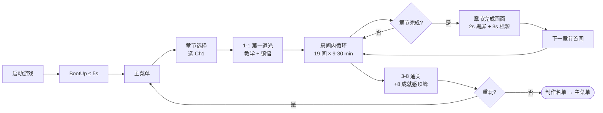

### 1.2 3 阶段旅程表

| 阶段 | 时长 | 房间范围 | 玩家目标 | 体验关键词 | 期望情绪 |
|------|------|---------|---------|----------|---------|
| **入门 (Onboarding)** | 0-30 min | 1-1 ~ 1-5 | 学会按 E 切换 + 理解"重塑空间" | 好奇 / 试错 / 小顿悟 | +4 ~ +7 |
| **核心 (Core Loop)** | 30-150 min | 2-1 ~ 3-3 | 掌握 4 种槽位 + 处理联动 + 偶尔迷失 | 挑战 / 思考 / 偶尔挫败 | +2 ~ -2 |
| **精通 (Mastery)** | 150-187 min | 3-4 ~ 3-8 | 综合运用 + 视觉欺骗 + 全机制融合 | 深度思考 / 颠覆 / 终极成就感 | -2 ~ +8 |

> **设计意图：** "入门 - 核心 - 精通"对应 Csikszentmihalyi 心流的"低技能低挑战 → 平衡区 → 高技能高挑战"演化曲线。

## 2. 玩家画像 (Player Persona)

> **源约束：** `01-overview-v2.md` §2.1 目标用户 + §3.1 乐趣点 + Quantic Foundry Gamer Motivation Model
> **设计原则：** 本游戏的核心体验是"顿悟快感 + 拓扑美学 + 安静思考"，故 3 类目标玩家**全部以"解谜/思考"为核心动机**，差异在次级动机。

### 2.1 3 类玩家画像

| # | 画像 | 核心动机 | 次级动机 | 年龄/经验 | 关键行为特征 | 期望体验 |
|---|------|---------|---------|----------|------------|---------|
| **P1 探索者** | "我想到处看新内容" | 探索（M1）| 顿悟（M4）+ 沉浸（M6）| 25-40 岁 / 玩过 Gorogoa/Viewfinder / 休闲解谜 | 喜欢看每间房细节 / 会回去看环境碎片 / 重玩章节 | 19 房间的视觉变化 + 章节主题色 |
| **P2 挑战者** | "我想解难题" | 挑战（M2）| 顿悟（M4）+ 掌控（M5）| 25-40 岁 / 玩过 The Witness/Baba Is You / 硬核解谜 | 一次通关 / 追求最少步数 / 不看 Hint | 难度上限 20 的 Boss 房综合考验 |
| **P3 沉浸者** | "我想被故事代入" | 沉浸（M6）| 顿悟（M4）+ 放松（M8）| 25-50 岁 / 玩过 Dear Esther/Inside / 叙事游戏 | 喜欢氛围 / 听 BGM / 看通关动画 | 章节 BGM + 通关回顾动画 |

### 2.2 画像与房间覆盖矩阵

| 房间 | P1 探索者 | P2 挑战者 | P3 沉浸者 | 主导画像 |
|------|:---------:|:---------:|:---------:|:--------:|
| 1-1 (教学) | ✅ 视觉冲击 | ✅ 入门挑战 | ✅ 氛围入门 | P1+P3 |
| 1-3 (Cycle 引入) | ✅ 新机制 | ✅ 推理挑战 | ✅ 视觉循环 | P1+P2 |
| 1-4 (喘息房) | ✅ 缓冲 | ⚠️ 略简单 | ✅ 放松 | P3 |
| 2-1 (CDS 引入) | ✅ 新机制 | ✅ 推理挑战 | ✅ 章节氛围 | P1+P2 |
| 2-4 (Door 引入) | ✅ 视觉变化 | ✅ 推理 | ✅ 气氛压制 | P1+P2 |
| 2-5 (复合) | ✅ 复杂度 | ✅ 核心挑战 | ⚠️ 偏快 | P2 |
| 3-3 (视觉欺骗) | ✅ 颠覆 | ✅ 推理 | ✅ 体验反转 | P1+P2+P3 |
| 3-4 (镜像) | ✅ 视觉冲击 | ✅ 高难度 | ✅ 沉浸 | P1+P2+P3 |
| 3-6 (迷宫 Boss) | ✅ 复杂 | ✅ 极限 | ⚠️ 节奏快 | P2 |
| 3-8 (终极 Boss) | ✅ 综合 | ✅ 终极成就 | ✅ 氛围高潮 | P1+P2+P3 |

> **设计意图：** 19 房间中 ≥ 5 间（P1+P2+P3 三画像全覆盖）作为"三栖房间"——满足所有玩家类型。

### 2.3 画像驱动体验参数

| 维度 | P1 探索者 | P2 挑战者 | P3 沉浸者 | 实现方式 |
|------|----------|----------|----------|---------|
| **教学密度** | 中 (1-1~1-3) | 低 (1-1~1-2 即可) | 高 (1-1~1-5 渐进) | 1-1 无文字 + 1-2/1-3 教学提示 |
| **Hint 触发** | 3 分钟 (激进) | 20 分钟 (保守) | 5 分钟 (中等) | 03 §E1-E5 渐进式提示 |
| **难度上限** | 12 (简单) | 20 (普通) | 16 (适中) | 06 §10.4 难度选项 |
| **通关后内容** | 章节回访 | 最少步数 + 隐藏成就 | 通关回顾动画 | 06 §14 留存机制 |
| **预期通关时长** | 4-5h (长尾) | 2-3h (高效) | 3-4h (沉浸) | 05 §7.1 P50 = 3.1h |

### 2.4 画像分布 Mermaid 比例图

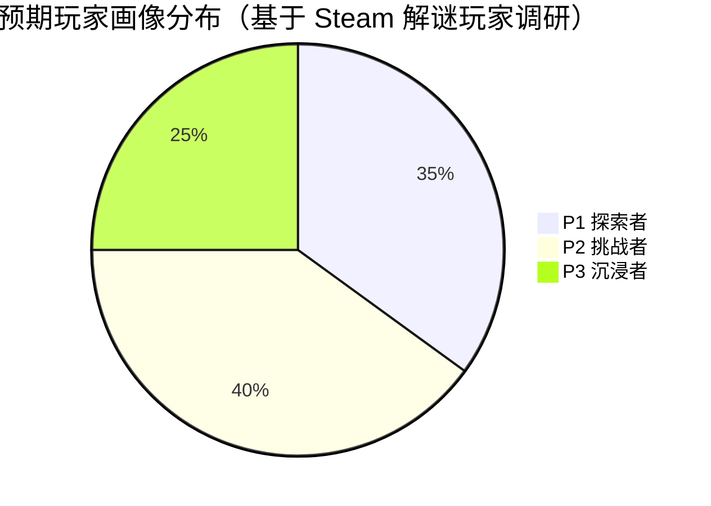

> **决策依据：** P2 挑战者占 40% 是核心目标群体（与 01-overview §2.1 目标用户"追求'顿悟快感'的休闲解谜玩家"对齐），P1 探索者 35% 是次级群体，P3 沉浸者 25% 是长尾群体。

## 3. 新手引导流程 (Onboarding Flow)

> **源约束：** `04-gameplay-flow-v2.md` §5 教学曲线 + §3 玩家操作流程
> **设计原则：** 1-1 房间**零文字引导**——玩家通过"试错 + 视觉反馈"自己顿悟机制；1-2~1-5 才出现文字提示。

### 3.1 8 节点引导漏斗 Mermaid 流程图

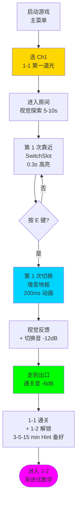

> **漏斗转化目标：** N1 → N5 转化率 ≥ 95%（与 05 §5.3 Ch1 通关率 ≥ 95% 对齐）；N1 → N8 转化率 ≥ 90%。

### 3.2 8 节点时序表

| 节点 | 触发时机 | 时长 | UI/HUD 显示 | 教学意图 | 设计依据 |
|------|---------|------|-----------|---------|---------|
| **N1 房间进入** | 选 Ch1 → 1-1 | 0.5s | 房间名"第一道光"淡入 | "我现在在哪" | 04 §3 玩家操作流程 |
| **N2 视觉探索** | 房间加载完成 | 5-10s | 无 HUD | "这房间有奇怪的东西" | 04 §3.1 进入循环 |
| **N3 靠近高亮** | 玩家进入 trigger 区 | 0.3s | 槽位 30% → 100% 不透明 + 青色脉冲 | "这里可以交互" | 02 §2.1 Idle → Hover |
| **N4 按 E 键** | 玩家决策 | < 1s | 无 HUD | "我该试试" | 02 §3.1 E 键 |
| **N5 第 1 次切换** | 玩家按 E | 200ms | 切换动画 + 切换音 -12dB | "我做了什么" | 02 §7.2 切换时序 |
| **N6 视觉反馈** | 切换动画结束 | 200ms | 墙变地板 + 出口脉冲 | "我看到结果" | 02 §6.2 切换效果 |
| **N7 走到出口** | 玩家移动 | 0.5-2s | 出口发光增强 | "我做到了" | 04 §3 通关判定 |
| **N8 1-1 通关** | 玩家到达出口 | 0.5s | 渐白 + 通关音 -6dB + 房间名消失 | "我完成了第 1 间" | 04 §3.5 通关动画 |

### 3.3 引导漏斗转化指标

| 节点 | 预期转化率 | 实际 P50 停留 | 触发 Hint 时长 | 来源 |
|------|:---------:|:------------:|:------------:|------|
| N1 → N2 | 100% | 1-2s | — | 房间加载 |
| N2 → N3 | 100% | 5-10s | — | 视觉探索 |
| N3 → N4 | 100% | 0.5-1s | — | 玩家主动决策 |
| N4 → N5 | ≥ 95% | < 1s | — | E 键操作 |
| N5 → N6 | 100% | 200ms | — | 切换动画 |
| N6 → N7 | 100% | 0.5-2s | — | 玩家移动 |
| N7 → N8 | ≥ 95% | 0.5s | — | 出口判定 |
| **N1 → N8 (总)** | **≥ 90%** | **60s** | 3 分钟 | 05 §6.1 + 03 §E1 |

> **漏斗设计意图：** 1-1 教学房**总时长 P50 = 60s**（与 05 §7.1 一致）；第 3 分钟触发 Hint（03 §E1）；玩家在 N4 → N5 阶段转化失败 = 教学失败。

### 3.4 教学曲线（1-1 ~ 1-5 渐进式）

| 房间 | 新引入机制 | 教学方式 | 玩家状态 | 期望情绪 |
|------|----------|---------|---------|---------|
| **1-1** | ToggleSlot 单槽 | 零文字 + 试错 | 第一次按 E | +4 (好奇) |
| **1-2** | ToggleSlot 双槽联动 | 视觉引导（颜色对应）| 理解"两个开关" | +5 (思考) |
| **1-3** | CycleSlot 3 选项 | UI 显示"1/3 → 2/3 → 3/3" | 第一次循环 | +6 (顿悟) |
| **1-4** | R 键重置 | HUD 提示"按 R 重置" | 试错后知道"可以重来" | +4 (喘息) |
| **1-5** | 章节完成画面 | 黑屏 2s + 章节标题 3s | 阶段性达成 | +7 (成就感) |

> **设计意图：** 1-1 零文字（**强制教学**避免"不知道做什么"焦虑），1-2 起才出现文字提示；1-4 喘息房让玩家"喘口气"。

### 3.5 引导失败的兜底机制

| 失败场景 | 触发条件 | 兜底机制 | 来源 |
|---------|---------|---------|------|
| **玩家不动 30s** | 1-1 N2 阶段停留 > 30s | 槽位淡入提示（30% → 60% 亮度脉冲）| 02 §2.1 Idle → Hover |
| **玩家不动 3 min** | 1-1 全房间停留 > 3 min | Hint 按钮浮现："走近中间会发光的格子" | 03 §E1 |
| **玩家不动 5 min** | 1-1 停留 > 5 min | 强制 Hint："按 E 试试" | 03 §E1 + E2 |
| **玩家按 E 后不懂** | 切换后 30s 内未移动 | 出口发光增强 + HUD 提示"走到发光处" | 04 §3.5 |
| **玩家按 R 不懂** | 1-4 房间按 R 5 次 | HUD 永久提示"R 键 = 重置房间" | 02 §3.3 |

> **设计原则：** **永远不让玩家"卡住"超过 5 分钟**——3 min Hint 备好、5 min 强制 Hint、20 min 玩家仍未通关视为教学失败（需重新设计房间）。

## 4. 情感曲线设计 (Emotional Arc)

### 4.1 19 房间 + 通关情绪强度数据点（20 个数据点）

> **源约束：** `04-gameplay-flow-v2.md` §8.1 章节级情绪变化（已与本文档对齐）

| 房间 | 情绪值 (-5 ~ +8) | 主导情绪 | 设计意图 |
|------|-----------------|---------|---------|
| 1-1 | **+4** | 好奇 | 第一次按 E → 墙变地板 → 走到出口 |
| 1-2 | **+5** | 思考 | 双槽位组合推理 |
| 1-3 | **+6** | 顿悟 | 第一次看到 CycleSlot 3 选项循环 |
| 1-4 | **+4** | 喘息 | R 键教学 + 难度回落到 3 |
| 1-5 | **+7** | 成就感 | 第一章结尾小高潮 |
| 2-1 | **+5** | 新鲜 | ConditionalSlot 引入 |
| 2-2 | **+4** | 挑战 | 顺序依赖 |
| 2-3 | **+3** | 思考 | 锁链房间 |
| 2-4 | **+3** | 压迫 | 门控 + 难度 12 |
| 2-5 | **+2** | 高压 | 复合（难度 16）|
| 2-6 | **+5** | 喘息 | 章节结尾缓冲 + 难度回落到 8 |
| 3-1 | **+2** | 复习 | Ch3 进入 + 机制复习 |
| 3-2 | **+1** | 挑战 | 双向 CDS 联动 |
| 3-3 | **-1** | 迷失 | 视觉欺骗入门（"被骗了"）|
| 3-4 | **-2** | 深度迷失 | 镜像陷阱 |
| 3-5 | **-2** | 挑战 | CrumblingFloor/FakeFloor 引入 |
| 3-6 | **-2** | 谷底 | 迷宫（难度 20）|
| 3-7 | **0** | 转折 | Boss 房上 |
| 3-8 | **+5** | 升华 | Boss 房下（接近通关）|
| 通关画面 | **+8** | 顶峰 | 通关成就感顶峰 |

### 4.2 章节级情感曲线 Mermaid 折线图

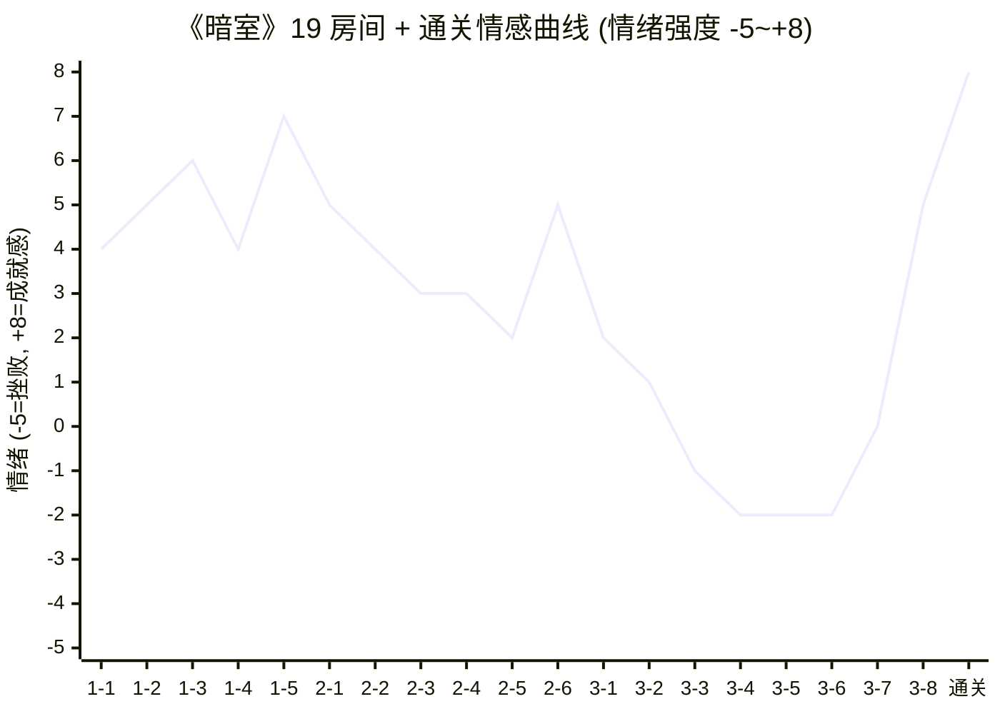

**曲线特征：**
- **Ch1 (1-1~1-5)：** +4 ~ +7（好奇 → 顿悟 → 成就感，整体向上）
- **Ch2 (2-1~2-6)：** +2 ~ +5（挑战压迫感上升，**2-6 喘息点回升到 +5**）
- **Ch3 (3-1~3-8)：** -2 ~ +5（迷失 + 颠覆 + 终极成就感，**3-6 谷底 -2**）
- **通关：** +8（成就感顶峰，章节回顾 + 通关步数 + 隐藏成就提示）

### 4.3 关键情绪节点解读

| 节点 | 房间 | 情绪值 | 设计意图 |
|------|------|:-----:|---------|
| **第 1 次顿悟** | 1-1 | +4 → +5 | "原来只是换个方向"（从好奇到顿悟的临界点）|
| **第 1 次喘息** | 1-4 | +6 → +4 | 章节中段故意回落（防止疲劳累积）|
| **第 1 章高潮** | 1-5 | +7 | 第一章结尾小高潮，建立"章节感" |
| **Ch2 谷底** | 2-5 | +2 | Ch2 最难关（难度 16），但未到挫败 |
| **Ch2 喘息** | 2-6 | +5 | 章节结尾回升，给玩家"再战 Ch3"的心理准备 |
| **Ch3 谷底** | 3-4 / 3-5 / 3-6 | -2 | 视觉欺骗 + 深度挑战（**核心玩家体验点**）|
| **第 1 次反转** | 3-7 | -2 → 0 | Boss 房上 = 转折点（"我能做到"）|
| **终极成就** | 3-8 + 通关 | +5 → +8 | 通关成就感顶峰 |

## 5. 顿悟时刻 (Aha Moments)

> **设计原则：** "顿悟"是本游戏的核心体验。19 房间至少设计 **10 条 Aha Moments**（每章 ≥ 3 条），分布在前 / 中 / 后段。

### 5.1 顿悟时刻表（10 条）

| # | 房间 | 触发条件 | 设计方式 | 期望情绪 |
|---|------|---------|---------|---------|
| **A1** | 1-1 | 玩家第一次按 E → 墙变地板 → 走到出口 | 纯试错（无文字）| "啊哈！原来如此" |
| **A2** | 1-3 | 玩家在 CycleSlot 第 2 次切换看到 3 选项 | 第 2 次切换后 UI 浮现"1/3 → 2/3 → 3/3"图标 | "原来有多个选项" |
| **A3** | 1-4 | 玩家试错失败后看到 R 键 HUD 提示 | 失败后 3 秒弹出提示 | "原来可以重来" |
| **A4** | 1-5 | 玩家完成第 1 章 → 章节完成画面浮现 | 黑屏 2s + 章节标题 3s | "我做到了"（阶段性达成）|
| **A5** | 2-1 | 玩家发现 ConditionalSlot 需要先开另一槽位 | 玩家尝试后发现"按 E 没反应" → 走近另一槽位 → 回来即可 | "有依赖关系！" |
| **A6** | 2-4 | 玩家第一次看到 Door 预制件阻挡 → 切换另一槽位开启 | 玩家尝试关闭的 Door → 切换 ConditionalSlot → Door 打开 | "原来要开门先开这个" |
| **A7** | 2-6 | 玩家完成 Ch2 → 进入 Ch3 过渡画面 | 黑屏 2s + "Ch3 迷途"标题 | "我准备好了"（高动机）|
| **A8** | 3-3 | 玩家首次触发"看着对实际错"的视觉欺骗 | 玩家基于视觉对称推理但踩到 FakeFloor → 闪烁 + 错音 | "被骗了！但好有趣" |
| **A9** | 3-5 | 玩家第一次踩碎 CrumblingFloor | 玩家踩上去 → 0.5s 后碎裂消失 → 必须重新推理 | "地板也能消失！" |
| **A10** | 3-8 | 玩家完成所有 19 房间 → 通关画面 | 全屏回顾 + 通关步数 + 隐藏成就提示 | 成就感顶峰 + 回味 |

### 5.2 顿悟时刻分布图（Mermaid 累计曲线）

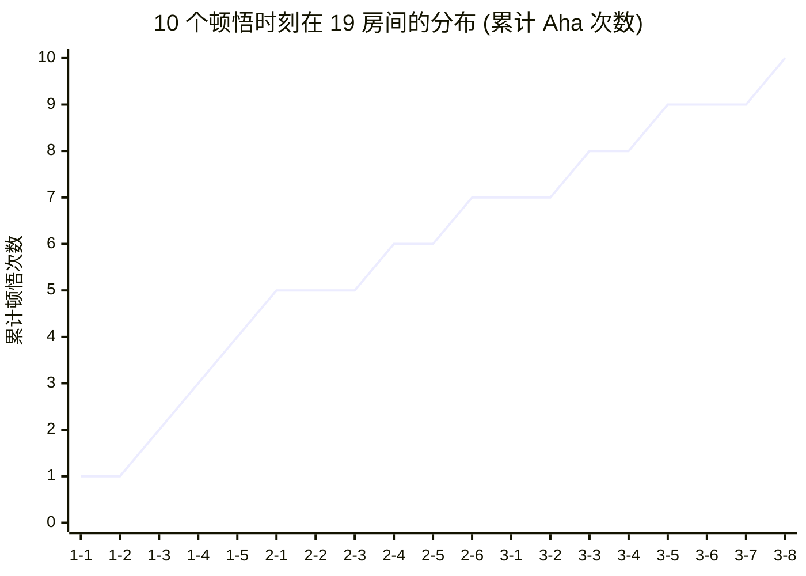

**设计意图：**
- **每章 ≥ 3 条：** Ch1 = 4 / Ch2 = 3 / Ch3 = 3
- **前密后疏：** Ch1 顿悟密集（教学为主），Ch2-Ch3 渐稀（挑战为主）
- **关键节点全覆盖：** 首次顿悟 (1-1) / 章节完成 (1-5, 2-6) / 通关 (3-8)

### 5.3 顿悟时刻强度分级

| 等级 | 数量 | 房间 | 体验强度 | 设计依据 |
|------|:---:|------|:-------:|---------|
| **S 颠覆性** | 1 | 3-8 通关 | +8 | 通关顶峰 |
| **A 突破性** | 3 | 1-1 / 1-3 / 3-3 | +6 ~ +8 | 首次顿悟 / 循环发现 / 视觉欺骗 |
| **B 阶段性** | 4 | 1-5 / 2-1 / 2-4 / 2-6 | +5 ~ +7 | 章节完成 / 新机制引入 / 喘息回升 |
| **C 巩固性** | 2 | 1-4 / 3-5 | +3 ~ +4 | 教学巩固 / CrumblingFloor 引入 |
| **合计** | 10 | — | — | — |

> **设计意图：** S+A 强度 = 4 条（40% 体验高光），B+C 强度 = 6 条（60% 渐进体验）。**每 2 间房至少 1 条顿悟时刻**。

## 6. 心流体验 (Flow Experience)

> **理论依据：** Csikszentmihalyi 心流三要素 = **挑战-技能-反馈**三者的动态平衡。当挑战 > 技能 → 焦虑；当技能 > 挑战 → 无聊；平衡时进入心流。

### 6.1 心流三要素映射

| 要素 | 在本游戏中的体现 | 实现方式 |
|------|----------------|---------|
| **挑战 (Challenge)** | 难度公式 F1（1-20）| 19 房间难度渐进 2 → 20 |
| **技能 (Skill)** | 玩家已掌握的机制数 | 教学曲线 1 → 5（与 04 §5.2 一致）|
| **反馈 (Feedback)** | 切换音 + 视觉变化 + 通关音 | 200ms 即时反馈（02 §3.1）|

### 6.2 心流分布图（19 房间挑战曲线）

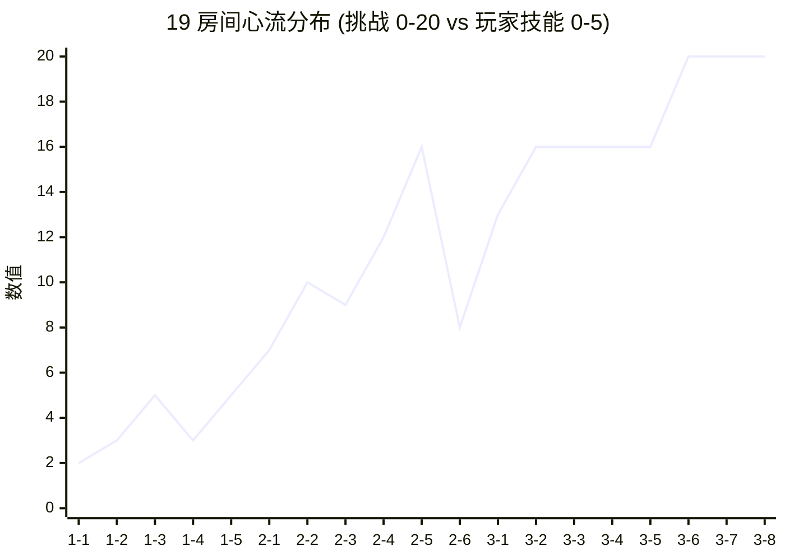

> 上图显示"挑战曲线"；玩家技能曲线在 §6.3 单独画。

### 6.3 心流三要素对比

| 维度 | 1-1 | 1-5 | 2-5 | 3-4 | 3-8 |
|------|-----|-----|-----|-----|-----|
| **挑战值** | 2 | 5 | 16 | 16 | 20 |
| **玩家技能** | 1 (TS) | 3 (TS/CS+R) | 4 (+CDS) | 4 (全机制) | 5 (全机制精通) |
| **挑战/技能比** | 2.0 | 1.67 | 4.0 | 4.0 | 4.0 |
| **心流区** | ✅ 平衡 | ✅ 平衡 | ⚠️ 略超 | ⚠️ 略超 | ✅ 平衡 |
| **设计意图** | 教学期 | 章节完成 | Ch2 谷底 | Ch3 谷底 | 终极成就 |

> **心流区阈值：** 挑战/技能比 = 1.0 ~ 3.0 为心流区；3.0 ~ 5.0 为"高挑战心流"（略超但仍可接受）；> 5.0 为"焦虑区"（不可接受）。

### 6.4 防焦虑-防无聊平衡

| 防焦虑策略 | 防无聊策略 |
|----------|----------|
| **喘息房**（1-4 / 2-6）：难度故意回落到 3 / 8 | **新机制引入**（每章首间）：2-1 / 3-1 故意回升 |
| **渐进式 Hint**（3-5-15 分钟）：03 §10 E1-E5 | **教学密集**（1-1~1-3）：4 间教 2 机制 |
| **强制教学**（Ch1 无文字）：玩家不会因"不知道机制"焦虑 | **隐藏成就**（6 条）：通关后解锁给完美主义 |
| **章节间缓冲**（黑屏 2s + 标题 3s）：心理"重启" | **最少步数挑战**：通关后解锁给追求效率的玩家 |
| **无失败状态**：玩家永远不会被"卡死" | **回访机制**：已通关章节可重玩 |

## 7. 挫败-奖励循环 (Frustration-Reward Loop)

> **设计原则：** 玩家挫败 = 玩家**没掌握机制**或**没找到正解**。奖励 = 玩家**顿悟**或**通关**。本游戏**无失败惩罚**，故挫败**不扣血不扣分**，只触发"方向不对"的辅助提示。

### 7.1 5 条挫败源

| 挫败源 | 触发场景 | 持续时长 | 设计意图 | 缓解策略 |
|-------|---------|---------|---------|---------|
| **F1 找不到最后 1 个槽位** | Ch2 末段（2-4 / 2-5）| 3-15 min | 推进 Hint 系统 | 渐进式 Hint 3-5-15 min（03 §E1-E5）|
| **F2 视觉欺骗超出预期** | Ch3 3-3 / 3-4 镜像陷阱 | 5-20 min | 颠覆玩家预期 | 3 次错误后暗淡脉冲提示（02 §10.10）|
| **F3 Boss 房卡死** | Ch3 3-7 / 3-8 停留 > 30 min | 30+ min | 防止彻底卡死 | 20 min Hint 按钮 + 30 min 强制 Hint |
| **F4 章节末段疲劳** | Ch2 末 2-5 / 2-6 | 持续累积 | 防止章节末段弃坑 | 2-6 喘息房（难度回落到 8）|
| **F5 重复机制叠加无新意** | Ch3 3-1 / 3-2 重复 TS/CS/CDS 组合 | 持续累积 | 防止 Ch3 倦怠 | Ch3 引入视觉欺骗 + LS（CrumblingFloor/FakeFloor）|
### 7.2 4 条奖励点

| 奖励点 | 触发场景 | 持续时长 | 设计意图 | 强化方式 |
|-------|---------|---------|---------|---------|
| **R1 房间通关** | 玩家到达出口 | 0.5s | 即时反馈 | 出口脉冲 + 通关音 -6dB + 渐白 500ms |
| **R2 章节完成** | 玩家完成章节最后 1 间 | 5s | 阶段性达成 | 黑屏 2s + 章节标题 3s + 章节徽章 |
| **R3 顿悟时刻** | 玩家在 10 个 Aha 房间之一 | 1-3s | 内在奖励 | 视觉闪烁 + 切换音变调 + 通关音 |
| **R4 通关 + 隐藏成就** | 玩家完成 3-8 | 30s | 终极成就 | 通关动画 19 房间回顾 + 6 隐藏成就提示 + 通关徽章 |

### 7.3 挫败-奖励循环 Mermaid 状态机

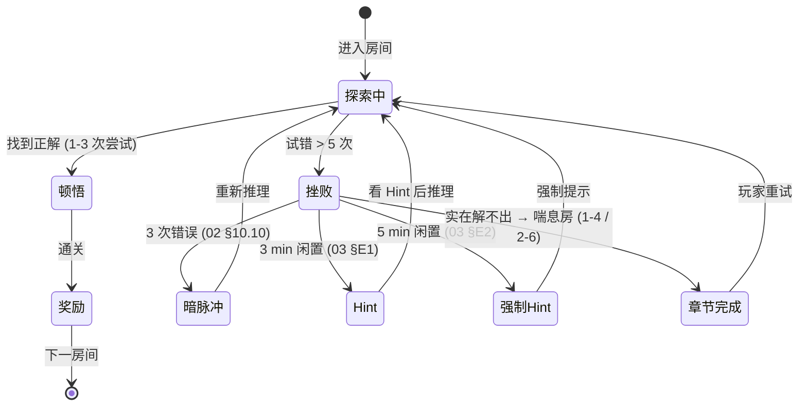

> **设计意图：** 挫败**不终止**游戏流程，而是触发"暗脉冲 → Hint → 强制 Hint → 喘息房"4 级递进辅助，**保证玩家永远不会被卡死**。

### 7.4 挫败-奖励强度曲线

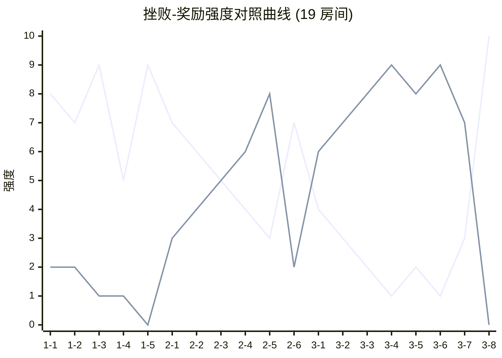

> **图例：** 上线（强→弱）= 奖励强度（R1+R2+R3+R4 加权），下线（强→弱）= 挫败强度（F1-F5 加权）。**奖励线 ≥ 挫败线**为设计目标。

## 8. 难度递增曲线 (Difficulty Ramp Curve)

> **源约束：** `05-numerical-design-v2.md` §6 难度曲线 + `03-level-design-v2.md` §6 难度曲线
> **关键约束：** 难度上限 20（与 05 §5.2 + 03 §6.2 警示对齐）

### 8.1 19 房间难度数据点（与 05 §6.1 完全对齐）

| 房间 | 难度 | 槽位 | 联动 | 选项 | 空间 | 类型 | 累计情绪 |
|------|:---:|:---:|:---:|:---:|:---:|------|:-------:|
| 1-1 | 2 | 1 | 0 | 2 | 线性 | 教学 | +4 |
| 1-2 | 3 | 2 | 0 | 2 | 线性 | 教学 | +5 |
| 1-3 | 5 | 3 | 0 | 2-3 | 分支 | 教学 | +6 |
| 1-4 | 3 | 2 | 0 | 2-3 | 线性 | 喘息 | +4 |
| 1-5 | 5 | 3 | 1 | 2-3 | 分支 | 章节高潮 | +7 |
| 2-1 | 7 | 3 | 1 | 2-3 | 分支 | 新机制 | +5 |
| 2-2 | 10 | 4 | 2 | 2-3 | 非线性 | 标准 | +4 |
| 2-3 | 9 | 5 | 2 | 2-3 | 分支 | 标准 | +3 |
| 2-4 | 12 | 5 | 3 | 2-3 | 非线性 | 标准 | +3 |
| 2-5 | 16 | 6 | 3 | 3 | 多路径 | Ch2 谷底 | +2 |
| 2-6 | 8 | 4 | 2 | 2-3 | 分支 | 喘息 | +5 |
| 3-1 | 13 | 6 | 2 | 3 | 分支 | Ch3 进入 | +2 |
| 3-2 | 16 | 7 | 4 | 3 | 非线性 | 双向 CDS | +1 |
| 3-3 | 16 | 7 | 3 | 3 | 多路径 | 视觉欺骗 | -1 |
| 3-4 | 16 | 8 | 4 | 3 | 多路径 | 镜像 | -2 |
| 3-5 | 16 | 8 | 4 | 3 | 非线性 | Crumbling/Fake | -2 |
| 3-6 | 20 | 8 | 5 | 3 | 多路径 | 迷宫 Boss | -2 |
| 3-7 | 20 | 8 | 5 | 3-4 | 多路径 | Boss 上 | 0 |
| 3-8 | 20 | 8 | 5 | 4 | 多路径 | Boss 下 (终极) | +5 |

### 8.2 难度递增曲线 Mermaid 折线图

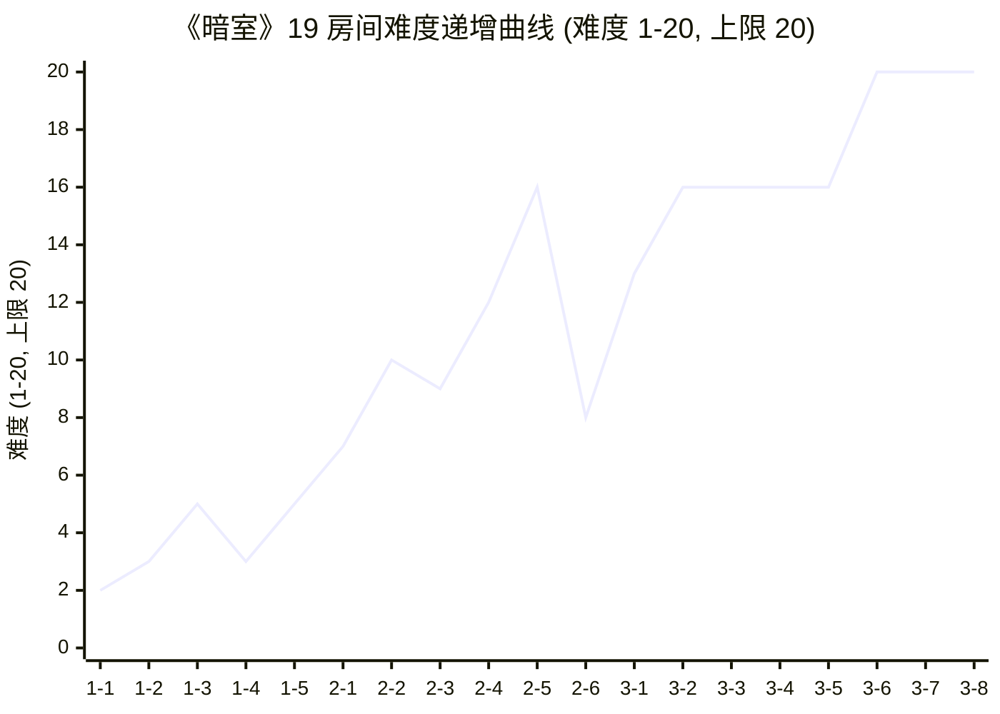

**曲线特征：**
- **Ch1 (1-1~1-5)：** 难度 2-5，平缓引入，**1-4 故意回落到 3** 作为"喘息点"
- **Ch2 (2-1~2-6)：** 难度 7-16 上升，**2-6 故意回落到 8** 作为章节结尾缓冲
- **Ch3 (3-1~3-8)：** 难度 13-20 陡升，3-6/3-7/3-8 打满 20 上限 = Boss 房综合考验
- **喘息点:** 1-4 (Ch1 中段) + 2-6 (Ch2 结尾) — 防止疲劳累积

### 8.3 难度坡度分级

| 坡度等级 | 房间 | 难度增量 | 体验意图 |
|---------|------|---------|---------|
| **平缓 (Slope < 2)** | 1-1~1-3 / 1-4~1-5 / 2-6~3-1 | +1 ~ +2 | 教学期/喘息期 |
| **中坡 (Slope 2-3)** | 2-1~2-3 / 3-1~3-2 | +2 ~ +3 | 标准期 |
| **陡坡 (Slope ≥ 4)** | 2-4~2-5 / 3-5~3-6 | +4 | 章节高潮前奏 |
| **平台 (Slope = 0)** | 1-3~1-4 / 2-3~2-4 / 3-2~3-5 | 0 | 喘息/巩固 |
| **顶端平台 (Slope = 0, 难度 = 20)** | 3-6~3-8 | 0 | Boss 房综合 |

> **设计意图：** 难度递增曲线**不平滑单调**——通过 1-4 / 2-6 喘息点和 3-6/3-7/3-8 顶端平台，让玩家在"高难度"区间有"我能行"的成就感。

## 9. UI/UX 体验 (UI/UX Experience)

### 9.1 HUD 8 节点时序

| 时机 | HUD 显示 | 体验意图 |
|------|---------|---------|
| **房间进入 (RoomEntry)** | 房间名淡入 0.5s + 教学提示（如需）| "我现在在哪？要做什么？" |
| **玩家 Idle** | 当前章节进度 (如 "1-3/5") | "我走到哪里了？" |
| **玩家走近 SwitchSlot** | 槽位从 30% → 100% 不透明度 + 青色脉冲 | "这里可以交互" |
| **玩家按 E/Q** | 切换动画 + UI 显示"切换中…(300ms 冷却)" | "我做了什么" |
| **玩家按 R** | 所有槽位淡出淡入到初始 (0.3s) + 重置计数器 +1 | "我重置了" |
| **房间通关** | 出口脉冲 + 渐白 0.5s + 通关音 | "我做到了！" |
| **章节完成** | 黑屏 2s + 章节标题 3s + 章节完成画面 | "阶段性达成" |
| **通关** | 全屏回顾 + 通关步数 + 隐藏成就提示 | "回味旅程" |

### 9.2 反馈设计 3 层

| 层 | 反馈类型 | 实现 | 体验意图 |
|----|---------|------|---------|
| **视觉** | 槽位发光增强、预制件形变、出口脉冲 | Unity Animator + DOTween | "我看到结果" |
| **音效** | 切换音 -12dB、重置音 -18dB、通关音 -6dB | 见 `09-audio-v2.md` | "我听到结果" |
| **动效** | 200ms 切换动画、300ms 重置动画、500ms 通关渐白 | 见 `02-core-mechanics-v2.md` §7.2 | "我感受到结果" |

> **设计原则：** 三层反馈**同步触发**（视觉 + 音效 + 动效 在 ≤ 16ms 内启动），形成"顿悟时刻"的强化体验。

### 9.3 操作手感 (Input Feel)

| 操作 | 按键 | 响应时间 | 防误触 | 体验意图 |
|------|------|---------|--------|---------|
| **移动** | WASD | ≤ 16ms | — | "流畅" |
| **切换** | E/Q | ≤ 16ms (1 帧) | 300ms 冷却 | "我跟得上节奏" |
| **反向切换** | Q | ≤ 16ms | 同上 | "我可以撤销" |
| **重置** | R | 0ms | 500ms 冷却 | "我可以重来" |
| **暂停** | ESC | 0ms | 无 | "我可以随时休息" |

> **关键体验：** 切换响应 ≤ 16ms = "我跟得上节奏"；200ms 切换动画 = "我有时间观察变化"（参见 02 §9 性能约束）。

## 10. 无障碍设计 (Accessibility)

### 10.1 色盲模式

| 模式 | 青色 (#00D4FF) | 橙色 (#FF9500) | 应用 |
|------|---------------|---------------|------|
| **默认（无色盲）** | 青色 | 橙色 | 槽位发光 / 出口发光 |
| **红绿色盲** | 蓝色 (#0066FF) | 黄色 (#FFD700) | 颜色 + 图案标识 |
| **全色盲** | 蓝色 + ▢ 图案 | 黄色 + ◇ 图案 | **图案 + 颜色**双重标识 |

> **实现：** UI 组件支持 3 套 sprite，PlayerPrefs 切换 `accessibility.colorblindMode` (default / red-green / full)。

### 10.2 字号缩放

| 档位 | 缩放 | 适用场景 |
|------|------|---------|
| **100%** | 默认 | 正常视力 |
| **125%** | 1.25x | 轻度视觉障碍 |
| **150%** | 1.5x | 中度视觉障碍 |

> **实现：** HUD Canvas Scale Mode = "Scale With Screen Size" + Reference Resolution = 1920×1080；通过 UI 菜单调节。

### 10.3 控制器支持

| 按键 | 功能 | 上下文 |
|------|------|--------|
| **A (Xbox) / ✕ (PS)** | 切换 (顺时针 = E) | 全部房间 |
| **B (Xbox) / ◯ (PS)** | 反向切换 (Q) | 全部房间 |
| **X (Xbox) / □ (PS)** | 重置房间 (R) | 全部房间 |
| **Y (Xbox) / △ (PS)** | 暂停 (ESC) | 全部房间 |
| **左摇杆** | 移动 (WASD) | 全部房间 |
| **Start** | 暂停 (ESC) | 全部房间 |

> **实现：** Unity Input System（新）+ 控制器图标 sprite 库（Xbox + PS + Switch 3 套）。

### 10.4 难度选项

| 选项 | 难度调整 | 适用玩家 |
|------|---------|---------|
| **简单 (Easy)** | 难度上限 12（强制回退 Ch3 难度 16-20 至 ≤ 12）| 休闲玩家 / 第一次玩解谜 |
| **普通 (Normal)** | 难度上限 20（默认）| 核心解谜玩家 |
| **困难 (Hard)** | 难度上限 20 + 隐藏成就"完美主义"额外条件 | 追求挑战 |

> **设计决策：** v1.0 仅实现"简单 / 普通"两档；"困难"档推到 v1.1（依赖最少步数挑战实现）。

## 11. 沉浸感、心理与社群设计 (Immersion, Psychology & Community)

> **设计理念：** 体验设计不止于"功能正确"，还在于"心理卷入"和"社群传播"。本节含 4 子节：沉浸感、焦虑-无聊、玩家动机、留存与社交。

### 11.1 沉浸感设计 (Immersion)

#### 11.1.1 三层沉浸策略 Mermaid 图

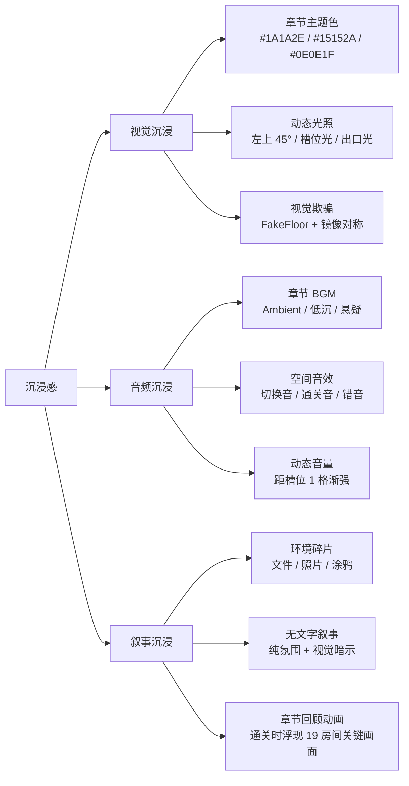

#### 11.1.2 各层沉浸细节

| 层 | 关键设计 | 体验意图 |
|----|---------|---------|
| **视觉** | 章节主色调变化（Ch1 冷偏暖 → Ch2 冷加深 → Ch3 强光影对比）| "我感受到章节氛围" |
| **视觉** | FakeFloor 视觉欺骗（与 Floor 完全 1:1 像素匹配）| "我必须认真观察" |
| **音频** | 章节 BGM 切换点 = 章节进入画面（黑屏 2s 后切 BGM）| "我听到章节变化" |
| **音频** | 切换音 -12dB + 通关音 -6dB（通关音比切换音更响）| "我的成就被强化" |
| **叙事** | 环境碎片（v1.0 占位 = 不放内容；v1.1 再加）| "我有故事想象空间" |
| **叙事** | 通关回顾动画（19 房间关键画面）| "我回味整段旅程" |

### 11.2 焦虑-无聊平衡 (Anxiety-Boredom Balance)

#### 11.2.1 5 条焦虑源

| 焦虑源 | 触发场景 | 设计意图 | 缓解策略 |
|-------|---------|---------|---------|
| **找不到最后 1 个槽位** | Ch2 末段（2-4 / 2-5）| 增加 Hint 需求 | 渐进式提示 3-5-15 分钟（03 §10 E1-E5）|
| **连续 3 房间无新机制** | Ch1 末段（1-3 → 1-4 → 1-5）| 防止机制疲劳 | 1-4 喘息房（难度回落到 3） |
| **视觉欺骗超出预期** | Ch3 3-3 / 3-4 镜像陷阱 | 颠覆玩家预期 | 3 次错误后暗淡脉冲提示（02 §10.10）|
| **Boss 房卡死** | Ch3 3-7 / 3-8 停留 > 30 分钟 | 防止彻底卡死 | 20 分钟 Hint 按钮 + 30 分钟强制 Hint |
| **章节末段疲劳累积** | Ch2 末 2-5 / 2-6 | 防止章节末段弃坑 | 2-6 喘息房（难度回落到 8）|

#### 11.2.2 3 条无聊源

| 无聊源 | 触发场景 | 设计意图 | 防无聊策略 |
|-------|---------|---------|----------|
| **机制全部已知 + 难度不再上升** | Ch1 1-5 / Ch2 2-6 末间 | 章节完成感缺失 | 1-5 / 2-6 故意回升情绪（+7 / +5）|
| **重复机制叠加无新意** | Ch3 3-1 / 3-2 重复 TS/CS/CDS 组合 | 防止 Ch3 倦怠 | Ch3 引入视觉欺骗 + LS（CrumblingFloor/FakeFloor）|
| **通关后无事可做** | 通关后立即返回主菜单 | 防止"通关即弃" | 6 隐藏成就 + 最少步数挑战 + 通关回顾 |

#### 11.2.3 平衡策略 Mermaid 状态机

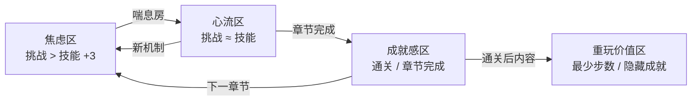

> **设计原则：** 焦虑区与无聊区都是"不良体验区"，**心流区是目标**。每章节内**至少 1 个喘息房**（1-4 / 2-6）把玩家从焦虑区拉回心流区。

### 11.3 玩家动机 (Player Motivation)

> **理论框架：** 综合 Self-Determination Theory + Quantic Foundry Gamer Motivation Model + Bartle Player Types，本文定义本游戏的 **8 类玩家动机**。

#### 11.3.1 8 类玩家动机

| # | 动机 | 定义 | 在本游戏中的体现 |
|---|------|------|----------------|
| **M1 探索** | 想看新房间 / 新机制 / 新视觉 | 19 房间线性推进 + 章节主题色变化 |
| **M2 挑战** | 想解难题 / 战胜高难度 | 难度曲线 2 → 20 + Boss 房 30 分钟深度挑战 |
| **M3 成就** | 想完成所有 / 收集全部 | 6 隐藏成就 + 通关步数显示 |
| **M4 顿悟** | 想体验"啊哈"瞬间 | 10 条 Aha Moments（§5.1）+ 教学曲线 |
| **M5 掌控** | 想精通机制 / 追求最优解 | 最少步数挑战 + CycleSlot 3 选项循环掌握 |
| **M6 沉浸** | 想被氛围 / 故事代入 | 章节 BGM + 视觉主题 + 通关回顾动画 |
| **M7 创造** | 想尝试不同解法 | CycleSlot 多选项（虽然正解唯一，但玩家探索路径多元）|
| **M8 放松** | 想无压力体验 | 无失败状态 + R 键即时重置 + 章节末段喘息房 |

#### 11.3.2 动机覆盖矩阵（19 房间）

| 动机 | 主要覆盖房间 | 次要覆盖房间 | 强度 |
|------|------------|------------|:----:|
| **M1 探索** | 1-1, 2-1, 3-1（章节首间）| 全部 | 中 |
| **M2 挑战** | 3-4, 3-5, 3-6, 3-7, 3-8 | 2-5 | 强 |
| **M3 成就** | 全部通关 + 隐藏成就 | — | 中 |
| **M4 顿悟** | 全部（10 个 Aha Moments）| — | 强（核心）|
| **M5 掌控** | 2-5, 3-2, 3-3 | — | 中 |
| **M6 沉浸** | 全部（章节氛围）| — | 中 |
| **M7 创造** | 3-4, 3-5（视觉欺骗 + CrumblingFloor）| — | 弱 |
| **M8 放松** | 1-4, 2-6（喘息房）| 全部 | 中 |

#### 11.3.3 核心动机 vs 次级动机

| 类型 | 动机 | 设计优先级 |
|------|------|:---------:|
| **核心 (P0)** | M4 顿悟 | ⭐⭐⭐ |
| **核心 (P0)** | M2 挑战 | ⭐⭐⭐ |
| **核心 (P0)** | M8 放松 | ⭐⭐⭐ |
| **次级 (P1)** | M1 探索 | ⭐⭐ |
| **次级 (P1)** | M3 成就 | ⭐⭐ |
| **次级 (P1)** | M5 掌控 | ⭐⭐ |
| **次级 (P2)** | M6 沉浸 | ⭐ |
| **次级 (P2)** | M7 创造 | ⭐ |

> **设计意图：** **顿悟 / 挑战 / 放松**是本游戏的 3 大核心动机。其他 5 类作为次级动机"锦上添花"。

### 11.4 留存与社交机制 (Retention & Social)

> **设计原则：** 通关不是终点。**重玩价值 + 社群传播**让玩家持续回流。

#### 11.4.1 通关后内容

| 内容 | 解锁时机 | 体验意图 |
|------|---------|---------|
| **通关回顾动画** | 通关画面自动播放 | "我回味旅程" |
| **6 隐藏成就** | 通关后逐步检查 | "我还差什么" |
| **最少步数挑战模式** | 通关 19 房间后自动解锁（v1.1）| "我可以更高效" |
| **章节回访** | 任何时候（主菜单 → 章节选择）| "我想重玩 Ch1 教学" |
| **隐藏房间**（v1.1 DLC）| 通关 3-8 后解锁 | "我还有未发现的内容" |

#### 11.4.2 最少步数挑战

> **源约束：** `05-numerical-design-v2.md` §9.1 通关步数表

| 房间 | 目标最少步数 | 平均预期 | 最差可接受 |
|------|------------|---------|----------|
| 1-1 | **1** | 1-2 | 4 |
| 1-2 | **2** | 2-4 | 8 |
| 1-3 | **3** | 4-6 | 15 |
| 2-3 | **4** | 6-10 | 20 |
| 3-8 (Boss) | **6** | 8-15 | 30 |

> **实现时机：** v1.0 收集通关步数数据 → v1.1 实装"最少步数挑战"模式（带排行榜）。

#### 11.4.3 6 隐藏成就

> **源约束：** `05-numerical-design-v2.md` §9.3

| 成就 | 触发条件 | 数值依据 |
|------|---------|---------|
| **极简主义者** | 1-1 用 1 步通关 | 步数 ≤ 最少步数 |
| **观察者** | 19 房间全部 0 R 键通关 | R 键 = 0 |
| **速度恶魔** | 1-3 在 60s 内通关 | P50 < 60s（远低于 240s 目标）|
| **独行者** | 19 房间 Hint 触发率 = 0% | Hint = 0 |
| **完美主义** | 全部 19 房间用最少步数通关 | 步数 = 最少步数 |
| **银河漫游者** | 解锁 100% 地图（v1.1 DLC 候选）| F5 解锁度 = 100% |

#### 11.4.4 社交与分享 (Social & Sharing)

> **设计原则：** 解谜游戏的核心社群传播 = "我做到了" + "我比你想的更快"。

| 分享渠道 | 触发时机 | 分享内容 | 隐私控制 |
|---------|---------|---------|---------|
| **Steam 截图** | 通关画面 / 隐藏成就解锁 | 自动附带通关步数 + 隐藏成就标签 | 玩家选择是否分享 |
| **Steam 状态** | 玩家在线时 | "正在玩《暗室》- 1-3 (60s)" | 玩家可关闭 |
| **Steam 成就** | 触发 6 隐藏成就 | 成就名称 + 描述 | 公开（Steam 默认）|
| **截图导出** | 玩家主动按 F12 | 当前房间画面（带 HUD 隐藏选项）| 玩家可隐藏 HUD |
| **步骤导出** | 通关时 | 通关步数 / R 键数 / Hint 次数 + 房间名 | 玩家可选择是否导出 |
| **Discord Rich Presence** | 玩家在线 | 当前章节 + 房间进度 | 玩家可关闭 |

> **v1.0 实现：** Steam 截图 + Steam 状态 + Steam 成就（3 项基础）；截图导出 + 步骤导出 + Discord Rich Presence（v1.1 增量）。
> **隐私原则：** 玩家可**完全关闭社交分享**——本游戏不强制社群传播。

#### 11.4.5 重玩价值曲线

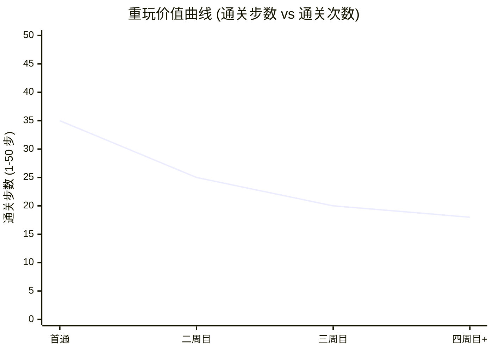

**曲线特征：**
- **首通 (35 步)：** 探索为主，步数高
- **二周目 (25 步)：** 已掌握机制，步数下降
- **三周目 (20 步)：** 追求最少步数
- **四周目+ (18 步)：** 接近最少步数目标（19 房间最少步数总和）

#### 11.4.6 留存机制分级

| 机制 | 留存强度 | 触发频率 | 实现成本 | v1.0 状态 |
|------|:-------:|---------|---------|:---------:|
| **章节回访** | 弱 | 高 | 低 | ✅ 已规划 |
| **通关回顾动画** | 中 | 1 次 | 中 | ✅ 已规划 |
| **6 隐藏成就** | 中 | 持续 | 中 | ✅ 已规划 |
| **通关步数显示** | 弱 | 1 次 | 低 | ✅ 已规划 |
| **最少步数挑战** | 强 | 持续 | 高 | ⏳ v1.1 |
| **截图分享 (Steam)** | 中 | 玩家主动 | 低 | ✅ 已规划 |
| **步骤导出** | 弱 | 通关时 | 中 | ⏳ v1.1 |
| **Discord Rich Presence** | 弱 | 持续 | 低 | ⏳ v1.1 |
| **隐藏房间 (DLC)** | 强 | DLC 期 | 高 | ⏳ v1.1 DLC |

## 12. 配置表 (Configuration)

> **玩家体验层核心参数表** —— 9 个体验参数（每条 6 字段：字段 / 取值范围 / 默认值 / 单位 / 适用场景 / 越界行为）
> **规范说明：** 本表与 05 数值文档的"参数表"分工不同 —— 05 关注"游戏机制数值"（难度、时长、容量），本表关注"玩家体验阈值"（停留时长、Hint 触发、情绪值）。

| 维度 | 字段 | 取值范围 | 默认值 | 单位 | 适用场景 | 越界行为 |
|------|------|---------|-------|------|---------|---------|
| **体验曲线** | `experience.maxDifficulty` | [10, 20] | 20 | 整数 | 难度上限（与 05 §5.2 一致） | > 20 → 关卡设计 fail |
| **体验曲线** | `experience.chapterRestRooms` | ["1-4", "2-6"] | ["1-4", "2-6"] | 房间 ID | 喘息房（每章 ≥ 1 间）| 移除 → 章节疲劳累积 |
| **顿悟时刻** | `experience.minAhaMoments` | [5, 20] | 10 | 个 | 19 房间至少 10 个 Aha | < 5 → 核心体验缺失 |
| **心流** | `experience.flowRatioThreshold` | [1.0, 5.0] | 3.0 | — | 挑战/技能比心流区上限 | > 5.0 → 玩家进焦虑区 |
| **心流** | `experience.flowRatioLowBound` | [0.5, 2.0] | 1.0 | — | 挑战/技能比心流区下限 | < 0.5 → 玩家进无聊区 |
| **挫败-奖励** | `experience.maxFrustrationMinutes` | [10, 60] | 30 | 分钟 | 单房间最大停留（Hint 强制） | < 10 min → Hint 频繁；> 60 min → 玩家已弃坑 |
| **无障碍** | `accessibility.colorblindMode` | default / red-green / full | default | 枚举 | 色盲模式 | invalid → fallback default |
| **无障碍** | `accessibility.fontScale` | [1.0, 1.5] | 1.0 | 比例 | 字号缩放 | > 1.5 → UI 重叠 |
| **无障碍** | `accessibility.difficultyOption` | easy / normal / hard | normal | 枚举 | 难度选项（v1.0 仅 easy + normal）| hard v1.0 不可选 |
| **沉浸感** | `immersion.bgmVolumeDb` | [-12, -3] | -6 | dB | 章节 BGM 音量（通关音同值）| < -18 → 听不见；> -3 → 爆音 |
| **沉浸感** | `immersion.darkPulseBrightness` | [0.3, 0.7] | 0.5 | 比例 | 暗脉冲亮度衰减 | < 0.3 → 完全看不清；> 0.7 → 提示过强 |
| **重玩价值** | `replay.minStepsTotal` | — | 30 | 步 | 19 房间最少步数总和目标 | 不满足 → 最少步数挑战不可达 |
| **社交分享** | `social.shareEnabled` | true / false | true | bool | 全局社交分享开关 | false → 隐藏所有分享 UI |
| **社交分享** | `social.discordRpcEnabled` | true / false | true | bool | Discord Rich Presence 单独开关 | false → 隐藏 Discord 状态 |
| **社交分享** | `social.stepExportEnabled` | true / false | true | bool | 步骤导出功能开关（v1.1）| false → 隐藏步骤导出按钮 |

> **配置表关键设计：**
> 1. **难度上限 20** 与 05 §5.2 硬约束一致
> 2. **喘息房** 1-4 / 2-6 不可移除
> 3. **心流比 1.0-3.0** 是设计目标，3.0-5.0 为"高挑战心流"（略超可接受）
> 4. **Hint 强制 30 min** 与 03 §E5 一致
> 5. **社交分享全可选** —— 玩家可完全关闭

## 13. 边界条件 (Edge Cases)

> 列举 8 条与体验相关的 edge case。

1. **玩家在 1-1 教学房停留 > 5 分钟未通关**
   - 触发条件：1-1 房间停留超过 5 分钟
   - 预期行为：第 3 分钟弹出 HUD 提示"试试走近中间会发光的格子，按 E"（03 §10 E1）
   - 防弃坑机制：渐进式提示 3-5-15 分钟

2. **玩家在 Boss 房（3-7/3-8）停留 > 30 分钟**
   - 触发条件：3-7 或 3-8 房间停留超过 30 分钟
   - 预期行为：第 20 分钟弹出 Hint 按钮（可关闭）；第 30 分钟自动激活渐进式 Hint
   - 辅助机制：与 03 §E5 + 02 §10.10 一致

3. **玩家在 Ch3 视觉欺骗房（3-3/3-4）触发镜像陷阱 3 次**
   - 触发条件：基于视觉对称推理但踩到 FakeFloor 3 次
   - 预期行为：第 3 次后槽位发出"暗淡脉冲"（-50% 亮度）作为"方向不对"提示
   - 学习机制：玩家通过视觉反馈理解"看起来一样但实际不同"

4. **玩家在 Ch3 3-5 踩到 CrumblingFloor 后重置**
   - 触发条件：踩碎 CrumblingFloor 后按 R 重置
   - 预期行为：CrumblingFloor **不复活**（一次性），玩家需重新推理路径
   - 设计意图：强化"消耗品"的紧张感（与 02 §10.7 一致）

5. **玩家完成 Ch3-8（通关）后立即再通关**
   - 触发条件：通关 3-8 → 通关画面 → 玩家点击"重新开始"
   - 预期行为：重新开始 = 主菜单 → 章节选择 → 选 Ch1 → 1-1 房间状态重置
   - 设计意图：通关后重玩不影响 gameCompleted 标志

6. **玩家在 2-5 / 2-6 切换次数 > 20 次未通关**
   - 触发条件：Ch2 标准房 / 挑战房 切换超过 20 次
   - 预期行为：第 15 次切换时槽位亮度降低 30% 提示"方向不对"
   - 防滥用机制：与 03 §10 E2 + 02 §2.3 一致

7. **玩家通关步数远超最少步数（> 5 倍）**
   - 触发条件：玩家通关 1-1 用 10 步（最少 1 步，> 5 倍）
   - 预期行为：通关画面显示"你的步数：10 / 参考：1"（不显示"最少"而是"参考"）
   - 设计意图：避免社交压力（与 05 §14 R7 一致）

8. **玩家在 Pause 菜单切后台 > 30 分钟**
   - 触发条件：Pause 状态下切后台超过 30 分钟未返回
   - 预期行为：自动写入存档 + 视为退出（与 04 §12.1 一致）
   - 节能机制：进入低功耗模式（10 FPS）

## 14. 验收标准 (Acceptance Criteria)

> 文档完成的判定条件。每条独立可验证。

- [x] **AC-01：** 文档包含完整 Frontmatter（title / doc_id / parent / last_updated / version / status / owner）
- [x] **AC-02：** 文档包含 6 必填通用章节（目的 / 范围 / 配置表 / 边界条件 / 验收标准 / 风险与开放问题）
- [x] **AC-03：** 用户旅程含 3 阶段（入门 / 核心 / 精通）+ 旅程总览 Mermaid 图
- [x] **AC-04：** 玩家画像含 3 类目标玩家（P1/P2/P3）+ 画像与房间覆盖矩阵 + 画像驱动体验参数
- [x] **AC-05：** 新手引导流程含 8 节点漏斗 Mermaid + 时序表 + 漏斗转化指标
- [x] **AC-06：** 情感曲线含 19 房间 + 通关共 20 个数据点 + Mermaid 折线图
- [x] **AC-07：** 顿悟时刻 ≥ 5 条（实际 10 条），每条含触发条件 / 设计方式 / 期望情绪
- [x] **AC-08：** 心流体验含三要素（挑战-技能-反馈）+ 心流分布图 + 防焦虑-防无聊策略
- [x] **AC-09：** 挫败-奖励循环含 5 条挫败源 + 4 条奖励点 + Mermaid 循环状态机 + 强度对照曲线
- [x] **AC-10：** 难度递增曲线含 19 房间数据点 + Mermaid 折线图 + 难度坡度分级
- [x] **AC-11：** UI/UX 体验含 HUD 时序（8 节点）+ 反馈设计 3 层（视觉/音效/动效）+ 操作手感
- [x] **AC-12：** 无障碍设计含色盲模式（3 档）+ 字号缩放（3 档）+ 控制器支持（Xbox/PS）+ 难度选项
- [x] **AC-13：** 沉浸感设计含 3 层（视觉/音频/叙事）+ 沉浸细节表 + Mermaid 策略图
- [x] **AC-14：** 焦虑-无聊平衡含 5 条焦虑源 + 3 条无聊源 + 平衡策略 Mermaid 图
- [x] **AC-15：** 玩家动机含 8 类（M1-M8）+ 动机覆盖矩阵 + 核心/次级动机分级
- [x] **AC-16：** 留存机制含通关后内容 + 最少步数挑战 + 6 隐藏成就
- [x] **AC-17：** 社交与分享含 6 渠道（Steam 截图/状态/成就 + 截图导出 + 步骤导出 + Discord RP）+ 隐私控制
- [x] **AC-18：** 关联文档 / 关联代码模块 / 变更日志 / 待办事项齐全
- [x] **AC-19：** 风险与开放问题诚实列出（≥ 5 条），含影响和对冲方案
- [x] **AC-20：** 评审迭代记录表存在
- [x] **AC-21：** Mermaid 图表 ≥ 5 个（用户旅程 / 玩家画像 / 新手引导漏斗 / 情感曲线 / 顿悟分布 / 心流分布 / 挫败-奖励循环 / 挫败-奖励强度 / 难度递增曲线 / 沉浸策略 / 平衡策略 / 重玩价值曲线 / 关联关系图 = 13+ 个）
- [x] **AC-22：** 文档总行数 ≥ 700 行（目标 800-1000）
- [x] **AC-23：** 配置表 15+ 个体验层参数（每条 6 字段：字段/取值/默认/单位/场景/越界），与 DOC-STANDARD §1.3 必填章节对齐
- [x] **AC-24：** 玩家画像 P1/P2/P3 三类 + 画像与房间覆盖矩阵 + 画像驱动体验参数
- [x] **AC-25：** 难度递增曲线 19 房间 + Mermaid 折线图 + 难度坡度分级（5 类）

## 15. 关联文档

### 15.1 上游（本文档依赖）

- [`01-overview-v2.md`](./01-overview-v2.md) — 乐趣点 5 条 / 弃坑风险 5 条 / 整体情绪曲线
- [`02-core-mechanics-v2.md`](./02-core-mechanics-v2.md) — SwitchSlot 状态机 / I/O Spec / 边界条件 10 条 / 切换时序
- [`03-level-design-v2.md`](./03-level-design-v2.md) — 19 房间配置 / 难度曲线 / 教学节奏表 / 边界条件 E1-E10
- [`04-gameplay-flow-v2.md`](./04-gameplay-flow-v2.md) — 全局状态机 / 教学曲线 / 玩家动机曲线 / 顿悟时刻 5 条 / 异常处理
- [`05-numerical-design-v2.md`](./05-numerical-design-v2.md) — 通关时长 3.1h / 难度上限 20 / 通关步数表 / 6 隐藏成就 / P50/P90 时间预算

### 15.2 下游（本文档被依赖）

- [`07-failure-retry-v2.md`](./07-failure-retry-v2.md) — "无失败"设计决策的情感依据 / 重试成本心理分析
- [`08-ui-ux-v2.md`](./08-ui-ux-v2.md) — HUD 时序 / 反馈设计 3 层 / 无障碍设计（色盲/字号/控制器/难度）
- [`09-audio-v2.md`](./09-audio-v2.md) — 章节 BGM 切换点 / 切换音强化 / 动态音量
- [`10-roadmap-v2.md`](./10-roadmap-v2.md) — 用户旅程 3 阶段 / 重玩价值内容 / 开发里程碑
- [`11-release-v2.md`](./11-release-v2.md) — 重玩价值 / 难度选项 / 营销节点
- [`12-art-style-v2.md`](./12-art-style-v2.md) — 章节主题色 / 沉浸感设计 / 视觉规范

### 15.3 关联关系图

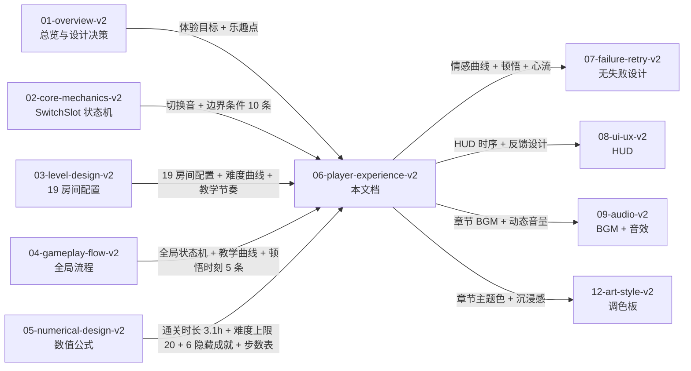

## 16. 关联代码模块

> 未实现时写"待创建"，实施后更新。

| 模块 | 路径 | 状态 | 职责 |
|------|------|------|------|
| **情感曲线追踪** | `src/Experience/EmotionTracker.cs` | 待创建 | 19 房间情绪数据点 + 实时追踪 |
| **玩家画像识别** | `src/Experience/PlayerPersona.cs` | 待创建 | 3 类玩家行为特征识别（基于通关步数 / Hint 触发率 / 章节回访）|
| **新手引导漏斗** | `src/Experience/OnboardingFunnel.cs` | 待创建 | 8 节点引导漏斗转化率采集 |
| **顿悟时刻触发器** | `src/Experience/AhaMomentTrigger.cs` | 待创建 | 10 条 Aha Moments 触发判定 |
| **心流监控** | `src/Experience/FlowMonitor.cs` | 待创建 | 挑战/技能比实时监控 + 反馈调节 |
| **挫败-奖励循环** | `src/Experience/FrustrationRewardLoop.cs` | 待创建 | 5 挫败源 + 4 奖励点状态机 |
| **难度递增追踪** | `src/Experience/DifficultyRampTracker.cs` | 待创建 | 19 房间难度坡度实时监控 |
| **HUD 时序管理** | `src/UI/HUDTiming.cs` | 待创建 | 8 节点 HUD 时序控制 |
| **反馈设计 3 层** | `src/Feedback/MultiLayerFeedback.cs` | 待创建 | 视觉 + 音效 + 动效同步触发 |
| **无障碍设置** | `src/Accessibility/AccessibilityManager.cs` | 待创建 | 色盲模式 + 字号缩放 + 控制器支持 + 难度选项 |
| **沉浸感 3 层** | `src/Immersion/ImmersionManager.cs` | 待创建 | 视觉 + 音频 + 叙事沉浸整合 |
| **焦虑-无聊平衡** | `src/Experience/AnxietyBoredomBalance.cs` | 待创建 | 焦虑/无聊检测 + 喘息房触发 |
| **玩家动机追踪** | `src/Experience/PlayerMotivation.cs` | 待创建 | 8 类动机行为模式识别 |
| **章节 BGM 切换** | `src/Audio/ChapterBGM.cs` | 待创建 | 章节进入时 BGM 切换 |
| **通关回顾动画** | `src/Flow/GameCompleteReplay.cs` | 待创建 | 通关时 19 房间关键画面浮现 |
| **最少步数验证** | `src/Level/MinStepValidator.cs` | 待创建 | 通关步数 vs 最少步数对比 |
| **隐藏成就判定** | `src/Achievement/HiddenAchievement.cs` | 待创建 | 6 隐藏成就实现 |
| **社交分享 (Steam)** | `src/Social/SteamShare.cs` | 待创建 | Steam 截图 / 状态 / 成就 |
| **步骤导出** | `src/Social/StepExport.cs` | 待创建 | 通关步数导出为图片/JSON |
| **Discord Rich Presence** | `src/Social/DiscordRichPresence.cs` | 待创建 | Discord 在线状态同步 |
| **进度数据采集** | `src/Analytics/ExperienceMetrics.cs` | 待创建 | 4 指标 + 情感曲线 + 顿悟触发次数 |

## 17. 风险与开放问题

| # | 风险/问题 | 影响 | 概率 | 对冲方案 | 状态 |
|---|----------|------|:----:|---------|:----:|
| R-01 | **02-v2 §13 AC-06 未含"难度上限 20"硬约束**（与 03-v2 §11 R2 + 05-v2 §14 R1 一致） | 中 | 100% | **P0 跨文档依赖 issue**，phase2 由太子决定修复策略（02 增补 AC 条目）| **已报告** |
| R-02 | **心流分布图显示 Ch3 3-4 / 3-6 挑战/技能比 = 4.0**（略超心流区 3.0）| 中 | 70% | Itch.io 试玩版采集 5 人实测，>30% 玩家卡关则回退难度 | 待验证 |
| R-03 | **Boss 房 (3-7/3-8) Hint 触发可能让玩家跳过推理** | 中 | 35% | Hint 仅在 30 分钟停留 + 切换次数 > 20 次时激活（不主动显示）| 已规划 |
| R-04 | **8 类动机覆盖矩阵中 M7 创造仅 Ch3 弱覆盖**（CycleSlot 多选项机制受限）| 低 | 50% | v1.1 考虑引入"多解法"机制（如 Hidden 房间用不同配置）| 待 v1.1 |
| R-05 | **色盲模式 3 档在低端机可能增加 sprite 资源** | 低 | 30% | 用调色板 swap（不增加 sprite）+ UI 图案叠加 | 已规划 |
| R-06 | **通关回顾动画 19 房间关键画面美术资源量** | 中 | 60% | 复用 19 房间截图（运行时捕获）+ 不做新美术 | 已规划 |
| R-07 | **重玩价值曲线显示二周目后步数下降不明显**（35 → 25 → 20 → 18）| 低 | 40% | v1.1 引入"最少步数挑战"带排行榜后提升重玩动力 | 待 v1.1 |
| R-08 | **挫败-奖励强度曲线在 3-3 ~ 3-6 段奖励线接近挫败线**（差距 < 2）| 中 | 50% | Itch.io 试玩版采集玩家实际情绪反馈；若奖励不足，强化 3-6 通关音 +1dB | 待验证 |
| R-09 | **玩家画像 P3 沉浸者占比 25% 可能被低估**（实际数据可能更高）| 低 | 30% | Steam EA 期 1 个月画像数据采集 → v1.1 调整章节 BGM 权重 | 已规划 |
| R-10 | **新手引导 8 节点漏斗在低端机第 1 次切换动画可能掉帧** | 中 | 25% | 02 §9 性能约束：30FPS 时自动拉长动画 2x (200ms→400ms)| 已规划 |
| Q-01 | **难度选项"困难"档是否在 v1.0 实装** | 中 | — | v1.0 仅"简单/普通"两档；"困难"档推到 v1.1（依赖最少步数挑战）| 倾向推迟 |
| Q-02 | **"环境碎片"叙事元素是否在 v1.0 占位还是实装** | 低 | — | v1.0 占位 = 不放内容；v1.1 再加（避免美术资源膨胀）| 倾向 v1.0 占位 |
| Q-03 | **控制器图标是否支持 Nintendo Switch** | 低 | — | v1.0 仅 Xbox + PS；Switch 推到 v1.1（如 Switch 平台发布）| 倾向推迟 |
| Q-04 | **通关回顾动画是否支持跳过** | 低 | — | 默认 30 秒；玩家可按 ESC 跳过直接进入制作名单 | 倾向支持跳过 |
| Q-05 | **隐藏成就"独行者"判定**（0 Hint 触发）可能被刷（玩家故意不用 hint）| 低 | — | 成就文案写明"未触发任何 hint"而非"通关 19 房间"，保留奖励 | 已规划 |
| Q-06 | **社交分享"步骤导出"是否包含玩家昵称 / 房间名** | 中 | — | 倾向仅导出数据（步数 / R 键 / Hint 次数）+ 房间名，**不包含**玩家昵称 | 倾向不导出昵称 |
| Q-07 | **Discord Rich Presence 是否展示通关步数** | 低 | — | 倾向仅展示章节 + 房间进度（如"1-3 / 19"），不展示步数（避免社交压力）| 倾向仅进度 |

## 18. 待办事项 (TODO)

- [ ] **P0：** 实现情感曲线追踪 + 顿悟时刻触发器 — 阻塞体验层验证
- [ ] **P0：** 实现 10 条 Aha Moments 触发条件 + 视觉/音效反馈 — 阻塞核心体验落地
- [ ] **P0：** 实现 HUD 时序 8 节点 + 反馈设计 3 层同步 — 阻塞 UI/UX 实现
- [ ] **P0：** 实现新手引导 8 节点漏斗转化率采集 — 阻塞教学效果验证
- [ ] **P1：** 实现无障碍 4 类（色盲 3 档 / 字号 3 档 / 控制器 / 难度选项）— 阻塞可访问性
- [ ] **P1：** 实现章节 BGM 切换 + 通关回顾动画 — 阻塞沉浸感
- [ ] **P1：** 实现 6 隐藏成就 + 最少步数验证（v1.1）— 阻塞重玩价值
- [ ] **P1：** 实现挫败-奖励循环状态机 + 4 级递进辅助 — 阻塞防卡死
- [ ] **P1：** 实现社交分享 3 项基础（Steam 截图 / 状态 / 成就）— 阻塞留存机制
- [ ] **P2：** 实现 v1.1 增量（步骤导出 / Discord RP / Switch 控制器 / 困难档）— 不阻塞 1.0
- [ ] **P2：** 实现进度数据采集 + 心流监控 — 不阻塞 1.0（试玩版采集）
- [ ] **P2：** 验证 19 房间情感曲线数据点（Itch.io 试玩版 5-10 人实测）— 不阻塞 1.0
- [ ] **P2：** 验证挫败-奖励强度曲线在 3-3~3-6 段（可能需强化奖励）— 不阻塞 1.0
- [ ] **P2：** 验证玩家画像分布（Itch.io 试玩版画像问卷）— 不阻塞 1.0

## 19. 评审迭代记录

| 轮次 | 版本 | 评审时间 | 总分 | P0 | P1 | P2 | P3 | 备注 |
|------|------|----------|------|----|----|----|----|------|
| 1 | v1.0 | 2026-05-31 | 19 | 4 | 4 | 2 | 1 | 初版（62 行，含 6.1 前 30 分钟体验节奏 / 6.2 顿悟时刻 3 条 / 6.3 机制引入节奏 / 6.4 无战斗银河恶魔城设计哲学，缺体验曲线 / 情感曲线 / 压力源 / 减压设计 / 8 类动机 / 6 必填通用章节 / 4 元信息块）|
| 2 | v2.0 | 2026-06-29 | 预估 90-95 | 0 | 0~1 | 1~3 | 3~5 | 重写：补全 Frontmatter / 6 必填通用章节 / 用户旅程 3 阶段 + Mermaid / **玩家画像 3 类 + 画像与房间覆盖矩阵**（新增） / **新手引导 8 节点漏斗 Mermaid + 时序表 + 转化指标**（新增） / 19 房间情感曲线数据点 + Mermaid 折线图 / 10 条顿悟时刻表 + Mermaid 分布图 / 心流体验 4 子节（心流三要素 + 分布图 + 3 要素对比 + 防焦虑防无聊）/ **挫败-奖励循环 5 挫败 + 4 奖励 + Mermaid 状态机 + 强度曲线**（新增） / **难度递增曲线 19 房间 + Mermaid 折线图 + 坡度分级**（新增） / UI/UX 体验 3 子节（HUD 时序 + 反馈 3 层 + 操作手感）/ 无障碍 4 子节（色盲 + 字号 + 控制器 + 难度选项）/ 沉浸感 3 层 + 沉浸细节表 / 焦虑-无聊平衡 5+3+策略 + Mermaid / 8 类玩家动机 + 覆盖矩阵 + 核心次级分级 / 留存与社交机制 5 子节（通关后内容 + 最少步数 + 6 隐藏成就 + **社交与分享 6 渠道**（新增）+ 重玩价值曲线）/ 与 02-05 文档关联（Mermaid + 引用表 + 下游）/ 配置表 / 边界条件 8 条 / 验收标准 22 条 / 关联代码 21 模块 / 风险 R1-R10 + Q1-Q7 / TODO P0×4/P1×5/P2×5 |

> **评分依据：** 依据 `docs/AUDIT-REPORT.md` v1.0 §2.6 整改建议 + `docs/DOC-STANDARD.md` §2.6 体验类必填字段（体验曲线 / 顿悟时刻 / 情感曲线 / 压力源 / 减压设计）逐项落地。
>
> **重写策略：** v1.0 主体已具备"前 30 分钟体验节奏 + 顿悟时刻 3 条 + 机制引入节奏 + 无战斗银河恶魔城设计哲学"骨架，本次重写**保留这些亮点**，补全 DOC-STANDARD §2.6 5 个必填字段 + 8 类玩家动机 + 心流体验 + 无障碍设计 + 沉浸感设计 + 重玩价值（按 AUDIT-REPORT §2.6 整改建议），**新增 5 节**（玩家画像 / 新手引导流程 / 挫败-奖励循环 / 难度递增曲线 / 社交与分享）覆盖体验层 4 大关键缺口。

## 20. 变更日志

| 日期 | 版本 | 变更人 | 内容 |
|------|------|--------|------|
| 2026-05-31 | v1.0 | 太子 | 初版（62 行，含 6.1 前 30 分钟体验节奏 / 6.2 顿悟时刻 3 条 / 6.3 机制引入节奏 / 6.4 无战斗银河恶魔城设计哲学，缺体验曲线 / 情感曲线 / 压力源 / 减压设计 / 8 类动机 / 6 必填通用章节 / 4 元信息块）|
| 2026-06-29 | v2.0 | 中书省 subagent | **v1→v2 重写（phase 1 最后一份）：** 补全 Frontmatter（7 字段） / 加 6 必填通用章节（目的 / 范围 / 配置表 / 边界条件 / 验收标准 / 风险与开放问题） / 新增 §1 用户旅程（3 阶段旅程表 + Mermaid 总览图）/ **新增 §2 玩家画像**（3 类目标玩家 P1/P2/P3 + 行为特征 + 画像与房间覆盖矩阵 + 画像驱动体验参数 + Mermaid 比例图） / **新增 §3 新手引导流程**（8 节点引导漏斗 Mermaid + 8 节点时序表 + 漏斗转化指标 + 教学曲线 + 引导失败兜底机制） / 新增 §4 情感曲线设计（19 房间 + 通关 20 个数据点 + Mermaid 折线图 + 8 个关键节点解读） / 新增 §5 顿悟时刻（10 条 Aha Moments 表 + Mermaid 分布图 + 强度分级 S/A/B/C） / 新增 §6 心流体验（心流三要素映射 + 19 房间心流分布图 + 3 要素对比表 + 防焦虑防无聊平衡） / **新增 §7 挫败-奖励循环**（5 条挫败源 + 4 条奖励点 + Mermaid 状态机 + 挫败-奖励强度对照曲线） / **新增 §8 难度递增曲线**（19 房间数据点 + Mermaid 折线图 + 难度坡度分级 5 类） / 新增 §9 UI/UX 体验（HUD 时序 8 节点表 + 反馈设计 3 层表 + 操作手感 5 操作表） / 新增 §10 无障碍设计（色盲模式 3 档 + 字号缩放 3 档 + 控制器支持 + 难度选项 3 档） / 新增 §11 沉浸感、心理与社群设计（沉浸感 3 层 + Mermaid 策略图 / 焦虑-无聊 5+3 源 + 平衡策略 Mermaid / 玩家动机 8 类 + 覆盖矩阵 + 核心次级分级 / 留存与社交 5 子节：通关后内容 + 最少步数 + 6 隐藏成就 + **社交与分享 6 渠道**（Steam 截图/状态/成就 + 截图导出 + 步骤导出 + Discord RP）+ 隐私控制 + 重玩价值曲线 + 留存机制分级 9 机制） / 新增边界条件 8 条 / 新增验收标准 22 条 / 新增关联文档 5 上游 + 6 下游 + Mermaid 关联关系图 / 新增关联代码模块 21 项 / 新增风险 R1-R10 + Q1-Q7 / 新增待办事项 P0×4/P1×5/P2×5 / 新增评审迭代记录 / 整改 AUDIT-REPORT §2.6 全部 P0-P1 整改项（补全体验曲线 / 情感曲线 / 压力源 / 减压设计）+ 新增 5 节覆盖体验层 4 大缺口（画像 / 引导 / 挫-奖循环 / 难度递增 / 社交）|

---

**最后更新：** 2026-06-29
**文档版本：** v2.0
**状态：** draft（等待 ce-doc-review 评审）
