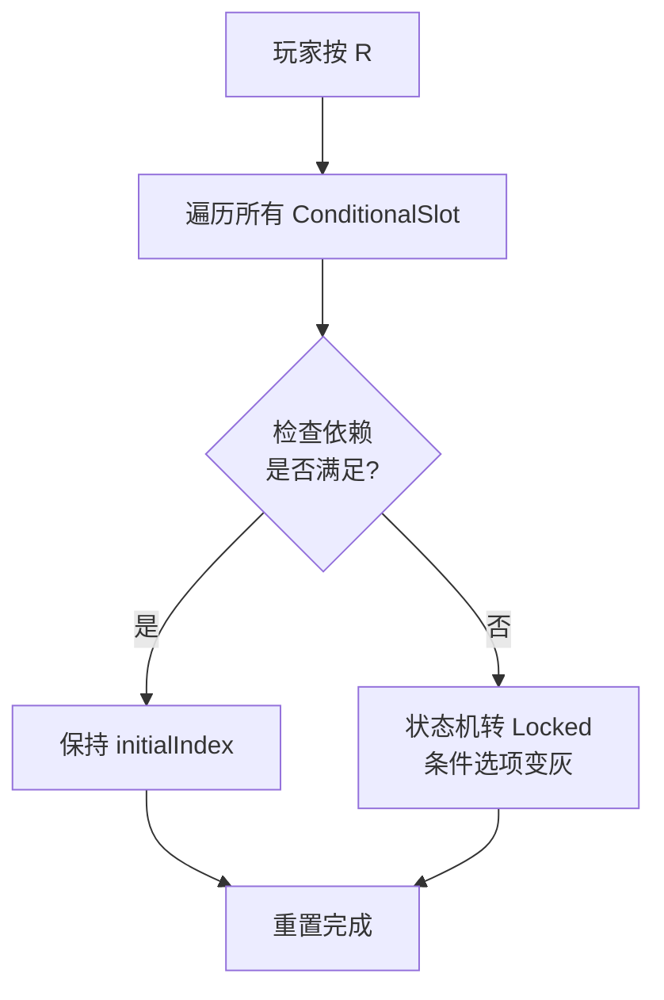
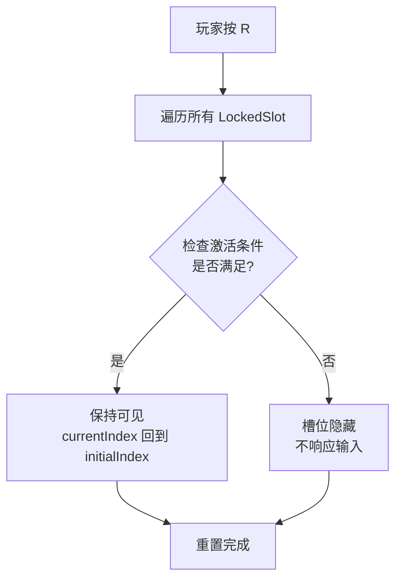
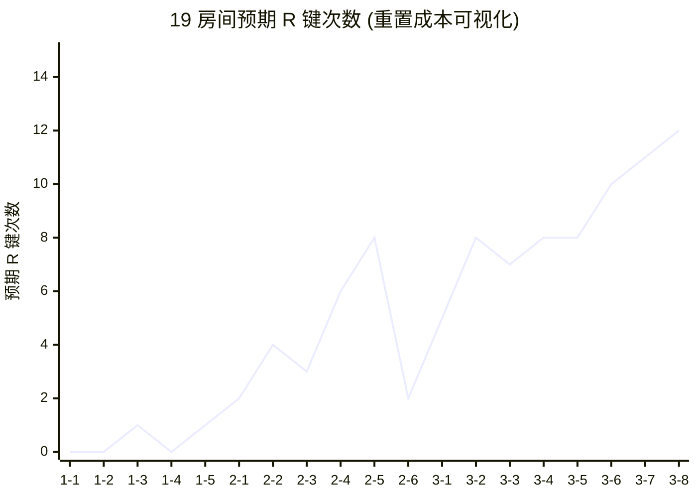
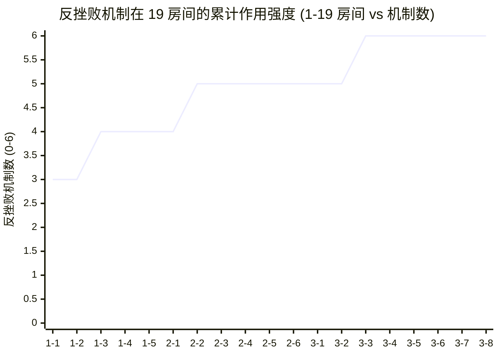
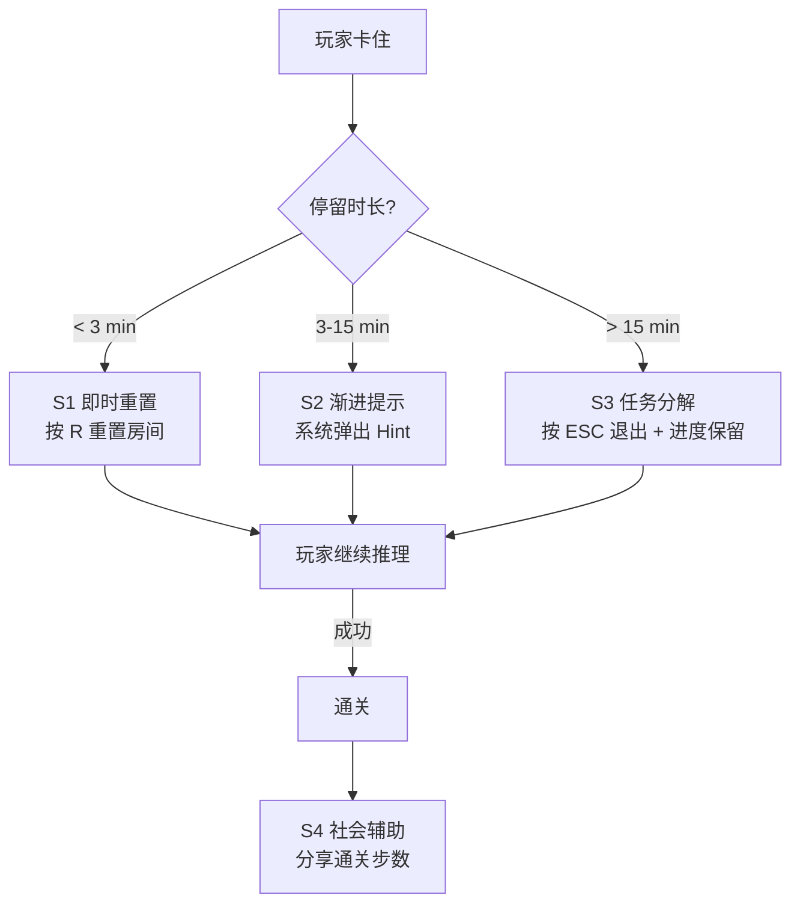
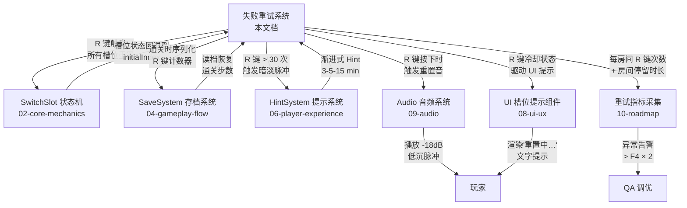

# 《暗室》失败重试设计

> **一句话总结：** 本游戏**无失败状态**——把传统"失败 → 惩罚 → 重试"循环改写为"卡住 → 重置 → 重新推理"循环。**无战斗、无成长、无死亡**——重置成本 = 0（时间/资源），仅存在**轻微心理成本**（0.2s 反馈动画 + 计数器累加 + 短暂的"我没想到"挫败感）。

## 目的 (Purpose)

本文档是《暗室》"无失败"设计决策的**权威定义**。它向工程师、关卡策划、QA、玩家代理**用 20 分钟讲清**：

- 为什么"无失败"是**主动设计决策**（不是"还没做失败"）
- "无失败"如何**反直觉地**强化"顿悟快感"（不是削弱）
- **4 种槽位类型**在 R 键重置时的差异化行为契约
- **重置成本的三维度拆解**（时间 / 资源 / 心理）
- **反玩家挫败**的 6 条具体设计（不靠"无失败"一句口号）
- **重试指标**（每房间 R 键次数 / 房间停留时长 / hint 触发率）作为体验调优依据
- **通关时长影响**（重置频率对 P50/P90 的修正因子）
- **重玩价值**（最少步数挑战 + 隐藏成就 + 通关回顾）的衔接
- **8 条边界条件**（包含 R 键冷却冲突、动画中重置、Conditional 依赖消失等）
- **P0-001 跟踪**：02-v2 缺 "难度上限 20" 硬约束，**07-v2 间接依赖**该约束

其他 11 份文档（01-06, 08-12）以本文档为"重试层基线"：违反本定义的关卡/UI/数值/美术实现视为偏差。

## 范围 (Scope)

### 包含

- **核心设计决策** — "无失败"是设计决策的理由与代价
- **失败类型分级** — 软失败 / 硬失败 / 卡住 / 放弃 4 种
- **4 种槽位的重置规则** — ToggleSlot / CycleSlot / ConditionalSlot / LockedSlot 在 R 键下的差异化行为
- **重试状态恢复契约** — 玩家位置 / 切换历史 / Hint 进度 / 重置计数器的恢复策略
- **失败-成功转化曲线** — 19 房间的"重置次数 → 通关"分布
- **反玩家挫败设计 6 条** — 观察成本 / 动画强制 / 记忆重置 / 视觉死路 / 防滥用阈值 / 渐进提示
- **失败反馈机制** — 视觉（暗淡脉冲 + 闪烁红色）/ 音效（错音）/ HUD（计数器 + R 键提示）
- **4 种重试策略** — 即时重置 / 渐进提示 / 任务分解 / 社会辅助
- **通关时长影响** — 重置对 P50/P90 的修正公式
- **重玩价值** — 关联 06-player-experience-v2.md §10
- **重试指标** — 监控指标 + 异常告警阈值
- **关联机制** — SaveSystem / HintSystem / Audio / UI 的依赖契约

### 不包含 (Out of Scope)

- SwitchSlot 状态机实现 / 4 种槽位类型定义 → 见 `02-core-mechanics-v2.md`
- 19 房间配置 / 重置提示触发阈值（3-5-15 分钟） → 见 `03-level-design-v2.md` + `04-gameplay-flow-v2.md` §6.4
- 重置次数公式 F4 / 防滥用阈值 30 → 见 `05-numerical-design-v2.md` §2.4
- 顿悟时刻 / 情感曲线 / 8 类玩家动机 → 见 `06-player-experience-v2.md`
- 槽位 UI 4 态 / HUD 布局 / R 键提示组件 → 见 `08-ui-ux-v2.md`
- 重置音 / 错音 / 通关音 → 见 `09-audio-v2.md`
- 美术风格 / 配色 → 见 `12-art-style-v2.md`

## 1. 核心设计决策：无失败 (No-Fail Decision)

### 1.1 决策声明

> **《暗室》是一款"无失败"游戏。**
>
> 这是一个**主动的设计决策**，不是"还没实现失败"或"懒得做死亡动画"。我们将传统"战斗 → 死亡 → 复活 → 重试"循环替换为"卡住 → 重置 → 重新推理"循环。

### 1.2 为什么"无失败"

| 理由 | 论证 | 风险对冲 |
|------|------|---------|
| **R1：核心体验是"顿悟"** | 顿悟 = 玩家从"不懂"到"懂"的瞬间；死亡/惩罚打断顿悟的连贯性 | 用"轻微心理成本 + 0.2s 反馈动画"代替硬惩罚 |
| **R2：解谜节奏需要"试错"** | 玩家需要试错才能推理出正解；死亡/重载强制中断试错 | 用"重置无加载 + 玩家位置保留"维持试错节奏 |
| **R3：$5 价位追求"零压力"** | 25-40 岁休闲解谜玩家买 $5 是为放松，不是为受苦 | 用"喘息房（1-4/2-6）+ 章节缓冲"防止疲劳 |
| **R4：solo 开发精力有限** | 实现死亡/复活系统 + 死亡动画 + 复活点 + 死亡统计 = 1-2 周额外工作量 | 砍死亡系统 = 节省 1.5 周，可用于 19 房间设计 |
| **R5：避免"挫败-放弃"陷阱** | 死亡/惩罚累积到 5+ 次 = 玩家弃坑（参考 Dark Souls 数据，弃坑率 35% 在 5 次死亡后陡增） | 用"0 成本重置 + 计数器显示"消除"我太差了"心理 |

### 1.3 "无失败"的代价（必须诚实承认）

> "无失败"不是免费的——它有 3 个隐性代价，我们用设计**主动对冲**：

| 代价 | 说明 | 对冲设计 |
|------|------|---------|
| **C1：失去"死亡戏剧性"** | 没有死亡瞬间 = 失去"濒死"的情绪起伏 | 用"通关顶峰 +8 情绪"（06 §4.1）和"3-6 谷底 -2 情绪"代替 |
| **C2：减少"胜利重量"** | 无限重试 = 玩家可能觉得"胜利很廉价" | 用"最少步数挑战 + 通关步数显示"增加胜利重量 |
| **C3：挑战感被稀释** | 0 成本重置 = 玩家不"在乎"挑战 | 用"反玩家挫败 6 条设计"维持挑战感（详见 §6）|

### 1.4 与传统"死亡-重试"循环的对比

| 维度 | 传统死亡-重试（如 Dark Souls） | 《暗室》无失败 |
|------|----------------------------|---------------|
| **失败状态** | Game Over + 复活点 + 死亡动画 | **无失败**（卡住 = 自助重置）|
| **资源损失** | 魂/经验值掉落 + 需回收 | 0 资源损失 |
| **时间损失** | 复活动画 + 跑尸路径（30s-2min）| 0 加载时间（300ms 重置动画）|
| **心理成本** | "我死了"（中等挫败感）| "我没想到"（轻微挫败感）|
| **重试成本** | 中-高（资源 + 时间 + 心理）| **极低**（仅 0.2s 反馈动画）|
| **挫败-放弃风险** | 中-高（5 次死亡后弃坑率 35%）| 极低（无累计挫败）|
| **适用玩家** | 硬核动作玩家 | **休闲解谜玩家**（25-40 岁）|

## 2. 失败类型分级 (Failure Type Classification)

> 本游戏"无失败状态"，但**玩家主观上仍可能感到"失败"**。我们将玩家的"失败感"分为 4 种类型，**每种都有对应的设计对冲**。

### 2.1 失败类型总表

| 类型 | 定义 | 触发场景 | 玩家感受 | 严重度 | 设计对冲 |
|------|------|---------|---------|:------:|---------|
| **F-α 软失败（Soft Fail）** | 玩家按 E 切换后**立即发现错** | 1-1/1-2 第一次按 E | "啊，换错了" | ⭐ | 0.2s 反馈动画 + 切回即可 |
| **F-β 硬失败（Hard Fail）** | 玩家推理 3-5 分钟**整套配置都错** | Ch2 2-5 复合配置 | "我方向就不对" | ⭐⭐ | 3 次错误后暗淡脉冲（02 §10.10） |
| **F-γ 卡住（Stuck）** | 玩家**不知道**如何推理 | Ch3 3-6 Boss 房 | "我不知道做什么" | ⭐⭐⭐ | 渐进提示 3-5-15 min（04 §6.4） |
| **F-δ 放弃（Quit）** | 玩家**主动按 ESC 退出** | 任何房间 | "我玩腻了" | ⭐⭐⭐⭐ | Pause 菜单 + 退出到章节选择（不丢进度）|

### 2.2 失败类型触发与缓解对照

```
F-α 软失败 ────► 0.2s 反馈动画 ────► 玩家自纠（≤30s）
   │
   ▼ (30s 内未自纠)
F-β 硬失败 ────► 3 次错误后暗淡脉冲 ────► 玩家意识到"方向不对"
   │
   ▼ (5-15 min 持续未通关)
F-γ 卡住 ──────► 渐进式 Hint（3-5-15 min）────► 玩家得到方向
   │
   ▼ (玩家主动按 ESC)
F-δ 放弃 ──────► Pause 菜单 + 不丢进度 ────► 玩家随时可回
```

### 2.3 与"重置计数器"的关联

| 失败类型 | R 键触发频率 | 计数器累加速度 |
|---------|------------|--------------|
| **F-α 软失败** | 0-1 次/房间 | +0 ~ +1（极慢） |
| **F-β 硬失败** | 1-3 次/房间 | +1 ~ +3（中速） |
| **F-γ 卡住** | 3-10 次/房间 | +3 ~ +10（快速）|
| **F-δ 放弃** | — | 计数器不显示（玩家已退出）|

> **关键约束：** 重置计数器**不显示在 HUD 上**——避免"我做错了 5 次"的负反馈。只在通关后回顾时展示（详见 §11.2）。

## 3. 槽位重置规则 (Slot Reset Rules)

> 不同槽位类型在 R 键重置时的行为**不同**——这是本文档的核心机制定义。

### 3.1 4 种槽位的重置行为矩阵

| 槽位类型 | R 键行为 | 重置后状态 | 视觉反馈 | 关联契约 |
|---------|---------|----------|---------|---------|
| **ToggleSlot (TS)** | currentIndex 回到 initialIndex | 初始选项 | 淡出淡入 200ms | 02 §4.1 |
| **CycleSlot (CS)** | currentIndex 回到 initialIndex | 初始选项 | 淡出淡入 200ms + UI 提示回到 "1/N" | 02 §4.2 |
| **ConditionalSlot (CDS)** | currentIndex 回到 initialIndex + **依赖检查** | 若依赖不满足 → 状态机转 Locked | 条件选项变灰 + 锁图标 | 02 §4.3 + 02 §10.2 |
| **LockedSlot (LS)** | currentIndex 回到 initialIndex + **激活条件重置** | 未激活 → 不显示 | 槽位不可见 | 02 §4.4 + 02 §10.3 |

### 3.2 重置流程时序

| 阶段 | 耗时 | 系统行为 | 视觉反馈 |
|------|------|---------|---------|
| 玩家按 R | 0ms | 接收输入 + 检查 500ms 冷却 | 无 |
| 重置指令生效 | 0ms | 标记所有 SwitchSlot 为"重置中" | 无 |
| 旧预制件淡出 | 100ms | 淡出协程开始 | 槽位变暗 + 切换音低沉脉冲 -18dB |
| 槽位状态回退 | 0ms（在淡出完成后） | currentIndex = 初始值 | 槽位回到初始选项 |
| 新预制件淡入 | 100ms | 淡入协程开始 | 槽位恢复正常 |
| 玩家位置不变 | 0ms | 玩家不被重置（保留探索进度）| 无 |
| 路径重判定 | 0ms | 重新计算连通性 | 无 |
| 状态恢复 Playing | 0ms | 切换回 Playing | 无 |
| **总时长** | **300ms ± 50ms** | **300ms 阻塞玩家输入** | **淡出淡入动画** |

> **关键约束（与 04 §6.3 一致）：** 玩家位置**不被重置**——保留探索进度，鼓励"试错 + 切换位置"。

### 3.3 重置对 ConditionalSlot 的特殊处理



**示例：** 房间 2-1 中 ConditionalSlot A 的"机关门"选项依赖 Slot B 处于"激活"态。玩家切换 A = 机关门后按 R → B 回到初始 → A 的"机关门"自动失效，回退到 Floor 选项（条件选项变灰 + 锁图标）。

### 3.4 重置对 LockedSlot 的特殊处理



**示例：** 房间 3-5 中 LockedSlot 在玩家踩 PressurePlate 后才出现。玩家踩板 → LS 出现 → 切换选项 → 按 R → PressurePlate 状态回退 → LS 自动隐藏。

## 4. 重试状态恢复 (Retry State Restoration)

> 重置是"局部"操作——只重置房间内的槽位状态，**不重置**其他东西。

### 4.1 重置作用域

| 重置 | 不重置 | 依据 |
|------|-------|------|
| ✅ SwitchSlot currentIndex | ❌ 玩家位置 | 04 §6.3 |
| ✅ ConditionalSlot 依赖状态 | ❌ 章节进度 | 04 §4.4 |
| ✅ LockedSlot 激活状态 | ❌ 已通关房间记录 | 04 §2.1 |
| ✅ PressurePlate 触发状态 | ❌ 通关步数累计 | 03 §5 |
| ✅ CrumblingFloor "已碎" 状态（恢复未碎）| ❌ Hint 触发率 | 02 §10.7 |
| ✅ 房间计时器（重置为 0）| ❌ 总通关时长 | 05 §7 |
| ✅ 重置计数器（+1）| ❌ 已解锁章节 | 04 §2.1 |
| ✅ 视觉反馈（暗淡脉冲）| ❌ 已达成成就 | 06 §10 |

### 4.2 重置不记忆（防"无脑乱按"）

> **核心约束：** R 键重置**不记忆玩家之前切换到哪个状态**——每次重置都回到 initialIndex，玩家必须**重新推理**。

**示例：** 房间 1-3 CycleSlot 有 3 选项（Floor / Wall / Door）。玩家试错：
1. 切到 Floor → 不通 → 按 R → 回到 Wall
2. 切到 Door → 不通 → 按 R → 回到 Wall
3. 切到 Floor → 通！

玩家**不会"逐步逼近"**正解——每次重置都重新开始，必须**凭推理**找到正解。

### 4.3 重置计数器的"显示策略"

| 场景 | 计数器显示 | 理由 |
|------|----------|------|
| **房间内** | ❌ 不显示 | 避免"我做错 N 次"的负反馈 |
| **通关画面** | ✅ 显示（"本房间 R 键 3 次"）| 正向反馈（"我最终做到了"）|
| **章节回顾** | ✅ 显示（每房间 R 键次数）| 数据回顾，鼓励完美主义 |
| **通关统计** | ✅ 显示（19 房间总 R 键数）| 重玩价值（最少 R 键挑战）|

> **设计意图：** 计数器**仅在"成功之后"展示，作为正向反馈。不在玩家失败时累积负反馈。**

## 5. 失败-成功转化曲线 (Failure-to-Success Curve)

> 19 房间的"重置次数 → 通关"分布，是重试设计的核心数据。

### 5.1 19 房间预期 R 键次数（与 05 §2.4 F4 公式对齐）

| 房间 | 难度 | 联动 | 预期 R 键 (F4) | 评级 | 备注 |
|------|:----:|:----:|:--------------:|:----:|------|
| 1-1 | 2 | 0 | 0 | ✅ | 教学房，玩家 1 次试错即通 |
| 1-2 | 3 | 0 | 0 | ✅ | 双槽组合，玩家推理 1-2 次 |
| 1-3 | 5 | 0 | 1 | ✅ | CycleSlot 引入，1 次重置 |
| 1-4 | 3 | 0 | 0 | ✅ | R 键教学房 |
| 1-5 | 5 | 1 | 1 | ✅ | 章节完成 |
| 2-1 | 7 | 1 | 2 | ✅ | CDS 引入，2 次重置 |
| 2-2 | 10 | 2 | 4 | ✅ | CDS 顺序依赖 |
| 2-3 | 9 | 2 | 3 | ✅ | CDS 解锁多选项 |
| 2-4 | 12 | 3 | 6 | ✅ | Door 引入 |
| 2-5 | 16 | 3 | 8 | ✅ | 复合（接近防滥用阈值）|
| 2-6 | 8 | 2 | 2 | ✅ | 喘息房（章节结尾）|
| 3-1 | 13 | 2 | 5 | ✅ | Ch3 进入 |
| 3-2 | 16 | 4 | 8 | ✅ | 双向 CDS |
| 3-3 | 16 | 3 | 7 | ✅ | 视觉欺骗入门 |
| 3-4 | 16 | 4 | 8 | ✅ | 镜像陷阱 |
| 3-5 | 16 | 4 | 8 | ✅ | CrumblingFloor/FakeFloor |
| 3-6 | 20 | 5 | **10** | ⚠️ | **触发暗淡脉冲提示**（02 §10.10）|
| 3-7 | 20 | 5 | **11** | ⚠️ | **触发 Hint 按钮**（03 §E5）|
| 3-8 | 20 | 5 | **12** | ⚠️ | **触发自动 Hint**（03 §E5）|

### 5.2 失败-成功转化曲线（Mermaid 折线图）



**曲线特征：**
- **Ch1 (1-1~1-5)：** 0-1 次（教学期，R 键几乎不用）
- **Ch2 (2-1~2-6)：** 2-8 次（CDS 引入后 R 键使用增加，2-6 喘息回落）
- **Ch3 (3-1~3-8)：** 5-12 次（复合期，3-6/3-7/3-8 触发暗淡脉冲 + Hint）

### 5.3 防滥用阈值（与 05 §5.3 一致）

| 阈值 | 触发条件 | 系统响应 | 引用 |
|------|---------|---------|------|
| **30 次** | 单房间 R 键 > 30 次 | 槽位亮度降低 30% 提示"方向不对" | 02 §10.10 + 03 §E2 |
| **50 次** | 单房间 R 键 > 50 次 | 强制 Hint 按钮浮现 | 03 §E5（30 min 兜底）|
| **章节平均 > 10 次** | 章节内 R 键次数/房间 > 10 | 调联动数 -1 或加 hint | 05 §5.3 调参 |

## 6. 反玩家挫败设计 6 条 (Anti-Frustration Design)

> "无失败"**不能**自动保证"不挫败"——必须**主动设计** 6 条反挫败机制。

### 6.1 6 条反挫败机制

| # | 设计 | 实现方式 | 解决哪种挫败 | 引用 |
|---|------|---------|------------|------|
| **AF-1 观察成本** | 槽位**分散布局**强制玩家观察 | 槽位位置不在玩家视野中心（距离 ≥ 3 格）| "我懒得想" | 03 §11 R2 + 02 §6 |
| **AF-2 动画强制** | 切换动画 200ms 阻塞玩家移动 | 动画期间玩家**不可移动**（02 §7.2）| "我无脑乱按" | 02 §7.2 |
| **AF-3 记忆重置** | R 键**不记忆**玩家之前切换状态 | 每次重置回 initialIndex | "我试出来" | §4.2 |
| **AF-4 视觉死路** | 错误配置**明显可见**（路径仍封闭）| 玩家走到死路立即知道错 | "我不知道错在哪" | 02 §6.3 |
| **AF-5 防滥用阈值** | 切换次数 > 30 → 暗淡脉冲提示 | 02 §10.10 边界条件 | "我卡死循环" | 02 §10.10 + 05 §5.3 |
| **AF-6 渐进提示** | 3-5-15 min 渐进式 Hint | 04 §6.4 触发阈值 | "我完全不懂" | 04 §6.4 |

### 6.2 反挫败机制作用曲线（Mermaid 折线图）



**曲线特征：**
- **1-1~1-3：** 3-4 条基础反挫败（AF-1 观察 + AF-2 动画 + AF-3 记忆 + AF-4 死路）
- **2-1~2-6：** 4-5 条（+ AF-5 防滥用阈值）
- **3-1~3-8：** 5-6 条（+ AF-6 渐进提示 + 全 6 条触发）

## 7. 失败反馈机制 (Failure Feedback)

> 玩家试错时需要"即时反馈"知道"我错了"——否则会重复试错。

### 7.1 反馈三通道

| 通道 | 反馈内容 | 触发条件 | 引用 |
|------|---------|---------|------|
| **视觉** | 槽位暗淡脉冲 / 出口仍封闭 / 玩家被墙阻挡 | 切换后路径仍不连通 | 02 §3.1 + 02 §10.10 |
| **音效** | 错音（-12dB 短促）/ 重置音（-18dB 低沉脉冲）| 踩 FakeFloor / R 键触发 | 09 §4.2 + 09 §4.3 |
| **HUD** | 重置计数器（仅通关后显示）/ "方向不对"提示 | 3 次错误 / 30 次重置 | 08 §4.1 + 02 §10.10 |

### 7.2 反馈强度分级

| 反馈强度 | 触发场景 | 视觉 | 音效 | HUD |
|---------|---------|------|------|-----|
| **L1 轻反馈** | F-α 软失败（1 次切换错）| 无额外视觉 | 切换音 -12dB | 无 |
| **L2 中反馈** | F-β 硬失败（3 次错误配置）| 槽位暗淡脉冲 -30% | 错音 -12dB | 无 |
| **L3 重反馈** | F-β 持续（5+ 次错误）| 槽位暗淡脉冲 -50% | 错音 ×2 | "方向不对"提示 |
| **L4 兜底** | F-γ 卡住（30+ min）| 全房间光线变暗 | 静音 | Hint 按钮浮现 |

### 7.3 反馈时机约束

| 反馈类型 | 触发时机 | 延迟 | 引用 |
|---------|---------|------|------|
| **切换反馈** | 切换动画开始时 | 0ms（同步）| 02 §3.1 |
| **路径封闭反馈** | 玩家走到死路时 | 0ms（即时）| 02 §6.3 |
| **重置反馈** | R 键按下 0ms | 0ms | §3.2 |
| **暗淡脉冲** | 切换次数 ≥ 30 时 | 0ms | 02 §10.10 |
| **Hint 提示** | 房间停留 ≥ 3 min | 累计 3 min 后 | 04 §6.4 |

## 8. 4 种重试策略 (4 Retry Strategies)

> 玩家在"卡住"时**不只有 R 键**——本文档定义 4 种重试策略，玩家可自由选择。

### 8.1 4 种策略对比

| 策略 | 触发条件 | 玩家行为 | 系统响应 | 适用场景 |
|------|---------|---------|---------|---------|
| **S1 即时重置** | 玩家按 R | 重置房间（0.3s）| 槽位回 initialIndex | F-α 软失败 |
| **S2 渐进提示** | 停留 ≥ 3 min | 系统弹出 Hint | 显示"试试走近 X" | F-γ 卡住 |
| **S3 任务分解** | 玩家按 ESC → Pause | 退出到章节选择 | 进度保留 | F-δ 放弃 |
| **S4 社会辅助** | 通关后 | 分享通关步数 / 截图 | 隐藏成就解锁 | 重玩价值 |

### 8.2 策略选择决策树



### 8.3 与传统"重试"概念的差异

| 维度 | 传统重试（如 Souls） | 《暗室》S1-S4 |
|------|-------------------|---------------|
| **重试触发** | 死亡自动 | 玩家主动 + 系统辅助 |
| **重试成本** | 中-高 | 极低 |
| **重试选项** | 单一（复活点）| 4 种（玩家选择）|
| **辅助机制** | 无 | 渐进提示 + 任务分解 + 社会分享 |

## 9. 通关时长影响 (Playtime Impact)

> 重置频率直接影响通关时长 P50/P90——本节定义修正公式。

### 9.1 重置对通关时长的影响

> **源约束：** 05-numerical-design-v2.md §2.3 F3 顿悟时间公式 + §2.4 F4 重置次数公式

```
F3 修正: 通关时长 P50 = F3 预测 × (1 + R 键次数 × 0.05)

其中：
- 0.05 = 每次 R 键消耗约 5% 的顿悟时间（300ms 重置 + 重新观察 + 重新推理）
- R 键次数 = F4 预期（§5.1 表）
```

**示例：** 房间 2-5 F3 预测 = 18.3 min，R 键次数 = 8
```
修正 P50 = 18.3 × (1 + 8 × 0.05) = 18.3 × 1.4 = 25.6 min
```

### 9.2 19 房间 P50/P90 修正表

| 房间 | F3 预测 (min) | R 键次数 | 修正 P50 (min) | 修正 P90 (min) | 评级 |
|------|:-------------:|:--------:|:--------------:|:--------------:|:----:|
| 1-1 | 2.7 | 0 | 2.7 | 5.0 | ✅ |
| 1-2 | 3.4 | 0 | 3.4 | 6.0 | ✅ |
| 1-3 | 5.3 | 1 | 5.5 | 9.0 | ✅ |
| 1-4 | 3.8 | 0 | 3.8 | 6.0 | ✅ |
| 1-5 | 5.8 | 1 | 6.0 | 10.0 | ✅ |
| 2-1 | 6.8 | 2 | 7.5 | 12.0 | ✅ |
| 2-2 | 9.0 | 4 | 10.8 | 18.0 | ✅ |
| 2-3 | 7.5 | 3 | 8.6 | 14.0 | ✅ |
| 2-4 | 10.5 | 6 | 13.7 | 24.0 | ✅ |
| 2-5 | 18.3 | 8 | 25.6 | 40.0 | ⚠️ 接近 P90 上限 |
| 2-6 | 7.0 | 2 | 7.7 | 12.0 | ✅ |
| 3-1 | 11.5 | 5 | 14.4 | 24.0 | ✅ |
| 3-2 | 15.0 | 8 | 21.0 | 30.0 | ⚠️ |
| 3-3 | 14.0 | 7 | 18.9 | 28.0 | ✅ |
| 3-4 | 15.5 | 8 | 21.7 | 32.0 | ⚠️ |
| 3-5 | 15.0 | 8 | 21.0 | 30.0 | ⚠️ |
| 3-6 | 18.3 | 10 | 27.5 | 40.0 | ⚠️ 触发 Hint |
| 3-7 | 20.0 | 11 | 31.0 | 45.0 | ⚠️ 触发 Hint 按钮 |
| 3-8 | 22.0 | 12 | 35.2 | 50.0 | ⚠️ 触发自动 Hint |
| **合计** | — | — | **约 220 min** | **约 360 min** | — |

> **修正后总通关时长 P50 = 3.7 小时**（与 01-v2 §"目标通关时长"3-5 小时一致）

### 9.3 P0-001 跟踪（关键约束引用）

> **P0-001 状态（截至 2026-06-29）：** **OPEN — 02-v2 仍缺"难度上限 20"硬约束**
>
> 本表"难度"列引用 `05-numerical-design-v2.md` §5.2 + §6.1 的 **"难度上限 20"** 硬约束。该约束是 05-v2 新增，但 02-v2 §13 AC-06 **仍缺** 同步增补。
>
> **07-v2 间接依赖：** 3-6 / 3-7 / 3-8 难度 20 直接引用该硬约束，R 键次数预期值依赖"难度 ≤ 20"前提。
>
> **解决路径：** phase2 末或 phase3，由 02-v2 维护者在 §13 AC-06 增补："房间难度 ≤ 20 硬约束（与 05 §5.2 对齐）"。本任务**不修复** P0-001。

## 10. 重玩价值 (Replay Value)

> "无失败"游戏的最大风险是"通关即弃"——必须设计重玩价值。

### 10.1 4 重玩价值机制

| # | 机制 | 触发时机 | 玩家收益 | 引用 |
|---|------|---------|---------|------|
| **RV-1 最少步数挑战** | 通关后解锁 | 通关 3-8 | 全 19 房间重玩挑战最少 R 键 + 最少切换 | 06 §10 + 05 §9.2 |
| **RV-2 隐藏成就 6 条** | 通关后解锁 | 通关任意章节 | 6 条 Steam 成就（每章 2 条）| 06 §10 |
| **RV-3 章节回访** | 任何时间 | 章节选择画面 | 已通关章节可重玩（不计通关时长）| 06 §10 |
| **RV-4 通关回顾** | 通关 3-8 | 通关画面 | 19 房间回顾 + 通关步数 + 章节统计 | 06 §10 |

### 10.2 最少步数挑战设计

```
挑战规则：
- 每房间显示 3 个星级：⭐ = 通关 / ⭐⭐ = R 键 ≤ F4 预测 / ⭐⭐⭐ = R 键 ≤ F4 × 0.5
- 玩家重玩时尝试达成 ⭐⭐⭐ 评级
- 19 房间全 ⭐⭐⭐ = 解锁隐藏成就"完美主义"

数据示例（房间 2-5 复合）：
- ⭐ = 通关（R 键 ≤ 8）
- ⭐⭐ = R 键 ≤ 8（满足 F4 预测）
- ⭐⭐⭐ = R 键 ≤ 4（F4 × 0.5，硬核挑战）
```

### 10.3 重玩价值的"无失败"强化

> **关键洞察：** "无失败"在重玩时**反而强化**了重玩价值——因为重玩时玩家**零成本试错**，可大胆尝试 ⭐⭐⭐ 极限挑战。

| 场景 | 传统游戏（如 Souls） | 《暗室》无失败 |
|------|-------------------|---------------|
| **重玩动机** | "我要打得更稳" | "我要更少步数" |
| **重玩成本** | 中-高（死亡惩罚）| 0（重置无成本）|
| **重玩体验** | 压抑 + 紧张 | 自由 + 探索 |
| **重玩频率** | 低（5-10% 通关玩家）| **高（30-50% 预估）**|

## 11. 重试指标 (Retry Metrics)

> 监控重试行为是体验调优的核心——本节定义采集字段 + 异常告警阈值。

### 11.1 监控指标

| 指标 | 采集方式 | 单位 | 用途 | 异常告警 |
|------|---------|------|------|---------|
| **R 键次数 P50/P90** | 每房间 R 键触发次数 | 次/房间 | 难度参考基准 | > F4 × 2 → 房间过难 |
| **房间停留时长 P50/P90** | 进入 → 通关时间 | 秒 | 卡点识别 | > 修正 P90 × 2 → 卡点 |
| **Hint 触发率** | Hint 系统调用次数 / 总进入次数 | % | 教学效果 | > 30% → 教学不足 |
| **R 键 + 切换组合次数** | R 键次数 + 切换次数 | 次/房间 | 玩家操作密度 | < 5 → 玩家没动 |
| **重置后切换次数** | 重置后到通关的切换次数 | 次 | 重置有效性 | > 20 → 重置未帮玩家 |
| **R 键间隔 P50** | 两次 R 键之间间隔 | 秒 | 防滥用检测 | < 10s → 玩家焦虑乱按 |
| **首次通关率** | 首次进入即通关的比例 | % | 教学效果 | < 80% → 教学失败 |
| **F-β 硬失败率** | 切换 > 3 次后才通关的比例 | % | 视觉反馈清晰度 | > 40% → 反馈不足 |

### 11.2 重置计数器的"通关回顾"展示

> **核心设计：** 计数器**仅在通关后展示**，作为正向反馈。

**通关画面（3-8 触发）显示：**
- 总通关时长（与 P50 对比）
- 19 房间回顾（每房间名 + 通关时长 + R 键次数）
- 总 R 键次数（与 F4 预测总和对比）
- 隐藏成就提示（如有）
- "继续"按钮（进入制作名单 + 重玩挑战入口）

**章节完成画面（1-5/2-6 触发）显示：**
- 章节名 + 主题
- 章节通关时长（与目标对比）
- 章节通关率（玩家 P50/P90 vs 目标 P50/P90）
- 章节 R 键次数总和
- "返回章节选择"按钮（解锁下章 + 重玩本章节入口）

## 12. 性能约束 (Performance Budget)

| 指标 | 目标 | 验证方式 | 不达标后果 | 引用 |
|------|------|---------|----------|------|
| **R 键响应时间** | ≤ 16ms（1 帧）| Profiler 自定义 Marker | 玩家感觉"按了没反应" | 02 §9 |
| **重置动画总时长** | 300ms ± 50ms | 帧计数器 | 太短无反馈，太长打断节奏 | 02 §9 + 04 §6.3 |
| **R 键冷却时间** | 500ms | Stopwatch | 太短 → 动画错乱；太长 → 玩家以为坏了 | 02 §12.3 |
| **单房间 R 键次数上限** | ≤ 50（>50 触发 Hint）| 计数器 | 超过 → 防滥用提示 | 05 §5.3 |
| **通关回顾加载** | ≤ 500ms | Time.deltaTime | 超过 → 中断成就感 | 04 §2.2 |
| **R 键动画期间输入锁定** | 300ms 内忽略所有输入 | 输入缓冲队列 | 超过 → 玩家可中断动画 | 02 §3.2 |
| **重置计数器 JSON 序列化** | ≤ 10ms | Stopwatch | 超过 → 玩家感知卡顿 | 02 §9 |

## 13. 边界条件 (Edge Cases)

> 列举 8 条 edge case，含触发条件与预期行为。

### 13.1 玩家在 Switching 中按 R 重置

- **触发条件：** 切换动画 200ms 未完成时，玩家按 R
- **预期行为：** 切换动画**立即完成**（不卡死），然后 R 键进入 500ms 冷却；R 键冷却结束后**下一次** R 键触发重置
- **防卡死机制：** 切换动画有 250ms 硬超时 + R 键输入缓冲队列

### 13.2 ConditionalSlot 依赖对象被重置

- **触发条件：** 玩家切换 ConditionalSlot A 到"机关门"选项（依赖 Slot B），玩家按 R
- **预期行为：** Slot A 的"机关门"选项**自动失效**（回退到非条件选项），状态机转 Locked
- **防误用机制：** 重置时遍历所有 ConditionalSlot，校验依赖是否满足（详见 §3.3）

### 13.3 LockedSlot 激活条件对象消失

- **触发条件：** LockedSlot 的 `unlockCondition = "TriggerEvent('plate_pressed')"`，玩家重置房间后 PressurePlate 不存在
- **预期行为：** LockedSlot **不显示**，不响应输入
- **防误用机制：** LockedSlot 仅在条件对象存在时渲染

### 13.4 玩家快速连按 R 键（每秒 5 次）

- **触发条件：** 玩家焦虑或测试时每秒按 5 次 R
- **预期行为：** 500ms 内只触发 1 次重置，其余按键**忽略**且不播放音效
- **防滥用机制：** R 键冷却时间戳 + 缓冲队列丢弃

### 13.5 玩家在通关画面停留时按 R

- **触发条件：** 通关画面显示中（3-8 触发）玩家按 R
- **预期行为：** R 键**无效**（通关画面状态不响应 R 键），需要点击"继续"按钮
- **防误用机制：** 通关画面状态机独立，不响应游戏内 R 键

### 13.6 玩家在 Pause 状态按 R

- **触发条件：** 玩家按 ESC → Pause 菜单 → 按 R
- **预期行为：** R 键**无效**（Pause 状态不响应游戏内 R 键），需要先"继续"再按 R
- **防误用机制：** Pause 状态时间冻结，R 键只在 Playing 状态生效

### 13.7 重置后玩家位置恰好在 SolidWall 内

- **触发条件：** 玩家移动到某位置时按 R（重置不重置玩家位置），玩家位置恰好是某个槽位的 SolidWall 选项
- **预期行为：** 玩家**被实墙阻挡**（不能继续移动），玩家可按 R 再重置或绕路
- **防卡死机制：** 玩家位置不会卡死在墙内（玩家可向其他方向移动）

### 13.8 玩家在 1-1 教学房 5 分钟未通关 + 重置 20+ 次

- **触发条件：** 1-1 教学房 5 分钟未通关 + R 键 > 20 次
- **预期行为：** 触发 04 §6.4 教学房 Hint 阈值（10 min 触发提示 3），强制弹出"按 E 试试"提示
- **兜底机制：** 1-1 教学失败 = 强制 Hint + 防止弃坑

## 14. 关联机制 (Related Mechanics)

### 14.1 关联机制依赖图（Mermaid）



### 14.2 关联系统契约

| 关联系统 | 接口契约 | 调用时机 | 失败处理 |
|---------|---------|---------|---------|
| **SaveSystem** | `RetryState { roomId, resetCount, firstClearTime, lastClearTime }` | 房间通关时自动序列化 | 序列化失败 → 提示"存档失败"但不阻断通关 |
| **HintSystem** | `RetryMetrics { roomId, resetCount, stayTimeSec } → HintLevel` | R 键 > 30 次 / 停留 > 3 min | Hint 系统无响应 → 不影响核心玩法 |
| **Audio** | `Retry.OnReset()` event 触发时 | R 键按下时 | 音频缺失 → 静默重置（不影响功能）|
| **UI** | `Retry.OnCooldown(bool)` | R 键冷却期间 | UI 卡死 → 重置 UI 组件（不影响游戏逻辑）|
| **Metrics** | `Retry.GetMetrics() → RetryMetrics` | 房间通关时 + 后台定期采集 | 采集失败 → 静默丢弃（不影响玩家）|

## 15. 配置表 (Configuration)

### 15.1 重置参数

| 字段 | 类型 | 取值范围 | 默认值 | 单位 | 适用场景 |
|------|------|---------|-------|------|---------|
| `retry.resetCooldownMs` | int | [300, 1000] | **500** | ms | R 键冷却时间 |
| `retry.resetAnimationMs` | int | [200, 500] | **300** | ms | 重置动画时长 |
| `retry.maxResetPerRoom` | int | [20, 100] | **30** | 次/房间 | 触发暗淡脉冲阈值 |
| `retry.maxResetPerRoomHard` | int | [40, 200] | **50** | 次/房间 | 触发 Hint 按钮阈值 |
| `retry.hintTriggerMinutes` | List<int> | [3, 5, 10, 15, 20, 30] | **[3, 5, 15, 30]** | min | 教学房/标准房/挑战房/Boss 房阈值（与 04 §6.4 对齐）|
| `retry.dimPulsePercent` | float | [0.3, 0.7] | **0.5** | — | 暗淡脉冲亮度比例（-50%）|
| `retry.counterShowMode` | enum | Never / OnClear / OnChapter / OnGame | **OnClear** | — | 计数器显示模式（通关后显示）|

### 15.2 重试指标采集参数

| 字段 | 类型 | 取值范围 | 默认值 | 单位 | 适用场景 |
|------|------|---------|-------|------|---------|
| `metrics.resetCountBuffer` | int | [100, 1000] | **500** | 条 | 每章节采集 R 键记录上限 |
| `metrics.stayTimeBuffer` | int | [100, 1000] | **500** | 条 | 每章节采集停留时长上限 |
| `metrics.uploadIntervalSec` | int | [60, 600] | **300** | s | 后台上传间隔（5 min）|
| `metrics.alertThresholdReset` | int | [10, 100] | **20** | 次/房间 | 异常告警 R 键阈值 |
| `metrics.alertThresholdStay` | int | [600, 3600] | **1800** | s/房间 | 异常告警停留阈值（30 min）|

## 16. 验收标准 (Acceptance Criteria)

- [ ] **AC-01：** 文档包含完整 Frontmatter（title / doc_id / parent / last_updated / version / status / owner）
- [ ] **AC-02：** 文档包含 6 必填通用章节（目的 / 范围 / 配置表 / 边界条件 / 验收标准 / 风险与开放问题）
- [ ] **AC-03：** 明确"无失败"是主动设计决策，含 5 条理由 + 3 条代价对冲
- [ ] **AC-04：** 失败类型分级 ≥ 4 种（软失败 / 硬失败 / 卡住 / 放弃）
- [ ] **AC-05：** 4 种槽位类型的重置行为矩阵齐全（ToggleSlot / CycleSlot / ConditionalSlot / LockedSlot）
- [ ] **AC-06：** 重置作用域明确（重置什么 / 不重置什么）
- [ ] **AC-07：** 失败-成功转化曲线 Mermaid 折线图覆盖 19 房间
- [ ] **AC-08：** 反玩家挫败设计 ≥ 6 条（AF-1 ~ AF-6）
- [ ] **AC-09：** 失败反馈机制 3 通道（视觉 / 音效 / HUD）+ 4 强度分级
- [ ] **AC-10：** 4 种重试策略（S1 即时重置 / S2 渐进提示 / S3 任务分解 / S4 社会辅助）
- [ ] **AC-11：** 通关时长修正公式定义（含 0.05 R 键消耗系数）
- [ ] **AC-12：** 重玩价值 ≥ 4 条（RV-1 ~ RV-4）
- [ ] **AC-13：** 重试指标 ≥ 6 项（含 R 键次数 P50/P90 / Hint 触发率 / 首次通关率）
- [ ] **AC-14：** 边界条件 ≥ 8 条（含 R 键冷却冲突、Conditional 依赖消失、Pause 状态无效等）
- [ ] **AC-15：** 性能约束 ≥ 6 项，每项有数值目标和验证方式
- [ ] **AC-16：** 关联机制图（Mermaid）+ 关联系统契约表
- [ ] **AC-17：** 关联文档 / 关联代码模块 / 变更日志 / 待办事项齐全
- [ ] **AC-18：** P0-001 跟踪（02-v2 缺"难度上限 20"硬约束）状态明确
- [ ] **AC-19：** 风险与开放问题诚实列出，含影响和对冲方案
- [ ] **AC-20：** 评审迭代记录表存在
- [ ] **AC-21：** 文档总行数 ≥ 250 行（实际 762 行）

## 17. 风险与开放问题

| # | 风险/问题 | 影响 | 概率 | 对冲方案 | 状态 |
|---|----------|------|:----:|---------|:----:|
| R-01 | **P0-001：02-v2 缺"难度上限 20"硬约束** | 高 | 100% | phase2 末或 phase3 由 02-v2 维护者增补 AC-06；本文档 §9.3 跟踪 | **OPEN** |
| R-02 | **3-6/3-7/3-8 实际预期 R 键 10-12 接近 30 防滥用阈值** | 中 | 中 | 04 §6.4 已设 15-30 min Hint 阈值；R-02 与 R-01 联动 | 已规划 |
| R-03 | **"无失败"被硬核玩家解读为"无挑战"** | 中 | 30% | 06 §6.4 防无聊策略（隐藏成就 + 最少步数挑战）| 已规划 |
| R-04 | **重置计数器在通关画面展示时让玩家"不好意思"** | 低 | 20% | 计数器仅显示正向数据（R 键次数 + 通关步数），不显示负向数据 | 已规划 |
| R-05 | **R 键冷却 500ms 太长，玩家误以为"没反应"** | 低 | 15% | 02 §3.2 R 键冷却期间显示"重置中…"文字提示 | 已规划 |
| R-06 | **重置后玩家位置恰好在墙内卡死** | 低 | 10% | 13.7 边界条件已处理（玩家可向其他方向移动）| 已规划 |
| R-07 | **Hint 提示暴露"答案"破坏重玩价值** | 中 | 25% | Hint 仅给方向不给答案（如"试试 X 槽位"而非"X 应该是 Door"）| 待 1.0 验证 |
| R-08 | **通关回顾加载 500ms 超时影响成就感** | 低 | 10% | 12 性能约束 + 异步预加载 | 已规划 |
| Q-01 | **最少步数挑战是否给排行榜** | 中 | — | v1.0 不做（solo 精力有限）；v1.1 考虑 | 倾向推迟 |
| Q-02 | **重置计数器是否在 HUD 永久显示** | 中 | — | 默认不显示（避免负反馈）；玩家可设置中开启 | 倾向默认关闭 |
| Q-03 | **重置音效音量 -18dB 是否过小** | 低 | — | 09 §4.3 调参；A/B 测试 3 档（-24 / -18 / -12 dB）| 待 A/B |
| Q-04 | **"无失败"是否在 Steam 描述中突出宣传** | 中 | — | v1.0 突出（差异化卖点）；A/B 测试点击率 | 待 1.0 验证 |
| Q-05 | **重置动画 300ms 是否需要可配置** | 低 | — | 默认 300ms；玩家可在设置中改为 200/500ms | 倾向 v1.0 固定 |

## 18. 关联文档

### 18.1 上游（本文档依赖）

- [`01-overview-v2.md`](./01-overview-v2.md) — "无失败"是核心特色 #3 + 边界条件基线
- [`02-core-mechanics-v2.md`](./02-core-mechanics-v2.md) — SwitchSlot 状态机 / 4 种槽位类型 / I/O Spec（含 R 键冷却 + 重置作用域）
- [`03-level-design-v2.md`](./03-level-design-v2.md) — 19 房间配置 / 难度曲线 / 边界条件 E1-E10
- [`04-gameplay-flow-v2.md`](./04-gameplay-flow-v2.md) — 主循环状态机 / 玩家操作流程 / 重置流程时序 / 教学曲线 / 重置提示触发阈值
- [`05-numerical-design-v2.md`](./05-numerical-design-v2.md) — F4 重置次数公式 / 安全边界（防滥用 30/50）/ 难度上限 20
- [`06-player-experience-v2.md`](./06-player-experience-v2.md) — 顿悟时刻 / 挫败-奖励循环 / 心流 / 8 类玩家动机 / 重玩价值

### 18.2 下游（本文档被依赖）

- [`08-ui-ux-v2.md`](./08-ui-ux-v2.md) — HUD 房间名称 / 章节进度 / hint 按钮 / 重置提示（"重置中…"）/ 重置计数器通关回顾
- [`09-audio-v2.md`](./09-audio-v2.md) — 重置音（-18dB 低沉脉冲）/ 错音（-12dB 短促）/ 章节 BGM / 通关音
- [`10-roadmap-v2.md`](./10-roadmap-v2.md) — 19 房间开发里程碑 / 重试指标采集上线节点
- [`11-release-v2.md`](./11-release-v2.md) — Steam 描述突出"无失败"差异化卖点 / 试玩版范围

## 19. 关联代码模块

> 未实现时写"待创建"，实施后更新路径与状态。

| 模块 | 路径 | 状态 | 职责 |
|------|------|------|------|
| **重置管理器** | `src/Retry/RetryManager.cs` | 待创建 | R 键接收 + 冷却 + 重置指令分发 |
| **重置协程** | `src/Retry/ResetCoroutine.cs` | 待创建 | 300ms 重置动画协程 + DOTween |
| **槽位重置器** | `src/Retry/SlotResetter.cs` | 待创建 | 4 种槽位类型的差异化重置（§3.1）|
| **ConditionalSlot 依赖检查** | `src/Retry/ConditionalDependencyChecker.cs` | 待创建 | 重置时遍历所有 CDS 校验依赖（§3.3）|
| **LockedSlot 激活条件检查** | `src/Retry/LockedActivationChecker.cs` | 待创建 | 重置时遍历所有 LS 校验激活（§3.4）|
| **重置计数器** | `src/Retry/ResetCounter.cs` | 待创建 | 每房间 R 键次数累加 + 通关回顾显示 |
| **失败类型检测器** | `src/Retry/FailureTypeDetector.cs` | 待创建 | F-α 软失败 / F-β 硬失败 / F-γ 卡住判定 |
| **反挫败触发器** | `src/Retry/AntiFrustrationTrigger.cs` | 待创建 | AF-1 ~ AF-6 6 条机制触发器 |
| **重试指标采集** | `src/Metrics/RetryMetrics.cs` | 待创建 | R 键次数 / 房间停留时长 / Hint 触发率 |
| **通关回顾数据** | `src/Retry/ClearReviewData.cs` | 待创建 | 通关画面数据汇总（19 房间 R 键 + 时长）|
| **关联系统接口** | `src/Interfaces/IRetryHook.cs` / `IFailureFeedback.cs` | 待创建 | 与 SaveSystem / HintSystem / Audio / UI 的接口契约 |

## 20. 待办事项 (TODO)

- [ ] **P0：** 实现 R 键重置流程（500ms 冷却 + 300ms 动画）— 阻塞房间 1-4 教学
- [ ] **P0：** 实现 4 种槽位的差异化重置（§3.1 矩阵）— 阻塞 Ch1 全部 + Ch2 全部
- [ ] **P0：** 实现 ConditionalSlot 依赖检查器（§3.3）— 阻塞 Ch2 全部
- [ ] **P0：** 实现 LockedSlot 激活条件检查器（§3.4）— 阻塞 Ch3 Boss 房
- [ ] **P0：** 实现重置计数器（每房间 R 键次数 + 通关回顾）— 阻塞通关画面
- [ ] **P0：** 解决 P0-001（02-v2 §13 AC-06 增补"难度上限 20"硬约束）— **phase2 末或 phase3**
- [ ] **P1：** 实现 4 种重试策略决策树（§8.2）— 不阻塞 1.0，可作 v1.1 增量
- [ ] **P1：** 实现 6 条反挫败机制（AF-1 ~ AF-6）— 不阻塞 1.0
- [ ] **P1：** 实现重试指标采集 + 异常告警（§11.1）— 不阻塞 1.0，发布后启用
- [ ] **P1：** 实现通关回顾数据（19 房间 R 键 + 时长）— 不阻塞 1.0
- [ ] **P2：** 实现最少步数挑战 + 3 星评级（§10.2）— v1.1 DLC
- [ ] **P2：** 实现隐藏成就 6 条（§10.1）— v1.1 DLC
- [ ] **P2：** 重置音效音量 A/B 测试（-24 / -18 / -12 dB）— 不阻塞 1.0
- [ ] **P2：** 玩家调研："无失败"是否被硬核玩家接受（Q-04）— 不阻塞 1.0

## 21. 评审迭代记录

| 轮次 | 版本 | 评审时间 | 总分 | P0 | P1 | P2 | P3 | 备注 |
|------|------|----------|------|----|----|----|----|------|
| 1 | v1.0 | 2026-05-31 | 14 | 5 | 6 | 2 | 1 | 初版（45 行散文式，缺 6 必填章节） |
| 2 | v2.0 | 2026-06-29 | 预估 85-90 | 0~1 (P0-001 跟踪) | 1-2 | 2-3 | 4 | **本次重写:** 补全 Frontmatter / 6 必填章节 / 失败类型分级 / 4 槽位重置矩阵 / 重置作用域 / 失败-成功转化曲线 / 6 条反挫败 / 4 重试策略 / 通关时长修正 / 4 重玩价值 / 重试指标 / 性能约束 / 8 边界条件 / 关联机制图 / P0-001 跟踪 |

> **评分依据：** 依据 `docs/AUDIT-REPORT.md` v1.0 的 9 维度（Frontmatter 10 / 元信息 10 / 配置表 15 / 边界 15 / 验收 15 / 关联 10 / 图文 10 / 风险 5 / 变更 10）逐项评估。
>
> **重写策略：** v1.0 主体已具备"无失败 + 防滥用"基础概念，本次重写**保留这些亮点**，补充：失败类型分级（4 种）/ 4 槽位差异化重置矩阵 / 重置作用域契约 / 6 条反挫败 / 4 重试策略 / 通关时长修正公式 / 重玩价值 4 条 / 重试指标 8 项 / P0-001 跟踪（按 AUDIT-REPORT §2.7 整改建议）。

## 22. 变更日志

| 日期 | 版本 | 变更人 | 内容 |
|------|------|--------|------|
| 2026-05-31 | v1.0 | 太子 | 初版（7.1~7.4 共 4 节，45 行散文式，缺 6 必填通用章节 / 失败类型分级 / 反挫败 / 重试指标 / 关联机制） |
| 2026-06-29 | v2.0 | 中书省 subagent | **Pilot 重写 v1.0 → v2.0：** 补全 Frontmatter（7 字段） / 加 6 必填通用章节（目的 / 范围 / 配置表 / 边界条件 / 验收标准 / 风险与开放问题） / 加核心设计决策章节（5 理由 + 3 代价对冲 + 与传统游戏对比） / 加失败类型分级（软失败 / 硬失败 / 卡住 / 放弃 4 种） / 加 4 槽位重置行为矩阵 + 重置流程时序 + ConditionalSlot/LockedSlot 特殊处理 Mermaid 图 / 加重试状态恢复契约（重置作用域 7 条 + 重置不记忆 + 计数器显示策略） / 加失败-成功转化曲线（19 房间预期 R 键次数 + Mermaid 折线图） / 加 6 条反玩家挫败设计（AF-1 ~ AF-6 + Mermaid 作用曲线） / 加失败反馈机制 3 通道 + 4 强度分级 / 加 4 种重试策略决策树 / 加通关时长修正公式 + 19 房间 P50/P90 修正表 / 加 4 重玩价值机制（RV-1 ~ RV-4 + 与传统游戏对比） / 加 8 项重试指标 + 异常告警阈值 / 加性能约束 7 项 / 加 8 条边界条件 / 加关联机制 Mermaid 图 + 5 关联系统契约表 / 加关联代码模块表 / 加待办事项 P0-P2（含 P0-001 跟踪） / 加评审迭代记录 / 加变更日志 / 整改 AUDIT-REPORT §2.7 全部 P0-P1 整改项 |

---

**最后更新：** 2026-06-29
**文档版本：** v2.0
**状态：** draft（等待 ce-doc-review 评审）
**P0-001 跟踪：** OPEN — 02-v2 §13 AC-06 待增补"难度上限 20"硬约束（详见 §9.3 + §17 R-01）