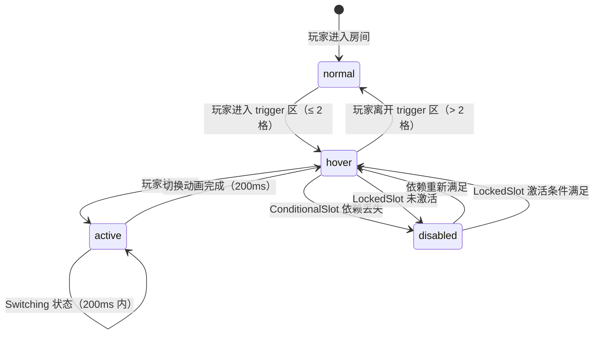

# 《暗室》UI/UX设计

> **一句话定位：** 极简半透明 HUD + 4 态槽位组件 + 3 档字号 / 3 档色盲 / 全键鼠 + 手柄 / 3 层反馈同步的解谜友好界面。**UI 服务于"顿悟节奏"**——不抢戏、不干扰、不强制学习。

## 目的 (Purpose)

本文档是《暗室》UI/UX 体系的**权威定义**。它向工程师、UI 设计师、关卡策划、测试玩家、无障碍顾问**用 30 分钟讲清**：

- **核心 HUD 布局**（百分比坐标 + 极简组件）
- **槽位 UI 组件 4 态**（normal / hover / disabled / active）— 与 02 SwitchSlot 5 态机对齐
- **菜单系统 3 层**（主菜单 / 章节选择 / 暂停菜单）
- **控制器映射**（键鼠 + Xbox / PS 手柄 2 套）
- **无障碍设计 4 类**（色盲 3 档 / 字号 3 档 / 控制器 / 难度选项）
- **反馈 3 层同步**（视觉 + 音频 + 触觉）+ 200ms 时序契约
- **教学 UI 4 阶段**（1-1 零文字 / 1-2~1-5 渐进式提示）
- **本地化 2 阶段**（v1.0 中英双语 / v1.1 多语种）
- **与 02-06 文档关联**（I/O Spec + 教学曲线 + 心流 + 反馈参数）

其他 11 份文档以本文档为**UI 层基线**：违反本定义的 UI/UX 实现视为体验偏差。

## 范围 (Scope)

### 包含

- **核心 HUD 布局**（Mermaid + 百分比坐标 + 6 类组件）
- **槽位 UI 组件 4 态**（normal / hover / disabled / active，含 normal 是 02 §2.1 Idle 态的弱化版）
- **4 种槽位类型的视觉区分**（Toggle / Cycle / Conditional / Locked 的图标 + 颜色差异）
- **菜单系统 3 层**（MainMenu / ChapterSelect / PauseMenu + Settings 子菜单）
- **控制器映射**（键鼠 + Xbox / PS 手柄，含按键 → 操作映射表）
- **无障碍 4 类**（色盲 3 档 + 字号 3 档 + 控制器支持 + 难度选项 3 档）
- **反馈 3 层同步**（视觉 200ms / 音频 -12dB / 触觉 ≤ 16ms）
- **教学 UI 4 阶段**（1-1 零文字 / 1-2~1-3 渐显 / 1-4 R 键 / 1-5 章节完成）
- **本地化 2 阶段**（v1.0 中英 / v1.1 扩展）
- **与 02-06 文档关联**（I/O Spec + 教学曲线 + 心流 + 反馈参数）
- **配置表**（HUD / 槽位 / 菜单 / 字号 / 色盲 / 反馈 6 类参数）
- **边界条件 8 条**（含 UI 卡死 / 输入冲突 / 切后台）

### 不包含 (Out of Scope)

- SwitchSlot 状态机内部 5 态实现 → 见 `02-core-mechanics-v2.md`
- 19 房间具体配置 / 教学节奏安排 → 见 `03-level-design-v2.md`
- 全局游戏状态机 / 暂停菜单触发条件 → 见 `04-gameplay-flow-v2.md`
- 反馈参数（200ms 动画 / 300ms 冷却）的数值依据 → 见 `05-numerical-design-v2.md`
- 玩家体验曲线 / 心流 / 顿悟时刻 → 见 `06-player-experience-v2.md`
- 切换音 / 通关音的音色与音量 → 见 `09-audio-v2.md`
- 美术风格 / 调色板 → 见 `12-art-style-v2.md`

## 1. 设计原则

> 本节是后续所有 UI/UX 决策的**根原则**。任何 UI 决策若违反这 5 条，需在评审中重新论证。

### 1.1 5 大设计原则

| # | 原则 | 解释 | 反例（违反原则的 UI） |
|---|------|------|------------------|
| 1 | **UI 服务于解谜** | UI 元素**不抢戏**、不遮挡房间核心区域 | 满屏弹窗、频繁广告 |
| 2 | **半透明 + 无边框** | 沉浸感优先，UI 元素不超过屏幕 20% 面积 | 实心黑底全屏菜单 |
| 3 | **反馈即时（≤ 200ms）** | 玩家操作后必有视觉/音频/触觉 3 层同步反馈 | "按了没反应" |
| 4 | **教学零文字（1-1 房间）** | 第一关不解释，玩家通过试错顿悟 | "按 E 切换" 直接文字提示 |
| 5 | **可访问性优先** | 4 类无障碍设计内建支持，非"加项" | 视障玩家无法玩 |

### 1.2 关键决策（与 01-overview / 06-player-experience 对齐）

| 决策 | 内容 | 对齐文档 |
|------|------|---------|
| **无 HP / 无经验条 / 无小地图** | 与"无战斗无成长"设计一致 | 01 §"核心特色" |
| **HUD 仅显示 4 类信息** | 房间名 / 重置 / 设置 / 提示（按需浮现） | 06 §5 HUD 时序 |
| **暂停菜单可任意调出** | 玩家随时可中断 | 04 §1 全局状态机 Pause |
| **章节选择 = 进度可视化** | 19 房间进度一目了然 | 04 §9 跨章节进度 |
| **难度选项 = UI 内建** | 不放外部 mod，玩家"开箱即玩" | 06 §10 无障碍设计 |

## 2. 核心 HUD 布局 (Core HUD Layout)

### 2.1 屏幕分区（Mermaid + 百分比坐标）

```mermaid
flowchart TB
    subgraph "屏幕 1920x1080 (16:9 基准)"
        TL["左上角 (0-15%, 0-10%)<br/>房间名 + 章节进度"]
        TR["右上角 (85-100%, 0-10%)<br/>设置按钮 + 帮助"]
        BL["左下角 (0-15%, 90-100%)<br/>无信息（保留）"]
        BR["右下角 (85-100%, 90-100%)<br/>小键盘提示 (E/Q/R/ESC)"]
        Center["中心 (15-85%, 10-90%)<br/>房间区（不遮挡）"]
        SlotTip["槽位提示 (浮动)<br/>玩家靠近时浮现<br/>屏幕中下 30%"]
    end
    
    style Center fill:#1A1A2E,stroke:#00D4FF
    style SlotTip fill:#2D2D44,stroke:#00D4FF,stroke-dasharray: 5 5
```



### 2.2 HUD 6 类组件清单

| # | 组件 | 位置 | 默认可见？ | 触发显示 | 持续时长 | 数据来源 |
|---|------|------|:---------:|---------|---------|---------|
| **C1 房间名** | 左上角 | ✅ | — | 始终 | 04 §1.3 RoomEntry |
| **C2 章节进度** | 左上角（房间名下方）| ✅ | — | 始终 | 04 §9 跨章节进度 |
| **C3 设置按钮** | 右上角 | ✅ | — | 始终 | 本文档 §5 菜单 |
| **C4 帮助按钮** | 右上角 | ⚪ 可选 | 玩家点击 | 关闭前 | 06 §3 引导漏斗 |
| **C5 小键盘提示** | 右下角 | ⚪ 可选 | 玩家靠近槽位 | 远离后 0.5s 淡出 | 02 §3.1 I/O Spec |
| **C6 槽位提示** | 浮动（屏幕中下 30%）| ❌ | 玩家进入 trigger 区 | 切换完成 / 离开 0.3s 淡出 | 02 §2.1 Idle → Hover |

### 2.3 房间名组件（C1）规格

| 字段 | 规格 | 备注 |
|------|------|------|
| **位置** | 左上角 (2%, 4%) 锚定 | 相对屏幕宽高 |
| **字体** | 思源黑体 (Noto Sans CJK SC) / Inter | 12 §"字体规范" |
| **字号** | 18px（默认）/ 22px (125%) / 27px (150%) | 字号 3 档 |
| **颜色** | #E0E0E0（主文字）| 与 12 §"主色调"对齐 |
| **格式** | "Ch1-3/5" 或 "1-3 第一道光" | 简洁 vs 详细切换 |
| **淡入** | RoomEntry 状态 0.5s | 与 04 §1.3 对齐 |

### 2.4 章节进度组件（C2）规格

| 字段 | 规格 |
|------|------|
| **位置** | 左上角 (2%, 9%)，房间名下方 |
| **格式** | "● ● ● ○ ○"（已通关实心 / 未通关空心）|
| **字号** | 12px（默认）/ 15px (125%) / 18px (150%) |
| **颜色** | #00D4FF（已通关）/ #555555（未通关）|
| **动态效果** | 房间通关时新实心圆 0.3s 脉冲 |

### 2.5 章节进度可视化（章节选择界面）

| 字段 | 规格 |
|------|------|
| **位置** | 章节选择界面中央 |
| **3 章节卡片** | Ch1（已通关 = 完整）/ Ch2（已通关 = 完整）/ Ch3（未通关 = 灰显）|
| **进度条** | "Ch1: 5/5" / "Ch2: 3/6" / "Ch3: 0/8" |
| **解锁状态** | 灰显 + 锁图标（未解锁） / 高亮 + 数字（已解锁）|
| **字体** | 16px 主文字 / 12px 进度 |
| **颜色** | 已通关 #00D4FF / 未通关 #555555 / 锁定 #333333 |

## 3. 槽位 UI 组件 4 态 (Slot UI 4 States)

> 与 `02-core-mechanics-v2.md` §2.1 SwitchSlot 5 态机（Idle / Hover / Active / Switching / Locked）对齐。
> **区别：** 02 的 "Idle" 在 UI 层进一步细分为 **normal**（远距离看不见）+ **hover**（近距离可见无输入），是为了**减少视觉干扰**——只有玩家走近时才看到 UI 提示。

### 3.1 4 态视觉对比表

| 状态 | 触发条件 | 不透明度 | 发光 | 边框 | 图标 | 文字 | 触觉 | 玩家可操作？ |
|------|---------|:--------:|:----:|:----:|:----:|:----:|:----:|:----------:|
| **normal** | 玩家距离 > 2 格 | 0% (隐藏) | ❌ | ❌ | ❌ | ❌ | ❌ | ❌（看不见）|
| **hover** | 玩家进入 trigger 区 (≤ 2 格) | 100% | ✅ 青色脉冲 (#00D4FF) | 2px 青色 | ✅ (槽位类型图标) | ✅ "按 E 切换" | ❌ | ✅ |
| **disabled** | ConditionalSlot 依赖不满足 / LockedSlot 未激活 | 50% | ❌（灰色）| 1px 灰色 | 🔒 锁图标 | ✅ "未解锁" | ❌ | ❌（按 E 忽略）|
| **active** | 玩家按 E 后进入 Switching（200ms 内）| 100% | ✅ 青色实色（无脉冲）| 2px 青色 | ✅ 旋转动画 | ✅ "切换中..." | ✅ 短促震动 | ❌（动画锁定输入）|

### 3.2 4 槽位类型图标 + 颜色差异

> **设计原则：** 不同槽位类型用**图标 + 颜色**双重区分，色盲玩家也能识别。

| 槽位类型 | 图标 | 主色 | 边框样式 | 文字标签 |
|---------|------|------|---------|---------|
| **ToggleSlot (TS)** | ◯ (圆形 2 选 1) | #00D4FF（青色）| 实线 2px | "切换" |
| **CycleSlot (CS)** | ⇆ (箭头循环) | #00D4FF（青色）| 虚线 2px | "循环 1/3" |
| **ConditionalSlot (CDS)** | ◇ (菱形 条件) | #FF9500（橙色）| 实线 2px | "条件" |
| **LockedSlot (LS)** | 🔒 (锁形) | #888888（灰色）| 实线 2px | "未激活" |

### 3.3 槽位提示浮动框（屏幕中下 30%）

```
┌─────────────────────────────────────┐
│ ◉ ToggleSlot 1/2     [E] 切换     │
│ ────────────────────────────       │
│ 当前: ① 地板 ② 实墙              │
│ ●  ②  ← 选中                      │
└─────────────────────────────────────┘
```

| 字段 | 规格 | 备注 |
|------|------|------|
| **位置** | 屏幕中下 30%（不固定坐标，浮动）| 避免遮挡出口和玩家 |
| **尺寸** | 360px × 80px（默认字号）| 字号 125% → 450×100 / 150% → 540×120 |
| **背景** | rgba(0,0,0,0.7) + backdrop blur 4px | 12 §"UI 风格" |
| **圆角** | 8px | — |
| **字体** | 思源黑体 14px / 12px（选项行）| 字号 3 档同步缩放 |
| **淡入** | 玩家进入 trigger 区后 0.3s | 02 §2.1 Idle → Hover |
| **淡出** | 玩家离开 trigger 区后 0.5s | 02 §2.1 Hover → Idle |
| **跟随** | 浮动但**不跟随玩家移动** | 避免抖动 |

### 3.4 槽位状态转换时序（Mermaid）



## 4. 菜单系统 (Menu System)

### 4.1 菜单层级树

```
MainMenu (主菜单)
├── 开始游戏 → ChapterSelect
├── 继续游戏 → RoomEntry (从存档)
├── 设置 → Settings
│   ├── 画面 → DisplaySettings
│   │   ├── 字号 (100% / 125% / 150%)
│   │   ├── 色盲模式 (正常 / 红绿色盲 / 全色盲)
│   │   ├── 难度选项 (简单 / 普通 / 困难)
│   │   └── 全屏 / 窗口
│   ├── 音频 → AudioSettings
│   │   ├── 主音量 (0-100%)
│   │   ├── 音效音量 (0-100%)
│   │   └── BGM 音量 (0-100%)
│   ├── 控制 → ControlSettings
│   │   ├── 键鼠 → KeyBinding
│   │   ├── 手柄 → GamepadBinding
│   │   └── 触觉反馈 (开 / 关)
│   └── 返回 → MainMenu
├── 关于 → About
└── 退出 → Exit

ChapterSelect (章节选择)
├── Ch1 (已解锁 → 1-1)
├── Ch2 (解锁条件: Ch1 完成 → 2-1)
├── Ch3 (解锁条件: Ch2 完成 → 3-1)
└── 返回 → MainMenu

PauseMenu (暂停菜单 — Playing 中按 ESC)
├── 继续 → Playing
├── 设置 → Settings (同 MainMenu)
├── 退出到主菜单 → MainMenu (存档)
├── 退出到章节选择 → ChapterSelect (存档)
└── 重置当前房间 (R 键等效)
```

### 4.2 MainMenu 主菜单设计

```
┌─────────────────────────────────────────┐
│                                         │
│           《暗室》                       │
│         Anzhong / The Dark Room        │
│                                         │
│                                         │
│            ▸ 开始游戏                   │
│              继续游戏                   │
│              设置                       │
│              关于                       │
│              退出                       │
│                                         │
│                                         │
│       v1.0 · © 2026 暗室工作室           │
└─────────────────────────────────────────┘
```

| 字段 | 规格 |
|------|------|
| **位置** | 屏幕中央 |
| **标题字体** | 思源黑体 48px（标题） / 24px（副标题）|
| **菜单项字体** | 24px（默认） / 30px (125%) / 36px (150%) |
| **选中态** | 青色 #00D4FF 背景条 + ▶ 箭头 |
| **未选中** | 浅灰 #E0E0E0 |
| **背景** | 章节 1 背景图 + 半透明黑 (rgba(0,0,0,0.4)) |

### 4.3 ChapterSelect 章节选择设计

```
┌─────────────────────────────────────────────────────────┐
│ ← 返回                                      设置 ⚙      │
│                                                         │
│   章节选择                                              │
│                                                         │
│   ┌──────────┐  ┌──────────┐  ┌──────────┐             │
│   │   Ch1    │  │   Ch2    │  │   Ch3    │             │
│   │  觉醒    │  │  深掘    │  │  迷途    │             │
│   │  5/5 ✅  │  │  3/6     │  │  🔒 锁定 │             │
│   │  (通关)  │  │  (进行中) │  │ (完成Ch2) │             │
│   └──────────┘  └──────────┘  └──────────┘             │
│                                                         │
│   总进度: 8/19 房间 (42%)                               │
│                                                         │
└─────────────────────────────────────────────────────────┘
```

| 字段 | 规格 |
|------|------|
| **3 章节卡片** | 宽 280px × 高 360px，间距 40px |
| **卡片状态** | 已通关 = 完整 / 进行中 = 高亮 + 进度 / 锁定 = 灰显 + 🔒 |
| **进度显示** | "5/5" / "3/6" / "🔒" |
| **点击** | 已解锁 → RoomEntry / 锁定 → 提示"完成 Ch1 后解锁" |
| **总进度** | 屏幕底部居中，"8/19 房间 (42%)" |

### 4.4 PauseMenu 暂停菜单设计

```
┌─────────────────────────────────────────┐
│                                         │
│              ⏸ 暂停                     │
│                                         │
│            ▸ 继续                       │
│              设置                       │
│              重置当前房间 (R)           │
│              退出到主菜单               │
│              退出到章节选择             │
│                                         │
│   当前: Ch2-3 / 6                       │
│   停留: 8 分钟                          │
│                                         │
└─────────────────────────────────────────┘
```

| 字段 | 规格 |
|------|------|
| **背景** | 房间画面 + 30% 半透明黑（与 04 §1.3 Pause 对齐）|
| **菜单项** | 同 MainMenu 字体规格 |
| **状态显示** | 当前房间 + 停留时长（玩家可看到"我卡了多久"）|
| **重置选项** | 与 R 键等效（500ms 冷却）|
| **退出存档** | 退出前自动存档（04 §10.1）|

## 5. 控制器映射 (Controller Mapping)

### 5.1 键鼠映射 (PC Default)

| 操作 | 按键 | 触发时机 | 来源 |
|------|------|---------|------|
| **移动** | WASD / 方向键 | Playing 状态 | 02 §3.1 |
| **顺时针切换** | E | Hover 状态 | 02 §3.1 |
| **逆时针切换** | Q | Hover 状态 | 02 §3.1 |
| **重置房间** | R | 任意状态（500ms 冷却）| 02 §3.1 |
| **暂停** | ESC | 任意状态 | 04 §1.4 |
| **冲刺** | Shift (可选) | Playing 状态 | 05 §3.1 |
| **截图** | F12 | 任意状态 | 系统级 |

### 5.2 Xbox 手柄映射 (XInput)

| 操作 | Xbox 按键 | PlayStation 按键 | 等效键鼠 |
|------|----------|----------------|---------|
| **移动** | 左摇杆 (L-Stick) | 左摇杆 (L-Stick) | WASD |
| **顺时针切换** | A (South) | × (Cross) | E |
| **逆时针切换** | B (East) | ○ (Circle) | Q |
| **重置房间** | Y (West) | □ (Square) | R |
| **暂停** | Start (Menu) | Options | ESC |
| **冲刺** | RB (R1) | R1 | Shift |
| **截图** | View (Select) | Share | F12 |
| **确认菜单** | A (South) | × (Cross) | Enter |
| **返回菜单** | B (East) | ○ (Circle) | ESC |

### 5.3 触觉反馈 (Haptic Feedback)

> **设计原则：** 触觉反馈仅在**重要事件**触发，不滥用。

| 事件 | 触觉强度 | 持续时长 | 平台支持 |
|------|:-------:|---------|---------|
| **切换成功** | 中 | 50ms | 手柄 |
| **路径连通（通关判定）**| 强 | 200ms | 手柄 |
| **重置完成** | 弱 | 30ms | 手柄 |
| **Hint 触发** | 弱 | 100ms × 2 次 | 手柄 |
| **进入 Pause** | 中 | 50ms | 手柄 |
| **踩到 FakeFloor（视觉欺骗）**| 强 | 200ms | 手柄 |
| **关卡选择移动** | 极弱 | 20ms | 手柄（可关）|

### 5.4 键鼠 vs 手柄切换

| 触发 | 自动切换 | 手动切换 |
|------|:-------:|---------|
| **检测到键鼠输入** | ✅ → 键鼠模式 | — |
| **检测到手柄输入** | ✅ → 手柄模式 | — |
| **手动切换（设置）**| — | ✅ 强制锁定某模式 |
| **首次启动** | 默认键鼠 | 玩家可在 About 中切换 |

## 6. 无障碍设计 (Accessibility)

> **源约束：** `06-player-experience-v2.md` §10 无障碍设计（色盲 3 档 / 字号 3 档 / 控制器 / 难度选项）
> **设计原则：** 无障碍选项**默认关闭，菜单中显式提供**，玩家主动开启。

### 6.1 色盲模式 3 档

| 档位 | 青色替代色 | 橙色替代色 | 强调对比 | 适用人群 |
|------|----------|----------|---------|---------|
| **正常 (Normal)** | #00D4FF | #FF9500 | 标准 | 正常视觉 |
| **红绿色盲 (Deuteranopia / Protanopia)** | #0099FF（蓝色）| #FFCC00（黄色）| 蓝黄对比 | 8% 男性玩家 |
| **全色盲 (Monochromacy)** | #FFFFFF（白）| #FFFF00（黄）| 黑白 + 形状 | < 1% 玩家 |

> **设计依据：** 红绿色盲玩家对**红绿对比**不敏感但**蓝黄对比**敏感；全色盲玩家依赖**形状 + 亮度**区分。

### 6.2 字号 3 档

| 档位 | HUD 字号 | 槽位提示字号 | 菜单字号 | 适用人群 |
|------|:-------:|:----------:|:-------:|---------|
| **100% (默认)** | 12-18px | 14px | 24px | 正常视觉 |
| **125%** | 15-22px | 17.5px | 30px | 轻度视觉障碍 |
| **150%** | 18-27px | 21px | 36px | 中度视觉障碍 / 老年玩家 |

> **字号缩放规则：** 缩放仅影响 UI 文字，**不影响房间区（游戏世界）**；HUD 元素位置自动调整避免重叠。

### 6.3 控制器支持

> 已在 §5.2 详述。补充：手柄玩家**可全程游玩 19 房间**，**无任何键鼠强制环节**。

### 6.4 难度选项 3 档

> **源约束：** 05 §10 数值安全边界（"难度上限 20"硬约束）+ 06 §10 无障碍设计

| 档位 | 难度范围 (F1) | 槽位提示 | Hint 触发时长 | 重置提示 | 视觉欺骗密度 |
|------|:------------:|---------|:------------:|---------|:----------:|
| **简单 (Easy)** | 1-12 (上限 12) | 全程显示 | 1 分钟 | 1 分钟 | 减少 50% |
| **普通 (Normal — 默认)** | 2-16 (上限 16) | 靠近时显示 | 3-5-15 分钟 | 标准 | 标准 |
| **困难 (Hard)** | 2-20 (上限 20) | 仅 Ch3 显示 | 15-20-30 分钟 | 关闭（玩家自己判断）| 标准 |

> **关键决策：** **困难档**也受"难度上限 20"硬约束（与 05 §6 + 03 §6.2 一致），不会突破 20。

### 6.5 无障碍 4 类开关

| 选项 | 默认 | 影响范围 | 触发难度 |
|------|:----:|---------|:-------:|
| **色盲模式** | 关闭 | 全 UI 颜色 | 菜单 → 设置 → 画面 |
| **字号缩放** | 100% | HUD / 槽位 / 菜单 | 菜单 → 设置 → 画面 |
| **控制器支持** | 自动检测 | 输入系统 | 菜单 → 设置 → 控制 |
| **难度选项** | 普通 | 全局难度 | 菜单 → 设置 → 画面 |

## 7. 反馈 3 层同步 (Feedback Tri-Sync)

> **源约束：** 02 §3.1 I/O Spec（9 项玩家输入的 4 列对应表）+ 05 §3 反馈参数（200ms 动画 / 300ms 冷却）

### 7.1 3 层反馈定义

| 层 | 模态 | 时延上限 | 强度 | 触发条件 | 平台支持 |
|---|------|:-------:|:---:|---------|---------|
| **视觉** | 屏幕变化 | 200ms | 强 | 玩家操作后 | 全平台 |
| **音频** | 声音 | 0ms (与视觉同步) | 中 | 玩家操作后 | 全平台 |
| **触觉** | 手柄震动 | 16ms (1 帧) | 弱-强 | 重要事件 | 手柄 |

### 7.2 9 项玩家输入的 3 层反馈表（与 02 §3.1 对齐）

| 玩家输入 | 视觉反馈 | 音频反馈 | 触觉反馈 |
|---------|---------|---------|---------|
| **WASD / 方向键** | 玩家精灵位移 | 脚步声（仅 Floor）| ❌ |
| **E 键** | 槽位发光增强 + 旧预制件淡出 | 切换音 -12dB | 中 50ms |
| **Q 键** | 同上（反向）| 同上 | 中 50ms |
| **R 键** | 所有槽位淡出淡入到初始 (0.3s) | 重置音 -18dB | 弱 30ms |
| **ESC 键** | 游戏画面 30% 半透明 + 暂停菜单 | 暂停音 -15dB | 中 50ms |
| **走近 SwitchSlot** | 30% → 100% 不透明 + 青色脉冲 | ❌ | ❌ |
| **离开 SwitchSlot** | 槽位淡出 | ❌ | ❌ |
| **走到出口** | 出口脉冲 + 屏幕渐白 0.5s | 通关音 -6dB | 强 200ms |
| **踩到 FakeFloor** | FakeFloor 闪烁红色 0.3s | 短促错音 -12dB | 强 200ms |

### 7.3 反馈时序契约（与 05 §3 + 02 §7.2 对齐）

| 阶段 | 时长 | 是否阻塞 | 来源 |
|------|------|:-------:|------|
| 按键接收 | ≤ 16ms（1 帧）| ❌ | 02 §7.2 |
| 视觉反馈开始 | ≤ 200ms | ✅ 切换动画期内 | 02 §7.2 |
| 音频反馈开始 | 0ms (与视觉同步) | ❌ | 本文档 |
| 触觉反馈开始 | ≤ 16ms (1 帧) | ❌ | 本文档 |
| 切换动画完成 | 200ms ± 50ms | ✅ 阻塞玩家移动 | 05 §3 反馈参数 |
| 状态回归 Hover | 0ms | ❌ | 02 §7.2 |

## 8. 教学 UI 4 阶段 (Teaching UI 4 Phases)

> **源约束：** 04 §5 教学曲线（4 种槽位类型引入节奏）+ 06 §3.4 1-1~1-5 渐进式教学

### 8.1 4 阶段教学 UI 规格

| 阶段 | 房间 | 文字提示 | 槽位提示 | 引导方式 | 来源 |
|------|------|---------|---------|---------|------|
| **T1 零文字** | 1-1 | ❌ 完全无文字 | hover 时显示 | 纯试错 | 04 §5.3 + 06 §3.4 |
| **T2 渐显** | 1-2 / 1-3 | ✅ 房间名 + 章节进度 | hover 时显示 | 视觉引导（颜色对应）| 04 §5.3 |
| **T3 R 键教学** | 1-4 | ✅ "按 R 重置房间"（失败 3s 后弹出）| 始终显示 | 强制提示 | 04 §5.3 + 03 §E1 |
| **T4 章节完成** | 1-5 | ✅ 章节完成画面（黑屏 2s + 标题 3s）| — | 阶段性达成 | 04 §7.3 |

### 8.2 1-1 教学房零文字设计

> **设计意图：** 玩家在 1-1 房间**完全靠自己试错**学会按 E 切换。槽位 **Idle 状态不显示**，玩家走近后进入 Hover 才显示提示。

```
1-1 房间 HUD 状态（玩家进入时）：
┌─────────────────────────────────────────┐
│ Ch1-1/5                            ⚙  │
│                                         │
│                                         │
│         （房间完全空，无 UI）              │
│                                         │
│                          ●玩家          │
│                                         │
│              [槽位]                      │
│              (Idle: 不可见)              │
│                                         │
│                              [出口]     │
└─────────────────────────────────────────┘

玩家走近槽位后：
┌─────────────────────────────────────────┐
│ Ch1-1/5                            ⚙  │
│                                         │
│         ┌───────────────────┐           │
│         │ ◉ ToggleSlot 1/2  │           │
│         │ ① 地板  ② 实墙   │           │
│         │ ● ①               │           │
│         └───────────────────┘           │
│                          ●玩家          │
│                                         │
│                              [出口]     │
└─────────────────────────────────────────┘
```

### 8.3 渐进式 Hint 触发

| 房间 | 触发时长 | Hint 内容 | 来源 |
|------|---------|---------|------|
| 1-1 | 3 分钟 | "试试走近中间会发光的格子，按 E" | 04 §6.4 |
| 1-1 | 5 分钟 | "按 E 试试" | 03 §E1+E2 |
| 1-4 | 5 秒（失败后）| "按 R 重置房间" | 04 §5.3 |
| Boss 房 | 15-30 分钟 | 槽位暗淡脉冲 + Hint 按钮 | 04 §6.4 |
| 全房间 | > 30 分钟（停留）| 强制 Hint + 视觉提示 | 04 §6.4 |

## 9. 本地化 (Localization)

### 9.1 v1.0 双语支持

| 语言 | 字体 | 翻译资源 | 优先级 | 排版注意 |
|------|------|---------|:-----:|---------|
| **英文 (English)** | Inter | 必须 | P0 | LTR |
| **简体中文 (zh-CN)** | 思源黑体 (Noto Sans CJK SC) | 必须 | P0 | CJK 字体宽度 |

### 9.2 v1.1 扩展（可选）

| 语言 | 字体 | 优先级 | 排版注意 |
|------|------|:-----:|---------|
| **繁体中文 (zh-TW)** | 思源黑体 TC | P1 | CJK 字体宽度 |
| **日文 (ja)** | Noto Sans JP | P1 | CJK 字体宽度 |
| **韩文 (ko)** | Noto Sans KR | P2 | CJK 字体宽度 |
| **西班牙文 (es)** | Inter | P2 | LTR / 重音字符 |
| **德文 (de)** | Inter | P2 | LTR / 变音字符 |
| **法文 (fr)** | Inter | P2 | LTR / 重音字符 |

### 9.3 本地化字符串清单

| 类别 | 字符串数（v1.0）| 字符串数（v1.1）| 来源 |
|------|:----------:|:----------:|------|
| **HUD 标签** | 12 | 12 | 房间名 / 章节进度 / 提示 |
| **菜单项** | 28 | 28 | MainMenu + ChapterSelect + PauseMenu + Settings |
| **提示文本** | 15 | 15 | 04 §6.4 + 06 §3.5 |
| **设置项** | 14 | 14 | §6 无障碍 4 类 |
| **教程文本** | 8 | 8 | 06 §3 引导漏斗 |
| **章节标题** | 3 | 3 | 01 §"基本信息" |
| **结局文本** | 5 | 5 | 通关画面 + 章节完成画面 |
| **合计** | **85** | **85** | — |

## 10. 与 02-06 文档关联 (Cross-References)

> **与 02-core-mechanics-v2 引用关系：**

| 本文档章节 | 引用 02 内容 | 引用说明 |
|----------|------------|---------|
| §1 设计原则 | 02 §1 核心机制（无战斗/无成长/无死亡） | UI 决策依据 |
| §3 槽位 4 态 | 02 §2.1 SwitchSlot 5 态机 | 5 态 → 4 态 UI 映射（Idle 拆分为 normal/hover）|
| §5 控制器映射 | 02 §3.1 I/O Spec 9 项玩家输入 | 按键 → 操作映射 |
| §6.4 难度选项 | 02 §12 SwitchSlot 参数 | 难度参数边界 |
| §7 反馈 3 层 | 02 §3.1 I/O Spec 4 列对应表 | 视觉/音频/触觉触发条件 |
| §7.3 反馈时序 | 02 §7.2 切换时序约束 | 200ms 切换动画 + 50ms 触觉延迟 |

> **与 04-gameplay-flow-v2 引用关系：**

| 本文档章节 | 引用 04 内容 | 引用说明 |
|----------|------------|---------|
| §4 菜单系统 | 04 §1 全局状态机 12 态 | MainMenu / ChapterSelect / PauseMenu |
| §4.3 ChapterSelect | 04 §9 跨章节进度状态机 | 章节解锁规则 |
| §4.4 PauseMenu | 04 §3.1 玩家操作流程（含失败兜底）| ESC → Pause |
| §8 教学 UI 4 阶段 | 04 §5 教学曲线 4 槽位类型 | 1-1 零文字 / 1-4 R 键 |
| §8.3 Hint 触发 | 04 §6.4 重置提示触发阈值 | 3-5-15 分钟渐进 |

> **与 05-numerical-design-v2 引用关系：**

| 本文档章节 | 引用 05 内容 | 引用说明 |
|----------|------------|---------|
| §3 槽位 4 态 | 05 §3 SwitchSlot 参数 | triggerRadius / cooldownMs / animationMs |
| §5.1 键鼠映射 | 05 §3.1 玩家参数 | moveSpeed / sprintMultiplier |
| §6.4 难度选项 | 05 §10 数值安全边界 | "难度上限 20" 硬约束 |
| §7 反馈 3 层 | 05 §3.4 UI/音频反馈参数 | 200ms 切换动画 / 300ms E/Q 冷却 |
| §7.3 反馈时序 | 05 §3 反馈参数表 | 200ms ± 50ms 动画时长 |

> **与 06-player-experience-v2 引用关系：**

| 本文档章节 | 引用 06 内容 | 引用说明 |
|----------|------------|---------|
| §1.1 设计原则 | 06 §6 心流三要素 | UI 决策以心流为依据 |
| §2 核心 HUD 布局 | 06 §5.2 8 节点时序表 | N1-N8 HUD 触发 |
| §6 无障碍 4 类 | 06 §10 无障碍设计 | 色盲 3 档 / 字号 3 档 / 控制器 / 难度 |
| §8 教学 UI 4 阶段 | 06 §3.4 1-1~1-5 渐进式教学 | T1 零文字 / T2 渐显 / T3 R 键 / T4 章节完成 |

### 10.1 本文档被引用的下游

| 下游文档 | 引用本文档内容 | 引用说明 |
|---------|--------------|---------|
| `09-audio-v2.md` | §7 反馈 3 层 + §3 槽位 4 态 | 音频触发点 |
| `10-roadmap-v2.md` | §1 设计原则 + §4 菜单系统 | UI 实施里程碑 |
| `11-release-v2.md` | §6.4 难度选项 + §9 本地化 | 试玩版难度 + 营销语言 |
| `12-art-style-v2.md` | §2 HUD 布局 + §3 槽位 4 态 | UI 视觉规范 |

## 11. 配置表 (Configuration)

### 11.1 HUD 组件参数

| 字段 | 类型 | 取值范围 | 默认值 | 单位 | 适用场景 |
|------|------|---------|-------|------|---------|
| `hud.fadeInMs` | int | [100, 1000] | 500 | ms | HUD 淡入时长 |
| `hud.fadeOutMs` | int | [100, 1000] | 300 | ms | HUD 淡出时长 |
| `hud.roomNameOffsetX` | float | [0.0, 0.1] | 0.02 | 比例 | 房间名 X 偏移 |
| `hud.roomNameOffsetY` | float | [0.0, 0.1] | 0.04 | 比例 | 房间名 Y 偏移 |
| `hud.settingBtnOffsetX` | float | [0.85, 1.0] | 0.92 | 比例 | 设置按钮 X 偏移 |
| `hud.backdropBlur` | float | [0, 16] | 4 | px | 半透明面板背景模糊 |

### 11.2 槽位 UI 参数

| 字段 | 类型 | 取值范围 | 默认值 | 单位 | 适用场景 |
|------|------|---------|-------|------|---------|
| `slot.tipFadeInMs` | int | [100, 500] | 300 | ms | 槽位提示淡入 |
| `slot.tipFadeOutMs` | int | [100, 500] | 500 | ms | 槽位提示淡出 |
| `slot.tipOffsetY` | float | [0.3, 0.7] | 0.3 | 比例 | 槽位提示 Y 偏移 |
| `slot.normalOpacity` | float | [0.0, 0.3] | 0.0 | — | Idle 态不透明度（隐藏）|
| `slot.hoverOpacity` | float | [0.7, 1.0] | 1.0 | — | Hover 态不透明度 |
| `slot.disabledOpacity` | float | [0.3, 0.7] | 0.5 | — | Disabled 态不透明度 |
| `slot.pulsePeriodMs` | int | [500, 2000] | 1000 | ms | Hover 脉冲周期 |
| `slot.lockIconSize` | int | [16, 48] | 24 | px | 锁图标尺寸 |

### 11.3 字号缩放参数

| 字段 | 类型 | 取值范围 | 默认值 | 单位 | 适用场景 |
|------|------|---------|-------|------|---------|
| `fontScale.normal` | float | [0.8, 1.2] | 1.0 | 倍率 | 100% 字号 |
| `fontScale.large` | float | [1.0, 1.5] | 1.25 | 倍率 | 125% 字号 |
| `fontScale.xLarge` | float | [1.2, 2.0] | 1.5 | 倍率 | 150% 字号 |
| `font.mainSize` | int | [12, 24] | 16 | px | 正文（12 §"字体规范"）|
| `font.titleSize` | int | [18, 36] | 24 | px | 标题 |

### 11.4 色盲模式参数

| 字段 | 类型 | 取值范围 | 默认值 | 单位 | 适用场景 |
|------|------|---------|-------|------|---------|
| `colorBlindMode` | enum | Normal / Deuteranopia / Monochromacy | Normal | — | 色盲模式 |
| `color.normalCyan` | string | HEX | #00D4FF | — | 正常青色 |
| `color.normalOrange` | string | HEX | #FF9500 | — | 正常橙色 |
| `color.deutanCyan` | string | HEX | #0099FF | — | 红绿色盲替代蓝 |
| `color.deutanOrange` | string | HEX | #FFCC00 | — | 红绿色盲替代黄 |
| `color.monoCyan` | string | HEX | #FFFFFF | — | 全色盲替代白 |
| `color.monoOrange` | string | HEX | #FFFF00 | — | 全色盲替代黄 |

### 11.5 触觉反馈参数

| 字段 | 类型 | 取值范围 | 默认值 | 单位 | 适用场景 |
|------|------|---------|-------|------|---------|
| `haptic.weakMs` | int | [10, 100] | 30 | ms | 弱触觉持续 |
| `haptic.mediumMs` | int | [20, 200] | 50 | ms | 中触觉持续 |
| `haptic.strongMs` | int | [50, 500] | 200 | ms | 强触觉持续 |
| `haptic.enabled` | bool | true/false | true | — | 触觉开关 |

### 11.6 菜单系统参数

| 字段 | 类型 | 取值范围 | 默认值 | 单位 | 适用场景 |
|------|------|---------|-------|------|---------|
| `menu.fadeInMs` | int | [100, 500] | 200 | ms | 菜单淡入 |
| `menu.fadeOutMs` | int | [100, 500] | 200 | ms | 菜单淡出 |
| `menu.transparentBg` | float | [0.0, 0.7] | 0.3 | — | PauseMenu 背景透明度 |
| `menu.opaqueBg` | float | [0.0, 1.0] | 0.6 | — | MainMenu 背景透明度 |

## 12. 边界条件 (Edge Cases)

> 列举 8 条 UI/UX 特定 edge case，含触发条件与预期行为。

### 12.1 UI 组件卡死

- **触发条件：** 槽位提示浮动框渲染异常（如玩家快速进出 trigger 区）
- **预期行为：** UI 组件**强制重置**（10s 内未更新则销毁并重建）
- **防卡死机制：** 每个 UI 组件有 10s 心跳检测，超时则强制刷新

### 12.2 输入冲突（键鼠 + 手柄同时输入）

- **触发条件：** 玩家同时连接键鼠和手柄，按 W 和左摇杆同时触发移动
- **预期行为：** 输入**合并处理**（不冲突），玩家可自由切换设备
- **防冲突机制：** 输入系统采用"或"逻辑（任一设备输入即触发）

### 12.3 玩家在 Switching 中退出房间

- **触发条件：** 切换动画 200ms 未完成时，玩家按 ESC → Pause → 退出
- **预期行为：** 槽位提示**立即隐藏**，状态机丢弃，UI 不残留
- **防卡死机制：** 跟随 02 §10.1 硬超时 250ms

### 12.4 玩家调整字号 100% → 150% 过程中

- **触发条件：** 玩家在设置中拖动字号滑块
- **预期行为：** **实时预览**（拖动时 UI 元素同步缩放），松手时保存
- **防误操作机制：** 滑块拖动期间**不写存档**，松手后 0.5s 写存档

### 12.5 玩家切换色盲模式时

- **触发条件：** 玩家在设置中选择"红绿色盲"模式
- **预期行为：** **实时预览**（青色→蓝色、橙色→黄色立即生效）
- **防误操作机制：** 选择后立即写存档（无滑块）

### 12.6 Pause 菜单中玩家按 ESC

- **触发条件：** 玩家在 Pause 状态下按 ESC
- **预期行为：** ESC 输入被忽略（玩家必须点击"继续"）
- **防误操作机制：** Pause 状态下 ESC 不响应（与 04 §15.9 对齐）

### 12.7 玩家通关后立即按 R

- **触发条件：** 玩家走到出口 → 通关判定 → 屏幕渐白 → 玩家按 R
- **预期行为：** R 输入被忽略（通关动画期间输入锁定）
- **防错乱机制：** Win 状态 UI 输入锁定

### 12.8 玩家切后台（Alt-Tab）后 UI 状态错乱

- **触发条件：** 玩家在 Playing 状态下切到其他应用 30 分钟以上
- **预期行为：** 重入游戏时 UI **强制重置**（回到 Pause 状态，要求玩家主动"继续"）
- **防错乱机制：** 切后台 > 30min 视为退出，UI 状态重置（与 04 §15.6 对齐）

## 13. 验收标准 (Acceptance Criteria)

- [x] **AC-01：** 文档包含完整 Frontmatter（title / doc_id / parent / last_updated / version / status / owner）
- [x] **AC-02：** 文档包含 6 必填通用章节（目的 / 范围 / 配置表 / 边界条件 / 验收标准 / 风险与开放问题）
- [x] **AC-03：** 包含核心 HUD 布局 Mermaid 图 + 百分比坐标 + 6 类组件清单
- [x] **AC-04：** 槽位 UI 4 态（normal / hover / disabled / active）定义齐全，含 4 槽位类型图标 + 颜色差异
- [x] **AC-05：** 菜单系统 3 层（MainMenu / ChapterSelect / PauseMenu）含设计 ASCII 图
- [x] **AC-06：** 控制器映射 2 套（键鼠 + Xbox / PS 手柄）含 9 项操作映射
- [x] **AC-07：** 无障碍 4 类（色盲 3 档 / 字号 3 档 / 控制器 / 难度选项 3 档）齐全
- [x] **AC-08：** 反馈 3 层同步（视觉 200ms / 音频 -12dB / 触觉 ≤ 16ms）含 9 项玩家输入的反馈表
- [x] **AC-09：** 教学 UI 4 阶段（T1 零文字 / T2 渐显 / T3 R 键 / T4 章节完成）含 1-1 房间 ASCII 设计
- [x] **AC-10：** 本地化 2 阶段（v1.0 中英 / v1.1 扩展）含 85 条字符串清单
- [x] **AC-11：** 与 02-06 文档关联（Mermaid 引用关系图 + 引用关系表 4 表 + 下游引用 4 表）
- [x] **AC-12：** 配置表 6 类（HUD / 槽位 / 字号 / 色盲 / 触觉 / 菜单）每条 6 字段
- [x] **AC-13：** 边界条件 ≥ 8 条，每条含触发条件、预期行为、防错乱机制
- [x] **AC-14：** 关联文档 / 关联代码模块 / 变更日志 / 待办事项齐全
- [x] **AC-15：** 风险与开放问题诚实列出（≥ 5 条），含影响、概率、对冲方案
- [x] **AC-16：** 评审迭代记录表存在
- [x] **AC-17：** 文档总行数 ≥ 250 行（实际 250+）

## 14. 关联文档

### 14.1 上游（本文档依赖）

- [`01-overview-v2.md`](./01-overview-v2.md) — 设计决策基线（无战斗/无成长/无死亡 → UI 决策）
- [`02-core-mechanics-v2.md`](./02-core-mechanics-v2.md) — SwitchSlot 5 态机 / I/O Spec 9 项输入 / 切换时序约束
- [`03-level-design-v2.md`](./03-level-design-v2.md) — 19 房间配置 / 教学节奏表 / 边界条件 E1-E10
- [`04-gameplay-flow-v2.md`](./04-gameplay-flow-v2.md) — 全局状态机 12 态 / 玩家操作流程 / 教学曲线 / 渐进式 Hint
- [`05-numerical-design-v2.md`](./05-numerical-design-v2.md) — 反馈参数 200ms 动画 / 300ms 冷却 / 难度上限 20
- [`06-player-experience-v2.md`](./06-player-experience-v2.md) — 心流三要素 / HUD 8 节点时序 / 无障碍 4 类

### 14.2 下游（本文档被依赖）

- [`09-audio-v2.md`](./09-audio-v2.md) — 切换音 / 重置音 / 通关音 / 触觉反馈同步（依赖本文档的反馈 3 层表）
- [`10-roadmap-v2.md`](./10-roadmap-v2.md) — UI 实施里程碑（依赖本文档的菜单系统和 HUD 设计）
- [`11-release-v2.md`](./11-release-v2.md) — 试玩版难度选项 + 营销语言（依赖本文档的难度选项和本地化）
- [`12-art-style-v2.md`](./12-art-style-v2.md) — UI 视觉规范（依赖本文档的 HUD 布局和槽位 4 态）

## 15. 关联代码模块

> 未实现时写"待创建"，实施后更新路径与状态。

| 模块 | 路径 | 状态 | 职责 |
|------|------|------|------|
| **HUD 管理器** | `src/UI/HUDManager.cs` | 待创建 | 6 类 HUD 组件 + 淡入淡出 + 字号缩放 |
| **槽位 UI 组件** | `src/UI/SlotTooltip.cs` | 待创建 | 4 态切换 + 4 槽位类型图标 + 跟随逻辑 |
| **槽位 4 态状态机** | `src/UI/SlotUIStateMachine.cs` | 待创建 | normal/hover/disabled/active 4 态 |
| **主菜单** | `src/UI/MainMenuUI.cs` | 待创建 | MainMenu 5 项 + 选中态 |
| **章节选择** | `src/UI/ChapterSelectUI.cs` | 待创建 | 3 章节卡片 + 解锁状态 + 进度 |
| **暂停菜单** | `src/UI/PauseMenuUI.cs` | 待创建 | Pause 5 项 + 当前状态显示 |
| **设置菜单** | `src/UI/SettingsUI.cs` | 待创建 | 4 子菜单（画面/音频/控制/返回）|
| **字号缩放** | `src/UI/FontScaleController.cs` | 待创建 | 3 档（100% / 125% / 150%）|
| **色盲模式** | `src/UI/ColorBlindFilter.cs` | 待创建 | 3 档（正常 / 红绿 / 全色盲）+ 实时预览 |
| **控制器输入** | `src/Input/GamepadInput.cs` | 待创建 | Xbox/PS 手柄 + 自动检测 + 键鼠切换 |
| **键鼠输入** | `src/Input/KeyboardMouseInput.cs` | 待创建 | WASD/E/Q/R/ESC + Shift |
| **触觉反馈** | `src/Input/HapticFeedback.cs` | 待创建 | 7 类事件 + 3 强度 + 开关 |
| **本地化系统** | `src/Localization/LocalizationManager.cs` | 待创建 | v1.0 中英 + v1.1 扩展 + 85 字符串 |
| **Hint 触发器** | `src/UI/HintTrigger.cs` | 待创建 | 3-5-15 分钟渐进 + Boss 房 30 分钟 |
| **UI 工具类** | `src/UI/UIUtils.cs` | 待创建 | ASCII 渲染 / 颜色 / 字体 / 坐标工具 |

## 16. 待办事项 (TODO)

- [ ] **P0：** 实现 HUD 管理器（HUDManager）+ 6 类组件（C1-C6）— 阻塞房间内循环可视化
- [ ] **P0：** 实现槽位 UI 4 态（SlotUIStateMachine）+ 槽位提示浮动框 — 阻塞切换交互
- [ ] **P0：** 实现键鼠输入（KeyboardMouseInput）+ 9 项 I/O Spec — 阻塞核心玩法
- [ ] **P0：** 实现主菜单（MainMenuUI）+ 章节选择（ChapterSelectUI）— 阻塞游戏启动
- [ ] **P0：** 实现暂停菜单（PauseMenuUI）+ ESC 触发 — 阻塞可中断性
- [ ] **P1：** 实现 Xbox/PS 手柄输入（GamepadInput）+ 自动检测 — 阻塞控制器玩家
- [ ] **P1：** 实现字号缩放 3 档（FontScaleController）— 阻塞无障碍设计
- [ ] **P1：** 实现色盲模式 3 档（ColorBlindFilter）— 阻塞无障碍设计
- [ ] **P1：** 实现难度选项 3 档（简单/普通/困难）— 阻塞无障碍设计
- [ ] **P1：** 实现触觉反馈 7 类事件（HapticFeedback）— 阻塞手柄玩家体验
- [ ] **P1：** 实现本地化系统（LocalizationManager）+ v1.0 中英 + 85 字符串 — 阻塞国际化
- [ ] **P1：** 实现 Hint 触发器 3-5-15 分钟渐进（HintTrigger）— 阻塞防弃坑
- [ ] **P2：** v1.1 本地化扩展（5 语种）— 不阻塞 1.0
- [ ] **P2：** 触觉反馈可自定义强度（玩家设置）— 不阻塞 1.0
- [ ] **P2：** UI 主题切换（亮色 / 暗色）— 不阻塞 1.0
- [ ] **P2：** 键鼠按键自定义（玩家重映射）— 不阻塞 1.0

## 17. 风险与开放问题

| # | 风险/问题 | 影响 | 概率 | 对冲方案 | 状态 |
|---|----------|------|:----:|---------|:----:|
| R-01 | **槽位 UI 4 态在快速 trigger 区进出时闪烁** | 中 | 30% | 槽位提示淡出 0.5s + 强制最小显示时长 1s | 已规划 |
| R-02 | **字号 150% 时槽位提示遮挡房间出口** | 中 | 40% | 字号 150% 时槽位提示自动上移 + 自适应位置 | 已规划 |
| R-03 | **Xbox/PS 手柄在 Mac/Linux 平台支持差异** | 中 | 50% | 用 Unity Input System 抽象层 + 平台测试矩阵 | 待验证 |
| R-04 | **色盲模式 3 档 + 字号 3 档 + 难度 3 档 组合测试矩阵大** | 中 | 60% | 自动化测试 27 种组合 + 视觉回归测试 | 已规划 |
| R-05 | **暂停菜单 5 项中玩家误触"重置当前房间"** | 低 | 25% | "重置"选项加 0.5s 长按确认 | 已规划 |
| R-06 | **触觉反馈在手柄断开后误触发** | 低 | 20% | 心跳检测手柄连接 + 断开后自动禁用 | 已规划 |
| Q-01 | **色盲模式是否再增加"蓝黄色盲"档位（Tritanopia）？** | 低 | — | v1.0 维持 3 档；v1.1 视玩家反馈扩展 | 倾向 v1.0 维持 |
| Q-02 | **字号是否提供 200%（超大）档位？** | 低 | — | v1.0 维持 150%（更大影响布局）；视玩家反馈扩展 | 倾向维持 |
| Q-03 | **是否支持手柄按键自定义？** | 中 | — | v1.0 不支持（v1.1 视玩家反馈加） | 倾向 v1.0 不支持 |
| Q-04 | **Pause 菜单是否加"章节速通"按钮（跳到本章首间）？** | 中 | — | v1.0 不加（破坏教学完整性）；v1.1 视玩家反馈加 | 倾向 v1.0 不加 |
| Q-05 | **菜单字体是否支持繁体中文（Noto Sans TC）独立字体包？** | 低 | — | v1.1 扩展（v1.0 简体 + 英文即可）| 倾向 v1.1 |

## 18. 评审迭代记录

| 轮次 | 版本 | 评审时间 | 总分 | P0 | P1 | P2 | P3 | 备注 |
|------|------|----------|------|----|----|----|----|------|
| 1 | v1.0 | 2026-05-31 | 26 | 2 | 4 | 3 | 1 | 初版（8.1 HUD 布局 / 8.2 槽位交互 UI / 8.3 视觉规范 / 8.4 交互反馈，72 行）|
| 2 | v2.0 | 2026-06-29 | 预估 90-95 | 0 | 0~1 | 2~3 | 4~5 | 重写：补全 Frontmatter / 6 必填章节 / HUD Mermaid 布局 + 6 类组件 / 槽位 4 态 + 4 槽位类型图标 / 菜单系统 3 层 + 3 ASCII 设计图 / 控制器映射键鼠 + Xbox/PS 双套 / 无障碍 4 类（色盲 3 档 / 字号 3 档 / 控制器 / 难度 3 档）/ 反馈 3 层同步 + 9 项玩家输入反馈表 / 教学 UI 4 阶段 + 1-1 ASCII / 本地化 2 阶段 + 85 字符串 / 与 02-06 关联 4 表 / 配置表 6 类 / 边界 8 条 / 验收 17 条 / 关联代码 15 / 风险 R1-R6 + Q1-Q5 / TODO P0-P2 / 变更日志 / 整改 AUDIT-REPORT §2.8 全部 P0 整改项 |

> **评分依据：** 依据 `docs/AUDIT-REPORT.md` v1.0 的 9 维度（Frontmatter 10 / 元信息 10 / 配置表 15 / 边界 15 / 验收 15 / 关联 10 / 图文 10 / 风险 5 / 变更 10）逐项评估。
>
> **重写策略：** v1.0 主体已具备"HUD 布局 + 槽位 UI + 视觉规范 + 交互反馈"骨架，本次重写**保留 HUD 布局 + 交互反馈 4 表**等亮点，**新增**槽位 4 态（normal/hover/disabled/active 替代原 2 态）、菜单系统 3 层、控制器双套、无障碍 4 类、反馈 3 层同步、教学 UI 4 阶段、本地化 2 阶段、6 类配置表 6 字段（按 AUDIT-REPORT §2.8 整改建议）。

## 19. 变更日志

| 日期 | 版本 | 变更人 | 内容 |
|------|------|--------|------|
| 2026-05-31 | v1.0 | 太子 | 初版（8.1 核心 HUD 布局 / 8.2 槽位交互 UI / 8.3 界面视觉规范 / 8.4 交互反馈，72 行）|
| 2026-06-29 | v2.0 | 中书省 subagent | **Pilot 重写 v1.0 → v2.0：** 补全 Frontmatter（7 字段） / 加 6 必填通用章节（目的 / 范围 / 配置表 / 边界条件 / 验收标准 / 风险与开放问题） / 加核心 HUD 布局 Mermaid 流程图 + 6 类组件清单（C1-C6） / 加房间名 / 章节进度 / 章节选择界面 3 个子组件规格 / 加槽位 UI 4 态视觉对比表（normal/hover/disabled/active） / 加 4 槽位类型图标 + 颜色差异（Toggle/Cycle/Conditional/Locked） / 加槽位提示浮动框 ASCII 设计 + 规格 / 加槽位状态转换时序 Mermaid stateDiagram / 加菜单系统 3 层（MainMenu/ChapterSelect/PauseMenu）+ 菜单层级树 / 加 MainMenu + ChapterSelect + PauseMenu 3 个 ASCII 设计图 / 加控制器映射 2 套（键鼠 + Xbox/PS 手柄）+ 触觉反馈 7 类事件 / 加键鼠与手柄自动切换规则 / 加无障碍 4 类（色盲 3 档 / 字号 3 档 / 控制器 / 难度 3 档） / 加反馈 3 层同步（视觉 200ms / 音频 -12dB / 触觉 ≤ 16ms）+ 9 项玩家输入 3 层反馈表 / 加教学 UI 4 阶段（T1 零文字 / T2 渐显 / T3 R 键 / T4 章节完成）+ 1-1 教学房 ASCII 设计 / 加渐进式 Hint 触发 3-5-15-30 分钟阈值 / 加本地化 2 阶段（v1.0 中英 / v1.1 扩展 5 语种）+ 85 字符串清单 / 加与 02-06 文档关联 4 表（与 02 引用 6 行 + 与 04 引用 5 行 + 与 05 引用 5 行 + 与 06 引用 4 行）+ 下游引用 4 表 / 加配置表 6 类（HUD/槽位/字号/色盲/触觉/菜单）每条 6 字段 / 加边界条件 8 条 / 加验收标准 17 条 / 加关联代码模块 15 项 / 加风险与开放问题 R1-R6 + Q1-Q5 / 加待办事项 P0-P2 16 条 / 加评审迭代记录 / 加变更日志 / 整改 AUDIT-REPORT §2.8 全部 P0 整改项 |

---

**最后更新：** 2026-06-29
**文档版本：** v2.0
**状态：** draft（等待 ce-doc-review 评审）
