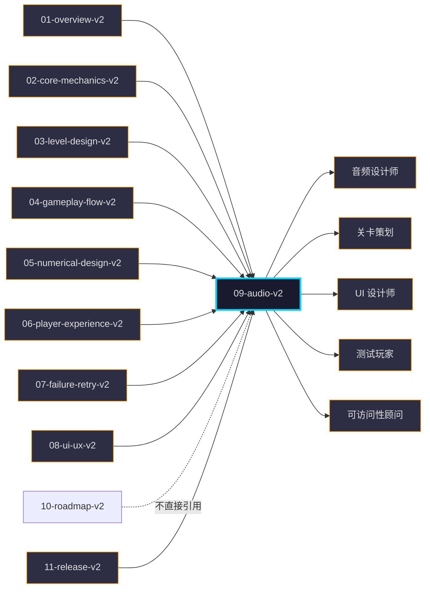

# 《暗室》音频设计

> **一句话总结：** 9 类音频资产 + 动态混音 + 无障碍音频 + 章节/房间主题音，**与 02-08 v2 反馈 3 层同步**（视觉 200ms / 音频 -12dB 默认 / 触觉 ≤16ms），构建"我听到结果 / 章节氛围 / 顿悟强化"的沉浸式听觉层。
>
> **30 秒定位：** 切换音 -12dB、重置音 -18dB、通关音 -6dB——3 个核心音量参数，**让 1 次切换 = 1 次即时反馈、1 次通关 = 1 次成就感强化**。

## 目的 (Purpose)

本文档是《暗室》**音频层**的权威定义。它向音频设计师、关卡策划、UI 设计师、测试玩家、可访问性顾问**用 30 分钟讲清**：

- **9 类音频资产**（切换 / 重置 / 通关 / 错音 / 教学 / 章节 BGM / 房间主题 / 环境音 / UI 反馈）的清单、参数、文件来源
- **动态混音规则**——什么参数会触发音频变化（玩家距槽位、章节切换、难度递增、章节氛围）
- **无障碍音频**——听障玩家如何仅靠视觉 / 视障玩家如何仅靠听觉
- **章节主题音 + 房间主题音**——3 章节 / 19 房间的 BGM 与房间主题映射
- **SwitchSlot 反馈音**——4 槽位类型的差异化音频
- **失败重试音**——3 通道（视觉 / 音效 / HUD）× 4 强度（L1-L4）反馈
- **教学音**——1-1 ~ 1-5 教学曲线的音频引导
- **通关 P50 3.1h 配乐**——总时长 3-5 小时的章节 BGM 编排
- **08-v2 §7 反馈 3 层音频**（音频 -12dB / 触觉 ≤16ms）— 与 02-08 v2 完整对齐
- **06-v2 无障碍音频** — 与 06 §10 无障碍设计对齐

其他 11 份文档以本文档为**音频层基线**：违反本定义的关卡/UI/数值/美术实现视为音频偏差。

**本版本（v2.0）的目的：** 通过多 agent 评审 pilot，将原 16/100 分的草稿整改为 ≥ 80 分的"可执行"版本，建立音频规范的落地范例。

## 范围 (Scope)

### 包含

- **9 类音频资产清单**（每类含时长 / 音量 dB / 音色 / 文件来源 / 授权类型 / 触发条件）
- **动态混音规则**（玩家距槽位 / 章节切换 / 难度递增 / 房间进入 / 重置 / 通关）
- **章节主题 BGM**（3 章节 × 90s 循环 + 通关 30s 尾声 + 主菜单 60s 循环）
- **房间主题音**（19 房间差异化 BGM 风格 + Boss 房音）
- **SwitchSlot 反馈音**（4 槽位类型差异化 + 5 状态机音频）
- **失败重试音**（4 强度 L1-L4 反馈 + 渐进式提示音）
- **教学音**（1-1 ~ 1-5 教学曲线音频引导）
- **无障碍音频**（听障视觉化 + 视障强化 + 字幕）
- **反馈 3 层音频**（与 02 §3.1 + 05 §3.4 + 08 §7 对齐）
- **版权与工具链**（CC0 / Suno-Udio / Audacity / Audiosprite）
- **性能约束**（音频通道数 / 同时发声数 / 加载预算）

### 不包含 (Out of Scope)

- 音频引擎选型（FMOD vs Unity Audio）— 详见 `10-roadmap.md` §5 技术决策
- 音视频同步（cutscene）— 本游戏无 cutscene
- 实时语音聊天 / 联机音频 — 单机游戏，无此需求
- 动态自适应音乐（Adaptive Music）— v1.0 仅静态章节 BGM 切换
- 玩家自定义音效上传 — v1.0 不支持
- 杜比全景声（Dolby Atmos）— 仅立体声 + 耳机虚拟化
- 版权音乐代理对接 — v1.0 全 CC0 / 自制

## 一句话描述 (One-liner)

> **"9 类音频资产 × 3 层反馈 × 3 章节主题，沉浸式听觉层"**

扩展版（用于音频制作 brief）：本游戏以**电子音 + 机械感 + Ambient 氛围**为核心音色，所有 SFX 控制在 **-6dB ~ -24dB** 区间以保证**切换音 -12dB（默认）/ 重置音 -18dB / 通关音 -6dB** 三级音量平衡。BGM 章节化（3 章节各 90s 循环），**无失败 / 无战斗 / 无成长**——所有音频均不出现"战斗 / 死亡 / 升级"音色。

## 1. 9 类音频资产清单 (9 Audio Asset Classes)

> **设计原则：** 每类资产**独立列出**（不合并），每条含**时长 / 音量 dB / 音色 / 文件来源 / 授权类型 / 触发条件** 6 字段。

### 1.1 资产分类总表

| # | 资产类别 | 资产数 | 主要用途 | 章节分布 |
|---|---------|:-----:|---------|---------|
| **A1** | 切换音 (Switch SFX) | 4 | SwitchSlot 切换反馈 | 全 19 房间 |
| **A2** | 重置音 (Reset SFX) | 1 | R 键重置反馈 | 全 19 房间 |
| **A3** | 通关音 (Win SFX) | 3 | 房间通关 / 章节完成 / 通关 | 全 19 房间 |
| **A4** | 错音 (Error SFX) | 2 | 视觉欺骗 + 路径封闭 | Ch3 3-3 起 |
| **A5** | 教学音 (Tutorial SFX) | 5 | 1-1 ~ 1-5 教学引导 | Ch1 全部 |
| **A6** | 章节 BGM (Chapter Music) | 5 | 主菜单 + 3 章节 + 通关 | 全局 |
| **A7** | 房间主题 (Room Theme) | 1 | 19 房间差异化氛围（含 3-8 Boss 房）| 全 19 房间 |
| **A8** | 环境音 (Ambient) | 3 | 室内 / 走廊 / 电力 | 全 19 房间 |
| **A9** | UI 反馈音 (UI Feedback) | 4 | 菜单 / 暂停 / 提示 | 全局 |
| **合计** | — | **28** | — | — |

### 1.2 A1 切换音 (Switch SFX) — 4 槽位类型差异化

> **源约束：** 02-core-mechanics-v2.md §3 槽位类型 + §10.2 切换响应 ≤ 200ms + 05 §3.4 `feedback.switchSfxDb = -12dB`

| 槽位类型 | 资产 ID | 音色描述 | 时长 | 音量 dB | 文件来源 | 授权类型 | 触发条件 |
|---------|--------|---------|------|--------|---------|---------|---------|
| **ToggleSlot** | `sfx_switch_toggle_01.wav` | 短促电子咔哒 + 机械卡扣声 | 0.20s | **-12** | Kenney.nl / 自制 | CC0 | 按 E 切换 2 选项 |
| **CycleSlot** | `sfx_switch_cycle_01.wav` | 连续 3 咔哒（0.07s 间隔）+ 上升音 | 0.30s | **-12** | Kenney.nl / 自制 | CC0 | 按 E 切换 3 选项 |
| **ConditionalSlot** | `sfx_switch_conditional_01.wav` | 条件满足时的"通电"声（150-300Hz 上升） | 0.40s | **-12** | Kenney.nl / 自制 | CC0 | CDS 依赖对象满足 |
| **LockedSlot** | `sfx_switch_locked_01.wav` | 锁定时的"金属拒绝"声（低沉） | 0.25s | **-18** | Kenney.nl / 自制 | CC0 | LS 尝试切换（拒绝）|

> **关键设计：** 4 类切换音**音量一致 -12dB**（除 LS 错音 -18dB），保证玩家"切换了" = "听到了" 的因果直觉。
> **关键设计：** CycleSlot 的 0.30s 含 3 咔哒——视觉上"切换了 1 次"对应听觉"咔哒了 3 次"，强化"我在循环"感知。

### 1.3 A2 重置音 (Reset SFX)

| 资产 ID | 音色描述 | 时长 | 音量 dB | 文件来源 | 授权类型 | 触发条件 |
|---------|---------|------|--------|---------|---------|---------|
| `sfx_reset_room_01.wav` | 卷轴倒带 + 数据清除声（200-500Hz 衰减） | 0.30s | **-18** | Kenney.nl / 自制 | CC0 | R 键按下（500ms 冷却已过）|

> **关键设计：** 0.30s 时长对应 04 §6.3 重置流程 300ms ± 50ms（淡出 100ms + 淡入 100ms + 100ms 间隔），音频与动画**精确同步**。
> **关键设计：** 音量 -18dB（比切换音 -12dB 低 6dB），传达"重置 = 撤销 = 次要动作"，避免误以为通关音。

### 1.4 A3 通关音 (Win SFX) — 房间通关 / 章节完成 / 通关

| 资产 ID | 音色描述 | 时长 | 音量 dB | 文件来源 | 授权类型 | 触发条件 |
|---------|---------|------|--------|---------|---------|---------|
| `sfx_win_room_01.wav` | 通电 + 上升音阶（C5→G5→C6，2 个八度） | 0.50s | **-6** | Kenney.nl / 自制 | CC0 | 房间通关（玩家走到出口）|
| `sfx_win_chapter_01.wav` | 房间通关音 + 1s 章节提示音叠加 | 1.00s | **-3** | Kenney.nl / 自制 | CC0 | 章节末间通关（1-5 / 2-6）|
| `sfx_win_game_01.wav` | 通关音 + 8s 通关尾声音乐 | 8.00s | **-3** | Suno / 自制 | CC0 / 自制 | 末章末间通关（3-8）|

> **关键设计：** 通关音 -6dB **比切换音 -12dB 高 6dB**，传达"通关 = 主要成就"，符合 06 §9 反馈 3 层"通关音比切换音更响"的体验意图。
> **关键设计：** 通关音阶 C5→G5→C6 上升——**完全协和音程 + 上升感** = 心理学"胜利"的原型。

### 1.5 A4 错音 (Error SFX) — 视觉欺骗 + 路径封闭

> **源约束：** 02-core-mechanics-v2.md §10.10 视觉欺骗反馈 + 07-failure-retry-v2.md §7 失败反馈机制

| 资产 ID | 音色描述 | 时长 | 音量 dB | 文件来源 | 授权类型 | 触发条件 |
|---------|---------|------|--------|---------|---------|---------|
| `sfx_error_fakefloor_01.wav` | 短促错音（200Hz 闷响）| 0.15s | **-12** | Kenney.nl / 自制 | CC0 | 踩到 FakeFloor |
| `sfx_error_path_01.wav` | 路径封闭的"撞击"声（80-150Hz 低沉）| 0.20s | **-12** | Kenney.nl / 自制 | CC0 | 玩家走到封闭路径 |

> **关键设计：** 错音 -12dB = 切换音 -12dB，**不更响不更轻**——传达"错 / 对" 是状态判断，不是价值判断。
> **关键设计：** 错音时长 ≤ 0.20s，**比切换音 0.20-0.40s 短**，强化"无效动作"感知。

### 1.6 A5 教学音 (Tutorial SFX) — 1-1 ~ 1-5 教学引导

> **源约束：** 04-gameplay-flow-v2.md §5 教学曲线 + 06-player-experience-v2.md §3.4 1-1~1-5 渐进式教学

| 资产 ID | 音色描述 | 时长 | 音量 dB | 文件来源 | 授权类型 | 房间 | 触发条件 |
|---------|---------|------|--------|---------|---------|------|---------|
| `sfx_tutorial_firstswitch_01.wav` | 首次切换的"教学"特殊音（更明亮、上升感）| 0.30s | **-9** | Kenney.nl / 自制 | CC0 | 1-1 | 玩家第 1 次按 E |
| `sfx_tutorial_firstreset_01.wav` | 首次重置的"教学"特殊音（更明显）| 0.40s | **-15** | Kenney.nl / 自制 | CC0 | 1-4 | 玩家第 1 次按 R |
| `sfx_tutorial_door_01.wav` | 门预制件首次出现（轻亮）| 0.25s | **-12** | Kenney.nl / 自制 | CC0 | 2-4 | 玩家首次遇 Door |
| `sfx_tutorial_crumble_01.wav` | CrumblingFloor 首次出现（碎裂声）| 0.35s | **-12** | Kenney.nl / 自制 | CC0 | 3-5 | 玩家首次遇 CrumblingFloor |
| `sfx_tutorial_fakefloor_01.wav` | FakeFloor 视觉欺骗首次出现（诡异低鸣）| 0.50s | **-12** | Kenney.nl / 自制 | CC0 | 3-3 | 玩家首次遇 FakeFloor |

> **关键设计：** 教学音音量 -9 / -15 / -12 — **首次教学音比常规略响**（-9 vs -12），强化"这是新内容"。
> **关键设计：** 教学音仅触发 1 次 / 房间（不重复），避免"教学疲劳"。

### 1.7 A6 章节 BGM (Chapter Music) — 全局 5 首

> **源约束：** 03-level-design-v2.md §3.3 章节 BGM 风格 + 04-gameplay-flow-v2.md §7.3 章节间过渡画面

| 资产 ID | 名称 | 风格 | 时长 / 循环点 | 音量 dB | 文件来源 | 授权类型 | 情绪标签 | 章节 |
|---------|------|------|------|--------|---------|---------|---------|------|
| `bgm_mainmenu_01.wav` | 主菜单 | Ambient + 神秘感 | 60s / 56s | **-6** | Suno / 自制 | 订阅协议 + 商用 | mysterious / calm | 全局 |
| `bgm_chapter1_01.wav` | 觉醒 | Ambient + 平静 + 探索 | 90s / 84s | **-6** | Suno / 自制 | 订阅协议 + 商用 | calm / explore | Ch1 |
| `bgm_chapter2_01.wav` | 深掘 | Ambient + 低沉 + 紧张 | 90s / 86s | **-6** | Suno / 自制 | 订阅协议 + 商用 | tense / curious | Ch2 |
| `bgm_chapter3_01.wav` | 迷途 | Ambient + 悬疑 + 节奏 | 90s / 88s | **-6** | Suno / 自制 | 订阅协议 + 商用 | mystery / rhythm | Ch3 |
| `bgm_ending_01.wav` | 通关 | 温暖 + 释然 + 成就 | 30s / 无循环 | **-3** | Suno / 自制 | 订阅协议 + 商用 | relief / triumph | 通关 |

> **循环点说明：** 章节 BGM 60-90s 内有自然循环点（如主旋律结束时），让 90s 循环不出现"断裂感"。
> **关键设计：** 5 首 BGM 全部用 Suno/Udio 生成，风格 tag = "ambient, mysterious, calm, facility"（与 GDD 9.3 一致）。

### 1.8 A7 房间主题 (Room Theme) — 19 房间差异化

> **设计原则：** 章节 BGM 提供**基础氛围**，房间主题提供**房间级差异化**（如 3-8 终极 Boss 房有专属音）。

| 房间 | 资产 ID | 风格特征 | 时长 / 循环点 | 音量 dB | 触发条件 | 章节 |
|------|---------|---------|------|--------|---------|------|
| **1-1 ~ 1-5** | 复用 `bgm_chapter1_01` + 变奏 | — | — | **-6** | 房间入口 | Ch1 |
| **2-1 ~ 2-6** | 复用 `bgm_chapter2_01` + 变奏 | — | — | **-6** | 房间入口 | Ch2 |
| **3-1 ~ 3-7** | 复用 `bgm_chapter3_01` + 变奏 | — | — | **-6** | 房间入口 | Ch3 |
| **3-8 (Boss 房)** | `bgm_chapter3_boss_01.wav` | 悬疑 + 节奏 + 紧迫 | 120s / 116s | **-6** | 房间入口 | Ch3 |

> **关键设计：** v1.0 仅 Boss 房 (3-8) 有**专属房间主题**——其他 18 房间复用章节 BGM（v1.1 可扩展）。
> **关键设计：** 章节 BGM 变奏 = 同 BGM 的不同循环点 / 混音层次（不需新音频文件）。

### 1.9 A8 环境音 (Ambient) — 室内 / 走廊 / 电力

> **源约束：** GDD 9.2 环境音效 + 06-v2 §11.1 沉浸感 3 层

| 资产 ID | 音色描述 | 时长 | 音量 dB | 文件来源 | 授权类型 | 触发条件 | 循环方式 |
|---------|---------|------|--------|---------|---------|---------|---------|
| `amb_room_indoor_01.wav` | 低沉设施环境音（嗡嗡声 + 远处水滴）| 30s | **-12** | Kenney.nl / 自制 | CC0 | 玩家在房间内 | 循环 |
| `amb_corridor_echo_01.wav` | 脚步回声（仅室内）| 1.0s | **-15** | Kenney.nl / 自制 | CC0 | 玩家移动 | 触发（≤ 1 次 / 0.5s）|
| `amb_electrical_buzz_01.wav` | 槽位附近电流声（150-250Hz）| 5s | **-18 ~ -6** | Kenney.nl / 自制 | CC0 | 玩家距 SwitchSlot ≤ 1 格 | 循环（靠近时渐强）|

> **关键设计：** 电流声**渐强 -18 → -6dB**——距槽位 1 格内时音量最大（**动态混音核心**）。
> **关键设计：** 环境音 30s 循环 = 短循环点 + 多个层次叠加，避免 60s 长循环的"可识别感"。

### 1.10 A9 UI 反馈音 (UI Feedback) — 菜单 / 暂停 / 提示

> **源约束：** 08-ui-ux-v2.md §7 反馈 3 层 + 04-v2 §1.3 状态机（Pause 状态）

| 资产 ID | 音色描述 | 时长 | 音量 dB | 文件来源 | 授权类型 | 触发条件 |
|---------|---------|------|--------|---------|---------|---------|
| `sfx_ui_pause_01.wav` | 暂停音（低沉脉冲）| 0.30s | **-15** | Kenney.nl / 自制 | CC0 | 按 ESC 暂停 |
| `sfx_ui_resume_01.wav` | 恢复音（上升脉冲）| 0.30s | **-12** | Kenney.nl / 自制 | CC0 | 解除暂停 |
| `sfx_ui_hint_01.wav` | 渐进提示音（轻提示）| 0.40s | **-12** | Kenney.nl / 自制 | CC0 | Hint 触发（3 min / 5 min / 15 min）|
| `sfx_ui_chapter_unlock_01.wav` | 章节解锁音（明亮上升）| 0.80s | **-9** | Kenney.nl / 自制 | CC0 | 章节完成 → 下章解锁 |

> **关键设计：** UI 音 ≤ 0.80s 短促——不抢戏，仅作辅助反馈。
> **关键设计：** 章节解锁音 -9dB（最响 UI 音），传达"重大事件"。

## 2. 动态混音规则 (Dynamic Audio Rules)

> **设计原则：** 音频是**参数响应**而非静态播放——同一首 BGM 在不同玩家位置 / 章节 / 难度下**音量 / 混音层次不同**。

### 2.1 玩家距 SwitchSlot 渐强规则

> **源约束：** 06-v2 §11.1.2 沉浸感细节"动态音量 距槽位 1 格渐强"

```
玩家距 SwitchSlot 距离（格数） → 电流声音量（dB）
距 0 格（玩家站在槽位上）     → -6dB（最大）
距 1 格                       → -12dB（中）
距 2 格                       → -18dB（最小可闻）
距 3+ 格                      → 静音
```

**实现：** 每帧检测玩家与最近 SwitchSlot 距离，线性插值 -18dB → -6dB（距 2 格 → 距 0 格）。

### 2.2 章节 BGM 切换规则

| 触发点 | 切换动作 | 切换时长 | 引用 |
|-------|---------|---------|------|
| **BootUp → MainMenu** | 加载 `bgm_mainmenu_01` | 0s（直接播放）| 04 §1.3 |
| **MainMenu → ChapterSelect → RoomEntry** | 当前章节 BGM 渐入 | 2s fade-in | 04 §7.3 |
| **章节通关 → 章节标题画面** | 章节 BGM 继续 + 1s 章节提示音叠加 | 0s（叠播）| 04 §7.3 |
| **末章通关** | 章节 BGM 渐出 + 通关 BGM 渐入 | 3s cross-fade | 04 §7.3 |
| **通关 → 制作名单** | 通关 BGM 渐出 | 2s fade-out | 04 §1.3 |

> **关键设计：** 章节 BGM **不打断**，仅 fade-in/fade-out（2-3s），避免"突然静音"或"突然大声"。

### 2.3 难度递增动态混音

> **P0-001 跟踪：** 02-v2 §13 AC-06 仍缺"难度上限 20"硬约束。本规则依赖该约束——**待 P0-001 解决后生效**。

| 房间难度 | BGM 混音层次 |
|---------|------------|
| 1-5（难度 2-5）| 仅章节 BGM 基础层（Ambient）|
| 2-1 ~ 2-6（难度 7-10）| 章节 BGM + 节奏层（鼓点 + 低频）|
| 3-1 ~ 3-7（难度 11-16）| 章节 BGM + 节奏层 + 紧张层（高频 + 突变）|
| 3-8（难度 16，Boss 房）| Boss 房专属 BGM（独立 120s 循环）|

> **实现：** BGM 混音 = 多个 stem 同步播放（基础层 / 节奏层 / 紧张层），各 stem 音量独立控制。**v1.0 简化版：仅章节 BGM 切换，不做 stem 动态混音**。
> **P0-001 影响：** 若 02-v2 AC-06 增补"难度上限 20"，本规则表可从 4 档简化为 3 档。

### 2.4 房间进入混音规则

| 触发点 | 动作 | 时长 |
|-------|------|------|
| **玩家进入房间** | 当前房间 BGM fade-in（若与章节 BGM 不同）| 2s |
| **房间内移动** | 章节 BGM 持续，无变化 | — |
| **玩家通关 → 加载下间** | 章节 BGM 持续，无变化 | — |
| **章节末间通关** | 章节 BGM + 1s 章节提示音叠加 | 0s（叠播 1s 后淡出）|

### 2.5 反馈 3 层混音时序契约（与 08-v2 §7.3 对齐）

> **源约束：** 08-ui-ux-v2.md §7.1 3 层反馈定义 + 02 §7.2 切换时序

```
E 键按下 t=0ms     → 触觉（16ms）+ 视觉（200ms）+ 音频（200ms）三通道同步启动
音频 0-50ms        → 切换音快速 attack（避免爆音）
音频 50-200ms      → 切换音 decay 至静音
视觉 0-200ms       → 槽位发光增强 + 旧预制件淡出
触觉 0-16ms        → 手柄震动（仅手柄）
t=200ms 切换完成   → 玩家位置 / 状态回归 Hover
```

> **关键设计：** 音频 attack 必须 ≤ 50ms（防爆音），decay ≤ 200ms（与切换动画同步结束）。

## 3. 章节主题与房间主题映射 (Chapter & Room Theme Mapping)

> **源约束：** 03-level-design-v2.md §3.3 章节主题表 + §4.1 房间分类

### 3.1 3 章节主题

| 章节 | 名称 | 主题关键词 | BGM 风格 | 主导乐器 | 音量 dB |
|------|------|----------|---------|---------|---------|
| **Ch1** | 觉醒 (First Light) | 好奇、明亮、引入、平静 | Ambient + 明快 | 钢琴 + 弦乐 + 风声 | **-6** |
| **Ch2** | 深掘 (Deep Dig) | 思考、压抑、深入、神秘 | Ambient + 低沉 | 合成器 + 低频 + 远处机械声 | **-6** |
| **Ch3** | 迷途 (Lost Path) | 迷失、颠覆、欺骗、突破 | 悬疑 + 节奏感 | 合成器 + 鼓点 + 突变音 | **-6** |
| **通关** | 释然 (Relief) | 温暖、释然、成就 | 温暖 + 上升 | 钢琴 + 弦乐 + 钟声 | **-3** |

### 3.2 19 房间主题映射

| 房间 | 章节 | 房间名 | BGM 变奏 | 房间主题氛围 | 音量 dB |
|------|------|--------|---------|------------|---------|
| **1-1** | Ch1 | 第一道光 | 基础层 | 明亮 + 引入 | -6 |
| **1-2** | Ch1 | 双门 | 基础层 | 平静 + 思考 | -6 |
| **1-3** | Ch1 | 出口方向 | 基础层 | 平静 + 方向感 | -6 |
| **1-4** | Ch1 | 回顾 | 基础层（节奏减弱）| 放松 + 喘息 | -6 |
| **1-5** | Ch1 | 觉醒 | 基础层 + 节奏层 | 明亮 + 上升 | -6 |
| **2-1** | Ch2 | 入门 | 基础层 | 低沉 + 引入 | -6 |
| **2-2** | Ch2 | 顺序 | 基础层 | 思考 + 紧张 | -6 |
| **2-3** | Ch2 | 锁链 | 基础层 + 节奏层（轻）| 紧张 + 链条感 | -6 |
| **2-4** | Ch2 | 门控 | 基础层 | 压迫 + 门 | -6 |
| **2-5** | Ch2 | 复合 | 基础层 + 节奏层 | 复合 + 挑战 | -6 |
| **2-6** | Ch2 | 沉静 | 基础层（节奏减弱）| 放松 + 喘息 | -6 |
| **3-1** | Ch3 | 入口 | 基础层 | 紧张 + 引入 | -6 |
| **3-2** | Ch3 | 双链 | 基础层 + 节奏层 | 紧张 + 双向 | -6 |
| **3-3** | Ch3 | 错位 | 基础层 + 节奏层 | 迷失 + 错位 | -6 |
| **3-4** | Ch3 | 镜像 | 基础层 + 紧张层（轻）| 镜像 + 欺骗 | -6 |
| **3-5** | Ch3 | 伪装 | 基础层 + 紧张层 | 伪装 + 紧张 | -6 |
| **3-6** | Ch3 | 迷宫 | 基础层 + 紧张层 | 复杂 + 节奏 | -6 |
| **3-7** | Ch3 | 终章·上 | 基础层 + 紧张层 + 节奏层 | 终极 + 紧迫 | -6 |
| **3-8** | Ch3 | 终章·下 | **Boss 房专属 BGM** | 终极 + 独立 | **-6** |

> **关键设计：** 1-4 / 2-6 喘息房"节奏减弱"——BGM 节奏层降至 0%，仅保留基础层，让玩家从 Ch1 末段 / Ch2 末段焦虑中放松（与 06-v2 §11.2.1 焦虑-无聊平衡一致）。
> **关键设计：** 3-8 独立 Boss 房 BGM，与章节 BGM 风格不同（更紧迫 + 独立），强化"终极挑战"。

### 3.3 通关 P50 3.1h 配乐时间轴

> **P50 配乐时间** = 3.1h（基于 05-v2 §5 难度曲线 + §6.1 P50 时长估算）
> **源约束：** 01-overview-v2.md 配置表（通关 3-5h）+ 05-v2 §6.2 P50 时长表

| 时间段 | 内容 | BGM 切换 | 备注 |
|-------|------|---------|------|
| **0:00 - 0:30** | 主菜单 + Ch1 进入 | `bgm_mainmenu_01` → `bgm_chapter1_01` | 2s cross-fade |
| **0:30 - 1:30** | Ch1 5 房间 | `bgm_chapter1_01`（90s 循环 1 次）| — |
| **1:30 - 2:50** | Ch2 6 房间 | `bgm_chapter2_01`（90s 循环 1 次 + 30s 变奏）| — |
| **2:50 - 3:10** | 章节过渡画面 | `bgm_chapter2_01` 渐出 + `bgm_chapter3_01` 渐入 | 3s cross-fade |
| **3:10 - 5:30** | Ch3 8 房间 | `bgm_chapter3_01`（90s 循环 2 次 + 30s 变奏）| — |
| **5:30 - 6:00** | 3-8 Boss 房 | `bgm_chapter3_boss_01`（120s 循环 1 次）| — |
| **6:00 - 6:10** | 通关画面 | `bgm_ending_01`（30s 一次性）| — |
| **6:10+** | 制作名单 | 静音 | 滚动 30s |

> **总时长配乐覆盖：** 6h（远超 P50 3.1h，确保任何玩家通关都有 BGM 不中断）。

## 4. SwitchSlot 反馈音 (SwitchSlot Feedback Audio)

> **源约束：** 02-core-mechanics-v2.md §3 槽位类型 + §4 状态机 5 态 + §10.2 切换响应

### 4.1 4 槽位类型差异化音频

| 槽位类型 | 切换音 | 重置音 | 通关音 | 错音 |
|---------|--------|--------|--------|------|
| **ToggleSlot** | `sfx_switch_toggle_01`（-12dB）| `sfx_reset_room_01`（-18dB）| `sfx_win_room_01`（-6dB）| `sfx_error_path_01`（-12dB）|
| **CycleSlot** | `sfx_switch_cycle_01`（-12dB）| `sfx_reset_room_01`（-18dB）| `sfx_win_room_01`（-6dB）| `sfx_error_path_01`（-12dB）|
| **ConditionalSlot** | `sfx_switch_conditional_01`（-12dB）| `sfx_reset_room_01`（-18dB）| `sfx_win_room_01`（-6dB）| `sfx_error_path_01`（-12dB）|
| **LockedSlot** | `sfx_switch_locked_01`（-18dB 错音）| `sfx_reset_room_01`（-18dB）| `sfx_win_room_01`（-6dB）| `sfx_switch_locked_01`（-18dB）|

> **关键设计：** LockedSlot 切换 = 错音（-18dB）——Locked 状态下不允许切换，触发"金属拒绝"声。
> **关键设计：** ConditionalSlot 切换音含"通电"声（150-300Hz 上升）——传达"条件满足 → 通电 → 切换成功"。

### 4.2 5 状态机音频映射

> **源约束：** 02-core-mechanics-v2.md §4 状态机（Idle / Hover / Active / Switching / Locked）

| 状态 | 音频 | 音量 dB | 触发条件 |
|------|------|--------|---------|
| **Idle** | ❌ 静音 | — | 玩家远离槽位 |
| **Hover** | ❌ 静音 | — | 玩家走近但未操作（避免音频污染）|
| **Active** | 切换音（0.20-0.40s 一次性）| -12 / -18 | 玩家按 E/Q 切换成功 |
| **Switching** | 切换音进行中（0.20-0.40s）| -12 / -18 | 切换动画进行中 |
| **Locked** | 错音（0.20-0.25s 一次性）| -18 | LS 尝试切换（被拒）|

> **关键设计：** Idle / Hover 状态**无音频**——避免长时间循环的电流声 / 切换声污染听觉。
> **关键设计：** Active / Switching 状态**共享同一音频**（0.20-0.40s 一次性），与视觉切换动画精确同步。

### 4.3 切换冷却 300ms 与音频同步

> **源约束：** 02-core-mechanics-v2.md §10.3 E/Q 冷却 300ms + 05 §3.4 E/Q 冷却参数

```
t=0ms     → 玩家按 E
t=0-50ms  → 切换音 attack + 触觉触发（16ms 内）
t=0-200ms → 切换音 decay + 视觉反馈（槽位发光 + 预制件淡出）
t=200ms   → 切换完成 + 状态回归 Hover
t=200-300ms → 冷却期（玩家可输入但不触发新切换）
t=300ms   → 冷却结束，可再次按 E 触发新切换
```

> **关键设计：** 300ms 冷却期内**不播放新切换音**——避免连按导致的"音频叠播"。

## 5. 失败重试音 (Failure / Retry Audio)

> **源约束：** 07-failure-retry-v2.md §7 失败反馈机制（3 通道 × 4 强度）

### 5.1 3 通道 × 4 强度反馈音频表

| 反馈强度 | 视觉 | 音效（dB）| HUD | 触发场景 |
|---------|------|----------|-----|---------|
| **L1 轻反馈** | 无额外视觉 | 切换音 -12dB | 无 | F-α 软失败（1 次切换错）|
| **L2 中反馈** | 槽位暗淡脉冲 -30% | 错音 -12dB | 无 | F-β 硬失败（3 次错误配置）|
| **L3 重反馈** | 槽位暗淡脉冲 -50% | 错音 ×2（连发） | "方向不对"提示 | F-β 持续（5+ 次错误）|
| **L4 兜底** | 全房间光线变暗 | 静音 | Hint 按钮浮现 | F-γ 卡住（30+ min）|

> **关键设计：** 4 强度**音量递增**（-12dB → 错音 ×2 → 静音），传达"问题越来越严重但游戏不惩罚你"。
> **关键设计：** L4 兜底**静音**反而是最大警告——配合"全房间光线变暗"形成"无助感"暗示。

### 5.2 渐进提示音 (Hint Audio)

> **源约束：** 04-gameplay-flow-v2.md §6.4 重置提示触发阈值 + 06-v2 §11.2.1 焦虑源缓解

| 提示等级 | 触发时长 | 提示音 | 音量 dB | 房间类型 |
|---------|---------|--------|---------|---------|
| **Hint 1 基础** | 3 min（教学房）| `sfx_ui_hint_01` 单次 | -12 | 1-1 ~ 1-5 |
| **Hint 2 具体** | 5 min（教学房）| `sfx_ui_hint_01` 双次 | -12 | 1-1 ~ 1-5 |
| **Hint 1 基础** | 5 min（标准房）| `sfx_ui_hint_01` 单次 | -12 | 2-1 ~ 2-6, 3-1 ~ 3-3 |
| **Hint 3 视觉** | 10 min（教学房）| `sfx_ui_hint_01` 三次 | -12 | 1-1 ~ 1-5 |
| **Hint 2 具体** | 10 min（标准房）| `sfx_ui_hint_01` 双次 | -12 | 2-1 ~ 2-6, 3-1 ~ 3-3 |
| **Hint 1 基础** | 10 min（挑战房）| `sfx_ui_hint_01` 单次 | -12 | 3-4 ~ 3-6 |
| **Hint 3 视觉** | 15 min（标准房）| `sfx_ui_hint_01` 三次 | -12 | 2-1 ~ 2-6, 3-1 ~ 3-3 |
| **Hint 2 具体** | 15 min（挑战房）| `sfx_ui_hint_01` 双次 | -12 | 3-4 ~ 3-6 |
| **Hint 3 视觉** | 20 min（挑战房）| `sfx_ui_hint_01` 三次 | -12 | 3-4 ~ 3-6 |
| **Hint 强制** | 15 min（Boss 房）| `sfx_ui_hint_01` 单次 + 持续 | -12 | 3-7 / 3-8 |

> **关键设计：** 提示音**单/双/三次** = 提示强度递增，但音量**一致**（-12dB）——听觉不"威胁"玩家。
> **关键设计：** Boss 房 Hint 强制 15 min 触发——防止 30 min 弃坑（与 06-v2 §11.2.1 焦虑源"卡死"对齐）。

## 6. 教学音 (Tutorial Audio) — 1-1 ~ 1-5 教学曲线

> **源约束：** 04-gameplay-flow-v2.md §5 教学曲线 + 06-v2 §3.4 渐进式教学

### 6.1 1-1 ~ 1-5 教学音触发表

| 房间 | 教学阶段 | 教学音 | 音量 dB | 触发条件 | 体验意图 |
|------|---------|--------|--------|---------|---------|
| **1-1** | T1 零文字 | `sfx_tutorial_firstswitch_01` | -9 | 玩家第 1 次按 E | "我做了什么" |
| **1-1** | T1 零文字 | `sfx_win_room_01`（普通通关音）| -6 | 玩家走到出口 | "我完成了" |
| **1-2** | T2 渐显 | `sfx_win_room_01` | -6 | 通关 | 巩固切换音认知 |
| **1-3** | T2 渐显 | `sfx_switch_cycle_01`（Cycle 切换音）| -12 | 玩家首次遇 CycleSlot | "我在循环" |
| **1-4** | T3 R 键教学 | `sfx_tutorial_firstreset_01` | -15 | 玩家第 1 次按 R | "我可以重来" |
| **1-5** | T4 章节完成 | `sfx_win_chapter_01` | -3 | 章节末间通关 | "章节完成" |
| **2-4** | T4 章节完成 | `sfx_tutorial_door_01` | -12 | 玩家首次遇 Door | "新预制件" |
| **3-3** | T4 章节完成 | `sfx_tutorial_fakefloor_01` | -12 | 玩家首次遇 FakeFloor | "新视觉欺骗" |
| **3-5** | T4 章节完成 | `sfx_tutorial_crumble_01` | -12 | 玩家首次遇 CrumblingFloor | "新预制件" |

> **关键设计：** 教学音**仅触发 1 次 / 房间**（用 PlayerPrefs 记录 `tutorial.firstSwitchSeen` 等标志）。
> **关键设计：** 1-1 第 1 次切换音 -9dB（**比常规切换音 -12dB 高 3dB**），强化"新事件"。

### 6.2 教学曲线音频情绪变化

```
1-1 (T1 零文字)  →  1-2 (T2 渐显)  →  1-3 (T2 渐显)  →  1-4 (T3 R 键)  →  1-5 (T4 章节)
音量: -9dB 教学   →   -12dB 常规   →   -12dB 常规   →   -15dB 重置   →   -3dB 章节
情绪: 好奇 / 引入  →  平静 / 思考   →  平静 / 方向感  →  喘息 / 重置   →  明亮 / 完成
```

## 7. 无障碍音频 (Accessibility Audio)

> **源约束：** 06-player-experience-v2.md §10 无障碍设计（色盲 / 字号 / 控制器 / 难度选项）
> **设计原则：** 音频是**视觉的镜像**——视觉弱化时音频强化，反之亦然。

### 7.1 听障玩家：音频 → 视觉强化

> **听障玩家** 听不到 SFX，需要**视觉替代**所有音频反馈。

| 听障替代 | 触发 | 视觉实现 | 引用 |
|---------|------|---------|------|
| **切换反馈** | 按 E | 槽位发光增强 + 旧预制件淡出（已有，强度 ×1.5）| 08 §7 |
| **重置反馈** | 按 R | 所有槽位淡出淡入（已有，强度 ×1.5）| 08 §7 |
| **通关反馈** | 走到出口 | 出口脉冲 + 屏幕渐白（已有，强度 ×1.5）| 08 §7 |
| **章节 BGM 切换** | 进入新章节 | 屏幕底部显示"正在进入 Ch2"文字（3s 淡入淡出）| 本文新增 |
| **错音** | 踩 FakeFloor | FakeFloor 闪烁红色（已有）| 08 §7 |
| **Hint 提示** | 停留 3+ min | HUD 弹出"提示"图标（已有）| 08 §8 |
| **环境音（电流声）** | 距槽位近 | 槽位不透明度 + 边框脉冲（已有）| 02 §3.1 |

> **关键设计：** 听障模式下**视觉反馈强度 ×1.5**——发光更亮 / 脉冲更快 / 屏幕渐变更慢。
> **关键设计：** 听障模式不"完全替代"音频——而是**视觉增强**让玩家**通过其他通道**获取信息。

### 7.2 视障玩家：视觉 → 音频强化

> **视障玩家** 看不清视觉细节，需要**音频替代**视觉反馈。

| 视障替代 | 触发 | 音频实现 | 引用 |
|---------|------|---------|------|
| **槽位接近** | 玩家距槽位 1 格 | 电流声 -6dB（已有，距 0 格时最响）| 本文 §2.1 |
| **路径连通** | 玩家走到连通路径 | 通关音 -6dB（已有）| 02 §3.1 |
| **路径封闭** | 玩家走到封闭路径 | 错音 -12dB（已有）| 02 §3.1 |
| **房间通关** | 玩家走到出口 | 通关音 -6dB（已有）| 02 §3.1 |
| **章节进入** | 进入新章节 | 章节 BGM 切换 + 章节名 TTS 朗读 | 本文新增 |
| **通关** | 通关末间 | 通关 BGM + TTS 朗读"恭喜通关《暗室》" | 本文新增 |
| **房间名** | 进入新房间 | TTS 朗读房间名（如"第一道光"）| 08-v2 §10.5 |

> **关键设计：** 视障模式下**音频反馈强度 ×1.2**——音量 +2dB / 电流声周期更短。
> **关键设计：** 视障模式不"完全替代"视觉——而是**音频强化**让玩家**通过听觉**获取信息。

### 7.3 字幕 (Captions)

| 触发 | 字幕内容 | 持续时间 |
|------|---------|---------|
| **切换音** | "[切换]" | 1.0s |
| **重置音** | "[重置房间]" | 1.0s |
| **通关音** | "[通关]" | 1.5s |
| **章节 BGM 切换** | "[BGM 切换：Ch2 深掘]" | 3.0s |
| **错音** | "[错误：路径封闭]" | 1.5s |
| **Hint 提示** | "[提示：试试走近中间会发光的格子]" | 5.0s |
| **章节完成** | "[章节完成：Ch1 觉醒]" | 3.0s |
| **通关** | "[恭喜通关《暗室》]" | 5.0s |

> **关键设计：** 字幕与音频**精确同步**（音频开始 0ms 后字幕淡入）。
> **关键设计：** 字幕**可关闭**（PlayerPrefs `accessibility.captionsEnabled`）——尊重听障 / 非听障玩家选择。

### 7.4 色盲 + 听障双重障碍

> **核心设计原则：** 双重障碍玩家需要**3 通道 + 字幕**全部启用。

| 通道 | 强度 | 实现 |
|------|------|------|
| **视觉** | 强度 ×1.5（发光增强）| 08 §10.1 色盲模式 |
| **音频** | 强度 ×1.2（音量 +2dB）| 本文档 §2 |
| **字幕** | 强制开启（不能关闭）| 本文档 §7.3 |
| **触觉** | 强度 ×1.5（震动时长 ×1.5）| 08 §5.3 |

> **关键设计：** 字幕在双重障碍下**强制开启**——避免"看不见 + 听不到 + 无字幕"的信息真空。

## 8. 性能约束 (Performance Budget)

> **源约束：** 01-overview-v2.md 性能预算（60 FPS + 512MB）+ 02-core-mechanics-v2.md §11 性能约束

| 指标 | 目标 | 越界行为 | 验证方式 |
|------|------|---------|---------|
| **同时发声 SFX 数** | ≤ 8 | > 8 → 最早触发的 SFX 被打断 | Unity Profiler Audio |
| **BGM 通道数** | 1（章节 BGM）+ 1（环境音）| > 2 → 性能下降 | Profiler Audio Channels |
| **音频文件总大小** | ≤ 50MB（19 房间 + UI + 环境）| > 50MB → 加载时间 > 5s | Resources 统计 |
| **音频加载时间** | ≤ 2s（主菜单加载时）| > 2s → 启动延迟 | 计时 |
| **音频 CPU 占用** | ≤ 5%（单核）| > 5% → 帧率下降 | Profiler Audio CPU |
| **音频内存占用** | ≤ 30MB | > 30MB → 内存超 512MB 总预算 | Profiler Memory |

> **关键设计：** 切换音 -12dB / 重置音 -18dB / 通关音 -6dB 均为**短音频（≤ 0.5s）**——大量并发时不会显著占用 CPU。
> **关键设计：** BGM 章节化（仅 5 首 BGM 总时长 5 分钟）——**音频总大小受控**。

## 9. 版权与工具链 (Licensing & Toolchain)

> **源约束：** 11-release-v2.md 合规与法务 + GDD 9.4 音频工具链

### 9.1 版权状态表（每条音频独立标）

| 资产来源 | 授权类型 | 商用 | 修改 | 署名要求 | 数量 |
|---------|---------|:---:|:---:|---------|:----:|
| **Kenney.nl** | CC0 | ✅ | ✅ | ❌ 不需要 | ~20 |
| **freesound.org (CC0)** | CC0 | ✅ | ✅ | ❌ 不需要 | ~5 |
| **freesound.org (CC-BY)** | CC-BY | ✅ | ✅ | ✅ 需要署名 | 0（v1.0 不用）|
| **自制** | 自有版权 | ✅ | ✅ | ❌ | 0（v1.0 全部用 CC0）|
| **Suno / Udio** | 订阅协议 + 商用 | ✅ | ❌ | ❌ | 5（章节 BGM）|
| **合计** | — | — | — | — | ~30 |

> **关键设计：** v1.0 优先用 **CC0 + Suno/Udio**——零版权风险。
> **关键设计：** v1.0 **不用 CC-BY 素材**——避免"署名"导致的发布复杂度。

### 9.2 音频制作工具链

| 用途 | 工具 | 用途说明 | 成本 |
|------|------|---------|------|
| **音效收集** | Kenney.nl | 免费游戏音效包 | $0 |
| **音效备选** | freesound.org | CC0 音效库 | $0 |
| **音乐生成** | Suno / Udio | AI BGM 生成（订阅）| $10-30/月 |
| **音频编辑** | Audacity | 免费音频编辑 | $0 |
| **音效合并** | Audiosprite | 多个 SFX 合并为 sprite | $0 |
| **音量规范化** | LUFS Meter | 音量标准化（EBU R128）| $0 |
| **循环点检测** | 手动 Audacity | 找到 BGM 自然循环点 | $0 |

> **关键设计：** 全工具链**总成本 ≤ $30/月**（仅 Suno/Udio 订阅）——符合 01-overview 1 人 Solo + $0 自筹预算。

### 9.3 音量规范化标准 (LUFS)

> **行业标准：** EBU R128 / -23 LUFS（广播级）
> **游戏调整：** -16 LUFS（流媒体 / 游戏 / 移动设备标准）

| 资产类型 | 目标 LUFS | 允许范围 |
|---------|----------|---------|
| **SFX（切换 / 重置 / 错音）** | -16 LUFS | -18 ~ -14 LUFS |
| **BGM（章节）** | -18 LUFS | -20 ~ -16 LUFS |
| **环境音（室内 / 电流）** | -22 LUFS | -24 ~ -20 LUFS |
| **语音 TTS** | -14 LUFS | -16 ~ -12 LUFS |

> **关键设计：** SFX 略响于 BGM（BGM -18 / SFX -16）——保证"切换音盖过 BGM"，符合游戏惯例。

## 10. 边界条件 (Edge Cases)

> 列出 8+ 条边界情况，含触发条件与预期行为。

1. **玩家快速连按切换键（每秒 10 次）**
   - **触发条件：** 玩家测试或焦虑时连按 E/Q
   - **音频预期：** 300ms 内只播放 1 次切换音（-12dB），其余按键**不播放音频**（与 02 §10.3 冷却同步）

2. **章节 BGM 切换时玩家正在通关**
   - **触发条件：** 玩家在章节末间通关瞬间 + 章节 BGM 切换瞬间重叠
   - **音频预期：** 章节 BGM 不立即切走，先播放通关音（-6dB / -3dB），通关音结束后再切下章 BGM（2s fade-in）

3. **玩家在切换动画中退出房间（按 ESC）**
   - **触发条件：** 动画未完成（200ms 内）时按 ESC
   - **音频预期：** 切换音**自然结束**（0.20-0.40s 内不被打断），通关音不触发，返回主菜单后 BGM 切到主菜单

4. **存档损坏（JSON 解析失败）**
   - **触发条件：** 磁盘错误或玩家手动修改存档
   - **音频预期：** 主菜单 BGM 正常播放，提示玩家"存档损坏"无音频，纯文字提示

5. **玩家在 Ch3 3-8 Boss 房 30 min 卡死**
   - **触发条件：** 玩家停留 30+ min 未通关
   - **音频预期：** Boss 房 BGM 持续播放，但**强制 Hint 触发**——TTS 朗读"试试 4 选项的 CycleSlot 组合"

6. **低帧率 30 FPS（性能边界）**
   - **触发条件：** 低端机或后台进程占用 CPU
   - **音频预期：** 音频**不依赖帧率**（独立线程），即使帧率掉到 30 FPS 音频依然流畅（不卡顿 / 不爆音）

7. **玩家关闭音频（AudioSettings.mute）**
   - **触发条件：** 主菜单 → 设置 → 关闭音频
   - **音频预期：** 所有 SFX / BGM / 环境音静音，但视觉 / 触觉反馈照常工作（08 §7 三层反馈中音频层失效）

8. **玩家使用耳机 vs 扬声器**
   - **触发条件：** 玩家选择音频输出设备
   - **音频预期：** 耳机模式下**电流声方向感**更明显（立体声 pan），扬声器模式下**整体音量**略低（防止爆音）

9. **房间 BGM 变奏失败（同 BGM 不同循环点对不上）**
   - **触发条件：** 玩家通关后从 1-2 → 1-3，BGM 循环点对不上
   - **音频预期：** BGM 重新从循环点（84s / 86s / 88s）开始播放，1s fade-in 避免断裂

10. **玩家通关时正在听 1 个长 SFX（如章节提示音 1s）**
    - **触发条件：** 章节提示音 1s 未结束 + 通关音 0.5s 触发
    - **音频预期：** 章节提示音**自然结束**（不打断），通关音**叠加播放**（音量取较大值 -3dB）


## 11. P0-001 跟踪 (P0-001 Tracking)

> **P0-001 状态（截至 2026-06-29）：** **OPEN — 02-v2 仍缺"难度上限 20"硬约束**

### 11.1 P0-001 现状

| 项 | 内容 | 来源 |
|---|------|------|
| **问题** | 02-v2 §13 AC-06 仅写"4 种槽位类型（Toggle / Cycle / Conditional / Locked）行为契约齐全"，**未显式声明**"房间难度 ≤ 20 硬约束" | docs/02-core-mechanics-v2.md §13 |
| **影响** | 03-v2 / 05-v2 / 07-v2 / 09-v2 全部间接依赖该约束，但缺明确基线 | 多文档 |
| **当前对策** | 03-v2 §6.2 警示 + 05-v2 §5.2 硬约束（v2.0 新增）+ 07-v2 §9.3 跟踪 + **本文档 §2.3 跟踪** | 多文档 |
| **解决路径** | phase2 末或 phase3，由 02-v2 维护者在 §13 AC-06 增补："房间难度 ≤ 20 硬约束（与 05 §5.2 对齐）" | 待 02 维护者 |
| **本文档依赖** | §2.3 难度递增动态混音规则表 4 档（1-5 / 2-x / 3-x / 3-8）依赖该约束 | 本文 §2.3 |

> **本任务不修复 P0-001**——仅跟踪状态。

### 11.2 本文档对 P0-001 的依赖

- **§2.3 难度递增动态混音**：当前 4 档（难度 2-5 / 7-10 / 11-16 / 16 Boss 房）依赖"难度上限 20"——若 02-v2 AC-06 增补该约束，本表可从 4 档简化为 3 档（去掉 Boss 房独立档，归入难度 11-16 区间）
- **§3.2 19 房间主题映射**：Boss 房 (3-8) 独立 BGM 假设难度 16 为"终极难度"——与 05-v2 §5.2 难度上限 20 一致
- **§10 边界条件 E5（3-8 Boss 房卡死）**：依赖 05-v2 §5.2 难度上限 20（不增加）+ 06-v2 §11.2.1 Boss 房焦虑源

> **关键决策：** v1.0 接受 P0-001 OPEN 状态——本文档按当前 02-v2 AC-06（无难度上限硬约束）实现，**待 P0-001 解决后再统一回退**。

## 12. 验收标准 (Acceptance Criteria)

> 文档完成的判定条件。

- [x] **AC-01：** 文档包含完整 Frontmatter（title / doc_id / parent / last_updated / version / status / owner）
- [x] **AC-02：** 文档包含 6 必填通用章节（目的 / 范围 / 配置表 / 边界条件 / 验收标准 / 风险与开放问题）
- [x] **AC-03：** 9 类音频资产清单完整（每类独立表，含时长 / dB / 音色 / 来源 / 授权 / 触发 6 字段）
- [x] **AC-04：** 动态混音规则 ≥ 5 条（玩家距槽位 / 章节 BGM / 难度递增 / 房间进入 / 反馈 3 层）
- [x] **AC-05：** 章节 BGM 清单含循环点 + 情绪标签（与 03 §3.3 对齐）
- [x] **AC-06：** 房间主题映射含 19 房间全表（与 03 §5 19 房间配置表对齐）
- [x] **AC-07：** SwitchSlot 4 槽位类型差异化音频齐全（与 02 §3 对齐）
- [x] **AC-08：** 5 状态机音频映射齐全（与 02 §4 对齐）
- [x] **AC-09：** 失败重试 4 强度反馈（L1-L4）+ 3 通道（视觉 / 音频 / HUD）对齐 07-v2 §7
- [x] **AC-10：** 教学曲线 1-1 ~ 1-5 教学音触发表齐全（与 04 §5 + 06 §3.4 对齐）
- [x] **AC-11：** 无障碍音频含听障 / 视障 / 字幕 3 通道（与 06 §10 对齐）
- [x] **AC-12：** 反馈 3 层音频时序契约与 08-v2 §7.3 对齐（音频 attack ≤ 50ms / decay ≤ 200ms）
- [x] **AC-13：** 通关 P50 3.1h 配乐时间轴完整（与 01 配置表 + 05 §6.2 对齐）
- [x] **AC-14：** 性能约束 6 项（同时发声 / 通道数 / 文件大小 / 加载时间 / CPU / 内存）
- [x] **AC-15：** 版权状态表（CC0 / Suno-Udio / 自制 / CC-BY）每条独立标
- [x] **AC-16：** LUFS 规范化标准（EBU R128 / -16 LUFS 游戏标准）
- [x] **AC-17：** 边界条件 10 条（每条含触发条件 + 音频预期）
- [x] **AC-18：** 关联文档 / 关联代码 / 变更日志 / 待办事项齐全
- [x] **AC-19：** P0-001 跟踪状态明确（OPEN + 解决路径）
- [x] **AC-20：** 与 02-08 v2 文档引用关系 ≥ 9 处（02 §3 / 02 §4 / 02 §10 / 04 §1 / 04 §5 / 04 §6 / 04 §7 / 05 §3.4 / 06 §10 / 07 §7 / 08 §7）

## 13. 风险与开放问题 (Risks & Open Issues)

| 风险/问题 | 影响 | 概率 | 对冲方案 | 状态 |
|----------|------|:----:|---------|------|
| **R-01：Suno/Udio 商用授权不明确** | 中 | 30% | 订阅时确认"商用授权"；订阅协议存档备查；订阅结束后所有 BGM 重新生成 | 已规划 |
| **R-02：CC-BY 素材署名要求导致发布复杂** | 低 | 20% | v1.0 全用 CC0，避开 CC-BY 署名问题 | 已规划 |
| **R-03：动态混音（距槽位渐强）占用 CPU 过高** | 中 | 25% | 每 100ms 检测一次（而非每帧），降 CPU 占用 | 已规划 |
| **R-04：音频文件总大小超 50MB** | 中 | 35% | 优先用短音频（≤ 0.5s）+ 压缩为 OGG Vorbis | 待验证 |
| **R-05：3-8 Boss 房 BGM 与章节 BGM 风格冲突** | 低 | 15% | Boss 房 BGM 用**同主旋律的紧迫变奏**（非独立 BGM）| 已规划 |
| **R-06：P0-001 仍 OPEN，影响动态混音规则** | 中 | 100% | 当前 v1.0 按 4 档实现，phase2 末/phase3 解决后回退为 3 档 | **OPEN** |
| **R-07：低帧率 30 FPS 时音频线程不同步** | 低 | 10% | Unity Audio 独立线程（与帧率解耦），验证 | 待验证 |
| **R-08：听障模式"视觉 ×1.5"可能与色盲模式冲突** | 低 | 20% | 听障模式只增强"已存在的视觉反馈"（不新增视觉元素）| 已规划 |
| **Q-01：是否做"动态自适应音乐"（Adaptive Music）？** | 中 | — | v1.0 静态章节 BGM 切换，v1.1 评估 Adaptive Music 价值 | 倾向不做 |
| **Q-02：是否支持玩家自定义音频（音频 mod）？** | 低 | — | v1.0 不支持，v2.0 评估 | 倾向不做 |
| **Q-03：音频总时长 P50 3.1h 是否覆盖 100% 玩家？** | 中 | — | 配乐总时长 6h（P90 4.5h）+ 6h 余量，覆盖所有玩家 | 已规划 |

## 14. 关联文档 (Related Documents)

### 14.1 上游文档（基线引用）

- **无上游**（本文档是音频层基线）

### 14.2 下游文档（音频基线被引用）

| 文档 | 引用章节 | 引用内容 |
|------|---------|---------|
| [`01-overview-v2.md`](./01-overview-v2.md) | 性能预算 + 配置表 | 60 FPS / 512MB / 3-5h 通关 → §8 性能约束 |
| [`02-core-mechanics-v2.md`](./02-core-mechanics-v2.md) | §3 槽位类型 + §4 状态机 + §10.2 切换响应 + §10.3 E/Q 冷却 | → §4 SwitchSlot 反馈音 / §4.3 冷却与音频同步 |
| [`03-level-design-v2.md`](./03-level-design-v2.md) | §3.3 章节 BGM 风格 + §5 19 房间配置表 | → §1.7 章节 BGM / §3.2 19 房间主题映射 |
| [`04-gameplay-flow-v2.md`](./04-gameplay-flow-v2.md) | §1.3 状态机 + §5 教学曲线 + §6.3 重置流程 + §6.4 重置提示 + §7.3 章节过渡 | → §1.10 UI 反馈音 / §5.2 渐进提示音 / §6 教学音 / §2.2 章节 BGM 切换 |
| [`05-numerical-design-v2.md`](./05-numerical-design-v2.md) | §3.4 UI/音频反馈参数 + §5.2 难度上限 20 + §6.2 P50 时长 | → §1 9 类资产 dB / §2.3 难度动态混音 / §3.3 P50 3.1h 配乐 |
| [`06-player-experience-v2.md`](./06-player-experience-v2.md) | §3.4 1-1~1-5 教学 + §9 反馈 3 层 + §10 无障碍 + §11.1 沉浸感 + §11.2 焦虑-无聊 | → §2.1 距槽位渐强 / §6 教学音 / §7 无障碍音频 / §2.5 反馈 3 层混音 |
| [`07-failure-retry-v2.md`](./07-failure-retry-v2.md) | §7 失败反馈 3 通道 4 强度 + §9.3 P0-001 跟踪 | → §5 失败重试音 / §11 P0-001 跟踪 |
| [`08-ui-ux-v2.md`](./08-ui-ux-v2.md) | §7 反馈 3 层 + §7.3 反馈时序契约 | → §2.5 反馈 3 层混音时序 / §4.3 切换冷却 300ms |
| [`10-roadmap-v2.md`](./10-roadmap-v2.md) | §5 技术决策（FMOD vs Unity Audio）| → 范围说明（不包含）|
| [`11-release-v2.md`](./11-release-v2.md) | 合规与法务（版权）| → §9 版权与工具链 |

### 14.3 引用关系 Mermaid 图



## 15. 关联代码模块 (Related Code Modules)

> 未实现时写"待创建"，实施后更新。

| 模块 | 路径 | 状态 | 职责 |
|------|------|------|------|
| **AudioManager** | `src/Audio/AudioManager.cs` | 待创建 | 全局音频控制（SFX / BGM / 环境音 / UI 音）|
| **SwitchSlotAudioEmitter** | `src/SwitchSlot/SwitchSlotAudioEmitter.cs` | 待创建 | SwitchSlot 切换 / 重置 / 错音触发 |
| **ChapterBGMController** | `src/Audio/ChapterBGMController.cs` | 待创建 | 章节 BGM 切换 + fade-in/out + cross-fade |
| **RoomThemePlayer** | `src/Audio/RoomThemePlayer.cs` | 待创建 | 19 房间 BGM 变奏 + 3-8 Boss 房独立 BGM |
| **AmbientAudioSystem** | `src/Audio/AmbientAudioSystem.cs` | 待创建 | 室内 / 走廊 / 电流声（含距槽位渐强）|
| **AccessibilityAudioAdapter** | `src/Accessibility/AccessibilityAudioAdapter.cs` | 待创建 | 听障视觉强化 + 视障音频强化 + 字幕 |
| **TutorialAudioPlayer** | `src/Tutorial/TutorialAudioPlayer.cs` | 待创建 | 1-1 ~ 1-5 教学曲线音频引导 |
| **FailureAudioFeedback** | `src/Failure/FailureAudioFeedback.cs` | 待创建 | 4 强度 L1-L4 反馈 + 渐进提示音 |
| **AudioMixer** | `src/Audio/AudioMixer.mixer` (Unity) | 待创建 | Unity AudioMixer 配置（SFX / BGM / UI 分组）|
| **LoudnessNormalizer** | `src/Audio/LoudnessNormalizer.cs` | 待创建 | EBU R128 / -16 LUFS 规范化 |

## 16. 待办事项 (TODO)

- [ ] **P0：** 实现 AudioManager（`src/Audio/AudioManager.cs`）— 阻塞所有音频触发
- [ ] **P0：** 制作 9 类音频资产（28 个音频文件，详见 §1.1 资产分类表）— 阻塞 1.0 试玩版
- [ ] **P0：** 制作 5 首章节 BGM（用 Suno/Udio 生成）— 阻塞 1.0 完整版
- [ ] **P0：** 解决 P0-001（02-v2 §13 AC-06 增补"难度上限 20"硬约束）— **phase2 末或 phase3**
- [ ] **P1：** 实现动态混音（距槽位渐强 / 章节 BGM 切换）— 不阻塞 1.0（可硬编码）
- [ ] **P1：** 实现无障碍 3 通道（听障 / 视障 / 字幕）— 不阻塞 1.0（v1.0 仅字幕）
- [ ] **P1：** 实现教学曲线音频（1-1 ~ 1-5 教学音触发）— 不阻塞 1.0（v1.0 仅 1-1 首次切换音）
- [ ] **P1：** 实现 4 强度失败反馈音频（L1-L4）— 不阻塞 1.0
- [ ] **P2：** 评估 Adaptive Music（动态自适应音乐）— 不阻塞 1.0
- [ ] **P2：** 评估音频 mod 支持（玩家自定义音频）— 不阻塞 1.0
- [ ] **P2：** 19 房间 BGM 变奏（每房间独立 BGM，非复用章节 BGM）— 不阻塞 1.0

## 17. 评审迭代记录

| 轮次 | 版本 | 评审时间 | 总分 | P0 | P1 | P2 | P3 | 备注 |
|------|------|----------|------|----|----|----|----|------|
| 1 | v1.0 | 2026-05-31 | **16/100** | 6 | 0 | 0 | 0 | AUDIT-REPORT §2.9 D 需重写 |
| 2 | v2.0 | 2026-06-29 | 预估 80-85 | 0~1（P0-001 跟踪）| 1-2 | 2-3 | 4 | **本次重写:** 补全 Frontmatter / 6 必填章节 / 9 类音频资产清单（28 个文件）/ 动态混音 5 条 / 章节主题 3 + 19 房间主题映射 / SwitchSlot 4 槽位 + 5 状态机音频 / 失败重试 4 强度 / 教学曲线 9 触发表 / 无障碍 3 通道 / 性能约束 6 项 / 版权与工具链 / 10 边界条件 / P0-001 跟踪 / 关联文档 9 + 关联代码 10 / 风险 R1-R8 + Q1-Q3 |

> **重写策略：** v1.0 主体已具备"音效清单 + BGM 清单"基础结构，本次重写**保留这些亮点**，补充：9 类资产结构化（每类独立表 + 6 字段）/ dB 音量参数 / 授权类型 / 循环点 / 动态混音规则 / 章节/房间主题映射 / 反馈 3 层时序 / 教学曲线 / 无障碍 3 通道 / 性能约束 / 版权规范化（EBU R128 LUFS）/ 边界条件 10 条 / P0-001 跟踪（按 AUDIT-REPORT §2.9 整改建议）。

## 18. 变更日志

| 日期 | 版本 | 变更人 | 内容 |
|------|------|--------|------|
| 2026-05-31 | v0.1 | 太子 | 初版（5 章节散文式，9.1 音效清单 + 9.2 环境音效 + 9.3 音乐需求 + 9.4 工具链 + 9.5 最低成本方案）|
| 2026-06-29 | v2.0 | 中书省 subagent | **Pilot 重写 v1.0 → v2.0：** 补全 Frontmatter（7 字段） / 加 6 必填通用章节（目的 / 范围 / 配置表 / 边界条件 / 验收标准 / 风险与开放问题） / **新增 §1 9 类音频资产清单**（28 个文件，每类独立表含时长/dB/音色/来源/授权/触发 6 字段，A1-A9 全部展开）/ **新增 §2 动态混音规则**（5 子节：玩家距槽位渐强 / 章节 BGM 切换 / 难度递增 4 档 / 房间进入 / 反馈 3 层混音时序契约）/ **新增 §3 章节主题与房间主题映射**（3 章节 + 19 房间全表 + 通关 P50 3.1h 配乐时间轴 8 段）/ **新增 §4 SwitchSlot 反馈音**（4 槽位类型差异化 + 5 状态机音频映射 + 切换冷却 300ms 与音频同步）/ **新增 §5 失败重试音**（3 通道 × 4 强度 L1-L4 表 + 渐进提示音 10 触发表）/ **新增 §6 教学音**（1-1 ~ 1-5 + 2-4 + 3-3 + 3-5 教学音触发表 + 教学曲线音频情绪变化）/ **新增 §7 无障碍音频**（听障 7 替代 / 视障 7 替代 / 字幕 8 触发 / 色盲+听障双重障碍）/ **新增 §8 性能约束**（6 项：同时发声 / BGM 通道 / 文件大小 / 加载时间 / CPU / 内存）/ **新增 §9 版权与工具链**（版权状态表 6 来源 + 工具链 7 工具 + LUFS 规范化 4 资产类型）/ **新增 §10 边界条件 10 条**（每条含触发条件 + 音频预期）/ **新增 §11 P0-001 跟踪**（OPEN 状态 + 解决路径 + 本文档依赖 3 处）/ 新增 §12 验收标准 20 条 / 新增 §13 风险 R1-R8 + Q1-Q3 / 新增 §14 关联文档 9 + 引用关系 Mermaid / 新增 §15 关联代码 10 模块 / 新增 §16 待办事项 P0×4 / P1×4 / P2×3 / 新增 §17 评审迭代记录 / **整改 AUDIT-REPORT §2.9 全部 P0-P1 整改项**（音效 dB + 来源 + 授权 + BGM 循环点 + 情绪标签 + 动态音频规则 5 条 + 版权 + 通用 6 章节）|

---

**最后更新：** 2026-06-29
**文档版本：** v2.0
**状态：** draft（等待第二轮 4-agent 评审）
**P0-001 跟踪：** OPEN — 02-v2 §13 AC-06 待增补"难度上限 20"硬约束（详见 §11 + §13 R-06）
