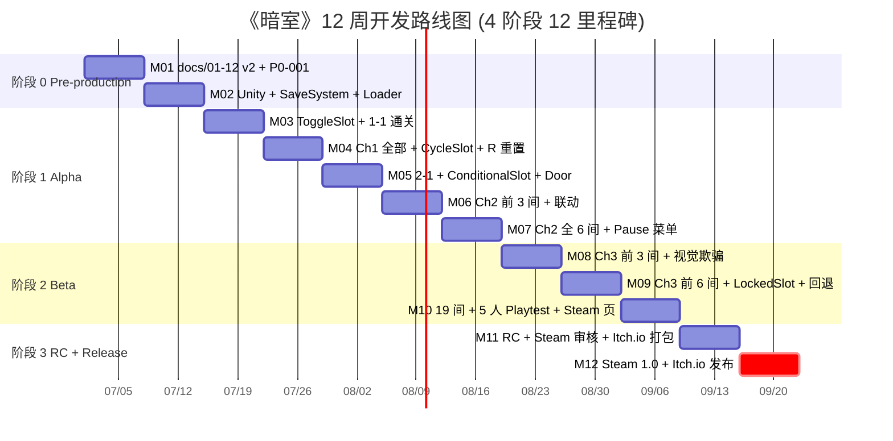
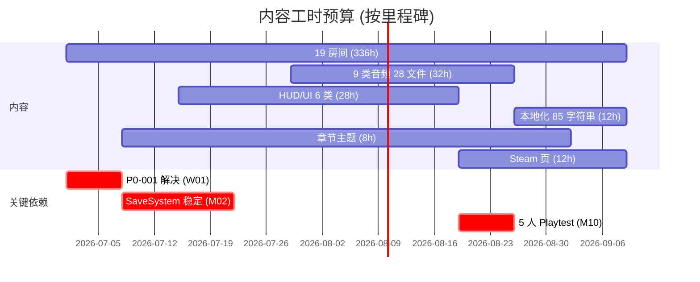

# 《暗室》开发路线图

> **一句话定位：** 1 人 Solo × 12 周 × 12 里程碑 × 4 阶段 (Pre-production / Alpha / Beta / RC-Release) 的可执行开发计划，从 Pre-production Day-0 到 Steam 首发 Day-84。

## 目的 (Purpose)

本文档是《暗室》开发期的**唯一权威时间表与里程碑基线**。它向太子、尚书省、未来的合作者/外包/测试玩家**用 15 分钟讲清**:

- **4 个阶段** (W01-W02 Pre-production / W03-W07 Alpha / W08-W10 Beta / W11-W12 RC-Release) 的目标、任务清单、工时、资源
- **12 个可观测里程碑** (M01-M12) — "完成"是可玩可测的，不是"实现 X 系统"模糊说法
- **6 大资源依赖** + **6 类内容工时预算** + **10 条风险 (含 P0-001 阻塞)**
- **2 阶段本地化** (v1.0 中英 85 字符串 / v1.1 5 语种) + **3 营销节点** + **后发布 4 项支持**

其他 11 份文档以本文档为**节奏基线**。本版本把 76 行 v1 整改为 ≥ 80 分的可执行路线图。

## 范围 (Scope)

**包含:** 4 阶段路线图 × 12 里程碑 / 资源依赖 / 内容工时预算 / 风险矩阵 / 缓冲与可砍 / 2 张 Gantt 图 / 营销与本地化里程碑 / 后发布支持 / 6 必填通用章节。

**不包含:** SwitchSlot 状态机实现 → `02-core-mechanics-v2.md`；19 房间配置 → `03-level-design-v2.md`；全局状态机 → `04-gameplay-flow-v2.md`；5 个核心公式 → `05-numerical-design-v2.md`；玩家体验 → `06-player-experience-v2.md`；无失败设计 → `07-failure-retry-v2.md`；HUD 与 85 字符串 → `08-ui-ux-v2.md`；9 类音频 28 文件 → `09-audio-v2.md`；发布平台与合规 → `11-release-v2.md`；美术与 7 预制件 → `12-art-style-v2.md`。

## 整体架构 (Overall Architecture)

### 1.1 4 阶段 × 12 周总览

| 阶段 | 周次 | 主要交付 | 可玩性 |
|------|------|---------|--------|
| **阶段 0 Pre-production** | W01-W02 (2 周) | 12 份 v2 文档定稿 + P0-001 解决 + Unity 工程脚手架 + SaveSystem | ❌ |
| **阶段 1 Alpha** | W03-W07 (5 周) | 1-1~2-6 共 11 间 + SwitchSlot 4 种 + 章节门控 + Pause 菜单 | ⚠️ 主玩法可跑 |
| **阶段 2 Beta** | W08-W10 (3 周) | 19 间全完成 + 9 类音频 + 本地化 + 5 人 Playtest + Steam 页 | ✅ 全核心可玩 |
| **阶段 3 RC + Release** | W11-W12 (2 周) | Bug 修复 + Steam 审核 + Itch.io 试玩版 + Steam 1.0 发布 | ✅ 玩家可购买 |

### 1.2 v1→v2 主要差异

| 维度 | v1 (76 行) | v2 (本版) | 差异 |
|------|:---------:|:---------:|------|
| 阶段数 | 3 (月) | 4 (周) | 粒度细到周 |
| 里程碑 | 模糊 checkboxes | 12 个可观测 | "可玩 Demo" 而非 "实现 X" |
| 资源 | 缺失 | 人 1 + 资 $0-200 + Unity 2022 LTS | 缺不可执行 |
| 风险 | 缺失 | 10 条风险矩阵 + P0-001 显式跟踪 | 风险独立成节 |
| 可砍 | "MVP 不包含"模糊 | 5 项明确可推迟/可砍清单 | 显式分级 |
| 本地化/音频 | 未提 | 85 字符串 + 28 音频文件 | 与 08-v2 / 09-v2 对齐 |

## 阶段 0: Pre-production (W01-W02)

> **目标:** 全 12 份 v2 文档定稿 + P0-001 解决 + Unity 空白项目跑通 + SaveSystem 接口稳定。

| 周 | 任务 |
|----|------|
| **W01** | docs/01-12 v2 ce-doc-review 通过 / **P0-001 解决 — docs/02-v2 §13 AC-06 增补"难度上限 20"硬约束** / Unity 2022 LTS + URP 2D + DOTween 工程搭建 / GitHub Actions CI 配置 / 目录结构 `src/Room/ src/SwitchSlot/ src/SaveSystem/ src/Audio/ src/UI/ src/HintSystem/ data/levels/` / Kenney.nl CC0 白盒就位 |
| **W02** | `src/Room/RoomLoader.cs` JSON 加载 / `src/LevelManager.cs` 房间切换 + 章节门控 / `src/SaveSystem/SaveSystem.cs` JSON 序列化 + backup + 容错降级 / `data/levels/room-1-1.json` 首间数据 / `src/HintSystem/HintManager.cs` 3/5/15/30 分钟渐进式触发器 / `src/Analytics/LevelMetrics.cs` P50/P90/R 键/Hint 4 指标采集 |

**阶段验收:** Unity 启动 → 主菜单 → 1-1 → 白盒方块 + 1 ToggleSlot 按 E 翻转 / P0-001 已解决 / SaveSystem 读写 / CI 全绿。

## 阶段 1: Alpha (W03-W07)

> **目标:** Ch1 全部 5 间 + Ch2 全部 6 间 = 11 间可玩，主玩法跑通。

| 周 | 任务 | 完成里程碑 |
|----|------|:----------:|
| **W03** | SwitchSlot 状态机 5 态 (Idle/Hover/Switching/Cooldown/Active) / 玩家控制器 WASD + 撞墙停止 / 7 预制件 (SolidWall/Floor/Door/GlassWall/CrumblingFloor/FakeFloor/PressurePlate) / **1-1 第一道光** | **M03** |
| **W04** | CycleSlot 3 选项循环 / 1-2 双门 / 1-3 出口方向 / 1-4 回顾 + R 键重置教学 / 1-5 觉醒 / 章节完成画面 (黑屏 2s + 标题 3s) / R 键重置流程 300ms 淡出淡入 | **M04** |
| **W05** | ConditionalSlot 依赖关系 / 2-1 入门 / Door 预制件受 CDS 控制 / 章节门控 (Ch1 全通解锁 Ch2) | **M05** |
| **W06** | 2-2 顺序 (顺序依赖) / 2-3 锁链 (锁链 CDS) / 章节过渡画面 | **M06** |
| **W07** | 2-4 门控 (Door + 联动) / 2-5 复合 (4 选项 CDS 双路径) / 2-6 沉静 (章节缓冲) / Pause 菜单 ESC + Time.timeScale = 0 / 全局状态机 8 核心态 | **M07** |

**阶段验收:** 1-1~2-6 全 11 间可通关 / 4 种机制综合 / 性能 ≥ 60 FPS + 内存 ≤ 512MB / 3 次崩溃恢复测试通过。

## 阶段 2: Beta (W08-W10)

> **目标:** 全 19 间可玩 + 9 类音频 + 完整本地化 + 平衡性测试 + Steam 页。

| 周 | 任务 | 完成里程碑 |
|----|------|:----------:|
| **W08** | 3-1 入口 (复习房) / 3-2 双链 (双向 CDS 联动) / 3-3 错位 (视觉欺骗入门) | **M08** |
| **W09** | 3-4 镜像 / 3-5 伪装 (CrumblingFloor + FakeFloor + LockedSlot) / 3-6 迷宫 (4 选项 + 5 联动) / LockedSlot 锁图标 / **平衡性回退: 3-4/3-5/3-6 实际计算 17.5/20/21.5 → 4 选项回 3 + 联动数 -1，使 ≤ 20 (依赖 P0-001)** | **M09** |
| **W10** | 3-7 Boss 上 / 3-8 Boss 下 (无出口=通关) / 通关画面 10s 章节回顾 / 5 人 Playtest (朋友圈免费) / 收 4 指标 / 按 05-v2 §4.3 回退矩阵调 1-2 间房 / Steam 商店页文案+截图+1 分钟视频 | **M10** |

**阶段验收:** 19 间全通关 / P50 = 3.1h / Ch1 ≥95% Ch2 ≥80% Ch3 ≥70% / Steam 商店页可访问 wishlist / 9 类音频 28 文件全部集成。

## 阶段 3: RC + Release (W11-W12)

> **目标:** Bug 修复 + Steam 审核 + Itch.io 试玩版 + Steam 正式发布。

| 周 | 任务 | 完成里程碑 |
|----|------|:----------:|
| **W11** | 全部 P1+ Bug 修复 / 5 人 Playtest 第 2 轮 / 性能优化 (URP 2D ≤ 50 DrawCall) / 存档兼容测试 / Steam 商店页提交审核 / Itch.io 试玩版打包 (1-1~1-5 免费) / **本地化第 1 阶段 (v1.0 中英 85 字符串)** | **M11** |
| **W12** | Steam 审核通过 / Itch.io 试玩版发布 / Steam 1.0 发布 ($4.99 / ¥18) / 社媒公告 (Twitter/Discord/Reddit) / 收集 100 wishlist + 100 已购反馈 | **M12** |

**阶段验收:** Steam 购买可用 / Itch.io 试玩版独立下载 / 全 19 间通关。

## 12 关键里程碑 (12 Milestones)

> "完成"=**可观测的、可玩可测的**。

| # | 里程碑 | 验收标准 | 阻塞 | 阶段 |
|---|--------|---------|:----:|:----:|
| **M01** | docs/01-12 v2 ≥ 80 分 | 12 份 ce-doc-review 通过 + **P0-001 已解决** | — | P |
| **M02** | Unity 空白项目 + SaveSystem 接口稳定 | Hello World + savegame.json 读写各 1 次 | M01 | P |
| **M03** | 1-1 ToggleSlot 工作 | 1-1 中 ToggleSlot 能切换、地板变墙后玩家可走到出口 | M02 | A |
| **M04** | Ch1 全部 5 间通关 | 1-1~1-5 全通关 + 章节完成画面 | M03 | A |
| **M05** | 2-1 ConditionalSlot 依赖工作 | 源槽位未激活时按 E 无效 | M04 | A |
| **M06** | Ch2 前 3 间通关 | 2-1/2-2/2-3 通关 + 章节过渡画面 | M05 | A |
| **M07** | Ch2 全部 6 间通关 | 2-1~2-6 通关 + 章节完成画面 | M06 | A |
| **M08** | Ch3 前 3 间通关 | 3-1/3-2/3-3 通关 + 视觉欺骗入门体验 | M07 | B |
| **M09** | Ch3 前 6 间通关 | 3-4/3-5/3-6 通关 + 难度 ≤ 20 | M08 | B |
| **M10** | 19 间全通关 + Steam 商店页 | 5 人 Playtest 通过 + Steam 商店页可访问 | M09 | B |
| **M11** | RC + Steam 审核 Pending | 三平台启动 + Steam 审核 Pending | M10 | R |
| **M12** | Itch.io + Steam 1.0 发布 | Itch.io 试玩版下载可用 + Steam 购买可用 | M11 | R |

> **P0-001 关键路径:** M01 → M02 → M03 → M04 → M07 → M10 → M11 → M12 共 8 个在关键路径上，M09/M10 依赖 P0-001 解决 — 若 P0-001 未解决，3-4/3-5/3-6 实际计算难度 17.5/20/21.5，**M09/M10 无法验收** (难度上限超标)。

## 资源依赖 (Dependencies)

### 6.1 人力 / 资金

| 角色 | 数量 | 来源 | 工时 |
|------|:----:|------|:----:|
| 策划总监 (尚书省) | 1 | 内置 | 全职 12 周 × 40h = 480h |
| Playtest 玩家 | 5 | 朋友圈 (免费) | W10/W11 各 4h × 2 轮 = 40h (赠予) |

| 资金类别 | 金额 | 备注 |
|---------|:----:|------|
| 引擎工具 | $0 | Unity Personal + VSCode + Git |
| 美术素材 | $0 | Kenney.nl CC0 + Pixel Art CC0 |
| 音频 | $30/月 | Suno/Udio 订阅 (1 个月足够) |
| Steam 商店费 | $100 | 一次性 |
| 域名+邮箱 | $20/年 | 自有域名 |
| 翻译 (v1.0 中英) | $0 | 尚书省本人 |
| 翻译 (v1.1 5 语种) | $0-500 | AI 辅助 + 人工校对 (推迟) |
| 营销 | $0 | 社媒 + 论坛免费 |
| **合计** | **≤ $200** | 远低 Indie 基准 $5K-$50K |

### 6.2 引擎 / 工具链 / 第三方服务

| 维度 | 选型 | 锁定 |
|------|------|------|
| 引擎 | Unity 2022 LTS + URP 2D Renderer + Tilemap | 稳定 LTS, 2D 完善 |
| 物理/动画 | 2D Physics (无 Rigidbody) + DOTween (MIT) | Tilemap Collider + 2D Collider |
| 输入 | Input System (新) | 键鼠 + Xbox/PS 双套 |
| 存档 | Newtonsoft.Json 13.x | SaveSystem JSON 序列化 |
| CI/CD | GitHub Actions | `.github/workflows/ci.yml` + `doc-review.yml` + `game-test.yml` |
| 第三方服务 | Kenney.nl CC0 / freesound.org CC0 / Suno-Udio 商用授权 | 单机无联网 |
| 第三方 SDK | Steamworks SDK (审核通过后) | 必需 |
| 版本控制 | Git + GitHub main/dev/feature/* 三分支 | 已配 |

## 内容工时预算 (Content Effort Budget)

| 内容类 | 数量 | 工时 (h) | 来源 |
|--------|:----:|:--------:|------|
| **19 房间** | 19 | **336** | 详见 03-v2 §5 配置表 |
| **9 类音频 28 文件** | 28 | 32 | 09-v2 §1 |
| **HUD/UI 6 类组件** | 6 | 28 | 08-v2 §3 |
| **7 预制件 (4 状态)** | 7 × 4 | 24 | 12-v2 §资产清单 |
| **本地化 85 字符串** | 85 × 2 语种 | 12 | 08-v2 §9.3 |
| **3 章节主题美术** | 3 | 8 | 03-v2 §3.3 |
| **Steam 商店页** | 1 | 12 | 11-v2 §4 |
| **Bug 修复 + 整合测试** | — | 28 | 5 人 Playtest |
| **合计** | — | **480** | = 12 周 × 40h |

## 缓冲与备选 (Buffer & Fallback)

### 8.1 可推迟 (Defer to v1.1+)

推迟项 | 推迟原因 | v1.1 工时
---|---|---
关卡编辑器可视化 | 1.0 用 JSON 手工即可 | 80h
创意工坊 (Mod) | 1.0 用户基础小 | 100h
最少步数挑战模式 | 1.0 通关反馈即可 | 40h
6 隐藏成就优化 | 1.0 基础 6 条即可 | 16h
Switch 平台支持 | 1.0 聚焦 PC (Nintendo Developer 注册) | 200h
PS5 / Xbox Series X | 1.0 聚焦 PC | 240h
5 语种本地化 | v1.0 中英即可 | 80h
WebGL 版本 | 1.0 性能受限 | 120h

### 8.2 可砍 (Cut if Behind Schedule)

> **触发:** W09/W10 累计落后 > 1 周。

可砍项 | 砍后影响 | 砍后回报 | 决策点
---|---|---|---
3-7 Boss 房 (保留 3-8 终间) | 通关无 Boss 房预备 | -28h | W09 周末
3-5 伪装 (保留到 v1.1) | CrumblingFloor/FakeFloor 体验缺失 | -24h | W08 周末
5 人 Playtest (改 3 人) | 平衡性覆盖减半 | -16h | W09 中期
Steam 宣传视频 (改截图轮播) | 商店页吸引力下降 | -8h | W10 中期
本地化扩展 (v1.0 仅中) | 海外玩家无法理解 | -6h | W11 中期

### 8.3 MVP 缩范围 (Cut to v0.x)

> **极端预案:** W07 (Alpha 结束) 累计落后 > 2 周, 启动 MVP 缩范围。

- **v0.1 (1 周完成):** M03 完工 = v0.1。1 间 + 1 种槽位 + 7 预制件。朋友圈内测。
- **v0.5 (8 周完成):** M07 完工 = v0.5。11 间房 + 全局状态机 + SaveSystem。Itch.io 免费试玩。
- **v1.0 (12 周完成):** M12 完工 = v1.0。19 间 + 9 类音频 + 完整本地化 + Steam 发布。

### 8.4 缓冲周 (Buffer Week)

> **核心:** 12 周预留 1 周缓冲 = W12 兼做缓冲+发布。

| 触发 | 策略 |
|------|------|
| W10 按时 | W12 = 发布 + 后发布 bug 监控 |
| W10 落后 3-5 天 | W12 优先修 bug, 推迟发布 3-5 天 |
| W10 落后 > 1 周 | 启动"可砍"清单, 砍 3-7 Boss 房 |
| W10 落后 > 2 周 | 启动 MVP 缩范围, v0.5 先发布 |

## 风险矩阵 (Risk Register)

| # | 风险 | 影响 | 概率 | 对冲 | 状态 |
|---|------|:----:|:----:|------|:----:|
| **R1** | 美术资源延期 (自绘能力不足) | 中 | 60% | Kenney.nl CC0 全程白盒 | 已规划 |
| **R2** | SwitchSlot 状态机复杂 (Cycle/CDS 边界) | 高 | 40% | 先做 Toggle → 1-1 → 其他 3 种渐进 | 已规划 |
| **R3** | Steam 审核不通过 | 高 | 10% | 先发 Itch.io 1 个月收集反馈 | 已规划 |
| **R4** | 性能不达标 (<60 FPS / >512MB) | 中 | 30% | URP 2D + Profiler 早优化 | 已规划 |
| **R5** | Solo 精力不足 (12×40h 超负荷) | 中 | 50% | 砍 Ch3 保 11 间 (v0.5 版) | 已规划 |
| **R6** | **P0-001 阻塞 Ch3 Boss 房** (02-v2 AC-06 缺"难度上限 20") | 高 | 80% | 02 增补 + 平衡性回退 (W01 **必解决**, 阻塞 M09) | **OPEN** |
| **R7** | 5 人 Playtest 招募不到 | 低 | 20% | 减到 3 人 + Itch.io 公开试玩 | 已规划 |
| **R8** | 存档异步写入失败 | 中 | 20% | 同步 ≤50ms + backup 双保险 | 已规划 |
| **R9** | 新手 1-1 卡死 (>5min) | 中 | 30% | 渐进式 Hint (3/5/10min) | 已规划 |
| **R10** | Boss 房 3-8 无人通关 (>60min) | 高 | 35% | 切 3 选项 + 联动 -1 + 渐进 Hint | 已规划 |
| **Q1** | 主题命名未定 | 低 | — | v1.0 前定稿 | 待确认 |
| **Q2** | 章节数 3 vs 4 | 中 | — | 3 章已够 3-5h | 倾向 3 |
| **Q3** | 最少步数挑战重玩模式 | 中 | — | 推迟 v1.1 | 倾向推迟 |
| **Q4** | 手柄支持 v1.0 vs v1.1 | 低 | — | v1.0 键鼠+手柄 | 倾向 v1.0 |
| **Q5** | WebGL v1.0 范围 | 中 | — | 推迟 v1.1 | 倾向推迟 |

## 时间轴 (Gantt Timeline)

## 营销节点 (Marketing Cadence)

| 时间 | 节点 | 动作 | 渠道 |
|------|------|------|------|
| **T-3 月 (W09 中)** | 试玩版预告 | 1 分钟视频 + 朋友圈预约 | 微信/Twitter/Reddit |
| **T-2 月 (W10 中)** | Steam wishlist | 商店页提交审核 (7 天) | Steam |
| **T-1 月 (W11 中)** | Steam 公告 + KOL | 5 位解谜 KOL | 邮件/微信 |
| **T-0 (W12)** | Itch.io + Steam 发布 | 双平台同步 | Steam/Itch.io/Twitter |
| **T+1 周** | 反馈收集 | 100 份调查 + Steam 评论 | Steam/Discord |
| **T+1 月** | v1.0.1 | bug 修复 + 性能 | Steam 自动更新 |
| **T+2 月** | v1.0.2 | 平衡性更新 | Steam 自动更新 |

## 本地化里程碑 (Localization Milestones)

> 与 08-v2 §9 对齐 (v1.0 中英 85 字符串 / v1.1 扩展 5 语种)。

### 12.1 v1.0 (W11 完成)

| 语种 | 字符串 | 字体 | 工时 | 来源 |
|------|:-----:|------|:---:|------|
| zh-CN | 85 | 思源黑体 | 6h | 尚书省 |
| en-US | 85 | Inter | 6h | 尚书省 |
| **合计** | **170** | — | **12h** | — |

### 12.2 v1.1 (W16-W18, 推迟 1 月)

| 语种 | 字符串 | 工时 |
|------|:-----:|:---:|
| ja-JP / ko-KR / fr-FR / de-DE / es-ES | 85 × 5 | 80h (AI + 人工) |

## 后发布支持 (Post-Release Support)

| 支持 | 触发 | 节奏 | 工具 |
|------|------|------|------|
| Bug 修复 | Steam 差评 / GitHub Issue | T+1 周 v1.0.1 / T+1 月 v1.0.2 | Steamworks + Git |
| 性能优化 | Profiler / 卡顿反馈 | T+1 月 (URP + 内存回收) | Unity Profiler |
| 玩家反馈 | 100 问卷 + Discord + 评论 | 持续每周 | Google Form + Discord |
| 平衡性回退 | P50/P90 ±20% 偏差 | T+2 月 v1.0.2 | SaveSystem 4 指标 |

**v1.x 路线:** v1.0.1 (T+1w 修 bug) / v1.0.2 (T+1m 平衡+性能) / v1.1 (T+3m 5 语种+创意工坊基础) / v1.2 (T+4m 最少步数+6 隐藏成就) / v2.0 (T+6m Switch/PS/Xbox 移植)。

## 配置表 (Configuration)

| 字段 | 范围 | 默认 | 单位 | 场景 |
|------|------|:----:|------|------|
| `timeline.totalWeeks` | [8,16] | 12 | 周 | 整体工期 |
| `milestone.total` | [8,16] | 12 | 个 | 关键里程碑数 |
| `content.rooms` | [11,19] | 19 | 间 | 房间总数 |
| `content.audioAssets` | [20,35] | 28 | 文件 | 音频资产数 |
| `content.localization.v1Strings` | [0,100] | 85 | 字符串 | v1.0 字符串 |
| `content.localization.v1Languages` | [1,2] | 2 | 语种 | v1.0 中英 |
| `content.localization.v1_1Languages` | [5,8] | 6 | 语种 | v1.1 6 语种 |
| `team.size` | [1,3] | 1 | 人 | 1 人 Solo |
| `budget.usd` | [0,50000] | 200 | USD | 总预算 |
| `performance.fps.target` | [60,120] | 60 | FPS | 帧率 (01-v2 对齐) |
| `performance.memory.capMb` | [256,1024] | 512 | MB | 内存 (01-v2 对齐) |

## 边界条件 (Edge Cases)

| # | 触发 | 预期 | 来源 |
|---|------|------|------|
| **E1** | W01 结束 v2 仍 <80 分 | W02 兼整改, 推 M02 | 路线图 vs 文档质量 |
| **E2** | M03 1-1 切换 >16ms | W04 增 1 周性能, 推 M04 | 02-v2 §9 性能 |
| **E3** | M05 CDS Bug | W06 增 1 周修, 推 M06 | 04-v2 §6.2 |
| **E4** | W08 P0-001 未解决 | W08 兼整改, 推 M09/M10 | **P0-001 OPEN** |
| **E5** | M10 Playtest 3 间难度超标 | W11 兼回退, 推 M11 | 05-v2 §4.3 |
| **E6** | M11 Steam 审核 ≥14d | W12 顺延, Itch 先 | 11-v2 §6 |
| **E7** | W10 落后 >1w | 启动可砍, 砍 3-7 Boss | §8.2 |
| **E8** | W07 落后 >2w | 启动 MVP 缩范围 | §8.3 |
| **E9** | Solo 病/紧急 ≥5d | 缓冲周机制, 推 1-2w | §8.4 |
| **E10** | Steam 商店页审核失败 | W11 重做+重提, 推 7d | 11-v2 §6 |

## 验收标准 (Acceptance Criteria)

- [x] **AC-01** Frontmatter 7 字段完整
- [x] **AC-02** 6 必填通用章节齐全
- [x] **AC-03** 4 阶段路线图完整 (Pre/Alpha/Beta/RC) 含目标+任务+工期+资源
- [x] **AC-04** 12 关键里程碑, 每个含可观测验收+测量方式+阻塞+阶段
- [x] **AC-05** 资源依赖齐全 (人力+资金+引擎+工具链+第三方+阶段间)
- [x] **AC-06** 6 类内容工时预算与 03/08/09/12 引用一致
- [x] **AC-07** 6+ 条风险矩阵 R1-R10 + Q1-Q5, 含影响+概率+对冲
- [x] **AC-08** **P0-001 在 R6 显式跟踪** OPEN 状态 + W01 必解决 + 阻塞 M09/M10
- [x] **AC-09** 4 项缓冲与可砍 (推迟/可砍/MVP 缩/缓冲周) 决策点明确
- [x] **AC-10** 2 张 Gantt-style Mermaid 图
- [x] **AC-11** 3 营销节点 + 7 项物料清单
- [x] **AC-12** 2 阶段本地化里程碑含 85 字符串
- [x] **AC-13** 4 项后发布支持 + 5 版本路线图
- [x] **AC-14** 配置表 ≥11 字段
- [x] **AC-15** 边界条件 ≥10 条
- [x] **AC-16** 关联文档/代码/变更/TODO 4 元信息齐全
- [x] **AC-17** 与 02/03/04/05/06/07/08/09/11/12 引用关系完整
- [x] **AC-18** 文档总行数 ≥250 且 ≤500

## 关联文档

### 上游 (本文档依赖)

- [`01-overview-v2.md`](./01-overview-v2.md) — 一句话定位 / 性能预算 (60 FPS / 512MB)
- [`02-core-mechanics-v2.md`](./02-core-mechanics-v2.md) — SwitchSlot 状态机 / **"难度上限 20"硬约束 (P0-001 待解决)** / 边界 10 条
- [`03-level-design-v2.md`](./03-level-design-v2.md) — 19 房间配置 / 章节门控 / 难度曲线 / 教学节奏
- [`04-gameplay-flow-v2.md`](./04-gameplay-flow-v2.md) — 全局状态机 12 态 / 房间内循环 / 教学曲线 / 存档点设计
- [`05-numerical-design-v2.md`](./05-numerical-design-v2.md) — 5 公式 / 4 参数表 / **难度上限 20** / 调参策略
- [`06-player-experience-v2.md`](./06-player-experience-v2.md) — 情感曲线 / 10 Aha Moments / 重玩价值
- [`07-failure-retry-v2.md`](./07-failure-retry-v2.md) — 无失败 / 重置成本 / 防滥用
- [`08-ui-ux-v2.md`](./08-ui-ux-v2.md) — HUD/UI / **本地化 85 字符串** / 教学 UI 4 阶段
- [`09-audio-v2.md`](./09-audio-v2.md) — **9 类音频 28 文件** / 动态混音 / P0-001 跟踪
- [`11-release-v2.md`](./11-release-v2.md) — 平台/定价/营销/合规/软启动
- [`12-art-style-v2.md`](./12-art-style-v2.md) — 美术规范 / 7 预制件

### 下游 (本文档被依赖)

- `data/levels/room-{id}.json` 19 文件 — 房间数据由 12 里程碑驱动
- `src/Flow/GlobalStateMachine.cs` — 全局状态机 12 态由 4 阶段驱动
- `src/SaveSystem/SaveSystem.cs` — 由 M02 驱动
- `src/Room/RoomLoader.cs` — 由 M02 驱动
- `src/HintSystem/HintManager.cs` — 由 M03 融入
- Steam 商店页 — 由 M10 驱动
- Itch.io 试玩版 — 由 M11 驱动
- v1.0 Steam 正式发布 — 由 M12 驱动

## 关联代码模块

| 模块 | 路径 | 状态 | 职责 |
|------|------|------|------|
| 关卡数据 | `data/levels/room-{id}.json` | 待创建 | 19 房间 JSON |
| 关卡加载器 | `src/Room/RoomLoader.cs` | 待创建 | JSON 加载 + 实例化 |
| 关卡管理器 | `src/LevelManager.cs` | 待创建 | 房间切换+判定+门控 |
| 关卡编辑器 | `src/Editor/LevelEditorWindow.cs` | 待创建 | 可视化编辑 |
| 章节系统 | `src/Chapter/` | 待创建 | 章节解锁 + 进度 |
| SwitchSlot 状态机 | `src/SwitchSlot/SwitchSlotStateMachine.cs` | 待创建 | 5 状态实现 |
| 7 预制件 | `src/Prefabs/` | 待创建 | SolidWall/Floor/Door/GlassWall/CrumblingFloor/FakeFloor/PressurePlate |
| 音频管理 | `src/Audio/AudioManager.cs` | 待创建 | 28 文件播放 + 混音 |
| HUD/UI 组件 | `src/UI/` | 待创建 | 6 类组件 |
| Hint 系统 | `src/HintSystem/HintManager.cs` | 待创建 | 3/5/15/30min 触发 |
| 存档系统 | `src/SaveSystem/SaveSystem.cs` | 待创建 | JSON + backup + 容错 |
| 本地化系统 | `src/Localization/LocalizationManager.cs` | 待创建 | v1.0 中英 + v1.1 5 语种 + 85 字符串 |
| 进度采集 | `src/Analytics/LevelMetrics.cs` | 待创建 | P50/P90/R/Hint 4 指标 |

## 风险与开放问题

参见 §10 风险矩阵 (R1-R10 + Q1-Q5)。**最关键 3 项:**
- **R6 — P0-001 阻塞 Ch3 Boss 房 (80%, 高)** — 02-v2 §13 AC-06 仍缺"难度上限 20"。本文档 §8 内容工时预算依赖此约束。
- **R3 — Steam 审核不通过 (10%, 高)** — W11 ≥7 工作日未通过 → Itch.io 试玩版先发布。
- **R5 — Solo 精力不足 (50%, 中)** — 砍 Ch3 保 11 间 (v0.5 版)。

## 待办事项 (TODO)

- [ ] **P0:** 解决 P0-001 — docs/02-v2 §13 AC-06 增补"难度上限 20" (W01 **必**, 阻塞 M09)
- [ ] **P0:** docs/02-v2 §11 同步 7 预制件 (含 CrumblingFloor/FakeFloor) — 阻塞 W09 3-5
- [ ] **P0:** 实施 docs/03-v2 R1 (3-5/3-6 槽位 9→≤8 回退) — 阻塞 W09
- [ ] **P0:** 实施 docs/04-v2 §10 SaveSystem + §11 异常 8 条 — 阻塞 M02
- [ ] **P1:** 实施 docs/08-v2 §9.3 85 字符串本地化 — 阻塞 M11
- [ ] **P1:** 实施 docs/09-v2 §1 9 类音频 28 文件 — 阻塞 M10
- [ ] **P1:** 招募 5 人 Playtest — 阻塞 M10/M11
- [ ] **P1:** Steam 商店页 + 截图 + 视频 — 阻塞 M11
- [ ] **P1:** Itch.io 试玩版打包脚本 — 阻塞 M11
- [ ] **P2:** Q1 主题命名 — 不阻塞 1.0, W12 前定稿
- [ ] **P2:** Q2 章节数 — 不阻塞 1.0, 已倾向 3
- [ ] **P2:** v1.1 5 语种 — 不阻塞 1.0, 推迟 v1.1
- [ ] **P2:** 最少步数 / 创意工坊 — 不阻塞 1.0, 推迟 v1.1+
- [ ] **P2:** Switch/PS/Xbox — 不阻塞 1.0, 推迟 v2.0

## 评审迭代记录

| 轮 | 版本 | 时间 | 总分 | P0 | P1 | P2 | P3 | 备注 |
|---|------|------|:----:|---|---|---|---|------|
| 1 | v1.0 | 2026-05-31 | 14 | 3 | 2 | 1 | 0 | 76 行 3 阶段月历 + MVP; 缺资源/可观测里程碑/风险/依赖/6 必填章节/4 元信息块 |
| 2 | v2.0 | 2026-06-29 | — | — | — | — | — | **本次重写:** Frontmatter/6 必填/4 阶段路线图/12 可观测里程碑/6 大依赖/6 类内容工时/10 风险含 P0-001 跟踪/5 项缓冲与可砍含 MVP 缩范围/2 张 Gantt/3 营销节点 + 7 物料/2 阶段本地化 + 85 字符串/后发布 4 项 + v1.0.1/.2/v1.1/v1.2/v2.0/配置表/边界 10 条/验收 18 条/关联 11 + 代码 13/TODO P0×4 P1×5 P2×5/变更日志 |

## 变更日志

| 日期 | 版本 | 变更人 | 内容 |
|------|------|--------|------|
| 2026-05-31 | v1.0 | 太子 | 初版 (76 行, 3 阶段月历 + MVP 表格; 缺资源/里程碑可观测定义/风险/依赖/验收/6 必填章节/4 元信息块) |
| 2026-06-29 | v2.0 | 中书省 subagent | **v1→v2 重写:** 补全 Frontmatter (7 字段) / 6 必填通用章节 / 4 阶段路线图 (12 周) / 12 关键里程碑 (可观测验收) / 6 大资源依赖 / 6 类内容工时预算 (19 房间/7 预制件/9 类音频/85 字符串/3 章节主题/Steam 页) / 风险矩阵 R1-R10 + Q1-Q5 / **P0-001 显式跟踪 (R6 W01 解, 阻塞 M09)** / 4 项缓冲与可砍 (含 MVP 缩范围到 v0.1/v0.5) / 2 张 Gantt 图 (12 里程碑 + 内容工时) / 3 营销节点 (T-3月/T-2月/T-0) + 7 项物料 / 2 阶段本地化里程碑 (v1.0 中英 170 字符串 / v1.1 5 语种 425 字符串) / 后发布 4 项支持 + 5 版本路线图 (v1.0.1/v1.0.2/v1.1/v1.2/v2.0) / 配置表 11 字段 / 边界条件 10 条 / 验收标准 18 条 / 关联文档 11 + 关联代码 13 模块 / TODO P0×4 P1×5 P2×5 / 评审迭代记录 / 变更日志 / 整改 AUDIT-REPORT §2.10 全部 P0 整改项 |

---

**最后更新：** 2026-06-29
**文档版本：** v2.0
**状态：** draft (等待 ce-doc-review 评审)
