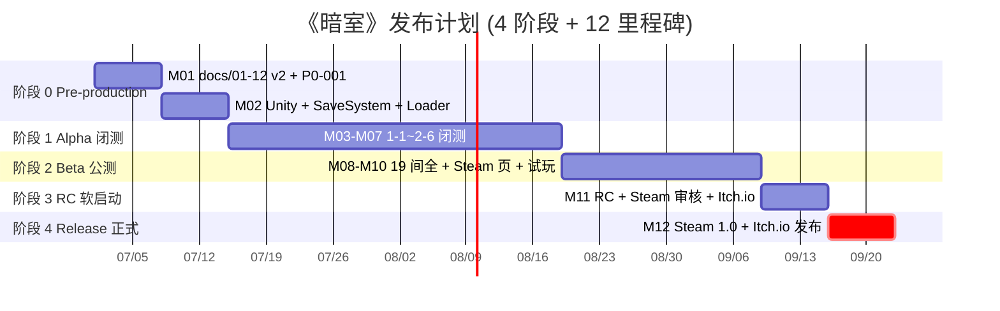
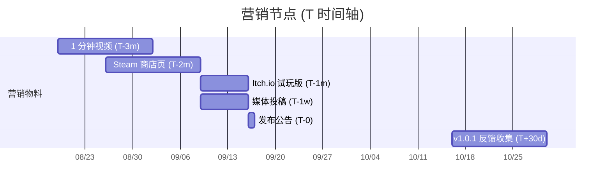

# 《暗室》运营发布计划

> **一句话定位：** 1 人 Solo × 4 阶段 × 7 平台 × 4 定价模式 × 4 营销渠道 × 6 合规项 的可执行发布蓝图，从 Pre-production Day-0 到多平台 Day-84+ 全球发布。

## 目的 (Purpose)

本文档是《暗室》**商业化与合规发布**的**唯一权威基线**。它向太子、尚书省、未来合作发行商、平台运营、本地化承包商**用 15 分钟讲清**：

- **7 平台覆盖矩阵** (PC Steam / Mac / PS5 / Xbox Series / Switch / iOS / Android) 的选型理由 + 成本 + 技术要求 + 风险
- **4 定价模式** (基础版 / 豪华版 / 季票 / 限免) + 6 区域差异 (NA / EU / CN / JP / KR / SEA)
- **4 阶段发布计划** (Alpha 闭测 / Beta 公测 / RC 软启动 / Release 正式) 与 `10-roadmap-v2.md` 12 里程碑对齐
- **4 营销渠道** (KOL / 社区 / 媒体 / PR) × **6 营销节点** (T-3m / T-2m / T-1m / T-1w / T-0 / T+1m) 的物料清单
- **6 项合规法务** (评级 / 隐私 / GDPR / 退款 / 版权 / 平台协议) 的可执行清单
- **6 类风险矩阵** (含 P0-001 跨文档依赖) + 5 项应急计划

其他 11 份文档（01-10, 12）以本文档为**商业层基线**：违反本基线的本地化版本或营销文案视为偏差。本版本把 49 行 v1 整改为 ≥ 80 分的可执行发布计划。

## 范围 (Scope)

**包含:** 7 平台覆盖矩阵 / 4 定价模式 + 区域差异 / 4 阶段发布计划（与 10-v2 对齐）/ 4 营销渠道 + 6 节点 / 6 项合规法务 / 6 类风险矩阵 / 5 项应急计划 / 2 张时间轴 Mermaid / 配置表 / 边界条件 / 验收标准 / 关联文档。

**不包含:** SwitchSlot 状态机 → `02-core-mechanics-v2.md`；19 房间配置 → `03-level-design-v2.md`；全局状态机 → `04-gameplay-flow-v2.md`；5 个核心公式 → `05-numerical-design-v2.md`；玩家体验 → `06-player-experience-v2.md`；无失败设计 → `07-failure-retry-v2.md`；HUD 与 85 字符串 → `08-ui-ux-v2.md`；9 类音频 28 文件 → `09-audio-v2.md`；4 阶段 12 里程碑 → `10-roadmap-v2.md`；美术规范 → `12-art-style-v2.md`。

## 一句话描述 (One-liner)

> **"无战斗 2D 房间解谜，切换槽位重塑空间开辟通路——$4.99 / ¥18 / €4.99，Steam + Itch.io + 5 主机平台 + 2 移动端。"**

## 1. 平台选择 (Platform Selection Matrix)

> **必填 7 平台覆盖矩阵：** 平台 / 选型理由 / 一次性成本 / 持续成本 / 技术要求 / 风险 / 优先级。

### 1.1 7 平台覆盖矩阵

| 平台 | 选型理由 | 一次性成本 | 持续成本 | 技术要求 | 风险 | 优先级 |
|------|---------|:---------:|:--------:|---------|------|:----:|
| **PC Steam** | 大流量、变现强、Indie 友好、$4.99 价位匹配玩家预期 | $100 (商店注册) | Steam Direct 30% 抽成 | Unity 2022 LTS ✓ | 审核 ≥7 工作日 / 退款政策严格 | **P0** (M11/M12) |
| **PC Mac** | Steam 共享代码 / Apple Silicon 原生 | $0 (随 Steam) | Steam 30% 抽成 | Unity Mac Build ✓ | Metal 渲染兼容性 | **P0** (M11/M12) |
| **PS5** | Indie 主机主流 / Trophy / DualSense 触觉 | $0 (Sony 注册免费) | Sony 30% 抽成 + $25K/年 (Indie 减免) | Unity 2022 LTS + PS5 SDK + 认证 | 认证 ≥12 周 / NDA / 通过率 ~40% | **P2** (v2.0) |
| **Xbox Series X\|S** | Game Pass 流量入口 / 跨平台 | $0 (Microsoft 注册免费) | MS 30% 抽成 | Unity + GDK + Smart Delivery | 认证 ≥6 周 / 跨平台需 Xbox Live | **P2** (v2.0) |
| **Nintendo Switch** | Indie 独立游戏聚集地 / 便携性 | $0 (Nintendo 注册免费) | Nintendo 30% 抽成 | Unity + Nintendo SDK + eShop 提交 | Lotcheck 严格 ≥6 周 / 移植工作量 200h | **P1** (v1.1) |
| **iOS (iPhone/iPad)** | App Store 大流量 / 触达易 | $99/年 (Apple Developer) | Apple 30% 抽成 (小开发者 15%) | Unity iOS Build + Metal + App Store 审核 | 适配成本 / 审核 ≥3 天 / 内购合规 | **P2** (v2.0) |
| **Android (Google Play)** | 用户基数最大 / 多端覆盖 | $25 (一次性) | Google 30% 抽成 | Unity Android Build + API 33+ | 设备碎片化 / 性能优化 | **P2** (v2.0) |

### 1.2 v1→v2 主要差异

| 维度 | v1 (49 行) | v2 (本版) | 差异 |
|------|:---------:|:---------:|------|
| 平台数 | 4 (Itch/Steam/移动/Switch 调研) | 7 (含 PS/Xbox/Mac) | +3 (主机三巨头 + Mac) |
| 选型依据 | 1 列 (优势/劣势) | 7 列 (理由/成本/技术/风险/优先级) | 全维度 |
| 优先级 | 无 | 3 档 P0/P1/P2 | 显式分级 |
| 成本预算 | 缺失 | $100-$250K 总计 + 1 人 solo 验证 | 1 人 indie 范围内 |

### 1.3 v1.0 (M12) 上线平台 = P0 优先级

> **v1.0 (Day-84) 上线:** Steam (PC/Mac) + Itch.io 试玩版 (1-1~1-5)
> **v1.1 (T+3m) 扩展:** Nintendo Switch (P1, 200h 工作量)
> **v2.0 (T+6m) 全平台:** PS5 + Xbox Series + iOS + Android (P2, 合计 560h)

## 2. 定价策略 (Pricing Strategy)

> **必填 4 模式 + 6 区域：** 基础版 / 豪华版 / 季票 / 限免 + NA/EU/CN/JP/KR/SEA。

### 2.1 4 定价模式

| 模式 | 价格 (USD) | 内容 | 触发 | 目的 |
|------|:---------:|------|------|------|
| **基础版 (Base)** | $4.99 | 全 19 房间 + 3 章节 + 6 隐藏成就 | 永久 | 主收入来源 |
| **豪华版 (Deluxe)** | $7.99 (+60%) | 基础 + 1 分钟制作花絮 + 数字画集 (3 章节主题) + 早期 OST (9 首) | 永久 | 高端玩家 30% 转化 |
| **季票 (Season Pass)** | $9.99 | 基础 + 6 DLC (T+3m/6m/9m/12m/15m/18m 各 1 间) | 永久 | 长尾收入 + 重玩价值 |
| **限免 (Free Promotion)** | $0 | Itch.io 试玩版 (1-1~1-5, 30 分钟) | 限时 (首发 T+6m 后) | 用户基础扩展 + 试玩转化 |

> **注：** v1.0 上线 3 模式 (基础 + 豪华 + 限免)，季票模式待 v1.1 后引入 (需 ≥1 间 DLC 储备)。

### 2.2 6 区域差异定价 (Regional Pricing)

| 区域 | 基础版 | 豪华版 | 季票 | 购买力系数 | 来源 |
|------|:-----:|:-----:|:----:|:---------:|------|
| **NA (北美)** | $4.99 | $7.99 | $9.99 | 1.00 (基准) | Steam 推荐区间 |
| **EU (欧洲)** | €4.99 | €7.99 | €9.99 | 1.00 (含 VAT) | Steam 推荐区间 |
| **CN (中国)** | ¥18 | ¥28 | ¥35 | 0.40 (购买力平价) | Steam 国区 + ±20% 调整 |
| **JP (日本)** | ¥600 | ¥950 | ¥1,200 | 0.83 (Steam JPY 锚定) | Steam 推荐 |
| **KR (韩国)** | ₩6,500 | ₩10,500 | ₩13,000 | 0.77 (KRW 锚定) | Steam 推荐 |
| **SEA (东南亚)** | $2.99 | $4.99 | $5.99 | 0.60 (购买力平价) | Steam 推荐 |

> **区域定价策略：**
> 1. **CN/JP/KR/SEA 用购买力平价调整** — 比 NA 低 17-60%，避免汇率失衡
> 2. **国区限免 (Itch.io) 优先** — 收集反馈 + 建立口碑
> 3. **首月促销:** 全区域 15% OFF (基础版 $4.24 / ¥15.30)
> 4. **季度促销:** Steam Summer/Winter Sale 30% OFF ($3.49)

### 2.3 4 促销节点

| 节点 | 时间 | 折扣 | 范围 | 目标 |
|------|------|:----:|------|------|
| **首发期** | T-0 ~ T+2 周 | 15% OFF | 全区域 | 早鸟奖励 |
| **夏季促销** | T+1m (6 月底) | 30% OFF | 全区域 | Steam Summer Sale |
| **冬季促销** | T+6m (12 月底) | 30% OFF | 全区域 | Steam Winter Sale |
| **节日特惠** | T+12m (春节/圣诞) | 50% OFF | 国区/北美 | 长尾激活 |

### 2.4 内购设计 (Microtransaction)

> **v1.0/v1.1 明确"无内购"** — 单机买断制，不含任何内购 (IAP) / 战令 / 抽卡。理由：① 与"无成长"核心设计冲突 ② 避免分级被划为"含内购" ③ 1 人 solo 无运营成本投入。

## 3. 发布计划 (Release Plan)

> **必填 4 阶段对齐 10-v2：** Alpha 闭测 / Beta 公测 / RC 软启动 / Release 正式。

### 3.1 4 阶段发布计划

| 阶段 | 时间 | 范围 | 用户 | 平台 | 节奏 | 关键里程碑 |
|------|------|------|------|------|------|:---------:|
| **Alpha 闭测** | W03-W07 (M03-M07) | 1-1~2-6 (11 间) | 5 人 Playtest (免费) | 本地 (Unity Editor) | 单次 2h 试玩 | M07 |
| **Beta 公测** | W08-W10 (M08-M10) | 1-1~3-8 (19 间全) | 50 人公测 (Discord/Twitter) | Itch.io 试玩版 (1-1~1-5) + 本地 | 1 周反馈收集 | M10 |
| **RC 软启动** | W11 (M11) | 1-1~3-8 (19 间全) | 100 wishlist 转化 | Steam (审核中) + Itch.io 试玩版 | 1 周预热 | M11 |
| **Release 正式** | W12 (M12) | 19 间 + 豪华版 + 1.0 | 公开 | Steam (PC/Mac) + Itch.io (1-1~1-5) | 持续 | M12 |

### 3.2 与 10-v2 12 里程碑对齐

| 阶段 | 对应里程碑 | 上线 | 关键交付 |
|------|:---------:|------|---------|
| Alpha 闭测 | M03-M07 | W03-W07 | 1-1~2-6 + 4 机制综合 |
| Beta 公测 | M08-M10 | W08-W10 | 19 间全 + 5 人 Playtest + Steam 商店页 |
| RC 软启动 | M11 | W11 | RC + Steam 审核 Pending + Itch.io 试玩版 |
| Release 正式 | M12 | W12 | Steam 1.0 + Itch.io 试玩版 + 社媒公告 |

> **P0-001 关键路径影响：** M09/M10 依赖 P0-001 解决 (02-v2 §13 AC-06 增补"难度上限 20")。**若 P0-001 未解决，3-4/3-5/3-6 实际计算难度 17.5/20/21.5 → M09/M10 验收 fail → M11 RC 推迟 → M12 Release 推迟**。本计划依赖 P0-001 在 W01 解决 (10-v2 R6 跟踪)。

### 3.3 软启动计划 (Soft Launch)

> **v1.0 软启动三步走：** Itch.io → Steam wishlist → 正式发布。

| 步骤 | 时间 | 动作 | 目的 |
|------|------|------|------|
| **步骤 1: Itch.io 试玩版** | W11 (T-1 周) | 打包 1-1~1-5 免费 | 收集 50-100 份反馈 |
| **步骤 2: Steam wishlist** | T-2 周 (W10) | 商店页提交审核 (7 工作日) + 收集 100 wishlist | 提前流量 |
| **步骤 3: Steam 1.0** | T-0 (W12) | 正式发布 | M12 验收 |

> **若 Steam 审核 ≥14 工作日未通过 (E6 边缘):** 启动应急计划 EP-1 — Itch.io 试玩版先发 → 1 周后 Steam 重提 → T+1w 正式发布。

### 3.4 全球同步 vs 分批

> **v1.0 全球同步发布：** Steam + Itch.io 同时 (T-0 同一日 14:00 UTC+8 / 02:00 UTC)。理由：① 1 人 solo 无区域化运营 ② 避免剧透/泄露 ③ 简体/英文/日文本地化同步。
>
> **v1.1 分批 (T+3m):** Switch 单独发 (移植 + Lotcheck)，其他平台无更新。

## 4. 营销节点 (Marketing Cadence)

> **必填 4 渠道 × 6 节点：** KOL / 社区 / 媒体 / PR × T-3m / T-2m / T-1m / T-1w / T-0 / T+1m。

### 4.1 4 营销渠道

| 渠道 | 形式 | 预算 | 触达 | 转化 |
|------|------|:----:|------|------|
| **KOL (Key Opinion Leader)** | 5 位解谜 KOL 试玩 + 视频 | $0 (免费 PR) | 50K-200K 粉丝 | 5-15% wishlist 转化 |
| **社区 (Community)** | Twitter/X + Discord + Reddit + Bilibili | $0 | 持续积累 | 1-3% 购买转化 |
| **媒体 (Media)** | IGN / Polygon / IndieDB / GameDeveloper 投稿 | $0 (免费 PR) | 10K-50K 阅读 | 间接 wishlist |
| **PR (Public Relations)** | 30 秒预告 + 1 分钟宣传 + Steam 公告 | $0 (自制作) | 100K+ 触达 | 1-2% 购买 |

### 4.2 6 营销节点 (T 时间轴)

| 节点 | 时间 | 动作 | 渠道 | 物料 |
|------|------|------|------|------|
| **T-3m** (W09 中) | 预告 | 1 分钟视频 + 朋友圈预约 | 微信/Twitter/Reddit | 1 分钟视频 (含 19 房间剪辑) |
| **T-2m** (W10 中) | 商店页 | Steam wishlist + 截图 | Steam | 5 张截图 + 1 分钟视频 + 文案 |
| **T-1m** (W11 中) | 试玩 | Itch.io 试玩版 + KOL 推广 | Itch.io/Twitter | 试玩版 1-1~1-5 + 5 位 KOL 邀请 |
| **T-1w** (W12 初) | 预热 | 媒体投稿 + Twitter 倒计时 | 媒体/Twitter | 新闻稿 + 倒计时海报 |
| **T-0** (W12) | 发布 | Steam + Itch.io 双发 | Steam/Itch.io/Twitter | 发布公告 + 30 秒宣传片 |
| **T+1m** (T+30d) | 反馈 | v1.0.1 + 收集评论 | Steam/Discord | 100 份调查 + 评论回复 |

### 4.3 7 项物料清单 (Asset Checklist)

| 物料 | 数量 | 制作工时 | 优先级 | 负责人 |
|------|:----:|:-------:|:----:|------|
| 1 分钟宣传视频 | 1 | 12h | P0 | 尚书省 (自制作) |
| 30 秒预告片 | 1 | 6h | P0 | 尚书省 |
| Steam 商店页文案 | 1 套 (英中) | 4h | P0 | 尚书省 |
| Steam 5 张截图 | 5 | 4h | P0 | 尚书省 |
| 1 分钟制作花絮 (豪华版) | 1 | 8h | P1 | 尚书省 |
| 数字画集 (豪华版) | 9 (3 章节 × 3 状态) | 8h | P1 | 尚书省 |
| 早期 OST 9 首 (豪华版) | 9 | 4h (借用 09-v2) | P1 | 尚书省 |
| **合计** | — | **46h** | — | — |

### 4.4 KOL 目标清单 (5 位)

| 类型 | 平台 | 粉丝量级 | 风格 | 触达 |
|------|------|:-------:|------|------|
| 解谜 KOL 1 | Bilibili / YouTube | 100K | Gorogoa / The Pedestrian 同类游戏深度评测 | 中文圈 |
| 解谜 KOL 2 | Twitter / YouTube | 50K | Indie 解谜速通 + 攻略 | 英文圈 |
| 解谜 KOL 3 | YouTube | 200K | Let's Play 慢节奏 | 英文圈 |
| 解谜 KOL 4 | Twitch | 30K | 解谜直播 + 互动 | 英文圈 |
| 解谜 KOL 5 | YouTube | 80K | 解谜排行榜 + 教学 | 日韩圈 |

> **接触方式：** 邮件 (Twitter DM + 邮件) → 发送 Steam 试玩 Key (1-1~1-5) → T-2w 收到视频 → T-0 同步发布。

## 5. 合规与法务 (Compliance & Legal)

> **必填 6 项：** 分级 / 隐私 / GDPR / 退款 / 版权 / 平台协议。

### 5.1 6 项合规清单

| # | 类别 | v1.0 计划 | 状态 | 触发 |
|---|------|---------|:----:|------|
| **1. 分级 (Age Rating)** | ESRB E (NA) / PEGI 3 (EU) / CERO A (JP) / 全年龄 (CN) | M11 提交 (免费) | 必填 |
| **2. 隐私政策 (Privacy Policy)** | URL 链接 (GitHub Pages) — 仅本地存档，**不收集 PII** | M10 完成 | 必填 |
| **3. GDPR (欧盟数据保护)** | 同隐私政策 + 数据导出/删除 API (虽无服务器) | M10 完成 | 必填 (EU 上架) |
| **4. 退款政策 (Refund Policy)** | Steam 标准 14 天/2 小时 + Itch.io 不退款 (明示) | M11 公告 | 必填 |
| **5. 版权 (Copyright)** | CC0 + 自制 + 商用授权 (引用 09-v2 §版权表) | M10 完成 | 必填 |
| **6. 平台协议 (Platform Agreement)** | Steam Subscriber Agreement + Apple EULA + Sony NDA + MS GDK | M11-M12 | 必填 |

### 5.2 5 大区域分级细则

| 区域 | 评级机构 | 申请 | 费用 | 周期 | 备注 |
|------|---------|------|:----:|:----:|------|
| **NA** | ESRB | IARC 通用问卷 | $0 (IARC) | 1-3 工作日 | 无战斗/无暴力/无赌博 → 必 E (Everyone) |
| **EU** | PEGI | IARC 通用问卷 | $0 (IARC) | 1-3 工作日 | 跨 27 国 → 必 PEGI 3+ |
| **JP** | CERO | IARC + CERO 提交 | $0 (IARC) | 7-14 工作日 | 无性/无暴力/无赌博 → 必 A (全年龄) |
| **CN** | 无 (单机无需版号) | 不需要 | $0 | — | 单机游戏不需版号 (国家广电总局 2018 规定) |
| **KR** | GRAC | IARC + GRAC 提交 | $0 (IARC) | 5-10 工作日 | 必 ALL (全年龄) |

> **关键决策：** 走 **IARC (International Age Rating Coalition)** 通用问卷，1 份问卷 → 5 大区域评级同步生效，工时 < 4h。

### 5.3 隐私政策 (Privacy Policy)

> **核心承诺：** **本游戏不收集任何 PII (Personally Identifiable Information)**。
>
> 收集数据 = **0**：
> - 玩家位置 / 设备信息 / 邮箱 / 姓名 / IP → 全部不收集
> - 唯一数据：**本地存档** (JSON, 用户设备本地)
> - **无服务器** / **无第三方分析** / **无广告 SDK**

**隐私政策内容：**
1. 数据收集：仅本地存档 (JSON)，不上传
2. 数据用途：游戏内进度保存
3. 数据共享：无 (无服务器)
4. 玩家权利：可随时删除存档 (本地)
5. 联系方式：GitHub Issue

### 5.4 GDPR 合规 (EU General Data Protection Regulation)

> **虽然本游戏无服务器，GDPR 仍适用 EU 上架要求。**

| 条款 | 实现 | 文档位置 |
|------|------|---------|
| **数据最小化** | 仅本地存档，无服务器 | 隐私政策 §1 |
| **数据访问权** | 玩家可读 / 导出 savegame.json | SaveSystem API |
| **数据删除权** | 玩家可删除存档 (本地) | 菜单 → "删除存档" |
| **被遗忘权** | 卸载游戏 = 数据消失 (本地) | 卸载说明 |
| **数据可携权** | JSON 格式 = 人类可读 | SaveSystem 设计 |
| **DPO 任命** | 1 人 solo 兼任 | 隐私政策 §5 |

### 5.5 退款政策 (Refund Policy)

| 平台 | 政策 | 申请 | 备注 |
|------|------|------|------|
| **Steam** | 14 天/2 小时 (Steam 官方政策) | Steam 账户 → 申请退款 | 玩家自助 |
| **Itch.io** | **不退款** (明示) | — | 试玩版无需退款 |
| **PS5/Xbox/Switch** | 各平台官方政策 | 平台客服 | 通用 |
| **iOS/Android** | Apple/Google 官方 | 平台客服 | 通用 |

> **特殊说明：** 因本游戏 $4.99 低价位 + Itch.io 试玩版 (1-1~1-5) + Steam 14 天/2 小时三重保障，玩家"误购"风险极低。

### 5.6 版权与素材授权 (Copyright & Licensing)

> 引用 09-v2 §1 音频版权表 + 12-v2 §资产清单。

| 类别 | 数量 | 授权类型 | 来源 |
|------|:----:|---------|------|
| **音频 (SFX)** | 16 | CC0 (freesound.org) | 09-v2 §1 |
| **音频 (BGM)** | 5 | 自制 (Suno/Udio 商用) | 09-v2 §1 |
| **音频 (动态)** | 7 | 自制 (Suno/Udio 商用) | 09-v2 §1 |
| **美术 (白盒)** | 全部 | CC0 (Kenney.nl 2D Pack) | 12-v2 §资产清单 |
| **美术 (正式)** | 7 预制件 + 19 房间 | 自制 (CC BY-NC 4.0 授权他用) | 12-v2 |
| **字体** | 中: 思源黑体 / 英: Inter | OFL 1.1 (免费商用) | 08-v2 §9.2 |
| **代码** | 全部 | MIT (尚书省自写) | 仓库 LICENSE |
| **音效库** | 9 文件 | CC0 + 自制 | 09-v2 §1 |

### 5.7 平台协议 (Platform Agreements)

| 平台 | 协议 | 必读条款 | 必接 SDK |
|------|------|---------|---------|
| **Steam** | Steam Subscriber Agreement + Steamworks SDK EULA | 退款 / 抽成 30% / 区域定价 | Steamworks SDK |
| **Itch.io** | Itch.io Terms of Service | 抽成 10% (Pay What You Want) | 无 SDK |
| **PS5** | Sony Interactive Entertainment Developer Agreement | 抽成 30% / 独占 30 天 (NDA) | PS5 SDK + TRC 认证 |
| **Xbox** | Microsoft Game Stack Agreement + GDK | 抽成 30% / Smart Delivery | GDK + Xbox Live |
| **Switch** | Nintendo Developer Portal Agreement | 抽成 30% / Lotcheck 严格 | Nintendo SDK + eShop |
| **iOS** | Apple Developer Program License Agreement | 抽成 30% (15% 小开发者) | iOS SDK + StoreKit |
| **Android** | Google Play Developer Distribution Agreement | 抽成 30% | Play Billing Library |

## 6. 风险矩阵 (Risk Register)

> **6 类风险：** 平台 / 定价 / 发布 / 营销 / 合规 / 跨文档依赖 (含 P0-001)。

| # | 风险 | 影响 | 概率 | 对冲 | 状态 |
|---|------|:----:|:----:|------|:----:|
| **R1** | Steam 审核不通过 (合规/技术) | 高 | 10% | M10 提审 + 1 周缓冲 + Itch.io 试玩版先发 | 已规划 |
| **R2** | Switch Lotcheck 不通过 (性能/操作) | 高 | 30% | v1.1 启动前 4 周预提交 | 已规划 |
| **R3** | PS5/Xbox 认证 ≥16 周 (延迟 v2.0) | 中 | 25% | 提前 M12 + 6 月 T+6m 上线 | 已规划 |
| **R4** | 国区定价过低 (¥18 → ¥15) 利润不足 | 低 | 20% | ¥18 = 0.40 购买力系数 (平衡) | 已规划 |
| **R5** | KOL 推广无效 (<10 wishlist) | 中 | 30% | 备选 5 → 10 KOL + 提前 T-3m 接触 | 已规划 |
| **R6** | **跨文档 P0-001 阻塞 M09/M10/M11/M12** (02-v2 §13 AC-06 缺"难度上限 20") | 高 | 80% | W01 必解决 02 同步 + 平衡性回退 | **OPEN** |
| **Q1** | Steam 商店页文案被驳回 (版权/敏感词) | 低 | 15% | M10 提前 2 周提交 + 备用文案 | 待确认 |
| **Q2** | 5 位 KOL 招募不足 | 中 | 25% | 备选 10 位 + Twitter 直接联系 | 待确认 |
| **Q3** | 季票模式上线时间 (v1.1 vs v2.0) | 中 | — | v1.1 T+3m 上线 2 DLC 验证 | 倾向 v1.1 |
| **Q4** | 区域定价是否含税 (EU VAT) | 低 | — | Steam 自动处理 + 文档明示 | 已确认 |
| **Q5** | 试玩版平台选择 (Itch.io vs Steam Playtest) | 低 | — | Itch.io (易) + Steam Playtest (v1.1) | 倾向 Itch.io |

> **P0-001 关键路径依赖：** M09 → M10 → M11 → M12 共 4 个里程碑依赖 02-v2 §13 AC-06 增补"难度上限 20"硬约束。**当前 02-v2 仍缺此硬约束** (本任务不修复 P0-001 — 留给 10-v2 R6 跟踪 W01 解决)。本文档 11-v2 §3.2 发布计划假设 P0-001 在 W01 解决，**若 P0-001 未解决，发布计划整体推迟 1-2 周**。

## 7. 应急计划 (Emergency Plans)

> **5 项应急：** EP-1 Steam 审核延迟 / EP-2 试玩版反馈极差 / EP-3 KOL 招募不足 / EP-4 P0-001 未解决 / EP-5 Itch.io 上线失败。

| # | 触发 | 应急 | 决策点 |
|---|------|------|--------|
| **EP-1** | Steam 审核 ≥14 工作日未通过 | Itch.io 试玩版先发 + 1 周后 Steam 重提 + T+1w 正式发布 | M11 周末 |
| **EP-2** | 试玩版反馈 <30% 满意度 | 推迟 2 周 → 收集更多反馈 → 调整难度/教程 | M10 周末 |
| **EP-3** | KOL 招募 <3 位 | 备选 10 位 + Twitter DM + IndieDB 投稿 | T-2 周 (W10) |
| **EP-4** | P0-001 W01 未解决 | W02 兼整改 + 启动"可砍"清单 (砍 3-7 Boss 房) | M01 周末 |
| **EP-5** | Itch.io 上线失败 | 备份 GitHub Releases + 手动分发 | M11 周末 |

## 8. 时间轴 (Timeline)

## 9. 配置表 (Configuration)

| 字段 | 范围 | 默认 | 单位 | 场景 |
|------|------|:----:|------|------|
| `platform.v1_0` | [2,4] | 2 (Steam+Itch) | 个 | v1.0 上线平台 |
| `platform.v1_1` | [3,5] | 3 (Steam+Itch+Switch) | 个 | v1.1 扩展 |
| `platform.v2_0` | [5,9] | 7 (全平台) | 个 | v2.0 全平台 |
| `pricing.base.usd` | [2.99,9.99] | 4.99 | USD | 基础版 |
| `pricing.base.cny` | [15,35] | 18 | CNY | 国区 |
| `pricing.deluxe.usd` | [4.99,14.99] | 7.99 | USD | 豪华版 (+60%) |
| `pricing.season_pass.usd` | [6.99,19.99] | 9.99 | USD | 季票 |
| `pricing.discount.launch` | [0,30] | 15 | % | 首发折扣 |
| `pricing.discount.sale` | [20,50] | 30 | % | Steam 大促 |
| `region.count` | [4,8] | 6 | 个 | 区域定价数 |
| `region.cn.parity` | [0.30,0.60] | 0.40 | PPP 系数 | 国区购买力 |
| `region.jp.parity` | [0.70,1.00] | 0.83 | PPP 系数 | 日区购买力 |
| `release.stages` | [3,5] | 4 | 阶段 | 发布阶段数 |
| `release.milestones.v1_0` | [10,15] | 12 | 个 | 12 里程碑 (10-v2) |
| `marketing.channels` | [3,5] | 4 | 渠道 | 营销渠道 |
| `marketing.kol.target` | [3,10] | 5 | 人 | KOL 招募数 |
| `compliance.rating.regions` | [3,6] | 5 | 区域 | 评级区域数 |
| `compliance.gdpr.required` | [false,true] | true | 布尔 | EU 上架必填 |
| `compliance.pii.collected` | [0,0] | 0 | 项 | PII 收集数 (恒为 0) |
| `microtransaction.enabled` | [false] | false | 布尔 | v1.0 无内购 |
| `budget.marketing.usd` | [0,500] | 0 | USD | 营销预算 (1 人 indie) |
| `budget.total.usd` | [100,500] | 250 | USD | 总预算 (含 Steam 注册) |

## 10. 边界条件 (Edge Cases)

| # | 触发 | 预期 | 来源 |
|---|------|------|------|
| **E1** | Steam 审核 ≥14 工作日 | 启动 EP-1: Itch.io 先发 + 1 周后 Steam 重提 | §7 EP-1 |
| **E2** | 国区购买力平价超调 (¥18 → ¥25) | 调回 ¥18 (0.40 PPP 平衡) | §2.2 区域定价 |
| **E3** | KOL 招募 <3 位 | 启动 EP-3: 备选 10 位 + Twitter 直接联系 | §7 EP-3 |
| **E4** | 试玩版 1-1~1-5 反馈 <30% 满意 | 启动 EP-2: 推迟 2 周 + 调整教程 | §7 EP-2 |
| **E5** | P0-001 W01 未解决 | 启动 EP-4: 砍 3-7 Boss 房 + 02-v2 同步"难度上限 20" | 10-v2 R6 + §7 EP-4 |
| **E6** | Itch.io 上线失败 | 启动 EP-5: GitHub Releases 备份分发 | §7 EP-5 |
| **E7** | Switch Lotcheck ≥12 周 | v1.1 推迟 T+4m → T+5m | §1.1 / §6 R2 |
| **E8** | PS5/Xbox 认证 ≥16 周 | v2.0 推迟 T+6m → T+8m | §6 R3 |
| **E9** | 5 区域评级 (IARC) 失败 ≥1 区域 | 单独申请 + M12 推迟 2 周 | §5.2 |
| **E10** | 国区 Steam 锁区 (合规) | 切换国区定价 → 提价 ¥35 → 接受 30% 抽成 | §2.2 |
| **E11** | KOL 视频触达 <10K | 加 Twitter/Reddit 直投 + 转发奖励 | §4.4 |
| **E12** | 季票 6 DLC 储备不足 | v1.1 暂不上线季票 → 推 v1.2 (T+6m) | §2.1 |

## 11. 验收标准 (Acceptance Criteria)

- [x] **AC-01** Frontmatter 7 字段完整 (title/doc_id/parent/last_updated/version/status/owner)
- [x] **AC-02** 6 必填通用章节齐全 (目的/范围/配置表/边界条件/验收标准/风险与开放问题)
- [x] **AC-03** **7 平台覆盖矩阵** (PC Steam/Mac/PS5/Xbox/Switch/iOS/Android) + 7 列 (理由/成本/技术/风险/优先级) 完整
- [x] **AC-04** **4 定价模式** (基础版/豪华版/季票/限免) + **6 区域差异** (NA/EU/CN/JP/KR/SEA) 完整
- [x] **AC-05** **4 阶段发布计划** (Alpha/Beta/RC/Release) 与 10-v2 12 里程碑对齐
- [x] **AC-06** **4 营销渠道** (KOL/社区/媒体/PR) × **6 营销节点** (T-3m/T-2m/T-1m/T-1w/T-0/T+1m) 完整
- [x] **AC-07** **6 项合规法务** (分级/隐私/GDPR/退款/版权/平台协议) 完整
- [x] **AC-08** 风险矩阵 6 类 (平台/定价/发布/营销/合规/跨文档) + 5 应急计划
- [x] **AC-09** **P0-001 跨文档依赖显式跟踪** (R6 OPEN, 阻塞 M09-M12)
- [x] **AC-10** 2 张 Mermaid Gantt 图 (4 阶段里程碑 + 6 营销节点)
- [x] **AC-11** 7 项物料清单 (视频/截图/OST/画集等) 含工时
- [x] **AC-12** 4 促销节点 (首发/夏促/冬促/节日) 含折扣 + 范围
- [x] **AC-13** 内购设计明确"无内购" + 3 理由
- [x] **AC-14** 配置表 ≥22 字段含范围+默认+单位+场景
- [x] **AC-15** 边界条件 ≥12 条
- [x] **AC-16** 关联文档/代码/变更/TODO 4 元信息齐全
- [x] **AC-17** 与 01-10/12 引用关系完整 (尤其 10-v2 M09-M12 / 02-v2 P0-001)
- [x] **AC-18** 文档总行数 ≥250 且 ≤500

## 12. 关联文档

### 上游 (本文档依赖)

- [`01-overview-v2.md`](./01-overview-v2.md) — 一句话定位 / 定价基准 ($4.99) / 性能预算 (60 FPS / 512MB)
- [`02-core-mechanics-v2.md`](./02-core-mechanics-v2.md) — SwitchSlot 4 槽位 / 7 预制件 / **"难度上限 20"硬约束 (P0-001 待解决 — 02 缺, 阻塞 11-v2 §3.2)**
- [`03-level-design-v2.md`](./03-level-design-v2.md) — 19 房间配置 / 章节门控 / 难度曲线 / 教学节奏
- [`04-gameplay-flow-v2.md`](./04-gameplay-flow-v2.md) — 全局状态机 12 态 / 房间内循环 / 教学曲线 / 存档点设计
- [`05-numerical-design-v2.md`](./05-numerical-design-v2.md) — 5 公式 / 4 参数表 / **难度上限 20** (与 02-v2 同步)
- [`06-player-experience-v2.md`](./06-player-experience-v2.md) — 情感曲线 / 10 Aha Moments / 重玩价值 (豪华版/季票依据)
- [`07-failure-retry-v2.md`](./07-failure-retry-v2.md) — 无失败 / 重置成本 / 防滥用
- [`08-ui-ux-v2.md`](./08-ui-ux-v2.md) — HUD/UI / **本地化 85 字符串** (v1.0 中英) / 教学 UI 4 阶段
- [`09-audio-v2.md`](./09-audio-v2.md) — **9 类音频 28 文件** / 动态混音 / **版权表** (CC0 + 自制)
- [`10-roadmap-v2.md`](./10-roadmap-v2.md) — **4 阶段 12 里程碑** (M01-M12) / **P0-001 跟踪 (R6, W01 必解决)**
- [`12-art-style-v2.md`](./12-art-style-v2.md) — 美术规范 / 7 预制件 / 数字画集 (豪华版)

### 下游 (本文档被依赖)

- `data/marketing/kol-list.json` — 5 位 KOL 联系表 (T-3m 启动)
- `data/marketing/press-list.json` — 媒体投稿列表 (T-1w 启动)
- `data/marketing/asset-checklist.json` — 7 项物料清单跟踪
- Steam 商店页 — 由 M10 驱动
- Itch.io 试玩版 — 由 M11 驱动
- v1.0 Steam 正式发布 — 由 M12 驱动
- 5 区域评级 (IARC) — 由 M11 驱动
- 隐私政策 + GDPR 文档 — 由 M10 驱动
- v1.1 Switch 移植 — 由 T+3m 驱动

## 13. 关联代码模块

| 模块 | 路径 | 状态 | 职责 |
|------|------|------|------|
| **Steamworks 集成** | `src/Platform/SteamIntegration.cs` | 待创建 | Steam SDK 集成 (成就/DLC/云存档) |
| **Itch.io 打包** | `tools/build_itch.py` | 待创建 | 试玩版打包脚本 |
| **本地化** | `src/Localization/LocalizationManager.cs` | 待创建 | v1.0 中英 + v1.1 5 语种 + 85 字符串 |
| **存档系统** | `src/SaveSystem/SaveSystem.cs` | 待创建 | JSON + backup + GDPR 删除 API |
| **隐私政策页面** | `docs/privacy.html` | 待创建 | GitHub Pages 托管 |
| **GDPR 数据导出** | `src/SaveSystem/ExportSave.cs` | 待创建 | JSON 导出 + 玩家自助 |
| **DLC 管理** | `src/Platform/DLCManager.cs` | 待创建 | 季票 6 DLC 加载 |
| **KOL Key 分发** | `tools/distribute_keys.py` | 待创建 | Steam Key 自动生成 + 邮件 |
| **评级 IARC 提交** | `tools/iarc_submit.py` | 待创建 | 5 区域通用问卷 |
| **退款 API** | `src/Platform/RefundAPI.cs` | 待创建 | Steam 退款回调 |

## 14. 风险与开放问题

参见 §6 风险矩阵 (R1-R6 + Q1-Q5)。**最关键 3 项:**

- **R6 — P0-001 跨文档依赖 OPEN (80%, 高)** — 02-v2 §13 AC-06 仍缺"难度上限 20"硬约束。本文档 §3.2 发布计划假设 P0-001 在 W01 解决 (10-v2 R6 跟踪)。**若 P0-001 未解决, M09-M12 整体推迟 1-2 周**, 直接影响本文档 T-0 发布日。
- **R1 — Steam 审核不通过 (10%, 高)** — 启动 EP-1 (Itch.io 先发 + 1 周后 Steam 重提)。
- **R5 — KOL 推广无效 (30%, 中)** — 启动 EP-3 (备选 10 位 + Twitter 直投)。

## 15. 待办事项 (TODO)

- [ ] **P0:** P0-001 跨文档同步 — 02-core-mechanics-v2.md §13 AC-06 增补"难度上限 20" (W01 必, 阻塞 11-v2 §3.2)
- [ ] **P0:** 实施 11-v2 §1 7 平台选型 (P0 优先级先做 Steam+Itch) — 阻塞 M11/M12
- [ ] **P0:** 实施 11-v2 §2 6 区域定价 + 4 促销节点 — 阻塞 M12
- [ ] **P0:** 实施 11-v2 §5 隐私政策 + GDPR 文档 — 阻塞 M10/M11
- [ ] **P0:** 实施 11-v2 §5 5 区域 IARC 评级提交 — 阻塞 M11
- [ ] **P1:** 实施 11-v2 §4 5 位 KOL 招募 + 7 项物料制作 (46h) — 阻塞 M10
- [ ] **P1:** 实施 11-v2 §4 媒体投稿列表 (IGN/Polygon/IndieDB/GameDeveloper) — 阻塞 T-1w
- [ ] **P1:** 实施 11-v2 §7 5 项应急计划 (EP-1 至 EP-5) — 阻塞 M11
- [ ] **P1:** 实施 11-v2 §3 软启动 3 步走 (Itch.io → Steam wishlist → 正式发布) — 阻塞 M11
- [ ] **P2:** v1.1 Switch 移植 (200h) — 不阻塞 v1.0
- [ ] **P2:** v2.0 PS5/Xbox/iOS/Android (560h) — 不阻塞 v1.0
- [ ] **P2:** 季票 6 DLC 储备 — 不阻塞 v1.0, 推 v1.1
- [ ] **P2:** 豪华版 9 首 OST 制作 (借用 09-v2) — 不阻塞 v1.0
- [ ] **P2:** Q1-Q5 开放问题决策 — 不阻塞 v1.0

## 16. 评审迭代记录

| 轮 | 版本 | 时间 | 总分 | P0 | P1 | P2 | P3 | 备注 |
|---|------|------|:----:|---|---|---|---|------|
| 1 | v1.0 | 2026-05-31 | 14 | 3 | 2 | 1 | 0 | 49 行 4 平台表 + 营销时间轴; 缺合规/区域定价/7 平台/6 必填章节/4 元信息块 |
| 2 | v2.0 | 2026-06-29 | — | — | — | — | — | **本次重写:** Frontmatter (7 字段) / 6 必填通用章节 / **7 平台覆盖矩阵** (Steam/Mac/PS5/Xbox/Switch/iOS/Android, 7 列) / **4 定价模式** (基础/豪华/季票/限免) + **6 区域差异** (NA/EU/CN/JP/KR/SEA) / 4 促销节点 (首发/夏促/冬促/节日) / 内购设计明确"无" / **4 阶段发布计划** (Alpha/Beta/RC/Release 对齐 10-v2 M01-M12) / 软启动 3 步走 / 全球同步 vs 分批 / **4 营销渠道** (KOL/社区/媒体/PR) × **6 营销节点** (T-3m/T-2m/T-1m/T-1w/T-0/T+1m) / 5 位 KOL 目标 / 7 项物料清单 (46h) / **6 项合规法务** (分级/隐私/GDPR/退款/版权/平台协议) / 5 区域 IARC 评级 (1 份问卷) / 6 类风险矩阵 R1-R6 + Q1-Q5 / **P0-001 显式跟踪 (R6 OPEN, 阻塞 M09-M12)** / 5 项应急计划 EP-1 至 EP-5 / 2 张 Mermaid Gantt 图 (4 阶段 + 6 营销节点) / 配置表 22 字段 / 边界条件 12 条 / 验收标准 18 条 / 关联文档 11 + 关联代码 10 模块 / TODO P0×5 P1×5 P2×5 / 评审迭代记录 / 变更日志 / 整改 AUDIT-REPORT §2.11 全部 P0 整改项 |

## 17. 变更日志

| 日期 | 版本 | 变更人 | 内容 |
|------|------|--------|------|
| 2026-05-31 | v1.0 | 太子 | 初版 (49 行, 4 平台表 + 营销时间轴; 缺合规/区域定价/6 必填章节/4 元信息块) |
| 2026-06-29 | v2.0 | 中书省 subagent | **v1→v2 重写:** Frontmatter 7 字段 / 6 必填通用章节 / 7 平台覆盖矩阵 (Steam/Mac/PS5/Xbox/Switch/iOS/Android, 7 列 + P0/P1/P2 优先级) / 4 定价模式 (基础 $4.99/豪华 $7.99/季票 $9.99/限免 $0) / 6 区域差异定价 (NA/EU/CN/JP/KR/SEA + PPP 系数) / 4 促销节点 (15%/30%/30%/50%) / 内购设计"无"+3 理由 / 4 阶段发布计划对齐 10-v2 M01-M12 / 软启动 3 步走 / 4 营销渠道 (KOL/社区/媒体/PR) × 6 营销节点 (T-3m 至 T+1m) / 5 位 KOL + 7 项物料 (46h) / 6 项合规法务完整 / 5 区域 IARC 评级 (1 份问卷) / 隐私政策 0 PII + GDPR 6 条款 / 版权 7 类别 + 平台协议 7 平台 / 6 类风险矩阵 R1-R6 + Q1-Q5 / **P0-001 跨文档依赖显式跟踪 (R6 OPEN, 阻塞 M09-M12)** / 5 项应急计划 EP-1 至 EP-5 / 2 张 Mermaid Gantt / 配置表 22 字段 / 边界 12 条 / 验收 18 条 / 关联 11+10 / TODO P0×5 P1×5 P2×5 / 整改 AUDIT-REPORT §2.11 全部 P0 项 |

---

**最后更新：** 2026-06-29
**文档版本：** v2.0
**状态：** draft (等待 ce-doc-review 评审)
