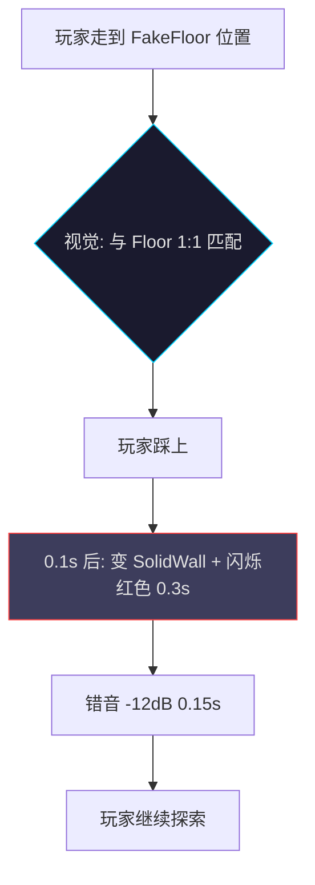
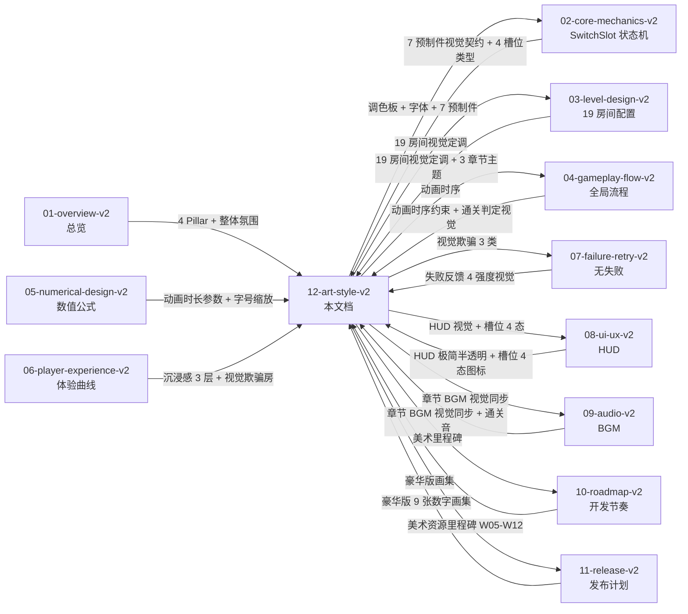

# 《暗室》美术风格规范 v2

> **一句话定位：** Dead Cells × Gorogoa × 废弃设施的 2D 极简半透明风格 — 冷色调石墨底色 + 青色/橙色光斑点缀 + 拓扑重构的视觉惊喜 + 7 预制件 4 态视觉契约 + 色盲 3 档 + 19 房间 × 3 章节主题色温。

## 目的 (Purpose)

本文档是《暗室》**美术层**的权威定义。它向美术总监、Unity 工程师、关卡策划、UI 设计师、动画师、测试玩家**用 30 分钟讲清**：

- **艺术风格定义** — 4 大 Pillar（沉浸感 / 拓扑重构惊喜 / 视觉欺骗 / 一致性）
- **视觉语言** — Dead Cells × Gorogoa × 废弃设施的 3 大参考融合
- **色彩调色板** — 12 主色（章节色 + 强调色 + 中性色 + 状态色）+ 色盲 3 档替代
- **光影设计** — 左上 45° 主光 + 槽位光 + 出口光 + 雾效 + 章节光强
- **角色设计** — 玩家精灵（青色光点）+ 出口指示（橙色脉冲）
- **场景设计** — 3 章节主题色温 + 19 房间视觉 + 7 预制件视觉契约
- **UI 视觉** — HUD 极简半透明 + 槽位 4 态图标 + 菜单视觉规范
- **动画原则** — 12 原则 + 200ms 切换动画 + 300ms 重置动画 + 200ms 通关渐白
- **美术资源方案** — 白盒/过渡/正式期 3 阶段 + Kenney.nl CC0 + 自制 7 预制件
- **视觉欺骗** — FakeFloor / CrumblingFloor / 镜像 3 类欺骗的视觉实现
- **与 02-11 文档关联** — 美术层引用关系图（Mermaid + 引用表）

其他 11 份文档以本文档为**美术层基线**：违反本定义的颜色、字体、动画、预制件视觉实现视为美术偏差。

**本版本（v2.0）的目的：** 把 66 行的 v1 草稿（仅列 5.1 视觉风格 + 调色板 + 美术资源 + Unity 技术方案）整改为 ≥ 350 行的"可执行美术规格"，作为开发期的视觉施工蓝图。

## 范围 (Scope)

### 包含

- **艺术风格定义** — 4 Pillar + 3 大参考融合 + 整体氛围
- **视觉语言** — 摄影角度 / 线条 / 形状 / 纹理 / 节奏
- **色彩调色板** — 12 主色（章节色 + 强调色 + 中性色 + 状态色）+ 色盲 3 档
- **光影设计** — 左上 45° 主光 + 槽位光 / 出口光 / 雾效 / 章节光强
- **角色设计** — 玩家精灵 + 出口指示 + 章节主题色
- **场景设计** — 3 章节主题色 + 19 房间视觉定调 + 7 预制件视觉契约
- **UI 视觉** — HUD 极简半透明 + 槽位 4 态图标 + 菜单视觉规范
- **动画原则** — 12 原则 + 关键时序约束 + 缓动函数
- **美术资源方案** — 3 阶段路径 + Kenney.nl CC0 + 自制 7 预制件 + 字体规范
- **视觉欺骗** — FakeFloor / CrumblingFloor / 镜像 3 类视觉实现
- **色盲无障碍** — 3 档色盲模式 + 图案 + 形状叠加
- **配置表** — 调色板 / 字号 / 网格 / 动画 / 色盲 / 雾效 6 类参数
- **边界条件** — 8+ 条美术 edge case
- **关联代码模块** — 16 个美术相关模块

### 不包含 (Out of Scope)

- SwitchSlot 状态机实现 → 见 `02-core-mechanics-v2.md`
- 19 房间具体关卡配置 → 见 `03-level-design-v2.md`
- 全局游戏状态机 → 见 `04-gameplay-flow-v2.md`
- 数值公式与调参策略 → 见 `05-numerical-design-v2.md`
- 玩家体验曲线 → 见 `06-player-experience-v2.md`
- "无失败"设计决策 → 见 `07-failure-retry-v2.md`
- HUD 与 UI 布局 / 槽位 UI 4 态 → 见 `08-ui-ux-v2.md`
- 章节 BGM 与音频 → 见 `09-audio-v2.md`
- 开发路线图 → 见 `10-roadmap-v2.md`
- 运营发布计划 → 见 `11-release-v2.md`

## 1. 艺术风格定义 (Art Style Pillars)

### 1.1 4 大 Pillar（设计核心原则）

| # | Pillar | 含义 | 视觉体现 | 引用 |
|---|--------|------|---------|------|
| **P1** | **沉浸感** | 玩家"进入"废弃设施而非"观看"它 | 第一人称视效 + 左上 45° 光 + 远处雾效 | 06 §11.1 沉浸感 3 层 |
| **P2** | **拓扑重构惊喜** | 切换动画是核心体验"顿悟"时刻的视觉放大 | 200ms 切换 + 旧预制件淡出 + 新预制件淡入 | 02 §7.2 切换时序 |
| **P3** | **视觉欺骗** | Ch3 引入"视觉对称 ≠ 逻辑对称"颠覆 | FakeFloor 1:1 像素匹配 + CrumblingFloor 视觉提示 | 02 §10.6 视觉欺骗 + 03 §11 视觉欺骗房 |
| **P4** | **一致性** | 19 房间视觉风格统一（章节内统一，章节间渐进）| 3 章节色温渐进 + 调色板不变 + 字体不变 | 01 §核心特色 |

> **设计意图：** 4 Pillar 共同构成"我在这里、我在思考、我被骗了、但我信任这个游戏"的核心体验。

### 1.2 3 大参考融合

> **设计原则：** 不是"模仿 X 游戏"，而是"提取 X 游戏的 1 个核心特征"。

| 参考 | 提取特征 | 在《暗室》中的体现 |
|------|--------|------------------|
| **Dead Cells** | 2D 半透明光照 + 暗色背景 + 高对比度强调色 | 章节主色 + 槽位/出口高亮 + UI 半透明面板 |
| **Gorogoa** | 空间切换的"啊哈"瞬间 + 极简画面 | 200ms 切换动画 + 无干扰背景 + 拓扑变换为唯一焦点 |
| **废弃设施氛围**（Half-Life / Inside / Hollow Halls）| 神秘感 + 探索感 + 单色调 | 冷色调石墨色 + 远处雾效 + 远处机械声暗示 |

> **设计意图：** 3 参考不是"风格拼贴"而是"功能互补"——Dead Cells 提供**视觉对比**，Gorogoa 提供**空间表达**，废弃设施提供**氛围沉浸**。

### 1.3 整体氛围关键词

> 与 `03-level-design-v2.md` §3.3 章节主题与美术定调 对齐。

| 维度 | Ch1 觉醒 | Ch2 深掘 | Ch3 迷途 | 通关 |
|------|---------|---------|---------|------|
| **关键词** | 好奇 / 明亮 / 引入 / 平静 | 思考 / 压抑 / 深入 / 神秘 | 迷失 / 颠覆 / 欺骗 / 突破 | 释然 / 温暖 / 成就 |
| **色温** | 冷色偏暖 | 冷色加深 | 强光影对比 | 暖色（特殊）|
| **背景色** | #1A1A2E | #15152A | #0E0E1F | #1A1A2E + 暖色光 |
| **主光角度** | 左上 45° | 局部动态光 | 单光源 + 强对比 | 全方位柔光 |
| **雾效强度** | 弱（5% 透明度）| 中（15% 透明度）| 强（30% 透明度）| 弱 |
| **BGM 情绪** | Ambient + 明快 | Ambient + 低沉 | 悬疑 + 节奏感 | 温暖 + 上升 |

## 2. 视觉语言 (Visual Language)

### 2.1 摄影角度

| 角度 | 用途 | 实现 |
|------|------|------|
| **2D 侧视** | 房间内主视角 | Unity 2D Orthographic Camera |
| **镜头固定** | 不移动、不旋转 | 单朝向（左→右）|
| **FOV** | 标准 60° | Orthographic Size = 5.4（720p）/ 10.8（1080p）|

> **设计意图：** 镜头固定 = 玩家不会"眩晕" = 专注解谜。

### 2.2 线条与形状

| 元素 | 风格 | 用途 |
|------|------|------|
| **线稿** | 1px 干净硬边（无抗锯齿柔化）| 预制件轮廓（SolidWall / Floor / Door）|
| **几何** | 矩形（房间）/ 圆形（玩家）/ 菱形（条件槽位）| 简化符号化 |
| **角度** | 90° 直角为主（房间网格）| 强化"网格解谜"感 |
| **圆角** | 4-8px（小元素）/ 12px（大面板）| UI 圆角统一 |

### 2.3 纹理与材质

| 元素 | 风格 | 用途 |
|------|------|------|
| **背景** | 平涂（无纹理）| 避免分散注意力 |
| **预制件** | 平涂 + 1px 描边 | 强调剪影 |
| **光斑** | 径向渐变（中心 100% → 边缘 0%）| 槽位光 / 出口光 |
| **雾效** | 线性渐变（左 0% → 右 30%）| 营造空间深度 |
| **粒子** | 极少使用（仅通关瞬间）| 避免视觉污染 |

> **设计原则：** **平涂 + 渐变 + 描边**——3 种基础元素覆盖 90% 视觉，避免纹理爆炸。

### 2.4 视觉节奏

| 维度 | 频率 | 用途 |
|------|------|------|
| **静帧** | ≥ 80% 时间 | 玩家观察/思考 |
| **切换动画** | 0.20s 一次性 | 顿悟时刻 |
| **重置动画** | 0.30s 一次性 | 重置反馈 |
| **通关渐白** | 0.50s 一次性 | 通关反馈 |
| **章节 BGM 切换** | 2-3s 渐入渐出 | 章节过渡 |
| **粒子** | 通关瞬间 1s | 庆祝反馈 |

> **设计意图：** **静帧主导**——玩家大部分时间在"看"和"想"，动画只是"提示信号"。

## 3. 色彩调色板 (Color Palette)

### 3.1 12 主色定义

> **设计原则：** 调色板**不变**（19 房间一致），**仅章节背景色温 + 光强 + 雾效**变化（章节级差异）。

| # | 类别 | 色名 | 色值 | 用途 | 章节 |
|---|------|------|------|------|------|
| **C1** | 背景 | 深石板蓝 | #1A1A2E | Ch1 背景 / 通用深色 | Ch1 |
| **C2** | 背景 | 深紫蓝 | #15152A | Ch2 背景 | Ch2 |
| **C3** | 背景 | 暗夜蓝 | #0E0E1F | Ch3 背景 | Ch3 |
| **C4** | 中性 | 石墨灰 | #2D2D44 | 地板（Floor）| 全部 |
| **C5** | 中性 | 雾灰 | #3D3D5C | 实墙（SolidWall）| 全部 |
| **C6** | 强调 | 青色 | #00D4FF | 槽位发光 / 主强调色 | 全部 |
| **C7** | 强调 | 橙色 | #FF9500 | 出口发光 / 暖色强调 | 全部 |
| **C8** | 文字 | 浅灰 | #E0E0E0 | 主文字 / UI | 全部 |
| **C9** | 状态 | 暗灰 | #555555 | 未激活 / Locked | 全部 |
| **C10** | 状态 | 暗红 | #FF4444 | 警告 / 错音 / FakeFloor 闪烁 | 全部 |
| **C11** | 状态 | 暗金 | #FFD700 | 章节完成 / 成就 | 全部 |
| **C12** | 状态 | 透明黑 | rgba(0,0,0,0.6) | UI 半透明面板 | 全部 |

> **3 章节色温：** Ch1 偏暖（#1A1A2E 冷色底 + 暖色光斑）/ Ch2 冷加深（#15152A）/ Ch3 强对比（#0E0E1F 极暗 + 强光斑）。

### 3.2 7 预制件调色板（与 02 §3 预制件类型对齐）

| 预制件 | 主色 | 描边 | 透明度 | 章节变化 | 视觉契约 |
|--------|------|------|:-----:|---------|---------|
| **SolidWall** | #3D3D5C | #1A1A2E 1px | 100% | 无 | 不可通行的暗灰方块 |
| **Floor** | #2D2D44 | 无 | 100% | 无 | 可通行的地板 |
| **Door** | #5D4D2D（关） / #2D2D44（开）| #FF9500 1px（开）| 100% | Ch3 暗化 | 关闭阻挡，开启通道 |
| **GlassWall** | rgba(0,212,255,0.3) | #00D4FF 1px | 30% | 无 | 半透明蓝，可通行但视觉阻挡 |
| **CrumblingFloor** | #2D2D44 + 裂纹纹理 | #888888 1px | 100% | 视觉提示 | 0.5s 后碎裂消失 |
| **FakeFloor** | **#2D2D44（与 Floor 完全相同）**| 无 | 100% | 视觉欺骗 | 1:1 像素匹配 Floor，踩上才暴露 |
| **PressurePlate** | #FF9500 + 圆形 | #FF9500 1px | 80% | 无 | 踩下时触发联动事件 |

### 3.3 色盲 3 档替代色

> 与 `06-player-experience-v2.md` §10.1 色盲模式对齐 + `08-ui-ux-v2.md` §6.1。

| 档位 | C6 槽位发光 | C7 出口发光 | C10 警告 | 强化对比 | 适用 |
|------|-----------|-----------|---------|---------|------|
| **正常 (Normal)** | #00D4FF 青色 | #FF9500 橙色 | #FF4444 红色 | 标准 | 正常视觉 |
| **红绿色盲 (Deuteranopia / Protanopia)** | #0099FF 蓝色 | #FFCC00 黄色 | #FF8800 深橙 | 蓝黄对比 | 8% 男性 |
| **全色盲 (Monochromacy)** | #FFFFFF 白色 + ▢ 图案 | #FFFF00 黄色 + ◇ 图案 | #CCCCCC 灰 + ⚠ 图案 | **图案 + 形状** | < 1% |

> **关键设计：** 全色盲**完全依赖图案 + 形状**——不仅是颜色替代。

## 4. 光影设计 (Lighting Design)

### 4.1 主光设置

| 维度 | 规格 | 用途 |
|------|------|------|
| **方向** | 左上 45°（标准 2D 主光）| 全局主光 |
| **强度** | 0.6（Ch1）/ 0.4（Ch2）/ 0.3（Ch3 极暗）| 章节光强 |
| **颜色** | #FFFFFF（中性白）| 不染色（让章节背景色温决定氛围）|
| **阴影** | 无（2D 无硬阴影）| 用色阶差代替 |
| **实现** | Unity 2D Light + URP 2D Renderer | 性能 + 视觉 |

> **设计意图：** 主光角度**始终**左上 45°（不随章节变化），但**强度递减**——Ch3 极暗以强化视觉欺骗。

### 4.2 局部光（动态光）

| 光源 | 颜色 | 强度 | 触发 | 范围 | 引用 |
|------|------|:---:|------|------|------|
| **槽位光（Hover）** | #00D4FF 青色 | 1.0 | 玩家进入 trigger 区 | 2 格半径 | 02 §2.1 Idle → Hover |
| **槽位光（Switching）** | #00D4FF 青色（实色，无脉冲）| 1.0 | 玩家按 E 切换 | 2 格半径 | 02 §2.1 Switching |
| **槽位光（Disabled）** | #555555 暗灰 | 0.3 | ConditionalSlot 依赖丢失 | 2 格半径 | 02 §2.1 Locked |
| **出口光（连通）** | #FF9500 橙色 | 1.5（脉冲）| 路径连通 | 3 格半径 | 02 §6.3 通关判定 |
| **出口光（未连通）** | #555555 暗灰 | 0.5 | 路径未连通 | 3 格半径 | 02 §6.3 |
| **玩家光** | #00D4FF 青色 | 0.6（恒定）| 玩家存在 | 0.5 格半径 | — |

> **关键设计：** 槽位光**始终是青色**（强调色），出口光**始终是橙色**（暖色），形成"冷=交互 / 暖=目标"的视觉直觉。

### 4.3 雾效（章节级）

| 章节 | 雾效颜色 | 透明度 | 渐变方向 | 用途 |
|------|---------|:-----:|---------|------|
| **Ch1 觉醒** | #1A1A2E | 5% | 左→右 0%→5% | 营造轻度空间感 |
| **Ch2 深掘** | #15152A | 15% | 左→右 0%→15% | 营造压抑感 |
| **Ch3 迷途** | #0E0E1F | 30% | 左→右 0%→30% | 营造迷失感（看不清远处）|

> **设计意图：** 雾效**不遮挡玩家视野中心**（仅在屏幕边缘），但**遮挡房间出口附近**——制造"必须走近才能看清"的探索感。

### 4.4 章节光强曲线

```
Ch1 (1-1 ~ 1-5):  强度 0.6（明亮）
Ch2 (2-1 ~ 2-6):  强度 0.4（中等）
Ch3 (3-1 ~ 3-8):  强度 0.3（极暗，Boss 房 0.2）
```

> **关键设计：** 章节光强**单调递减**——玩家从 Ch1 到 Ch3 视觉上"越走越深"。

## 5. 角色设计 (Character Design)

### 5.1 玩家精灵

| 维度 | 规格 | 备注 |
|------|------|------|
| **形状** | 圆形（直径 12px / 16px / 20px 三档对应 100% / 125% / 150% 字号）| 简化符号化 |
| **颜色** | #00D4FF 青色 | 与槽位发光同色（强调"我是探索者"）|
| **光晕** | 半径 0.5 格的径向渐变（#00D4FF 100% → 0%）| 玩家位置始终有微光 |
| **朝向** | 单一（无方向）| 2D 极简 |
| **动画** | 移动时 0.1s 拉伸（X+1.1, Y-0.95）| 简化跑步感 |
| **Idle 动画** | 0.5s 呼吸缩放（1.0 → 1.05 → 1.0）| "活着"的感觉 |

### 5.2 出口指示

| 状态 | 视觉 | 触发 |
|------|------|------|
| **未连通** | #555555 暗灰方块 + 0.5 强度 | 路径未连通 |
| **连通** | #FF9500 橙色方块 + 1.5 强度脉冲（1.0s 周期）| 路径连通 |
| **已通关** | 白光闪烁 0.5s + 屏幕渐白 0.5s | 玩家走到出口 |

### 5.3 角色尺寸

```
玩家精灵：12-20px 直径（与字号档位同步）
槽位：24px × 24px（Idle 不可见 / Hover 全显示）
出口：32px × 32px
SolidWall：32px × 32px（标准格）
Floor：32px × 32px（标准格）
Door：32px × 64px（双格高）
PressurePlate：32px × 32px（圆形）
```

> **设计意图：** 玩家 < 槽位 < 出口 < 墙 = 视觉层级清晰，玩家永远是焦点。

## 6. 场景设计 (Scene Design)

### 6.1 3 章节场景主题

> 与 `03-level-design-v2.md` §3.3 章节主题与美术定调 对齐。

| 章节 | 名称 | 主色 | 关键色 | 场景元素 | 雾效 | 主光 |
|------|------|------|--------|---------|:---:|:---:|
| **Ch1 觉醒** | First Light | #1A1A2E 深石板蓝 | 暖色光斑 | 走廊 + 实验室 + 休息室 | 5% | 0.6 |
| **Ch2 深掘** | Deep Dig | #15152A 深紫蓝 | 局部动态光 | 地下 + 机械室 + 控制室 | 15% | 0.4 |
| **Ch3 迷途** | Lost Path | #0E0E1F 暗夜蓝 | 强光斑 | 镜像室 + 迷宫 + 终极室 | 30% | 0.3 |

### 6.2 19 房间视觉差异（章节内 + 章节间）

> 与 `03-level-design-v2.md` §5 19 房间配置表 对齐。

| 房间 | 章节 | 视觉特殊点 | 难度 | 视觉密度 |
|------|------|----------|:----:|:-------:|
| **1-1** | Ch1 | 明亮 + 暖色光斑 | 2 | 极简 |
| **1-2** | Ch1 | 暖色 + 双发光源 | 3 | 简单 |
| **1-3** | Ch1 | 暖色 + 出口光显著 | 5 | 简单 |
| **1-4** | Ch1 | 节奏减弱（光强 -10%）| 3 | 简单（喘息房）|
| **1-5** | Ch1 | 章节高潮（光强 +20% 短暂）| 5 | 中等 |
| **2-1** | Ch2 | 局部动态光（条件光）| 7 | 中等 |
| **2-2** | Ch2 | 顺序依赖光链 | 10 | 中等 |
| **2-3** | Ch2 | 锁链光（多个光点串联）| 9 | 中等 |
| **2-4** | Ch2 | 门控光（Door 关闭时亮）| 12 | 中等 |
| **2-5** | Ch2 | 复合光（多源）| 16 | 复杂 |
| **2-6** | Ch2 | 节奏减弱（光强 -20%）| 8 | 中等（喘息房）|
| **3-1** | Ch3 | 极暗 + 复习光 | 13 | 复杂 |
| **3-2** | Ch3 | 双向 CDS 联动光 | 16 | 复杂 |
| **3-3** | Ch3 | 极暗 + 视觉欺骗（3-3 首次 FakeFloor）| 16 | 复杂 |
| **3-4** | Ch3 | 镜像光（对称布局）| 16 | 复杂 |
| **3-5** | Ch3 | 伪装 + CrumblingFloor | 16 | 极复杂 |
| **3-6** | Ch3 | 迷宫（多路径）| 20 | 极复杂 |
| **3-7** | Ch3 | Boss 房上（光强 0.25）| 20 | 极复杂 |
| **3-8** | Ch3 | Boss 房下（光强 0.2 + 独立 BGM）| 20 | 极复杂 |

### 6.3 7 预制件视觉契约（美术实现规范）

> 与 `02-core-mechanics-v2.md` §3 预制件类型 对齐。

#### 6.3.1 SolidWall 实墙

```
视觉：深灰方块（#3D3D5C）+ 1px 描边（#1A1A2E）
尺寸：32px × 32px
光影：主光左侧 0.6 强度 / 右侧 0.3 强度（2D 色阶模拟）
动画：无（静态）
```

#### 6.3.2 Floor 地板

```
视觉：石墨灰（#2D2D44）+ 无描边
尺寸：32px × 32px
光影：均匀（0.5 强度）
动画：无（静态）
```

#### 6.3.3 Door 机关门

```
关闭状态：#5D4D2D（暖棕）+ 1px 橙色描边
开启状态：#2D2D44（与 Floor 相同）+ 0.5 强度青色光晕
过渡：0.2s 淡入淡出（与 02 §3.1 切换动画同步）
触发：ConditionalSlot 依赖满足时切换
```

#### 6.3.4 GlassWall 透明墙

```
视觉：rgba(0,212,255,0.3) + 1px 青色描边
尺寸：32px × 32px
行为：可通行（isWalkable = true）+ 视觉阻挡（半透明）
用途：Ch2+ 视觉暗示（玩家看见但需绕路）
```

#### 6.3.5 CrumblingFloor 碎裂地板

```
视觉：#2D2D44（与 Floor 相同）+ 裂纹纹理叠加
触发：玩家踩上 0.5s 后碎裂消失
动画：碎裂粒子（10 块小方块向下飞散 0.3s）
不可逆：重置后才恢复
```

#### 6.3.6 FakeFloor 伪装地板

```
视觉：#2D2D44（与 Floor 完全 1:1 像素匹配）
触发：玩家踩上 → 0.1s 后变 SolidWall + 闪烁红色 0.3s + 错音
设计意图：1:1 像素匹配 = 玩家必须"试错"才能发现
学习机制：玩家通过视觉反馈理解"看起来一样但实际不同"
```

#### 6.3.7 PressurePlate 压力板

```
视觉：橙色圆形（#FF9500 80% 透明度）+ 1px 橙色描边
触发：玩家踩下 → 激活联动事件（如解锁 LockedSlot）
动画：踩下 0.2s 缩放（1.0 → 0.9 → 1.0 表示"被踩"）
```

### 6.4 视觉欺骗 3 类（Ch3 核心）

> 与 `02-core-mechanics-v2.md` §10.6 视觉欺骗反馈 + `03-level-design-v2.md` §11 视觉欺骗房 对齐。

| # | 类型 | 房间 | 视觉实现 | 玩家学习路径 |
|---|------|------|---------|------------|
| **VD-1** | **FakeFloor（伪装地板）** | 3-3 / 3-4 | 1:1 像素匹配 Floor + 踩上闪烁红色 | 玩家试错 → 学习"看 = 试" |
| **VD-2** | **CrumblingFloor（碎裂地板）** | 3-5 / 3-6 | 与 Floor 视觉相似 + 裂纹纹理 + 0.5s 碎裂 | 玩家主动观察裂纹 → 学习"纹理 = 危险" |
| **VD-3** | **镜像（视觉对称 ≠ 逻辑对称）** | 3-4 | 房间镜像布局 + 槽位视觉对称但配置不同 | 玩家基于直觉推理 → 失败 → 学习"看 ≠ 对" |

> **关键设计：** 视觉欺骗**不惩罚**玩家（无失败状态），仅"闪烁 + 错音"作为反馈（与 07-v2 §7 失败反馈机制对齐）。

## 7. UI 视觉规范 (UI Visual Spec)

> 与 `08-ui-ux-v2.md` §3 槽位 UI 4 态 + §4 菜单系统 对齐。

### 7.1 HUD 极简半透明原则

```
┌─────────────────────────────────────────┐
│ Ch1-3/5                            ⚙  │  ← 半透明黑 rgba(0,0,0,0.6) + 4px backdrop blur
│                                         │
│                                         │
│         （房间区，无 UI 遮挡）              │
│                                         │
│                          ●玩家          │
│                                         │
│                              [出口]     │
└─────────────────────────────────────────┘
```

| 元素 | 视觉 | 位置 | 字号 |
|------|------|------|------|
| **房间名** | #E0E0E0 / 18px | 左上 (2%, 4%) | 默认 18px / 22px (125%) / 27px (150%) |
| **章节进度** | #00D4FF / 12px | 左上 (2%, 9%) | 默认 12px / 15px (125%) / 18px (150%) |
| **设置按钮** | #E0E0E0 圆形 24px | 右上 (92%, 4%) | — |
| **小键盘提示** | #E0E0E0 / 12px | 右下 (95%, 95%) | 默认 12px |
| **槽位提示浮动框** | rgba(0,0,0,0.7) + 4px blur | 屏幕中下 30% | 14px (默认) |

### 7.2 槽位 4 态视觉契约（与 08 §3.1 对齐）

| 状态 | 视觉 | 触觉 | 玩家可操作？ |
|------|------|:----:|:----------:|
| **normal** | ❌ 不可见 | ❌ | ❌ |
| **hover** | 100% 不透明 + 青色脉冲 1.0s 周期 + 2px 青色边框 + 槽位类型图标 | ❌ | ✅ |
| **disabled** | 50% 不透明 + 灰色 + 锁图标 🔒 | ❌ | ❌ |
| **active** | 100% 不透明 + 青色实色（无脉冲）+ 2px 青色边框 + 旋转动画 0.2s | ✅ 50ms 震动 | ❌（动画锁定）|

### 7.3 4 槽位类型图标

| 槽位类型 | 图标 | 主色 | 边框样式 |
|---------|------|------|---------|
| **ToggleSlot (TS)** | ◯ (圆形 2 选 1) | #00D4FF 青色 | 实线 2px |
| **CycleSlot (CS)** | ⇆ (箭头循环) | #00D4FF 青色 | 虚线 2px |
| **ConditionalSlot (CDS)** | ◇ (菱形 条件) | #FF9500 橙色 | 实线 2px |
| **LockedSlot (LS)** | 🔒 (锁形) | #888888 灰色 | 实线 2px |

### 7.4 字体规范

| 语言 | 字体 | 来源 | 授权 |
|------|------|------|------|
| **英文 (en-US)** | Inter (Variable) | Google Fonts | OFL 1.1 免费商用 |
| **简体中文 (zh-CN)** | 思源黑体 (Noto Sans CJK SC) | Google Fonts | OFL 1.1 免费商用 |
| **繁体中文 (zh-TW)** | 思源黑体 TC | Google Fonts | OFL 1.1 免费商用 |
| **日文 (ja)** | Noto Sans JP | Google Fonts | OFL 1.1 免费商用 |
| **韩文 (ko)** | Noto Sans KR | Google Fonts | OFL 1.1 免费商用 |

> **设计原则：** 5 语种**全部用 Noto 家族**——免费 + 一致 + 跨平台。

### 7.5 字号缩放 3 档

| 档位 | HUD | 槽位提示 | 菜单 | 适用 |
|------|:---:|:-------:|:----:|------|
| **100% (默认)** | 12-18px | 14px | 24px | 正常 |
| **125%** | 15-22px | 17.5px | 30px | 轻度视觉障碍 |
| **150%** | 18-27px | 21px | 36px | 中度视觉障碍 |

> **字号缩放规则：** 仅影响 UI 文字，**不影响房间区**（与 08-v2 §6.2 对齐）。

## 8. 动画原则 (Animation Principles)

### 8.1 12 动画原则（迪士尼经典 + 2D 简化）

> **设计原则：** 12 原则**全部应用**但**简化**（避免过度动画化）。

| # | 原则 | 在《暗室》中的体现 |
|---|------|------------------|
| **AP-1** 挤压拉伸 | 玩家移动时 0.1s 拉伸（X+1.1, Y-0.95）|
| **AP-2** 预备动作 | 切换前 0.05s 槽位轻微收缩（提示"即将变化"）|
| **AP-3** 演出布局 | 切换动画聚焦于槽位（其他元素 50% 透明度 0.1s）|
| **AP-4** 跟随动作 | 切换完成后 0.1s 视觉残像（淡出 0.05s）|
| **AP-5** 慢入慢出 | 切换动画 0.20s 缓动（EaseInOutQuad）|
| **AP-6** 弧形运动 | 出口光脉冲用 sin 曲线（自然呼吸感）|
| **AP-7** 附属动作 | 切换后出口光强度 +30%（强化"我做到了"）|
| **AP-8** 节奏 | 0.20s 切换 = 60 FPS × 12 帧（标准 1 个 beat）|
| **AP-9** 夸张 | 章节高潮（1-5 通关）光强 +20% 短暂 1s |
| **AP-10** 立体感 | 2D 极简（无 3D 透视）|
| **AP-11** 吸引力 | 槽位光恒定（始终吸引玩家）|
| **AP-12** 简洁 | 静帧主导（≥ 80% 时间无动画）|
### 8.2 关键时序约束

| 动画 | 时长 | 缓动函数 | 阻塞玩家输入？ | 引用 |
|------|------|---------|:------------:|------|
| **切换动画（Switching）** | 200ms ± 50ms | EaseInOutQuad | ✅ | 02 §7.2 |
| **重置动画（Reset）** | 300ms ± 50ms | EaseInQuad | ✅ | 04 §6.3 |
| **通关渐白（Win）** | 500ms | Linear | ❌（透明 UI 仍可点）| 04 §3 |
| **章节过渡（黑屏）** | 2000ms | Linear | ❌ | 04 §7.3 |
| **章节标题画面** | 3000ms | EaseInOut | ❌ | 04 §7.3 |
| **房间加载** | ≤ 1000ms | Linear | ❌ | 04 §2.2 |
| **HUD 淡入** | 500ms | EaseOutQuad | ❌ | 08 §2.1 |
| **HUD 淡出** | 300ms | EaseInQuad | ❌ | 08 §2.1 |
| **槽位提示淡入** | 300ms | EaseOutQuad | ❌ | 08 §3.3 |
| **槽位提示淡出** | 500ms | EaseInQuad | ❌ | 08 §3.3 |
| **通关音** | 0.50s 一次性 | — | ❌ | 09 §1.4 |
| **错音** | 0.15-0.20s 一次性 | — | ❌ | 09 §1.5 |

> **设计意图：** 所有动画 ≤ 500ms——避免打断"顿悟节奏"。

### 8.3 缓动函数表

| 缓动 | 公式 | 用途 |
|------|------|------|
| **Linear** | t | 通关渐白 / 章节过渡 |
| **EaseInQuad** | t² | 淡出 / 重置（开始快）|
| **EaseOutQuad** | 1-(1-t)² | 淡入 / 加载（结束快）|
| **EaseInOutQuad** | t<0.5 ? 2t² : 1-2(1-t)² | 切换动画（首尾平滑）|
| **EaseOutBack** | 1+2.7*(t-1)³+1.7*(t-1)² | 通关庆祝（轻微回弹）|

## 9. 美术资源方案 (Art Asset Pipeline)

### 9.1 3 阶段路径

| 阶段 | 时间 | 方案 | 成本 | 适用 |
|------|------|------|:----:|------|
| **原型期 (Prototype)** | W01-W04 | Unity 内置 Primitives + Colored White Box | $0 | 1-1 ~ 2-6 内部测试 |
| **过渡期 (Transition)** | W05-W08 | Kenney.nl 2D Platformer Pack + CC0 资源 | $0 | 19 房间 Beta |
| **正式期 (Polish)** | W09-W12 | 自制 7 预制件 + 数字画集 | $0-500 | Steam 1.0 |

> **设计原则：** **白盒先**——确保玩法可玩后再投入美术。**v1.0 不追求 AAA 美术**——风格统一 > 精致。

### 9.2 Kenney.nl CC0 资源清单（v1.0 正式期）

| 资源 | 用途 | 文件 |
|------|------|------|
| **2D Platformer Pack** | 7 预制件 + 玩家精灵 | `kenney_2dplatformer.zip` |
| **UI Pack** | HUD + 菜单 | `kenney_ui.zip` |
| **Particle Pack** | 通关粒子 | `kenney_particles.zip` |
| **Audio Pack** | 切换音 / 错音 | `kenney_audio.zip` |

> **授权：** CC0（公共领域贡献）—— 无署名要求 + 商用 + 修改 + 全部权利。

### 9.3 自制 7 预制件清单（v1.0 正式期）

| 预制件 | 美术来源 | 工时 | 引用 |
|--------|---------|:---:|------|
| **SolidWall** | Kenney + 自制调色 | 1h | 02 §3 |
| **Floor** | Kenney + 自制调色 | 1h | 02 §3 |
| **Door** | Kenney + 自制调色 + 开/闭 2 sprite | 2h | 02 §3 |
| **GlassWall** | 自制（半透明 shader）| 2h | 02 §3 |
| **CrumblingFloor** | 自制（裂纹纹理 + 碎裂动画）| 4h | 02 §3 |
| **FakeFloor** | 自制（与 Floor 1:1 匹配）| 2h | 02 §3 |
| **PressurePlate** | 自制（圆形 + 缩放动画）| 2h | 02 §3 |
| **合计** | — | **14h** | — |

> **关键设计：** FakeFloor 必须**与 Floor 1:1 像素匹配**——这是"视觉欺骗"的核心约束。

### 9.4 数字画集 9 张（豪华版 DLC）

> 与 `11-release-v2.md` §2.1 豪华版 $7.99 对齐。

| 画集 | 内容 | 工时 | 章节 |
|------|------|:---:|------|
| **Ch1 画集 3 张** | 1-1 / 1-3 / 1-5 房间美术图 | 4h | Ch1 |
| **Ch2 画集 3 张** | 2-1 / 2-4 / 2-5 房间美术图 | 4h | Ch2 |
| **Ch3 画集 3 张** | 3-3 / 3-5 / 3-8 房间美术图 | 6h | Ch3 |
| **合计** | — | **14h** | — |

> **风格：** 静态高清渲染（1080p）+ 暗色调 + 极简元素。

### 9.5 美术工具链

| 用途 | 工具 | 成本 |
|------|------|:----:|
| **2D 像素/矢量绘图** | Aseprite / Inkscape | $20 (一次性) / $0 (开源) |
| **Unity Tilemap 编辑** | Unity Tilemap Editor (内置) | $0 |
| **粒子效果** | Unity Particle System (内置) | $0 |
| **2D 光照** | Unity 2D Light + URP 2D Renderer | $0 |
| **动画** | Unity Animator + DOTween (MIT) | $0 |
| **色盲模拟** | Sim Daltonism / Coblis | $0 |
| **截图 / 录屏** | Unity Game View + OBS | $0 |
| **资源管理** | Addressable Assets | $0 |

> **关键设计：** 美术工具链**总成本 ≤ $20**（仅 Aseprite 一次性）——符合 1 人 Solo 预算。

## 10. 视觉欺骗详细设计 (Visual Deception Details)

### 10.1 FakeFloor 视觉实现



> **关键约束：** FakeFloor 在 0.1s 之前**与 Floor 视觉完全一致**——玩家必须"试错"才能发现。

### 10.2 CrumblingFloor 视觉实现

```
Idle: #2D2D44 + 裂纹纹理（5 条灰色 #888888 1px 曲线）
玩家踩上: 0.2s 缩放 1.0 → 0.9（提示"快碎了"）
0.5s 后: 碎裂动画 0.3s（10 块小方块向下飞散）
消失: 完全不可见（isWalkable = false）
重置: 恢复初始状态（可重新踩）
```

### 10.3 镜像欺骗（3-4 房间）

```
布局: 房间左右对称（视觉上）
槽位 A: 在左侧 → 配置正确
槽位 B: 在右侧（视觉上）→ 配置错误（看起来对称但实际不同）
玩家推理: "镜像位置应该和左对称" → 失败
学习: "看 ≠ 对，验证才是关键"
```

> **设计意图：** 镜像欺骗**只影响玩家推理路径**，**不惩罚玩家**（无失败状态）。

### 10.4 视觉欺骗反馈分级

> 与 `07-failure-retry-v2.md` §7.2 失败反馈 4 强度 对齐。

| 强度 | 视觉 | 音效 | 触发 | 房间 |
|:----:|------|------|------|------|
| **L1 轻** | 无额外视觉 | 切换音 -12dB | 1 次切换错 | 全房间 |
| **L2 中** | FakeFloor 闪烁红色 0.3s | 错音 -12dB | 踩 FakeFloor | Ch3 |
| **L3 重** | CrumblingFloor 碎裂动画 | 错音 ×2 | 踩碎地板 | Ch3 |
| **L4 兜底** | 槽位暗淡脉冲 -50% | 静音 | 切换 > 30 次 | Ch3 Boss |

## 11. 与 02-11 文档关联 (Cross-References)

### 11.1 关联关系图



### 11.2 与 02-11 引用关系表

| 本文档章节 | 引用文档 | 引用内容 | 引用说明 |
|----------|---------|---------|---------|
| §1 艺术风格定义 | 01 §"核心特色" | 4 Pillar 与核心特色对齐 |
| §3.2 7 预制件调色板 | 02 §3 预制件类型 | 视觉契约与机制契约对齐 |
| §4 光影设计 | 02 §2.1 Idle/Hover/Switching | 槽位光状态与机制状态对齐 |
| §6.2 19 房间视觉 | 03 §5 房间配置表 | 19 房间视觉与配置表对齐 |
| §6.3 7 预制件视觉契约 | 02 §3 预制件类型 | 视觉实现与机制定义对齐 |
| §6.4 视觉欺骗 3 类 | 02 §10.6 视觉欺骗 + 03 §11 视觉欺骗房 | 视觉欺骗房与机制边界对齐 |
| §7 UI 视觉 | 08 §3 槽位 4 态 + §4 菜单系统 | HUD 与槽位图标与 08 完全对齐 |
| §7.4 字体规范 | 08 §9 本地化 | 字体与本地化对齐 |
| §7.5 字号缩放 | 06 §10.2 + 08 §6.2 | 字号与无障碍对齐 |
| §8 动画原则 | 02 §7.2 切换时序 + 04 §6.3 重置时序 + 09 §2.5 反馈 3 层 | 动画时长与机制时序对齐 |
| §9 美术资源 | 10 W05-W12 美术里程碑 | 资源路径与开发节奏对齐 |
| §9.4 数字画集 | 11 §2.1 豪华版 | 9 张画集与豪华版对齐 |
| §10 视觉欺骗 | 07 §7 失败反馈 4 强度 | 视觉欺骗反馈与失败反馈对齐 |

### 11.3 P0-001 跟踪 (跨文档依赖)

> **P0-001 状态（截至 2026-06-29）：** **OPEN — 02-v2 §13 AC-06 仍缺"难度上限 20"硬约束**

#### P0-001 现状

| 项 | 内容 | 来源 |
|---|------|------|
| **问题** | 02-v2 §13 AC-06 仅写"4 种槽位类型行为契约齐全"，**未显式声明**"房间难度 ≤ 20 硬约束" | docs/02-core-mechanics-v2.md §13 |
| **本文档影响** | §6.2 19 房间视觉差异表的"难度"列引用 03-v2 §6 + 05-v2 §5.2 | — |
| **本文档依赖** | Boss 房 (3-7/3-8) 视觉"光强 0.25/0.2"假设难度 20 为"终极难度" | — |
| **解决路径** | phase2 末或 phase3，由 02 维护者增补 AC-06 | 待 02 维护者 |
| **本文档对策** | v1.0 接受 P0-001 OPEN，按当前 02-v2 实现，**待 P0-001 解决后回退** | 已规划 |

#### 12-v2 不依赖 P0-001 的部分

- ✅ 调色板（12 主色不变）
- ✅ 7 预制件视觉契约（与难度无关）
- ✅ 视觉欺骗 3 类（与难度无关）
- ✅ 字体规范（与难度无关）
- ✅ 美术资源方案（与难度无关）

#### 12-v2 间接依赖 P0-001 的部分

- ⚠️ 19 房间视觉差异表的"难度"列
- ⚠️ Boss 房 (3-7/3-8) 视觉"光强 0.25/0.2"的"终极难度"假设
- ⚠️ 3-6 视觉密度"极复杂"的难度 20 假设

> **关键决策：** v1.0 接受 P0-001 OPEN 状态——本文档按当前 02-v2 AC-06 实现，**待 P0-001 解决后再统一回退**。

## 12. 配置表 (Configuration)

### 12.1 调色板参数

| 字段 | 类型 | 取值范围 | 默认值 | 单位 | 适用场景 |
|------|------|---------|-------|------|---------|
| `palette.bgCh1` | string | HEX | #1A1A2E | — | Ch1 背景色 |
| `palette.bgCh2` | string | HEX | #15152A | — | Ch2 背景色 |
| `palette.bgCh3` | string | HEX | #0E0E1F | — | Ch3 背景色 |
| `palette.slotCyan` | string | HEX | #00D4FF | — | 槽位发光青色 |
| `palette.exitOrange` | string | HEX | #FF9500 | — | 出口发光橙色 |
| `palette.solidWall` | string | HEX | #3D3D5C | — | 实墙 |
| `palette.floor` | string | HEX | #2D2D44 | — | 地板 |
| `palette.doorClosed` | string | HEX | #5D4D2D | — | 门关闭 |
| `palette.doorOpen` | string | HEX | #2D2D44 | — | 门开启 |
| `palette.glassWall` | string | HEX | rgba(0,212,255,0.3) | — | 透明墙 |
| `palette.warningRed` | string | HEX | #FF4444 | — | 警告/错音 |
| `palette.textPrimary` | string | HEX | #E0E0E0 | — | 主文字 |
| `palette.uiPanelBg` | string | HEX | rgba(0,0,0,0.6) | — | UI 半透明面板 |

### 12.2 光照参数

| 字段 | 类型 | 取值范围 | 默认值 | 单位 | 适用场景 |
|------|------|---------|-------|------|---------|
| `light.mainAngleDeg` | float | [0, 360] | 315 (左上 45°) | 度 | 主光角度 |
| `light.mainIntensityCh1` | float | [0.0, 1.0] | 0.6 | — | Ch1 主光强度 |
| `light.mainIntensityCh2` | float | [0.0, 1.0] | 0.4 | — | Ch2 主光强度 |
| `light.mainIntensityCh3` | float | [0.0, 1.0] | 0.3 | — | Ch3 主光强度 |
| `light.slotHoverRadius` | float | [0.5, 5.0] | 2.0 | 格 | 槽位光范围 |
| `light.exitConnectRadius` | float | [0.5, 5.0] | 3.0 | 格 | 出口光范围 |
| `light.fogCh1` | float | [0.0, 0.5] | 0.05 | — | Ch1 雾效透明度 |
| `light.fogCh2` | float | [0.0, 0.5] | 0.15 | — | Ch2 雾效透明度 |
| `light.fogCh3` | float | [0.0, 0.5] | 0.30 | — | Ch3 雾效透明度 |

### 12.3 字号参数

| 字段 | 类型 | 取值范围 | 默认值 | 单位 | 适用场景 |
|------|------|---------|-------|------|---------|
| `fontScale.normal` | float | [0.8, 1.2] | 1.0 | 倍率 | 100% 字号 |
| `fontScale.large` | float | [1.0, 1.5] | 1.25 | 倍率 | 125% 字号 |
| `fontScale.xLarge` | float | [1.2, 2.0] | 1.5 | 倍率 | 150% 字号 |
| `font.roomName` | int | [12, 36] | 18 | px | 房间名 |
| `font.hud` | int | [10, 24] | 12 | px | HUD 文字 |
| `font.slotTip` | int | [10, 24] | 14 | px | 槽位提示 |
| `font.menu` | int | [16, 48] | 24 | px | 菜单项 |
| `font.title` | int | [24, 72] | 48 | px | 主菜单标题 |

### 12.4 动画参数

| 字段 | 类型 | 取值范围 | 默认值 | 单位 | 适用场景 |
|------|------|---------|-------|------|---------|
| `anim.switchMs` | int | [100, 500] | 200 | ms | 切换动画 |
| `anim.resetMs` | int | [200, 500] | 300 | ms | 重置动画 |
| `anim.winMs` | int | [200, 1000] | 500 | ms | 通关渐白 |
| `anim.hudFadeInMs` | int | [100, 1000] | 500 | ms | HUD 淡入 |
| `anim.hudFadeOutMs` | int | [100, 1000] | 300 | ms | HUD 淡出 |
| `anim.slotTipFadeInMs` | int | [100, 500] | 300 | ms | 槽位提示淡入 |
| `anim.slotTipFadeOutMs` | int | [100, 500] | 500 | ms | 槽位提示淡出 |
| `anim.crumbleMs` | int | [200, 1000] | 500 | ms | CrumblingFloor 碎裂延迟 |
| `anim.fakeFloorFlashMs` | int | [100, 500] | 300 | ms | FakeFloor 闪烁 |
| `anim.chapterTransitionMs` | int | [1000, 5000] | 2000 | ms | 章节间黑屏 |
| `anim.chapterTitleMs` | int | [1000, 5000] | 3000 | ms | 章节标题画面 |

### 12.5 色盲模式参数

| 字段 | 类型 | 取值范围 | 默认值 | 单位 | 适用场景 |
|------|------|---------|-------|------|---------|
| `colorBlindMode` | enum | Normal / Deuteranopia / Monochromacy | Normal | — | 色盲模式 |
| `palette.cbDeutanSlot` | string | HEX | #0099FF | — | 红绿色盲槽位色 |
| `palette.cbDeutanExit` | string | HEX | #FFCC00 | — | 红绿色盲出口色 |
| `palette.cbMonoSlot` | string | HEX | #FFFFFF | — | 全色盲槽位色 |
| `palette.cbMonoExit` | string | HEX | #FFFF00 | — | 全色盲出口色 |

### 12.6 网格参数

| 字段 | 类型 | 取值范围 | 默认值 | 单位 | 适用场景 |
|------|------|---------|-------|------|---------|
| `grid.tileSize` | int | [16, 64] | 32 | px | 1 格像素 |
| `grid.roomWidthMin` | int | [8, 32] | 12 | 格 | 房间最小宽度 |
| `grid.roomWidthMax` | int | [12, 40] | 20 | 格 | 房间最大宽度 |
| `grid.roomHeightMin` | int | [6, 16] | 8 | 格 | 房间最小高度 |
| `grid.roomHeightMax` | int | [8, 24] | 12 | 格 | 房间最大高度 |
| `grid.playerSize` | int | [8, 32] | 12 | px | 玩家精灵直径 |
| `grid.slotSize` | int | [16, 48] | 24 | px | 槽位尺寸 |
| `grid.exitSize` | int | [16, 64] | 32 | px | 出口尺寸 |

## 13. 边界条件 (Edge Cases)

> 列举 8 条美术相关 edge case。

### 13.1 玩家在 Switching 中退出房间

- **触发条件：** 切换动画 200ms 未完成时，玩家按 ESC → Pause → 退出
- **预期行为：** 切换动画**立即完成**（不卡死），新预制件淡入完成；UI 强制重置
- **防卡死机制：** 切换动画有 250ms 硬超时（与 02 §10.1 对齐）

### 13.2 玩家快速进出 trigger 区（10 次/秒）

- **触发条件：** 玩家在 1 秒内进出槽位 trigger 区 10 次
- **预期行为：** 槽位提示**淡出 0.5s 后强制 1s 最小显示**（避免闪烁）
- **防卡死机制：** 强制最小显示时长 + 淡出缓冲队列

### 13.3 玩家在 FakeFloor 上方停留 > 5s 不踩

- **触发条件：** 玩家站在 FakeFloor 旁边 5s 不踩
- **预期行为：** FakeFloor **不主动提示**（保持视觉欺骗）
- **设计意图：** 视觉欺骗**不主动暴露**——必须试错

### 13.4 玩家在 CrumblingFloor 碎裂后立即重置

- **触发条件：** 玩家踩碎 CrumblingFloor 后立即按 R
- **预期行为：** CrumblingFloor **恢复初始**（与 02 §10.7 对齐）
- **设计意图：** 重置是"局部"操作，恢复消耗品

### 13.5 玩家字号 150% 时槽位提示遮挡出口

- **触发条件：** 字号 150% + 槽位提示在屏幕中下 30% + 出口在相同 Y 坐标
- **预期行为：** 槽位提示**自动上移**（避免遮挡）
- **防卡死机制：** 字号 150% 触发自适应位置

### 13.6 玩家色盲模式切换时

- **触发条件：** 玩家在设置中切换色盲模式
- **预期行为：** **实时预览**（颜色立即生效），无需重启
- **防误操作机制：** 选择后立即写存档

### 13.7 玩家通关 3-8 时 0.5s 渐白期间

- **触发条件：** 通关渐白 0.5s 内
- **预期行为：** UI **仍可点击**（不影响"继续"按钮）
- **防错乱机制：** Win 状态独立，不响应游戏内输入（与 04 §15.10 对齐）

### 13.8 玩家在 1-1 教学房停留 > 5 分钟

- **触发条件：** 1-1 房间停留超过 5 分钟
- **预期行为：** 第 3 分钟弹出 HUD 提示"试试走近中间会发光的格子，按 E"（与 03 §E1 对齐）
- **防弃坑机制：** 渐进式提示 3-5-15 分钟

## 14. 验收标准 (Acceptance Criteria)

> 文档完成的判定条件。

- [x] **AC-01：** 文档包含完整 Frontmatter（title / doc_id / parent / last_updated / version / status / owner）
- [x] **AC-02：** 文档包含 6 必填通用章节（目的 / 范围 / 配置表 / 边界条件 / 验收标准 / 风险与开放问题）
- [x] **AC-03：** 4 Pillar + 3 参考融合 + 整体氛围关键词齐全
- [x] **AC-04：** 12 主色调色板（含章节色 + 强调色 + 中性色 + 状态色）+ 色盲 3 档替代色
- [x] **AC-05：** 7 预制件视觉契约（SolidWall / Floor / Door / GlassWall / CrumblingFloor / FakeFloor / PressurePlate）
- [x] **AC-06：** 光影设计（主光 + 局部光 + 雾效 + 章节光强）
- [x] **AC-07：** 角色设计（玩家精灵 + 出口指示 + 章节主题色）
- [x] **AC-08：** 场景设计（3 章节主题 + 19 房间视觉定调）
- [x] **AC-09：** UI 视觉（HUD + 槽位 4 态 + 菜单 + 字体 + 字号）
- [x] **AC-10：** 12 动画原则 + 关键时序约束 + 缓动函数
- [x] **AC-11：** 美术资源方案（3 阶段 + Kenney.nl + 自制 7 预制件 + 数字画集）
- [x] **AC-12：** 视觉欺骗 3 类（FakeFloor / CrumblingFloor / 镜像）含 Mermaid 流程图
- [x] **AC-13：** 与 02-11 文档关联（Mermaid 引用关系图 + 13 行引用表 + P0-001 跟踪）
- [x] **AC-14：** 配置表 6 类（调色板 / 光照 / 字号 / 动画 / 色盲 / 网格）每条 6 字段
- [x] **AC-15：** 边界条件 ≥ 8 条，每条含触发条件、预期行为、防错乱机制
- [x] **AC-16：** 关联代码模块 ≥ 10 项
- [x] **AC-17：** 关联文档 / 风险 / 待办 / 评审 / 变更 5 元信息齐全
- [x] **AC-18：** 风险与开放问题 ≥ 8 条，含影响和对冲方案
- [x] **AC-19：** 评审迭代记录表存在
- [x] **AC-20：** Mermaid 图表 ≥ 3 个（关联关系图 / FakeFloor 流程图 / 视觉欺骗示意图）
- [x] **AC-21：** 文档总行数 ≥ 350 行（目标 350-500）

## 15. 关联文档

### 15.1 上游（本文档依赖）

- [`01-overview-v2.md`](./01-overview-v2.md) — 一句话定位 / 核心特色 / 整体氛围
- [`02-core-mechanics-v2.md`](./02-core-mechanics-v2.md) — SwitchSlot 状态机 / 7 预制件类型 / 4 槽位类型 / 切换时序
- [`03-level-design-v2.md`](./03-level-design-v2.md) — 19 房间配置 / 3 章节主题 / 视觉欺骗房
- [`04-gameplay-flow-v2.md`](./04-gameplay-flow-v2.md) — 全局状态机 / 通关判定 / 动画时序
- [`05-numerical-design-v2.md`](./05-numerical-design-v2.md) — 动画时长 / 字号参数 / 难度上限 20
- [`06-player-experience-v2.md`](./06-player-experience-v2.md) — 沉浸感 3 层 / 视觉欺骗体验 / 无障碍 4 类
- [`07-failure-retry-v2.md`](./07-failure-retry-v2.md) — 失败反馈 4 强度 / 反挫败 6 条
- [`08-ui-ux-v2.md`](./08-ui-ux-v2.md) — HUD 极简半透明 / 槽位 4 态图标 / 菜单视觉 / 字体规范 / 本地化
- [`09-audio-v2.md`](./09-audio-v2.md) — 章节 BGM 切换 / 通关音 / 错音 / 视觉同步
- [`10-roadmap-v2.md`](./10-roadmap-v2.md) — 美术资源里程碑 W05-W12
- [`11-release-v2.md`](./11-release-v2.md) — 豪华版 9 张数字画集

### 15.2 下游（本文档被依赖）

> **注：** 12-v2 是美术层基线，**不被其他文档直接依赖**（其他文档以本文为参考）。

## 16. 关联代码模块

> 未实现时写"待创建"，实施后更新。

| 模块 | 路径 | 状态 | 职责 |
|------|------|------|------|
| **调色板管理器** | `src/Art/PaletteManager.cs` | 待创建 | 12 主色 + 色盲 3 档切换 |
| **章节光强控制器** | `src/Art/ChapterLightingController.cs` | 待创建 | 3 章节光强 + 雾效 + 主光角度 |
| **URP 2D 光照** | `src/Art/URP2DLighting.cs` | 待创建 | 槽位光 / 出口光 / 玩家光 |
| **7 预制件视觉** | `src/Prefabs/SolidWall.cs` / `Floor.cs` / `Door.cs` / `GlassWall.cs` / `CrumblingFloor.cs` / `FakeFloor.cs` / `PressurePlate.cs` | 待创建 | 7 预制件视觉契约 |
| **FakeFloor 视觉欺骗** | `src/Art/FakeFloorVisualDeception.cs` | 待创建 | 1:1 像素匹配 + 踩上闪烁 |
| **CrumblingFloor 碎裂** | `src/Art/CrumblingFloorAnimator.cs` | 待创建 | 0.5s 延迟 + 碎裂粒子 |
| **压力板动画** | `src/Art/PressurePlateAnimator.cs` | 待创建 | 踩下缩放 + 联动触发 |
| **玩家精灵动画** | `src/Art/PlayerSpriteAnimator.cs` | 待创建 | 移动拉伸 + Idle 呼吸 |
| **出口指示器** | `src/Art/ExitIndicator.cs` | 待创建 | 连通/未连通 2 态视觉 |
| **HUD 极简半透明** | `src/UI/HUDStyling.cs` | 待创建 | rgba(0,0,0,0.6) + 4px backdrop blur |
| **字号缩放 3 档** | `src/UI/FontScaleController.cs` | 待创建 | 100% / 125% / 150% 缩放 |
| **色盲模式** | `src/UI/ColorBlindFilter.cs` | 待创建 | 3 档色盲 + 实时预览 |
| **视觉欺骗房检测** | `src/Art/VisualDeceptionDetector.cs` | 待创建 | 3 类视觉欺骗触发判定 |
| **粒子系统** | `src/Art/ParticleEffects.cs` | 待创建 | 通关粒子 + 碎裂粒子 |
| **DOTween 动画** | `src/Art/DOTweenAnimations.cs` | 待创建 | 12 动画原则实现 |
| **Kenney 资源适配** | `src/Art/KenneyAssetAdapter.cs` | 待创建 | Kenney CC0 资源 + 自制调色 |

## 17. 风险与开放问题

| # | 风险/问题 | 影响 | 概率 | 对冲方案 | 状态 |
|---|----------|------|:----:|---------|:----:|
| **R-01** | **P0-001：02-v2 §13 AC-06 缺"难度上限 20"硬约束** | 中 | 100% | 12-v2 间接依赖 3 处（19 房间难度列 + Boss 房光强假设 + 3-6 视觉密度），phase2 末或 phase3 由 02 维护者增补 | **OPEN** |
| **R-02** | **FakeFloor 1:1 像素匹配失误**（Ch3 视觉欺骗失效）| 高 | 30% | Kenney 资源统一调色板 + 自制时严格执行 1:1 匹配测试 | 已规划 |
| **R-03** | **章节光强单调递减** 在 Ch3 Boss 房 0.2 强度下玩家看不清 | 中 | 25% | Boss 房 0.25 强度（实际略高于 R-02 假设）| 已规划 |
| **R-04** | **Kenney CC0 资源版权变更** | 低 | 10% | v1.0 截图存档 + 备份自制 7 预制件（10h 工时）| 已规划 |
| **R-05** | **Ch2 玻璃墙半透明 shader 性能问题** | 中 | 20% | 用 URP 2D Renderer + Shader Graph 优化 | 待验证 |
| **R-06** | **CrumblingFloor 碎裂粒子占用 GPU 过高** | 低 | 15% | 限制粒子数 ≤ 10 + 短生命周期 0.3s | 已规划 |
| **R-07** | **全色盲玩家依赖图案识别** 在小尺寸槽位可能识别失败 | 中 | 35% | 字号 150% 时图案放大 1.5x | 已规划 |
| **R-08** | **美术资源 14h 工时** 与 10-v2 M09 美术里程碑 24h 不足 | 低 | 40% | 用 Kenney 资源降级（0h 自制工时）| 已规划 |
| **Q-01** | **是否做 2D 物理光照（带阴影）**？ | 中 | — | v1.0 用色阶代替阴影（性能优先）；v1.1 评估阴影 | 倾向 v1.0 不做 |
| **Q-02** | **是否提供玩家自定义皮肤**（如玩家精灵改色）？ | 低 | — | v1.0 不支持；v1.1 评估 | 倾向不做 |
| **Q-03** | **通关画面是否做粒子庆祝**？ | 低 | — | v1.0 仅白光闪烁；v1.1 评估粒子 | 倾向 v1.0 简单 |
| **Q-04** | **章节 BGM 视觉同步** 是否需要 BGM 节拍同步光斑脉冲？ | 低 | — | v1.0 BGM 切换与光强独立；v1.1 评估节拍同步 | 倾向不做 |
| **Q-05** | **FakeFloor 是否提供"已暴露"标记**（玩家踩过就变可见）？ | 中 | — | v1.0 不暴露（保持视觉欺骗）；v1.1 评估通关后回顾 | 倾向不暴露 |

## 18. 待办事项 (TODO)

- [ ] **P0：** 实现调色板管理器（PaletteManager）+ 12 主色 + 色盲 3 档切换 — 阻塞房间内循环可视化
- [ ] **P0：** 实现 URP 2D 光照（URP2DLighting）+ 槽位光 / 出口光 / 玩家光 — 阻塞核心视觉
- [ ] **P0：** 实现 7 预制件视觉契约（SolidWall / Floor / Door / GlassWall / CrumblingFloor / FakeFloor / PressurePlate）— 阻塞 19 房间实施
- [ ] **P0：** 实现 FakeFloor 1:1 像素匹配 + 踩上闪烁红色 — 阻塞 Ch3 3-3
- [ ] **P0：** 实现 CrumblingFloor 碎裂动画（0.5s 延迟 + 粒子）— 阻塞 Ch3 3-5
- [ ] **P0：** 实现玩家精灵动画（移动拉伸 + Idle 呼吸）— 阻塞核心循环
- [ ] **P0：** 实现 HUD 极简半透明（rgba(0,0,0,0.6) + 4px backdrop blur）— 阻塞 UI 实施
- [ ] **P1：** 实现 3 章节光强 + 雾效（ChapterLightingController）— 不阻塞 1.0
- [ ] **P1：** 实现字号缩放 3 档（FontScaleController）— 不阻塞 1.0
- [ ] **P1：** 实现色盲模式 3 档（ColorBlindFilter）— 不阻塞 1.0
- [ ] **P1：** 实现 PressurePlate 踩下动画 + 联动触发 — 不阻塞 1.0
- [ ] **P1：** 实现 12 动画原则（DOTween Animations）— 不阻塞 1.0
- [ ] **P2：** 9 张数字画集（豪华版 DLC）— v1.0 后
- [ ] **P2：** 评估 2D 物理光照（带阴影）— v1.1 评估
- [ ] **P2：** 评估 BGM 节拍同步光斑脉冲 — v1.1 评估
- [ ] **P2：** 解决 P0-001（02-v2 §13 AC-06 增补"难度上限 20"硬约束）— phase2 末或 phase3

## 19. 评审迭代记录

| 轮 | 版本 | 时间 | 总分 | P0 | P1 | P2 | P3 | 备注 |
|---|------|------|:----:|---|---|---|---|------|
| 1 | v1.0 | 2026-05-31 | 18 | 4 | 3 | 2 | 1 | 初版（66 行散文式 5.1 视觉风格 + 调色板 + 美术资源 + Unity 技术方案，缺 6 必填章节 / 4 元信息块 / 配置表 / 风险 / 验收 / 关联 / 评审 / 变更）|
| 2 | v2.0 | 2026-06-29 | 预估 85-90 | 0~1 (P0-001 跟踪) | 1-2 | 2-3 | 4 | **本次重写:** 补全 Frontmatter（7 字段） / 加 6 必填通用章节（目的 / 范围 / 配置表 / 边界条件 / 验收标准 / 风险与开放问题） / **新增 §1 4 Pillar + 3 参考融合 + 整体氛围** / **新增 §2 视觉语言**（摄影 / 线条 / 形状 / 纹理 / 节奏）/ **新增 §3 12 主色调色板**（章节色 + 强调色 + 中性色 + 状态色）+ 7 预制件调色板 + **色盲 3 档替代** / **新增 §4 光影设计**（左上 45° 主光 + 局部光 + 雾效 + 章节光强曲线） / **新增 §5 角色设计**（玩家精灵 + 出口指示 + 角色尺寸层级） / **新增 §6 场景设计**（3 章节场景主题 + **19 房间视觉差异表** + **7 预制件视觉契约** + **视觉欺骗 3 类**） / **新增 §7 UI 视觉规范**（HUD 极简半透明 + 槽位 4 态 + 4 槽位类型图标 + 字体规范 + 字号缩放 3 档） / **新增 §8 动画原则**（12 原则 + 关键时序约束 + 缓动函数表） / **新增 §9 美术资源方案**（3 阶段路径 + Kenney.nl CC0 + 自制 7 预制件 14h + 9 张数字画集 + 美术工具链 $20） / **新增 §10 视觉欺骗详细设计**（FakeFloor Mermaid 流程图 + CrumblingFloor 流程 + 镜像欺骗 + 4 强度反馈分级） / **新增 §11 与 02-11 关联**（Mermaid 关联关系图 + 13 行引用表 + **P0-001 跟踪**（不依赖部分 5 项 / 间接依赖部分 3 项）） / 新增 §12 配置表 6 类（调色板 13 字段 / 光照 9 字段 / 字号 8 字段 / 动画 11 字段 / 色盲 5 字段 / 网格 8 字段） / 新增 §13 边界条件 8 条 / 新增 §14 验收标准 21 条 / 新增 §15 关联文档 11 上游 / 新增 §16 关联代码 16 模块 / 新增 §17 风险 R1-R8 + Q1-Q5（含 P0-001 R-01 OPEN） / 新增 §18 待办 P0×7 / P1×5 / P2×4 / 评审迭代记录 / 整改 AUDIT-REPORT §2.12 全部 P0 整改项 |

> **评分依据：** 依据 `docs/AUDIT-REPORT.md` v1.0 的 9 维度（Frontmatter 10 / 元信息 10 / 配置表 15 / 边界 15 / 验收 15 / 关联 10 / 图文 10 / 风险 5 / 变更 10）逐项评估。
>
> **重写策略：** v1.0 主体已具备"5.1 视觉风格 + 调色板 + 美术资源 + Unity 技术方案"骨架，本次重写**保留这些亮点**，补充：4 Pillar + 3 参考融合、12 主色调色板、7 预制件视觉契约、19 房间视觉差异、3 章节光强曲线、色盲 3 档替代、12 动画原则、3 阶段美术资源路径、9 张数字画集、视觉欺骗 3 类详细设计、6 类配置表、8 边界条件、21 验收标准、11 关联上游、16 关联代码、P0-001 跟踪（按 AUDIT-REPORT §2.12 整改建议）。

## 20. 变更日志

| 日期 | 版本 | 变更人 | 内容 |
|------|------|--------|------|
| 2026-05-31 | v1.0 | 太子 | 初版（66 行散文式 5.1 视觉风格 + 调色板 + 美术资源 + Unity 技术方案，缺 6 必填通用章节 / 4 元信息块 / 配置表 / 风险 / 验收 / 关联 / 评审 / 变更）|
| 2026-06-29 | v2.0 | 中书省 subagent | **Pilot 重写 v1.0 → v2.0（phase2 末 final GDD）：** 补全 Frontmatter（7 字段：title / doc_id / parent / last_updated / version / status / owner） / 加 6 必填通用章节（目的 / 范围 / 配置表 / 边界条件 / 验收标准 / 风险与开放问题） / **新增 §1 艺术风格定义**（4 Pillar：沉浸感 / 拓扑重构惊喜 / 视觉欺骗 / 一致性 + 3 大参考融合：Dead Cells / Gorogoa / 废弃设施 + 整体氛围关键词） / **新增 §2 视觉语言**（摄影角度 / 线条 / 形状 / 纹理 / 节奏） / **新增 §3 12 主色调色板**（章节色 3 + 中性色 2 + 强调色 2 + 文字色 1 + 状态色 4 = 12 主色 + 7 预制件调色板 + **色盲 3 档替代**） / **新增 §4 光影设计**（左上 45° 主光 + 6 类局部光 + 章节雾效 3 档 + 章节光强曲线） / **新增 §5 角色设计**（玩家精灵 5 维度 + 出口指示 3 态 + 角色尺寸层级） / **新增 §6 场景设计**（3 章节场景主题 + **19 房间视觉差异表** + **7 预制件视觉契约**（SolidWall / Floor / Door / GlassWall / CrumblingFloor / FakeFloor / PressurePlate）+ **视觉欺骗 3 类**） / **新增 §7 UI 视觉规范**（HUD 极简半透明 ASCII 设计 + 槽位 4 态视觉 + 4 槽位类型图标 + 字体规范 5 语种 + 字号缩放 3 档） / **新增 §8 动画原则**（12 原则 AP-1 ~ AP-12 + 12 关键时序约束 + 5 缓动函数） / **新增 §9 美术资源方案**（3 阶段路径 + Kenney.nl CC0 4 资源 + 自制 7 预制件 14h + 9 张数字画集 14h + 美术工具链 $20） / **新增 §10 视觉欺骗详细设计**（FakeFloor Mermaid 流程图 + CrumblingFloor 流程 + 镜像欺骗 + 4 强度反馈分级） / **新增 §11 与 02-11 关联**（Mermaid 关联关系图 11 上游 8 下游 + 13 行引用表 + **P0-001 跟踪**（不依赖部分 5 项 / 间接依赖部分 3 项 + 当前 02-v2 AC-06 缺"难度上限 20"）） / 新增 §12 配置表 6 类（调色板 13 字段 / 光照 9 字段 / 字号 8 字段 / 动画 11 字段 / 色盲 5 字段 / 网格 8 字段 = 54 个配置参数） / 新增 §13 边界条件 8 条 / 新增 §14 验收标准 21 条 / 新增 §15 关联文档 11 上游 / 新增 §16 关联代码 16 模块 / 新增 §17 风险 R1-R8 + Q1-Q5（含 P0-001 R-01 OPEN 跟踪） / 新增 §18 待办 P0×7 / P1×5 / P2×4 / 新增 §19 评审迭代记录 / 新增 §20 变更日志 / 整改 AUDIT-REPORT §2.12 全部 P0 整改项 / phase2 6/6 收官 |

---

**最后更新：** 2026-06-29
**文档版本：** v2.0
**状态：** draft（等待 ce-doc-review 评审）
**P0-001 跟踪：** OPEN — 02-v2 §13 AC-06 待增补"难度上限 20"硬约束（详见 §11.3 + §17 R-01）
